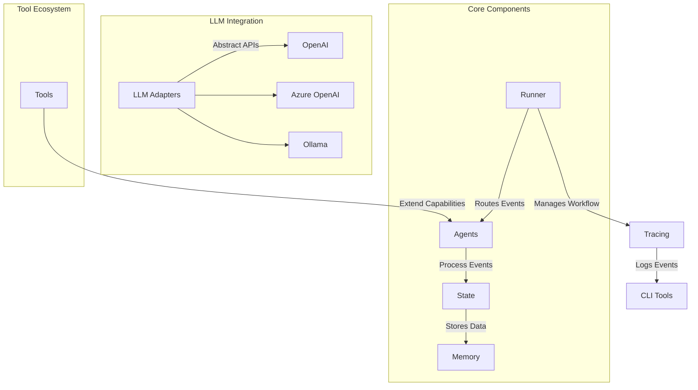
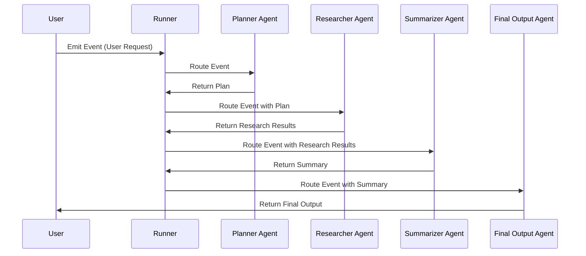

# AgentFlow

[](https://golang.org/doc/devel/release.html)
[](LICENSE)
[](https://deepwiki.com/kunalkushwaha/agentflow)


AgentFlow is a Go framework for building AI agent systems. It provides core abstractions for event-based workflows, agent coordination, and tracing capabilities, enabling the creation of sophisticated multi-agent applications.

## Why AgentFlow?

AgentFlow is designed for developers who want to:
- Build intelligent, event-driven workflows.
- Integrate multiple agents and tools into a cohesive system.
- Leverage LLMs (Large Language Models) like OpenAI, Azure OpenAI, and Ollama.
- Create modular, extensible, and observable AI systems.

Whether you're prototyping a single-agent application or orchestrating a complex multi-agent workflow, AgentFlow provides the tools and abstractions to get started quickly.

## Features

- **Event-driven Architecture**: Process events through configurable orchestration patterns.
- **Multi-modal Orchestration**: Choose between route (single-agent) or collaborate (multi-agent) execution modes.
- **Deterministic Workflow Agents**: Build pipelines with SequentialAgent, ParallelAgent, and LoopAgent.
- **LLM Integration**: Abstract any LLM backend via unified ModelProvider interface (Azure OpenAI, OpenAI, Ollama).
- **Tool Ecosystem**: Extend agent capabilities with function tool registry.
- **Observability**: Comprehensive tracing and callback hooks at key lifecycle points.
- **Memory Management**: Both short-term session storage and long-term vector-based memory.
- **CLI Support**: Built-in command-line tools for trace inspection and debugging.

## Getting Started

### Prerequisites

- Go 1.21 or later.
- Basic knowledge of Go programming.
- (Optional) API keys for LLMs like OpenAI or Azure OpenAI.

### Installation

```bash
go get github.com/kunalkushwaha/agentflow@latest
```

### Running Your First Example

1. Clone the repository:
   ```bash
   git clone https://github.com/kunalkushwaha/agentflow.git
   cd agentflow
   ```

2. Navigate to the `examples` folder and choose an example to run:
   ```bash
   cd examples/multi_agent
   go run main.go
   ```

3. Explore the [examples README](examples/README.md) for more use cases.

## Contributing to AgentFlow

We welcome contributions from the community! Here's how you can get involved:

### Setting Up Your Development Environment

1. Fork the repository and clone your fork:
   ```bash
   git clone https://github.com/<your-username>/agentflow.git
   cd agentflow
   ```

2. Install dependencies:
   ```bash
   go mod tidy
   ```

3. Run tests to ensure everything is working:
   ```bash
   go test ./...
   ```

### Contribution Guidelines

- **Coding Standards**: Follow Go best practices and ensure your code is well-documented.
- **Submitting Pull Requests**: Create a feature branch, commit your changes, and open a pull request.
- **Reporting Issues**: Use the GitHub issue tracker to report bugs or suggest features.

### Development Tips

- Use the `agentcli` CLI tool for debugging and trace inspection.
- Explore the `examples` folder to understand how different components work together.
- Refer to the [Developer Guide](docs/DevGuide.md) for in-depth documentation.

## Project Structure

```
agentflow/
├── cmd/
│   └── agentcli/           # CLI tools for trace inspection
├── internal/               # Core framework code
│   ├── core/               # Core abstractions (Event, State, Runner)
│   ├── orchestrator/       # Orchestration strategies
│   ├── agents/             # Workflow agent implementations
│   ├── llm/                # LLM adapters and interfaces
│   ├── tools/              # Tool registry and implementations
│   └── memory/             # Memory and session services
├── examples/               # Example implementations
├── docs/                   # Documentation
└── benchmarks/             # Performance benchmarks
```

### Folder Descriptions

- **cmd/**: Contains CLI tools like `agentcli` for trace inspection.
- **internal/**: Core framework components, including agents, orchestrators, and LLM adapters.
- **examples/**: Ready-to-run examples demonstrating various use cases.
- **docs/**: Comprehensive documentation for developers and contributors.
- **benchmarks/**: Performance benchmarks for different components.

## Documentation

- [Developer Guide](docs/DevGuide.md): Comprehensive guide to using the framework.
- [Tracing Guide](docs/TracingGuide.md): Details on the tracing system.
- [Architecture Overview](docs/Architecture.md): High-level architecture overview.
- [Project Roadmap](docs/ROADMAP.md): Development timeline and upcoming features.

## Architecture Overview

To help you understand how AgentFlow works, here is a high-level architecture diagram:



### Workflow Example

Here is an example of how events flow through a multi-agent workflow:



These diagrams provide a visual representation of how AgentFlow components interact and how workflows are executed.

## Call to Action

- **Explore Examples**: Check out the [examples folder](examples/README.md) to see AgentFlow in action.
- **Contribute**: Help us improve AgentFlow by contributing code, reporting issues, or suggesting features.
- **Join the Community**: Share your feedback and ideas to shape the future of AgentFlow.

---

AgentFlow is under active development. We look forward to your contributions and feedback to make it even better!
