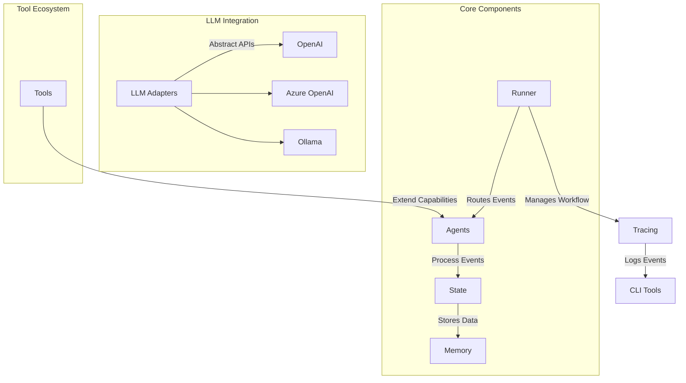
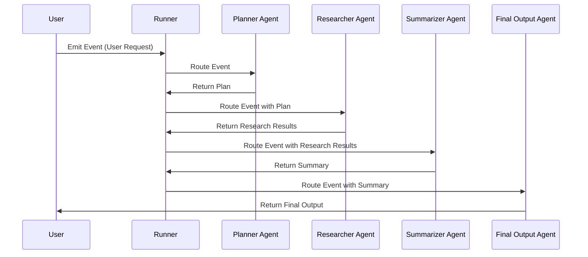

# AgentFlow

[](https://golang.org/doc/devel/release.html)
[](LICENSE)
[](https://deepwiki.com/kunalkushwaha/agentflow)

AgentFlow is a modern Go framework for building AI agent systems with unified capability-based composition. It provides powerful abstractions for event-driven workflows, agent orchestration, and comprehensive observability, enabling rapid development of sophisticated multi-agent applications.

## Why AgentFlow?

AgentFlow is designed for developers who want to:
- **Build with Modern Patterns**: Unified agent builder with capability-based composition
- **Scale Intelligently**: Event-driven workflows with full orchestration support  
- **Integrate Seamlessly**: LLMs (OpenAI, Azure, Ollama, Anthropic) and MCP tool ecosystems
- **Deploy Confidently**: Production-ready scaffolding with built-in error handling and observability
- **Develop Rapidly**: CLI tool generates working multi-agent projects in seconds

Whether you're prototyping a single intelligent agent or orchestrating complex multi-agent workflows, AgentFlow provides enterprise-grade tools and abstractions to accelerate development.

## ✨ Key Features

### **🏗️ Unified Agent Builder System**
- **Capability Composition**: Mix and match LLM, MCP, Cache, Metrics, and custom capabilities
- **Flexible Architecture**: Build simple agents or complex multi-capability systems
- **Type-Safe Configuration**: Compile-time validation of agent configurations

### **🚀 Production-Ready CLI Scaffolding**
- **Instant Project Generation**: `agentcli create` generates working multi-agent projects
- **🧠 MCP-Aware Agents**: Generated agents automatically discover tools and let LLM decide usage
- **Full Orchestration**: Complete agent chains with automatic routing and error handling
- **Modern Configuration**: Unified `agentflow.toml` with provider-specific settings

### **🔗 Advanced Orchestration**
- **Event-Driven Architecture**: Full Runner + RouteOrchestrator pattern
- **Multi-Agent Workflows**: Seamless routing between specialized agents  
- **Session Management**: Built-in state management and workflow tracking

### **🛠️ Enterprise Features**
- **Error Resilience**: Specialized handlers for validation, timeout, and critical failures
- **Observability**: Comprehensive tracing, metrics, and callback hooks
- **MCP Integration**: Full Model Context Protocol support for dynamic tool discovery
- **Memory Systems**: Short-term state and long-term vector-based memory
- **Configuration Management**: Environment-aware settings with validation

## 🔧 Model Context Protocol (MCP) Integration

AgentFlow provides comprehensive MCP integration, enabling your agents to dynamically discover and use external tools from multiple MCP servers. This powerful feature allows agents to access real-time data, perform web searches, interact with databases, and much more.

### Quick MCP Setup (30 seconds)

```go
import "github.com/kunalkushwaha/agentflow/core"

// 1. Initialize MCP with auto-discovery
core.QuickStartMCP()

// 2. Create MCP-aware agent  
agent, err := core.NewMCPAgent("research-agent", llmProvider)

// 3. Agent automatically discovers and uses available tools
state := core.NewState()
state.Set("query", "search for latest AI developments")
result, err := agent.Run(ctx, state)
```

### MCP Features

- **🔍 Dynamic Tool Discovery**: Automatically find and connect to MCP servers
- **🔗 Multi-Server Support**: Connect to multiple tool providers simultaneously  
- **⚡ Intelligent Caching**: Cache tool results for enhanced performance
- **🏗️ Production Ready**: Connection pooling, retries, load balancing, metrics
- **🤖 LLM Integration**: Agents intelligently select appropriate tools using LLM reasoning
- **📊 Comprehensive Monitoring**: Health checks, metrics, and observability

### MCP Usage Patterns

#### **Level 1: Basic MCP**
```go
// Simple setup with defaults
core.QuickStartMCP()
agent, _ := core.NewMCPAgent("agent", llmProvider)
```

#### **Level 2: MCP + Caching**  
```go
// Enhanced performance with caching
core.InitializeMCPWithCache(mcpConfig, cacheConfig)
agent, _ := core.NewMCPAgentWithCache("agent", llmProvider)
```

#### **Level 3: Production MCP**
```go
// Enterprise-grade with all features
core.InitializeProductionMCP(ctx, productionConfig) 
agent, _ := core.NewProductionMCPAgent("agent", llmProvider, productionConfig)
```

### MCP Documentation

- **[📖 MCP API Usage Guide](docs/MCP_API_Usage_Guide.md)** - Complete integration guide with examples
- **[⚡ MCP Quick Reference](docs/MCP_API_Quick_Reference.md)** - Developer cheat sheet  
- **[🔄 MCP Migration Guide](docs/MCP_API_Migration_Guide.md)** - Upgrade from previous versions
- **[🏗️ MCP Examples](examples/mcp_integration/)** - Working examples and demos

### MCP Server Configuration

Configure multiple MCP servers for different capabilities:

```go
config := core.DefaultMCPConfig()
config.Servers = []core.MCPServerConfig{
    {Name: "web-tools", Type: "tcp", Host: "localhost", Port: 8811},      // Web search & scraping
    {Name: "data-tools", Type: "tcp", Host: "localhost", Port: 8812},     // Database & APIs  
    {Name: "ai-tools", Type: "stdio", Command: "ai-server", Args: []string{"--config", "ai.yaml"}}, // AI services
}
```

**Supported Protocols**: TCP, STDIO, WebSocket  
**Production Features**: Connection pooling, automatic retries, health monitoring, load balancing

## Getting Started

### Prerequisites

- Go 1.21 or later.
- Basic knowledge of Go programming.
- (Optional) API keys for LLMs like OpenAI or Azure OpenAI.

### Installation

Add AgentFlow to your Go project:

```bash
go get github.com/kunalkushwaha/agentflow@latest
```

### Quick Start - MCP-Enabled Agent

Create an intelligent agent that can use external tools via MCP:

```go
package main

import (
    "context"
    "fmt"
    "log"

    "github.com/kunalkushwaha/agentflow/core"
)

func main() {
    // 1. Initialize MCP (discovers tools automatically)
    if err := core.QuickStartMCP(); err != nil {
        log.Fatal(err)
    }
    defer core.ShutdownMCP()

    // 2. Create your LLM provider
    llmProvider := &YourLLMProvider{} // OpenAI, Ollama, etc.

    // 3. Create MCP-aware agent
    agent, err := core.NewMCPAgent("research-agent", llmProvider)
    if err != nil {
        log.Fatal(err)
    }

    // 4. Agent intelligently selects and uses tools
    ctx := context.Background()
    state := core.NewState()
    state.Set("query", "find latest information about Go programming")
    
    result, err := agent.Run(ctx, state)
    if err != nil {
        log.Fatal(err)
    }

    fmt.Printf("Research results: %v\n", result.Get("findings"))
    
    // Agent automatically used appropriate tools like:
    // - web_search for finding articles
    // - content_fetch for retrieving full articles  
    // - summarize for creating concise summaries
}
```

### Quick Start - Using as a Library

Create a simple agent workflow in your Go project:

```go
package main

import (
    "context"
    "fmt"
    "log"
    "time"

    agentflow "github.com/kunalkushwaha/agentflow/core"
)

// SimpleAgent implements agentflow.AgentHandler
type SimpleAgent struct {
    name string
}

func (a *SimpleAgent) Run(ctx context.Context, event agentflow.Event, state agentflow.State) (agentflow.AgentResult, error) {
    agentflow.Logger().Info().
        Str("agent", a.name).
        Str("event_id", event.GetID()).
        Msg("Processing event")

    // Get data from event
    eventData := event.GetData()
    message, ok := eventData["message"]
    if !ok {
        message = "No message provided"
    }

    // Process the message
    response := fmt.Sprintf("%s processed: %v", a.name, message)    // Create output state with response
    outputState := state.Clone()
    outputState.Set("response", response)
    outputState.Set("processed_by", a.name)
    outputState.Set("timestamp", time.Now().Format(time.RFC3339))

    return agentflow.AgentResult{
        OutputState: outputState,
        StartTime:   time.Now(),
        EndTime:     time.Now(),
        Duration:    time.Millisecond * 10,
    }, nil
}

func main() {
    // Set logging level
    agentflow.SetLogLevel(agentflow.INFO)

    // Create agents
    agents := map[string]agentflow.AgentHandler{
        "processor": &SimpleAgent{name: "ProcessorAgent"},
    }

    // Create and start runner with optional tracing
    traceLogger := agentflow.NewInMemoryTraceLogger()
    runner := agentflow.NewRunnerWithConfig(agentflow.RunnerConfig{
        Agents:      agents,
        QueueSize:   10,
        TraceLogger: traceLogger, // Enable tracing
    })

    ctx := context.Background()
    if err := runner.Start(ctx); err != nil {
        log.Fatalf("Failed to start runner: %v", err)
    }
    defer runner.Stop()

    // Create and emit event
    eventData := agentflow.EventData{"message": "Hello AgentFlow!"}
    metadata := map[string]string{
        agentflow.RouteMetadataKey: "processor",
        agentflow.SessionIDKey:     "session-123",
    }
    event := agentflow.NewEvent("processor", eventData, metadata)

    if err := runner.Emit(event); err != nil {
        log.Fatalf("Failed to emit event: %v", err)
    }

    time.Sleep(time.Second * 2) // Wait for processing
    
    // Optional: Retrieve and display trace
    traces, err := runner.DumpTrace("session-123")
    if err == nil && len(traces) > 0 {
        fmt.Printf("Trace captured %d entries\n", len(traces))
    }
    
    fmt.Println("AgentFlow library test completed successfully!")
}
```

### Quick Start - Using AgentCLI

Get started quickly with the AgentFlow CLI to scaffold new projects:

```bash
# Install AgentCLI (if not already available)
go get github.com/kunalkushwaha/agentflow@latest

# Create a new multi-agent project
agentcli create myproject --agents 2 --provider ollama

# Or use interactive mode for guided setup
agentcli create --interactive

# Navigate to your new project
cd myproject

# Run your project with a test message
go run . -m "Hello from AgentFlow!"
```

The `agentcli create` command generates a modern project structure with:
- **Sequential workflow**: agent1 → agent2 → responsible_ai → workflow_finalizer
- **Configuration file**: `agentflow.toml` for LLM provider and MCP server setup
- **MCP Integration**: **Production-ready MCP servers with tool discovery and execution**
- **LLM-Driven Tools**: **Agents automatically discover tools and let LLM decide usage**
- **Specialized error handlers**: validation, timeout, and critical error handling
- **LLM integration**: Pre-configured for OpenAI, Azure, Ollama, or Mock providers
- **Session management**: Automatic session tracking and workflow correlation
- **Modern patterns**: Uses latest factory functions and AgentFlow v0.1.1 APIs
- **Immediate functionality**: Ready-to-run with comprehensive logging and tracing

**Example output with MCP integration:**
```
11:20AM INF Starting unified multi-agent system...
11:20AM INF MCP manager initialized successfully
11:20AM INF Successfully connected to Docker MCP server
11:20AM INF Successfully discovered tools from MCP server server=docker tool_count=3
11:20AM INF Available MCP tool tool_name=docker description="use the docker cli"
11:20AM INF Available MCP tool tool_name=search description="Search DuckDuckGo..."
11:20AM INF Available MCP tool tool_name=fetch_content description="Fetch webpage content..."
11:20AM INF Runner started.
11:20AM INF MCP Tools discovered agent=agent1 tool_count=3
11:20AM INF Executing LLM-requested tools agent=agent1 tool_calls=1
11:20AM INF Executing tool as requested by LLM agent=agent1 tool_name=search
11:20AM INF Tool execution successful agent=agent1 tool_name=search
=== WORKFLOW RESULTS ===
Based on the latest search results, here are the key developments in AI...
=========================
11:20AM INF Multi-agent system completed
```

**Supported providers**: `openai`, `azure`, `ollama`, `mock`  
**Generated files**: `main.go`, `agentflow.toml`, agent files, error handlers, `workflow_finalizer.go`

## AgentCLI Commands

The AgentFlow CLI provides powerful scaffolding and development tools:

### Project Creation
```bash
# Basic project with default settings
agentcli create myproject

# Customize number of agents and provider
agentcli create myproject --agents 3 --provider azure

# Create MCP-enabled project with production tool integration
agentcli create myproject --mcp-production

# Enable MCP with caching for enhanced performance  
agentcli create myproject --mcp --cache

# Interactive mode for guided setup
agentcli create --interactive

# Available flags:
#   --agents, -a        Number of agents to create (default: 2)
#   --provider, -p      LLM provider (openai, azure, ollama, mock)
#   --mcp              Enable MCP integration with basic features
#   --mcp-production   Enable production MCP with all enterprise features  
#   --cache            Enable caching for MCP tool results
#   --metrics          Enable metrics and monitoring
#   --interactive, -i   Interactive setup mode
```

## 🤖 MCP-Aware Agent Generation

AgentFlow's CLI generates **truly intelligent agents** that can discover and use external tools dynamically. Unlike traditional hard-coded integrations, AgentFlow agents let the LLM make smart decisions about tool usage.

### How MCP-Aware Agents Work

1. **🔍 Tool Discovery**: Agents automatically connect to MCP servers and discover available tools
2. **📋 Schema Presentation**: Tool descriptions and schemas are presented to the LLM in prompts  
3. **🧠 LLM Decision Making**: The LLM analyzes the user query and decides which tools (if any) to use
4. **⚡ Dynamic Execution**: Selected tools are executed via MCP protocol with LLM-provided arguments
5. **🔄 Result Integration**: Tool results are incorporated into the final agent response

### Example: Smart Tool Selection

```bash
# Agent analyzes query and chooses appropriate tools
./myproject -m "search for latest Docker tutorials"
# → LLM chooses 'search' tool with query="latest Docker tutorials"

./myproject -m "list running containers"  
# → LLM chooses 'docker' tool with args=["ps"]

./myproject -m "explain quantum computing"
# → LLM uses no tools, provides direct explanation
```

### Generated Agent Capabilities

**🧠 Intelligent Tool Selection**: No hard-coded rules - LLM decides which tools are relevant  
**📊 Multiple Tool Support**: Can use multiple tools in sequence to answer complex queries  
**🔄 Dynamic Arguments**: LLM constructs proper tool arguments based on user context  
**🛡️ Error Resilience**: Graceful handling of tool failures with fallback responses  
**📝 Rich Integration**: Tool results seamlessly integrated into natural language responses

### Generated Project Features
- **Modern Architecture**: Uses AgentFlow v0.1.1 with factory patterns
- **Zero Configuration**: Works immediately with mock provider
- **LLM Ready**: Pre-configured for production LLM providers
- **MCP Integration**: Optionally includes MCP tool discovery and multi-server setup
- **Error Resilience**: Comprehensive error handling and recovery
- **Workflow Patterns**: Sequential agent chains with proper completion detection
- **Session Tracking**: Built-in correlation and tracing support

## Contributing to AgentFlow

We welcome contributions from the community! Here's how you can get involved:

### Setting Up Your Development Environment

1. Fork the repository and clone your fork:
   ```bash
   git clone https://github.com/<your-username>/agentflow.git
   cd agentflow
   ```

2. Install dependencies:
   ```bash
   go mod tidy
   ```

3. Run tests to ensure everything is working:
   ```bash
   go test ./...
   ```

### Contribution Guidelines

- **Coding Standards**: Follow Go best practices and ensure your code is well-documented.
- **Submitting Pull Requests**: Create a feature branch, commit your changes, and open a pull request.
- **Reporting Issues**: Use the GitHub issue tracker to report bugs or suggest features.

### Development Tips

- Use `agentcli create --interactive` to quickly scaffold a new AgentFlow project with guided setup
- Use `agentcli create myproject --provider ollama` for local development without API keys
- Explore the generated `agentflow.toml` file to understand configuration options
- Check generated agent files for modern AgentFlow patterns and LLM integration examples
- Use the generated error handlers as templates for custom error handling logic
- Refer to the [Developer Guide](docs/DevGuide.md) for in-depth documentation and advanced patterns

## Project Structure

```
agentflow/
├── cmd/
│   └── agentcli/           # CLI tools for trace inspection
├── core/                   # Public API - Core abstractions (Event, State, Runner, AgentHandler)
├── internal/               # Internal framework implementation
│   ├── core/               # Internal core logic
│   ├── orchestrator/       # Orchestration strategies
│   ├── agents/             # Workflow agent implementations
│   ├── tools/              # Tool registry and implementations
│   └── memory/             # Memory and session services
├── examples/               # Example implementations
├── docs/                   # Documentation
└── integration/            # Integration tests and benchmarks
```

### Key Packages

- **`core/`**: **PUBLIC API** - Import this package in your applications (`github.com/kunalkushwaha/agentflow/core`)
  - `core/mcp.go`: Complete MCP integration API (interfaces, factories, configuration)
  - `core/mcp_agent.go`: MCP-aware agent implementation
  - `core/agent.go`: Core agent abstractions
  - `core/factory.go`: Agent and runner factories
- **`internal/`**: Internal implementation details (not importable by external projects)
- **`examples/`**: Ready-to-run examples demonstrating various use cases
- **`docs/`**: Comprehensive documentation for developers and contributors

### Import Path

For external projects, use:
```go
import agentflow "github.com/kunalkushwaha/agentflow/core"
```

## Documentation

### Core Framework
- [Developer Guide](docs/DevGuide.md): Comprehensive guide to using the framework.
- [Tracing Guide](docs/TracingGuide.md): Details on the tracing system.
- [Architecture Overview](docs/Architecture.md): High-level architecture overview.
- [Project Roadmap](docs/ROADMAP.md): Development timeline and upcoming features.

### MCP Integration (Model Context Protocol)
- **[📖 MCP API Usage Guide](docs/MCP_API_Usage_Guide.md)**: Complete integration guide with examples
- **[⚡ MCP Quick Reference](docs/MCP_API_Quick_Reference.md)**: Developer cheat sheet for rapid development
- **[🔄 MCP Migration Guide](docs/MCP_API_Migration_Guide.md)**: Upgrade guide from previous versions
- **[🏗️ MCP Technical Design](docs/MCP_Public_API_Design.md)**: Technical architecture and design decisions
- **[📚 Complete Documentation Index](docs/README.md)**: Full documentation navigation

### Examples & Tutorials
- **[🚀 MCP Examples](examples/mcp_integration/)**: Working MCP integration examples
- **[🤖 MCP Agent Demo](examples/mcp_agent_demo/)**: Agent-focused MCP usage
- **[🏭 MCP Production Setup](examples/mcp_production_demo/)**: Enterprise-ready configuration

## Architecture Overview

To help you understand how AgentFlow works, here is a high-level architecture diagram:



### Workflow Example

Here is an example of how events flow through a multi-agent workflow:



These diagrams provide a visual representation of how AgentFlow components interact and how workflows are executed.

## Call to Action

- **Explore Examples**: Check out the [examples folder](examples/README.md) to see AgentFlow in action.
- **Contribute**: Help us improve AgentFlow by contributing code, reporting issues, or suggesting features.
- **Join the Community**: Share your feedback and ideas to shape the future of AgentFlow.

---

AgentFlow is under active development. We look forward to your contributions and feedback to make it even better!
