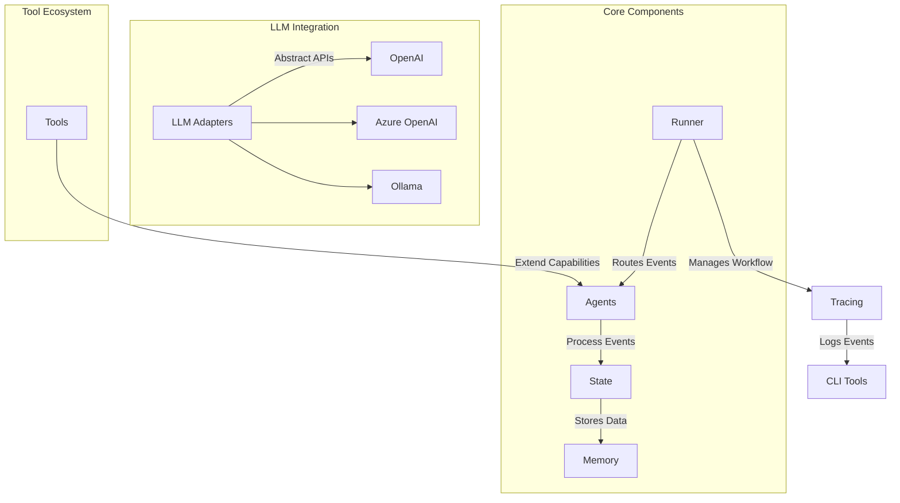
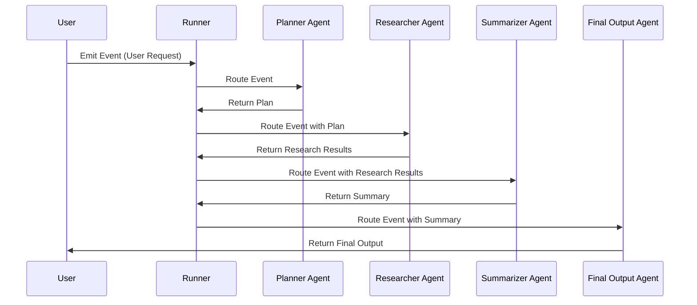

# AgentFlow

[](https://golang.org/doc/devel/release.html)
[](LICENSE)
[](https://deepwiki.com/kunalkushwaha/agentflow)


AgentFlow is a Go framework for building AI agent systems. It provides core abstractions for event-based workflows, agent coordination, and tracing capabilities, enabling the creation of sophisticated multi-agent applications.

## Why AgentFlow?

AgentFlow is designed for developers who want to:
- Build intelligent, event-driven workflows.
- Integrate multiple agents and tools into a cohesive system.
- Leverage LLMs (Large Language Models) like OpenAI, Azure OpenAI, and Ollama.
- Create modular, extensible, and observable AI systems.

Whether you're prototyping a single-agent application or orchestrating a complex multi-agent workflow, AgentFlow provides the tools and abstractions to get started quickly.

## Features

- **Event-driven Architecture**: Process events through configurable orchestration patterns.
- **Multi-modal Orchestration**: Choose between route (single-agent) or collaborate (multi-agent) execution modes.
- **Deterministic Workflow Agents**: Build pipelines with SequentialAgent, ParallelAgent, and LoopAgent.
- **LLM Integration**: Abstract any LLM backend via unified ModelProvider interface (Azure OpenAI, OpenAI, Ollama).
- **Tool Ecosystem**: Extend agent capabilities with function tool registry.
- **Observability**: Comprehensive tracing and callback hooks at key lifecycle points.
- **Memory Management**: Both short-term session storage and long-term vector-based memory.
- **Project Scaffolding**: Built-in `agentcli create` command generates production-ready multi-agent projects with modern patterns.
- **Configuration Management**: Centralized `agentflow.toml` for LLM providers, error routing, and system settings.
- **Error Resilience**: Specialized error handlers for validation, timeout, and critical failures.
- **MCP Integration**: Full Model Context Protocol support for dynamic tool discovery and multi-server connections.

## 🔧 Model Context Protocol (MCP) Integration

AgentFlow provides comprehensive MCP integration, enabling your agents to dynamically discover and use external tools from multiple MCP servers. This powerful feature allows agents to access real-time data, perform web searches, interact with databases, and much more.

### Quick MCP Setup (30 seconds)

```go
import "github.com/kunalkushwaha/agentflow/core"

// 1. Initialize MCP with auto-discovery
core.QuickStartMCP()

// 2. Create MCP-aware agent  
agent, err := core.NewMCPAgent("research-agent", llmProvider)

// 3. Agent automatically discovers and uses available tools
state := core.NewState()
state.Set("query", "search for latest AI developments")
result, err := agent.Run(ctx, state)
```

### MCP Features

- **🔍 Dynamic Tool Discovery**: Automatically find and connect to MCP servers
- **🔗 Multi-Server Support**: Connect to multiple tool providers simultaneously  
- **⚡ Intelligent Caching**: Cache tool results for enhanced performance
- **🏗️ Production Ready**: Connection pooling, retries, load balancing, metrics
- **🤖 LLM Integration**: Agents intelligently select appropriate tools using LLM reasoning
- **📊 Comprehensive Monitoring**: Health checks, metrics, and observability

### MCP Usage Patterns

#### **Level 1: Basic MCP**
```go
// Simple setup with defaults
core.QuickStartMCP()
agent, _ := core.NewMCPAgent("agent", llmProvider)
```

#### **Level 2: MCP + Caching**  
```go
// Enhanced performance with caching
core.InitializeMCPWithCache(mcpConfig, cacheConfig)
agent, _ := core.NewMCPAgentWithCache("agent", llmProvider)
```

#### **Level 3: Production MCP**
```go
// Enterprise-grade with all features
core.InitializeProductionMCP(ctx, productionConfig) 
agent, _ := core.NewProductionMCPAgent("agent", llmProvider, productionConfig)
```

### MCP Documentation

- **[📖 MCP API Usage Guide](docs/MCP_API_Usage_Guide.md)** - Complete integration guide with examples
- **[⚡ MCP Quick Reference](docs/MCP_API_Quick_Reference.md)** - Developer cheat sheet  
- **[🔄 MCP Migration Guide](docs/MCP_API_Migration_Guide.md)** - Upgrade from previous versions
- **[🏗️ MCP Examples](examples/mcp_integration/)** - Working examples and demos

### MCP Server Configuration

Configure multiple MCP servers for different capabilities:

```go
config := core.DefaultMCPConfig()
config.Servers = []core.MCPServerConfig{
    {Name: "web-tools", Type: "tcp", Host: "localhost", Port: 8811},      // Web search & scraping
    {Name: "data-tools", Type: "tcp", Host: "localhost", Port: 8812},     // Database & APIs  
    {Name: "ai-tools", Type: "stdio", Command: "ai-server", Args: []string{"--config", "ai.yaml"}}, // AI services
}
```

**Supported Protocols**: TCP, STDIO, WebSocket  
**Production Features**: Connection pooling, automatic retries, health monitoring, load balancing

## Getting Started

### Prerequisites

- Go 1.21 or later.
- Basic knowledge of Go programming.
- (Optional) API keys for LLMs like OpenAI or Azure OpenAI.

### Installation

Add AgentFlow to your Go project:

```bash
go get github.com/kunalkushwaha/agentflow@latest
```

### Quick Start - MCP-Enabled Agent

Create an intelligent agent that can use external tools via MCP:

```go
package main

import (
    "context"
    "fmt"
    "log"

    "github.com/kunalkushwaha/agentflow/core"
)

func main() {
    // 1. Initialize MCP (discovers tools automatically)
    if err := core.QuickStartMCP(); err != nil {
        log.Fatal(err)
    }
    defer core.ShutdownMCP()

    // 2. Create your LLM provider
    llmProvider := &YourLLMProvider{} // OpenAI, Ollama, etc.

    // 3. Create MCP-aware agent
    agent, err := core.NewMCPAgent("research-agent", llmProvider)
    if err != nil {
        log.Fatal(err)
    }

    // 4. Agent intelligently selects and uses tools
    ctx := context.Background()
    state := core.NewState()
    state.Set("query", "find latest information about Go programming")
    
    result, err := agent.Run(ctx, state)
    if err != nil {
        log.Fatal(err)
    }

    fmt.Printf("Research results: %v\n", result.Get("findings"))
    
    // Agent automatically used appropriate tools like:
    // - web_search for finding articles
    // - content_fetch for retrieving full articles  
    // - summarize for creating concise summaries
}
```

### Quick Start - Using as a Library

Create a simple agent workflow in your Go project:

```go
package main

import (
    "context"
    "fmt"
    "log"
    "time"

    agentflow "github.com/kunalkushwaha/agentflow/core"
)

// SimpleAgent implements agentflow.AgentHandler
type SimpleAgent struct {
    name string
}

func (a *SimpleAgent) Run(ctx context.Context, event agentflow.Event, state agentflow.State) (agentflow.AgentResult, error) {
    agentflow.Logger().Info().
        Str("agent", a.name).
        Str("event_id", event.GetID()).
        Msg("Processing event")

    // Get data from event
    eventData := event.GetData()
    message, ok := eventData["message"]
    if !ok {
        message = "No message provided"
    }

    // Process the message
    response := fmt.Sprintf("%s processed: %v", a.name, message)    // Create output state with response
    outputState := state.Clone()
    outputState.Set("response", response)
    outputState.Set("processed_by", a.name)
    outputState.Set("timestamp", time.Now().Format(time.RFC3339))

    return agentflow.AgentResult{
        OutputState: outputState,
        StartTime:   time.Now(),
        EndTime:     time.Now(),
        Duration:    time.Millisecond * 10,
    }, nil
}

func main() {
    // Set logging level
    agentflow.SetLogLevel(agentflow.INFO)

    // Create agents
    agents := map[string]agentflow.AgentHandler{
        "processor": &SimpleAgent{name: "ProcessorAgent"},
    }

    // Create and start runner with optional tracing
    traceLogger := agentflow.NewInMemoryTraceLogger()
    runner := agentflow.NewRunnerWithConfig(agentflow.RunnerConfig{
        Agents:      agents,
        QueueSize:   10,
        TraceLogger: traceLogger, // Enable tracing
    })

    ctx := context.Background()
    if err := runner.Start(ctx); err != nil {
        log.Fatalf("Failed to start runner: %v", err)
    }
    defer runner.Stop()

    // Create and emit event
    eventData := agentflow.EventData{"message": "Hello AgentFlow!"}
    metadata := map[string]string{
        agentflow.RouteMetadataKey: "processor",
        agentflow.SessionIDKey:     "session-123",
    }
    event := agentflow.NewEvent("processor", eventData, metadata)

    if err := runner.Emit(event); err != nil {
        log.Fatalf("Failed to emit event: %v", err)
    }

    time.Sleep(time.Second * 2) // Wait for processing
    
    // Optional: Retrieve and display trace
    traces, err := runner.DumpTrace("session-123")
    if err == nil && len(traces) > 0 {
        fmt.Printf("Trace captured %d entries\n", len(traces))
    }
    
    fmt.Println("AgentFlow library test completed successfully!")
}
```

### Quick Start - Using AgentCLI

Get started quickly with the AgentFlow CLI to scaffold new projects:

```bash
# Install AgentCLI (if not already available)
go get github.com/kunalkushwaha/agentflow@latest

# Create a new multi-agent project
agentcli create myproject --agents 2 --provider ollama

# Or use interactive mode for guided setup
agentcli create --interactive

# Navigate to your new project
cd myproject

# Run your project with a test message
go run . -m "Hello from AgentFlow!"
```

The `agentcli create` command generates a modern project structure with:
- **Sequential workflow**: agent1 → agent2 → responsible_ai → workflow_finalizer
- **Configuration file**: `agentflow.toml` for LLM provider and error routing setup
- **MCP Integration**: Pre-configured MCP servers and tool discovery (when `--mcp` flag used)
- **Specialized error handlers**: validation, timeout, and critical error handling
- **LLM integration**: Pre-configured for OpenAI, Azure, Ollama, or Mock providers
- **Session management**: Automatic session tracking and workflow correlation
- **Modern patterns**: Uses latest factory functions and AgentFlow v0.1.1 APIs
- **Immediate functionality**: Ready-to-run with comprehensive logging and tracing

**Example output:**
```
4:35PM INF Starting multi-agent system...
4:35PM INF Using message from -m flag input="Hello from AgentFlow!"
4:35PM INF Loaded AgentFlow configuration config_provider=ollama
4:35PM INF Emitting initial event to start workflow session_id=session-20250531-163537
=== WORKFLOW RESULTS ===
Processing completed by agent chain with sentiment analysis and safety checks.
=========================
4:35PM INF Workflow completed, shutting down...
```

**Supported providers**: `openai`, `azure`, `ollama`, `mock`  
**Generated files**: `main.go`, `agentflow.toml`, agent files, error handlers, `workflow_finalizer.go`

## AgentCLI Commands

The AgentFlow CLI provides powerful scaffolding and development tools:

### Project Creation
```bash
# Basic project with default settings
agentcli create myproject

# Customize number of agents and provider
agentcli create myproject --agents 3 --provider azure

# Create MCP-enabled project with tool integration (coming soon)
agentcli create myproject --mcp --tools web,data,ai

# Interactive mode for guided setup
agentcli create --interactive

# Available flags:
#   --agents, -a        Number of agents to create (default: 2)
#   --provider, -p      LLM provider (openai, azure, ollama, mock)
#   --mcp              Enable MCP integration (coming soon)
#   --tools            MCP tool categories to include (coming soon)
#   --interactive, -i   Interactive setup mode
```

### Generated Project Features
- **Modern Architecture**: Uses AgentFlow v0.1.1 with factory patterns
- **Zero Configuration**: Works immediately with mock provider
- **LLM Ready**: Pre-configured for production LLM providers
- **MCP Integration**: Optionally includes MCP tool discovery and multi-server setup
- **Error Resilience**: Comprehensive error handling and recovery
- **Workflow Patterns**: Sequential agent chains with proper completion detection
- **Session Tracking**: Built-in correlation and tracing support

## Contributing to AgentFlow

We welcome contributions from the community! Here's how you can get involved:

### Setting Up Your Development Environment

1. Fork the repository and clone your fork:
   ```bash
   git clone https://github.com/<your-username>/agentflow.git
   cd agentflow
   ```

2. Install dependencies:
   ```bash
   go mod tidy
   ```

3. Run tests to ensure everything is working:
   ```bash
   go test ./...
   ```

### Contribution Guidelines

- **Coding Standards**: Follow Go best practices and ensure your code is well-documented.
- **Submitting Pull Requests**: Create a feature branch, commit your changes, and open a pull request.
- **Reporting Issues**: Use the GitHub issue tracker to report bugs or suggest features.

### Development Tips

- Use `agentcli create --interactive` to quickly scaffold a new AgentFlow project with guided setup
- Use `agentcli create myproject --provider ollama` for local development without API keys
- Explore the generated `agentflow.toml` file to understand configuration options
- Check generated agent files for modern AgentFlow patterns and LLM integration examples
- Use the generated error handlers as templates for custom error handling logic
- Refer to the [Developer Guide](docs/DevGuide.md) for in-depth documentation and advanced patterns

## Project Structure

```
agentflow/
├── cmd/
│   └── agentcli/           # CLI tools for trace inspection
├── core/                   # Public API - Core abstractions (Event, State, Runner, AgentHandler)
├── internal/               # Internal framework implementation
│   ├── core/               # Internal core logic
│   ├── orchestrator/       # Orchestration strategies
│   ├── agents/             # Workflow agent implementations
│   ├── tools/              # Tool registry and implementations
│   └── memory/             # Memory and session services
├── examples/               # Example implementations
├── docs/                   # Documentation
└── integration/            # Integration tests and benchmarks
```

### Key Packages

- **`core/`**: **PUBLIC API** - Import this package in your applications (`github.com/kunalkushwaha/agentflow/core`)
  - `core/mcp.go`: Complete MCP integration API (interfaces, factories, configuration)
  - `core/mcp_agent.go`: MCP-aware agent implementation
  - `core/agent.go`: Core agent abstractions
  - `core/factory.go`: Agent and runner factories
- **`internal/`**: Internal implementation details (not importable by external projects)
- **`examples/`**: Ready-to-run examples demonstrating various use cases
- **`docs/`**: Comprehensive documentation for developers and contributors

### Import Path

For external projects, use:
```go
import agentflow "github.com/kunalkushwaha/agentflow/core"
```

## Documentation

### Core Framework
- [Developer Guide](docs/DevGuide.md): Comprehensive guide to using the framework.
- [Tracing Guide](docs/TracingGuide.md): Details on the tracing system.
- [Architecture Overview](docs/Architecture.md): High-level architecture overview.
- [Project Roadmap](docs/ROADMAP.md): Development timeline and upcoming features.

### MCP Integration (Model Context Protocol)
- **[📖 MCP API Usage Guide](docs/MCP_API_Usage_Guide.md)**: Complete integration guide with examples
- **[⚡ MCP Quick Reference](docs/MCP_API_Quick_Reference.md)**: Developer cheat sheet for rapid development
- **[🔄 MCP Migration Guide](docs/MCP_API_Migration_Guide.md)**: Upgrade guide from previous versions
- **[🏗️ MCP Technical Design](docs/MCP_Public_API_Design.md)**: Technical architecture and design decisions
- **[📚 Complete Documentation Index](docs/README.md)**: Full documentation navigation

### Examples & Tutorials
- **[🚀 MCP Examples](examples/mcp_integration/)**: Working MCP integration examples
- **[🤖 MCP Agent Demo](examples/mcp_agent_demo/)**: Agent-focused MCP usage
- **[🏭 MCP Production Setup](examples/mcp_production_demo/)**: Enterprise-ready configuration

## Architecture Overview

To help you understand how AgentFlow works, here is a high-level architecture diagram:



### Workflow Example

Here is an example of how events flow through a multi-agent workflow:



These diagrams provide a visual representation of how AgentFlow components interact and how workflows are executed.

## Call to Action

- **Explore Examples**: Check out the [examples folder](examples/README.md) to see AgentFlow in action.
- **Contribute**: Help us improve AgentFlow by contributing code, reporting issues, or suggesting features.
- **Join the Community**: Share your feedback and ideas to shape the future of AgentFlow.

---

AgentFlow is under active development. We look forward to your contributions and feedback to make it even better!
