# AgentFlow

[](https://golang.org/doc/devel/release.html)
[](LICENSE)
[](https://github.com/kunalkushwaha/agentflow)
[](https://goreportcard.com/report/github.com/kunalkushwaha/agentflow)

**The Go SDK for building production-ready multi-agent AI systems**

AgentFlow makes it incredibly simple to build and prototype AI agent workflows in Go. From a single intelligent agent to complex multi-agent orchestrations, AgentFlow provides the SDK foundation and scaffolding you need to develop AI applications with production-ready patterns.

**📚 [Complete Documentation](docs/README.md) | 🚀 [Quick Start](docs/README.md#quick-start) | 💡 [Examples](docs/guides/Examples.md)**

---

**Table of Contents:**
- [Quick Start](#quick-start-30-seconds) - Get running in 30 seconds
- [Core Concepts](#core-concepts--features) - Agents, Tools, Workflows
- [Architecture](#core-architecture) - How AgentFlow works
- [Documentation](#-documentation) - Complete guides and references
- [Use Cases](#use-cases--success-stories) - Real-world applications
- [Get Help](#get-help) - Community and support

---

## What Makes AgentFlow Special?

- **30-Second Setup**: Generate working multi-agent systems with a single CLI command
- **Multi-Agent Orchestration**: Build collaborative, sequential, loop, and mixed workflows with automatic visual diagrams
- **Memory & RAG**: Persistent memory with vector search and Retrieval-Augmented Generation
- **Workflow Visualization**: Automatic Mermaid diagram generation for all orchestration patterns
- **LLM-Driven Tool Discovery**: Agents automatically find and use the right tools via MCP protocol  
- **Production-First**: Built-in error handling, fault tolerance, and enterprise patterns
- **Unified API**: One clean interface for all LLM providers, memory systems, and tool integrations
- **Zero Dependencies**: Pure Go with minimal external requirements
- **Developer Experience**: From prototype to production without rewriting code

## Why AgentFlow?

AgentFlow is designed for developers who want to:

- **Build intelligent, event-driven workflows** with configurable orchestration patterns (collaborative, sequential, loop, mixed)
- **Create agents with memory and knowledge** using vector search, RAG, and persistent storage
- **Visualize complex multi-agent systems** with automatic Mermaid diagram generation
- **Integrate multiple agents and tools** into cohesive, observable systems with built-in fault tolerance
- **Leverage any LLM provider** (OpenAI, Azure OpenAI, Ollama) through unified interfaces
- **Create modular, extensible AI systems** that scale from prototype to production
- **Focus on business logic** while AgentFlow handles the infrastructure complexity

Whether you're prototyping a single-agent application or orchestrating complex multi-agent workflows, AgentFlow provides the tools and abstractions to get started quickly and scale reliably.

## Perfect for

> **⚠️ Alpha Stage**: AgentFlow has production-grade features but APIs are rapidly evolving. Use for prototyping and research while we stabilize for production.

- **Intelligent Assistants**: Build research assistants, coding helpers, and customer support agents
- **Knowledge-Based Systems**: Create RAG-powered agents with document understanding and persistent memory
- **Multi-Agent Workflows**: Create collaborative agent systems that work together on complex tasks
- **Tool-Using Agents**: Develop agents that can use external tools and APIs to accomplish tasks
- **Enterprise AI Systems**: Build production-ready AI systems with monitoring, metrics, and fault tolerance
- **Prototype to Production**: Start simple and scale to complex multi-agent systems without rewriting code  

## Quick Start (30 seconds)

### 1. Install AgentFlow
```bash
go install github.com/kunalkushwaha/agentflow/cmd/agentcli@latest
```

### 2. Create Your First Multi-Agent System
```bash
# Generate a sequential pipeline with configuration-based orchestration
agentcli create data-pipeline \
  --orchestration-mode sequential \
  --agents 3 \
  --orchestration-timeout 45 \
  --memory-enabled \
  --visualize

cd data-pipeline

# Run with any message - agents work together intelligently
go run . -m "research AI trends and provide comprehensive analysis"
```

### 3. Add Memory & RAG Capabilities
```bash
# Create agents with persistent memory and knowledge base
agentcli create knowledge-assistant \
  --memory-enabled \
  --memory-provider pgvector \
  --rag-enabled \
  --embedding-provider openai \
  --hybrid-search

cd knowledge-assistant

# Start database (auto-generated Docker setup)
docker compose up -d
./setup.sh

# Agents now remember conversations and can search knowledge
go run . -m "Remember that I prefer morning meetings"
go run . -m "What do you know about my meeting preferences?"
```

### 3. Try Different Orchestration Patterns
```bash
# Sequential processing pipeline
agentcli create data-pipeline \
  --orchestration-mode sequential \
  --sequential-agents "collector,processor,formatter" \
  --visualize

# Loop-based workflow with conditions
agentcli create quality-loop \
  --orchestration-mode loop \
  --loop-agent "quality-checker" \
  --max-iterations 5 \
  --visualize

# Mixed collaborative + sequential workflow  
agentcli create complex-workflow \
  --orchestration-mode mixed \
  --collaborative-agents "analyzer,validator" \
  --sequential-agents "processor,reporter" \
  --visualize-output "docs/diagrams"
```

### 4. See the Magic
```
11:20AM INF Multi-agent orchestration started mode=collaborative agents=3
11:20AM INF MCP Tools discovered agent=researcher tool_count=3
11:20AM INF MCP Tools discovered agent=analyzer tool_count=5
11:20AM INF Workflow visualization generated file=workflow.mmd
11:20AM INF Collaborative execution: all agents processing in parallel
11:20AM INF Tool execution successful agent=researcher tool_name=web_search
11:20AM INF Analysis complete agent=analyzer confidence=0.95
11:20AM INF Validation passed agent=validator quality_score=0.89

=== COLLABORATIVE WORKFLOW RESULTS ===
🔍 Research (by researcher): Found 15 sources on AI trends for 2024...
📊 Analysis (by analyzer): Key patterns identified: LLMs, multimodality, agents...  
✅ Validation (by validator): High confidence in findings, sources verified...

📈 COMPREHENSIVE AI TRENDS REPORT:
Based on collaborative analysis, here are the top AI trends...
=========================
```

**Generated Mermaid Diagram (`workflow.mmd`):**

```mermaid
---
title: Collaborative Research System
---
flowchart TD
    INPUT["🎯 Research Task"]
    RESEARCHER["🤖 Researcher<br/>Gathers Information"]
    ANALYZER["🤖 Analyzer<br/>Processes Data"]
    VALIDATOR["🤖 Validator<br/>Ensures Quality"]
    OUTPUT["✅ Comprehensive Analysis"]
    
    INPUT --> RESEARCHER
    INPUT --> ANALYZER
    INPUT --> VALIDATOR
    RESEARCHER --> OUTPUT
    ANALYZER --> OUTPUT
    VALIDATOR --> OUTPUT
```


**Plus**: Check `workflow.mmd` for a beautiful Mermaid diagram showing how your agents collaborate!

That's it! You have a working multi-agent system with visual workflows that can search, analyze, and validate information collaboratively.

## Core Concepts & Features

AgentFlow is built around three fundamental concepts that enable powerful AI workflows:

### **Agents**
Smart components that process information and make decisions. [📖 Learn more](docs/guides/AgentBasics.md)
```go
// Create an agent that can use any LLM
agent, err := core.NewMCPAgent("research-agent", llmProvider)
```

### **Tools** 
External capabilities agents can discover and use via MCP (Model Context Protocol). [🔧 Tool Integration Guide](docs/guides/ToolIntegration.md)
```go
// Agents automatically discover tools like web search, databases, APIs
core.QuickStartMCP() // Auto-discovers available tools
```

### **Workflows**
Orchestrated sequences of agents working together with multiple execution patterns. [💡 See Examples](docs/guides/Examples.md) | [📖 Orchestration Guide](docs/multi_agent_orchestration.md)
```go
// Collaborative: All agents process events in parallel
runner := core.NewOrchestrationBuilder(core.OrchestrationCollaborate).
    WithAgents(agents).Build()

// Sequential: Agents process in pipeline order
runner := core.NewOrchestrationBuilder(core.OrchestrationSequential).
    WithAgents(agents).Build()

// Loop: Single agent repeats until conditions are met
runner := core.NewOrchestrationBuilder(core.OrchestrationLoop).
    WithAgents(singleAgent).WithMaxIterations(10).Build()
```

### **Key Features**

#### **🤝 Multi-Agent Orchestration**
- **Collaborative**: Multiple agents process events in parallel, with result aggregation
- **Sequential**: Agents process events in pipeline order, passing state between stages  
- **Mixed**: Hybrid workflows combining collaborative and sequential phases
- **Loop**: Iterative processing with conditional termination
- **Route**: Intelligent event routing to appropriate specialized agents
- **Visual Workflows**: Auto-generated Mermaid diagrams showing agent interactions

#### **⚡ Event-Driven Architecture**
- Process events through configurable orchestration patterns
- Built-in error handling, retry mechanisms, and circuit breakers
- Comprehensive state management and context passing

#### ** LLM Integration**
- Unified `ModelProvider` interface for any LLM backend
- Support for Azure OpenAI, OpenAI, Ollama, and custom providers
- Provider-agnostic agent development

#### **🛠️ Tool Ecosystem**
- Dynamic tool discovery via Model Context Protocol (MCP)
- Function tool registry for extending agent capabilities
- Multi-server MCP connections for distributed tools

#### ** Observability & Monitoring**
- Comprehensive tracing at every lifecycle point
- Callback hooks for custom monitoring and debugging
- Built-in metrics and health checks

#### ** Memory Management**
- Short-term session storage for workflow state
- Long-term vector-based memory for persistent knowledge
- Configurable caching strategies

#### ** Production Ready**
- **Project Scaffolding**: `agentcli create` generates production-ready projects
- **Configuration Management**: Centralized `agentflow.toml` for all settings
- **Error Resilience**: Specialized handlers for validation, timeout, and critical failures
- **MCP Integration**: Full Model Context Protocol support with connection pooling
- **MCP Health Monitoring**: Built-in health checks for MCP server connections

## Intelligent Tool Usage

AgentFlow agents don't just follow scripts - they **think** and **decide** which tools to use:

```bash
# Agent analyzes query and chooses appropriate tools
./my-app -m "search for latest Docker tutorials"
# → Agent chooses 'web_search' with query="latest Docker tutorials"

./my-app -m "list running containers"  
# → Agent chooses 'docker' tool with args=["ps"]

./my-app -m "explain quantum computing"
# → Agent uses no tools, provides direct explanation
```

**The LLM decides what tools to use, when to use them, and how to combine results.**

## Core Architecture

AgentFlow's power comes from its layered, event-driven architecture that separates concerns while enabling seamless integration:

```
┌─────────────────────────────────────────────────────┐
│                   Your Application                  │
├─────────────────────────────────────────────────────┤
│    Agent Layer (Multi-Agent Orchestration)          │
│  ┌─────────────┬─────────────┬─────────────────────┐│
│  │   Agent1    │   Agent2    │   ResponsibleAI     ││
│  │ (Research)  │ (Analysis)  │   (Validation)      ││
│  └─────────────┴─────────────┴─────────────────────┘│
├─────────────────────────────────────────────────────┤
│    Workflow Layer (Event-Driven Orchestration)      │
│  ┌─────────────┬─────────────┬─────────────────────┐│
│  │   Runner    │ Orchestrator│   Config Manager    ││
│  │ (Execution) │ (Routing)   │   (agentflow.toml)  ││
│  └─────────────┴─────────────┴─────────────────────┘│
├─────────────────────────────────────────────────────┤
│    Memory Layer (Knowledge & Context)               │
│  ┌─────────────┬─────────────┬─────────────────────┐│
│  │   Memory    │ Embeddings  │      RAG            ││
│  │ (Storage)   │ (Vectors)   │   (Retrieval)       ││
│  └─────────────┴─────────────┴─────────────────────┘│
├─────────────────────────────────────────────────────┤
│    Tool Layer (MCP Integration)                     │
│  ┌─────────────┬─────────────┬─────────────────────┐│
│  │ MCP Manager │ Tool Registry│  Cache & Metrics   ││
│  │(Discovery)  │ (Execution) │  (Performance)      ││
│  └─────────────┴─────────────┴─────────────────────┘│
├─────────────────────────────────────────────────────┤
│    LLM Layer (Provider Abstraction)                 │
│  ┌─────────────┬─────────────┬─────────────────────┐│
│  │   OpenAI    │   Ollama    │     Azure AI        ││
│  │   Adapter   │   Adapter   │     Adapter         ││
│  └─────────────┴─────────────┴─────────────────────┘│
├─────────────────────────────────────────────────────┤
│    Storage Layer (Persistent Data)                  │
│  ┌─────────────┬─────────────┬─────────────────────┐│
│  │  PgVector   │   Weaviate  │    In-Memory        ││
│  │ (Postgres)  │ (Vector DB) │   (Development)     ││
│  └─────────────┴─────────────┴─────────────────────┘│
└─────────────────────────────────────────────────────┘
```

### Why This Architecture Matters

#### **1. Event-Driven Foundation**
```go
// Events flow through the system, enabling loose coupling
event := agentflow.NewEvent("research", query, metadata)
runner.Emit(event) // Automatic routing to appropriate agents
```

- **Scalability**: Add agents without changing existing code
- **Reliability**: Built-in error handling and retry mechanisms  
- **Observability**: Every event is tracked and traceable

#### **2. Intelligent Agent Orchestration**
```go
// Agents work together automatically
agent1 → agent2 → responsible_ai → finalizer
```

- **Sequential**: Step-by-step processing (research → analysis → summary)
- **Parallel**: Concurrent processing for speed
- **Conditional**: Smart routing based on content and context

#### **3. MCP-Powered Tool Discovery**
```go
// Tools are discovered dynamically, not hard-coded
core.QuickStartMCP() // Finds all available tools
agent.Run(query)     // LLM chooses which tools to use
```

- **Flexibility**: Connect to any MCP server (web, database, cloud APIs)
- **Intelligence**: LLM decides tool usage based on context
- **Extensibility**: Add new tools without code changes

#### **4. Provider-Agnostic LLM Integration**
```go
// Unified interface for all LLM providers
llm := core.NewOpenAIAdapter(config)    // or Ollama, Azure, etc.
agent := core.NewMCPAgent("agent", llm) // Same interface
```

- **Flexibility**: Switch providers without rewriting agents
- **Testing**: Use mock providers for development
- **Cost Control**: Choose appropriate providers per use case

### Key Design Principles

#### **Composition Over Configuration**
```go
// Build complex agents from simple capabilities
agent := core.NewAgentBuilder("research").
    WithLLM(llmProvider).
    WithMCP().
    WithCache().
    WithMetrics().
    Build()
```

#### **Observable by Default**
```go
// Every operation generates traces and metrics
traces := runner.DumpTrace("session-123")
metrics := agent.GetMetrics()
runner.RegisterCallback(core.HookAfterAgentRun, myCallback)
```

#### **Production-Ready**
```go
// Built-in patterns for enterprise deployment
- Circuit breakers and retries
- Connection pooling and load balancing  
- Input validation and rate limiting
- Health checks and monitoring
```

### **Performance Characteristics**

- **Fast Startup**: Agents initialize in ~3μs
- **Low Memory**: ~5KB per agent average footprint
- **High Throughput**: Handle thousands of concurrent events
- **Horizontal Scaling**: Add agents/servers without bottlenecks

This architecture enables AgentFlow to be simple for beginners yet powerful enough for enterprise production workloads.

## Supported Integrations

### **LLM Providers (Unified Interface)**
- **Azure OpenAI** (Enterprise-ready, default provider)
- **OpenAI** (GPT-4, GPT-3.5-turbo)  
- **Ollama** (Local models, privacy-focused)
- **Mock** (Development/testing environments)
- **Custom Providers** (Implement `ModelProvider` interface)

### **Tool Ecosystem (via MCP)**
- **Web Tools**: Search engines, content scraping, URL fetching
- **Development Tools**: Docker containers, GitHub integration, code execution
- **Database Tools**: PostgreSQL, MongoDB, Redis, vector databases
- **Cloud APIs**: AWS services, GCP tools, Azure integrations
- **Custom Tools**: Build your own MCP servers for any capability

### **Memory & Storage**
- **Vector Databases**: Weaviate, pgvector for long-term memory
- **Session Storage**: In-memory state management for workflows
- **MCP Tool Caching**: Configurable caching with multiple backends

### **Orchestration Patterns**
- **Sequential Workflows**: Step-by-step agent processing
- **Parallel Execution**: Concurrent agent operations
- **Conditional Routing**: Smart agent selection based on context
- **Error Recovery**: Automatic fallback and retry strategies

## Examples & Tutorials

### Quick Examples

**Simple Agent (5 lines)**
```go
package main

import "github.com/kunalkushwaha/agentflow/core"

func main() {
    core.QuickStartMCP()
    agent, _ := core.NewMCPAgent("helper", &MockLLM{})
    state := core.NewState()
    state.Set("query", "help me understand Go interfaces")
    result, _ := agent.Run(context.Background(), state)
}
```

**Multi-Agent Orchestration**
```go
// Collaborative workflow - agents work in parallel
agents := map[string]core.AgentHandler{
    "researcher": core.ConvertAgentToHandler(researchAgent),
    "analyzer":   core.ConvertAgentToHandler(analysisAgent),
    "validator":  core.ConvertAgentToHandler(validationAgent),
}

// Build collaborative orchestration
runner := core.NewOrchestrationBuilder(core.OrchestrationCollaborate).
    WithAgents(agents).
    WithTimeout(60 * time.Second).
    WithFailureThreshold(0.8).
    Build()

// Or use the fluent AgentBuilder API
workflow := core.NewAgent("research-pipeline").
    WithLLM(llmProvider).
    WithMCP(mcpManager).
    WithParallelAgents(researchAgent, analysisAgent, validationAgent).
    Build()
```

**Sequential Pipeline**
```go
// Create processing pipeline with visual diagram
pipeline := core.NewComposition("data-processing").
    WithAgents(inputAgent, transformAgent, outputAgent).
    AsSequential().
    WithTimeout(2 * time.Minute)

// Generate workflow diagram
if pipeline.CanVisualize() {
    diagram := pipeline.GenerateMermaidDiagram()
    fmt.Println(diagram) // Beautiful workflow visualization!
}
```

## 📚 Documentation

AgentFlow provides comprehensive documentation for both users and contributors:

### **For Users Building AI Applications**
- **[🚀 Quick Start](docs/README.md#quick-start)** - Get running in 5 minutes
- **[📖 Agent Fundamentals](docs/guides/AgentBasics.md)** - Core concepts and patterns
- **[🤝 Multi-Agent Orchestration](docs/multi_agent_orchestration.md)** - Collaborative, sequential, and mixed workflows
- **[📊 Workflow Visualization](docs/visualization_guide.md)** - Visual diagrams and documentation generation
- **[💡 Examples & Tutorials](docs/guides/Examples.md)** - Practical code samples
- **[🔧 Tool Integration](docs/guides/ToolIntegration.md)** - MCP protocol and dynamic discovery
- **[⚙️ Configuration](docs/guides/Configuration.md)** - Project and agent setup
- **[⚡ Performance Optimization](docs/guides/Performance.md)** - Speed and efficiency
- **[🛠️ Custom Tools](docs/guides/CustomTools.md)** - Build your own MCP servers

### **For AgentFlow Contributors**
- **[👨‍💻 Contributor Guide](docs/contributors/ContributorGuide.md)** - Development setup
- **[🏗️ Architecture Deep Dive](docs/contributors/CoreVsInternal.md)** - Internal structure
- **[🧪 Testing Strategy](docs/contributors/Testing.md)** - Testing best practices
- **[📝 Code Style](docs/contributors/CodeStyle.md)** - Standards and conventions

### **API Reference**
- **[📖 Core Package](docs/api/core.md)** - Complete public API
- **[🤖 Agent Interface](docs/api/agents.md)** - Agent types and methods
- **[🔧 MCP Integration](docs/api/mcp.md)** - Tool discovery APIs
- **[⌨️ CLI Commands](docs/api/cli.md)** - agentcli reference

### Learn More
- **[📚 Complete Documentation](docs/README.md)** - User guides, API reference, and contributor docs
- **[🚀 Getting Started](docs/guides/AgentBasics.md)** - Build your first agent in 5 minutes
- **[💡 Examples & Tutorials](docs/guides/Examples.md)** - Practical code samples and patterns
- **[🏗️ Architecture Overview](docs/Architecture.md)** - How AgentFlow works under the hood
- **[📖 API Reference](docs/api/core.md)** - Complete API documentation
- **[🚀 Production Guide](docs/guides/Production.md)** - Deploy and scale AgentFlow apps

## What You Can Build with AgentFlow

### **Research & Analysis Systems**
Build intelligent research pipelines that gather, analyze, and synthesize information from multiple sources.
```bash
agentcli create research-bot --agents 3  # Uses Azure OpenAI by default
# → AgentFlow provides: Multi-agent scaffolding, MCP tool integration, error handling
# → You implement: Search strategies, analysis algorithms, data processing logic
# → Result: Automated research system with web search, data analysis, and reporting
```

### **Customer Support Automation**
Create AI-powered support systems that classify, route, and respond to customer inquiries.
```bash  
agentcli create support-ai --agents 4  # Uses Azure OpenAI by default
# → AgentFlow provides: Sequential workflow, error recovery, observability
# → You implement: Ticket classification, routing rules, response generation
# → Result: Intelligent support system that handles inquiries automatically
```

### **Data Processing Pipelines**
Develop automated document processing and data transformation workflows.
```bash
agentcli create data-pipeline --agents 2 --mcp-production
# → AgentFlow provides: MCP-enabled agents, tool discovery, production patterns
# → You implement: Document parsing, validation rules, business logic
# → Result: Scalable data processing system with automatic tool selection
```

### **E-commerce Intelligence**
Build inventory management and recommendation systems with real-time decision making.
```bash
agentcli create inventory-ai --agents 3 --mcp-enabled --with-cache
# → AgentFlow provides: Cached multi-agent workflow, performance optimization
# → You implement: Inventory algorithms, prediction models, business rules
# → Result: Intelligent e-commerce system with automated inventory decisions
```

## Developer Experience

### **Comprehensive Documentation**
Complete guides for every skill level - from [first-time users](docs/guides/AgentBasics.md) to [advanced patterns](docs/guides/Performance.md) to [contributor onboarding](docs/contributors/ContributorGuide.md).

### **Beautiful Defaults**
Every generated project works out of the box with sensible configurations, comprehensive logging, and production-ready patterns.

### **Progressive Complexity**
Start simple and add capabilities as you grow:
```bash
# Development - Basic setup
agentcli create myapp-basic --provider mock

# Enhanced - Add MCP tools  
agentcli create myapp-enhanced --mcp-enabled

# Production - Full features
agentcli create myapp-production --mcp-production --with-cache --with-metrics
```

*Note: Each command creates a separate project. To upgrade an existing project, modify the `agentflow.toml` configuration file or copy code between projects.*

### **Built-in Observability**
Every agent comes with tracing, metrics, and debugging tools:
```go
// Automatic session tracking
traces, _ := runner.DumpTrace("session-123")

// Built-in metrics
metrics := agent.GetMetrics()

// Hook into any lifecycle event
runner.RegisterCallback(core.HookAfterAgentRun, myCallback)
```

## Production Features

### ⚡️ **Enterprise Ready**
- **Error Recovery**: Circuit breakers, retries, fallback strategies
- **Security**: Input validation, rate limiting, audit trails
- **Scalability**: Horizontal scaling, load balancing, connection pooling
- **Monitoring**: MCP health checks, metrics collection, observability hooks

### **CI/CD Integration**
```yaml
# GitHub Actions example
- name: Test AgentFlow App
  run: |
    go test ./...
    go run . -m "health check" --validate
```

## Join the AgentFlow Community

### **Contributing**
We welcome contributions! Check out our [Contributor Guide](docs/contributors/ContributorGuide.md) to get started.

```bash
# Quick contribution setup
git clone https://github.com/kunalkushwaha/agentflow.git
cd agentflow
go mod tidy
go test ./...
```

### **Get Help**
- **[📚 Documentation Hub](docs/README.md)** - Complete guides and API reference
- **[👨‍💻 User Guides](docs/guides/)** - Step-by-step tutorials and best practices
- **[🛠️ Contributor Guide](docs/contributors/ContributorGuide.md)** - How to contribute to AgentFlow
- **[💬 GitHub Discussions](https://github.com/kunalkushwaha/agentflow/discussions)** - Community Q&A
- **[🐛 Issues](https://github.com/kunalkushwaha/agentflow/issues)** - Bug reports and feature requests
- **[⭐ GitHub](https://github.com/kunalkushwaha/agentflow)** - Star the project!

### **Roadmap**
- **Multi-modal agent support**: Enable agents to work with text, images, audio, and other data types
- **Distributed agent clusters**: Scale agent workflows across multiple machines and networks
- **Docker configurations and cloud deployment guides**: Simplified deployment tooling

## **Built by Developer, for Developers**

AgentFlow started as a hobby project for building tooling for AI-enabled applications and became good enough to share with other developers. I'm open-sourcing it because I believe every developer should have access to production-grade AI agent tools.

**Join us in building the future of AI development in Go.**

---

[](https://github.com/kunalkushwaha/agentflow)
[](https://golang.org/)
[](LICENSE)

**⭐ Star us on GitHub** · **🐛 Report Issues** · **💡 Suggest Features** · **🤝 Contribute**
