# AgentFlow Architecture

This Go-based AI Agent Framework provides production-ready, multi-modal agent capabilities with Model Context Protocol (MCP) integration. It combines ultra-fast agent instantiation, dynamic tool discovery, advanced multi-agent orchestration patterns, automatic workflow visualization, and comprehensive developer tooling for building scalable agent workflows.

## System Architecture Overview

```mermaid
flowchart TB
    %% User and External Systems
    subgraph External ["🌐 External Layer"]
        USER[👤 User/Application]
        LLMS[🧠 LLM Providers<br/>Azure OpenAI, OpenAI, Ollama]
        MCPSVR[🔧 MCP Servers<br/>Docker, Web, DB, Custom]
        MONITOR[📊 Monitoring<br/>Prometheus, Traces]
    end

    %% CLI and Project Management
    subgraph CLI ["⚡ CLI & Project Management"]
        AGENTCLI[agentcli]
        SCAFFOLD[🏗️ Project Scaffolding]
        CONFIG[📄 agentflow.toml]
        VISUALIZE[📊 Workflow Visualization<br/>Mermaid Diagrams]
    end

    %% Core AgentFlow System
    subgraph Core ["🏛️ AgentFlow Core System"]
        
        %% Application Layer
        subgraph AppLayer ["Application Layer"]
            APP[🎯 Your Application]
            RUNNER[🎬 Runner Engine]
        end
        
        %% Agent Orchestration Layer  
        subgraph AgentLayer ["🤖 Agent Orchestration Layer"]
            AGENT1[Agent 1<br/>Research]
            AGENT2[Agent 2<br/>Analysis] 
            AGENT3[Agent N<br/>Validation]
            ORCHESTRATOR[🎭 Multi-Agent Orchestrator<br/>Collaborative/Sequential/Loop/Mixed]
        end
        
        %% Workflow Management Layer
        subgraph WorkflowLayer ["⚙️ Workflow Management Layer"]
            EVENTSYS[📧 Event System]
            STATEMGR[💾 State Manager]
            SESSIONMGR[🗂️ Session Manager]
            CALLBACKS[🔗 Callback Hooks]
        end
        
        %% Tool Integration Layer
        subgraph ToolLayer ["🛠️ Tool Integration Layer"]
            MCPMGR[🔄 MCP Manager]
            TOOLREG[📋 Tool Registry]
            TOOLCACHE[💨 Tool Cache]
            DISCOVERY[🔍 Tool Discovery]
        end
        
        %% LLM Abstraction Layer
        subgraph LLMLayer ["🧠 LLM Abstraction Layer"]
            AZUREADAPTER[Azure OpenAI<br/>Adapter]
            OPENAIADAPTER[OpenAI<br/>Adapter]
            OLLAMAADAPTER[Ollama<br/>Adapter]
            CUSTOMADAPTER[Custom<br/>Adapter]
            MOCKADAPTER[Mock<br/>Adapter]
        end
        
        %% Infrastructure Layer
        subgraph InfraLayer ["🏗️ Infrastructure Layer"]
            CONNPOOL[🔗 Connection Pool]
            CACHEMGR[💾 Cache Manager]
            METRICS[📈 Metrics Collector]
            HEALTHCHK[❤️ Health Checker]
            CIRCUITB[⚡ Circuit Breaker]
            RETRY[🔄 Retry Logic]
        end
    end

    %% User Interactions
    USER --> AGENTCLI
    USER --> APP
    
    %% CLI Operations
    AGENTCLI --> SCAFFOLD
    SCAFFOLD --> CONFIG
    CONFIG --> APP
    
    %% Application Flow
    APP --> RUNNER
    RUNNER --> EVENTSYS
    EVENTSYS --> ORCHESTRATOR
    
    %% Agent Orchestration
    ORCHESTRATOR --> AGENT1
    ORCHESTRATOR --> AGENT2
    ORCHESTRATOR --> AGENT3
    
    %% Agent Dependencies
    AGENT1 --> STATEMGR
    AGENT2 --> STATEMGR  
    AGENT3 --> STATEMGR
    AGENT1 --> SESSIONMGR
    AGENT2 --> SESSIONMGR
    AGENT3 --> SESSIONMGR
    
    %% Tool Integration
    AGENT1 --> MCPMGR
    AGENT2 --> MCPMGR
    AGENT3 --> MCPMGR
    MCPMGR --> TOOLREG
    MCPMGR --> DISCOVERY
    MCPMGR --> TOOLCACHE
    
    %% LLM Integration
    AGENT1 --> AZUREADAPTER
    AGENT2 --> OPENAIADAPTER
    AGENT3 --> OLLAMAADAPTER
    
    %% External LLM Connections
    AZUREADAPTER --> LLMS
    OPENAIADAPTER --> LLMS
    OLLAMAADAPTER --> LLMS
    CUSTOMADAPTER --> LLMS
    
    %% External Tool Connections
    DISCOVERY --> MCPSVR
    TOOLREG --> MCPSVR
    
    %% Infrastructure Support
    MCPMGR --> CONNPOOL
    AZUREADAPTER --> CONNPOOL
    OPENAIADAPTER --> CONNPOOL
    OLLAMAADAPTER --> CONNPOOL
    
    TOOLCACHE --> CACHEMGR
    RUNNER --> METRICS
    AGENT1 --> CALLBACKS
    AGENT2 --> CALLBACKS
    AGENT3 --> CALLBACKS
    
    MCPMGR --> HEALTHCHK
    AZUREADAPTER --> CIRCUITB
    OPENAIADAPTER --> RETRY
    
    %% Monitoring
    METRICS --> MONITOR
    HEALTHCHK --> MONITOR
    CALLBACKS --> MONITOR

    %% Styling
    classDef userLayer fill:#e1f5fe,stroke:#01579b,stroke-width:2px,color:#000
    classDef cliLayer fill:#f3e5f5,stroke:#4a148c,stroke-width:2px,color:#000  
    classDef appLayer fill:#e8f5e8,stroke:#1b5e20,stroke-width:2px,color:#000
    classDef agentLayer fill:#fff3e0,stroke:#e65100,stroke-width:2px,color:#000
    classDef workflowLayer fill:#fce4ec,stroke:#880e4f,stroke-width:2px,color:#000
    classDef toolLayer fill:#e0f2f1,stroke:#004d40,stroke-width:2px,color:#000
    classDef llmLayer fill:#e8eaf6,stroke:#1a237e,stroke-width:2px,color:#000
    classDef infraLayer fill:#f1f8e9,stroke:#33691e,stroke-width:2px,color:#000
    classDef external fill:#fff8e1,stroke:#ff6f00,stroke-width:2px,color:#000
    
    class USER,LLMS,MCPSVR,MONITOR external
    class AGENTCLI,SCAFFOLD,CONFIG cliLayer
    class APP,RUNNER appLayer
    class AGENT1,AGENT2,AGENT3,ORCHESTRATOR agentLayer
    class EVENTSYS,STATEMGR,SESSIONMGR,CALLBACKS workflowLayer
    class MCPMGR,TOOLREG,TOOLCACHE,DISCOVERY toolLayer
    class AZUREADAPTER,OPENAIADAPTER,OLLAMAADAPTER,CUSTOMADAPTER,MOCKADAPTER llmLayer
    class CONNPOOL,CACHEMGR,METRICS,HEALTHCHK,CIRCUITB,RETRY infraLayer
```



## Data Flow Architecture


## Component Interaction Patterns


## Multi-Agent Orchestration Patterns

```mermaid
flowchart TD
    subgraph RoutePattern ["🎯 Route Pattern (Single Agent)"]
        ROUTEQUERY[Query] --> ROUTEAGENT[Selected Agent] --> ROUTERESULT[Result]
    end
    
    subgraph CollaboratePattern ["🤝 Collaborate Pattern (Parallel)"]
        COLLABQUERY[Query] --> DISPATCHER[Dispatcher]
        DISPATCHER --> AGENT1[Agent 1]
        DISPATCHER --> AGENT2[Agent 2] 
        DISPATCHER --> AGENT3[Agent 3]
        AGENT1 --> AGGREGATOR[Result Aggregator]
        AGENT2 --> AGGREGATOR
        AGENT3 --> AGGREGATOR
        AGGREGATOR --> COLLABRESULT[Combined Result]
    end
    
    subgraph CoordinatePattern ["🎭 Coordinate Pattern (Sequential)"]
        COORDQUERY[Query] --> RESEARCH[Research Agent]
        RESEARCH --> ANALYSIS[Analysis Agent]
        ANALYSIS --> VALIDATION[Validation Agent]
        VALIDATION --> SUMMARY[Summary Agent]
        SUMMARY --> COORDRESULT[Final Result]
    end
    
    %% Styling
    classDef routeStyle fill:#e3f2fd,stroke:#01579b,stroke-width:2px,color:#000
    classDef collaborateStyle fill:#e8f5e8,stroke:#1b5e20,stroke-width:2px,color:#000  
    classDef coordinateStyle fill:#fff3e0,stroke:#e65100,stroke-width:2px,color:#000
    
    class ROUTEQUERY,ROUTEAGENT,ROUTERESULT routeStyle
    class COLLABQUERY,DISPATCHER,AGENT1,AGENT2,AGENT3,AGGREGATOR,COLLABRESULT collaborateStyle
    class COORDQUERY,RESEARCH,ANALYSIS,VALIDATION,SUMMARY,COORDRESULT coordinateStyle
```



## Architecture Deep Dive

The architecture diagrams above work together with the detailed descriptions below to provide both visual and conceptual understanding of AgentFlow's design:

### **🏛️ Layered Architecture Design**
The **System Architecture Overview** diagram illustrates AgentFlow's **layered approach** with clear separation of concerns. Each layer has distinct responsibilities and clean interfaces:

**🌐 External Layer** - Integration boundaries with the outside world:
- **User/Application**: Entry point for all interactions
- **LLM Providers**: Azure OpenAI (default), OpenAI, Ollama, and custom providers
- **MCP Servers**: Docker, web search, databases, file systems, and custom tools
- **Monitoring Systems**: Prometheus metrics, distributed tracing, and health monitoring

**⚡ CLI & Project Management** - Developer productivity tools:
- **agentcli**: Command-line interface for scaffolding and project management
- **Project Scaffolding**: Generates production-ready projects with best practices
- **Configuration Management**: Centralized `agentflow.toml` for all settings

**🎯 Application Layer** - Your custom business logic:
- **Your Application**: Custom business logic and agent implementations
- **Runner Engine**: Central execution coordinator that manages the entire workflow

**🤖 Agent Orchestration Layer** - Multi-agent coordination:
- **Specialized Agents**: Research, analysis, validation, and custom agents
- **Orchestrator**: Implements route (single), collaborate (parallel), and coordinate (sequential) patterns
- **Intelligent Handoffs**: Automatic agent selection and task delegation

**⚙️ Workflow Management Layer** - Event-driven infrastructure:
- **Event System**: Asynchronous, loosely-coupled communication between components
- **State Manager**: Thread-safe state management with cloning support for concurrent processing
- **Session Manager**: Manages conversation history and multi-turn interactions
- **Callback Hooks**: Extensible hooks for logging, validation, and custom monitoring

**🛠️ Tool Integration Layer** - Dynamic capability discovery:
- **MCP Manager**: Implements Model Context Protocol for dynamic tool integration
- **Tool Registry**: Centralizes available tools and their schemas
- **Tool Cache**: Performance optimization for frequently used tools
- **Discovery Service**: Automatic detection and registration of available tools

**🧠 LLM Abstraction Layer** - Provider-agnostic AI integration:
- **Unified Interface**: Single API for all LLM providers
- **Provider Adapters**: Azure OpenAI, OpenAI, Ollama, Mock, and custom implementations
- **Provider Switching**: Change providers without rewriting agent code
- **Load Balancing**: Distribute requests across multiple provider instances

**🏗️ Infrastructure Layer** - Production-ready patterns:
- **Connection Pooling**: Efficient resource management for LLM and MCP connections
- **Cache Manager**: Multi-level caching for performance optimization
- **Metrics Collector**: Comprehensive telemetry for production monitoring
- **Health Checker**: Built-in health monitoring for MCP servers and connections
- **Circuit Breaker**: Automatic failure detection and recovery
- **Retry Logic**: Intelligent retry strategies with exponential backoff

### **📊 Event-Driven Data Flow**
The **Data Flow Architecture** demonstrates how information moves through AgentFlow's event-driven system:

**📥 Input Processing Pipeline**:
1. **Query Validation**: Input sanitization and safety checks
2. **Event Creation**: Structured event generation with metadata
3. **Event Routing**: Intelligent routing to appropriate agents

**⚙️ Core Processing Engine**:
1. **Agent Selection**: Choose optimal agent(s) based on query type and context
2. **Context Building**: Aggregate conversation history, session state, and relevant data
3. **Tool Selection**: Dynamic discovery and selection of appropriate tools
4. **LLM Processing**: Provider-agnostic AI inference with tool awareness
5. **Tool Execution**: Parallel execution of selected tools with error handling
6. **Response Aggregation**: Intelligent combination of LLM and tool results

**💾 State Management System**:
- **Session State**: Maintains conversation context across interactions
- **Conversation History**: Persistent storage of interaction history
- **Tool Cache**: Performance optimization for repeated tool calls
- **Metrics Store**: Telemetry data for monitoring and analytics

**🌐 External Integration Points**:
- **LLM APIs**: Direct integration with AI providers
- **MCP Tools**: Dynamic tool execution via Model Context Protocol
- **Databases**: Persistent data storage and retrieval
- **External APIs**: Third-party service integration

**📤 Output Processing Pipeline**:
1. **Result Validation**: Ensure response quality and safety
2. **Response Formatting**: Structure output for consumption
3. **State Update**: Persist session changes and metrics
4. **User Response**: Deliver final result to the user

### **🔄 Component Interaction Lifecycle**
The **Component Interaction Patterns** sequence diagram shows the detailed flow during query processing:

**🚀 Initialization Phase**:
- User submits query through application interface
- Runner creates or updates session state
- Event routing determines optimal processing strategy

**🤖 Agent Coordination Phase**:
- Orchestrator assigns tasks to appropriate agents
- Agents retrieve context and conversation history
- Dynamic tool discovery identifies available capabilities

**🧠 Processing Phase**:
- LLM processing with full context and tool awareness
- Conditional tool execution based on LLM decisions
- Iterative refinement with tool results integration

**📊 Completion Phase**:
- State updates and metrics collection
- Result validation and formatting
- Response delivery and session persistence

### **🎭 Multi-Agent Orchestration Strategies**
AgentFlow supports three distinct orchestration patterns, each optimized for different use cases:

**🎯 Route Pattern (Single Agent Dispatch)**:
- **Use Case**: Simple queries, direct responses, single-domain expertise
- **Characteristics**: Fast execution, minimal overhead, direct processing
- **Example**: "What's the weather?" → Weather Agent → Result
- **Benefits**: Low latency, simple debugging, resource efficient

**🤝 Collaborate Pattern (Parallel Processing)**:
- **Use Case**: Multi-faceted queries, high throughput, independent tasks
- **Characteristics**: Parallel execution, result aggregation, concurrent processing
- **Example**: "Research market trends" → [Research Agent + Data Agent + Analysis Agent] → Aggregated Result
- **Benefits**: High throughput, fault tolerance, comprehensive coverage

**🎭 Coordinate Pattern (Sequential Workflow)**:
- **Use Case**: Complex workflows, dependent tasks, multi-step processing
- **Characteristics**: Sequential execution, context passing, workflow orchestration
- **Example**: Query → Research Agent → Analysis Agent → Validation Agent → Summary Agent → Result
- **Benefits**: Quality control, workflow transparency, specialized expertise

### **🔧 Extension and Customization Points**
The architecture provides multiple extension points for customization:

**🧠 LLM Provider Extensions**:
- Implement `ModelProvider` interface for custom AI services
- Add provider-specific optimizations and features
- Support for local models, custom APIs, and specialized AI services

**🛠️ Tool Integration Extensions**:
- Create custom MCP servers for domain-specific tools
- Implement custom tool discovery and execution logic
- Add support for new protocols and service types

**🤖 Agent Pattern Extensions**:
- Implement `AgentHandler` interface for specialized agents
- Create custom orchestration patterns
- Add domain-specific agent behaviors and capabilities

**⚙️ Infrastructure Extensions**:
- Custom caching strategies and storage backends
- Specialized monitoring and alerting integrations
- Custom retry logic and error handling strategies

This comprehensive architecture enables AgentFlow to be simple for beginners yet powerful enough for enterprise production workloads, with clear extension points for customization and scaling.

---

## Core Components Deep Dive

### Agent System Architecture
The heart of AgentFlow is its **Agent** abstraction, which encapsulates sophisticated AI capabilities within a simple, consistent interface:

**🤖 Agent Configuration & Lifecycle**:
- **Agent Profiles**: Pre-configured templates for common use cases (research, analysis, validation)
- **Capability Definitions**: Declarative specification of what each agent can do
- **Tool Permissions**: Fine-grained control over which tools each agent can access
- **Resource Limits**: Memory, timeout, and concurrency constraints per agent

**🧠 Agent Intelligence Layer**:
```go
type Agent interface {
    Execute(ctx context.Context, query string, state *State) (*Result, error)
    GetCapabilities() []string
    GetTools() []string
    Configure(config AgentConfig) error
}
```

**🔄 Agent Builder Pattern**:
The factory pattern enables sophisticated agent composition:
- **Template-Based Creation**: Start from proven agent templates
- **Dynamic Configuration**: Runtime agent customization and tuning
- **Plugin Integration**: Seamless integration of custom capabilities
- **Performance Optimization**: Pre-compiled agent graphs for faster execution

### Orchestrator System Deep Dive
The **Orchestrator** is the sophisticated brain coordinating multiple agents with advanced workflow patterns:

**🎯 Route Pattern Implementation**:
- **Intelligent Agent Selection**: ML-based routing based on query analysis
- **Capability Matching**: Automatic matching of query requirements to agent capabilities
- **Performance Optimization**: Connection pooling and context reuse for selected agents
- **Fallback Strategies**: Graceful degradation when primary agents are unavailable

**🤝 Collaborate Pattern Implementation**:
- **Parallel Execution Engine**: Concurrent agent processing with sophisticated synchronization
- **Result Aggregation Logic**: Smart merging of parallel results with conflict resolution
- **Resource Management**: Dynamic load balancing across available agents
- **Quality Assurance**: Cross-validation between parallel agent results

**🎭 Coordinate Pattern Implementation**:
- **Workflow State Management**: Complex state passing between sequential agents
- **Decision Trees**: Conditional agent routing based on intermediate results
- **Quality Gates**: Validation checkpoints between workflow stages
- **Error Recovery**: Sophisticated error handling with workflow rollback capabilities

### LLM Abstraction Layer Deep Dive
AgentFlow provides a **unified interface** that eliminates vendor lock-in while maximizing each provider's capabilities:

**🔌 Provider Adapters Architecture**:
- **Azure OpenAI Adapter**: Enterprise-grade integration with advanced safety features, content filtering, and compliance tools
- **OpenAI Adapter**: Direct API integration with latest models, function calling, and streaming support
- **Ollama Adapter**: Local LLM execution with model management, GPU optimization, and privacy controls
- **Custom Adapters**: Extensible interface supporting any LLM provider with consistent error handling

**⚡ Advanced Provider Features**:
Each adapter implements sophisticated capabilities:
- **Authentication & Security**: OAuth, API keys, certificate-based auth per provider
- **Request/Response Transformation**: Provider-specific optimization and feature mapping
- **Error Handling & Retry Logic**: Provider-specific error codes and recovery strategies
- **Rate Limiting & Quota Management**: Smart throttling and usage tracking
- **Connection Health**: Circuit breakers and health monitoring per provider
- **Streaming Support**: Real-time response streaming where supported

**🔄 Provider Switching & Load Balancing**:
- **Hot Swapping**: Change providers without restarting agents
- **A/B Testing**: Split traffic across providers for performance comparison
- **Cost Optimization**: Automatic routing to most cost-effective provider for each query
- **Regional Failover**: Geographic provider selection for latency optimization

### Model Context Protocol (MCP) Deep Dive
MCP integration enables **dynamic tool discovery** and execution, transforming AgentFlow into an extensible platform:

**🛠️ MCP Manager Architecture**:
- **Server Connection Management**: Persistent connections to multiple MCP servers with health monitoring
- **Protocol Negotiation**: Automatic capability negotiation and version compatibility
- **Resource Allocation**: Dynamic resource management across MCP server connections
- **Security & Isolation**: Sandboxed tool execution with permission management

**📋 Tool Registry & Discovery**:
- **Dynamic Schema Discovery**: Real-time tool schema detection and validation
- **Capability Indexing**: Smart indexing of tools by function and domain
- **Version Management**: Handle tool updates and schema evolution gracefully
- **Performance Metrics**: Tool execution timing and success rate tracking

**💨 Tool Cache Optimization**:
- **Multi-Level Caching**: Memory, disk, and distributed caching strategies
- **Cache Invalidation**: Smart cache updates when tool schemas change
- **Performance Analytics**: Cache hit rates and performance optimization
- **Resource Management**: Memory-efficient cache with LRU eviction

**❤️ Health Monitoring & Reliability**:
- **Server Health Checks**: Continuous monitoring of MCP server availability
- **Automatic Recovery**: Server reconnection and error recovery strategies
- **Circuit Breaker Integration**: Prevent cascade failures across tool systems
- **Metrics Collection**: Comprehensive tool usage and performance metrics

### Event-Driven Architecture Deep Dive
AgentFlow uses an **sophisticated event-driven pattern** for loose coupling and high performance:

**📧 Event Bus Implementation**:
- **Asynchronous Message Routing**: High-performance, non-blocking message passing
- **Event Type System**: Strongly-typed events with schema validation
- **Priority Queues**: Event prioritization for critical workflows
- **Dead Letter Queues**: Error recovery and replay capabilities

**🔄 Event Processing Pipeline**:
- **Event Validation**: Schema validation and safety checks
- **Event Enrichment**: Automatic context and metadata addition
- **Event Routing**: Intelligent routing based on event content and system state
- **Event Correlation**: Session and workflow correlation across multiple events

**🔗 Event Handlers & Plugins**:
- **Pluggable Processors**: Custom event processing logic
- **Handler Registration**: Dynamic handler registration and lifecycle management
- **Error Boundaries**: Isolated error handling per event handler
- **Performance Monitoring**: Handler execution timing and error rates

### State Management Deep Dive
Sophisticated **state handling** enables complex workflows and conversation continuity:

**💾 Session State Architecture**:
- **Hierarchical State**: User, session, conversation, and agent-level state management
- **State Serialization**: Efficient serialization for persistence and distribution
- **State Cloning**: Thread-safe state copying for concurrent agent processing
- **State Validation**: Schema validation and consistency checks

**🗄️ Conversation History Management**:
- **Efficient Storage**: Compressed conversation history with smart chunking
- **Context Window Management**: Intelligent context selection for LLM processing
- **Memory Optimization**: Automatic cleanup of old conversation data
- **Search & Retrieval**: Fast search across conversation history

**🌐 Global State Coordination**:
- **Shared State**: Cross-agent and cross-session data sharing
- **State Synchronization**: Distributed state consistency across multiple instances
- **State Partitioning**: Performance optimization through state partitioning
- **State Migration**: Version-safe state migration for system updates

### Configuration System Deep Dive
**Hierarchical configuration** supports different deployment scenarios with enterprise-grade flexibility:

**⚙️ Configuration Sources & Precedence**:
1. **Command Line Arguments**: Highest priority for development and debugging
2. **Environment Variables**: Runtime configuration for containerized deployments
3. **Configuration Files**: Structured TOML/YAML for persistent settings
4. **Default Values**: Sensible defaults for quick development setup

**📝 Agent Profile Management**:
- **Template Library**: Curated library of production-ready agent configurations
- **Custom Profiles**: Create and share custom agent configurations
- **Configuration Validation**: Schema validation and dependency checking
- **Hot Reloading**: Dynamic configuration updates without system restart

**🔧 Dynamic Configuration Updates**:
- **Configuration Watching**: Automatic detection of configuration changes
- **Graceful Updates**: Non-disruptive configuration updates for running agents
- **Rollback Capabilities**: Automatic rollback on configuration errors
- **Audit Logging**: Complete audit trail of configuration changes

## Architecture Principles Deep Dive

### 1. **Modularity and Extensibility**
Every component follows **interface-driven design** for maximum flexibility:

**🔌 Interface-First Development**:
- **Clear Contracts**: Well-defined interfaces between all system layers
- **Pluggable Implementations**: Multiple implementations for each interface
- **Version Compatibility**: Backward-compatible interface evolution
- **Testing & Mocking**: Easy unit testing with mock implementations

**🧩 Component Composition**:
- **Dependency Injection**: Configurable component wiring
- **Plugin Architecture**: Runtime plugin loading and management
- **Extension Points**: Clearly defined extension points for customization
- **Third-Party Integration**: Standard patterns for external integrations

### 2. **Production-Ready Patterns**
Built for **enterprise deployment** with battle-tested reliability patterns:

**⚡ Fault Tolerance & Resilience**:
- **Circuit Breakers**: Automatic failure detection and service protection
- **Retry Logic**: Sophisticated retry strategies with exponential backoff and jitter
- **Bulkhead Pattern**: Resource isolation to prevent cascade failures
- **Timeout Management**: Configurable timeouts at every system level

**📊 Observability & Monitoring**:
- **Structured Logging**: JSON-structured logs with correlation IDs
- **Metrics Collection**: Prometheus-compatible metrics for all components
- **Distributed Tracing**: OpenTelemetry integration for request tracing
- **Health Endpoints**: Comprehensive health checks for all system components

**🔒 Security & Compliance**:
- **Input Validation**: Comprehensive input sanitization and validation
- **Credential Management**: Secure credential storage and rotation
- **Audit Logging**: Complete audit trails for compliance requirements
- **Rate Limiting**: Configurable rate limiting and quota enforcement

### 3. **Performance Optimization**
**Speed and efficiency** optimized at every architectural layer:

**⚡ Execution Performance**:
- **Connection Pooling**: Efficient reuse of expensive connections
- **Parallel Processing**: Concurrent execution wherever possible
- **Lazy Loading**: Deferred loading of expensive resources
- **Resource Recycling**: Memory-efficient object reuse patterns

**💾 Memory & Cache Management**:
- **Memory Pools**: Pre-allocated memory for high-frequency operations
- **Multi-Level Caching**: Memory, disk, and distributed caching
- **Cache Warming**: Proactive cache population for better performance
- **Garbage Collection Optimization**: Minimized allocation patterns

**🌐 Network & I/O Optimization**:
- **Request Batching**: Intelligent batching of similar requests
- **Compression**: Automatic compression for network traffic
- **Keep-Alive Connections**: Persistent connections where beneficial
- **Streaming Support**: Memory-efficient streaming for large responses

### 4. **Security and Reliability**
**Security-first approach** with comprehensive protection:

**🛡️ Security Layers**:
- **Input Sanitization**: Multi-layer input validation and sanitization
- **Authentication & Authorization**: Role-based access control (RBAC)
- **Encryption**: End-to-end encryption for sensitive data
- **Security Headers**: Comprehensive security headers for web interfaces

**🔍 Monitoring & Alerting**:
- **Real-Time Monitoring**: Live system health and performance monitoring
- **Anomaly Detection**: ML-based anomaly detection for security threats
- **Alert Management**: Configurable alerting with escalation policies
- **Incident Response**: Automated incident response workflows

**📋 Compliance & Governance**:
- **Data Privacy**: GDPR and CCPA compliance patterns
- **Audit Requirements**: SOC 2 and enterprise audit trail support
- **Data Retention**: Configurable data retention and cleanup policies
- **Regulatory Reporting**: Automated compliance reporting capabilities

---

## 1. Core Execution & Orchestration

- **Runner**: A central execution engine manages `Events`, drives agent workflows, and coordinates calls to LLM providers and MCP tools.  
- **Orchestrator Modes**: Supports high-performance multi-agent patterns—**route** (single dispatch), **collaborate** (parallel cooperation), and **coordinate** (hierarchical delegation)—for flexible agent teamwork.

## 2. Agents & Workflow Primitives

- **AgentHandler Interface**: Primary interface for implementing event-driven agent logic that processes user queries and manages state.
- **Multi-Agent Systems**: Compose specialized agents into teams with intelligent handoffs and collaborative processing pipelines.
- **Universal Agent Pattern**: Agents analyze queries, choose appropriate tools dynamically, and provide comprehensive answers without counter-questions.

## 3. MCP Integration & Tool Ecosystem

- **Model Context Protocol**: Dynamic tool discovery and schema-based tool integration enables agents to find and use any MCP server tools.
- **Tool Discovery**: Automatic detection of available tools via `core.FormatToolsForPrompt()` for intelligent tool selection by LLMs.
- **Tool Execution**: Centralized tool call parsing and execution via `core.ParseAndExecuteToolCalls()` with comprehensive error handling.
- **MCP Servers**: Built-in support for Docker, web search, databases, file systems, and custom MCP servers.

## 4. Model & Provider Integration

- **ModelProvider Adapters**: Abstract any LLM backend—Azure OpenAI (default), OpenAI, Ollama, or custom providers—via a unified interface.
- **Multi-Provider Architecture**: Switch between providers without changing agent code; configure via `agentflow.toml`.
- **Provider-Agnostic Development**: Write agents once, deploy with any supported LLM provider.

## 5. Memory & State Management

- **Session Service**: Manages short-term conversation state (`State`) and event histories (`Session`) per user interaction.
- **State Cloning**: Thread-safe state management with cloning support for concurrent agent processing.
- **Event Tracking**: Comprehensive event correlation and session tracking for debugging and analytics.

## 6. Configuration & Project Management

- **TOML Configuration**: Centralized configuration via `agentflow.toml` for providers, MCP servers, and orchestration settings.
- **CLI Scaffolding**: `agentcli create` generates production-ready projects with current best practices and patterns.
- **Project Templates**: Support for basic agents, multi-agent workflows, and production systems with monitoring.

## 7. Debugging, Callbacks & Monitoring

- **Callbacks**: Register hooks at key lifecycle points (before/after agent runs, tool calls, state changes) for logging and validation.
- **Debug & Trace**: Built-in support for step-by-step execution tracing and session correlation for diagnosing agent decisions.
- **Prometheus Metrics**: Optional metrics integration for production monitoring of agent performance and tool usage.

## 8. Developer Experience & Deployment

- **CLI Tools**: Comprehensive `agentcli` for project creation, scaffolding, and development workflow management.
- **Production Patterns**: Built-in error handling, retry logic, circuit breakers, and input validation.
- **Containerized Deployment**: Docker-ready with support for cloud deployment and scaling patterns.

## 9. Performance & Extensibility

- **Go-Native Efficiency**: Lightweight agent implementation with minimal memory footprint and fast initialization.
- **High-Throughput**: Engineered for concurrency with event-driven architecture and non-blocking tool execution.
- **Plugin Architecture**: Easily extend with new ModelAdapters, MCP servers, custom tools, or orchestration patterns.

## 10. Production Features

- **Error Resilience**: Specialized error handlers for validation, timeout, and critical failures with automatic routing.
- **Session Management**: Built-in session correlation and state management for multi-turn conversations.
- **Observability**: Comprehensive logging, tracing, and metrics for production monitoring and debugging.
- **Responsible AI**: Built-in content safety and validation patterns for production deployments.
