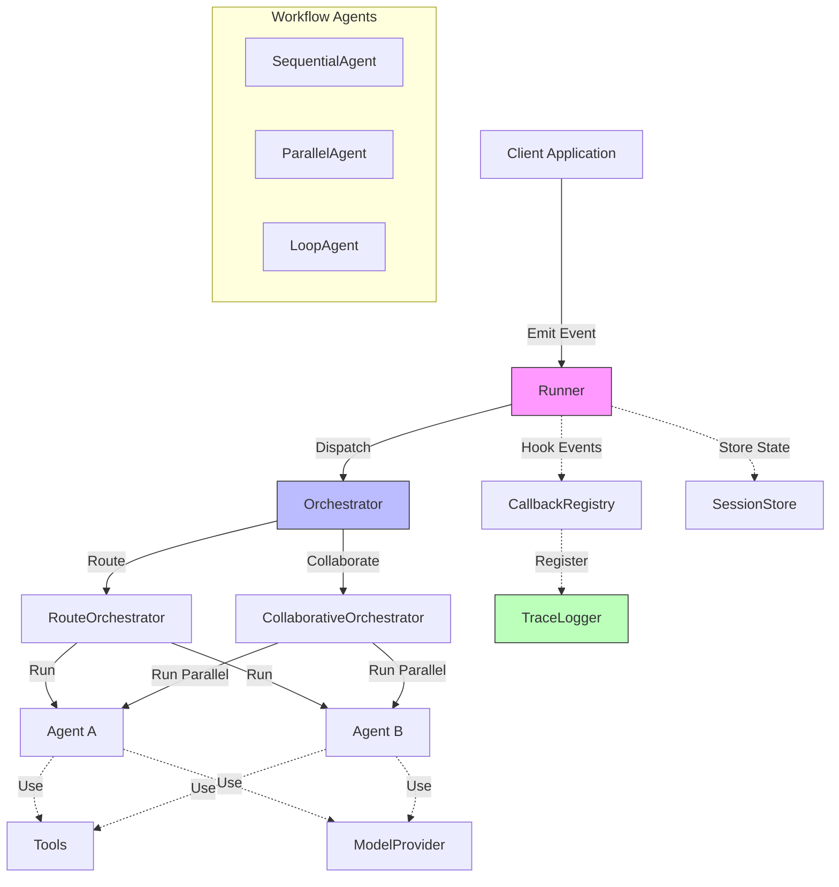

# Agentflow Framework Developer Guide

## Overview
Agentflow is a Go framework for building AI agent systems. It provides core abstractions for event-based workflows, agent coordination, and tracing capabilities. This guide will help you understand the key components and how to use them effectively.



---

## Quick Start (with Factory)

```go
import (
    "context"
    agentflow "github.com/kunalkushwaha/agentflow/core"
)

func main() {
    // Create agents map
    agents := map[string]agentflow.AgentHandler{
        "example-agent": &MyAgent{},
    }

    // Create runner with configuration including tracing
    runner := agentflow.NewRunnerWithConfig(agentflow.RunnerConfig{
        Agents:      agents,
        QueueSize:   100,
        TraceLogger: agentflow.NewInMemoryTraceLogger(),
    })

    // Start the runner
    ctx := context.Background()
    if err := runner.Start(ctx); err != nil {
        panic(err)
    }
    defer runner.Stop()

    // Create and emit an event with session tracking
    eventData := agentflow.EventData{"message": "Hello World"}
    metadata := map[string]string{
        agentflow.RouteMetadataKey: "example-agent",
        agentflow.SessionIDKey:     "demo-session-123",
    }
    event := agentflow.NewEvent("example-agent", eventData, metadata)
    
    runner.Emit(event)
}
```

---

## Core Components

### Interfaces
- **Agent**: Core interface for implementing agent logic.

```go
type Agent interface {
    Run(ctx context.Context, in State) (State, error)
    Name() string
}
```

- **AgentHandler**: Event‑aware interface invoked by the runner.

```go
type AgentHandler interface {
    Run(ctx context.Context, event Event, state State) (AgentResult, error)
}
```

- **Event**: Immutable message container with enhanced methods.

```go
type Event interface {
    GetID() string
    GetData() EventData
    GetMetadata() map[string]string
    GetMetadataValue(key string) (string, bool)
    GetSourceAgentID() string
    GetTargetAgentID() string
}
```

- **State**: Thread‑safe key / metadata store with cloning support.

```go
type State interface {
    Get(key string) (any, bool)
    Set(key string, value any)
    Keys() []string

    GetMeta(key string) (string, bool)
    SetMeta(key, value string)
    MetaKeys() []string

    Clone() State
}
```

- **Orchestrator**: Dispatches an event to one or more agents.

```go
type Orchestrator interface {
    RegisterAgent(name string, h AgentHandler) error
    Dispatch(ctx context.Context, event Event) (AgentResult, error)
    CallbackRegistry() *CallbackRegistry
}
```

- **Runner**: Enhanced runner interface with tracing support.

```go
type Runner interface {
    Emit(event Event) error
    RegisterAgent(name string, h AgentHandler) error
    Start(ctx context.Context) error
    Stop() error

    CallbackRegistry() *CallbackRegistry
    TraceLogger() TraceLogger
    DumpTrace(sessionID string) ([]TraceEntry, error)
}
```

---

## Scaffolding vs Manual Setup

### Scaffolded Projects (Recommended)

**Use `agentcli create` when:**
- ✅ Starting a new AgentFlow project
- ✅ You want modern best practices out-of-the-box  
- ✅ You need LLM integration with multiple providers
- ✅ You want comprehensive error handling patterns
- ✅ You need configuration-driven setup
- ✅ You want immediate functionality and examples

**Benefits:**
- **Zero boilerplate**: Ready-to-run multi-agent workflows
- **Modern patterns**: Uses latest factory functions and APIs
- **Configuration management**: Centralized `agentflow.toml` setup
- **Error resilience**: Specialized error handlers included
- **Session tracking**: Built-in session management and correlation
- **LLM integration**: Pre-configured for OpenAI, Azure, Ollama, or Mock providers
- **Documentation**: Comprehensive comments explaining patterns

### Manual Setup

**Use manual setup when:**
- ✅ You need custom orchestrator logic
- ✅ You're integrating AgentFlow into existing applications
- ✅ You need fine-grained control over component wiring
- ✅ You're building specialized or experimental workflows
- ✅ You need custom callback registration patterns

**Manual setup example:**
```go
// Advanced manual setup for custom requirements
orch := orchestrator.NewRouteOrchestrator()
runner := agentflow.NewRunner(orch, 100)
cb := agentflow.NewCallbackRegistry()
traceLogger := agentflow.NewInMemoryTraceLogger()

// Custom callback registration
cb.Register(agentflow.HookBeforeAgentRun, "custom-validator", myValidator)
cb.Register(agentflow.HookAfterAgentRun, "custom-metrics", myMetrics)

agentflow.RegisterTraceHooks(cb, traceLogger)
runner.CallbackRegistry().Merge(cb)

// Manual agent registration with custom logic
runner.RegisterAgent("my-agent", &MyCustomAgent{})
```

### Migration Path

**From Manual to Scaffolded:**
1. Generate new project: `agentcli create --interactive`
2. Copy your agent logic into generated agent files
3. Update configuration in `agentflow.toml`
4. Leverage generated error handlers and patterns

**From Scaffolded to Manual:**
1. Copy the factory setup from generated `main.go`
2. Extract components for custom wiring
3. Add custom orchestrator or callback logic as needed

## When to Use Factory Functions

- Use the factory for most production and prototype workflows.
- Use manual setup only if you need custom callback wiring, advanced orchestrator logic, or deep integration with external systems.

---

## Adding Custom Callbacks

You can register custom callbacks after creating the runner:

```go
runner := agentflow.NewRunnerWithConfig(agentflow.RunnerConfig{Agents: agents})
registry := runner.CallbackRegistry()
registry.Register(agentflow.HookAfterAgentRun, "myCustomLogger", myCallbackFunc)
```

---

## Error Handler Agent

AgentFlow will register a default "error-handler" agent if not provided. To override, add your own to the `Agents` map with the key `"error-handler"`.

---

## Command-Line Interface (agentcli)

AgentFlow includes a powerful command-line interface, `agentcli`, to help with development and project management tasks.

### Quick Reference

| Command | Purpose | Example |
|---------|---------|---------|
| `agentcli create` | Generate new AgentFlow project | `agentcli create -a 2 -p openai` |
| `agentcli create -i` | Interactive project creation | `agentcli create --interactive` |
| `agentcli create --help` | Show all available options | `agentcli create --help` |

**Common Workflows:**
```bash
# Quick start with default settings
agentcli create

# Production-ready project with OpenAI
agentcli create -a 3 -p openai --with-error-agent

# Local development with Ollama
agentcli create -a 2 -p ollama

# Interactive setup (recommended for first-time users)
agentcli create --interactive
```

### Scaffolding with `agentcli create`

The `agentcli create` command initializes a new AgentFlow project with a standard directory structure and placeholder Go files, allowing you to quickly get started with modern AgentFlow patterns.

**Purpose**:
To bootstrap a new AgentFlow project with current best practices, including proper tracing, error handling, and agent patterns.

**Basic Usage**:
```bash
agentcli create [flags]
```

**Flags**:
*   `--agents int` (shorthand `-a`): Number of agent directories to create (default: 1)
*   `--provider string` (shorthand `-p`): LLM provider to configure (options: openai, azure, ollama, mock) (default: "mock")
*   `--with-error-agent`: Include an error handling agent in the generated project
*   `--interactive` (shorthand `-i`): Enable interactive mode for guided project creation

**Interactive Mode**:
When using the `--interactive` flag, the CLI will guide you through project creation:
```bash
agentcli create --interactive
```

This will prompt you for:
- Project name
- Number of agents
- LLM provider preference
- Whether to include error handling and responsible AI agents
- Additional features

**Examples**:

1. **Basic project with 2 agents**:
```bash
agentcli create --agents 2 --provider openai
```

2. **Interactive setup**:
```bash
agentcli create --interactive
```

3. **Full-featured project**:
```bash
agentcli create --agents 3 --provider azure --with-error-agent
```

**Generated Project Structure**:
```
my-agentflow-project/
├── go.mod                           # Go module with AgentFlow v0.1.1 dependency
├── go.sum                           # Go module checksums
├── main.go                          # Main application with modern AgentFlow patterns
├── agentflow.toml                   # Configuration file for LLM providers and routing
├── README.md                        # Project documentation and usage instructions
├── agent1.go                        # First agent implementation with LLM integration
├── agent2.go                        # Second agent implementation (if --agents > 1)
├── responsible_ai.go                # Responsible AI content safety agent
├── error_handler.go                 # Generic error handling agent
├── validation_error_handler.go      # Specialized validation error handler
├── timeout_error_handler.go         # Specialized timeout error handler  
├── critical_error_handler.go        # Specialized critical error handler
├── workflow_finalizer.go            # Workflow completion detection agent
└── workflows/                       # Directory for workflow-related files
    └── (workflow configurations)
```

**Generated Features**:
- **Modern Factory Pattern**: Uses `core.NewRunnerFromWorkingDir()` and `core.NewProviderFromWorkingDir()` for automatic setup
- **Configuration-Driven Setup**: `agentflow.toml` file handles LLM provider configuration and error routing
- **Sequential Agent Workflow**: Implements agent1 → agent2 → responsible_ai → workflow_finalizer pattern
- **LLM Integration**: Pre-configured for selected provider with proper initialization patterns
- **Comprehensive Error Handling**: Specialized error handlers for validation, timeout, and critical errors
- **Session Management**: Automatic session ID generation and proper workflow tracking
- **WaitGroup Pattern**: Proper workflow completion detection using sync.WaitGroup
- **State Management**: Proper state cloning and metadata handling examples
- **Automatic Tracing**: Built-in trace logging with session support
- **Responsible AI**: Content safety and ethical checks integration
- **Modern Import Patterns**: Uses public core package APIs for better compatibility
- **Command-Line Interface**: Supports `-m` flag for message input and interactive prompts
- **Workflow Finalizer**: Automatic workflow completion detection and cleanup

**Provider-Specific Configuration**:

The generated `agentflow.toml` configuration file handles all LLM provider setup:

*OpenAI Provider*:
```toml
name = "Multi-Agent System"
version = "1.0.0"
log_level = "info"

[provider]
type = "openai"
api_key = "your-openai-api-key"
model = "gpt-4"
max_tokens = 150
temperature = 0.7

[error_routing]
validation_errors = "validation-error-handler"
timeout_errors = "timeout-error-handler"
critical_errors = "critical-error-handler"
default_error_handler = "error_handler"
```

*Azure Provider*:
```toml
name = "Multi-Agent System"
version = "1.0.0"
log_level = "info"

[provider]
type = "azure"
api_key = "your-azure-api-key"
endpoint = "https://your-resource.openai.azure.com"
deployment = "your-deployment-name"
api_version = "2023-12-01-preview"
model = "gpt-4"
max_tokens = 150
temperature = 0.7

[error_routing]
validation_errors = "validation-error-handler"
timeout_errors = "timeout-error-handler"
critical_errors = "critical-error-handler"
default_error_handler = "error_handler"
```

*Ollama Provider*:
```toml
name = "Multi-Agent System"
version = "1.0.0"
log_level = "info"

[provider]
type = "ollama"
host = "http://localhost:11434"
model = "llama3.2:3b"
temperature = 0.7

[error_routing]
validation_errors = "validation-error-handler"
timeout_errors = "timeout-error-handler"
critical_errors = "critical-error-handler"
default_error_handler = "error_handler"
```

*Mock Provider*:
```toml
name = "Multi-Agent System"
version = "1.0.0"
log_level = "info"

[provider]
type = "mock"

[error_routing]
validation_errors = "validation-error-handler"
timeout_errors = "timeout-error-handler"
critical_errors = "critical-error-handler"
default_error_handler = "error_handler"
```

**Next Steps**:
After running the command:
```bash
cd my-agentflow-project
go mod tidy
go run . -m "Hello from AgentFlow!"
```

The generated project includes:
- **Immediate functionality**: Ready-to-run multi-agent workflow
- **Interactive mode**: Prompts for input if no `-m` flag provided
- **Comprehensive logging**: INFO level logging with detailed agent execution traces
- **Session tracking**: Automatic session ID generation for workflow correlation
- **Error resilience**: Specialized error handlers for different failure scenarios
- **Workflow completion**: Automatic detection and cleanup when workflow finishes

**Example Output**:
```
4:35PM INF Starting multi-agent system...
4:35PM INF Using message from -m flag input="Hello from AgentFlow!"
4:35PM INF Loaded AgentFlow configuration config_name="Multi-Agent System" config_provider=mock
4:35PM INF Runner started.
4:35PM INF Emitting initial event to start workflow session_id=session-20250531-163537
4:35PM INF Waiting for multi-agent workflow to complete...

=== WORKFLOW RESULTS ===
Processing completed by agent chain: agent1 → agent2 → responsible_ai
Final analysis: Sentiment analysis reveals positive sentiment with high confidence.
Next steps recommended based on processing results.
=========================

4:35PM INF Workflow completed, shutting down... session_id=session-20250531-163537
```

**Customization**:
- **Agent Logic**: Modify agent files to implement your specific business logic
- **LLM Prompts**: Update system prompts in agent implementations
- **Workflow Routing**: Adjust routing logic in `agentflow.toml` error routing section
- **Provider Settings**: Update `agentflow.toml` with your API keys and model preferences
- **Error Handling**: Customize specialized error handlers for your use cases

### Troubleshooting Scaffolded Projects

**Common Issues and Solutions:**

**Issue: "undefined: NewAgent1" compilation error**
```bash
# Solution: Ensure you're using the correct AgentFlow version
go mod tidy
go get github.com/kunalkushwaha/agentflow@v0.1.1
```

**Issue: "Failed to initialize LLM provider" runtime error**
```bash
# Solution: Update agentflow.toml with valid configuration
# For OpenAI: Add your API key
[provider]
type = "openai"
api_key = "sk-your-api-key-here"

# For Ollama: Ensure Ollama is running locally
ollama serve  # Start Ollama server
ollama pull llama3.2:3b  # Pull required model
```

**Issue: No output or stuck workflow**
```bash
# Solution: Check configuration and routing
# Verify agent names match between main.go and agentflow.toml
# Enable debug logging in agentflow.toml:
log_level = "debug"
```

**Issue: Import errors**
```bash
# Solution: Ensure correct module structure
# Check that go.mod has correct module name
# Run: go mod tidy
# Verify all agent files are in same package (main)
```

**Performance Tips:**
- **Mock Provider**: Use `type = "mock"` in `agentflow.toml` for fast development/testing
- **Debug Logging**: Set `log_level = "debug"` to see detailed execution flow
- **Session Tracking**: Use session IDs from logs to correlate workflow execution
- **Provider Switching**: Easily switch between providers by updating `agentflow.toml`

---

## Generated Project Architecture

The `agentcli create` command generates projects that follow modern AgentFlow best practices and patterns. Understanding the generated architecture helps you build upon and customize the scaffold effectively.

### Modern Factory-Based Setup

Generated projects use the latest factory pattern for zero-boilerplate setup:

```go
// main.go - Modern AgentFlow initialization
func main() {
    ctx := context.Background()
    
    // Configure logging level
    core.SetLogLevel(core.INFO)
    logger := core.Logger()
    
    // Initialize LLM provider from agentflow.toml
    llmProvider, err := core.NewProviderFromWorkingDir()
    if err != nil {
        logger.Error().Err(err).Msg("Failed to initialize LLM provider")
        os.Exit(1)
    }
    
    // Create agents map with dependency injection
    agents := map[string]core.AgentHandler{
        "agent1": NewAgent1(llmProvider),
        "agent2": NewAgent2(llmProvider),
        "responsible_ai": NewResponsibleAIHandler(llmProvider),
        "error_handler": NewErrorHandler(llmProvider),
        "validation-error-handler": NewValidationErrorHandler(llmProvider),
        "timeout-error-handler": NewTimeoutErrorHandler(llmProvider),
        "critical-error-handler": NewCriticalErrorHandler(llmProvider),
        "workflow_finalizer": NewWorkflowFinalizer(&wg),
    }
    
    // Factory-based runner creation - automatically wires everything
    runner := core.NewRunnerFromWorkingDir(agents)
    
    // Session-based workflow execution
    sessionID := "session-" + time.Now().Format("20060102-150405")
    // ... workflow execution
}
```

### Agent Implementation Patterns

Generated agents follow consistent patterns for LLM integration and error handling:

```go
// agent1.go - Example generated agent structure
type Agent1Handler struct {
    llm agentflow.ModelProvider
}

func NewAgent1(llmProvider agentflow.ModelProvider) *Agent1Handler {
    return &Agent1Handler{llm: llmProvider}
}

func (a *Agent1Handler) Run(ctx context.Context, event agentflow.Event, state agentflow.State) (agentflow.AgentResult, error) {
    startTime := time.Now()
    logger := agentflow.Logger()
    
    // Extract input data with fallback handling
    eventData := event.GetData()
    var inputToProcess interface{}
    var systemPrompt string
    
    if msg, ok := eventData["message"]; ok {
        inputToProcess = msg
        systemPrompt = "You are Agent1. Process this user input and provide a concise analysis."
    } else if prevOutput, ok := eventData["agent_output"]; ok {
        inputToProcess = prevOutput
        systemPrompt = "You are Agent1. Analyze the output from the previous agent."
    } else {
        inputToProcess = "No input provided"
        systemPrompt = "You are Agent1. Provide a default response."
    }
    
    // LLM processing with error handling
    prompt := fmt.Sprintf("%s\n\nInput: %v", systemPrompt, inputToProcess)
    response, err := a.llm.Complete(ctx, prompt, agentflow.CompletionOptions{
        MaxTokens:   150,
        Temperature: 0.7,
    })
    
    if err != nil {
        return agentflow.AgentResult{}, fmt.Errorf("LLM completion failed: %w", err)
    }
    
    // State management with proper cloning
    outputState := state.Clone()
    outputState.Set("agent1_output", response)
    outputState.Set("agent1_processed", true)
    outputState.Set("processing_timestamp", time.Now().Format(time.RFC3339))
    
    // Route to next agent in workflow
    outputState.SetMeta(agentflow.RouteMetadataKey, "agent2")
    
    return agentflow.AgentResult{
        OutputState: outputState,
        StartTime:   startTime,
        EndTime:     time.Now(),
        Duration:    time.Since(startTime),
    }, nil
}
```

### Configuration-Driven Architecture

The `agentflow.toml` file centralizes all configuration:

```toml
# Project metadata
name = "Multi-Agent System"
version = "1.0.0"
log_level = "info"

# LLM provider configuration
[provider]
type = "ollama"  # or "openai", "azure", "mock"
host = "http://localhost:11434"
model = "llama3.2:3b"
temperature = 0.7

# Error routing configuration
[error_routing]
validation_errors = "validation-error-handler"
timeout_errors = "timeout-error-handler" 
critical_errors = "critical-error-handler"
default_error_handler = "error_handler"
```

### Specialized Error Handler Architecture

Generated projects include specialized error handlers for different failure scenarios:

**Validation Error Handler**: Handles input validation failures
```go
// validation_error_handler.go
func (v *ValidationErrorHandler) Run(ctx context.Context, event agentflow.Event, state agentflow.State) (agentflow.AgentResult, error) {
    // Classify validation error type
    // Provide corrective guidance
    // Route for retry or escalation
}
```

**Timeout Error Handler**: Manages processing timeouts
```go
// timeout_error_handler.go  
func (t *TimeoutErrorHandler) Run(ctx context.Context, event agentflow.Event, state agentflow.State) (agentflow.AgentResult, error) {
    // Implement retry logic with backoff
    // Escalate persistent timeouts
    // Maintain processing state
}
```

**Critical Error Handler**: Handles system-level failures
```go
// critical_error_handler.go
func (c *CriticalErrorHandler) Run(ctx context.Context, event agentflow.Event, state agentflow.State) (agentflow.AgentResult, error) {
    // Log critical error details
    // Trigger alerts or notifications
    // Initiate graceful shutdown if needed
}
```

### Workflow Completion Pattern

The generated `workflow_finalizer.go` implements proper workflow completion detection:

```go
// workflow_finalizer.go
type WorkflowFinalizerHandler struct {
    wg *sync.WaitGroup
}

func (w *WorkflowFinalizerHandler) Run(ctx context.Context, event agentflow.Event, state agentflow.State) (agentflow.AgentResult, error) {
    // Aggregate workflow results
    // Perform cleanup operations
    // Signal workflow completion
    w.wg.Done() // Release main goroutine
    
    outputState := state.Clone()
    outputState.Set("workflow_completed", true)
    outputState.Set("completion_time", time.Now().Format(time.RFC3339))
    
    return agentflow.AgentResult{
        OutputState: outputState,
    }, nil
}
```

### Sequential Workflow Pattern

Generated projects implement a standard sequential workflow:

1. **Initial Event** → `agent1` (Primary processing)
2. **Agent1 Output** → `agent2` (Secondary analysis)  
3. **Agent2 Output** → `responsible_ai` (Safety checks)
4. **Responsible AI Output** → `workflow_finalizer` (Completion)

This pattern provides:
- **Clear data flow**: Each agent processes and enriches the state
- **Error resilience**: Failures at any stage route to appropriate error handlers
- **Traceability**: Complete execution trace with session correlation
- **Extensibility**: Easy to add new agents or modify routing logic

### Dependencies and Module Structure

Generated `go.mod` uses the latest AgentFlow version:

```go
module my-agentflow-project

go 1.23.0

require github.com/kunalkushwaha/agentflow v0.1.1

require (
    github.com/BurntSushi/toml v1.5.0 // Configuration parsing
    github.com/google/uuid v1.6.0     // Session ID generation
    github.com/rs/zerolog v1.34.0     // Structured logging
    // Additional dependencies...
)
```

This architecture provides a robust foundation for building sophisticated multi-agent AI systems with AgentFlow.

### Best Practices for Scaffolded Projects

**Development Workflow:**
1. **Start with Mock Provider**: Use `type = "mock"` for rapid development and testing
2. **Enable Debug Logging**: Set `log_level = "debug"` during development
3. **Test Agent Logic**: Use the `-m` flag to test different input scenarios
4. **Iterate on Prompts**: Refine system prompts in agent implementations
5. **Configure Production Provider**: Switch to OpenAI/Azure/Ollama for production

**Code Organization:**
```go
// Keep agent logic focused and single-purpose
func (a *Agent1Handler) Run(ctx context.Context, event agentflow.Event, state agentflow.State) (agentflow.AgentResult, error) {
    // 1. Input validation and extraction
    // 2. LLM processing with error handling  
    // 3. State management with proper cloning
    // 4. Route to next agent
    // 5. Return structured result
}
```

**Configuration Management:**
- **Environment Variables**: Use environment variables for sensitive data like API keys
- **Provider Switching**: Maintain separate `agentflow.toml` files for different environments
- **Error Routing**: Customize error routing in configuration rather than hard-coding

**Testing Strategies:**
```bash
# Test with different providers
go run . -m "test input" # Uses configured provider
AGENTFLOW_PROVIDER=mock go run . -m "test input" # Force mock provider

# Test error scenarios
go run . -m "trigger_validation_error"
go run . -m "trigger_timeout_error"  

# Test with debug logging
echo 'log_level = "debug"' >> agentflow.toml
go run . -m "debug test"
```

**Production Deployment:**
- **API Key Management**: Store API keys in environment variables or secure key management
- **Monitoring**: Use session IDs for workflow correlation and monitoring
- **Error Handling**: Customize error handlers for your specific failure scenarios
- **Scaling**: Use file-based trace logging for production monitoring

**Extension Patterns:**
```go
// Add new agents to the workflow
agents := map[string]core.AgentHandler{
    // ...existing agents...
    "data_validator":    NewDataValidatorAgent(llmProvider),
    "result_formatter":  NewResultFormatterAgent(llmProvider),
    "notification_sender": NewNotificationAgent(),
}

// Update routing in agentflow.toml
[error_routing]
data_validation_errors = "data_validator"
formatting_errors = "result_formatter"
```

**Performance Optimization:**
- **Provider Selection**: Choose provider based on latency/cost requirements
- **Token Management**: Monitor and optimize token usage in prompts
- **Caching**: Implement response caching for repeated similar requests
- **Parallel Processing**: Use collaborative orchestrator for independent agent processing

---

## Latest AgentFlow Features

### Circuit Breaker and Retry Logic

AgentFlow includes built-in circuit breaker and retry mechanisms for resilient agent execution:

```go
// The framework automatically handles circuit breaker logic
// Agents can be configured with retry policies through RunnerConfig

// Example of an agent that benefits from circuit breaker protection
type ExternalServiceAgent struct {
    serviceURL string
}

func (a *ExternalServiceAgent) Run(ctx context.Context, event agentflow.Event, state agentflow.State) (agentflow.AgentResult, error) {
    startTime := time.Now()
    
    // This call is automatically protected by circuit breaker
    result, err := a.callExternalService(ctx, event.GetData())
    if err != nil {
        // Circuit breaker will track failures and open if threshold is reached
        return agentflow.AgentResult{}, fmt.Errorf("external service call failed: %w", err)
    }
    
    outputState := state.Clone()
    outputState.Set("external_result", result)
    
    return agentflow.AgentResult{
        OutputState: outputState,
        StartTime:   startTime,
        EndTime:     time.Now(),
        Duration:    time.Since(startTime),
    }, nil
}
```

### Enhanced Error Routing

Implement sophisticated error handling with automatic routing:

```go
// ErrorClassificationAgent demonstrates enhanced error routing
type ErrorClassificationAgent struct{}

func (a *ErrorClassificationAgent) Run(ctx context.Context, event agentflow.Event, state agentflow.State) (agentflow.AgentResult, error) {
    startTime := time.Now()
    
    // Classify the error from previous agent
    errorMsg, _ := state.Get("error_message")
    errorType := a.classifyError(errorMsg)
    
    outputState := state.Clone()
    outputState.Set("error_type", errorType)
    outputState.Set("classified_by", "ErrorClassificationAgent")
    
    // Route to appropriate handler based on error type
    switch errorType {
    case "validation":
        outputState.SetMeta(agentflow.RouteMetadataKey, "validation-error-handler")
    case "timeout":
        outputState.SetMeta(agentflow.RouteMetadataKey, "timeout-error-handler")
    case "critical":
        outputState.SetMeta(agentflow.RouteMetadataKey, "critical-error-handler")
    default:
        outputState.SetMeta(agentflow.RouteMetadataKey, "generic-error-handler")
    }
    
    return agentflow.AgentResult{
        OutputState: outputState,
        StartTime:   startTime,
        EndTime:     time.Now(),
        Duration:    time.Since(startTime),
    }, nil
}

func (a *ErrorClassificationAgent) classifyError(errorMsg interface{}) string {
    if errorMsg == nil {
        return "unknown"
    }
    
    msg := fmt.Sprintf("%v", errorMsg)
    if strings.Contains(msg, "validation") {
        return "validation"
    } else if strings.Contains(msg, "timeout") {
        return "timeout"
    } else if strings.Contains(msg, "critical") || strings.Contains(msg, "fatal") {
        return "critical"
    }
    return "generic"
}
```

### Responsible AI Integration

Implement content safety and ethical checks:

```go
// ResponsibleAIAgent performs safety checks on content
type ResponsibleAIAgent struct {
    safetyRules []SafetyRule
}

type SafetyRule struct {
    Name        string
    Description string
    CheckFunc   func(content string) bool
}

func (a *ResponsibleAIAgent) Run(ctx context.Context, event agentflow.Event, state agentflow.State) (agentflow.AgentResult, error) {
    startTime := time.Now()
    
    content, exists := event.GetData()["content"]
    if !exists {
        return agentflow.AgentResult{}, fmt.Errorf("no content provided for safety check")
    }
    
    contentStr := fmt.Sprintf("%v", content)
    violations := []string{}
    
    // Check against all safety rules
    for _, rule := range a.safetyRules {
        if rule.CheckFunc(contentStr) {
            violations = append(violations, rule.Name)
        }
    }
    
    outputState := state.Clone()
    if len(violations) > 0 {
        outputState.Set("safety_check", "failed")
        outputState.Set("violations", violations)
        outputState.SetMeta(agentflow.RouteMetadataKey, "content-violation-handler")
    } else {
        outputState.Set("safety_check", "passed")
        outputState.SetMeta(agentflow.RouteMetadataKey, "content-approved")
    }
    
    return agentflow.AgentResult{
        OutputState: outputState,
        StartTime:   startTime,
        EndTime:     time.Now(),
        Duration:    time.Since(startTime),
    }, nil
}
```

### Enhanced Tracing and Observability

Enhanced tracing capabilities for debugging and monitoring:

```go
// Create runner with advanced tracing
func createAdvancedRunner() *agentflow.Runner {
    // File-based trace logger for production
    traceLogger := agentflow.NewFileTraceLogger("./traces")
    
    agents := map[string]agentflow.AgentHandler{
        "processor":     &ProcessorAgent{},
        "validator":     &ValidatorAgent{},
        "error-handler": &ErrorHandlerAgent{},
    }
    
    runner := agentflow.NewRunnerWithConfig(agentflow.RunnerConfig{
        Agents:      agents,
        QueueSize:   100,
        TraceLogger: traceLogger,
    })
    
    // Register custom trace callbacks
    registry := runner.CallbackRegistry()
    registry.Register(agentflow.HookBeforeAgentRun, "custom-metrics", func(ctx context.Context, event agentflow.Event, state agentflow.State) error {
        // Custom metrics collection
        agentflow.Logger().Info().
            Str("agent", event.GetTargetAgentID()).
            Str("session", event.GetMetadataValue(agentflow.SessionIDKey)).
            Msg("Agent execution starting")
        return nil
    })
    
    return runner
}

// Analyze traces for performance insights
func analyzePerformance(runner *agentflow.Runner, sessionID string) {
    traces, err := runner.DumpTrace(sessionID)
    if err != nil {
        fmt.Printf("Error retrieving traces: %v\n", err)
        return
    }
    
    agentStats := make(map[string]struct {
        count    int
        totalDur time.Duration
    })
    
    for _, trace := range traces {
        if trace.Type == "agent_start" || trace.Type == "agent_end" {
            stats := agentStats[trace.AgentID]
            stats.count++
            if trace.Duration > 0 {
                stats.totalDur += trace.Duration
            }
            agentStats[trace.AgentID] = stats
        }
    }
    
    fmt.Printf("Performance Analysis for Session %s:\n", sessionID)
    for agentID, stats := range agentStats {
        avgDur := time.Duration(0)
        if stats.count > 0 {
            avgDur = stats.totalDur / time.Duration(stats.count)
        }
        fmt.Printf("  %s: %d executions, avg duration: %v\n", agentID, stats.count, avgDur)
    }
}
```

---

## Troubleshooting / FAQ

- **My agent isn't called?**
  - Check that your event's metadata includes the correct `RouteMetadataKey`.
- **How do I see the trace?**
  - Use `runner.DumpTrace(sessionID)` or the `agentcli trace` command.
- **How do I add more tools/LLMs?**
  - Use `factory.NewDefaultToolRegistry()` and `factory.NewDefaultLLMAdapter()` or register your own.

---

## See Also
- [examples/multi_agent/](../examples/multi_agent/)
- [examples/clean_multi_agent/](../examples/clean_multi_agent/)
- [internal/factory/agent_factory.go](../internal/factory/agent_factory.go)

---

## LLM Integration
Agentflow provides a flexible architecture for integrating with Language Model providers like Azure OpenAI. The framework defines standardized interfaces and implementations to make LLM usage consistent across your agents.

- **ModelProvider**: Interface for model providers.

```go
type ModelProvider interface {
    // Call sends a prompt and returns a complete response
    Call(ctx context.Context, prompt Prompt) (Response, error)
    
    // Stream returns a channel that streams tokens as they're generated
    Stream(ctx context.Context, prompt Prompt) (<-chan Token, error)
    
    // Embeddings generates vector embeddings for texts
    Embeddings(ctx context.Context, texts []string) ([][]float64, error)
}
```

### Using Azure OpenAI Adapter

```go
// Create the adapter configuration
options := llm.AzureOpenAIAdapterOptions{
    Endpoint:            "https://your-resource-name.openai.azure.com",
    APIKey:              os.Getenv("AZURE_OPENAI_API_KEY"),
    ChatDeployment:      "gpt-4-turbo",      // Your chat model deployment
    EmbeddingDeployment: "text-embedding-3", // Your embedding model deployment
}

// Initialize the adapter
azureLLM, err := llm.NewAzureOpenAIAdapter(options)
if err != nil {
    log.Fatalf("Failed to create Azure OpenAI adapter: %v", err)
}

// Create a prompt
prompt := llm.Prompt{
    System: "You are a helpful assistant.",
    User:   "What are the key benefits of Go for building AI systems?",
    Parameters: llm.ModelParameters{
        Temperature: ptrTo(float32(0.7)),
        MaxTokens:   ptrTo(int32(500)),
    },
}

// Get a response
ctx := context.Background()
response, err := azureLLM.Call(ctx, prompt)
if err != nil {
    log.Fatalf("LLM call failed: %v", err)
}

// Use the response
fmt.Printf("Answer: %s\n", response.Content)
fmt.Printf("Tokens used: %d\n", response.Usage.TotalTokens)

// Stream example
tokenChannel, err := azureLLM.Stream(ctx, prompt)
if err != nil {
    log.Fatalf("Failed to start stream: %v", err)
}

// Process tokens as they arrive
for token := range tokenChannel {
    if token.Error != nil {
        log.Printf("Stream error: %v", token.Error)
        break
    }
    fmt.Print(token.Content) // Print each token as it arrives
}

// Generate embeddings
texts := []string{
    "Golang is a statically typed language.",
    "Python is dynamically typed.",
}

embeddings, err := azureLLM.Embeddings(ctx, texts)
if err != nil {
    log.Fatalf("Failed to generate embeddings: %v", err)
}

// Use embeddings for similarity comparison, search, etc.
```

---

## Getting Started

### Setting Up the Runner (Manual Setup)

**Note**: For most use cases, use the factory function `NewRunnerWithConfig` instead of manual setup.

```go
// Manual setup - only for advanced use cases
runner := agentflow.NewRunner(10) // 10‑event queue

// Set orchestrator
orch := agentflow.NewRouteOrchestrator(agentflow.NewCallbackRegistry())
runner.SetOrchestrator(orch)

// Optional: register extra callbacks
cb := agentflow.NewCallbackRegistry()
agentflow.RegisterTraceHooks(cb, agentflow.NewInMemoryTraceLogger())
runner.SetCallbackRegistry(cb)

ctx, cancel := context.WithCancel(context.Background())
defer cancel()

if err := runner.Start(ctx); err != nil {
    log.Fatalf("failed to start runner: %v", err)
}
```

### Factory Functions and Modern Runner Setup 

AgentFlow now supports a modern, concise setup for multi-agent workflows using factory functions. This approach reduces boilerplate and ensures best practices for tracing, callback registration, and agent orchestration.

#### Key Concepts
- **RunnerConfig**: Central struct for configuring the runner, orchestrator, and agents.
- **NewRunnerWithConfig**: Factory function that wires up the runner, callback registry, tracing, orchestrator, and agent registration in one call.
- **Built-in Error Handling**: Automatic error agent registration and enhanced error routing.
- **Integrated Tracing**: Built-in support for both in-memory and file-based trace logging.

#### Example: Modern Multi-Agent Workflow

```go
import (
    agentflow "github.com/kunalkushwaha/agentflow/core"
)

func main() {
    // 1. Prepare agents with current best practices
    agents := map[string]agentflow.AgentHandler{
        "planner":      NewPlannerAgent(),
        "researcher":   NewResearcherAgent(), 
        "validator":    NewValidatorAgent(),
        "summarizer":   NewSummarizerAgent(),
        "error-handler": NewCustomErrorHandler(), // Optional: override default
    }

    // 2. Create runner with factory including tracing
    runner := agentflow.NewRunnerWithConfig(agentflow.RunnerConfig{
        QueueSize:   100,
        Agents:      agents,
        TraceLogger: agentflow.NewInMemoryTraceLogger(),
    })

    // 3. Start runner and emit event with session tracking
    ctx := context.Background()
    if err := runner.Start(ctx); err != nil {
        log.Fatalf("Failed to start runner: %v", err)
    }
    defer runner.Stop()

    // 4. Create event with proper metadata
    sessionID := "workflow-session-" + uuid.New().String()
    event := agentflow.NewEvent("planner", agentflow.EventData{
        "task": "Analyze market trends",
        "context": "Q4 2024 financial planning",
    }, map[string]string{
        agentflow.RouteMetadataKey: "planner",
        agentflow.SessionIDKey:     sessionID,
    })

    // 5. Emit and monitor
    if err := runner.Emit(event); err != nil {
        log.Fatalf("Failed to emit event: %v", err)
    }

    // Wait for processing and analyze results
    time.Sleep(5 * time.Second)
    traces, _ := runner.DumpTrace(sessionID)
    fmt.Printf("Workflow completed with %d trace entries\n", len(traces))
}
```

#### Benefits of Modern Setup
- **Zero-boilerplate tracing**: Automatic trace logging setup with session support
- **Built-in error handling**: Default error agent with enhanced routing capabilities
- **Circuit breaker protection**: Automatic resilience for agent failures
- **State management**: Proper state cloning and metadata handling
- **Performance monitoring**: Built-in performance tracking and analysis
- **Easy testing**: In-memory trace logger perfect for unit tests

#### Advanced Configuration

```go
// Production setup with file-based tracing
runner := agentflow.NewRunnerWithConfig(agentflow.RunnerConfig{
    QueueSize:   1000,
    Agents:      agents,
    TraceLogger: agentflow.NewFileTraceLogger("./production-traces"),
})

// Custom callback registration
registry := runner.CallbackRegistry()
registry.Register(agentflow.HookAfterAgentRun, "performance-monitor", func(ctx context.Context, event agentflow.Event, state agentflow.State) error {
    // Custom performance monitoring
    duration := state.Get("execution_duration")
    agentflow.Logger().Info().
        Str("agent", event.GetTargetAgentID()).
        Interface("duration", duration).
        Msg("Agent execution completed")
    return nil
})
```

#### Migration from Manual Setup
**Old approach** (manual setup):
```go
// Lots of boilerplate code
orch := orchestrator.NewRouteOrchestrator()
runner := agentflow.NewRunner(orch, 10)
cb := agentflow.NewCallbackRegistry()
traceLogger := agentflow.NewInMemoryTraceLogger()
agentflow.RegisterTraceHooks(cb, traceLogger)
runner.CallbackRegistry().Merge(cb)
// ... manual agent registration
```

**New approach** (factory):
```go
// Simple, comprehensive setup
runner := agentflow.NewRunnerWithConfig(agentflow.RunnerConfig{
    Agents:      agents,
    QueueSize:   10,
    TraceLogger: agentflow.NewInMemoryTraceLogger(),
})
```

---

### Creating an Agent
Implement the `AgentHandler` interface using current best practices.

```go
// MyAgent implements the AgentHandler interface with modern patterns
type MyAgent struct {
    name string
    // Add any agent-specific fields like LLM adapters, tools, etc.
}

// Run is called when an event is dispatched to this agent
func (a *MyAgent) Run(ctx context.Context, event agentflow.Event, state agentflow.State) (agentflow.AgentResult, error) {
    startTime := time.Now()
    
    // Log agent execution start
    agentflow.Logger().Info().
        Str("agent", a.name).
        Str("event_id", event.GetID()).
        Str("session_id", event.GetMetadataValue(agentflow.SessionIDKey)).
        Msg("Agent execution started")
    
    // Clone state to avoid mutations affecting other agents
    outputState := state.Clone()
    
    // Get input data from event
    eventData := event.GetData()
    userPrompt, exists := eventData["user_prompt"]
    if !exists {
        return agentflow.AgentResult{}, fmt.Errorf("missing required field: user_prompt")
    }
    
    // Process the request (your agent logic here)
    result := fmt.Sprintf("Processed by %s: %v", a.name, userPrompt)
    
    // Update output state
    outputState.Set("result", result)
    outputState.Set("processed_by", a.name)
    outputState.Set("processed_at", time.Now().Format(time.RFC3339))
    
    // Set routing metadata if needed for chaining
    // outputState.SetMeta(agentflow.RouteMetadataKey, "next-agent")
    
    endTime := time.Now()
    duration := endTime.Sub(startTime)
    
    // Log successful completion
    agentflow.Logger().Info().
        Str("agent", a.name).
        Str("event_id", event.GetID()).
        Dur("duration", duration).
        Msg("Agent execution completed successfully")
    
    return agentflow.AgentResult{
        OutputState: outputState,
        StartTime:   startTime,
        EndTime:     endTime,
        Duration:    duration,
    }, nil
}

// NewMyAgent creates a new instance with proper initialization
func NewMyAgent(name string) *MyAgent {
    return &MyAgent{
        name: name,
    }
}
```

### Advanced Agent Patterns

#### Agent with LLM Integration
```go
type LLMAgent struct {
    name        string
    llmAdapter  agentflow.ModelProvider
}

func (a *LLMAgent) Run(ctx context.Context, event agentflow.Event, state agentflow.State) (agentflow.AgentResult, error) {
    startTime := time.Now()
    
    // Get prompt from event data
    prompt, exists := event.GetData()["prompt"]
    if !exists {
        return agentflow.AgentResult{}, fmt.Errorf("missing prompt in event data")
    }
    
    // Call LLM
    response, err := a.llmAdapter.Call(ctx, agentflow.Prompt{
        System: "You are a helpful assistant.",
        User:   fmt.Sprintf("%v", prompt),
        Parameters: agentflow.ModelParameters{
            Temperature: ptrTo(float32(0.7)),
            MaxTokens:   ptrTo(int32(500)),
        },
    })
    if err != nil {
        return agentflow.AgentResult{}, fmt.Errorf("LLM call failed: %w", err)
    }
    
    outputState := state.Clone()
    outputState.Set("llm_response", response.Content)
    outputState.Set("tokens_used", response.Usage.TotalTokens)
    
    return agentflow.AgentResult{
        OutputState: outputState,
        StartTime:   startTime,
        EndTime:     time.Now(),
        Duration:    time.Since(startTime),
    }, nil
}
```

#### Agent with Error Handling
```go
type RobustAgent struct {
    name           string
    maxRetries     int
    retryDelay     time.Duration
}

func (a *RobustAgent) Run(ctx context.Context, event agentflow.Event, state agentflow.State) (agentflow.AgentResult, error) {
    startTime := time.Now()
    
    var lastErr error
    for attempt := 0; attempt <= a.maxRetries; attempt++ {
        if attempt > 0 {
            agentflow.Logger().Warn().
                Str("agent", a.name).
                Int("attempt", attempt).
                Err(lastErr).
                Msg("Retrying agent execution")
            
            // Wait before retry
            select {
            case <-ctx.Done():
                return agentflow.AgentResult{}, ctx.Err()
            case <-time.After(a.retryDelay):
            }
        }
        
        // Attempt processing
        result, err := a.processEvent(ctx, event, state)
        if err == nil {
            return result, nil
        }
        
        lastErr = err
        
        // Check if error is retryable
        if !a.isRetryableError(err) {
            break
        }
    }
    
    // All retries exhausted, route to error handler
    outputState := state.Clone()
    outputState.Set("error_message", lastErr.Error())
    outputState.Set("failed_agent", a.name)
    outputState.Set("retry_attempts", a.maxRetries)
    outputState.SetMeta(agentflow.RouteMetadataKey, "error-handler")
    
    return agentflow.AgentResult{
        OutputState: outputState,
        StartTime:   startTime,
        EndTime:     time.Now(),
        Duration:    time.Since(startTime),
    }, nil
}

func (a *RobustAgent) processEvent(ctx context.Context, event agentflow.Event, state agentflow.State) (agentflow.AgentResult, error) {
    // Your actual processing logic here
    // This might call external services, process data, etc.
    return agentflow.AgentResult{}, nil
}

func (a *RobustAgent) isRetryableError(err error) bool {
    // Define which errors are worth retrying
    errorStr := err.Error()
    return strings.Contains(errorStr, "timeout") || 
           strings.Contains(errorStr, "connection") ||
           strings.Contains(errorStr, "temporary")
}
```

### Registering Agents and Emitting Events
Register your agents with the `Runner` using modern patterns and emit events with proper session tracking.

```go
func setupAndRunWorkflow() {
    // Create agents with proper initialization
    agents := map[string]agentflow.AgentHandler{
        "my-agent":      NewMyAgent("MyAgent"),
        "llm-agent":     NewLLMAgent("LLMAgent", llmAdapter),
        "robust-agent":  NewRobustAgent("RobustAgent", 3, time.Second),
        "error-handler": NewErrorHandlerAgent(), // Custom error handler
    }

    // Create runner with comprehensive configuration
    runner := agentflow.NewRunnerWithConfig(agentflow.RunnerConfig{
        Agents:      agents,
        QueueSize:   100,
        TraceLogger: agentflow.NewInMemoryTraceLogger(),
    })

    // Start the runner
    ctx := context.Background()
    if err := runner.Start(ctx); err != nil {
        log.Fatalf("Failed to start runner: %v", err)
    }
    defer runner.Stop()

    // Create events with proper session management
    sessionID := "workflow-" + generateSessionID()
    
    // Event 1: Initial processing
    event1 := agentflow.NewEvent("user-input", agentflow.EventData{
        "user_prompt": "Analyze the latest market trends",
        "priority":    "high",
        "user_id":     "user123",
    }, map[string]string{
        agentflow.RouteMetadataKey: "my-agent",
        agentflow.SessionIDKey:     sessionID,
        "workflow_step":            "initial",
    })

    // Event 2: LLM processing
    event2 := agentflow.NewEvent("llm-request", agentflow.EventData{
        "prompt":   "Summarize the key findings",
        "context":  "market analysis results",
    }, map[string]string{
        agentflow.RouteMetadataKey: "llm-agent",
        agentflow.SessionIDKey:     sessionID,
        "workflow_step":            "llm_processing",
    })

    // Emit events
    if err := runner.Emit(event1); err != nil {
        log.Fatalf("Failed to emit event1: %v", err)
    }

    if err := runner.Emit(event2); err != nil {
        log.Fatalf("Failed to emit event2: %v", err)
    }

    // Wait for processing
    time.Sleep(5 * time.Second)

    // Analyze workflow execution
    analyzeWorkflowExecution(runner, sessionID)
}

func analyzeWorkflowExecution(runner *agentflow.Runner, sessionID string) {
    traces, err := runner.DumpTrace(sessionID)
    if err != nil {
        log.Printf("Error retrieving traces: %v", err)
        return
    }

    fmt.Printf("\nWorkflow Analysis for Session: %s\n", sessionID)
    fmt.Printf("Total trace entries: %d\n", len(traces))
    
    agentExecutions := make(map[string]int)
    totalDuration := time.Duration(0)
    
    for _, trace := range traces {
        if trace.Type == "agent_end" {
            agentExecutions[trace.AgentID]++
            totalDuration += trace.Duration
        }
    }
    
    fmt.Println("Agent execution summary:")
    for agentID, count := range agentExecutions {
        fmt.Printf("  %s: %d executions\n", agentID, count)
    }
    fmt.Printf("Total workflow duration: %v\n", totalDuration)
}

func generateSessionID() string {
    return fmt.Sprintf("%d", time.Now().UnixNano())
}
```

### Workflow Patterns

#### Sequential Agent Chain
```go
func createSequentialWorkflow() {
    agents := map[string]agentflow.AgentHandler{
        "step1": NewChainAgent("Step1", "step2"),
        "step2": NewChainAgent("Step2", "step3"), 
        "step3": NewChainAgent("Step3", ""),
    }
    
    runner := agentflow.NewRunnerWithConfig(agentflow.RunnerConfig{
        Agents:      agents,
        TraceLogger: agentflow.NewInMemoryTraceLogger(),
    })
    
    // Chain agents automatically route to next step
}

// ChainAgent routes to next agent in sequence
type ChainAgent struct {
    name      string
    nextAgent string
}

func (a *ChainAgent) Run(ctx context.Context, event agentflow.Event, state agentflow.State) (agentflow.AgentResult, error) {
    startTime := time.Now()
    
    outputState := state.Clone()
    outputState.Set(fmt.Sprintf("%s_completed", a.name), true)
    outputState.Set("last_step", a.name)
    
    // Route to next agent if exists
    if a.nextAgent != "" {
        outputState.SetMeta(agentflow.RouteMetadataKey, a.nextAgent)
    }
    
    return agentflow.AgentResult{
        OutputState: outputState,
        StartTime:   startTime,
        EndTime:     time.Now(),
        Duration:    time.Since(startTime),
    }, nil
}

func NewChainAgent(name, nextAgent string) *ChainAgent {
    return &ChainAgent{name: name, nextAgent: nextAgent}
}
```

#### Parallel Processing Pattern
```go
// Parallel processing using collaborative orchestrator
func createParallelWorkflow() {
    agents := map[string]agentflow.AgentHandler{
        "analyzer1":  NewAnalyzerAgent("Financial Analysis"),
        "analyzer2":  NewAnalyzerAgent("Market Analysis"), 
        "analyzer3":  NewAnalyzerAgent("Risk Analysis"),
        "aggregator": NewAggregatorAgent(),
    }
    
    // Use collaborative orchestrator for parallel execution
    collabOrch := agentflow.NewCollaborativeOrchestrator(agentflow.NewCallbackRegistry())
    runner := agentflow.NewRunnerWithConfig(agentflow.RunnerConfig{
        Agents:       agents,
        Orchestrator: collabOrch,
        QueueSize:    100,
        TraceLogger:  agentflow.NewInMemoryTraceLogger(),
    })
    
    // Events will be processed by all registered analyzer agents
}
```

---

## Orchestration Types

### Route Orchestrator
Routes events to a **specific agent** based on the `RouteMetadataKey`.

```go
// Factory approach automatically uses RouteOrchestrator
runner := agentflow.NewRunnerWithConfig(agentflow.RunnerConfig{
    Agents: agents,
    // Orchestrator: nil, // Uses RouteOrchestrator by default
})

// Manual approach
orch := agentflow.NewRouteOrchestrator(agentflow.NewCallbackRegistry())
// Event will be routed based on metadata[agentflow.RouteMetadataKey]
```

### Collaborative Orchestrator
Sends events to **all registered agents** for collaborative processing.

```go
// Factory approach with collaborative orchestrator
collabOrch := agentflow.NewCollaborativeOrchestrator(agentflow.NewCallbackRegistry())
runner := agentflow.NewRunnerWithConfig(agentflow.RunnerConfig{
    Agents:       agents,
    Orchestrator: collabOrch,
})

// All registered agents will receive each event
```

---

## Working with Callbacks
Callbacks allow you to hook into the event lifecycle to perform additional actions such as logging, modifying state, or handling errors.

```go
// Using factory approach (recommended)
runner := agentflow.NewRunnerWithConfig(agentflow.RunnerConfig{
    Agents: agents,
    TraceLogger: agentflow.NewInMemoryTraceLogger(),
})

// Register custom callbacks after creation
registry := runner.CallbackRegistry()

// Register a callback for before agent execution
beforeAgentCallback := func(ctx context.Context, event agentflow.Event, state agentflow.State) error {
    agentflow.Logger().Info().
        Str("agent", event.GetTargetAgentID()).
        Str("event_id", event.GetID()).
        Msg("Before agent execution")
    return nil
}
registry.Register(agentflow.HookBeforeAgentRun, "myBeforeAgentCallback", beforeAgentCallback)

// Register a callback for after agent execution
afterAgentCallback := func(ctx context.Context, event agentflow.Event, state agentflow.State) error {
    agentflow.Logger().Info().
        Str("agent", event.GetTargetAgentID()).
        Str("event_id", event.GetID()).
        Msg("After agent execution")
    return nil
}
registry.Register(agentflow.HookAfterAgentRun, "myAfterAgentCallback", afterAgentCallback)
```
---

## Tracing
The framework provides **built-in tracing** to monitor the execution flow and diagnose performance or logical issues.

```go
// Using factory approach with tracing (recommended)
runner := agentflow.NewRunnerWithConfig(agentflow.RunnerConfig{
    Agents:      agents,
    TraceLogger: agentflow.NewInMemoryTraceLogger(), // or NewFileTraceLogger("./traces")
})

// Tracing is automatically configured with factory approach

// Later, retrieve trace
sessionID := "session-123"
trace, err := runner.DumpTrace(sessionID)
if err != nil {
    log.Fatalf("Error retrieving trace: %v", err)
}

// Process or display the trace
for i, entry := range trace {
    fmt.Printf("Entry %d: Type=%s Hook=%s Time=%s\n", 
        i, entry.Type, entry.Hook, entry.Timestamp.Format(time.RFC3339))
}
```
---

## Session Management
Manage state across multiple events with **sessions** to preserve context and ensure continuity.

```go
// Create a session store
sessionStore := agentflow.NewMemorySessionStore()

// Create a new session
sessionID := "user-session-123"
initialState := agentflow.NewState()
initialState.Set("user_id", "user123")
session := agentflow.NewMemorySession(sessionID, initialState)

// Save the session
if err := sessionStore.SaveSession(ctx, session); err != nil {
    log.Fatalf("Failed to save session: %v", err)
}

// Retrieve the session later
retrievedSession, err := sessionStore.GetSession(ctx, sessionID)
if err != nil {
    // Handle error, e.g., session not found
}

// Get state from session
sessionState := retrievedSession.GetState()
```
---

## Key Data Structures

- **EventData**: A map for passing data with events.

```go
type EventData map[string]interface{}
```

- **AgentResult**: The result produced by an agent after processing.

```go
type AgentResult struct {
    OutputState State       // State to pass to next component
    Error       string      // Error message (if any)
    StartTime   time.Time   // When processing started
    EndTime     time.Time   // When processing finished
    Duration    time.Duration // Total processing time
}
```
- **TraceEntry**: Records a single step in execution for traceability.

```go
type TraceEntry struct {
    Timestamp     time.Time
    Type          string       // "event_start", "event_end", "agent_start", "agent_end"
    EventID       string
    SessionID     string
    AgentID       string
    State         State
    Error         string
    Hook          HookPoint
    TargetAgentID string
    SourceAgentID string
    AgentResult   *AgentResult
}
```

---

## Error Handling

### Handling Events Without Routing
When using `RouteOrchestrator`, all events must include the routing metadata key (`agentflow.RouteMetadataKey`) to specify the target agent. Missing this key will cause routing errors.

To handle events without routing information gracefully, implement one of these approaches:

```go
// ❌ This will cause routing errors
event := agentflow.NewEvent("test", agentflow.EventData{
    "message": "Hello",
}, map[string]string{
    // Missing agentflow.RouteMetadataKey
})
```

#### Solution: Always Provide Routing Information
```go
// ✅ Correct approach with route metadata
event := agentflow.NewEvent("test", agentflow.EventData{
    "message": "Hello",
}, map[string]string{
    agentflow.RouteMetadataKey: "target-agent",
    agentflow.SessionIDKey:     "session-123",
})
```

#### Alternative: Use Collaborative Orchestrator
```go
// ✅ Alternative: Use collaborative orchestrator that doesn't require routing
collabOrch := agentflow.NewCollaborativeOrchestrator(agentflow.NewCallbackRegistry())
runner := agentflow.NewRunnerWithConfig(agentflow.RunnerConfig{
    Agents:       agents,
    Orchestrator: collabOrch, // All agents receive every event
})
```

#### Graceful Routing Error Handling
```go
// Custom error handler for routing failures
type RoutingErrorHandler struct{}

func (h *RoutingErrorHandler) Run(ctx context.Context, event agentflow.Event, state agentflow.State) (agentflow.AgentResult, error) {
    // Log routing error details
    agentflow.Logger().Warn().
        Str("event_id", event.GetID()).
        Str("missing_route", "true").
        Msg("Event received without proper routing information")
    
    outputState := state.Clone()
    outputState.Set("error_type", "routing_error")
    outputState.Set("error_message", "No routing information provided")
    outputState.Set("suggested_action", "Add agentflow.RouteMetadataKey to event metadata")
    
    return agentflow.AgentResult{
        OutputState: outputState,
        StartTime:   time.Now(),
        EndTime:     time.Now(),
        Duration:    time.Millisecond,
    }, nil
}

// Register the routing error handler
agents := map[string]agentflow.AgentHandler{
    "routing-error-handler": &RoutingErrorHandler{},
    // ...other agents
}
```

#### Dynamic Route Resolution
```go
// Smart routing agent that can determine routes dynamically
type SmartRoutingAgent struct {
    routingRules map[string]string
}

func (a *SmartRoutingAgent) Run(ctx context.Context, event agentflow.Event, state agentflow.State) (agentflow.AgentResult, error) {
    // Analyze event content to determine appropriate route
    eventData := event.GetData()
    
    var targetAgent string
    if msgType, exists := eventData["type"]; exists {
        if route, found := a.routingRules[fmt.Sprintf("%v", msgType)]; found {
            targetAgent = route
        } else {
            targetAgent = "default-handler"
        }
    }
    
    outputState := state.Clone()
    outputState.SetMeta(agentflow.RouteMetadataKey, targetAgent)
    outputState.Set("auto_routed", true)
    outputState.Set("target_agent", targetAgent)
    
    return agentflow.AgentResult{
        OutputState: outputState,
        StartTime:   time.Now(),
        EndTime:     time.Now(),
        Duration:    time.Millisecond,
    }, nil
}
```

---

## 2. Interface Distinctions: Agent vs AgentHandler

Understanding the difference between `Agent` and `AgentHandler` interfaces is crucial for proper implementation:

### Agent Interface (Legacy/Simple)
```go
type Agent interface {
    Run(ctx context.Context, in State) (State, error)
    Name() string
}
```

**Use Cases:**
- Simple state transformations
- Legacy compatibility
- When you don't need event metadata
- Basic sequential processing

**Example Implementation:**
```go
type SimpleCalculatorAgent struct {
    name string
}

func (a *SimpleCalculatorAgent) Name() string {
    return a.name
}

func (a *SimpleCalculatorAgent) Run(ctx context.Context, state agentflow.State) (agentflow.State, error) {
    // Only has access to state, not event details
    x, _ := state.Get("x")
    y, _ := state.Get("y")
    
    if xVal, ok := x.(float64); ok {
        if yVal, ok := y.(float64); ok {
            result := xVal + yVal
            state.Set("result", result)
        }
    }
    
    return state, nil
}
```

### AgentHandler Interface (Modern/Recommended)
```go
type AgentHandler interface {
    Run(ctx context.Context, event Event, state State) (AgentResult, error)
}
```

**Use Cases:**
- Modern AgentFlow applications
- When you need event metadata and routing
- Complex workflows with tracing
- Error handling and performance monitoring

**Example Implementation:**
```go
type AdvancedCalculatorAgent struct {
    name string
}

func (a *AdvancedCalculatorAgent) Run(ctx context.Context, event agentflow.Event, state agentflow.State) (agentflow.AgentResult, error) {
    startTime := time.Now()
    
    // Access to both event data and state
    eventData := event.GetData()
    operation, exists := eventData["operation"]
    if !exists {
        return agentflow.AgentResult{}, fmt.Errorf("operation not specified in event")
    }
    
    // Get session information
    sessionID, _ := event.GetMetadataValue(agentflow.SessionIDKey)
    
    // Clone state to avoid mutations
    outputState := state.Clone()
    
    // Perform calculation based on operation
    switch fmt.Sprintf("%v", operation) {
    case "add":
        result := a.performAddition(eventData)
        outputState.Set("result", result)
        outputState.Set("operation_performed", "addition")
    case "multiply":
        result := a.performMultiplication(eventData)
        outputState.Set("result", result)
        outputState.Set("operation_performed", "multiplication")
    default:
        return agentflow.AgentResult{}, fmt.Errorf("unsupported operation: %v", operation)
    }
    
    // Add execution metadata
    outputState.Set("processed_by", a.name)
    outputState.Set("session_id", sessionID)
    outputState.Set("timestamp", time.Now().Format(time.RFC3339))
    
    endTime := time.Now()
    
    return agentflow.AgentResult{
        OutputState: outputState,
        StartTime:   startTime,
        EndTime:     endTime,
        Duration:    endTime.Sub(startTime),
    }, nil
}

func (a *AdvancedCalculatorAgent) performAddition(data agentflow.EventData) float64 {
    x, _ := data["x"].(float64)
    y, _ := data["y"].(float64)
    return x + y
}

func (a *AdvancedCalculatorAgent) performMultiplication(data agentflow.EventData) float64 {
    x, _ := data["x"].(float64)
    y, _ := data["y"].(float64)
    return x * y
}
```

### Converting Between Interfaces

**Agent to AgentHandler Adapter:**
```go
// AgentHandlerFunc allows using functions as AgentHandlers
type AgentToHandlerAdapter struct {
    agent agentflow.Agent
}

func (a *AgentToHandlerAdapter) Run(ctx context.Context, event agentflow.Event, state agentflow.State) (agentflow.AgentResult, error) {
    startTime := time.Now()
    
    // Convert AgentHandler call to Agent call
    resultState, err := a.agent.Run(ctx, state)
    if err != nil {
        return agentflow.AgentResult{}, err
    }
    
    return agentflow.AgentResult{
        OutputState: resultState,
        StartTime:   startTime,
        EndTime:     time.Now(),
        Duration:    time.Since(startTime),
    }, nil
}

// Utility function to convert Agent to AgentHandler
func WrapAgent(agent agentflow.Agent) agentflow.AgentHandler {
    return &AgentToHandlerAdapter{agent: agent}
}
```

### Migration Guidelines

**When to use Agent:**
- ✅ Simple, stateless transformations
- ✅ Legacy code compatibility
- ✅ Testing and prototyping
- ❌ Production workflows requiring tracing
- ❌ Complex error handling scenarios

**When to use AgentHandler:**
- ✅ Production applications
- ✅ Complex workflows with routing
- ✅ When you need event metadata
- ✅ Performance monitoring and tracing
- ✅ Modern AgentFlow features

---

## 3. State Management Best Practices

State management is critical for multi-agent workflows. Follow these patterns for safe and efficient state handling:

### State Cloning Patterns

#### Always Clone Before Modification
```go
func (a *MyAgent) Run(ctx context.Context, event agentflow.Event, state agentflow.State) (agentflow.AgentResult, error) {
    // ✅ ALWAYS clone state before modifications
    outputState := state.Clone()
    
    // Safe to modify cloned state
    outputState.Set("processed", true)
    outputState.Set("agent", "MyAgent")
    
    return agentflow.AgentResult{
        OutputState: outputState,
    }, nil
}
```

#### ❌ Anti-pattern: Direct State Modification
```go
func (a *BadAgent) Run(ctx context.Context, event agentflow.Event, state agentflow.State) (agentflow.AgentResult, error) {
    // ❌ DON'T modify input state directly
    state.Set("modified", true) // This affects other agents!
    
    return agentflow.AgentResult{OutputState: state}, nil
}
```

### State Threading Patterns

#### Sequential State Building
```go
type SequentialProcessorAgent struct{}

func (a *SequentialProcessorAgent) Run(ctx context.Context, event agentflow.Event, state agentflow.State) (agentflow.AgentResult, error) {
    outputState := state.Clone()
    
    // Build state sequentially
    step1Result := a.processStep1(event.GetData())
    outputState.Set("step1_result", step1Result)
    
    step2Result := a.processStep2(step1Result)
    outputState.Set("step2_result", step2Result)
    
    finalResult := a.processStep3(step2Result)
    outputState.Set("final_result", finalResult)
    
    // Add processing metadata
    outputState.Set("steps_completed", 3)
    outputState.Set("processing_chain", []string{"step1", "step2", "step3"})
    
    return agentflow.AgentResult{
        OutputState: outputState,
    }, nil
}
```

#### State Accumulation Pattern
```go
type AccumulatorAgent struct{}

func (a *AccumulatorAgent) Run(ctx context.Context, event agentflow.Event, state agentflow.State) (agentflow.AgentResult, error) {
    outputState := state.Clone()
    
    // Safely accumulate values
    currentSum, exists := outputState.Get("running_sum")
    if !exists {
        currentSum = 0.0
    }
    
    newValue, exists := event.GetData()["value"]
    if exists {
        if val, ok := newValue.(float64); ok {
            if sum, ok := currentSum.(float64); ok {
                outputState.Set("running_sum", sum+val)
                
                // Track accumulation history
                history, _ := outputState.Get("accumulation_history")
                if histList, ok := history.([]float64); ok {
                    outputState.Set("accumulation_history", append(histList, val))
                } else {
                    outputState.Set("accumulation_history", []float64{val})
                }
            }
        }
    }
    
    return agentflow.AgentResult{
        OutputState: outputState,
    }, nil
}
```

### State Validation Patterns

#### Type-Safe State Access
```go
type TypeSafeAgent struct{}

func (a *TypeSafeAgent) Run(ctx context.Context, event agentflow.Event, state agentflow.State) (agentflow.AgentResult, error) {
    outputState := state.Clone()
    
    // Helper function for type-safe state access
    getStringValue := func(key string) (string, error) {
        value, exists := outputState.Get(key)
        if !exists {
            return "", fmt.Errorf("key %s not found in state", key)
        }
        if str, ok := value.(string); ok {
            return str, nil
        }
        return "", fmt.Errorf("key %s is not a string", key)
    }
    
    getIntValue := func(key string) (int, error) {
        value, exists := outputState.Get(key)
        if !exists {
            return 0, fmt.Errorf("key %s not found in state", key)
        }
        if i, ok := value.(int); ok {
            return i, nil
        }
        return 0, fmt.Errorf("key %s is not an int", key)
    }
    
    // Use type-safe accessors
    username, err := getStringValue("username")
    if err != nil {
        return agentflow.AgentResult{}, err
    }
    
    count, err := getIntValue("count")
    if err != nil {
        count = 0 // Default value
    }
    
    // Process with type safety
    outputState.Set("processed_user", username)
    outputState.Set("incremented_count", count+1)
    
    return agentflow.AgentResult{
        OutputState: outputState,
    }, nil
}
```

### State Merging Strategies

#### Controlled State Merging
```go
type StateMergerAgent struct{}

func (a *StateMergerAgent) Run(ctx context.Context, event agentflow.Event, state agentflow.State) (agentflow.AgentResult, error) {
    outputState := state.Clone()
    
    // Get additional state from event
    if additionalData, exists := event.GetData()["merge_state"]; exists {
        if stateMap, ok := additionalData.(map[string]interface{}); ok {
            // Controlled merging with conflict resolution
            for key, value := range stateMap {
                existing, hasExisting := outputState.Get(key)
                
                if hasExisting {
                    // Conflict resolution strategy
                    resolved := a.resolveConflict(key, existing, value)
                    outputState.Set(key, resolved)
                } else {
                    // No conflict, safe to add
                    outputState.Set(key, value)
                }
            }
        }
    }
    
    return agentflow.AgentResult{
        OutputState: outputState,
    }, nil
}

func (a *StateMergerAgent) resolveConflict(key string, existing, new interface{}) interface{} {
    // Example conflict resolution strategies
    switch key {
    case "timestamp":
        // Always use newer timestamp
        return new
    case "count":
        // Sum numeric values
        if existingInt, ok := existing.(int); ok {
            if newInt, ok := new.(int); ok {
                return existingInt + newInt
            }
        }
    case "tags":
        // Merge arrays
        if existingSlice, ok := existing.([]string); ok {
            if newSlice, ok := new.([]string); ok {
                return append(existingSlice, newSlice...)
            }
        }
    }
    
    // Default: keep existing value
    return existing
}
```

---

## 4. AgentResult Structure and Usage Guide

The `AgentResult` structure is the standard return type for `AgentHandler` implementations. Understanding its proper usage is essential for building robust agents.

### AgentResult Structure
```go
type AgentResult struct {
    OutputState State         // State to pass to next component
    Error       string        // Error message (if any)
    StartTime   time.Time     // When agent execution started
    EndTime     time.Time     // When agent execution ended
    Duration    time.Duration // Total processing time
}
```

### Proper AgentResult Construction

#### Standard Success Pattern
```go
func (a *MyAgent) Run(ctx context.Context, event agentflow.Event, state agentflow.State) (agentflow.AgentResult, error) {
    startTime := time.Now()
    
    // Your agent logic here
    outputState := state.Clone()
    outputState.Set("result", "processed successfully")
    
    endTime := time.Now()
    
    return agentflow.AgentResult{
        OutputState: outputState,
        StartTime:   startTime,
        EndTime:     endTime,
        Duration:    endTime.Sub(startTime),
    }, nil
}
```

#### Error Handling Pattern
```go
func (a *MyAgent) Run(ctx context.Context, event agentflow.Event, state agentflow.State) (agentflow.AgentResult, error) {
    startTime := time.Now()
    
    // Attempt processing
    result, err := a.processData(event.GetData())
    if err != nil {
        // Return AgentResult with error details for tracing
        return agentflow.AgentResult{
            OutputState: state.Clone(), // Return clean state copy
            Error:       err.Error(),   // Include error for tracing
            StartTime:   startTime,
            EndTime:     time.Now(),
            Duration:    time.Since(startTime),
        }, err // Also return error for flow control
    }
    
    outputState := state.Clone()
    outputState.Set("result", result)
    
    endTime := time.Now()
    
    return agentflow.AgentResult{
        OutputState: outputState,
        StartTime:   startTime,
        EndTime:     endTime,
        Duration:    endTime.Sub(startTime),
    }, nil
}
```

### Performance Monitoring with AgentResult

#### Detailed Performance Tracking
```go
type PerformanceTrackingAgent struct{}

func (a *PerformanceTrackingAgent) Run(ctx context.Context, event agentflow.Event, state agentflow.State) (agentflow.AgentResult, error) {
    startTime := time.Now()
    
    // Track different phases
    preprocessStart := time.Now()
    preprocessedData := a.preprocessData(event.GetData())
    preprocessDuration := time.Since(preprocessStart)
    
    processStart := time.Now()
    result, err := a.processData(preprocessedData)
    processDuration := time.Since(processStart)
    
    postprocessStart := time.Now()
    finalResult := a.postprocessData(result)
    postprocessDuration := time.Since(postprocessStart)
    
    if err != nil {
        return agentflow.AgentResult{
            OutputState: state.Clone(),
            Error:       err.Error(),
            StartTime:   startTime,
            EndTime:     time.Now(),
            Duration:    time.Since(startTime),
        }, err
    }
    
    outputState := state.Clone()
    outputState.Set("result", finalResult)
    
    // Add performance metrics to state
    outputState.Set("performance_metrics", map[string]interface{}{
        "preprocess_duration_ms":  preprocessDuration.Milliseconds(),
        "process_duration_ms":     processDuration.Milliseconds(),
        "postprocess_duration_ms": postprocessDuration.Milliseconds(),
        "total_duration_ms":       time.Since(startTime).Milliseconds(),
    })
    
    endTime := time.Now()
    
    return agentflow.AgentResult{
        OutputState: outputState,
        StartTime:   startTime,
        EndTime:     endTime,
        Duration:    endTime.Sub(startTime),
    }, nil
}
```

#### AgentResult Analysis Utilities

##### Performance Analysis Helper
```go
// Utility function to analyze AgentResult performance
func AnalyzeAgentPerformance(results []agentflow.AgentResult) {
    if len(results) == 0 {
        fmt.Println("No results to analyze")
        return
    }
    
    var totalDuration time.Duration
    var maxDuration time.Duration
    var minDuration time.Duration = time.Hour // Initialize to large value
    
    for _, result := range results {
        totalDuration += result.Duration
        if result.Duration > maxDuration {
            maxDuration = result.Duration
        }
        if result.Duration < minDuration {
            minDuration = result.Duration
        }
    }
    
    avgDuration := totalDuration / time.Duration(len(results))
    
    fmt.Printf("Performance Analysis:\n")
    fmt.Printf("  Total Results: %d\n", len(results))
    fmt.Printf("  Average Duration: %v\n", avgDuration)
    fmt.Printf("  Min Duration: %v\n", minDuration)
    fmt.Printf("  Max Duration: %v\n", maxDuration)
    fmt.Printf("  Total Duration: %v\n", totalDuration)
}
```

##### Error Rate Analysis
```go
func AnalyzeErrorRates(results []agentflow.AgentResult) {
    totalResults := len(results)
    if totalResults == 0 {
        fmt.Println("No results to analyze")
        return
    }
    
    errorCount := 0
    errorTypes := make(map[string]int)
    
    for _, result := range results {
        if result.Error != "" {
            errorCount++
            // Categorize errors
            if strings.Contains(result.Error, "timeout") {
                errorTypes["timeout"]++
            } else if strings.Contains(result.Error, "validation") {
                errorTypes["validation"]++
            } else if strings.Contains(result.Error, "network") {
                errorTypes["network"]++
            } else {
                errorTypes["other"]++
            }
        }
    }
    
    successRate := float64(totalResults-errorCount) / float64(totalResults) * 100
    
    fmt.Printf("Error Analysis:\n")
    fmt.Printf("  Total Results: %d\n", totalResults)
    fmt.Printf("  Successful: %d\n", totalResults-errorCount)
    fmt.Printf("  Errors: %d\n", errorCount)
    fmt.Printf("  Success Rate: %.2f%%\n", successRate)
    
    if errorCount > 0 {
        fmt.Printf("  Error Breakdown:\n")
        for errorType, count := range errorTypes {
            percentage := float64(count) / float64(errorCount) * 100
            fmt.Printf("    %s: %d (%.1f%%)\n", errorType, count, percentage)
        }
    }
}
```

---

## 5. Workflow Agents Documentation

AgentFlow provides specialized workflow agents for common patterns: Sequential, Parallel, and Loop agents.

### SequentialAgent

Executes a series of agents in order, passing state from one to the next.

#### Basic Usage
```go
import "github.com/kunalkushwaha/agentflow/internal/agents"

// Create individual agents
validateAgent := &ValidationAgent{}
processAgent := &ProcessingAgent{}
finalizeAgent := &FinalizationAgent{}

// Create sequential workflow
seqAgent := agents.NewSequentialAgent("data-pipeline", 
    validateAgent, 
    processAgent, 
    finalizeAgent,
)

// Use in runner
runner := agentflow.NewRunnerWithConfig(agentflow.RunnerConfig{
    Agents: map[string]agentflow.AgentHandler{
        "data-pipeline": seqAgent,
    },
})
```

#### Advanced Sequential Agent with Error Handling
```go
type EnhancedSequentialAgent struct {
    name     string
    agents   []agentflow.Agent
    stopOnError bool
}

func NewEnhancedSequentialAgent(name string, stopOnError bool, agents ...agentflow.Agent) *EnhancedSequentialAgent {
    return &EnhancedSequentialAgent{
        name:        name,
        agents:      agents,
        stopOnError: stopOnError,
    }
}

func (a *EnhancedSequentialAgent) Run(ctx context.Context, event agentflow.Event, state agentflow.State) (agentflow.AgentResult, error) {
    startTime := time.Now()
    currentState := state.Clone()
    
    // Track execution results
    var executionResults []map[string]interface{}
    
    for i, agent := range a.agents {
        stepStart := time.Now()
        
        // Execute agent
        resultState, err := agent.Run(ctx, currentState)
        stepDuration := time.Since(stepStart)
        
        // Record step execution
        stepResult := map[string]interface{}{
            "agent_index":    i,
            "agent_name":     agent.Name(),
            "duration_ms":    stepDuration.Milliseconds(),
            "success":        err == nil,
        }
        
        if err != nil {
            stepResult["error"] = err.Error()
            executionResults = append(executionResults, stepResult)
            
            if a.stopOnError {
                // Stop on first error
                currentState.Set("sequential_error", err.Error())
                currentState.Set("failed_at_step", i)
                break
            } else {
                // Continue with original state
                continue
            }
        }
        
        // Update state for next agent
        currentState = resultState
        executionResults = append(executionResults, stepResult)
    }
    
    // Add execution metadata
    currentState.Set("sequential_execution_results", executionResults)
    currentState.Set("total_steps", len(a.agents))
    
    return agentflow.AgentResult{
        OutputState: currentState,
        StartTime:   startTime,
        EndTime:     time.Now(),
        Duration:    time.Since(startTime),
    }, nil
}
```

### ParallelAgent

Executes multiple agents concurrently and aggregates their results.

#### Basic Parallel Execution
```go
import "github.com/kunalkushwaha/agentflow/internal/agents"

// Create parallel agents
agent1 := &DataAnalysisAgent{}
agent2 := &SentimentAnalysisAgent{}
agent3 := &KeywordExtractionAgent{}

// Configure parallel execution
config := agents.ParallelAgentConfig{
    Timeout:         30 * time.Second,
    FailFast:        false, // Continue even if some agents fail
    AggregateErrors: true,  // Collect all errors
}

parallelAgent := agents.NewParallelAgent("content-analysis", config,
    agent1,
    agent2, 
    agent3,
)

// Use in workflow
runner := agentflow.NewRunnerWithConfig(agentflow.RunnerConfig{
    Agents: map[string]agentflow.AgentHandler{
        "content-analysis": parallelAgent,
    },
})
```

#### Custom Parallel Agent with Result Aggregation
```go
type AggregatingParallelAgent struct {
    name      string
    agents    []agentflow.Agent
    timeout   time.Duration
    aggregator func([]agentflow.State) agentflow.State
}

func NewAggregatingParallelAgent(name string, timeout time.Duration, aggregator func([]agentflow.State) agentflow.State, agents ...agentflow.Agent) *AggregatingParallelAgent {
    return &AggregatingParallelAgent{
        name:       name,
        agents:     agents,
        timeout:    timeout,
        aggregator: aggregator,
    }
}

func (a *AggregatingParallelAgent) Run(ctx context.Context, event agentflow.Event, state agentflow.State) (agentflow.AgentResult, error) {
    startTime := time.Now()
    
    // Create timeout context
    timeoutCtx, cancel := context.WithTimeout(ctx, a.timeout)
    defer cancel()
    
    // Channel to collect results
    type agentResult struct {
        index int
        state agentflow.State
        err   error
        duration time.Duration
    }
    
    results := make(chan agentResult, len(a.agents))
    
    // Launch agents concurrently
    for i, agent := range a.agents {
        go func(idx int, ag agentflow.Agent) {
            agentStart := time.Now()
            resultState, err := ag.Run(timeoutCtx, state.Clone())
            results <- agentResult{
                index:    idx,
                state:    resultState,
                err:      err,
                duration: time.Since(agentStart),
            }
        }(i, agent)
    }
    
    // Collect results
    var successStates []agentflow.State
    var errors []error
    var executionTimes []time.Duration
    
    for i := 0; i < len(a.agents); i++ {
        select {
        case result := <-results:
            executionTimes = append(executionTimes, result.duration)
            if result.err != nil {
                errors = append(errors, result.err)
            } else {
                successStates = append(successStates, result.state)
            }
        case <-timeoutCtx.Done():
            errors = append(errors, fmt.Errorf("agent execution timed out"))
        }
    }
    
    // Aggregate successful results
    var finalState agentflow.State
    if len(successStates) > 0 && a.aggregator != nil {
        finalState = a.aggregator(successStates)
    } else {
        finalState = state.Clone()
    }
    
    // Add execution metadata
    finalState.Set("parallel_execution_stats", map[string]interface{}{
        "total_agents":     len(a.agents),
        "successful_agents": len(successStates),
        "failed_agents":    len(errors),
        "execution_times":  executionTimes,
        "total_duration":   time.Since(startTime),
    })
    
    // Handle errors
    if len(errors) > 0 {
        errorMessages := make([]string, len(errors))
        for i, err := range errors {
            errorMessages[i] = err.Error()
        }
        finalState.Set("parallel_errors", errorMessages)
    }
    
    return agentflow.AgentResult{
        OutputState: finalState,
        StartTime:   startTime,
        EndTime:     time.Now(),
        Duration:    time.Since(startTime),
    }, nil
}
```

### LoopAgent

Executes an agent repeatedly until a condition is met or maximum iterations reached.

#### Basic Loop Pattern
```go
import "github.com/kunalkushwaha/agentflow/internal/agents"

// Define stop condition
stopCondition := func(state agentflow.State) bool {
    if count, exists := state.Get("iteration_count"); exists {
        if c, ok := count.(int); ok {
            return c >= 5 // Stop after 5 iterations
        }
    }
    return false
}

// Configure loop agent
config := agents.LoopAgentConfig{
    Condition:     stopCondition,
    MaxIterations: 10, // Safety limit
    Timeout:       time.Minute,
}

// Agent to loop
iterativeAgent := &DataRefinementAgent{}

loopAgent := agents.NewLoopAgent("iterative-refinement", config, iterativeAgent)

// Use in workflow
runner := agentflow.NewRunnerWithConfig(agentflow.RunnerConfig{
    Agents: map[string]agentflow.AgentHandler{
        "iterative-refinement": loopAgent,
    },
})
```

#### Advanced Loop Agent with Convergence Detection
```go
type ConvergenceLoopAgent struct {
    name            string
    agent           agentflow.Agent
    maxIterations   int
    convergenceFunc func(prev, current agentflow.State) bool
    timeout         time.Duration
}

func NewConvergenceLoopAgent(name string, agent agentflow.Agent, maxIter int, timeout time.Duration, convergenceFunc func(prev, current agentflow.State) bool) *ConvergenceLoopAgent {
    return &ConvergenceLoopAgent{
        name:            name,
        agent:           agent,
        maxIterations:   maxIter,
        convergenceFunc: convergenceFunc,
        timeout:         timeout,
    }
}

func (a *ConvergenceLoopAgent) Run(ctx context.Context, event agentflow.Event, state agentflow.State) (agentflow.AgentResult, error) {
    startTime := time.Now()
    
    // Create timeout context
    timeoutCtx, cancel := context.WithTimeout(ctx, a.timeout)
    defer cancel()
    
    currentState := state.Clone()
    var previousState agentflow.State
    iteration := 0
    
    // Track iteration history
    var iterationHistory []map[string]interface{}
    
    for iteration < a.maxIterations {
        iterationStart := time.Now()
        
        // Check timeout
        select {
        case <-timeoutCtx.Done():
            return agentflow.AgentResult{
                OutputState: currentState,
                Error:       "loop timed out",
                StartTime:   startTime,
                EndTime:     time.Now(),
                Duration:    time.Since(startTime),
            }, fmt.Errorf("loop execution timed out after %d iterations", iteration)
        default:
        }
        
        // Store previous state for convergence check
        if iteration > 0 {
            previousState = currentState.Clone()
        }
        
        // Execute agent
        resultState, err := a.agent.Run(timeoutCtx, currentState)
        iterationDuration := time.Since(iterationStart)
        
        iteration++
        
        // Record iteration
        iterationRecord := map[string]interface{}{
            "iteration":    iteration,
            "duration_ms":  iterationDuration.Milliseconds(),
            "success":      err == nil,
        }
        
        if err != nil {
            iterationRecord["error"] = err.Error()
            iterationHistory = append(iterationHistory, iterationRecord)
            
            // Add loop metadata
            currentState.Set("loop_iterations", iteration)
            currentState.Set("loop_error", err.Error())
            currentState.Set("iteration_history", iterationHistory)
            
            return agentflow.AgentResult{
                OutputState: currentState,
                Error:       err.Error(),
                StartTime:   startTime,
                EndTime:     time.Now(),
                Duration:    time.Since(startTime),
            }, err
        }
        
        currentState = resultState
        iterationHistory = append(iterationHistory, iterationRecord)
        
        // Check convergence (after first iteration)
        if iteration > 1 && a.convergenceFunc != nil && a.convergenceFunc(previousState, currentState) {
            currentState.Set("converged", true)
            currentState.Set("convergence_iteration", iteration)
            break
        }
    }
    
    // Add final loop metadata
    currentState.Set("loop_iterations", iteration)
    currentState.Set("max_iterations_reached", iteration >= a.maxIterations)
    currentState.Set("iteration_history", iterationHistory)
    
    return agentflow.AgentResult{
        OutputState: currentState,
        StartTime:   startTime,
        EndTime:     time.Now(),
        Duration:    time.Since(startTime),
    }, nil
}
```

#### Common Loop Patterns

**Numerical Convergence:**
```go
func numericalConvergence(threshold float64) func(prev, current agentflow.State) bool {
    return func(prev, current agentflow.State) bool {
        prevVal, prevExists := prev.Get("result")
        currVal, currExists := current.Get("result")
        
        if !prevExists || !currExists {
            return false
        }
        
        if prevFloat, ok := prevVal.(float64); ok {
            if currFloat, ok := currVal.(float64); ok {
                return math.Abs(currFloat-prevFloat) < threshold
            }
        }
        
        return false
    }
}
```

**List Stabilization:**
```go
func listStabilization() func(prev, current agentflow.State) bool {
    return func(prev, current agentflow.State) bool {
        prevList, prevExists := prev.Get("items")
        currList, currExists := current.Get("items")
        
        if !prevExists || !currExists {
            return false
        }
        
        // Compare lists for equality
        if prevSlice, ok := prevList.([]interface{}); ok {
            if currSlice, ok := currList.([]interface{}); ok {
                if len(prevSlice) != len(currSlice) {
                    return false
                }
                
                for i, item := range prevSlice {
                    if item != currSlice[i] {
                        return false
                    }
                }
                return true
            }
        }
        
        return false
    }
}
```

---

## 6. Improved Runner Setup with Context Handling

Proper runner setup with context management is crucial for production applications. Here's the comprehensive guide:

### Basic Runner Lifecycle Management

#### Standard Setup Pattern
```go
func setupProductionRunner() error {
    // Create agents
    agents := map[string]agentflow.AgentHandler{
        "processor":     NewProcessorAgent(),
        "validator":     NewValidatorAgent(),
        "error-handler": NewErrorHandlerAgent(),
    }
    
    // Create runner with production configuration
    runner := agentflow.NewRunnerWithConfig(agentflow.RunnerConfig{
        Agents:      agents,
        QueueSize:   1000, // Large queue for production
        TraceLogger: agentflow.NewFileTraceLogger("./logs/traces"),
    })
    
    // Create cancellable context for graceful shutdown
    ctx, cancel := context.WithCancel(context.Background())
    
    // Setup graceful shutdown
    c := make(chan os.Signal, 1)
    signal.Notify(c, os.Interrupt, syscall.SIGTERM)
    
    go func() {
        <-c
        fmt.Println("Received shutdown signal, stopping runner...")
        cancel()
    }()
    
    // Start runner
    if err := runner.Start(ctx); err != nil {
        return fmt.Errorf("failed to start runner: %w", err)
    }
    
    // Wait for context cancellation
    <-ctx.Done()
    
    // Stop runner gracefully
    fmt.Println("Stopping runner...")
    runner.Stop()
    fmt.Println("Runner stopped successfully")
    
    return nil
}
```

### Advanced Context Management

#### Context with Timeout and Cancellation
```go
type RunnerManager struct {
    runner        agentflow.Runner
    cancel        context.CancelFunc
    shutdownChan  chan struct{}
    errorChan     chan error
}

func NewRunnerManager(agents map[string]agentflow.AgentHandler) *RunnerManager {
    runner := agentflow.NewRunnerWithConfig(agentflow.RunnerConfig{
        Agents:      agents,
        QueueSize:   500,
        TraceLogger: agentflow.NewInMemoryTraceLogger(),
    })
    
    return &RunnerManager{
        runner:       runner,
        shutdownChan: make(chan struct{}),
        errorChan:    make(chan error, 1),
    }
}

func (rm *RunnerManager) Start() error {
    // Create context with timeout for startup
    startupCtx, startupCancel := context.WithTimeout(context.Background(), 30*time.Second)
    defer startupCancel()
    
    // Create main context for runner operation
    mainCtx, cancel := context.WithCancel(context.Background())
    rm.cancel = cancel
    
    // Start runner with startup timeout
    if err := rm.runner.Start(startupCtx); err != nil {
        return fmt.Errorf("runner startup failed: %w", err)
    }
    
    // Monitor runner in separate goroutine
    go rm.monitorRunner(mainCtx)
    
    return nil
}

func (rm *RunnerManager) monitorRunner(ctx context.Context) {
    defer close(rm.shutdownChan)
    
    // Setup signal handling
    sigChan := make(chan os.Signal, 1)
    signal.Notify(sigChan, os.Interrupt, syscall.SIGTERM)
    
    // Monitor for shutdown conditions
    select {
    case <-ctx.Done():
        rm.errorChan <- ctx.Err()
    case sig := <-sigChan:
        rm.errorChan <- fmt.Errorf("received signal: %s", sig)
    }
    
    // Graceful shutdown
    rm.gracefulShutdown()
}

func (rm *RunnerManager) gracefulShutdown() {
    fmt.Println("Initiating graceful shutdown...")
    
    // Create shutdown timeout
    shutdownCtx, cancel := context.WithTimeout(context.Background(), 10*time.Second)
    defer cancel()
    
    // Stop runner
    done := make(chan struct{})
    go func() {
        rm.runner.Stop()
        close(done)
    }()
    
    // Wait for shutdown or timeout
    select {
    case <-done:
        fmt.Println("Runner stopped successfully")
    case <-shutdownCtx.Done():
        fmt.Println("Shutdown timeout reached, forcing stop")
    }
}

func (rm *RunnerManager) Wait() error {
    <-rm.shutdownChan
    select {
    case err := <-rm.errorChan:
        return err
    default:
        return nil
    }
}

func (rm *RunnerManager) Shutdown() {
    if rm.cancel != nil {
        rm.cancel()
    }
}
```

### Health Monitoring and Metrics

#### Runner Health Check System
```go
type HealthChecker struct {
    runner        agentflow.Runner
    healthPort    int
    metricsPort   int
    checkInterval time.Duration
}

func NewHealthChecker(runner agentflow.Runner, healthPort, metricsPort int) *HealthChecker {
    return &HealthChecker{
        runner:        runner,
        healthPort:    healthPort,
        metricsPort:   metricsPort,
        checkInterval: 30 * time.Second,
    }
}

func (hc *HealthChecker) Start(ctx context.Context) error {
    // Start health check HTTP server
    healthMux := http.NewServeMux()
    healthMux.HandleFunc("/health", hc.healthHandler)
    healthMux.HandleFunc("/ready", hc.readinessHandler)
    
    healthServer := &http.Server{
        Addr:    fmt.Sprintf(":%d", hc.healthPort),
        Handler: healthMux,
    }
    
    // Start metrics HTTP server
    metricsMux := http.NewServeMux()
    metricsMux.HandleFunc("/metrics", hc.metricsHandler)
    
    metricsServer := &http.Server{
        Addr:    fmt.Sprintf(":%d", hc.metricsPort),
        Handler: metricsMux,
    }
    
    // Start servers in goroutines
    go func() {
        if err := healthServer.ListenAndServe(); err != nil && err != http.ErrServerClosed {
            fmt.Printf("Health server error: %v\n", err)
        }
    }()
    
    go func() {
        if err := metricsServer.ListenAndServe(); err != nil && err != http.ErrServerClosed {
            fmt.Printf("Metrics server error: %v\n", err)
        }
    }()
    
    // Start periodic health checks
    go hc.runPeriodicChecks(ctx)
    
    // Shutdown servers when context is cancelled
    go func() {
        <-ctx.Done()
        
        shutdownCtx, cancel := context.WithTimeout(context.Background(), 5*time.Second)
        defer cancel()
        
        healthServer.Shutdown(shutdownCtx)
        metricsServer.Shutdown(shutdownCtx)
    }()
    
    return nil
}

func (hc *HealthChecker) healthHandler(w http.ResponseWriter, r *http.Request) {
    health := hc.checkRunnerHealth()
    
    w.Header().Set("Content-Type", "application/json")
    
    if health.Healthy {
        w.WriteHeader(http.StatusOK)
    } else {
        w.WriteHeader(http.StatusServiceUnavailable)
    }
    
    json.NewEncoder(w).Encode(health)
}

func (hc *HealthChecker) readinessHandler(w http.ResponseWriter, r *http.Request) {
    readiness := hc.checkRunnerReadiness()
    
    w.Header().Set("Content-Type", "application/json")
    
    if readiness.Ready {
        w.WriteHeader(http.StatusOK)
    } else {
        w.WriteHeader(http.StatusServiceUnavailable)
    }
    
    json.NewEncoder(w).Encode(readiness)
}

func (hc *HealthChecker) metricsHandler(w http.ResponseWriter, r *http.Request) {
    metrics := hc.collectMetrics()
    
    w.Header().Set("Content-Type", "application/json")
    w.WriteHeader(http.StatusOK)
    
    json.NewEncoder(w).Encode(metrics)
}

type HealthStatus struct {
    Healthy   bool      `json:"healthy"`
    Timestamp time.Time `json:"timestamp"`
    Details   map[string]interface{} `json:"details"`
}

type ReadinessStatus struct {
    Ready     bool      `json:"ready"`
    Timestamp time.Time `json:"timestamp"`
    Checks    map[string]bool `json:"checks"`
}

type Metrics struct {
    Timestamp        time.Time              `json:"timestamp"`
    EventsProcessed  int64                  `json:"events_processed"`
    AgentExecutions  map[string]int64       `json:"agent_executions"`
    AverageLatency   map[string]float64     `json:"average_latency_ms"`
    ErrorRates       map[string]float64     `json:"error_rates"`
}

func (hc *HealthChecker) checkRunnerHealth() HealthStatus {
    details := make(map[string]interface{})
    healthy := true
    
    // Check if runner is responding
    // This would typically involve pinging the runner or checking internal state
    details["runner_responsive"] = true
    
    // Check queue status (if accessible)
    details["queue_status"] = "normal"
    
    // Add more health checks as needed
    
    return HealthStatus{
        Healthy:   healthy,
        Timestamp: time.Now(),
        Details:   details,
    }
}

func (hc *HealthChecker) checkRunnerReadiness() ReadinessStatus {
    checks := make(map[string]bool)
    
    // Check if runner is started
    checks["runner_started"] = true
    
    // Check if agents are registered
    checks["agents_registered"] = true
    
    // Check dependencies (databases, external services, etc.)
    checks["dependencies_available"] = true
    
    // Overall readiness
    ready := true
    for _, check := range checks {
        if !check {
            ready = false
            break
        }
    }
    
    return ReadinessStatus{
        Ready:     ready,
        Timestamp: time.Now(),
        Checks:    checks,
    }
}

func (hc *HealthChecker) collectMetrics() Metrics {
    // Collect metrics from runner and trace logger
    // This would typically involve accessing internal counters
    
    return Metrics{
        Timestamp:       time.Now(),
        EventsProcessed: 0, // Get from runner
        AgentExecutions: make(map[string]int64),
        AverageLatency:  make(map[string]float64),
        ErrorRates:      make(map[string]float64),
    }
}

func (hc *HealthChecker) runPeriodicChecks(ctx context.Context) {
    ticker := time.NewTicker(hc.checkInterval)
    defer ticker.Stop()
    
    for {
        select {
        case <-ctx.Done():
            return
        case <-ticker.C:
            health := hc.checkRunnerHealth()
            if !health.Healthy {
                fmt.Printf("Health check failed at %v: %+v\n", health.Timestamp, health.Details)
            }
        }
    }
}
```

### Production Runner Template

#### Complete Production Setup
```go
package main

import (
    "context"
    "fmt"
    "log"
    "os"
    "os/signal"
    "syscall"
    "time"
    
    agentflow "github.com/kunalkushwaha/agentflow/core"
)

func main() {
    // Load configuration and create provider
    provider, err := agentflow.NewProviderFromWorkingDir()
    if err != nil {
        log.Printf("Warning: Could not load LLM provider: %v", err)
    }
    
    // Create agents
    agents := map[string]agentflow.AgentHandler{
        "input-processor":  NewInputProcessorAgent(),
        "llm-analyzer":     NewLLMAnalyzerAgent(provider),
        "result-formatter": NewResultFormatterAgent(),
        "error-handler":    NewProductionErrorHandlerAgent(),
    }
    
    // Create runner using factory
    runner := agentflow.NewRunnerFromWorkingDir(agents)
    
    // Setup graceful shutdown
    ctx, cancel := context.WithCancel(context.Background())
    defer cancel()
    
    // Start runner
    if err := runner.Start(ctx); err != nil {
        log.Fatalf("Failed to start runner: %v", err)
    }
    
    // Setup signal handling
    c := make(chan os.Signal, 1)
    signal.Notify(c, os.Interrupt, syscall.SIGTERM)
    
    log.Println("AgentFlow application started. Press Ctrl+C to stop.")
    
    // Wait for shutdown signal
    <-c
    log.Println("Shutting down...")
    
    // Graceful shutdown with timeout
    shutdownCtx, shutdownCancel := context.WithTimeout(context.Background(), 30*time.Second)
    defer shutdownCancel()
    
    done := make(chan bool, 1)
    go func() {
        cancel() // Cancel main context
        runner.Stop()
        done <- true
    }()
    
    select {
    case <-done:
        log.Println("Shutdown completed successfully")
    case <-shutdownCtx.Done():
        log.Println("Shutdown timed out")
    }
}
```