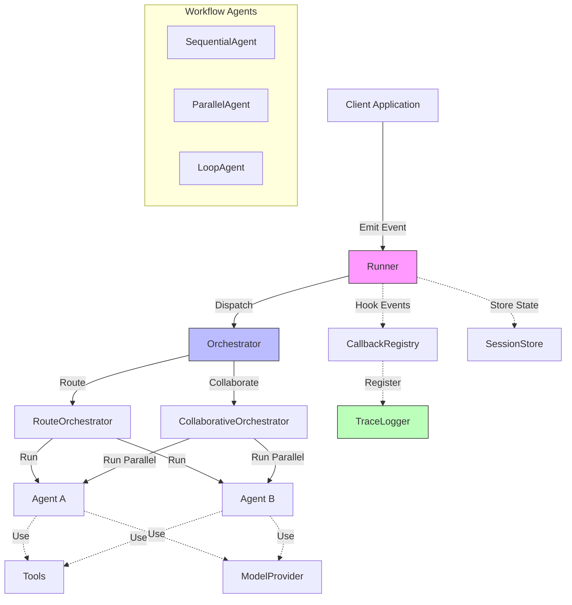

# Agentflow Framework Developer Guide

## Overview
Agentflow is a Go framework for building AI agent systems. It provides core abstractions for event-based workflows, agent coordination, and tracing capabilities. This guide will help you understand the key components and how to use them effectively.



---

## Quick Start (with Factory)

```go
import (
    "context"
    agentflow "github.com/kunalkushwaha/agentflow/core"
)

func main() {
    // Create agents map
    agents := map[string]agentflow.AgentHandler{
        "example-agent": &MyAgent{},
    }

    // Create runner with configuration
    runner := agentflow.NewRunnerWithConfig(agentflow.RunnerConfig{
        Agents:    agents,
        QueueSize: 100,
    })

    // Start the runner
    ctx := context.Background()
    if err := runner.Start(ctx); err != nil {
        panic(err)
    }
    defer runner.Stop()

    // Create and emit an event
    eventData := agentflow.EventData{"message": "Hello World"}
    metadata := map[string]string{agentflow.RouteMetadataKey: "example-agent"}
    event := agentflow.NewEvent("example-agent", eventData, metadata)
    
    runner.Emit(event)
}
```

func main() {
    agents := map[string]agentflow.AgentHandler{
        "echo": agentflow.AgentHandlerFunc(
            func(ctx context.Context, event agentflow.Event, state agentflow.State) (agentflow.AgentResult, error) {
                state.Set("echo", event.GetData()["message"])
                return agentflow.AgentResult{OutputState: state}, nil
            }),
    }
    runner := factory.NewRunnerWithConfig(factory.RunnerConfig{
        Agents: agents,
    })
    runner.Start(context.Background())
    runner.Emit(core.NewEvent("echo", core.EventData{"message": "hello"}, nil))
    // ...wait, then runner.Stop()
}
```

---

## Core Components

### Interfaces
- **Agent**: Core interface for implementing agent logic.

```go
type Agent interface {
    Run(ctx context.Context, in State) (State, error)
    Name() string
}
```

- **AgentHandler**: Event‑aware interface invoked by the runner.

```go
type AgentHandler interface {
    Run(ctx context.Context, event Event, state State) (AgentResult, error)
}
```

- **Event**: Immutable message container.

```go
type Event interface {
    ID() string
    Payload() EventData
    Metadata() map[string]string
    MetadataValue(key string) (string, bool)
    SourceAgentID() string
    TargetAgentID() string
}
```

- **State**: Thread‑safe key / metadata store.

```go
type State interface {
    Get(key string) (any, bool)
    Set(key string, value any)
    Keys() []string

    GetMeta(key string) (string, bool)
    SetMeta(key, value string)
    MetaKeys() []string

    Clone() State
}
```

- **Orchestrator**: Dispatches an event to one or more agents.

```go
type Orchestrator interface {
    RegisterAgent(name string, h AgentHandler) error
    Dispatch(ctx context.Context, event Event) (AgentResult, error)
    CallbackRegistry() *CallbackRegistry
}
```

- **Runner**: Pulls events from its queue and invokes the orchestrator.

```go
type Runner interface {
    Emit(event Event) error
    RegisterAgent(name string, h AgentHandler) error
    Start(ctx context.Context) error
    Stop(ctx context.Context) error

    CallbackRegistry() *CallbackRegistry
    TraceLogger() TraceLogger
    DumpTrace(sessionID string) ([]TraceEntry, error)
}
```

---

## When to Use Factory Functions

- Use the factory for most production and prototype workflows.
- Use manual setup only if you need custom callback wiring, advanced orchestrator logic, or deep integration with external systems.

---

## Adding Custom Callbacks with Factory

You can register custom callbacks after creating the runner:

```go
runner := factory.NewRunnerWithConfig(factory.RunnerConfig{Agents: agents})
registry := runner.GetCallbackRegistry()
registry.Register(agentflow.HookAfterAgentRun, "myCustomLogger", myCallbackFunc)
```

---

## Error Handler Agent

The factory will register a default "error-handler" agent if not provided. To override, add your own to the `Agents` map with the key `"error-handler"`.

---

## Command-Line Interface (agentcli)

AgentFlow includes a command-line interface, `agentcli`, to help with development and project management tasks.

### Scaffolding with `agentcli create`

The `agentcli create` command initializes a new AgentFlow project with a standard directory structure and placeholder Go files, allowing you to quickly get started.

**Purpose**:
To bootstrap a new AgentFlow project, setting up a consistent structure for your agent development.

**Basic Usage**:
```bash
agentcli create [flags]
```

**Flags**:
*   `--agentName string` (shorthand `-n`): Specifies the name of the agent and the root project directory to be created. (Default: "my-agent")
*   `--numAgents int` (shorthand `-a`): Determines the number of primary agent configurations to generate. (Default: 1)
    *   If `1`, an `agent.go` file is created in the root project directory (`<agentName>/agent.go`).
    *   If greater than `1`, numbered subdirectories (e.g., `agent1/`, `agent2/`) are created within the project directory, each containing its own `agent.go` file (e.g., `<agentName>/agent1/agent.go`).
*   `--responsibleAI`: If set, includes a placeholder `responsible_ai/agent.go` for implementing Responsible AI checks.
*   `--errorHandler`: If set, includes a placeholder `error_handler/agent.go` for implementing custom error handling logic.

**Example**:
```bash
agentcli create --agentName myExampleAgent --numAgents 2 --responsibleAI
```

**Generated Structure (for the example above)**:
```
myExampleAgent/
├── main.go                 # Main application entry point
├── agent1/                 # Directory for the first agent
│   └── agent.go            # Placeholder for Agent1 logic
├── agent2/                 # Directory for the second agent
│   └── agent.go            # Placeholder for Agent2 logic
└── responsible_ai/         # Directory for Responsible AI agent
    └── agent.go            # Placeholder for ResponsibleAIAgent logic
```
*(Note: If `--errorHandler` was also specified, an `error_handler/agent.go` directory and file would also be present.)*

**Next Steps**:
After running the command, you can navigate into your new project directory:
```bash
cd myExampleAgent
```
Then, start implementing your specific agent logic in the generated `.go` files. You can also begin integrating your agents within `main.go`.

---

## Troubleshooting / FAQ

- **My agent isn't called?**
  - Check that your event's metadata includes the correct `RouteMetadataKey`.
- **How do I see the trace?**
  - Use `runner.DumpTrace(sessionID)` or the `agentcli trace` command.
- **How do I add more tools/LLMs?**
  - Use `factory.NewDefaultToolRegistry()` and `factory.NewDefaultLLMAdapter()` or register your own.

---

## See Also
- [examples/multi_agent/](../examples/multi_agent/)
- [examples/clean_multi_agent/](../examples/clean_multi_agent/)
- [internal/factory/agent_factory.go](../internal/factory/agent_factory.go)

---

## LLM Integration
Agentflow provides a flexible architecture for integrating with Language Model providers like Azure OpenAI. The framework defines standardized interfaces and implementations to make LLM usage consistent across your agents.

- **ModelProvider**: Interface for model providers.

```go
type ModelProvider interface {
    // Call sends a prompt and returns a complete response
    Call(ctx context.Context, prompt Prompt) (Response, error)
    
    // Stream returns a channel that streams tokens as they're generated
    Stream(ctx context.Context, prompt Prompt) (<-chan Token, error)
    
    // Embeddings generates vector embeddings for texts
    Embeddings(ctx context.Context, texts []string) ([][]float64, error)
}
```

### Using Azure OpenAI Adapter

```go
// Create the adapter configuration
options := llm.AzureOpenAIAdapterOptions{
    Endpoint:            "https://your-resource-name.openai.azure.com",
    APIKey:              os.Getenv("AZURE_OPENAI_API_KEY"),
    ChatDeployment:      "gpt-4-turbo",      // Your chat model deployment
    EmbeddingDeployment: "text-embedding-3", // Your embedding model deployment
}

// Initialize the adapter
azureLLM, err := llm.NewAzureOpenAIAdapter(options)
if err != nil {
    log.Fatalf("Failed to create Azure OpenAI adapter: %v", err)
}

// Create a prompt
prompt := llm.Prompt{
    System: "You are a helpful assistant.",
    User:   "What are the key benefits of Go for building AI systems?",
    Parameters: llm.ModelParameters{
        Temperature: ptrTo(float32(0.7)),
        MaxTokens:   ptrTo(int32(500)),
    },
}

// Get a response
ctx := context.Background()
response, err := azureLLM.Call(ctx, prompt)
if err != nil {
    log.Fatalf("LLM call failed: %v", err)
}

// Use the response
fmt.Printf("Answer: %s\n", response.Content)
fmt.Printf("Tokens used: %d\n", response.Usage.TotalTokens)

// Stream example
tokenChannel, err := azureLLM.Stream(ctx, prompt)
if err != nil {
    log.Fatalf("Failed to start stream: %v", err)
}

// Process tokens as they arrive
for token := range tokenChannel {
    if token.Error != nil {
        log.Printf("Stream error: %v", token.Error)
        break
    }
    fmt.Print(token.Content) // Print each token as it arrives
}

// Generate embeddings
texts := []string{
    "Golang is a statically typed language.",
    "Python is dynamically typed.",
}

embeddings, err := azureLLM.Embeddings(ctx, texts)
if err != nil {
    log.Fatalf("Failed to generate embeddings: %v", err)
}

// Use embeddings for similarity comparison, search, etc.
```

---

## Getting Started

### Setting Up the Runner

```go
// Create components
orch := orchestrator.NewRouteOrchestrator()
runner := agentflow.NewRunner(orch, 10) // 10‑event queue

// Optional: register extra callbacks
cb := agentflow.NewCallbackRegistry()
agentflow.RegisterTraceHooks(cb, agentflow.NewInMemoryTraceLogger())
runner.CallbackRegistry().Merge(cb) // helper that merges registries

ctx, cancel := context.WithCancel(context.Background())
defer cancel()

if err := runner.Start(ctx); err != nil {
    log.Fatalf("failed to start runner: %v", err)
}
```

### Factory Functions and Modern Runner Setup 

AgentFlow now supports a modern, concise setup for multi-agent workflows using factory functions. This approach reduces boilerplate and ensures best practices for tracing, callback registration, and agent orchestration.

#### Key Concepts
- **RunnerConfig**: Central struct for configuring the runner, orchestrator, and agents.
- **NewRunnerWithConfig**: Factory function that wires up the runner, callback registry, tracing, orchestrator, and agent registration in one call.
- **Default Tool and LLM Adapters**: Helper functions to quickly get a tool registry or LLM adapter with sensible defaults.

#### Example: Minimal Multi-Agent Workflow with Factory

```go
import (
    agentflow "github.com/kunalkushwaha/agentflow/core"
)

func main() {
    // 1. Prepare agents
    agents := map[string]agentflow.AgentHandler{
        "planner":    NewPlannerHandler(llmAdapter),
        "researcher": NewResearcherHandler(*toolRegistry, llmAdapter),
        "summarizer": NewSummarizerHandler(llmAdapter, llmAdapter),
        "final":      NewFinalOutputHandler(&wg),
    }

    // 2. Create runner with factory
    runner := factory.NewRunnerWithConfig(factory.RunnerConfig{
        QueueSize: 2,
        Agents:    agents,
    })

    // 3. Start runner and emit event
    runner.Start(ctx)
    runner.Emit(core.NewEvent(...))
    // ...
}
```

#### Benefits
- **Less boilerplate**: No need to manually wire up callback registries, trace loggers, or error handlers.
- **Best practices by default**: Tracing and error handling are always enabled.
- **Easy agent registration**: Just provide a map of agent names to handlers.
- **Extensible**: You can still customize the orchestrator or add custom callbacks if needed.

#### Migrating from Manual Setup
- Replace manual runner, callback registry, and orchestrator setup with a single call to `NewRunnerWithConfig`.
- Use the `Agents` map in `RunnerConfig` to register all your agents.
- Use `NewDefaultToolRegistry` and `NewDefaultLLMAdapter` for quick access to built-in tools and LLMs.

#### See Also
- [examples/multi_agent/](../examples/multi_agent/)
- [examples/clean_multi_agent/](../examples/clean_multi_agent/)
- [internal/factory/agent_factory.go](../internal/factory/agent_factory.go)

---

### Creating an Agent
Implement the `AgentHandler` interface to create your own agent logic.

```go
// MyAgent implements the AgentHandler interface
type MyAgent struct {
    // Your agent-specific fields
}

// Run is called when an event is dispatched to this agent
func (a *MyAgent) Run(ctx context.Context, event agentflow.Event, state agentflow.State) (agentflow.AgentResult, error) {
    startTime := time.Now()
    
    // Your agent logic here
    outputState := state.Clone()
    outputState.Set("result", "success")
    
    endTime := time.Now()
    
    return agentflow.AgentResult{
        OutputState: outputState,
        StartTime:   startTime,
        EndTime:     endTime,
        Duration:    endTime.Sub(startTime),
    }, nil
}
```

### Registering Agents and Emitting Events
Register your agents with the `Runner` and start emitting events for processing.

```go
// Register your agent with the orchestrator
myAgent := &MyAgent{}
if err := runner.RegisterAgent("my-agent", myAgent); err != nil {
    log.Fatalf("Failed to register agent: %v", err)
}

// Create an event
eventData := agentflow.EventData{
    "user_prompt": "Hello, world!",
}
eventMeta := map[string]string{
    agentflow.RouteMetadataKey: "my-agent", // For route orchestrator
    agentflow.SessionIDKey: "session-123",  // For tracing
}
event := agentflow.NewEvent("source-system", eventData, eventMeta)

// Emit the event
if err := runner.Emit(event); err != nil {
    log.Fatalf("Failed to emit event: %v", err)
}
```

---

## Orchestration Types

### Route Orchestrator
Routes events to a **specific agent** based on the `RouteMetadataKey`.

```go
orch := orchestrator.NewRouteOrchestrator()
// Event will be routed based on metadata[agentflow.RouteMetadataKey]
```

### Collaborative Orchestrator
Sends events to **all registered agents** for collaborative processing.

```go
orch := orchestrator.NewCollaborativeOrchestrator()
// All registered agents will receive each event
```

---

## Working with Callbacks
Callbacks allow you to hook into the event lifecycle to perform additional actions such as logging, modifying state, or handling errors.

```go
// Create a callback registry
registry := agentflow.NewCallbackRegistry()
runner.SetCallbackRegistry(registry)

// Register a callback for before agent execution
beforeAgentCallback := func(ctx context.Context, args agentflow.CallbackArgs) (agentflow.State, error) {
    log.Printf("Before agent %s runs for event %s", args.AgentID, args.Event.GetID())
    return args.State, nil
}
runner.RegisterCallback(agentflow.HookBeforeAgentRun, "myBeforeAgentCallback", beforeAgentCallback)

// Register a callback for after agent execution
afterAgentCallback := func(ctx context.Context, args agentflow.CallbackArgs) (agentflow.State, error) {
    log.Printf("After agent %s ran for event %s", args.AgentID, args.Event.GetID())
    return args.State, nil
}
runner.RegisterCallback(agentflow.HookAfterAgentRun, "myAfterAgentCallback", afterAgentCallback)
```
---

## Tracing
The framework provides **built-in tracing** to monitor the execution flow and diagnose performance or logical issues.

```go
// Setup tracing
traceLogger := agentflow.NewInMemoryTraceLogger()
runner.SetTraceLogger(traceLogger)

// Register trace hooks
agentflow.RegisterTraceHooks(registry, traceLogger)

// Later, retrieve trace
sessionID := "session-123"
trace, err := runner.DumpTrace(sessionID)
if err != nil {
    log.Fatalf("Error retrieving trace: %v", err)
}

// Process or display the trace
for i, entry := range trace {
    fmt.Printf("Entry %d: Type=%s Hook=%s Time=%s\n", 
        i, entry.Type, entry.Hook, entry.Timestamp.Format(time.RFC3339))
}
```
---

## Session Management
Manage state across multiple events with **sessions** to preserve context and ensure continuity.

```go
// Create a session store
sessionStore := agentflow.NewMemorySessionStore()

// Create a new session
sessionID := "user-session-123"
initialState := agentflow.NewState()
initialState.Set("user_id", "user123")
session := agentflow.NewMemorySession(sessionID, initialState)

// Save the session
if err := sessionStore.SaveSession(ctx, session); err != nil {
    log.Fatalf("Failed to save session: %v", err)
}

// Retrieve the session later
retrievedSession, err := sessionStore.GetSession(ctx, sessionID)
if err != nil {
    // Handle error, e.g., session not found
}

// Get state from session
sessionState := retrievedSession.GetState()
```
---

## Key Data Structures

- **EventData**: A map for passing data with events.

```go
type EventData map[string]interface{}
```

- **AgentResult**: The result produced by an agent after processing.

```go
type AgentResult struct {
    OutputState State       // State to pass to next component
    Error       string      // Error message (if any)
    StartTime   time.Time   // When processing started
    EndTime     time.Time   // When processing finished
    Duration    time.Duration // Total processing time
}
```
- **TraceEntry**: Records a single step in execution for traceability.

```go
type TraceEntry struct {
    Timestamp     time.Time
    Type          string       // "event_start", "event_end", "agent_start", "agent_end"
    EventID       string
    SessionID     string
    AgentID       string
    State         State
    Error         string
    Hook          HookPoint
    TargetAgentID string
    SourceAgentID string
    AgentResult   *AgentResult
}
```

---

## Error Handling

### Handling Events Without Routing
When using `RouteOrchestrator`, all events must include the routing metadata key (`agentflow.RouteMetadataKey`) to specify the target agent. Missing this key will cause routing errors.

To handle events without routing information gracefully, implement one of these approaches:

```go
// Always include routing information when using RouteOrchestrator
event.SetMeta(agentflow.RouteMetadataKey, "my-agent")

// Or use CollaborativeOrchestrator to avoid routing requirements
orch := orchestrator.NewCollaborativeOrchestrator()
```

---

## Best Practices

- Always **provide session IDs** for tracking related events.
- **Handle errors** from agents properly to prevent cascading failures.
- Use **context cancellation** to manage timeouts and abort operations when necessary.
- **Clean up resources** by calling `runner.Stop()` when shutting down.
- **Register trace hooks** to aid in debugging and monitoring.
- **Clone states** when modifying them to avoid unexpected side effects between components.

---

## Working with State

The [State](http://_vscodecontentref_/2) interface provides a thread-safe container for data passing between components. Always use its methods rather than direct map access:

```go
// Getting data from state
valueObj, exists := state.Get("key")
if exists {
    value, ok := valueObj.(string)
    if ok {
        // Use value
    }
}

// Setting data in state
state.Set("key", "new value")

// Getting metadata
metaValue, exists := state.GetMeta("meta_key")

// Setting metadata
state.SetMeta("meta_key", "meta_value")

// Always clone state before modifying
newState := state.Clone()
newState.Set("key", "modified value")

// Merge states
targetState.Merge(sourceState)
```

---

## Working with AgentResult

`AgentResult` encapsulates the outcome of agent execution:

```go
type AgentResult struct {
    OutputState State       // State to pass to next component
    Error       string      // Error message (if any)
    StartTime   time.Time   // When agent execution started
    EndTime     time.Time   // When agent execution ended
    Duration    time.Duration // Total processing time
}
```

---

## Workflow Agents

Agentflow provides specialized agents for common workflow patterns:

### SequentialAgent

Executes a series of sub-agents in order, passing state from one to the next:

```go
agent1 := &FirstAgent{}
agent2 := &SecondAgent{}
agent3 := &ThirdAgent{}

seqAgent := agents.NewSequentialAgent("workflow", agent1, agent2, agent3)
result, err := seqAgent.Run(ctx, initialState)
```

### ParallelAgent

Executes multiple sub-agents concurrently, aggregating their results:

```go
config := agents.ParallelAgentConfig{
    Timeout: 30 * time.Second, // Optional timeout
}
parallelAgent := agents.NewParallelAgent("parallel-workflow", config, 
                                         agent1, agent2, agent3)
result, err := parallelAgent.Run(ctx, initialState)
```

### LoopAgent

Executes a sub-agent repeatedly until a condition is met or a maximum number of iterations is reached:

```go
// Define condition to stop the loop
stopCondition := func(s agentflow.State) bool {
    countVal, ok := s.Get("count")
    if !ok {
        return false
    }
    count, ok := countVal.(int)
    return ok && count >= 5  // Stop after 5 iterations
}

config := agents.LoopAgentConfig{
    Condition:     stopCondition,
    MaxIterations: 10, // Safety limit
}

loopAgent := agents.NewLoopAgent("loop-workflow", config, subAgent)
result, err := loopAgent.Run(ctx, initialState)
```

---

## Azure OpenAI Agent

### Creating an Azure OpenAI Agent
Implement the `AgentHandler` interface to create an agent that uses Azure OpenAI for processing queries.

```go
// AzureOpenAIAgent implements AgentHandler interface for answering queries
type AzureOpenAIAgent struct {
    llmProvider llm.ModelProvider
    systemPrompt string
}

// NewAzureOpenAIAgent creates a new Azure-powered agent
func NewAzureOpenAIAgent(provider llm.ModelProvider, systemPrompt string) *AzureOpenAIAgent {
    return &AzureOpenAIAgent{
        llmProvider: provider,
        systemPrompt: systemPrompt,
    }
}

// Run processes the event using Azure OpenAI
func (a *AzureOpenAIAgent) Run(ctx context.Context, event agentflow.Event, state agentflow.State) (agentflow.AgentResult, error) {
    startTime := time.Now()
    
    // Extract query from event
    queryObj, exists := event.GetData()["query"]
    if (!exists) {
        return agentflow.AgentResult{
            Error: "missing query in event data",
            StartTime: startTime,
            EndTime: time.Now(),
        }, errors.New("missing query in event data")
    }
    
    query, ok := queryObj.(string)
    if (!ok) {
        return agentflow.AgentResult{
            Error: "query is not a string",
            StartTime: startTime,
            EndTime: time.Now(),
        }, errors.New("query is not a string")
    }
    
    // Create prompt
    prompt := llm.Prompt{
        System: a.systemPrompt,
        User:   query,
        Parameters: llm.ModelParameters{
            Temperature: ptrTo(float32(0.7)),
            MaxTokens:   ptrTo(int32(1000)),
        },
    }
    
    // Call Azure OpenAI
    response, err := a.llmProvider.Call(ctx, prompt)
    if (err != nil) {
        return agentflow.AgentResult{
            Error: fmt.Sprintf("LLM error: %v", err),
            StartTime: startTime,
            EndTime: time.Now(),
        }, err
    }
    
    // Create output state with response
    outputState := state.Clone()
    outputState.Set("answer", response.Content)
    outputState.Set("tokens_used", response.Usage.TotalTokens)
    
    endTime := time.Now()
    
    return agentflow.AgentResult{
        OutputState: outputState,
        StartTime:   startTime,
        EndTime:     endTime,
        Duration:    endTime.Sub(startTime),
    }, nil
}

// Helper for creating pointers to values
func ptrTo[T any](v T) *T {
    return &v
}
```

---

## Conclusion
The Agentflow framework provides a **flexible foundation** for building agent-based systems in Go.  
By understanding the core components and how they interact, you can create **sophisticated workflows** for your AI applications.

---

## Summary of Updates

The [DevGuide.md](http://_vscodecontentref_/3) needs these key additions and updates:

1. Error handling guidance for events without routing information
2. Clarification on the distinction between Agent and AgentHandler interfaces
3. Best practices for State manipulation and cloning
4. Documentation on the AgentResult structure and its usage
5. Section on the available workflow agents (Sequential, Parallel, Loop)
6. Improved Runner setup with context handling and proper shutdown
7. Ensuring all code examples use the latest API signatures
8. Factory function approach for runner setup with example and migration notes.
