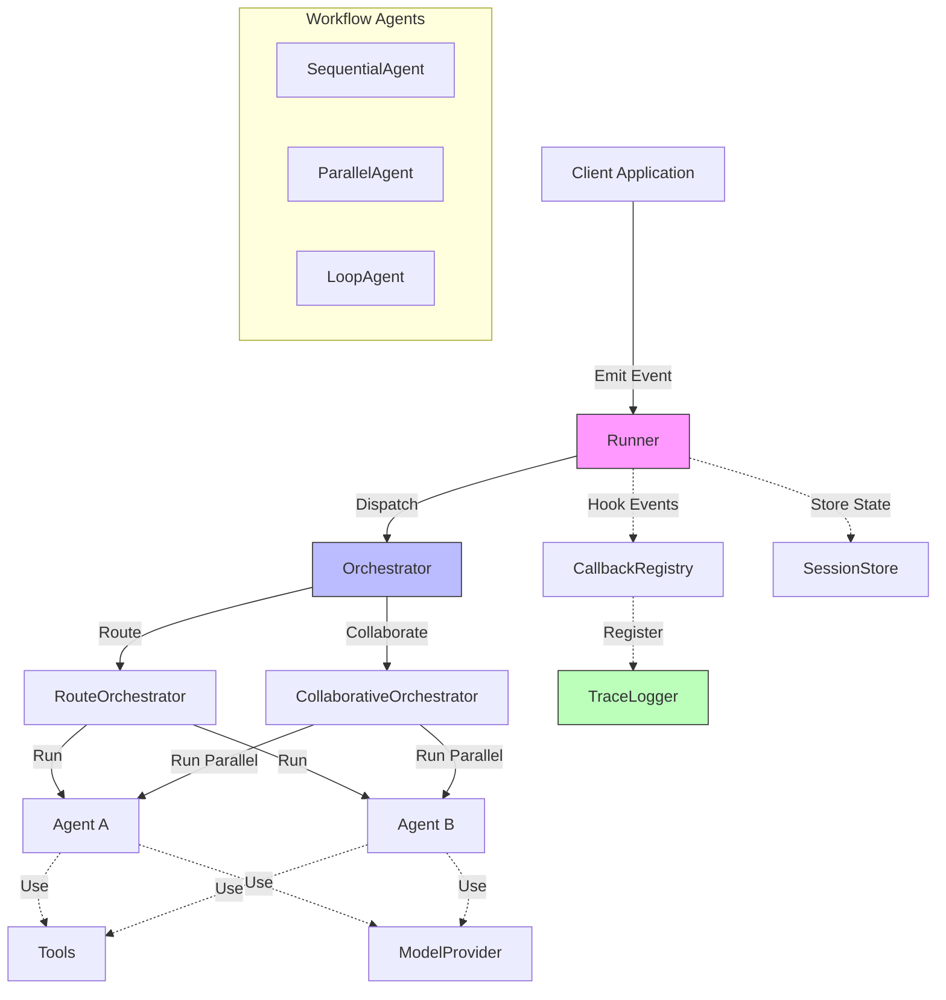

# Agentflow Framework Developer Guide

## Overview
Agentflow is a Go framework for building AI agent systems. It provides core abstractions for event-based workflows, agent coordination, and tracing capabilities. This guide will help you understand the key components and how to use them effectively.



---

## Quick Start (with Factory)

```go
import (
    "context"
    agentflow "github.com/kunalkushwaha/agentflow/core"
)

func main() {
    // Create agents map
    agents := map[string]agentflow.AgentHandler{
        "example-agent": &MyAgent{},
    }

    // Create runner with configuration including tracing
    runner := agentflow.NewRunnerWithConfig(agentflow.RunnerConfig{
        Agents:      agents,
        QueueSize:   100,
        TraceLogger: agentflow.NewInMemoryTraceLogger(),
    })

    // Start the runner
    ctx := context.Background()
    if err := runner.Start(ctx); err != nil {
        panic(err)
    }
    defer runner.Stop()

    // Create and emit an event with session tracking
    eventData := agentflow.EventData{"message": "Hello World"}
    metadata := map[string]string{
        agentflow.RouteMetadataKey: "example-agent",
        agentflow.SessionIDKey:     "demo-session-123",
    }
    event := agentflow.NewEvent("example-agent", eventData, metadata)
    
    runner.Emit(event)
}
```

---

## Core Components

### Interfaces
- **Agent**: Core interface for implementing agent logic.

```go
type Agent interface {
    Run(ctx context.Context, in State) (State, error)
    Name() string
}
```

- **AgentHandler**: Event‑aware interface invoked by the runner.

```go
type AgentHandler interface {
    Run(ctx context.Context, event Event, state State) (AgentResult, error)
}
```

- **Event**: Immutable message container with enhanced methods.

```go
type Event interface {
    GetID() string
    GetData() EventData
    GetMetadata() map[string]string
    GetMetadataValue(key string) (string, bool)
    GetSourceAgentID() string
    GetTargetAgentID() string
}
```

- **State**: Thread‑safe key / metadata store with cloning support.

```go
type State interface {
    Get(key string) (any, bool)
    Set(key string, value any)
    Keys() []string

    GetMeta(key string) (string, bool)
    SetMeta(key, value string)
    MetaKeys() []string

    Clone() State
}
```

- **Orchestrator**: Dispatches an event to one or more agents.

```go
type Orchestrator interface {
    RegisterAgent(name string, h AgentHandler) error
    Dispatch(ctx context.Context, event Event) (AgentResult, error)
    CallbackRegistry() *CallbackRegistry
}
```

- **Runner**: Enhanced runner interface with tracing support.

```go
type Runner interface {
    Emit(event Event) error
    RegisterAgent(name string, h AgentHandler) error
    Start(ctx context.Context) error
    Stop() error

    CallbackRegistry() *CallbackRegistry
    TraceLogger() TraceLogger
    DumpTrace(sessionID string) ([]TraceEntry, error)
}
```

---

## When to Use Factory Functions

- Use the factory for most production and prototype workflows.
- Use manual setup only if you need custom callback wiring, advanced orchestrator logic, or deep integration with external systems.

---

## Adding Custom Callbacks

You can register custom callbacks after creating the runner:

```go
runner := agentflow.NewRunnerWithConfig(agentflow.RunnerConfig{Agents: agents})
registry := runner.CallbackRegistry()
registry.Register(agentflow.HookAfterAgentRun, "myCustomLogger", myCallbackFunc)
```

---

## Error Handler Agent

AgentFlow will register a default "error-handler" agent if not provided. To override, add your own to the `Agents` map with the key `"error-handler"`.

---

## Command-Line Interface (agentcli)

AgentFlow includes a powerful command-line interface, `agentcli`, to help with development and project management tasks.

### Scaffolding with `agentcli create`

The `agentcli create` command initializes a new AgentFlow project with a standard directory structure and placeholder Go files, allowing you to quickly get started with modern AgentFlow patterns.

**Purpose**:
To bootstrap a new AgentFlow project with current best practices, including proper tracing, error handling, and agent patterns.

**Basic Usage**:
```bash
agentcli create [flags]
```

**Flags**:
*   `--agents int` (shorthand `-a`): Number of agent directories to create (default: 1)
*   `--provider string` (shorthand `-p`): LLM provider to configure (options: openai, azure, ollama, mock) (default: "mock")
*   `--with-error-agent`: Include an error handling agent in the generated project
*   `--interactive` (shorthand `-i`): Enable interactive mode for guided project creation

**Interactive Mode**:
When using the `--interactive` flag, the CLI will guide you through project creation:
```bash
agentcli create --interactive
```

This will prompt you for:
- Project name
- Number of agents
- LLM provider preference
- Whether to include error handling and responsible AI agents
- Additional features

**Examples**:

1. **Basic project with 2 agents**:
```bash
agentcli create --agents 2 --provider openai
```

2. **Interactive setup**:
```bash
agentcli create --interactive
```

3. **Full-featured project**:
```bash
agentcli create --agents 3 --provider azure --with-error-agent
```

**Generated Project Structure**:
```
my-agent/
├── go.mod                      # Go module definition
├── main.go                     # Main application with AgentFlow setup
├── agent1/
│   └── agent.go               # First agent implementation
├── agent2/
│   └── agent.go               # Second agent implementation (if --agents > 1)
├── agent3/
│   └── agent.go               # Third agent implementation (if --agents > 2)
└── error_handler/             # If --with-error-agent is specified
    └── agent.go               # Error handling agent
```

**Generated Features**:
- **Modern AgentFlow Setup**: Uses `NewRunnerWithConfig` with proper tracing
- **LLM Integration**: Pre-configured for selected provider (OpenAI, Azure, Ollama, or Mock)
- **Error Handling**: Comprehensive error handling patterns
- **Tracing**: Built-in trace logging setup
- **Session Management**: Proper session ID handling
- **State Management**: Examples of state cloning and metadata usage
- **Circuit Breaker**: Basic resilience patterns
- **Documentation**: Comments explaining AgentFlow concepts

**Provider-Specific Configuration**:

*OpenAI Provider*:
- Sets up OpenAI client with API key configuration
- Includes example prompts and model parameters
- Shows streaming and standard completions

*Azure Provider*:
- Configures Azure OpenAI endpoints
- Includes deployment name setup
- Shows both chat and embedding usage

*Ollama Provider*:
- Sets up local Ollama integration
- Includes model selection examples
- Shows local LLM usage patterns

*Mock Provider*:
- Provides testing-friendly mock implementations
- Includes deterministic responses for development
- Shows how to extend for custom providers

**Next Steps**:
After running the command:
```bash
cd my-agent
go mod tidy
go run main.go
```

The generated project includes comprehensive examples and is ready to run immediately.

---

## Latest AgentFlow Features

### Circuit Breaker and Retry Logic

AgentFlow includes built-in circuit breaker and retry mechanisms for resilient agent execution:

```go
// The framework automatically handles circuit breaker logic
// Agents can be configured with retry policies through RunnerConfig

// Example of an agent that benefits from circuit breaker protection
type ExternalServiceAgent struct {
    serviceURL string
}

func (a *ExternalServiceAgent) Run(ctx context.Context, event agentflow.Event, state agentflow.State) (agentflow.AgentResult, error) {
    startTime := time.Now()
    
    // This call is automatically protected by circuit breaker
    result, err := a.callExternalService(ctx, event.GetData())
    if err != nil {
        // Circuit breaker will track failures and open if threshold is reached
        return agentflow.AgentResult{}, fmt.Errorf("external service call failed: %w", err)
    }
    
    outputState := state.Clone()
    outputState.Set("external_result", result)
    
    return agentflow.AgentResult{
        OutputState: outputState,
        StartTime:   startTime,
        EndTime:     time.Now(),
        Duration:    time.Since(startTime),
    }, nil
}
```

### Enhanced Error Routing

Implement sophisticated error handling with automatic routing:

```go
// ErrorClassificationAgent demonstrates enhanced error routing
type ErrorClassificationAgent struct{}

func (a *ErrorClassificationAgent) Run(ctx context.Context, event agentflow.Event, state agentflow.State) (agentflow.AgentResult, error) {
    startTime := time.Now()
    
    // Classify the error from previous agent
    errorMsg, _ := state.Get("error_message")
    errorType := a.classifyError(errorMsg)
    
    outputState := state.Clone()
    outputState.Set("error_type", errorType)
    outputState.Set("classified_by", "ErrorClassificationAgent")
    
    // Route to appropriate handler based on error type
    switch errorType {
    case "validation":
        outputState.SetMeta(agentflow.RouteMetadataKey, "validation-error-handler")
    case "timeout":
        outputState.SetMeta(agentflow.RouteMetadataKey, "timeout-error-handler")
    case "critical":
        outputState.SetMeta(agentflow.RouteMetadataKey, "critical-error-handler")
    default:
        outputState.SetMeta(agentflow.RouteMetadataKey, "generic-error-handler")
    }
    
    return agentflow.AgentResult{
        OutputState: outputState,
        StartTime:   startTime,
        EndTime:     time.Now(),
        Duration:    time.Since(startTime),
    }, nil
}

func (a *ErrorClassificationAgent) classifyError(errorMsg interface{}) string {
    if errorMsg == nil {
        return "unknown"
    }
    
    msg := fmt.Sprintf("%v", errorMsg)
    if strings.Contains(msg, "validation") {
        return "validation"
    } else if strings.Contains(msg, "timeout") {
        return "timeout"
    } else if strings.Contains(msg, "critical") || strings.Contains(msg, "fatal") {
        return "critical"
    }
    return "generic"
}
```

### Responsible AI Integration

Implement content safety and ethical checks:

```go
// ResponsibleAIAgent performs safety checks on content
type ResponsibleAIAgent struct {
    safetyRules []SafetyRule
}

type SafetyRule struct {
    Name        string
    Description string
    CheckFunc   func(content string) bool
}

func (a *ResponsibleAIAgent) Run(ctx context.Context, event agentflow.Event, state agentflow.State) (agentflow.AgentResult, error) {
    startTime := time.Now()
    
    content, exists := event.GetData()["content"]
    if !exists {
        return agentflow.AgentResult{}, fmt.Errorf("no content provided for safety check")
    }
    
    contentStr := fmt.Sprintf("%v", content)
    violations := []string{}
    
    // Check against all safety rules
    for _, rule := range a.safetyRules {
        if rule.CheckFunc(contentStr) {
            violations = append(violations, rule.Name)
        }
    }
    
    outputState := state.Clone()
    if len(violations) > 0 {
        outputState.Set("safety_check", "failed")
        outputState.Set("violations", violations)
        outputState.SetMeta(agentflow.RouteMetadataKey, "content-violation-handler")
    } else {
        outputState.Set("safety_check", "passed")
        outputState.SetMeta(agentflow.RouteMetadataKey, "content-approved")
    }
    
    return agentflow.AgentResult{
        OutputState: outputState,
        StartTime:   startTime,
        EndTime:     time.Now(),
        Duration:    time.Since(startTime),
    }, nil
}
```

### Advanced Tracing and Observability

Enhanced tracing capabilities for debugging and monitoring:

```go
// Create runner with advanced tracing
func createAdvancedRunner() *agentflow.Runner {
    // File-based trace logger for production
    traceLogger := agentflow.NewFileTraceLogger("./traces")
    
    agents := map[string]agentflow.AgentHandler{
        "processor":     &ProcessorAgent{},
        "validator":     &ValidatorAgent{},
        "error-handler": &ErrorHandlerAgent{},
    }
    
    runner := agentflow.NewRunnerWithConfig(agentflow.RunnerConfig{
        Agents:      agents,
        QueueSize:   100,
        TraceLogger: traceLogger,
    })
    
    // Register custom trace callbacks
    registry := runner.CallbackRegistry()
    registry.Register(agentflow.HookBeforeAgentRun, "custom-metrics", func(ctx context.Context, event agentflow.Event, state agentflow.State) error {
        // Custom metrics collection
        agentflow.Logger().Info().
            Str("agent", event.GetTargetAgentID()).
            Str("session", event.GetMetadataValue(agentflow.SessionIDKey)).
            Msg("Agent execution starting")
        return nil
    })
    
    return runner
}

// Analyze traces for performance insights
func analyzePerformance(runner *agentflow.Runner, sessionID string) {
    traces, err := runner.DumpTrace(sessionID)
    if err != nil {
        fmt.Printf("Error retrieving traces: %v\n", err)
        return
    }
    
    agentStats := make(map[string]struct {
        count    int
        totalDur time.Duration
    })
    
    for _, trace := range traces {
        if trace.Type == "agent_start" || trace.Type == "agent_end" {
            stats := agentStats[trace.AgentID]
            stats.count++
            if trace.Duration > 0 {
                stats.totalDur += trace.Duration
            }
            agentStats[trace.AgentID] = stats
        }
    }
    
    fmt.Printf("Performance Analysis for Session %s:\n", sessionID)
    for agentID, stats := range agentStats {
        avgDur := time.Duration(0)
        if stats.count > 0 {
            avgDur = stats.totalDur / time.Duration(stats.count)
        }
        fmt.Printf("  %s: %d executions, avg duration: %v\n", agentID, stats.count, avgDur)
    }
}
```

---

## Troubleshooting / FAQ

- **My agent isn't called?**
  - Check that your event's metadata includes the correct `RouteMetadataKey`.
- **How do I see the trace?**
  - Use `runner.DumpTrace(sessionID)` or the `agentcli trace` command.
- **How do I add more tools/LLMs?**
  - Use `factory.NewDefaultToolRegistry()` and `factory.NewDefaultLLMAdapter()` or register your own.

---

## See Also
- [examples/multi_agent/](../examples/multi_agent/)
- [examples/clean_multi_agent/](../examples/clean_multi_agent/)
- [internal/factory/agent_factory.go](../internal/factory/agent_factory.go)

---

## LLM Integration
Agentflow provides a flexible architecture for integrating with Language Model providers like Azure OpenAI. The framework defines standardized interfaces and implementations to make LLM usage consistent across your agents.

- **ModelProvider**: Interface for model providers.

```go
type ModelProvider interface {
    // Call sends a prompt and returns a complete response
    Call(ctx context.Context, prompt Prompt) (Response, error)
    
    // Stream returns a channel that streams tokens as they're generated
    Stream(ctx context.Context, prompt Prompt) (<-chan Token, error)
    
    // Embeddings generates vector embeddings for texts
    Embeddings(ctx context.Context, texts []string) ([][]float64, error)
}
```

### Using Azure OpenAI Adapter

```go
// Create the adapter configuration
options := llm.AzureOpenAIAdapterOptions{
    Endpoint:            "https://your-resource-name.openai.azure.com",
    APIKey:              os.Getenv("AZURE_OPENAI_API_KEY"),
    ChatDeployment:      "gpt-4-turbo",      // Your chat model deployment
    EmbeddingDeployment: "text-embedding-3", // Your embedding model deployment
}

// Initialize the adapter
azureLLM, err := llm.NewAzureOpenAIAdapter(options)
if err != nil {
    log.Fatalf("Failed to create Azure OpenAI adapter: %v", err)
}

// Create a prompt
prompt := llm.Prompt{
    System: "You are a helpful assistant.",
    User:   "What are the key benefits of Go for building AI systems?",
    Parameters: llm.ModelParameters{
        Temperature: ptrTo(float32(0.7)),
        MaxTokens:   ptrTo(int32(500)),
    },
}

// Get a response
ctx := context.Background()
response, err := azureLLM.Call(ctx, prompt)
if err != nil {
    log.Fatalf("LLM call failed: %v", err)
}

// Use the response
fmt.Printf("Answer: %s\n", response.Content)
fmt.Printf("Tokens used: %d\n", response.Usage.TotalTokens)

// Stream example
tokenChannel, err := azureLLM.Stream(ctx, prompt)
if err != nil {
    log.Fatalf("Failed to start stream: %v", err)
}

// Process tokens as they arrive
for token := range tokenChannel {
    if token.Error != nil {
        log.Printf("Stream error: %v", token.Error)
        break
    }
    fmt.Print(token.Content) // Print each token as it arrives
}

// Generate embeddings
texts := []string{
    "Golang is a statically typed language.",
    "Python is dynamically typed.",
}

embeddings, err := azureLLM.Embeddings(ctx, texts)
if err != nil {
    log.Fatalf("Failed to generate embeddings: %v", err)
}

// Use embeddings for similarity comparison, search, etc.
```

---

## Getting Started

### Setting Up the Runner (Manual Setup)

**Note**: For most use cases, use the factory function `NewRunnerWithConfig` instead of manual setup.

```go
// Manual setup - only for advanced use cases
runner := agentflow.NewRunner(10) // 10‑event queue

// Set orchestrator
orch := agentflow.NewRouteOrchestrator(agentflow.NewCallbackRegistry())
runner.SetOrchestrator(orch)

// Optional: register extra callbacks
cb := agentflow.NewCallbackRegistry()
agentflow.RegisterTraceHooks(cb, agentflow.NewInMemoryTraceLogger())
runner.SetCallbackRegistry(cb)

ctx, cancel := context.WithCancel(context.Background())
defer cancel()

if err := runner.Start(ctx); err != nil {
    log.Fatalf("failed to start runner: %v", err)
}
```

### Factory Functions and Modern Runner Setup 

AgentFlow now supports a modern, concise setup for multi-agent workflows using factory functions. This approach reduces boilerplate and ensures best practices for tracing, callback registration, and agent orchestration.

#### Key Concepts
- **RunnerConfig**: Central struct for configuring the runner, orchestrator, and agents.
- **NewRunnerWithConfig**: Factory function that wires up the runner, callback registry, tracing, orchestrator, and agent registration in one call.
- **Built-in Error Handling**: Automatic error agent registration and enhanced error routing.
- **Integrated Tracing**: Built-in support for both in-memory and file-based trace logging.

#### Example: Modern Multi-Agent Workflow

```go
import (
    agentflow "github.com/kunalkushwaha/agentflow/core"
)

func main() {
    // 1. Prepare agents with current best practices
    agents := map[string]agentflow.AgentHandler{
        "planner":      NewPlannerAgent(),
        "researcher":   NewResearcherAgent(), 
        "validator":    NewValidatorAgent(),
        "summarizer":   NewSummarizerAgent(),
        "error-handler": NewCustomErrorHandler(), // Optional: override default
    }

    // 2. Create runner with factory including tracing
    runner := agentflow.NewRunnerWithConfig(agentflow.RunnerConfig{
        QueueSize:   100,
        Agents:      agents,
        TraceLogger: agentflow.NewInMemoryTraceLogger(),
    })

    // 3. Start runner and emit event with session tracking
    ctx := context.Background()
    if err := runner.Start(ctx); err != nil {
        log.Fatalf("Failed to start runner: %v", err)
    }
    defer runner.Stop()

    // 4. Create event with proper metadata
    sessionID := "workflow-session-" + uuid.New().String()
    event := agentflow.NewEvent("planner", agentflow.EventData{
        "task": "Analyze market trends",
        "context": "Q4 2024 financial planning",
    }, map[string]string{
        agentflow.RouteMetadataKey: "planner",
        agentflow.SessionIDKey:     sessionID,
    })

    // 5. Emit and monitor
    if err := runner.Emit(event); err != nil {
        log.Fatalf("Failed to emit event: %v", err)
    }

    // Wait for processing and analyze results
    time.Sleep(5 * time.Second)
    traces, _ := runner.DumpTrace(sessionID)
    fmt.Printf("Workflow completed with %d trace entries\n", len(traces))
}
```

#### Benefits of Modern Setup
- **Zero-boilerplate tracing**: Automatic trace logging setup with session support
- **Built-in error handling**: Default error agent with enhanced routing capabilities
- **Circuit breaker protection**: Automatic resilience for agent failures
- **State management**: Proper state cloning and metadata handling
- **Performance monitoring**: Built-in performance tracking and analysis
- **Easy testing**: In-memory trace logger perfect for unit tests

#### Advanced Configuration

```go
// Production setup with file-based tracing
runner := agentflow.NewRunnerWithConfig(agentflow.RunnerConfig{
    QueueSize:   1000,
    Agents:      agents,
    TraceLogger: agentflow.NewFileTraceLogger("./production-traces"),
})

// Custom callback registration
registry := runner.CallbackRegistry()
registry.Register(agentflow.HookAfterAgentRun, "performance-monitor", func(ctx context.Context, event agentflow.Event, state agentflow.State) error {
    // Custom performance monitoring
    duration := state.Get("execution_duration")
    agentflow.Logger().Info().
        Str("agent", event.GetTargetAgentID()).
        Interface("duration", duration).
        Msg("Agent execution completed")
    return nil
})
```

#### Migration from Manual Setup
**Old approach** (manual setup):
```go
// Lots of boilerplate code
orch := orchestrator.NewRouteOrchestrator()
runner := agentflow.NewRunner(orch, 10)
cb := agentflow.NewCallbackRegistry()
traceLogger := agentflow.NewInMemoryTraceLogger()
agentflow.RegisterTraceHooks(cb, traceLogger)
runner.CallbackRegistry().Merge(cb)
// ... manual agent registration
```

**New approach** (factory):
```go
// Simple, comprehensive setup
runner := agentflow.NewRunnerWithConfig(agentflow.RunnerConfig{
    Agents:      agents,
    QueueSize:   10,
    TraceLogger: agentflow.NewInMemoryTraceLogger(),
})
```

---

### Creating an Agent
Implement the `AgentHandler` interface using current best practices.

```go
// MyAgent implements the AgentHandler interface with modern patterns
type MyAgent struct {
    name string
    // Add any agent-specific fields like LLM adapters, tools, etc.
}

// Run is called when an event is dispatched to this agent
func (a *MyAgent) Run(ctx context.Context, event agentflow.Event, state agentflow.State) (agentflow.AgentResult, error) {
    startTime := time.Now()
    
    // Log agent execution start
    agentflow.Logger().Info().
        Str("agent", a.name).
        Str("event_id", event.GetID()).
        Str("session_id", event.GetMetadataValue(agentflow.SessionIDKey)).
        Msg("Agent execution started")
    
    // Clone state to avoid mutations affecting other agents
    outputState := state.Clone()
    
    // Get input data from event
    eventData := event.GetData()
    userPrompt, exists := eventData["user_prompt"]
    if !exists {
        return agentflow.AgentResult{}, fmt.Errorf("missing required field: user_prompt")
    }
    
    // Process the request (your agent logic here)
    result := fmt.Sprintf("Processed by %s: %v", a.name, userPrompt)
    
    // Update output state
    outputState.Set("result", result)
    outputState.Set("processed_by", a.name)
    outputState.Set("processed_at", time.Now().Format(time.RFC3339))
    
    // Set routing metadata if needed for chaining
    // outputState.SetMeta(agentflow.RouteMetadataKey, "next-agent")
    
    endTime := time.Now()
    duration := endTime.Sub(startTime)
    
    // Log successful completion
    agentflow.Logger().Info().
        Str("agent", a.name).
        Str("event_id", event.GetID()).
        Dur("duration", duration).
        Msg("Agent execution completed successfully")
    
    return agentflow.AgentResult{
        OutputState: outputState,
        StartTime:   startTime,
        EndTime:     endTime,
        Duration:    duration,
    }, nil
}

// NewMyAgent creates a new instance with proper initialization
func NewMyAgent(name string) *MyAgent {
    return &MyAgent{
        name: name,
    }
}
```

### Advanced Agent Patterns

#### Agent with LLM Integration
```go
type LLMAgent struct {
    name        string
    llmAdapter  agentflow.ModelProvider
}

func (a *LLMAgent) Run(ctx context.Context, event agentflow.Event, state agentflow.State) (agentflow.AgentResult, error) {
    startTime := time.Now()
    
    // Get prompt from event data
    prompt, exists := event.GetData()["prompt"]
    if !exists {
        return agentflow.AgentResult{}, fmt.Errorf("missing prompt in event data")
    }
    
    // Call LLM
    response, err := a.llmAdapter.Call(ctx, agentflow.Prompt{
        System: "You are a helpful assistant.",
        User:   fmt.Sprintf("%v", prompt),
        Parameters: agentflow.ModelParameters{
            Temperature: ptrTo(float32(0.7)),
            MaxTokens:   ptrTo(int32(500)),
        },
    })
    if err != nil {
        return agentflow.AgentResult{}, fmt.Errorf("LLM call failed: %w", err)
    }
    
    outputState := state.Clone()
    outputState.Set("llm_response", response.Content)
    outputState.Set("tokens_used", response.Usage.TotalTokens)
    
    return agentflow.AgentResult{
        OutputState: outputState,
        StartTime:   startTime,
        EndTime:     time.Now(),
        Duration:    time.Since(startTime),
    }, nil
}
```

#### Agent with Error Handling
```go
type RobustAgent struct {
    name           string
    maxRetries     int
    retryDelay     time.Duration
}

func (a *RobustAgent) Run(ctx context.Context, event agentflow.Event, state agentflow.State) (agentflow.AgentResult, error) {
    startTime := time.Now()
    
    var lastErr error
    for attempt := 0; attempt <= a.maxRetries; attempt++ {
        if attempt > 0 {
            agentflow.Logger().Warn().
                Str("agent", a.name).
                Int("attempt", attempt).
                Err(lastErr).
                Msg("Retrying agent execution")
            
            // Wait before retry
            select {
            case <-ctx.Done():
                return agentflow.AgentResult{}, ctx.Err()
            case <-time.After(a.retryDelay):
            }
        }
        
        // Attempt processing
        result, err := a.processEvent(ctx, event, state)
        if err == nil {
            return result, nil
        }
        
        lastErr = err
        
        // Check if error is retryable
        if !a.isRetryableError(err) {
            break
        }
    }
    
    // All retries exhausted, route to error handler
    outputState := state.Clone()
    outputState.Set("error_message", lastErr.Error())
    outputState.Set("failed_agent", a.name)
    outputState.Set("retry_attempts", a.maxRetries)
    outputState.SetMeta(agentflow.RouteMetadataKey, "error-handler")
    
    return agentflow.AgentResult{
        OutputState: outputState,
        StartTime:   startTime,
        EndTime:     time.Now(),
        Duration:    time.Since(startTime),
    }, nil
}

func (a *RobustAgent) processEvent(ctx context.Context, event agentflow.Event, state agentflow.State) (agentflow.AgentResult, error) {
    // Your actual processing logic here
    // This might call external services, process data, etc.
    return agentflow.AgentResult{}, nil
}

func (a *RobustAgent) isRetryableError(err error) bool {
    // Define which errors are worth retrying
    errorStr := err.Error()
    return strings.Contains(errorStr, "timeout") || 
           strings.Contains(errorStr, "connection") ||
           strings.Contains(errorStr, "temporary")
}
```

### Registering Agents and Emitting Events
Register your agents with the `Runner` using modern patterns and emit events with proper session tracking.

```go
func setupAndRunWorkflow() {
    // Create agents with proper initialization
    agents := map[string]agentflow.AgentHandler{
        "my-agent":      NewMyAgent("MyAgent"),
        "llm-agent":     NewLLMAgent("LLMAgent", llmAdapter),
        "robust-agent":  NewRobustAgent("RobustAgent", 3, time.Second),
        "error-handler": NewErrorHandlerAgent(), // Custom error handler
    }

    // Create runner with comprehensive configuration
    runner := agentflow.NewRunnerWithConfig(agentflow.RunnerConfig{
        Agents:      agents,
        QueueSize:   100,
        TraceLogger: agentflow.NewInMemoryTraceLogger(),
    })

    // Start the runner
    ctx := context.Background()
    if err := runner.Start(ctx); err != nil {
        log.Fatalf("Failed to start runner: %v", err)
    }
    defer runner.Stop()

    // Create events with proper session management
    sessionID := "workflow-" + generateSessionID()
    
    // Event 1: Initial processing
    event1 := agentflow.NewEvent("user-input", agentflow.EventData{
        "user_prompt": "Analyze the latest market trends",
        "priority":    "high",
        "user_id":     "user123",
    }, map[string]string{
        agentflow.RouteMetadataKey: "my-agent",
        agentflow.SessionIDKey:     sessionID,
        "workflow_step":            "initial",
    })

    // Event 2: LLM processing
    event2 := agentflow.NewEvent("llm-request", agentflow.EventData{
        "prompt":   "Summarize the key findings",
        "context":  "market analysis results",
    }, map[string]string{
        agentflow.RouteMetadataKey: "llm-agent",
        agentflow.SessionIDKey:     sessionID,
        "workflow_step":            "llm_processing",
    })

    // Emit events
    if err := runner.Emit(event1); err != nil {
        log.Fatalf("Failed to emit event1: %v", err)
    }

    if err := runner.Emit(event2); err != nil {
        log.Fatalf("Failed to emit event2: %v", err)
    }

    // Wait for processing
    time.Sleep(5 * time.Second)

    // Analyze workflow execution
    analyzeWorkflowExecution(runner, sessionID)
}

func analyzeWorkflowExecution(runner *agentflow.Runner, sessionID string) {
    traces, err := runner.DumpTrace(sessionID)
    if err != nil {
        log.Printf("Error retrieving traces: %v", err)
        return
    }

    fmt.Printf("\nWorkflow Analysis for Session: %s\n", sessionID)
    fmt.Printf("Total trace entries: %d\n", len(traces))
    
    agentExecutions := make(map[string]int)
    totalDuration := time.Duration(0)
    
    for _, trace := range traces {
        if trace.Type == "agent_end" {
            agentExecutions[trace.AgentID]++
            totalDuration += trace.Duration
        }
    }
    
    fmt.Println("Agent execution summary:")
    for agentID, count := range agentExecutions {
        fmt.Printf("  %s: %d executions\n", agentID, count)
    }
    fmt.Printf("Total workflow duration: %v\n", totalDuration)
}

func generateSessionID() string {
    return fmt.Sprintf("%d", time.Now().UnixNano())
}
```

### Workflow Patterns

#### Sequential Agent Chain
```go
func createSequentialWorkflow() {
    agents := map[string]agentflow.AgentHandler{
        "step1": NewChainAgent("Step1", "step2"),
        "step2": NewChainAgent("Step2", "step3"), 
        "step3": NewChainAgent("Step3", ""),
    }
    
    runner := agentflow.NewRunnerWithConfig(agentflow.RunnerConfig{
        Agents:      agents,
        TraceLogger: agentflow.NewInMemoryTraceLogger(),
    })
    
    // Chain agents automatically route to next step
}

// ChainAgent routes to next agent in sequence
type ChainAgent struct {
    name      string
    nextAgent string
}

func (a *ChainAgent) Run(ctx context.Context, event agentflow.Event, state agentflow.State) (agentflow.AgentResult, error) {
    startTime := time.Now()
    
    outputState := state.Clone()
    outputState.Set(fmt.Sprintf("%s_completed", a.name), true)
    outputState.Set("last_step", a.name)
    
    // Route to next agent if exists
    if a.nextAgent != "" {
        outputState.SetMeta(agentflow.RouteMetadataKey, a.nextAgent)
    }
    
    return agentflow.AgentResult{
        OutputState: outputState,
        StartTime:   startTime,
        EndTime:     time.Now(),
        Duration:    time.Since(startTime),
    }, nil
}

func NewChainAgent(name, nextAgent string) *ChainAgent {
    return &ChainAgent{name: name, nextAgent: nextAgent}
}
```

#### Parallel Processing Pattern
```go
// Parallel processing using collaborative orchestrator
func createParallelWorkflow() {
    agents := map[string]agentflow.AgentHandler{
        "analyzer1":  NewAnalyzerAgent("Financial Analysis"),
        "analyzer2":  NewAnalyzerAgent("Market Analysis"), 
        "analyzer3":  NewAnalyzerAgent("Risk Analysis"),
        "aggregator": NewAggregatorAgent(),
    }
    
    // Use collaborative orchestrator for parallel execution
    collabOrch := agentflow.NewCollaborativeOrchestrator(agentflow.NewCallbackRegistry())
    runner := agentflow.NewRunnerWithConfig(agentflow.RunnerConfig{
        Agents:       agents,
        Orchestrator: collabOrch,
        QueueSize:    100,
        TraceLogger:  agentflow.NewInMemoryTraceLogger(),
    })
    
    // Events will be processed by all registered analyzer agents
}
```

---

## Orchestration Types

### Route Orchestrator
Routes events to a **specific agent** based on the `RouteMetadataKey`.

```go
// Factory approach automatically uses RouteOrchestrator
runner := agentflow.NewRunnerWithConfig(agentflow.RunnerConfig{
    Agents: agents,
    // Orchestrator: nil, // Uses RouteOrchestrator by default
})

// Manual approach
orch := agentflow.NewRouteOrchestrator(agentflow.NewCallbackRegistry())
// Event will be routed based on metadata[agentflow.RouteMetadataKey]
```

### Collaborative Orchestrator
Sends events to **all registered agents** for collaborative processing.

```go
// Factory approach with collaborative orchestrator
collabOrch := agentflow.NewCollaborativeOrchestrator(agentflow.NewCallbackRegistry())
runner := agentflow.NewRunnerWithConfig(agentflow.RunnerConfig{
    Agents:       agents,
    Orchestrator: collabOrch,
})

// All registered agents will receive each event
```

---

## Working with Callbacks
Callbacks allow you to hook into the event lifecycle to perform additional actions such as logging, modifying state, or handling errors.

```go
// Using factory approach (recommended)
runner := agentflow.NewRunnerWithConfig(agentflow.RunnerConfig{
    Agents: agents,
    TraceLogger: agentflow.NewInMemoryTraceLogger(),
})

// Register custom callbacks after creation
registry := runner.CallbackRegistry()

// Register a callback for before agent execution
beforeAgentCallback := func(ctx context.Context, event agentflow.Event, state agentflow.State) error {
    agentflow.Logger().Info().
        Str("agent", event.GetTargetAgentID()).
        Str("event_id", event.GetID()).
        Msg("Before agent execution")
    return nil
}
registry.Register(agentflow.HookBeforeAgentRun, "myBeforeAgentCallback", beforeAgentCallback)

// Register a callback for after agent execution
afterAgentCallback := func(ctx context.Context, event agentflow.Event, state agentflow.State) error {
    agentflow.Logger().Info().
        Str("agent", event.GetTargetAgentID()).
        Str("event_id", event.GetID()).
        Msg("After agent execution")
    return nil
}
registry.Register(agentflow.HookAfterAgentRun, "myAfterAgentCallback", afterAgentCallback)
```
---

## Tracing
The framework provides **built-in tracing** to monitor the execution flow and diagnose performance or logical issues.

```go
// Using factory approach with tracing (recommended)
runner := agentflow.NewRunnerWithConfig(agentflow.RunnerConfig{
    Agents:      agents,
    TraceLogger: agentflow.NewInMemoryTraceLogger(), // or NewFileTraceLogger("./traces")
})

// Tracing is automatically configured with factory approach

// Later, retrieve trace
sessionID := "session-123"
trace, err := runner.DumpTrace(sessionID)
if err != nil {
    log.Fatalf("Error retrieving trace: %v", err)
}

// Process or display the trace
for i, entry := range trace {
    fmt.Printf("Entry %d: Type=%s Hook=%s Time=%s\n", 
        i, entry.Type, entry.Hook, entry.Timestamp.Format(time.RFC3339))
}
```
---

## Session Management
Manage state across multiple events with **sessions** to preserve context and ensure continuity.

```go
// Create a session store
sessionStore := agentflow.NewMemorySessionStore()

// Create a new session
sessionID := "user-session-123"
initialState := agentflow.NewState()
initialState.Set("user_id", "user123")
session := agentflow.NewMemorySession(sessionID, initialState)

// Save the session
if err := sessionStore.SaveSession(ctx, session); err != nil {
    log.Fatalf("Failed to save session: %v", err)
}

// Retrieve the session later
retrievedSession, err := sessionStore.GetSession(ctx, sessionID)
if err != nil {
    // Handle error, e.g., session not found
}

// Get state from session
sessionState := retrievedSession.GetState()
```
---

## Key Data Structures

- **EventData**: A map for passing data with events.

```go
type EventData map[string]interface{}
```

- **AgentResult**: The result produced by an agent after processing.

```go
type AgentResult struct {
    OutputState State       // State to pass to next component
    Error       string      // Error message (if any)
    StartTime   time.Time   // When processing started
    EndTime     time.Time   // When processing finished
    Duration    time.Duration // Total processing time
}
```
- **TraceEntry**: Records a single step in execution for traceability.

```go
type TraceEntry struct {
    Timestamp     time.Time
    Type          string       // "event_start", "event_end", "agent_start", "agent_end"
    EventID       string
    SessionID     string
    AgentID       string
    State         State
    Error         string
    Hook          HookPoint
    TargetAgentID string
    SourceAgentID string
    AgentResult   *AgentResult
}
```

---

## Error Handling

### Handling Events Without Routing
When using `RouteOrchestrator`, all events must include the routing metadata key (`agentflow.RouteMetadataKey`) to specify the target agent. Missing this key will cause routing errors.

To handle events without routing information gracefully, implement one of these approaches:

```go
// Always include routing information when using RouteOrchestrator
event.SetMeta(agentflow.RouteMetadataKey, "my-agent")

// Or use CollaborativeOrchestrator to avoid routing requirements
orch := orchestrator.NewCollaborativeOrchestrator()
```

---

## Best Practices

- Always **provide session IDs** for tracking related events.
- **Handle errors** from agents properly to prevent cascading failures.
- Use **context cancellation** to manage timeouts and abort operations when necessary.
- **Clean up resources** by calling `runner.Stop()` when shutting down.
- **Register trace hooks** to aid in debugging and monitoring.
- **Clone states** when modifying them to avoid unexpected side effects between components.

---

## Working with State

The [State](http://_vscodecontentref_/2) interface provides a thread-safe container for data passing between components. Always use its methods rather than direct map access:

```go
// Getting data from state
valueObj, exists := state.Get("key")
if exists {
    value, ok := valueObj.(string)
    if ok {
        // Use value
    }
}

// Setting data in state
state.Set("key", "new value")

// Getting metadata
metaValue, exists := state.GetMeta("meta_key")

// Setting metadata
state.SetMeta("meta_key", "meta_value")

// Always clone state before modifying
newState := state.Clone()
newState.Set("key", "modified value")

// Merge states
targetState.Merge(sourceState)
```

---

## Working with AgentResult

`AgentResult` encapsulates the outcome of agent execution:

```go
type AgentResult struct {
    OutputState State       // State to pass to next component
    Error       string      // Error message (if any)
    StartTime   time.Time   // When agent execution started
    EndTime     time.Time   // When agent execution ended
    Duration    time.Duration // Total processing time
}
```

---

## Workflow Agents

Agentflow provides specialized agents for common workflow patterns:

### SequentialAgent

Executes a series of sub-agents in order, passing state from one to the next:

```go
agent1 := &FirstAgent{}
agent2 := &SecondAgent{}
agent3 := &ThirdAgent{}

seqAgent := agents.NewSequentialAgent("workflow", agent1, agent2, agent3)
result, err := seqAgent.Run(ctx, initialState)
```

### ParallelAgent

Executes multiple sub-agents concurrently, aggregating their results:

```go
config := agents.ParallelAgentConfig{
    Timeout: 30 * time.Second, // Optional timeout
}
parallelAgent := agents.NewParallelAgent("parallel-workflow", config, 
                                         agent1, agent2, agent3)
result, err := parallelAgent.Run(ctx, initialState)
```

### LoopAgent

Executes a sub-agent repeatedly until a condition is met or a maximum number of iterations is reached:

```go
// Define condition to stop the loop
stopCondition := func(s agentflow.State) bool {
    countVal, ok := s.Get("count")
    if !ok {
        return false
    }
    count, ok := countVal.(int)
    return ok && count >= 5  // Stop after 5 iterations
}

config := agents.LoopAgentConfig{
    Condition:     stopCondition,
    MaxIterations: 10, // Safety limit
}

loopAgent := agents.NewLoopAgent("loop-workflow", config, subAgent)
result, err := loopAgent.Run(ctx, initialState)
```

---

## Azure OpenAI Agent

### Creating an Azure OpenAI Agent
Implement the `AgentHandler` interface to create an agent that uses Azure OpenAI for processing queries.

```go
// AzureOpenAIAgent implements AgentHandler interface for answering queries
type AzureOpenAIAgent struct {
    llmProvider llm.ModelProvider
    systemPrompt string
}

// NewAzureOpenAIAgent creates a new Azure-powered agent
func NewAzureOpenAIAgent(provider llm.ModelProvider, systemPrompt string) *AzureOpenAIAgent {
    return &AzureOpenAIAgent{
        llmProvider: provider,
        systemPrompt: systemPrompt,
    }
}

// Run processes the event using Azure OpenAI
func (a *AzureOpenAIAgent) Run(ctx context.Context, event agentflow.Event, state agentflow.State) (agentflow.AgentResult, error) {
    startTime := time.Now()
    
    // Extract query from event
    queryObj, exists := event.GetData()["query"]
    if (!exists) {
        return agentflow.AgentResult{
            Error: "missing query in event data",
            StartTime: startTime,
            EndTime: time.Now(),
        }, errors.New("missing query in event data")
    }
    
    query, ok := queryObj.(string)
    if (!ok) {
        return agentflow.AgentResult{
            Error: "query is not a string",
            StartTime: startTime,
            EndTime: time.Now(),
        }, errors.New("query is not a string")
    }
    
    // Create prompt
    prompt := llm.Prompt{
        System: a.systemPrompt,
        User:   query,
        Parameters: llm.ModelParameters{
            Temperature: ptrTo(float32(0.7)),
            MaxTokens:   ptrTo(int32(1000)),
        },
    }
    
    // Call Azure OpenAI
    response, err := a.llmProvider.Call(ctx, prompt)
    if (err != nil) {
        return agentflow.AgentResult{
            Error: fmt.Sprintf("LLM error: %v", err),
            StartTime: startTime,
            EndTime: time.Now(),
        }, err
    }
    
    // Create output state with response
    outputState := state.Clone()
    outputState.Set("answer", response.Content)
    outputState.Set("tokens_used", response.Usage.TotalTokens)
    
    endTime := time.Now()
    
    return agentflow.AgentResult{
        OutputState: outputState,
        StartTime:   startTime,
        EndTime:     endTime,
        Duration:    endTime.Sub(startTime),
    }, nil
}

// Helper for creating pointers to values
func ptrTo[T any](v T) *T {
    return &v
}
```

---

## Conclusion
The Agentflow framework provides a **flexible foundation** for building agent-based systems in Go.  
By understanding the core components and how they interact, you can create **sophisticated workflows** for your AI applications.

---

## Summary of Updates

The [DevGuide.md](http://_vscodecontentref_/3) needs these key additions and updates:

1. Error handling guidance for events without routing information
2. Clarification on the distinction between Agent and AgentHandler interfaces
3. Best practices for State manipulation and cloning
4. Documentation on the AgentResult structure and its usage
5. Section on the available workflow agents (Sequential, Parallel, Loop)
6. Improved Runner setup with context handling and proper shutdown
7. Ensuring all code examples use the latest API signatures
8. Factory function approach for runner setup with example and migration notes.
