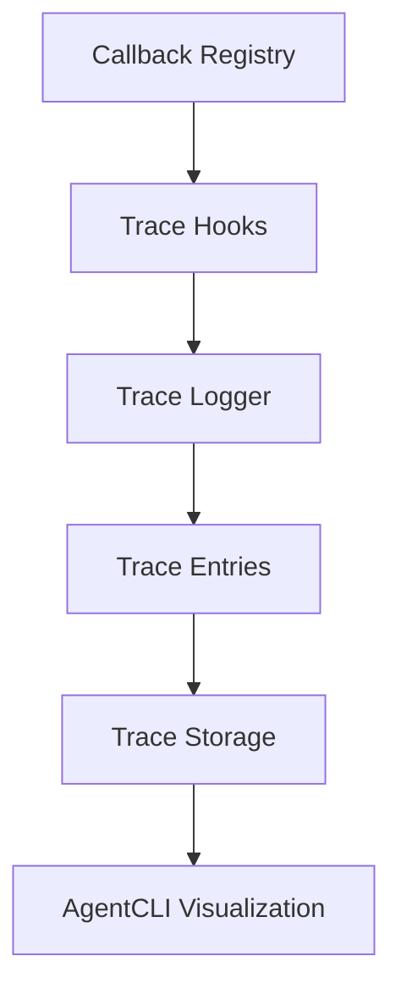

# AgentFlow Tracing Guide

## Overview

**AgentFlow** provides a robust tracing system aligned with **Azure observability best practices**, enabling deep monitoring, debugging, and understanding of multi-agent workflow execution.

---

## Tracing Architecture



### Core Components

* **Callback Registry**: Central registration point for trace hooks.
* **Trace Hooks**: Capture data at key execution points.
* **Trace Logger**: Interface for storing trace entries.
* **Trace Storage**: In-memory or file-based persistence.
* **AgentCLI**: Tool for trace visualization and analysis.

---

## Lifecycle Hooks

AgentFlow registers trace hooks at critical lifecycle stages:

| Hook Point            | Trigger Timing                        | Purpose                              |
| --------------------- | ------------------------------------- | ------------------------------------ |
| `BeforeEventHandling` | Before event processing begins        | Event validation and preparation     |
| `BeforeAgentRun`      | Twice: Orchestrator and Runner phases | Routing setup and execution prep     |
| `AfterAgentRun`       | After agent completes                 | State transition and result handling |
| `AfterEventHandling`  | After event is fully processed        | Cleanup and metrics collection       |
| `AgentError`          | On agent execution failure            | Error reporting and recovery         |

---

## Dual `BeforeAgentRun` Hooks Explained

AgentFlow intentionally records two `BeforeAgentRun` entries per execution:

### 1. **Orchestrator Phase**

* **When**: Before routing decision.
* **Purpose**: Shows how the orchestrator selects an agent.
* **State**: Pre-routing data.

### 2. **Runner Phase**

* **When**: Right before calling `Run()`.
* **Purpose**: Marks the actual execution start.
* **State**: May reflect updated routing decisions.
* **Use**: Final checkpoint for circuit breaking or cancellation.

> This dual-hook pattern enhances observability by capturing both decision-making and execution contexts.

---

## Setting Up Tracing

Add tracing in **3 simple steps**:

### Using AgentFlow as a Library

```go
package main

import (
    "context"
    "fmt"
    "time"
    
    agentflow "github.com/kunalkushwaha/agentflow/core"
)

func main() {
    // 1. Create a trace logger
    traceLogger := agentflow.NewInMemoryTraceLogger()

    // 2. Create runner with tracing
    runner := agentflow.NewRunnerWithConfig(agentflow.RunnerConfig{
        Agents:      agents,
        QueueSize:   10,
        TraceLogger: traceLogger, // Set trace logger during creation
    })

    // 3. Tracing is automatically enabled
    // No additional setup required!

    // Optional: Access traces programmatically
    sessionID := "your-session-id"
    traces, err := runner.DumpTrace(sessionID)
    if err != nil {
        fmt.Printf("Error getting traces: %v\n", err)
    } else {
        fmt.Printf("Found %d trace entries\n", len(traces))
        for _, trace := range traces {
            fmt.Printf("  %s: %s - Agent: %s\n", 
                trace.Timestamp.Format("15:04:05.000"),
                trace.Type, 
                trace.AgentID)
        }
    }
}
```

### Legacy Setup (for internal development)

```go
// 1. Create a trace logger
traceLogger := agentflow.NewInMemoryTraceLogger()

// 2. Set the logger on the runner
runner.SetTraceLogger(traceLogger)

// 3. Register trace hooks
agentflow.RegisterTraceHooks(callbackRegistry, traceLogger)
```

---

## Trace Entry Structure

A `TraceEntry` provides detailed insight into agent execution:

```go
type TraceEntry struct {
    Timestamp     time.Time
    Type          string
    EventID       string
    SessionID     string
    AgentID       string       // optional
    State         State        // optional
    Error         string       // optional
    Hook          HookPoint    // optional
    TargetAgentID string       // optional
    SourceAgentID string       // optional
    AgentResult   *AgentResult // optional
}
```

---

## Analyzing Trace Output

Use the `agentcli` tool to inspect trace data:

```bash
# Full trace with all details
agentcli trace <session-id>

# Visualize agent flow only
agentcli trace --flow-only <session-id>

# Filter by specific agent
agentcli trace --filter <agent-name> <session-id>
```

### Trace Insights:

* Agent interaction sequences
* State transitions and routing logic
* Error handling patterns
* Performance bottlenecks

---

## Best Practices

### 1. Enable Full Tracing in Development (Library Usage)

```go
import agentflow "github.com/kunalkushwaha/agentflow/core"

func main() {
    traceLogger := agentflow.NewInMemoryTraceLogger()
    
    runner := agentflow.NewRunnerWithConfig(agentflow.RunnerConfig{
        Agents:      agents,
        QueueSize:   10,
        TraceLogger: traceLogger,
    })
    
    // Tracing is automatically enabled
}
```

### 2. Use File-Based Tracing in Production

```go
traceLogger := agentflow.NewFileTraceLogger("./traces")

runner := agentflow.NewRunnerWithConfig(agentflow.RunnerConfig{
    Agents:      agents,
    QueueSize:   100,
    TraceLogger: traceLogger,
})
```

### 3. Maintain Consistent Session IDs

```go
sessionID := fmt.Sprintf("session-%d", time.Now().UnixNano())

eventMetadata := map[string]string{
    agentflow.SessionIDKey: sessionID,
}

event := agentflow.NewEvent(targetAgent, payload, eventMetadata)
```

### 4. Provide Rich State Data

```go
state.Set("request_id", requestID)
state.Set("operation_context", context)
state.Set("input_parameters", params)
```

### 5. Analyze Dual `BeforeAgentRun` Hooks

Example:

```bash
16:27:31.956 | BeforeAgentRun | planner  | {user_request: "Research..."}
16:27:31.956 | BeforeAgentRun | planner  | {user_request: "Research...", route: "researcher"}
```

* First entry: Initial state before routing.
* Second entry: Updated state after routing decisions.

---

## Troubleshooting

### Missing Trace Entries?

* Confirm trace logger is initialized and set.
* Ensure `RegisterTraceHooks` was called.
* Check for consistent session IDs.

### Unexpected Routing?

* Compare state between the two `BeforeAgentRun` hooks.
* Look for `RouteMetadataKey` after `AfterAgentRun`.
* Inspect orchestrator decisions in the trace.

---

## Advanced Usage

### Custom Trace Loggers

Implement the `TraceLogger` interface for custom tracing solutions:

```go
package main

import (
    "encoding/json"
    "os"
    
    agentflow "github.com/kunalkushwaha/agentflow/core"
)

// CustomTraceLogger implements TraceLogger interface
type CustomTraceLogger struct {
    filename string
}

func NewCustomTraceLogger(filename string) *CustomTraceLogger {
    return &CustomTraceLogger{filename: filename}
}

func (t *CustomTraceLogger) Log(entry agentflow.TraceEntry) error {
    // Your custom logging logic
    data, err := json.Marshal(entry)
    if err != nil {
        return err
    }
    
    file, err := os.OpenFile(t.filename, os.O_APPEND|os.O_CREATE|os.O_WRONLY, 0644)
    if err != nil {
        return err
    }
    defer file.Close()
    
    _, err = file.Write(append(data, '\n'))
    return err
}

func (t *CustomTraceLogger) GetTrace(sessionID string) ([]agentflow.TraceEntry, error) {
    // Your custom trace retrieval logic
    return nil, nil
}

// Usage
func main() {
    customLogger := NewCustomTraceLogger("custom-traces.log")
    
    runner := agentflow.NewRunnerWithConfig(agentflow.RunnerConfig{
        Agents:      agents,
        TraceLogger: customLogger,
    })
}
```

### Trace Analysis in CI/CD

```bash
agentcli trace --validate-flow <expected-pattern.json> <session-id>
```

### Distributed Trace Context Propagation

```go
event.SetMetadata("trace_id", span.SpanContext().TraceID().String())
event.SetMetadata("span_id", span.SpanContext().SpanID().String())
```

---

## Conclusion

Effective tracing in **AgentFlow** is essential for:

* Debugging workflows
* Understanding agent behavior
* Diagnosing performance issues

By leveraging the **dual-hook architecture** and best practices outlined above, you'll gain deep, actionable insight into your multi-agent systems.


