# CLI Commands API Reference

This document provides comprehensive reference for AgentFlow's command-line interface (`agentcli`), covering all commands, options, and usage patterns.

## 🏗️ Installation and Setup

### Installation

```bash
# Install from source
go install github.com/zynkworks/agentflow/cmd/agentcli@latest

# Or download binary from releases
curl -L https://github.com/zynkworks/agentflow/releases/latest/download/agentcli-${OS}-${ARCH}.tar.gz | tar xz
```

### Global Configuration

```bash
# Set default configuration directory
export AGENTFLOW_CONFIG_DIR=~/.agentflow

# Set default project templates repository
export AGENTFLOW_TEMPLATES_REPO=https://github.com/zynkworks/agentflow-templates
```

## 📋 Command Structure

```
agentcli [global options] command [command options] [arguments...]
```

### Global Options

| Option | Short | Description | Default |
|--------|-------|-------------|---------|
| `--config` | `-c` | Path to configuration file | `agentflow.toml` |
| `--verbose` | `-v` | Enable verbose output | `false` |
| `--quiet` | `-q` | Suppress non-error output | `false` |
| `--no-color` |  | Disable colored output | `false` |
| `--help` | `-h` | Show help information | |
| `--version` |  | Show version information | |

## 🚀 Project Management Commands

### `create`

Creates a new AgentFlow project with multi-agent orchestration and visualization capabilities.

```bash
agentcli create [options] <project-name>
```

#### Basic Options

| Option | Description | Default |
|--------|-------------|---------|
| `--template` | Template to use | `basic` |
| `--path` | Directory to create project in | current directory |
| `--no-git` | Skip git repository initialization | `false` |
| `--no-deps` | Skip dependency installation | `false` |
| `--overwrite` | Overwrite existing directory | `false` |
| `--provider` | LLM provider to configure | `azure` |
| `--agents` | Number of agents (legacy) | `1` |
| `--interactive` | Interactive project setup | `false` |

#### Multi-Agent Orchestration Options

| Option | Description | Default |
|--------|-------------|---------|
| `--orchestration-mode` | Orchestration mode (sequential, collaborative, loop, mixed, route) | `sequential` |
| `--collaborative-agents` | Comma-separated list of collaborative agents | |
| `--sequential-agents` | Comma-separated list of sequential agents | |
| `--loop-agent` | Agent name for loop orchestration | |
| `--max-iterations` | Maximum loop iterations | `5` |
| `--orchestration-timeout` | Timeout in seconds | `30` |
| `--failure-threshold` | Failure threshold (0.0-1.0) | `0.5` |
| `--max-concurrency` | Maximum concurrent agents | `10` |

**Note**: All orchestration settings are saved to `agentflow.toml` and can be modified without changing code.

#### Visualization Options

| Option | Description | Default |
|--------|-------------|---------|
| `--visualize` | Generate workflow diagrams | `false` |
| `--visualize-output` | Custom output directory for diagrams | `./` |

#### MCP Integration Options

| Option | Description | Default |
|--------|-------------|---------|
| `--mcp-enabled` | Enable MCP integration | `false` |
| `--mcp-production` | Production MCP setup | `false` |
| `--with-cache` | Enable caching | `false` |
| `--with-metrics` | Enable metrics | `false` |
| `--mcp-tools` | Comma-separated list of MCP tools | |
| `--mcp-servers` | Comma-separated list of MCP servers | |
| `--cache-backend` | Cache backend (memory, redis) | `memory` |
| `--metrics-port` | Metrics port | `9090` |
| `--with-load-balancer` | Enable load balancing | `false` |

#### Available Templates

| Template | Description | Use Case |
|----------|-------------|----------|
| `basic` | Simple single-agent project | Getting started, prototyping |
| `collaborative` | Multi-agent collaborative workflow | Parallel processing, research systems |
| `sequential` | Sequential pipeline workflow | Data processing, transformation |
| `loop` | Loop-based workflow | Quality checking, iterative processing |
| `mixed` | Mixed orchestration workflow | Complex business processes |
| `tools` | Agent with custom MCP tools | Domain-specific functionality |
| `production` | Production-ready setup | Deployment, monitoring |
| `minimal` | Minimal configuration | Learning, experimentation |

#### Multi-Agent Orchestration Examples

```bash
# Create collaborative research system
agentcli create research-system \
  --orchestration-mode collaborative \
  --collaborative-agents "researcher,analyzer,validator" \
  --visualize \
  --mcp-enabled

# Create sequential data pipeline
agentcli create data-pipeline \
  --orchestration-mode sequential \
  --sequential-agents "collector,processor,formatter" \
  --visualize-output "docs/diagrams"

# Create loop-based quality checker
agentcli create quality-loop \
  --orchestration-mode loop \
  --loop-agent "quality-checker" \
  --max-iterations 5 \
  --visualize

# Create mixed workflow
agentcli create complex-workflow \
  --orchestration-mode mixed \
  --collaborative-agents "analyzer,validator" \
  --sequential-agents "processor,reporter" \
  --failure-threshold 0.8 \
  --max-concurrency 10 \
  --visualize

# Create production MCP project
agentcli create production-system \
  --mcp-production \
  --with-cache \
  --with-metrics \
  --mcp-tools "web_search,summarize,translate" \
  --mcp-servers "docker,web-service"
```

#### Examples

```bash
# Create basic project
agentcli create my-agent

# Create collaborative multi-agent system
agentcli create --orchestration-mode collaborative \
  --collaborative-agents "research,analyze,validate" \
  --visualize my-workflow

# Create sequential pipeline
agentcli create --orchestration-mode sequential \
  --sequential-agents "collect,process,format" \
  --visualize-output "docs" data-pipeline

# Create project with specific provider and MCP
agentcli create --provider azure --mcp-enabled \
  --orchestration-mode mixed \
  --collaborative-agents "analyzer,validator" \
  --sequential-agents "processor,reporter" my-app

# Create project in specific directory
agentcli create --path ./projects --visualize production-agent

# Create without git initialization
agentcli create --no-git --template minimal test-agent

# Interactive project creation
agentcli create --interactive
```

#### Generated Project Structure

```
my-agent/
├── agentflow.toml          # Configuration file
├── main.go                 # Entry point with orchestration
├── agents/                 # Agent implementations
│   ├── researcher.go       # Research agent (if collaborative)
│   ├── analyzer.go         # Analysis agent (if collaborative)
│   └── validator.go        # Validation agent (if collaborative)
├── workflow.mmd            # Generated Mermaid diagram (if --visualize)
├── docs/                   # Documentation
│   └── diagrams/           # Workflow diagrams (if custom output)
├── tools/                  # Custom MCP tools (if applicable)
├── config/                 # Additional configuration
├── tests/                  # Test files
├── go.mod                  # Go module file
├── go.sum                  # Go module checksums
├── .gitignore             # Git ignore rules
├── README.md              # Project documentation
└── Dockerfile             # Container configuration (production template)
```

#### Generated Workflow Diagrams

When using `--visualize`, the CLI generates Mermaid diagrams showing the workflow:

**Collaborative Mode:**

```mermaid
---
title: Collaborative Multi-Agent Workflow
---
flowchart TD
    INPUT["🎯 Event Input"]
    RESEARCHER["🤖 Researcher"]
    ANALYZER["🤖 Analyzer"]
    VALIDATOR["🤖 Validator"]
    OUTPUT["✅ Aggregated Result"]
    
    INPUT --> RESEARCHER
    INPUT --> ANALYZER
    INPUT --> VALIDATOR
    RESEARCHER --> OUTPUT
    ANALYZER --> OUTPUT
    VALIDATOR --> OUTPUT
```


**Sequential Mode:**

```mermaid
---
title: Sequential Processing Pipeline
---
flowchart TD
    INPUT["🎯 Event Input"]
    COLLECTOR["🤖 Collector"]
    PROCESSOR["🤖 Processor"]
    FORMATTER["🤖 Formatter"]
    OUTPUT["✅ Final Result"]
    
    INPUT --> COLLECTOR
    COLLECTOR --> PROCESSOR
    PROCESSOR --> FORMATTER
    FORMATTER --> OUTPUT
```


### `init`

Initializes AgentFlow in an existing project.

```bash
agentcli init [options]
```

#### Options

| Option | Description | Default |
|--------|-------------|---------|
| `--provider` | LLM provider to configure | `azure` |
| `--mcp` | Enable MCP integration | `true` |
| `--force` | Overwrite existing configuration | `false` |

#### Examples

```bash
# Initialize with Azure OpenAI
agentcli init --provider azure

# Initialize with OpenAI and force overwrite
agentcli init --provider openai --force

# Initialize without MCP integration
agentcli init --no-mcp
```

## 🔧 MCP (Model Context Protocol) Commands

### `mcp list`

Lists all configured MCP servers and their tools.

```bash
agentcli mcp list [options]
```

#### Options

| Option | Description | Default |
|--------|-------------|---------|
| `--status` | Show server health status | `false` |
| `--tools` | Show available tools | `false` |
| `--format` | Output format (table, json, yaml) | `table` |
| `--server` | Filter by server name | |

#### Examples

```bash
# List all servers
agentcli mcp list

# List servers with health status
agentcli mcp list --status

# List tools for all servers
agentcli mcp list --tools

# List tools for specific server
agentcli mcp list --server web-search --tools

# Output as JSON
agentcli mcp list --tools --format json
```

#### Sample Output

```
MCP Servers:
┌─────────────┬─────────┬────────────┬───────────────┐
│ SERVER      │ STATUS  │ TOOLS      │ LAST PING     │
├─────────────┼─────────┼────────────┼───────────────┤
│ web-search  │ Running │ 3          │ 2s ago        │
│ file-tools  │ Running │ 7          │ 1s ago        │
│ calculator  │ Running │ 5          │ 3s ago        │
│ database    │ Error   │ 0          │ 30s ago       │
└─────────────┴─────────┴────────────┴───────────────┘

Available Tools:
┌──────────────────┬─────────────┬──────────────────────────────┐
│ TOOL             │ SERVER      │ DESCRIPTION                  │
├──────────────────┼─────────────┼──────────────────────────────┤
│ web_search       │ web-search  │ Search the web for info      │
│ read_file        │ file-tools  │ Read contents of a file      │
│ write_file       │ file-tools  │ Write content to a file      │
│ calculate        │ calculator  │ Perform calculations         │
│ query_db         │ database    │ Query the database           │
└──────────────────┴─────────────┴──────────────────────────────┘
```

### `mcp test`

Tests MCP server connectivity and tool functionality.

```bash
agentcli mcp test [options] [server-name]
```

#### Options

| Option | Description | Default |
|--------|-------------|---------|
| `--tool` | Test specific tool | |
| `--timeout` | Timeout for tests | `30s` |
| `--params` | Tool parameters (JSON) | `{}` |

#### Examples

```bash
# Test all servers
agentcli mcp test

# Test specific server
agentcli mcp test web-search

# Test specific tool
agentcli mcp test --tool web_search --params '{"query":"test"}'

# Test with custom timeout
agentcli mcp test --timeout 10s calculator
```

### `mcp start/stop/restart`

Control MCP server lifecycle.

```bash
agentcli mcp start [server-name]
agentcli mcp stop [server-name] 
agentcli mcp restart [server-name]
```

#### Examples

```bash
# Start all servers
agentcli mcp start

# Start specific server
agentcli mcp start web-search

# Stop all servers
agentcli mcp stop

# Restart specific server
agentcli mcp restart database
```

## 🗂️ Cache Management Commands

### `cache list`

Lists cached items and statistics.

```bash
agentcli cache list [options]
```

#### Options

| Option | Description | Default |
|--------|-------------|---------|
| `--type` | Cache type (tool, llm, state) | `all` |
| `--stats` | Show cache statistics | `false` |
| `--expired` | Show only expired items | `false` |

#### Examples

```bash
# List all cached items
agentcli cache list

# List tool cache statistics
agentcli cache list --type tool --stats

# List expired cache items
agentcli cache list --expired
```

### `cache clear`

Clears cached items.

```bash
agentcli cache clear [options]
```

#### Options

| Option | Description | Default |
|--------|-------------|---------|
| `--type` | Cache type to clear | `all` |
| `--expired` | Clear only expired items | `false` |
| `--confirm` | Skip confirmation prompt | `false` |

#### Examples

```bash
# Clear all cache
agentcli cache clear --confirm

# Clear only tool cache
agentcli cache clear --type tool

# Clear expired items
agentcli cache clear --expired
```

## 📊 Tracing and Debugging Commands

### `trace list`

Lists execution traces for debugging.

```bash
agentcli trace list [options]
```

#### Options

| Option | Description | Default |
|--------|-------------|---------|
| `--session` | Filter by session ID | |
| `--agent` | Filter by agent name | |
| `--limit` | Maximum number of traces | `50` |
| `--format` | Output format (table, json) | `table` |
| `--since` | Show traces since time | `24h` |

#### Examples

```bash
# List recent traces
agentcli trace list

# List traces for specific session
agentcli trace list --session sess_abc123

# List traces for specific agent
agentcli trace list --agent chat-agent --limit 10

# Export traces as JSON
agentcli trace list --format json --since 1h > traces.json
```

### `trace show`

Shows detailed trace information.

```bash
agentcli trace show <trace-id>
```

#### Examples

```bash
# Show specific trace
agentcli trace show trace_xyz789

# Show trace with full event data
agentcli trace show --full trace_xyz789
```

### `trace clear`

Clears stored traces.

```bash
agentcli trace clear [options]
```

#### Options

| Option | Description | Default |
|--------|-------------|---------|
| `--older-than` | Clear traces older than duration | `7d` |
| `--session` | Clear traces for specific session | |
| `--confirm` | Skip confirmation prompt | `false` |

## 🧪 Testing and Development Commands

### `run`

Runs an agent interactively for testing.

```bash
agentcli run [options] [agent-name]
```

#### Options

| Option | Description | Default |
|--------|-------------|---------|
| `--input` | Input file or string | |
| `--output` | Output file | stdout |
| `--session` | Session ID for stateful testing | |
| `--trace` | Enable detailed tracing | `false` |
| `--timeout` | Execution timeout | `60s` |

#### Examples

```bash
# Run agent interactively
agentcli run chat-agent

# Run agent with input file
agentcli run --input test-queries.txt my-agent

# Run with specific session
agentcli run --session test-session-1 --trace chat-agent

# Run with custom timeout
agentcli run --timeout 30s research-agent
```

### `test`

Runs automated tests for agents.

```bash
agentcli test [options] [test-pattern]
```

#### Options

| Option | Description | Default |
|--------|-------------|---------|
| `--verbose` | Verbose test output | `false` |
| `--timeout` | Test timeout | `5m` |
| `--parallel` | Run tests in parallel | `true` |
| `--coverage` | Generate coverage report | `false` |

#### Examples

```bash
# Run all tests
agentcli test

# Run specific test pattern
agentcli test TestChatAgent

# Run with coverage
agentcli test --coverage --verbose

# Run tests sequentially
agentcli test --parallel=false
```

### `benchmark`

Runs performance benchmarks.

```bash
agentcli benchmark [options]
```

#### Options

| Option | Description | Default |
|--------|-------------|---------|
| `--agent` | Agent to benchmark | |
| `--duration` | Benchmark duration | `30s` |
| `--concurrent` | Concurrent users | `10` |
| `--requests` | Total requests | |
| `--profile` | Enable profiling (cpu, mem) | |
| `--output` | Output file | |

#### Examples

```bash
# Basic benchmark
agentcli benchmark --duration 60s

# Benchmark specific agent
agentcli benchmark --agent chat-agent --concurrent 20

# Run with profiling
agentcli benchmark --profile cpu --output profile.out

# Fixed number of requests
agentcli benchmark --requests 1000 --concurrent 50
```

## 📁 Configuration Commands

### `config show`

Shows current configuration.

```bash
agentcli config show [options]
```

#### Options

| Option | Description | Default |
|--------|-------------|---------|
| `--format` | Output format (toml, json, yaml) | `toml` |
| `--section` | Show specific section | |

#### Examples

```bash
# Show full configuration
agentcli config show

# Show as JSON
agentcli config show --format json

# Show specific section
agentcli config show --section llm
```

### `config validate`

Validates configuration file.

```bash
agentcli config validate [config-file]
```

#### Examples

```bash
# Validate default config
agentcli config validate

# Validate specific file
agentcli config validate production.toml
```

### `config set`

Sets configuration values.

```bash
agentcli config set <key> <value>
```

#### Examples

```bash
# Set LLM provider
agentcli config set llm.provider azure

# Set API endpoint
agentcli config set llm.azure.endpoint https://my-endpoint.openai.azure.com

# Enable MCP
agentcli config set mcp.enabled true
```

## 📈 Monitoring Commands

### `status`

Shows overall system status.

```bash
agentcli status [options]
```

#### Options

| Option | Description | Default |
|--------|-------------|---------|
| `--detailed` | Show detailed status | `false` |
| `--format` | Output format (table, json) | `table` |

#### Examples

```bash
# Show basic status
agentcli status

# Show detailed status
agentcli status --detailed

# Output as JSON for monitoring
agentcli status --format json
```

### `logs`

Views application logs.

```bash
agentcli logs [options]
```

#### Options

| Option | Description | Default |
|--------|-------------|---------|
| `--follow` | Follow log output | `false` |
| `--since` | Show logs since time | `1h` |
| `--level` | Log level filter | |
| `--grep` | Filter by pattern | |

#### Examples

```bash
# View recent logs
agentcli logs --since 30m

# Follow logs in real-time
agentcli logs --follow

# Filter by error level
agentcli logs --level error --since 1d

# Search for pattern
agentcli logs --grep "tool execution"
```

## 🔧 Utility Commands

### `version`

Shows version information.

```bash
agentcli version [options]
```

#### Options

| Option | Description |
|--------|-------------|
| `--short` | Show only version number |
| `--build` | Show build information |

### `completion`

Generates shell completion scripts.

```bash
agentcli completion <shell>
```

#### Supported Shells

- `bash`
- `zsh`
- `fish`
- `powershell`

#### Examples

```bash
# Generate bash completion
agentcli completion bash > ~/.agentcli-completion.bash

# Generate zsh completion
agentcli completion zsh > ~/.zsh/completions/_agentcli

# Generate fish completion
agentcli completion fish > ~/.config/fish/completions/agentcli.fish
```

### `docs`

Opens documentation in browser.

```bash
agentcli docs [options] [topic]
```

#### Options

| Option | Description |
|--------|-------------|
| `--local` | Open local documentation |
| `--api` | Open API reference |

#### Examples

```bash
# Open main documentation
agentcli docs

# Open specific topic
agentcli docs mcp

# Open API reference
agentcli docs --api
```

## 📝 Configuration File Reference

### Sample `agentflow.toml`

```toml
# AgentFlow Configuration
version = "1.0"

[runner]
max_concurrent_events = 100
event_timeout = "30s"
enable_tracing = true

# Multi-Agent Orchestration Configuration
[orchestration]
mode = "collaborative"        # collaborative, sequential, loop, mixed
timeout = "60s"
failure_threshold = 0.5       # 0.0-1.0
max_concurrency = 5
max_iterations = 10           # for loop mode

# Collaborative agents (parallel processing)
collaborative_agents = ["researcher", "analyzer", "validator"]

# Sequential agents (pipeline processing)
sequential_agents = ["collector", "processor", "formatter"]

# Loop agent (iterative processing)
loop_agent = "quality-checker"

# Workflow Visualization
[visualization]
enabled = true
output_dir = "./docs/diagrams"
diagram_type = "flowchart"    # flowchart, sequence, etc.
direction = "TD"              # TD, LR, BT, RL
show_metadata = true
show_agent_types = true

[llm]
provider = "azure"

[llm.azure]
endpoint = "${AZURE_OPENAI_ENDPOINT}"
api_key = "${AZURE_OPENAI_API_KEY}"
deployment = "gpt-4o"
max_tokens = 4000

[mcp]
enabled = true
timeout = "30s"
cache_enabled = true
cache_ttl = "1h"

[[mcp.servers]]
name = "web-search"
command = "mcp-web-search"
args = ["--port", "8080"]

[[mcp.servers]]
name = "file-tools"
command = "docker"
args = ["run", "mcp-file-tools"]

[logging]
level = "info"
format = "json"
file = "agentflow.log"

[monitoring]
enable_metrics = true
metrics_port = 9090
```

## 🚨 Exit Codes

| Code | Description |
|------|-------------|
| 0 | Success |
| 1 | General error |
| 2 | Configuration error |
| 3 | Network/connectivity error |
| 4 | Permission error |
| 5 | File not found |
| 10 | MCP server error |
| 20 | Agent execution error |
| 30 | Tool execution error |

This CLI reference provides comprehensive coverage of all AgentFlow command-line tools and their usage patterns for development, testing, and production management.
