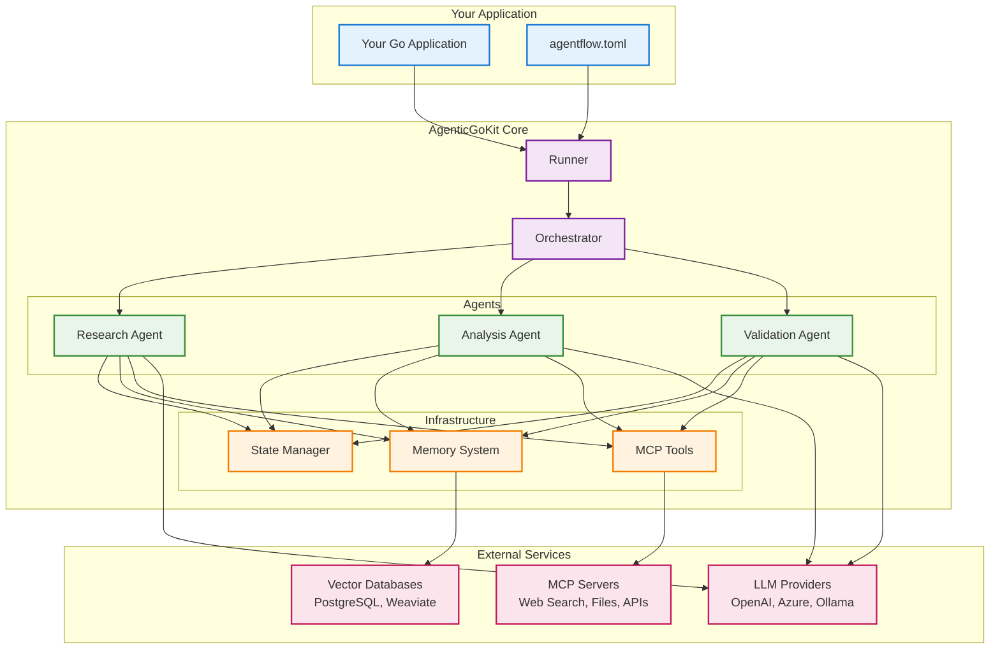
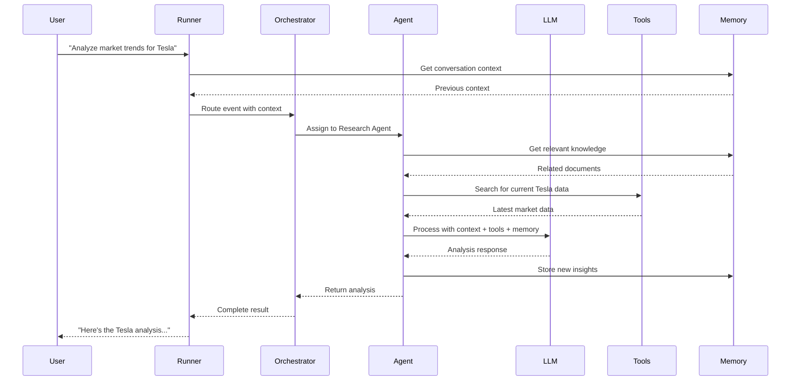
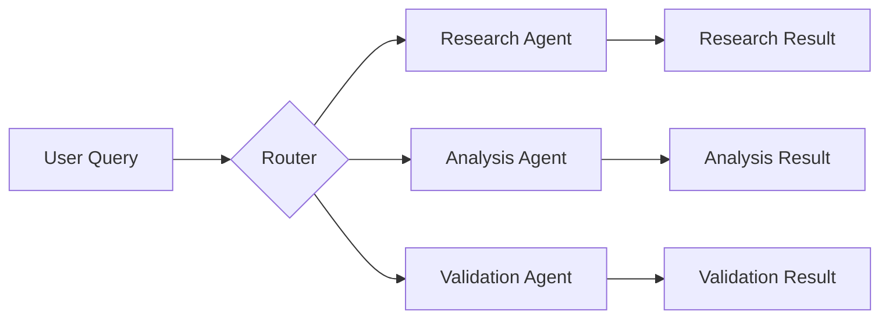
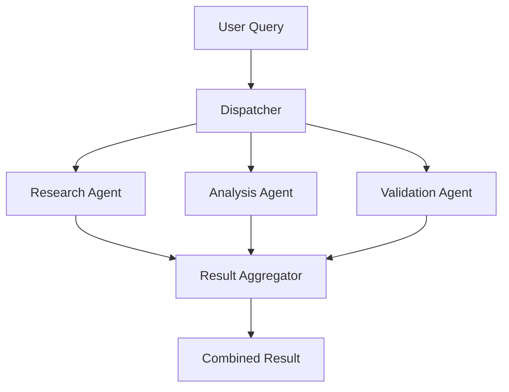
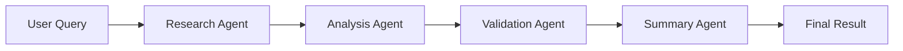
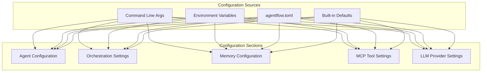

# AgenticGoKit Architecture Overview

**A visual guide to understanding how AgenticGoKit works**

AgenticGoKit is designed around a simple but powerful principle: **agents work together through events to solve complex problems**. This overview shows you how the pieces fit together and how data flows through the system.

## 🏗️ High-Level Architecture



## 🔄 How Data Flows Through the System



## 🧩 Core Components Explained

### 🎯 **Runner** - The Central Coordinator
The Runner is your main entry point. It:
- Receives your requests and creates events
- Manages the overall workflow
- Handles configuration and setup
- Returns final results to your application

```go
// Simple usage
runner := core.CreateCollaborativeRunner(agents, 30*time.Second)
result := runner.Emit(core.NewEvent("user_query", "Analyze market trends"))
```

### 🎭 **Orchestrator** - The Traffic Director
The Orchestrator decides how agents work together:
- **Route Mode**: Sends events to specific agents
- **Collaborative Mode**: All agents work in parallel
- **Sequential Mode**: Agents work in a pipeline
- **Mixed Mode**: Combines parallel and sequential patterns

### 🤖 **Agents** - The Workers
Agents are where the magic happens:
- Each agent has a specific role (research, analysis, validation)
- They can use tools and access memory
- They communicate with LLMs to process information
- They pass results to other agents or back to the user

### 💾 **State Manager** - The Memory Keeper
Manages data flow between agents:
- Stores conversation context
- Passes data between agents
- Maintains session information
- Handles concurrent access safely

### 🧠 **Memory System** - The Knowledge Base
Provides persistent knowledge and context:
- Stores documents and conversations
- Enables RAG (Retrieval-Augmented Generation)
- Supports vector search for relevant information
- Works with PostgreSQL, Weaviate, or in-memory storage

### 🛠️ **MCP Tools** - The Capabilities
Model Context Protocol tools extend what agents can do:
- Web search for real-time information
- File operations for document processing
- Database queries for data access
- Custom tools for specific needs

## 🎨 Orchestration Patterns

### 🎯 Route Pattern - Single Agent Processing

**When to use**: Simple queries that need specific expertise

### 🤝 Collaborative Pattern - Parallel Processing

**When to use**: Complex queries that benefit from multiple perspectives

### 🔄 Sequential Pattern - Pipeline Processing

**When to use**: Multi-step processes where each step builds on the previous

## 🚀 Getting Started with the Architecture

### 1. **Start Simple** - Single Agent
```go
// Create a simple agent
agent := &MyAgent{}
runner := core.CreateRunner(map[string]core.AgentHandler{
    "my_agent": agent,
})

// Send a query
result := runner.Emit(core.NewEvent("user_query", "Hello world"))
```

### 2. **Add Collaboration** - Multiple Agents
```go
// Create multiple agents
agents := map[string]core.AgentHandler{
    "researcher": &ResearchAgent{},
    "analyzer":   &AnalysisAgent{},
    "validator":  &ValidationAgent{},
}

// Use collaborative orchestration
runner := core.CreateCollaborativeRunner(agents, 30*time.Second)
```

### 3. **Add Memory** - Persistent Context
```go
// Enable memory system
config := core.Config{
    AgentMemory: core.MemoryConfig{
        Provider:   "pgvector",
        Connection: "postgres://localhost/agentflow",
    },
}
runner := core.NewRunnerFromConfig("agentflow.toml")
```

### 4. **Add Tools** - External Capabilities
```go
// Tools are configured in agentflow.toml
[mcp]
enabled = true

[[mcp.servers]]
name = "web-search"
type = "stdio"
command = "npx @modelcontextprotocol/server-web-search"
enabled = true
```

## 🔧 Configuration Architecture

AgenticGoKit uses a layered configuration approach:



**Priority Order**: CLI Args > Environment Variables > TOML File > Defaults

## 🎯 Key Design Principles

### 1. **Simple by Default, Powerful When Needed**
- Start with a single agent and basic configuration
- Add complexity (multiple agents, memory, tools) as you need it
- Sensible defaults for everything

### 2. **Event-Driven Architecture**
- Everything communicates through events
- Loose coupling between components
- Easy to test and debug

### 3. **Provider Agnostic**
- Switch between OpenAI, Azure, Ollama without changing code
- Same interface for all LLM providers
- Easy to add new providers

### 4. **Production Ready**
- Built-in error handling and retry logic
- Monitoring and metrics support
- Horizontal scaling capabilities

## 🔍 Debugging and Observability

AgenticGoKit provides multiple ways to understand what's happening:

### Event Tracing
```bash
# View detailed execution flow
agentcli trace --verbose <session-id>
```

### State Inspection
```go
// Access current state in agents
func (a *MyAgent) Execute(ctx context.Context, event core.Event, state *core.State) (*core.AgentResult, error) {
    // Inspect current state
    fmt.Printf("Current state: %+v\n", state.Data)
    
    // Your agent logic here
    return result, nil
}
```

### Performance Monitoring
```toml
# Enable metrics in agentflow.toml
[monitoring]
enabled = true
port = 8080
```

## 🚀 Next Steps

Now that you understand the architecture:

1. **Try the [5-Minute Quickstart](quickstart.md)** - Get hands-on experience
2. **Explore [15-Minute Tutorials](tutorials/15-minute-series/)** - Learn specific patterns
3. **Check [Core Concepts](tutorials/core-concepts/)** - Deep dive into components
4. **Build [Production Systems](tutorials/15-minute-series/production-deployment.md)** - Scale your agents

## 🤔 Common Questions

**Q: How do I choose between orchestration patterns?**
A: Start with Route for simple queries, use Collaborative for parallel processing, and Sequential for multi-step workflows.

**Q: When should I add memory?**
A: Add memory when you need conversation context, document search, or knowledge persistence across sessions.

**Q: How do I add custom tools?**
A: Create MCP servers for your tools, or implement custom tool interfaces directly in your agents.

**Q: Can I mix different LLM providers?**
A: Yes! Different agents can use different providers, and you can switch providers without changing agent code.

The architecture is designed to grow with your needs - start simple and add complexity as your use cases evolve.