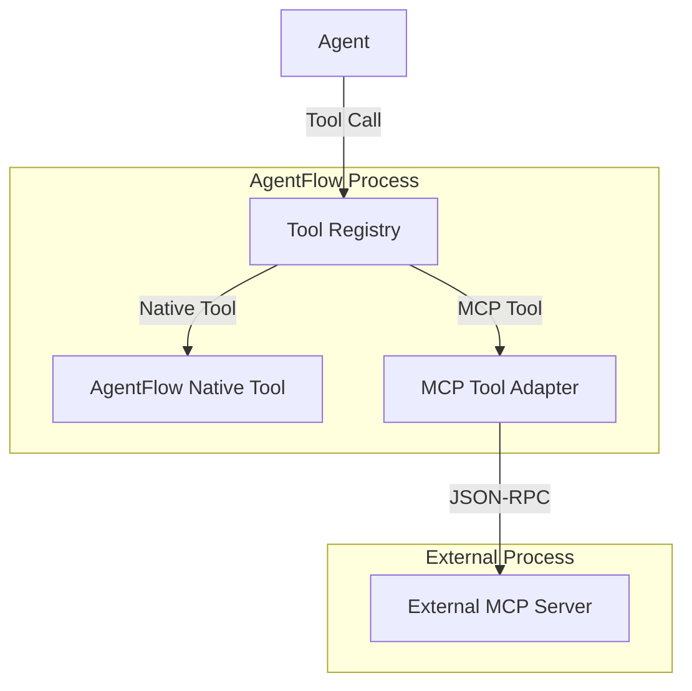

# Custom Tools Guide

> **⚠️ DEPRECATED:** This guide covers custom tools for the legacy `core` package.
> 
> **For new projects, use v1beta:** See **[v1beta Tool Integration Guide](../v1beta/tool-integration.md)** for the modern API.
> 
> **Migrating from legacy?** See **[Migration Guide](../MIGRATION.md#tool-integration)**

---

This guide covers building custom tools for AgentFlow agents. Learn how to create AgentFlow-native tools using the `FunctionTool` interface and how to integrate external MCP servers for extended functionality.

## 🎯 Overview

AgentFlow supports two types of custom tools:

1. **AgentFlow-Native Tools**: Built using the `FunctionTool` interface and registered with the tool registry
2. **External MCP Tools**: Tools from external MCP servers that are discovered and integrated automatically

**Key Benefits:**
- **Native Integration**: Direct tool registration with the AgentFlow tool registry
- **Dynamic Discovery**: Automatic discovery of external MCP server tools
- **Standardized Interface**: Consistent `FunctionTool` interface for all tools
- **Type Safety**: JSON-serializable arguments and return values

## 🏗️ AgentFlow Tool Architecture

### **Tool System Overview**



**Key Components:**
- **Tool Registry**: Central registry for all available tools
- **FunctionTool Interface**: Standard interface for all tools
- **MCP Tool Adapter**: Bridge between AgentFlow and external MCP servers
- **Built-in Tools**: Web search, compute metrics, and other core functionality

## 🛠️ Building AgentFlow-Native Tools

### **1. FunctionTool Interface**

All AgentFlow tools implement the `FunctionTool` interface:

```go
package tools

import "context"

// FunctionTool defines the interface for a callable tool that agents can use.
type FunctionTool interface {
    // Name returns the unique identifier for the tool.
    Name() string
    // Call executes the tool's logic with the given arguments.
    // Arguments and return values must be JSON-serializable.
    Call(ctx context.Context, args map[string]any) (map[string]any, error)
}
```

### **2. Simple Tool Implementation**

```go
package tools

import (
    "context"
    "fmt"
)

// CalculatorTool performs mathematical calculations.
type CalculatorTool struct{}

// Name returns the tool's unique identifier.
func (t *CalculatorTool) Name() string {
    return "calculator"
}

// Call performs the calculation based on the provided arguments.
func (t *CalculatorTool) Call(ctx context.Context, args map[string]any) (map[string]any, error) {
    // Extract operation parameter
    opVal, ok := args["operation"]
    if !ok {
        return nil, fmt.Errorf("missing required argument 'operation'")
    }
    operation, ok := opVal.(string)
    if !ok {
        return nil, fmt.Errorf("argument 'operation' must be a string")
    }

    // Extract numeric arguments
    aVal, ok := args["a"]
    if !ok {
        return nil, fmt.Errorf("missing required argument 'a'")
    }
    a, ok := aVal.(float64)
    if !ok {
        return nil, fmt.Errorf("argument 'a' must be a number")
    }

    bVal, ok := args["b"]
    if !ok {
        return nil, fmt.Errorf("missing required argument 'b'")
    }
    b, ok := bVal.(float64)
    if !ok {
        return nil, fmt.Errorf("argument 'b' must be a number")
    }

    // Perform calculation
    var result float64
    switch operation {
    case "add":
        result = a + b
    case "subtract":
        result = a - b
    case "multiply":
        result = a * b
    case "divide":
        if b == 0 {
            return nil, fmt.Errorf("division by zero")
        }
        result = a / b
    default:
        return nil, fmt.Errorf("unsupported operation: %s", operation)
    }

    return map[string]any{
        "result": result,
        "operation": operation,
        "operands": []float64{a, b},
    }, nil
}
```

### **3. Advanced Tool with External API**

```go
package tools

import (
    "context"
    "encoding/json"
    "fmt"
    "net/http"
    "time"
)

// WeatherTool fetches weather information from an external API.
type WeatherTool struct {
    apiKey string
    client *http.Client
}

// NewWeatherTool creates a new weather tool with the provided API key.
func NewWeatherTool(apiKey string) *WeatherTool {
    return &WeatherTool{
        apiKey: apiKey,
        client: &http.Client{Timeout: 10 * time.Second},
    }
}

// Name returns the tool's unique identifier.
func (t *WeatherTool) Name() string {
    return "get_weather"
}

// Call fetches weather information for the specified location.
func (t *WeatherTool) Call(ctx context.Context, args map[string]any) (map[string]any, error) {
    // Extract location parameter
    locationVal, ok := args["location"]
    if !ok {
        return nil, fmt.Errorf("missing required argument 'location'")
    }
    location, ok := locationVal.(string)
    if !ok {
        return nil, fmt.Errorf("argument 'location' must be a string")
    }

    // Optional parameters
    units := "metric"
    if unitsVal, ok := args["units"].(string); ok {
        units = unitsVal
    }

    // Call weather API
    weather, err := t.fetchWeather(ctx, location, units)
    if err != nil {
        return nil, fmt.Errorf("failed to fetch weather: %w", err)
    }

    return map[string]any{
        "location": location,
        "temperature": weather.Temperature,
        "conditions": weather.Conditions,
        "humidity": weather.Humidity,
        "units": units,
        "timestamp": time.Now().Unix(),
    }, nil
}

type WeatherData struct {
    Temperature float64 `json:"temperature"`
    Conditions  string  `json:"conditions"`
    Humidity    int     `json:"humidity"`
}

func (t *WeatherTool) fetchWeather(ctx context.Context, location, units string) (*WeatherData, error) {
    // Implementation would call actual weather API
    // This is a stub implementation
    return &WeatherData{
        Temperature: 22.5,
        Conditions:  "Partly cloudy",
        Humidity:    65,
    }, nil
}
```
                },
            },
        },
    }
}

func (t *CalculatorTool) Execute(ctx context.Context, params map[string]interface{}) (*mcp.ToolResult, error) {
    expression, ok := params["expression"].(string)
    if !ok {
        return nil, fmt.Errorf("expression parameter is required")
    }
    
    precision := 2
    if p, ok := params["precision"].(float64); ok {
        precision = int(p)
    }
    
    // Parse and evaluate expression
    result, err := evaluateExpression(expression)
    if err != nil {
        return &mcp.ToolResult{
            Success: false,
            Error:   fmt.Sprintf("Calculation error: %v", err),
        }, nil
    }
    
    // Format result with specified precision
    formatted := formatNumber(result, precision)
    
    return &mcp.ToolResult{
        Success: true,
        Content: []mcp.Content{
            {
                Type: "text",
                Text: fmt.Sprintf("Result: %s", formatted),
## 📋 Tool Registration

### **1. Using the Tool Registry**

```go
package main

import (
    "context"
    "log"
    
    "github.com/zynkworks/agentflow/internal/tools"
)

func main() {
    // Create a new tool registry
    registry := tools.NewToolRegistry()
    
    // Register native tools
    err := registry.Register(&CalculatorTool{})
    if err != nil {
        log.Fatalf("Failed to register calculator tool: %v", err)
    }
    
    err = registry.Register(NewWeatherTool("your-api-key"))
    if err != nil {
        log.Fatalf("Failed to register weather tool: %v", err)
    }
    
    // List all registered tools
    toolNames := registry.List()
    log.Printf("Registered tools: %v", toolNames)
    
    // Call a tool
    ctx := context.Background()
    result, err := registry.CallTool(ctx, "calculator", map[string]any{
        "operation": "add",
        "a": 10.0,
        "b": 5.0,
    })
    if err != nil {
        log.Fatalf("Tool call failed: %v", err)
    }
    
    log.Printf("Calculator result: %v", result)
}
```

### **2. Agent Integration**

```go
package main

import (
    "context"
    "log"
    
    "github.com/zynkworks/agentflow/core"
    "github.com/zynkworks/agentflow/internal/factory"
)

func main() {
    // Create registry with built-in tools
    registry := factory.NewDefaultToolRegistry()
    
    // Add your custom tools
    registry.Register(&CalculatorTool{})
    registry.Register(NewWeatherTool("your-api-key"))
    
    // Create agent configuration
    config := &core.Config{
        // ... other configuration
    }
    
    // Create agent with tools
    agent := core.NewAgent(config)
    
    // Now agents can discover and use your custom tools
    // Tools are automatically available in agent context
}
```

### **3. Tool Discovery**

```go
package main

import (
    "context"
    "fmt"
    "log"
    
    "github.com/zynkworks/agentflow/internal/tools"
)

func demonstrateToolDiscovery() {
    registry := tools.NewToolRegistry()
    
    // Register some tools
    registry.Register(&CalculatorTool{})
    registry.Register(NewWeatherTool("api-key"))
    
    // Get all available tools
    toolNames := registry.List()
    fmt.Printf("Available tools: %v\n", toolNames)
    
    // Check if a specific tool exists
    if tool, exists := registry.Get("calculator"); exists {
        fmt.Printf("Found calculator tool: %s\n", tool.Name())
    }
    
    // Call tool with error handling
    ctx := context.Background()
    result, err := registry.CallTool(ctx, "get_weather", map[string]any{
        "location": "San Francisco",
        "units": "metric",
    })
    if err != nil {
        log.Printf("Weather tool error: %v", err)
        return
    }
    
    fmt.Printf("Weather result: %v\n", result)
}
```
## 🔌 External MCP Server Integration

### **1. MCP Server Configuration**

AgentFlow can automatically discover and integrate tools from external MCP servers. Configure MCP servers in your `agentflow.toml`:

```toml
[mcp]
enabled = true
enable_discovery = true
discovery_timeout = "30s"
connection_timeout = "10s"

[[mcp.servers]]
name = "custom-tools"
command = "node"
args = ["custom-tools-server.js"]
working_dir = "./tools"
env = { API_KEY = "your-api-key" }

[[mcp.servers]]
name = "database-tools"
command = "python"
args = ["-m", "database_tools.server"]
working_dir = "./tools"
env = { DATABASE_URL = "postgresql://localhost/mydb" }
```

### **2. MCP Tool Auto-Discovery**

```go
package main

import (
    "context"
    "log"
    
    "github.com/zynkworks/agentflow/core"
    "github.com/zynkworks/agentflow/internal/factory"
)

func main() {
    // MCP configuration
    mcpConfig := core.MCPConfig{
        Enabled:           true,
        EnableDiscovery:   true,
        DiscoveryTimeout:  30 * time.Second,
        ConnectionTimeout: 10 * time.Second,
        Servers: []core.MCPServerConfig{
            {
                Name:       "custom-tools",
                Command:    "node",
                Args:       []string{"custom-tools-server.js"},
                WorkingDir: "./tools",
                Env:        map[string]string{"API_KEY": "your-api-key"},
            },
        },
    }
    
    // Create MCP-enabled registry
    registry, mcpManager, err := factory.NewMCPEnabledToolRegistry(mcpConfig)
    if err != nil {
        log.Fatalf("Failed to create MCP-enabled registry: %v", err)
    }
    
    // Tools from MCP servers are automatically discovered and registered
    ctx := context.Background()
    tools := mcpManager.GetAvailableTools()
    log.Printf("Discovered %d MCP tools", len(tools))
    
    // List all available tools (native + MCP)
    allTools := registry.List()
    log.Printf("All available tools: %v", allTools)
}
```

### **3. Using External MCP Tools**

```go
package main

import (
    "context"
    "log"
    
    "github.com/zynkworks/agentflow/core"
)

func useMCPTools() {
    // Get the global MCP manager
    mcpManager := core.GetMCPManager()
    if mcpManager == nil {
        log.Fatal("MCP manager not initialized")
    }
    
    // Execute an MCP tool
    ctx := context.Background()
    result, err := mcpManager.ExecuteTool(ctx, "mcp_custom-tools_weather", map[string]interface{}{
        "location": "New York",
        "units": "fahrenheit",
    })
    if err != nil {
        log.Fatalf("MCP tool execution failed: %v", err)
    }
    
    log.Printf("MCP tool result: %v", result)
}
```
```

## � Advanced Tool Patterns

### **1. Stateful Tools**

Tools that maintain state across calls:

```go
package tools

import (
    "context"
    "fmt"
    "sync"
    "time"
)

type StatefulTool struct {
    sessions map[string]*ToolSession
    mutex    sync.RWMutex
}

type ToolSession struct {
    ID        string
    Data      map[string]interface{}
    CreatedAt time.Time
    LastUsed  time.Time
}

func NewStatefulTool() *StatefulTool {
    return &StatefulTool{
        sessions: make(map[string]*ToolSession),
    }
}

func (t *StatefulTool) Name() string {
    return "stateful_processor"
}

func (t *StatefulTool) Call(ctx context.Context, args map[string]any) (map[string]any, error) {
    sessionID := "default"
    if sid, ok := args["session_id"].(string); ok {
        sessionID = sid
    }
    
    session := t.getOrCreateSession(sessionID)
    
    // Process with session context
    action, ok := args["action"].(string)
    if !ok {
        return nil, fmt.Errorf("missing required argument 'action'")
    }
    
    switch action {
    case "store":
        key := args["key"].(string)
        value := args["value"]
        session.Data[key] = value
        
    case "retrieve":
        key := args["key"].(string)
        value := session.Data[key]
        return map[string]any{
            "session_id": sessionID,
            "key": key,
            "value": value,
        }, nil
        
    case "list":
        keys := make([]string, 0, len(session.Data))
        for k := range session.Data {
            keys = append(keys, k)
        }
        return map[string]any{
            "session_id": sessionID,
            "keys": keys,
        }, nil
        
    default:
        return nil, fmt.Errorf("unsupported action: %s", action)
    }
    
    // Update session timestamp
    session.LastUsed = time.Now()
    
    return map[string]any{
        "session_id": sessionID,
        "action": action,
        "success": true,
    }, nil
}

func (t *StatefulTool) getOrCreateSession(sessionID string) *ToolSession {
    t.mutex.Lock()
    defer t.mutex.Unlock()
    
    if session, exists := t.sessions[sessionID]; exists {
        return session
    }
    
    session := &ToolSession{
        ID:        sessionID,
        Data:      make(map[string]interface{}),
        CreatedAt: time.Now(),
        LastUsed:  time.Now(),
    }
    
    t.sessions[sessionID] = session
    return session
}
```

### **2. Batch Processing Tools**

Tools that handle large datasets by processing them in batches:

```go
package tools

import (
    "context"
    "fmt"
    "strings"
)

type BatchProcessingTool struct {
    batchSize int
}

func NewBatchProcessingTool() *BatchProcessingTool {
    return &BatchProcessingTool{
        batchSize: 1000,
    }
}

func (t *BatchProcessingTool) Name() string {
    return "batch_processor"
}

func (t *BatchProcessingTool) Call(ctx context.Context, args map[string]any) (map[string]any, error) {
    dataVal, ok := args["data"]
    if !ok {
        return nil, fmt.Errorf("missing required argument 'data'")
    }
    
    data, ok := dataVal.(string)
    if !ok {
        return nil, fmt.Errorf("argument 'data' must be a string")
    }
    
    operation, ok := args["operation"].(string)
    if !ok {
        return nil, fmt.Errorf("missing required argument 'operation'")
    }
    
    // Process data in batches
    results := make([]string, 0)
    batches := t.splitIntoBatches(data, t.batchSize)
    
    for i, batch := range batches {
        processed, err := t.processBatch(ctx, batch, operation)
        if err != nil {
            return nil, fmt.Errorf("failed to process batch %d: %w", i, err)
        }
        results = append(results, processed)
    }
    
    return map[string]any{
        "operation": operation,
        "batches_processed": len(batches),
        "results": results,
        "total_length": len(data),
    }, nil
}

func (t *BatchProcessingTool) splitIntoBatches(data string, batchSize int) []string {
    var batches []string
    runes := []rune(data)
    
    for i := 0; i < len(runes); i += batchSize {
        end := i + batchSize
        if end > len(runes) {
            end = len(runes)
        }
        batches = append(batches, string(runes[i:end]))
    }
    
    return batches
}

func (t *BatchProcessingTool) processBatch(ctx context.Context, batch, operation string) (string, error) {
    switch operation {
    case "uppercase":
        return strings.ToUpper(batch), nil
    case "lowercase":
        return strings.ToLower(batch), nil
    case "reverse":
        runes := []rune(batch)
        for i, j := 0, len(runes)-1; i < j; i, j = i+1, j-1 {
            runes[i], runes[j] = runes[j], runes[i]
        }
        return string(runes), nil
    default:
        return "", fmt.Errorf("unsupported operation: %s", operation)
    }
}
```

### **3. Composite Tools**

Tools that combine multiple operations:

```go
package tools

import (
    "context"
    "fmt"
    "time"
)

type CompositeAnalysisTool struct {
    registry *ToolRegistry
}

func NewCompositeAnalysisTool(registry *ToolRegistry) *CompositeAnalysisTool {
    return &CompositeAnalysisTool{
        registry: registry,
    }
}

func (t *CompositeAnalysisTool) Name() string {
    return "composite_analysis"
}

func (t *CompositeAnalysisTool) Call(ctx context.Context, args map[string]any) (map[string]any, error) {
    // Define analysis pipeline
    pipeline := []struct {
        toolName string
        args     map[string]any
    }{
        {
            toolName: "web_search",
            args: map[string]any{
                "query": args["search_query"],
            },
        },
        {
            toolName: "compute_metric",
            args: map[string]any{
                "operation": "add",
                "a": float64(10),
                "b": float64(5),
            },
        },
    }
    
    results := make([]map[string]any, 0, len(pipeline))
    
    // Execute pipeline steps
    for i, step := range pipeline {
        stepResult, err := t.registry.CallTool(ctx, step.toolName, step.args)
        if err != nil {
            return nil, fmt.Errorf("pipeline step %d failed: %w", i, err)
        }
        
        results = append(results, stepResult)
    }
    
    // Combine results
    return map[string]any{
        "pipeline_steps": len(pipeline),
        "results": results,
        "execution_time": time.Since(time.Now()).Milliseconds(),
        "success": true,
    }, nil
}
```

## Streaming Tool Support

**⚠️ Important**: AgentFlow-native tools using the `FunctionTool` interface do **NOT** support streaming responses. The `FunctionTool.Call()` method is synchronous and returns results immediately.

### Current Limitations

The `FunctionTool` interface is defined as:
```go
type FunctionTool interface {
    Name() string
    Call(ctx context.Context, args map[string]any) (map[string]any, error)
}
```

This interface only supports synchronous tool execution. There is no built-in streaming interface for AgentFlow-native tools.

### Handling Large Results

For tools that need to process large datasets or return substantial results, consider these approaches:

#### 1. **Batch Processing**
Process data in batches and return summaries:
```go
func (t *DataProcessingTool) Call(ctx context.Context, args map[string]any) (map[string]any, error) {
    // Process data in batches internally
    results := make([]BatchResult, 0)
    
    for batch := range t.getBatches(args) {
        batchResult := t.processBatch(ctx, batch)
        results = append(results, batchResult)
    }
    
    return map[string]any{
        "summary": t.generateSummary(results),
        "batch_count": len(results),
        "total_processed": t.getTotalCount(results),
    }, nil
}
```

#### 2. **Pagination Support**
Return paginated results with continuation tokens:
```go
func (t *PaginatedTool) Call(ctx context.Context, args map[string]any) (map[string]any, error) {
    pageSize := getIntParam(args, "page_size", 100)
    pageToken := getStringParam(args, "page_token", "")
    
    results, nextToken, err := t.getPage(ctx, pageToken, pageSize)
    if err != nil {
        return nil, err
    }
    
    response := map[string]any{
        "results": results,
        "page_size": pageSize,
        "has_more": nextToken != "",
    }
    
    if nextToken != "" {
        response["next_page_token"] = nextToken
    }
    
    return response, nil
}
```

#### 3. **Result Truncation**
Limit output size and provide truncation indicators:
```go
func (t *LargeResultTool) Call(ctx context.Context, args map[string]any) (map[string]any, error) {
    maxResults := getIntParam(args, "max_results", 1000)
    
    allResults := t.getAllResults(ctx, args)
    
    results := allResults
    truncated := false
    
    if len(allResults) > maxResults {
        results = allResults[:maxResults]
        truncated = true
    }
    
    return map[string]any{
        "results": results,
        "total_count": len(allResults),
        "truncated": truncated,
        "returned_count": len(results),
    }, nil
}
```

### External MCP Server Tools

If you need true streaming capabilities, consider implementing an external MCP server. MCP servers can potentially support streaming through their own protocols, though this would be server-specific functionality.

### Future Considerations

The AgentFlow team may consider adding streaming support in future versions. This could involve:
- Adding a `StreamingTool` interface with channel-based returns
- Implementing async tool execution patterns
- Supporting progressive result delivery

For now, use the batch processing and pagination patterns shown above to handle large datasets effectively.

---

## Advanced Tool Patterns

### **1. Stateful Tools**

Tools that maintain state across calls:

```go
package tools

import (
    "context"
    "fmt"
    "sync"
    "time"
)

type StatefulTool struct {
    sessions map[string]*ToolSession
    mutex    sync.RWMutex
}

type ToolSession struct {
    ID        string
    Data      map[string]interface{}
    CreatedAt time.Time
    LastUsed  time.Time
}

func NewStatefulTool() *StatefulTool {
    return &StatefulTool{
        sessions: make(map[string]*ToolSession),
    }
}

func (t *StatefulTool) Name() string {
    return "stateful_processor"
}

func (t *StatefulTool) Call(ctx context.Context, args map[string]any) (map[string]any, error) {
    sessionID := "default"
    if sid, ok := args["session_id"].(string); ok {
        sessionID = sid
    }
    
    session := t.getOrCreateSession(sessionID)
    
    // Process with session context
    result, err := t.processWithSession(ctx, session, params)
    
    // Update session
    session.LastUsed = time.Now()
    
    return result, err
}

func (t *StatefulTool) getOrCreateSession(sessionID string) *ToolSession {
    t.mutex.Lock()
    defer t.mutex.Unlock()
    
    if session, exists := t.sessions[sessionID]; exists {
        return session
    }
    
    session := &ToolSession{
        ID:        sessionID,
        Data:      make(map[string]interface{}),
        CreatedAt: time.Now(),
        LastUsed:  time.Now(),
    }
    
    t.sessions[sessionID] = session
    return session
}
```

### **2. Paginated Tools**

Tools that handle large datasets using pagination:

```go
type PaginatedDataTool struct {
    dataSource DataSource
    maxPageSize int
}

func NewPaginatedDataTool(dataSource DataSource) *PaginatedDataTool {
    return &PaginatedDataTool{
        dataSource: dataSource,
        maxPageSize: 1000,
    }
}

func (t *PaginatedDataTool) Name() string {
    return "paginated_data"
}

func (t *PaginatedDataTool) Call(ctx context.Context, args map[string]any) (map[string]any, error) {
    query, ok := args["query"].(string)
    if !ok {
        return nil, fmt.Errorf("missing required argument 'query'")
    }
    
    pageSize := getIntParam(args, "page_size", 100)
    if pageSize > t.maxPageSize {
        pageSize = t.maxPageSize
    }
    
    pageToken := getStringParam(args, "page_token", "")
    
    // Fetch page of results
    results, nextToken, err := t.dataSource.QueryPage(ctx, query, pageToken, pageSize)
    if err != nil {
        return nil, fmt.Errorf("failed to query data: %w", err)
    }
    
    response := map[string]any{
        "results": results,
        "page_size": pageSize,
        "has_more": nextToken != "",
        "result_count": len(results),
    }
    
    if nextToken != "" {
        response["next_page_token"] = nextToken
    }
    
    return response, nil
}

func getIntParam(args map[string]any, key string, defaultValue int) int {
    if val, ok := args[key]; ok {
        if intVal, ok := val.(int); ok {
            return intVal
        }
        if floatVal, ok := val.(float64); ok {
            return int(floatVal)
        }
    }
    return defaultValue
}

func getStringParam(args map[string]any, key string, defaultValue string) string {
    if val, ok := args[key]; ok {
        if strVal, ok := val.(string); ok {
            return strVal
        }
    }
    return defaultValue
}
```

### **3. Composite Tools**

Tools that combine multiple operations:

```go
type CompositeAnalysisTool struct {
    dataSource DataSource
    analyzer   Analyzer
    formatter  Formatter
}

func (t *CompositeAnalysisTool) Execute(ctx context.Context, params map[string]interface{}) (*mcp.ToolResult, error) {
    pipeline := &AnalysisPipeline{
        steps: []PipelineStep{
            &DataExtractionStep{source: t.dataSource},
            &DataCleaningStep{},
            &AnalysisStep{analyzer: t.analyzer},
            &FormattingStep{formatter: t.formatter},
        },
    }
    
    result, err := pipeline.Execute(ctx, params)
    if err != nil {
        return &mcp.ToolResult{
            Success: false,
            Error:   fmt.Sprintf("Pipeline failed: %v", err),
        }, nil
    }
    
    return &mcp.ToolResult{
        Success: true,
        Content: result.Content,
        Metadata: map[string]interface{}{
            "pipeline_steps": len(pipeline.steps),
            "execution_time": result.Duration,
            "data_points":    result.DataPoints,
        },
    }, nil
}
```

## 🧪 Testing Custom Tools

### **1. Unit Testing**

```go
package tools

import (
    "context"
    "testing"
    
    "github.com/stretchr/testify/assert"
    "github.com/stretchr/testify/require"
)

func TestCalculatorTool(t *testing.T) {
    tool := &CalculatorTool{}
    
    tests := []struct {
        name     string
        args     map[string]any
        expected map[string]any
        wantErr  bool
    }{
        {
            name: "Simple addition",
            args: map[string]any{
                "operation": "add",
                "a": 2.0,
                "b": 3.0,
            },
            expected: map[string]any{
                "result": 5.0,
                "operation": "add",
                "operands": []float64{2.0, 3.0},
            },
            wantErr: false,
        },
        {
            name: "Division",
            args: map[string]any{
                "operation": "divide",
                "a": 10.0,
                "b": 2.0,
            },
            expected: map[string]any{
                "result": 5.0,
                "operation": "divide",
                "operands": []float64{10.0, 2.0},
            },
            wantErr: false,
        },
        {
            name: "Division by zero",
            args: map[string]any{
                "operation": "divide",
                "a": 10.0,
                "b": 0.0,
            },
            wantErr: true,
        },
        {
            name: "Invalid operation",
            args: map[string]any{
                "operation": "invalid",
                "a": 10.0,
                "b": 2.0,
            },
            wantErr: true,
        },
    }
    
    for _, tt := range tests {
        t.Run(tt.name, func(t *testing.T) {
            result, err := tool.Call(context.Background(), tt.args)
            
            if tt.wantErr {
                assert.Error(t, err)
                return
            }
            
            require.NoError(t, err)
            assert.Equal(t, tt.expected, result)
        })
    }
}

func TestWeatherTool(t *testing.T) {
    tool := NewWeatherTool("test-api-key")
    
    ctx := context.Background()
    args := map[string]any{
        "location": "San Francisco",
        "units": "metric",
    }
    
    result, err := tool.Call(ctx, args)
    
    require.NoError(t, err)
    assert.Equal(t, "San Francisco", result["location"])
    assert.Equal(t, "metric", result["units"])
    assert.Contains(t, result, "temperature")
    assert.Contains(t, result, "conditions")
}
```

### **2. Tool Registry Testing**

```go
package tools

import (
    "context"
    "testing"
    
    "github.com/stretchr/testify/assert"
    "github.com/stretchr/testify/require"
)

func TestToolRegistry(t *testing.T) {
    registry := NewToolRegistry()
    
    // Test registration
    calculator := &CalculatorTool{}
    err := registry.Register(calculator)
    require.NoError(t, err)
    
    // Test duplicate registration
    err = registry.Register(calculator)
    assert.Error(t, err)
    assert.Contains(t, err.Error(), "already registered")
    
    // Test retrieval
    tool, exists := registry.Get("calculator")
    assert.True(t, exists)
    assert.Equal(t, calculator, tool)
    
    // Test listing
    tools := registry.List()
    assert.Contains(t, tools, "calculator")
    
    // Test tool calling
    ctx := context.Background()
    result, err := registry.CallTool(ctx, "calculator", map[string]any{
        "operation": "add",
        "a": 5.0,
        "b": 3.0,
    })
    
    require.NoError(t, err)
    assert.Equal(t, 8.0, result["result"])
}
```

### **3. Integration Testing**

```go
package main

import (
    "context"
    "testing"
    
    "github.com/stretchr/testify/assert"
    "github.com/stretchr/testify/require"
    
    "github.com/zynkworks/agentflow/core"
    "github.com/zynkworks/agentflow/internal/factory"
    "github.com/zynkworks/agentflow/internal/tools"
)

func TestAgentWithCustomTools(t *testing.T) {
    // Create registry with custom tools
    registry := factory.NewDefaultToolRegistry()
    
    // Add custom tools
    calculator := &CalculatorTool{}
    err := registry.Register(calculator)
    require.NoError(t, err)
    
    // Test tool availability
    toolNames := registry.List()
    assert.Contains(t, toolNames, "calculator")
    assert.Contains(t, toolNames, "web_search")      // Built-in tool
    assert.Contains(t, toolNames, "compute_metric")  // Built-in tool
    
    // Test tool execution through registry
    ctx := context.Background()
    result, err := registry.CallTool(ctx, "calculator", map[string]any{
        "operation": "multiply",
        "a": 6.0,
        "b": 7.0,
    })
    
    require.NoError(t, err)
    assert.Equal(t, 42.0, result["result"])
}

func TestMCPToolIntegration(t *testing.T) {
    // MCP configuration for testing
    mcpConfig := core.MCPConfig{
        Enabled: true,
        Servers: []core.MCPServerConfig{
            {
                Name:    "test-server",
                Command: "echo",
                Args:    []string{"test"},
            },
        },
    }
    
    // Create MCP-enabled registry
    registry, mcpManager, err := factory.NewMCPEnabledToolRegistry(mcpConfig)
    require.NoError(t, err)
    
    // Test registry includes both native and MCP tools
    tools := registry.List()
    assert.Contains(t, tools, "web_search")      // Built-in tool
    assert.Contains(t, tools, "compute_metric")  // Built-in tool
    
    // Test MCP manager
    assert.NotNil(t, mcpManager)
    mcpTools := mcpManager.GetAvailableTools()
    t.Logf("Available MCP tools: %d", len(mcpTools))
}
```

### **4. MCP Server Integration Testing**

```go
package main

import (
    "context"
    "testing"
    
    "github.com/stretchr/testify/assert"
    "github.com/stretchr/testify/require"
    
    "github.com/zynkworks/agentflow/core"
    "github.com/zynkworks/agentflow/internal/factory"
)

func TestMCPServerIntegration(t *testing.T) {
    // Start a local MCP server for testing
    listener, err := net.Listen("tcp", "localhost:0")
    require.NoError(t, err)
    defer listener.Close()
    
    // MCP configuration
    mcpConfig := core.MCPConfig{
        Enabled: true,
        Servers: []core.MCPServerConfig{
            {
                Name:    "test-server",
                Address: listener.Addr().String(),
            },
        },
    }
    
    runner, err := core.NewRunner(mcpConfig)
    require.NoError(t, err)
    
    // Test tool discovery
    tools, err := runner.GetMCPManager().ListTools(context.Background())
    require.NoError(t, err)
    assert.Contains(t, tools, "calculate")
    
    // Test tool execution
    result, err := runner.GetMCPManager().ExecuteTool(context.Background(), "calculate", map[string]interface{}{
        "expression": "5 * 7",
    })
    require.NoError(t, err)
    assert.True(t, result.Success)
}
```

## 📈 Performance and Optimization

### **1. Connection Pooling**

```go
package tools

import (
    "context"
    "database/sql"
    "fmt"
    "time"
    
    _ "github.com/lib/pq"
)

type DatabaseTool struct {
    db *sql.DB
}

func NewDatabaseTool(connectionString string) (*DatabaseTool, error) {
    db, err := sql.Open("postgres", connectionString)
    if err != nil {
        return nil, fmt.Errorf("failed to open database: %w", err)
    }
    
    // Configure connection pool
    db.SetMaxOpenConns(25)
    db.SetMaxIdleConns(25)
    db.SetConnMaxLifetime(5 * time.Minute)
    
    return &DatabaseTool{
        db: db,
    }, nil
}

func (t *DatabaseTool) Name() string {
    return "database_query"
}

func (t *DatabaseTool) Call(ctx context.Context, args map[string]any) (map[string]any, error) {
    query, ok := args["query"].(string)
    if !ok {
        return nil, fmt.Errorf("missing required argument 'query'")
    }
    
    rows, err := t.db.QueryContext(ctx, query)
    if err != nil {
        return nil, fmt.Errorf("query failed: %w", err)
    }
    defer rows.Close()
    
    // Process results
    columns, err := rows.Columns()
    if err != nil {
        return nil, fmt.Errorf("failed to get columns: %w", err)
    }
    
    var results []map[string]interface{}
    for rows.Next() {
        values := make([]interface{}, len(columns))
        valuePtrs := make([]interface{}, len(columns))
        
        for i := range values {
            valuePtrs[i] = &values[i]
        }
        
        if err := rows.Scan(valuePtrs...); err != nil {
            return nil, fmt.Errorf("scan failed: %w", err)
        }
        
        row := make(map[string]interface{})
        for i, col := range columns {
            row[col] = values[i]
        }
        results = append(results, row)
    }
    
    return map[string]any{
        "query": query,
        "results": results,
        "row_count": len(results),
    }, nil
}
```

### **2. Caching**

```go
package tools

import (
    "context"
    "crypto/md5"
    "encoding/json"
    "fmt"
    "sync"
    "time"
)

type CachedTool struct {
    baseTool FunctionTool
    cache    map[string]cacheEntry
    ttl      time.Duration
    mutex    sync.RWMutex
}

type cacheEntry struct {
    result    map[string]any
    timestamp time.Time
}

func NewCachedTool(baseTool FunctionTool, ttl time.Duration) *CachedTool {
    return &CachedTool{
        baseTool: baseTool,
        cache:    make(map[string]cacheEntry),
        ttl:      ttl,
    }
}

func (t *CachedTool) Name() string {
    return t.baseTool.Name()
}

func (t *CachedTool) Call(ctx context.Context, args map[string]any) (map[string]any, error) {
    // Generate cache key
    key := t.generateCacheKey(args)
    
    // Check cache first
    t.mutex.RLock()
    if entry, found := t.cache[key]; found {
        if time.Since(entry.timestamp) < t.ttl {
            t.mutex.RUnlock()
            return entry.result, nil
        }
    }
    t.mutex.RUnlock()
    
    // Execute tool
    result, err := t.baseTool.Call(ctx, args)
    if err != nil {
        return nil, err
    }
    
    // Cache successful results
    t.mutex.Lock()
    t.cache[key] = cacheEntry{
        result:    result,
        timestamp: time.Now(),
    }
    t.mutex.Unlock()
    
    return result, nil
}

func (t *CachedTool) generateCacheKey(args map[string]any) string {
    data, _ := json.Marshal(args)
    return fmt.Sprintf("%s:%x", t.baseTool.Name(), md5.Sum(data))
}
```

### **3. Rate Limiting**

```go
package tools

import (
    "context"
    "fmt"
    "sync"
    "time"
)

type RateLimitedTool struct {
    baseTool    FunctionTool
    maxRequests int
    window      time.Duration
    requests    []time.Time
    mutex       sync.Mutex
}

func NewRateLimitedTool(baseTool FunctionTool, maxRequests int, window time.Duration) *RateLimitedTool {
    return &RateLimitedTool{
        baseTool:    baseTool,
        maxRequests: maxRequests,
        window:      window,
        requests:    make([]time.Time, 0),
    }
}

func (t *RateLimitedTool) Name() string {
    return t.baseTool.Name()
}

func (t *RateLimitedTool) Call(ctx context.Context, args map[string]any) (map[string]any, error) {
    t.mutex.Lock()
    defer t.mutex.Unlock()
    
    now := time.Now()
    
    // Remove old requests outside the window
    cutoff := now.Add(-t.window)
    validRequests := make([]time.Time, 0)
    for _, req := range t.requests {
        if req.After(cutoff) {
            validRequests = append(validRequests, req)
        }
    }
    t.requests = validRequests
    
    // Check rate limit
    if len(t.requests) >= t.maxRequests {
        return nil, fmt.Errorf("rate limit exceeded: %d requests per %v", t.maxRequests, t.window)
    }
    
    // Add current request
    t.requests = append(t.requests, now)
    
    // Execute tool
    return t.baseTool.Call(ctx, args)
}
```

## 📚 Best Practices and Guidelines

### **1. Tool Design Principles**

```go
// Good: Clear, focused tool with single responsibility
type WeatherTool struct {
    apiKey string
    client *http.Client
}

func (t *WeatherTool) Name() string {
    return "get_weather"
}

func (t *WeatherTool) Call(ctx context.Context, args map[string]any) (map[string]any, error) {
    // Validate required parameters
    location, ok := args["location"].(string)
    if !ok || location == "" {
        return nil, fmt.Errorf("location is required and must be a non-empty string")
    }
    
    // Provide sensible defaults
    units := "metric"
    if u, ok := args["units"].(string); ok {
        units = u
    }
    
    // Return structured, JSON-serializable data
    return map[string]any{
        "location": location,
        "temperature": 22.5,
        "conditions": "Partly cloudy",
        "units": units,
        "timestamp": time.Now().Unix(),
    }, nil
}
```

### **2. Error Handling**

```go
func (t *MyTool) Call(ctx context.Context, args map[string]any) (map[string]any, error) {
    // Validate input parameters
    if err := t.validateArgs(args); err != nil {
        return nil, fmt.Errorf("invalid arguments: %w", err)
    }
    
    // Handle external API calls with proper error handling
    result, err := t.callExternalAPI(ctx, args)
    if err != nil {
        // Provide meaningful error messages
        return nil, fmt.Errorf("external API call failed: %w", err)
    }
    
    // Return structured results
    return map[string]any{
        "success": true,
        "data": result,
        "timestamp": time.Now().Unix(),
    }, nil
}

func (t *MyTool) validateArgs(args map[string]any) error {
    required := []string{"param1", "param2"}
    for _, param := range required {
        if _, ok := args[param]; !ok {
            return fmt.Errorf("missing required parameter: %s", param)
        }
    }
    return nil
}
```

### **3. Built-in vs Custom vs External Tools**

```go
package main

import (
    "context"
    "log"
    
    "github.com/zynkworks/agentflow/internal/factory"
    "github.com/zynkworks/agentflow/internal/tools"
    "github.com/zynkworks/agentflow/core"
)

func main() {
    // 1. Built-in tools (automatically included)
    registry := factory.NewDefaultToolRegistry()
    // Includes: web_search, compute_metric
    
    // 2. Custom native tools
    err := registry.Register(&WeatherTool{apiKey: "your-key"})
    if err != nil {
        log.Fatal(err)
    }
    
    // 3. External MCP tools (auto-discovered)
    mcpConfig := core.MCPConfig{
        Enabled: true,
        Servers: []core.MCPServerConfig{
            {
                Name: "external-tools",
                Command: "node",
                Args: []string{"external-tools-server.js"},
            },
        },
    }
    
    mcpRegistry, mcpManager, err := factory.NewMCPEnabledToolRegistry(mcpConfig)
    if err != nil {
        log.Fatal(err)
    }
    
    // All tools are now available through the registry
    allTools := mcpRegistry.List()
    log.Printf("Available tools: %v", allTools)
    
    // Tools can be called uniformly
    ctx := context.Background()
    result, err := mcpRegistry.CallTool(ctx, "get_weather", map[string]any{
        "location": "San Francisco",
    })
    if err != nil {
        log.Fatal(err)
    }
    
    log.Printf("Weather result: %v", result)
}
```

## 📖 Summary

This guide covered the complete AgentFlow tool system:

### **AgentFlow-Native Tools**
- Implement the `FunctionTool` interface
- Register with the `ToolRegistry`
- Direct integration with AgentFlow agents
- JSON-serializable arguments and return values

### **External MCP Tools**
- Configured in `agentflow.toml`
- Automatically discovered and registered
- Accessed through MCP tool adapters
- Seamlessly integrated with native tools

### **Key Concepts**
- **Tool Registry**: Central registry for all tools
- **FunctionTool Interface**: Standard synchronous interface for all tools
- **MCP Integration**: Bridge to external MCP servers
- **Performance**: Caching, rate limiting, and connection pooling
- **Testing**: Unit, integration, and registry testing
- **Streaming Limitations**: Native tools are synchronous; use pagination for large datasets

### **Best Practices**
- Single responsibility per tool
- Clear error messages
- Proper input validation
- Structured return values
- Comprehensive testing
- Use pagination for large result sets

AgentFlow provides a flexible, extensible tool system that supports both native Go tools and external MCP servers, giving you the power to build sophisticated agents with domain-specific capabilities.

**Important Notes:**
- AgentFlow-native tools are synchronous and do not support streaming
- Use batch processing and pagination patterns for large datasets
- External MCP servers may implement their own streaming protocols
- Consider tool performance and resource usage when designing custom tools
