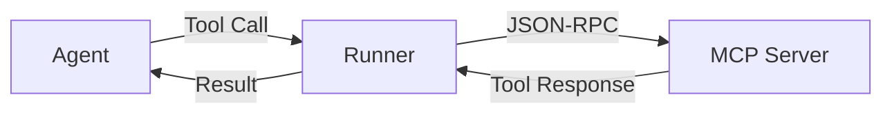

# Custom Tools Guide

This guide covers building custom MCP (Model Context Protocol) servers and tools to extend AgentFlow's capabilities. Learn how to create domain-specific tools that agents can discover and use dynamically.

## 🎯 Overview

Custom tools in AgentFlow are implemented as MCP servers that expose functions, resources, and prompts. Agents can discover these tools automatically and use them to perform specialized tasks.

**Key Benefits:**
- **Dynamic Discovery**: Agents find and use tools without hardcoding
- **Schema-Based**: Tools are self-describing with JSON schemas
- **Language Agnostic**: MCP servers can be built in any language
- **Standardized Protocol**: Consistent interface across all tools

## 🏗️ MCP Server Architecture

### **MCP Protocol Basics**



**Key Components:**
- **Tools**: Functions that agents can call with parameters
- **Resources**: Read-only data sources (files, APIs, databases)
- **Prompts**: Reusable prompt templates with parameters

## 🛠️ Building Your First MCP Server

### **1. Server Setup (Go)**

```go
package main

import (
    "context"
    "encoding/json"
    "log"
    "net"
    
    "github.com/zynkworks/agentflow/pkg/mcp"
)

type CustomToolsServer struct {
    mcp.BaseServer
}

func (s *CustomToolsServer) Initialize(ctx context.Context) error {
    // Register tools
    s.RegisterTool("calculate", &CalculatorTool{})
    s.RegisterTool("send_email", &EmailTool{})
    s.RegisterTool("query_database", &DatabaseTool{})
    
    return nil
}

func main() {
    server := &CustomToolsServer{}
    
    // Listen on TCP port
    listener, err := net.Listen("tcp", ":8080")
    if err != nil {
        log.Fatal(err)
    }
    
    log.Println("MCP server listening on :8080")
    if err := mcp.Serve(listener, server); err != nil {
        log.Fatal(err)
    }
}
```

### **2. Tool Implementation**

```go
type CalculatorTool struct{}

func (t *CalculatorTool) GetSchema() *mcp.ToolSchema {
    return &mcp.ToolSchema{
        Name:        "calculate",
        Description: "Performs mathematical calculations",
        Parameters: mcp.Parameters{
            Type:     "object",
            Required: []string{"expression"},
            Properties: map[string]mcp.Property{
                "expression": {
                    Type:        "string",
                    Description: "Mathematical expression to evaluate (e.g., '2 + 3 * 4')",
                    Examples:    []interface{}{"2 + 3", "sqrt(16)", "(10 - 2) / 4"},
                },
                "precision": {
                    Type:        "integer",
                    Description: "Number of decimal places for the result",
                    Default:     2,
                    Minimum:     0,
                    Maximum:     10,
                },
            },
        },
    }
}

func (t *CalculatorTool) Execute(ctx context.Context, params map[string]interface{}) (*mcp.ToolResult, error) {
    expression, ok := params["expression"].(string)
    if !ok {
        return nil, fmt.Errorf("expression parameter is required")
    }
    
    precision := 2
    if p, ok := params["precision"].(float64); ok {
        precision = int(p)
    }
    
    // Parse and evaluate expression
    result, err := evaluateExpression(expression)
    if err != nil {
        return &mcp.ToolResult{
            Success: false,
            Error:   fmt.Sprintf("Calculation error: %v", err),
        }, nil
    }
    
    // Format result with specified precision
    formatted := formatNumber(result, precision)
    
    return &mcp.ToolResult{
        Success: true,
        Content: []mcp.Content{
            {
                Type: "text",
                Text: fmt.Sprintf("Result: %s", formatted),
            },
        },
        Metadata: map[string]interface{}{
            "expression": expression,
            "result":     result,
            "precision":  precision,
        },
    }, nil
}
```

### **3. Advanced Tool with External API**

```go
type WeatherTool struct {
    apiKey string
    client *http.Client
}

func (t *WeatherTool) GetSchema() *mcp.ToolSchema {
    return &mcp.ToolSchema{
        Name:        "get_weather",
        Description: "Gets current weather information for a location",
        Parameters: mcp.Parameters{
            Type:     "object",
            Required: []string{"location"},
            Properties: map[string]mcp.Property{
                "location": {
                    Type:        "string",
                    Description: "City name or coordinates (e.g., 'New York' or '40.7128,-74.0060')",
                },
                "units": {
                    Type:        "string",
                    Description: "Temperature units",
                    Enum:        []interface{}{"celsius", "fahrenheit", "kelvin"},
                    Default:     "celsius",
                },
                "include_forecast": {
                    Type:        "boolean",
                    Description: "Include 3-day forecast",
                    Default:     false,
                },
            },
        },
    }
}

func (t *WeatherTool) Execute(ctx context.Context, params map[string]interface{}) (*mcp.ToolResult, error) {
    location := params["location"].(string)
    units := getStringParam(params, "units", "celsius")
    includeForecast := getBoolParam(params, "include_forecast", false)
    
    // Call weather API
    weather, err := t.fetchWeather(ctx, location, units)
    if err != nil {
        return &mcp.ToolResult{
            Success: false,
            Error:   fmt.Sprintf("Failed to fetch weather: %v", err),
        }, nil
    }
    
    content := []mcp.Content{
        {
            Type: "text",
            Text: formatWeatherReport(weather),
        },
    }
    
    // Add forecast if requested
    if includeForecast {
        forecast, err := t.fetchForecast(ctx, location, units)
        if err == nil {
            content = append(content, mcp.Content{
                Type: "text",
                Text: formatForecast(forecast),
            })
        }
    }
    
    return &mcp.ToolResult{
        Success: true,
        Content: content,
        Metadata: map[string]interface{}{
            "location":    location,
            "temperature": weather.Temperature,
            "conditions":  weather.Conditions,
            "timestamp":   time.Now().Unix(),
        },
    }, nil
}
```

## 📦 Tool Packaging and Distribution

### **1. Docker Packaging**

```dockerfile
# Dockerfile
FROM golang:1.21-alpine AS builder

WORKDIR /app
COPY go.mod go.sum ./
RUN go mod download

COPY . .
RUN go build -o mcp-server ./cmd/server

FROM alpine:latest
RUN apk --no-cache add ca-certificates
WORKDIR /root/

COPY --from=builder /app/mcp-server .
COPY --from=builder /app/config.json .

EXPOSE 8080
CMD ["./mcp-server"]
```

### **2. Configuration Management**

```json
{
  "name": "custom-tools-server",
  "version": "1.0.0",
  "description": "Custom tools for domain-specific tasks",
  "author": "Your Team",
  "tools": {
    "calculate": {
      "enabled": true,
      "rateLimit": 100
    },
    "send_email": {
      "enabled": true,
      "config": {
        "smtp_server": "${SMTP_SERVER}",
        "smtp_port": 587
      }
    },
    "query_database": {
      "enabled": true,
      "config": {
        "connection_string": "${DATABASE_URL}",
        "timeout": "30s"
      }
    }
  },
  "server": {
    "host": "0.0.0.0",
    "port": 8080,
    "maxConnections": 100
  }
}
```

### **3. AgentFlow Integration**

```toml
# agentflow.toml
[mcp]
enabled = true

[[mcp.servers]]
name = "custom-tools"
command = "docker"
args = ["run", "-p", "8080:8080", "your-registry/custom-tools:latest"]
env = { SMTP_SERVER = "smtp.gmail.com", DATABASE_URL = "postgres://..." }

[[mcp.servers]]
name = "local-tools"
command = "./tools/mcp-server"
args = ["--config", "tools/config.json"]
working_dir = "."
```

## 🔧 Advanced Tool Patterns

### **1. Stateful Tools**

Tools that maintain state across calls:

```go
type StatefulTool struct {
    sessions map[string]*ToolSession
    mutex    sync.RWMutex
}

type ToolSession struct {
    ID        string
    Data      map[string]interface{}
    CreatedAt time.Time
    LastUsed  time.Time
}

func (t *StatefulTool) Execute(ctx context.Context, params map[string]interface{}) (*mcp.ToolResult, error) {
    sessionID := getStringParam(params, "session_id", "")
    if sessionID == "" {
        sessionID = generateSessionID()
    }
    
    session := t.getOrCreateSession(sessionID)
    
    // Process with session context
    result, err := t.processWithSession(ctx, session, params)
    
    // Update session
    session.LastUsed = time.Now()
    
    return result, err
}

func (t *StatefulTool) getOrCreateSession(sessionID string) *ToolSession {
    t.mutex.Lock()
    defer t.mutex.Unlock()
    
    if session, exists := t.sessions[sessionID]; exists {
        return session
    }
    
    session := &ToolSession{
        ID:        sessionID,
        Data:      make(map[string]interface{}),
        CreatedAt: time.Now(),
        LastUsed:  time.Now(),
    }
    
    t.sessions[sessionID] = session
    return session
}
```

### **2. Streaming Tools**

Tools that return streaming results:

```go
type StreamingTool struct{}

func (t *StreamingTool) GetSchema() *mcp.ToolSchema {
    return &mcp.ToolSchema{
        Name:        "stream_data",
        Description: "Streams large dataset results",
        Parameters: mcp.Parameters{
            Type:     "object",
            Required: []string{"query"},
            Properties: map[string]mcp.Property{
                "query": {
                    Type:        "string",
                    Description: "Data query to stream",
                },
                "batch_size": {
                    Type:        "integer",
                    Description: "Number of records per batch",
                    Default:     100,
                    Minimum:     1,
                    Maximum:     1000,
                },
            },
        },
        Streaming: true, // Indicates this tool supports streaming
    }
}

func (t *StreamingTool) ExecuteStreaming(ctx context.Context, params map[string]interface{}) (<-chan *mcp.ToolResult, error) {
    query := params["query"].(string)
    batchSize := getIntParam(params, "batch_size", 100)
    
    resultChan := make(chan *mcp.ToolResult, 10)
    
    go func() {
        defer close(resultChan)
        
        // Stream results in batches
        offset := 0
        for {
            batch, err := t.fetchBatch(ctx, query, offset, batchSize)
            if err != nil {
                resultChan <- &mcp.ToolResult{
                    Success: false,
                    Error:   fmt.Sprintf("Streaming error: %v", err),
                }
                return
            }
            
            if len(batch) == 0 {
                // Send completion marker
                resultChan <- &mcp.ToolResult{
                    Success: true,
                    Content: []mcp.Content{{Type: "text", Text: "Stream complete"}},
                    Metadata: map[string]interface{}{"stream_end": true},
                }
                return
            }
            
            // Send batch
            resultChan <- &mcp.ToolResult{
                Success: true,
                Content: []mcp.Content{{
                    Type: "application/json",
                    Data: batch,
                }},
                Metadata: map[string]interface{}{
                    "batch_offset": offset,
                    "batch_size":   len(batch),
                },
            }
            
            offset += batchSize
            
            // Check for cancellation
            select {
            case <-ctx.Done():
                return
            default:
            }
        }
    }()
    
    return resultChan, nil
}
```

### **3. Composite Tools**

Tools that combine multiple operations:

```go
type CompositeAnalysisTool struct {
    dataSource DataSource
    analyzer   Analyzer
    formatter  Formatter
}

func (t *CompositeAnalysisTool) Execute(ctx context.Context, params map[string]interface{}) (*mcp.ToolResult, error) {
    pipeline := &AnalysisPipeline{
        steps: []PipelineStep{
            &DataExtractionStep{source: t.dataSource},
            &DataCleaningStep{},
            &AnalysisStep{analyzer: t.analyzer},
            &FormattingStep{formatter: t.formatter},
        },
    }
    
    result, err := pipeline.Execute(ctx, params)
    if err != nil {
        return &mcp.ToolResult{
            Success: false,
            Error:   fmt.Sprintf("Pipeline failed: %v", err),
        }, nil
    }
    
    return &mcp.ToolResult{
        Success: true,
        Content: result.Content,
        Metadata: map[string]interface{}{
            "pipeline_steps": len(pipeline.steps),
            "execution_time": result.Duration,
            "data_points":    result.DataPoints,
        },
    }, nil
}
```

## 🧪 Testing Custom Tools

### **1. Unit Testing**

```go
func TestCalculatorTool(t *testing.T) {
    tool := &CalculatorTool{}
    
    tests := []struct {
        name     string
        params   map[string]interface{}
        expected string
        wantErr  bool
    }{
        {
            name:     "Simple addition",
            params:   map[string]interface{}{"expression": "2 + 3"},
            expected: "5.00",
            wantErr:  false,
        },
        {
            name:     "Division with precision",
            params:   map[string]interface{}{"expression": "10 / 3", "precision": 4},
            expected: "3.3333",
            wantErr:  false,
        },
        {
            name:     "Invalid expression",
            params:   map[string]interface{}{"expression": "2 +"},
            wantErr:  true,
        },
    }
    
    for _, tt := range tests {
        t.Run(tt.name, func(t *testing.T) {
            result, err := tool.Execute(context.Background(), tt.params)
            
            if tt.wantErr {
                assert.True(t, !result.Success)
                return
            }
            
            assert.NoError(t, err)
            assert.True(t, result.Success)
            assert.Contains(t, result.Content[0].Text, tt.expected)
        })
    }
}
```

### **2. Integration Testing**

```go
func TestMCPServerIntegration(t *testing.T) {
    // Start test server
    server := &CustomToolsServer{}
    listener, err := net.Listen("tcp", ":0") // Random port
    require.NoError(t, err)
    
    go func() {
        mcp.Serve(listener, server)
    }()
    
    defer listener.Close()
    
    // Create AgentFlow client
    config := &core.Config{
        MCP: core.MCPConfig{
            Enabled: true,
            Servers: []core.MCPServerConfig{
                {
                    Name:    "test-server",
                    Address: listener.Addr().String(),
                },
            },
        },
    }
    
    runner, err := core.NewRunner(config)
    require.NoError(t, err)
    
    // Test tool discovery
    tools, err := runner.GetMCPManager().ListTools(context.Background())
    require.NoError(t, err)
    assert.Contains(t, tools, "calculate")
    
    // Test tool execution
    result, err := runner.GetMCPManager().ExecuteTool(context.Background(), "calculate", map[string]interface{}{
        "expression": "5 * 7",
    })
    require.NoError(t, err)
    assert.True(t, result.Success)
}
```

## 📈 Performance and Optimization

### **1. Connection Pooling**

```go
type PooledMCPServer struct {
    mcp.BaseServer
    dbPool *sql.DB
    httpClient *http.Client
}

func NewPooledMCPServer(config *ServerConfig) *PooledMCPServer {
    return &PooledMCPServer{
        dbPool: createDBPool(config.DatabaseURL, config.MaxDBConnections),
        httpClient: &http.Client{
            Timeout: config.HTTPTimeout,
            Transport: &http.Transport{
                MaxIdleConns:        config.MaxHTTPConnections,
                MaxIdleConnsPerHost: config.MaxHTTPConnectionsPerHost,
                IdleConnTimeout:     config.HTTPIdleTimeout,
            },
        },
    }
}
```

### **2. Caching**

```go
type CachedTool struct {
    baseTool Tool
    cache    *cache.Cache
    ttl      time.Duration
}

func (t *CachedTool) Execute(ctx context.Context, params map[string]interface{}) (*mcp.ToolResult, error) {
    // Generate cache key
    key := t.generateCacheKey(params)
    
    // Check cache first
    if result, found := t.cache.Get(key); found {
        return result.(*mcp.ToolResult), nil
    }
    
    // Execute tool
    result, err := t.baseTool.Execute(ctx, params)
    if err != nil {
        return result, err
    }
    
    // Cache successful results
    if result.Success {
        t.cache.Set(key, result, t.ttl)
    }
    
    return result, nil
}
```

### **3. Rate Limiting**

```go
type RateLimitedTool struct {
    baseTool Tool
    limiter  *rate.Limiter
}

func (t *RateLimitedTool) Execute(ctx context.Context, params map[string]interface{}) (*mcp.ToolResult, error) {
    // Check rate limit
    if !t.limiter.Allow() {
        return &mcp.ToolResult{
            Success: false,
            Error:   "Rate limit exceeded",
        }, nil
    }
    
    return t.baseTool.Execute(ctx, params)
}
```

## 📚 Tool Discovery and Documentation

### **1. Self-Documenting Tools**

```go
func (t *AdvancedTool) GetDocumentation() *mcp.ToolDocumentation {
    return &mcp.ToolDocumentation{
        Name:        t.GetSchema().Name,
        Description: t.GetSchema().Description,
        Examples: []mcp.ToolExample{
            {
                Description: "Basic calculation",
                Parameters: map[string]interface{}{
                    "expression": "2 + 3 * 4",
                },
                ExpectedResult: "14.00",
            },
            {
                Description: "Using variables",
                Parameters: map[string]interface{}{
                    "expression": "sqrt(x^2 + y^2)",
                    "variables": map[string]float64{
                        "x": 3,
                        "y": 4,
                    },
                },
                ExpectedResult: "5.00",
            },
        },
        ErrorCodes: []mcp.ErrorCode{
            {
                Code:        "INVALID_EXPRESSION",
                Description: "The mathematical expression is malformed",
                Example:     "2 + * 3",
            },
            {
                Code:        "DIVISION_BY_ZERO",
                Description: "The expression results in division by zero",
                Example:     "1 / 0",
            },
        },
    }
}
```

### **2. Tool Registry**

```go
type ToolRegistry struct {
    tools map[string]RegisteredTool
    mutex sync.RWMutex
}

type RegisteredTool struct {
    Tool         Tool
    Schema       *mcp.ToolSchema
    Documentation *mcp.ToolDocumentation
    Metadata     ToolMetadata
}

type ToolMetadata struct {
    Author      string
    Version     string
    Category    string
    Tags        []string
    License     string
    CreatedAt   time.Time
    UpdatedAt   time.Time
}

func (r *ToolRegistry) SearchTools(query string, category string, tags []string) []RegisteredTool {
    r.mutex.RLock()
    defer r.mutex.RUnlock()
    
    var results []RegisteredTool
    for _, tool := range r.tools {
        if r.matchesSearch(tool, query, category, tags) {
            results = append(results, tool)
        }
    }
    
    return results
}
```

This custom tools guide provides everything needed to build powerful, discoverable tools that extend AgentFlow's capabilities for any domain or use case.
