## Visualization: CLI-first, config-driven

This guide explains how to generate and maintain workflow diagrams for your agents using the CLI. Runtime builders and in-process diagram generation have been removed from public APIs. Diagrams are produced from your configuration (agentflow.toml) and saved as Markdown with Mermaid blocks.

Key points:
- Source of truth is your configuration (agentflow.toml)
- The CLI reads config and produces diagrams (no runtime builders)
- Diagrams cover route, sequential, collaborative, loop, and mixed modes
- Include the generated Markdown in docs and READMEs

### What gets visualized
- Agents registered by name and referenced by orchestration
- Orchestration mode and flow between agents
- Optional metadata (timeouts, error strategy) when available

### Typical workflow
1) Define orchestration in agentflow.toml (mode, agents, routes)
2) Ensure required plugins are blank-imported in your app (runner, orchestrators, llm providers)
3) Use the CLI to generate visualization artifacts from config
4) Commit the resulting Markdown files to your docs

Note: Because diagrams are CLI-generated, there’s no Go API like NewComposition(), CanVisualize(), or SaveDiagramAsMarkdown() in the public surface. Prefer config + CLI.

### Example diagram (Mermaid)

```mermaid
---
title: Collaborative Research Workflow
---
flowchart TD
    INPUT["🎯 Event Input"]
    RESEARCHER["🤖 Researcher"]
    ANALYZER["🤖 Analyzer"]
    VALIDATOR["🤖 Validator"]
    OUTPUT["✅ Aggregated Result"]

    INPUT --> RESEARCHER
    INPUT --> ANALYZER
    INPUT --> VALIDATOR
    RESEARCHER --> OUTPUT
    ANALYZER --> OUTPUT
    VALIDATOR --> OUTPUT
```

### Troubleshooting
- If the CLI warns that a plugin is missing, add the appropriate blank import (runner/orchestrator/llm/MCP) to your main program.
- If a diagram is missing agents, check that their names match the ones in your orchestration config.
- For large systems, consider generating multiple diagrams per subsystem for readability.

### Migration note
- Older docs referenced builder-based visualization and runtime helpers. Those are no longer part of the public API. Use NewRunnerFromConfig and the CLI to manage orchestration and diagrams.