# Orchestration Configuration Guide

**Complete guide to configuring multi-agent orchestration in AgentFlow**

AgentFlow supports configuration-driven orchestration through `agentflow.toml` files, allowing you to change orchestration patterns without modifying code. This guide covers all orchestration modes, configuration options, and best practices.

## Quick Start

### 1. Generate Project with Orchestration

```bash
# Sequential pipeline
agentcli create data-pipeline \
  --orchestration-mode sequential \
  --sequential-agents "collector,processor,formatter" \
  --orchestration-timeout 45

# Collaborative workflow
agentcli create research-system \
  --orchestration-mode collaborative \
  --agents 3 \
  --orchestration-timeout 60

# Loop-based processing
agentcli create quality-checker \
  --orchestration-mode loop \
  --loop-agent "validator" \
  --max-iterations 5
```

### 2. Configuration-Based Runner

Generated projects automatically use configuration-based orchestration:

```go
// Load configuration and create runner automatically
runner, err := core.NewRunnerFromConfig("agentflow.toml")
if err != nil {
    log.Fatal(err)
}

// Create provider from configuration
cfg, err := core.LoadConfig("agentflow.toml")
if err != nil { /* handle */ }
provider, err := cfg.InitializeProvider()
if err != nil {
    log.Fatal(err)
}

// Create agents
agents := map[string]core.AgentHandler{
    "agent1": core.NewLLMAgent("agent1", provider),
    "agent2": core.NewLLMAgent("agent2", provider),
    "agent3": core.NewLLMAgent("agent3", provider),
}

// Register agents with the runner
for name, handler := range agents {
    if err := runner.RegisterAgent(name, handler); err != nil {
        log.Fatalf("Failed to register agent %s: %v", name, err)
    }
}

// Start the runner - orchestration mode is handled automatically from config
ctx := context.Background()
if err := runner.Start(ctx); err != nil {
    log.Fatal(err)
}
defer runner.Stop()
```

## Orchestration Configuration Reference

### Basic Configuration Structure

```toml
[orchestration]
mode = "sequential"                    # Required: orchestration mode
timeout_seconds = 30                   # Required: timeout for operations
max_iterations = 5                     # Optional: for loop mode

# Mode-specific agent configuration
sequential_agents = ["agent1", "agent2", "agent3"]
collaborative_agents = ["analyzer", "validator"]
loop_agent = "processor"
```

### Configuration Options

| Option | Type | Description | Default | Required |
|--------|------|-------------|---------|----------|
| `mode` | string | Orchestration mode | `"route"` | Yes |
| `timeout_seconds` | integer | Operation timeout | `30` | Yes |
| `max_iterations` | integer | Max loop iterations | `5` | For loop mode |
| `sequential_agents` | array | Sequential agent list | `[]` | For sequential/mixed |
| `collaborative_agents` | array | Collaborative agent list | `[]` | For collaborative/mixed |
| `loop_agent` | string | Loop agent name | `""` | For loop mode |

## Orchestration Modes

### 1. Sequential Mode

Agents process events in a defined order, creating a processing pipeline.

#### Configuration

```toml
[orchestration]
mode = "sequential"
timeout_seconds = 30
sequential_agents = ["collector", "processor", "formatter"]
```

#### CLI Generation

```bash
agentcli create data-pipeline \
  --orchestration-mode sequential \
  --sequential-agents "collector,processor,formatter" \
  --orchestration-timeout 30
```

#### Use Cases
- Data processing pipelines
- Document transformation workflows
- Multi-step analysis processes
- Quality assurance chains

#### Flow Diagram


```mermaid
flowchart TD
    INPUT["📨 Input Event"]
    COLLECTOR["🤖 Collector"]
    PROCESSOR["🤖 Processor"]
    FORMATTER["🤖 Formatter"]
    OUTPUT["📤 Final Result"]
    
    INPUT --> COLLECTOR
    COLLECTOR --> PROCESSOR
    PROCESSOR --> FORMATTER
    FORMATTER --> OUTPUT
```

### 2. Collaborative Mode

All agents process events in parallel, with results aggregated.

#### Configuration

```toml
[orchestration]
mode = "collaborative"
timeout_seconds = 60
# Agents are automatically determined from registered agents
```

#### CLI Generation

```bash
agentcli create research-system \
  --orchestration-mode collaborative \
  --agents 3 \
  --orchestration-timeout 60
```

#### Use Cases
- Research and analysis systems
- Multi-perspective evaluation
- Parallel data processing
- Consensus-building workflows

#### Flow Diagram


```mermaid
flowchart TD
    INPUT["📨 Input Event"]
    AGENT1["🤖 Agent1"]
    AGENT2["🤖 Agent2"]
    AGENT3["🤖 Agent3"]
    AGGREGATOR["📊 Result Aggregator"]
    OUTPUT["📤 Final Result"]
    
    INPUT --> AGENT1
    INPUT --> AGENT2
    INPUT --> AGENT3
    AGENT1 --> AGGREGATOR
    AGENT2 --> AGGREGATOR
    AGENT3 --> AGGREGATOR
    AGGREGATOR --> OUTPUT
```

### 3. Loop Mode

Single agent processes events iteratively until conditions are met.

#### Configuration

```toml
[orchestration]
mode = "loop"
timeout_seconds = 120
loop_agent = "quality-checker"
max_iterations = 5
```

#### CLI Generation

```bash
agentcli create quality-loop \
  --orchestration-mode loop \
  --loop-agent "quality-checker" \
  --max-iterations 5 \
  --orchestration-timeout 120
```

#### Use Cases
- Quality assurance loops
- Iterative refinement processes
- Retry mechanisms with improvement
- Convergence-based processing

#### Flow Diagram


```mermaid
flowchart TD
    INPUT["📨 Input Event"]
    AGENT["🤖 Quality Checker"]
    CONDITION{"✅ Quality Met?"}
    ITERATE{"🔄 Max Iterations?"}
    OUTPUT["📤 Final Result"]
    
    INPUT --> AGENT
    AGENT --> CONDITION
    CONDITION -->|No| ITERATE
    ITERATE -->|No| AGENT
    ITERATE -->|Yes| OUTPUT
    CONDITION -->|Yes| OUTPUT
```

### 4. Mixed Mode

Combines collaborative and sequential processing patterns.

#### Configuration

```toml
[orchestration]
mode = "mixed"
timeout_seconds = 90
collaborative_agents = ["analyzer", "validator"]
sequential_agents = ["processor", "reporter"]
```

#### CLI Generation

```bash
agentcli create complex-workflow \
  --orchestration-mode mixed \
  --collaborative-agents "analyzer,validator" \
  --sequential-agents "processor,reporter" \
  --orchestration-timeout 90
```

#### Use Cases
- Complex business processes
- Multi-stage workflows with parallel components
- Hybrid processing patterns
- Enterprise workflow automation

#### Flow Diagram


```mermaid
flowchart TD
    INPUT["📨 Input Event"]
    
    subgraph PARALLEL["Collaborative Phase"]
        ANALYZER["🤖 Analyzer"]
        VALIDATOR["🤖 Validator"]
    end
    
    subgraph SEQUENTIAL["Sequential Phase"]
        PROCESSOR["🤖 Processor"]
        REPORTER["🤖 Reporter"]
    end
    
    OUTPUT["📤 Final Result"]
    
    INPUT --> PARALLEL
    ANALYZER --> PROCESSOR
    VALIDATOR --> PROCESSOR
    PROCESSOR --> REPORTER
    REPORTER --> OUTPUT
```

### 5. Route Mode

Default event routing based on event metadata (legacy mode).

#### Configuration

```toml
[orchestration]
mode = "route"
timeout_seconds = 30
```

#### CLI Generation

```bash
agentcli create simple-router \
  --orchestration-mode route \
  --orchestration-timeout 30
```

#### Use Cases
- Simple event routing
- Legacy system compatibility
- Dynamic agent selection
- Conditional processing

## Advanced Configuration

### Environment-Specific Configurations

#### Development Configuration

```toml
# agentflow.dev.toml
[orchestration]
mode = "sequential"
timeout_seconds = 60  # Longer timeout for debugging
sequential_agents = ["agent1", "agent2"]
```

#### Production Configuration

```toml
# agentflow.prod.toml
[orchestration]
mode = "mixed"
timeout_seconds = 30  # Shorter timeout for performance
collaborative_agents = ["analyzer", "validator"]
sequential_agents = ["processor", "reporter"]
```

#### Loading Environment-Specific Configs

```go
configFile := "agentflow.toml"
if env := os.Getenv("AGENTFLOW_ENV"); env != "" {
    configFile = fmt.Sprintf("agentflow.%s.toml", env)
}

runner, err := core.NewRunnerFromConfig(configFile)
if err != nil {
    log.Fatal(err)
}

// Create provider from configuration
cfg, err := core.LoadConfig(configFile)
if err != nil { /* handle */ }
provider, err := cfg.InitializeProvider()
if err != nil {
    log.Fatal(err)
}

// Create agents
agents := map[string]core.AgentHandler{
    "agent1": core.NewLLMAgent("agent1", provider),
    "agent2": core.NewLLMAgent("agent2", provider),
}

// Register agents with the runner
for name, handler := range agents {
    if err := runner.RegisterAgent(name, handler); err != nil {
        log.Fatalf("Failed to register agent %s: %v", name, err)
    }
}
```

### Dynamic Configuration Updates

```go
// Load initial configuration
runner, err := core.NewRunnerFromConfig("agentflow.toml")
if err != nil {
    log.Fatal(err)
}

// Create provider from configuration
cfg, err := core.LoadConfig("agentflow.toml")
if err != nil { /* handle */ }
provider, err := cfg.InitializeProvider()
if err != nil {
    log.Fatal(err)
}

// Create agents
agents := map[string]core.AgentHandler{
    "agent1": core.NewLLMAgent("agent1", provider),
    "agent2": core.NewLLMAgent("agent2", provider),
}

// Register agents with the runner
for name, handler := range agents {
    if err := runner.RegisterAgent(name, handler); err != nil {
        log.Fatalf("Failed to register agent %s: %v", name, err)
    }
}

// Watch for configuration changes
watcher, err := fsnotify.NewWatcher()
if err != nil {
    log.Fatal(err)
}

go func() {
    for {
        select {
        case event := <-watcher.Events:
            if event.Op&fsnotify.Write == fsnotify.Write {
                // Reload configuration and create new runner
                newRunner, err := core.NewRunnerFromConfig("agentflow.toml")
                if err != nil {
                    log.Printf("Failed to reload config: %v", err)
                    continue
                }
                
                // Stop current runner
                runner.Stop()
                
                // Re-register agents with new runner
                for name, handler := range agents {
                    if err := newRunner.RegisterAgent(name, handler); err != nil {
                        log.Printf("Failed to register agent %s: %v", name, err)
                    }
                }
                
                // Start new runner
                runner = newRunner
                runner.Start(context.Background())
            }
        }
    }
}()

watcher.Add("agentflow.toml")
```

## Configuration Validation

### Built-in Validation

AgenticGoKit automatically validates orchestration configurations:

```go
config, err := core.LoadConfigFromWorkingDir()
if err != nil {
    // Configuration validation errors are returned here
    log.Printf("Configuration error: %v", err)
    return
}

// Validate orchestration configuration
if err := config.ValidateOrchestrationConfig(); err != nil {
    log.Printf("Orchestration validation error: %v", err)
    return
}
```

### Common Validation Errors

| Error | Cause | Solution |
|-------|-------|----------|
| `missing orchestration mode` | No `mode` specified | Add `mode = "sequential"` |
| `invalid orchestration mode` | Unknown mode value | Use valid mode: sequential, collaborative, loop, mixed, route |
| `sequential mode missing agents` | No `sequential_agents` for sequential mode | Add `sequential_agents = ["agent1", "agent2"]` |
| `loop mode missing agent` | No `loop_agent` for loop mode | Add `loop_agent = "agent1"` |
| `mixed mode missing agents` | No agents specified for mixed mode | Add both collaborative and sequential agents |
| `invalid timeout` | Timeout ≤ 0 | Set `timeout_seconds` to positive integer |
| `invalid max iterations` | Max iterations ≤ 0 for loop mode | Set `max_iterations` to positive integer |

### Manual Validation

```bash
# Validate configuration file
agentcli config validate agentflow.toml

# Validate with detailed output
agentcli config validate --verbose agentflow.toml
```

## Best Practices

### 1. Configuration Organization

```toml
# Group related configurations together
[orchestration]
# Core orchestration settings
mode = "mixed"
timeout_seconds = 60
max_iterations = 5

# Agent assignments
collaborative_agents = ["analyzer", "validator"]
sequential_agents = ["processor", "reporter"]

# Comments for complex configurations
# Analyzer and validator run in parallel for speed
# Processor and reporter run sequentially for data consistency
```

### 2. Timeout Configuration

```toml
[orchestration]
# Set timeouts based on expected processing time
timeout_seconds = 30   # Fast operations
# timeout_seconds = 120  # Complex analysis
# timeout_seconds = 300  # Heavy processing
```

### 3. Agent Naming Conventions

```toml
[orchestration]
# Use descriptive, consistent names
sequential_agents = [
    "data-collector",
    "data-processor", 
    "data-formatter",
    "data-validator"
]

# Avoid generic names like "agent1", "agent2"
```

### 4. Mode Selection Guidelines

| Use Case | Recommended Mode | Reason |
|----------|------------------|---------|
| Data pipelines | Sequential | Maintains data flow order |
| Research/analysis | Collaborative | Leverages parallel processing |
| Quality assurance | Loop | Iterative improvement |
| Complex workflows | Mixed | Combines benefits of both |
| Simple routing | Route | Minimal overhead |

### 5. Testing Configurations

```bash
# Test different orchestration modes
agentcli create test-sequential --orchestration-mode sequential
agentcli create test-collaborative --orchestration-mode collaborative
agentcli create test-loop --orchestration-mode loop

# To test different configurations, you can create multiple config files
# and run your application with each one to compare performance
```

## Migration Guide

### From Hardcoded to Configuration-Based

#### Before (Hardcoded)

```go
// Old approach - hardcoded orchestration (deprecated)
// Prefer configuration-driven orchestration using core.NewRunnerFromConfig.
```

#### After (Configuration-Based)

```go
// New approach - configuration-driven
runner, err := core.NewRunnerFromConfig("agentflow.toml")
if err != nil {
    log.Fatal(err)
}

// Create provider from configuration
cfg, err := core.LoadConfig("agentflow.toml")
if err != nil { /* handle */ }
provider, err := cfg.InitializeProvider()
if err != nil {
    log.Fatal(err)
}

// Create agents
agents := map[string]core.AgentHandler{
    "agent1": core.NewLLMAgent("agent1", provider),
    "agent2": core.NewLLMAgent("agent2", provider),
}

// Register agents with the runner
for name, handler := range agents {
    if err := runner.RegisterAgent(name, handler); err != nil {
        log.Fatalf("Failed to register agent %s: %v", name, err)
    }
}

// Start the runner
ctx := context.Background()
if err := runner.Start(ctx); err != nil {
    log.Fatal(err)
}
defer runner.Stop()
```

#### Configuration File

```toml
[orchestration]
mode = "sequential"
timeout_seconds = 30
sequential_agents = ["agent1", "agent2"]
```

### Migration Steps

1. **Create Configuration File**
   ```bash
   agentcli config show > agentflow.toml
   ```

2. **Add Orchestration Section**
   ```toml
   [orchestration]
   mode = "sequential"
   timeout_seconds = 30
   sequential_agents = ["agent1", "agent2"]
   ```

3. **Update Code**
   ```go
   // Replace hardcoded orchestration
    runner, err := core.NewRunnerFromConfig("agentflow.toml")
   ```

4. **Test Configuration**
   ```bash
   agentcli config validate agentflow.toml
   ```

## Troubleshooting

### Common Issues

#### Configuration Not Loading

```bash
# Check file exists and is readable
ls -la agentflow.toml

# Validate configuration syntax
agentcli config validate agentflow.toml

# Check for TOML syntax errors
toml-lint agentflow.toml
```

#### Agents Not Found

```go
// Ensure agents are registered before starting
for name, handler := range agents {
    if err := runner.RegisterAgent(name, handler); err != nil {
        log.Printf("Failed to register agent %s: %v", name, err)
    }
}
```

#### Timeout Issues

```toml
[orchestration]
# Increase timeout for complex operations
timeout_seconds = 120  # Instead of 30

# For loop mode, also check max_iterations
max_iterations = 10    # Instead of 5
```

### Debug Configuration

```go
// Enable debug logging
logger := zerolog.New(os.Stdout).Level(zerolog.DebugLevel)
ctx := logger.WithContext(context.Background())

// Load configuration with debug context
runner, err := core.NewRunnerFromConfig("agentflow.toml")
```

### Performance Monitoring

```bash
# Monitor orchestration performance
agentcli status --detailed

# Check agent execution times
agentcli trace list --since 1h

# To test different configurations, you can create multiple config files
# and run your application with each one
```

## Examples

### Complete Configuration Examples

#### E-commerce Order Processing

```toml
[orchestration]
mode = "sequential"
timeout_seconds = 45
sequential_agents = [
    "order-validator",
    "inventory-checker", 
    "payment-processor",
    "fulfillment-handler",
    "notification-sender"
]
```

#### Content Moderation System

```toml
[orchestration]
mode = "collaborative"
timeout_seconds = 30
# All registered agents participate in parallel moderation
```

#### Document Analysis Pipeline

```toml
[orchestration]
mode = "mixed"
timeout_seconds = 120
collaborative_agents = ["text-analyzer", "image-analyzer"]
sequential_agents = ["content-merger", "report-generator"]
```

#### Quality Assurance Loop

```toml
[orchestration]
mode = "loop"
timeout_seconds = 180
loop_agent = "quality-checker"
max_iterations = 3
```

This guide provides comprehensive coverage of AgentFlow's orchestration configuration system, enabling you to build flexible, maintainable multi-agent workflows.