# Multi-Agent Orchestration Guide

This guide covers AgentFlow's comprehensive multi-agent orchestration capabilities, including collaborative, sequential, loop, and mixed orchestration patterns with automatic workflow visualization.

## Overview

AgentFlow provides powerful multi-agent orchestration patterns that enable you to build complex workflows with multiple agents working together. The system supports various orchestration modes and includes built-in workflow visualization using Mermaid diagrams.

## CLI Quick Start

The fastest way to create multi-agent workflows is using the AgentFlow CLI:

```bash
# Collaborative workflow - all agents process events in parallel
agentcli create research-system \
  --orchestration-mode collaborative \
  --agents 3 \
  --orchestration-timeout 60 \
  --visualize \
  --mcp-enabled

# Sequential pipeline - agents process one after another
agentcli create data-pipeline \
  --orchestration-mode sequential \
  --sequential-agents "collector,processor,formatter" \
  --orchestration-timeout 45 \
  --visualize-output "docs/diagrams"

# Loop-based workflow - single agent repeats with conditions
agentcli create quality-loop \
  --orchestration-mode loop \
  --loop-agent "quality-checker" \
  --max-iterations 5 \
  --orchestration-timeout 120 \
  --visualize

# Mixed orchestration - combine collaborative and sequential
agentcli create complex-workflow \
  --orchestration-mode mixed \
  --collaborative-agents "analyzer,validator" \
  --sequential-agents "processor,reporter" \
  --orchestration-timeout 90 \
  --visualize
```

All generated projects use **configuration-based orchestration** via `agentflow.toml`, making it easy to modify orchestration patterns without changing code.

## Configuration-Based Orchestration

AgentFlow now supports configuration-driven orchestration through `agentflow.toml` files. This approach allows you to change orchestration patterns without modifying code.

### agentflow.toml Configuration

```toml
[orchestration]
mode = "sequential"                    # sequential, collaborative, loop, mixed, route
timeout_seconds = 30                   # Timeout for orchestration operations
max_iterations = 5                     # Maximum iterations for loop mode

# Sequential mode: agents process in order
sequential_agents = ["agent1", "agent2", "agent3"]

# Collaborative mode: agents process in parallel  
collaborative_agents = ["analyzer", "validator", "processor"]

# Loop mode: single agent repeats
loop_agent = "processor"

# Mixed mode: combine collaborative and sequential
# collaborative_agents = ["analyzer", "validator"]
# sequential_agents = ["processor", "reporter"]
```

### Using Configuration-Based Runners

Generated projects automatically use `NewRunnerFromConfig()`:

```go
// Automatically reads orchestration config from agentflow.toml
runner, err := core.NewRunnerFromConfig("agentflow.toml")
if err != nil {
    log.Fatal(err)
}

// Register your agents
for name, handler := range agents {
    runner.RegisterAgent(name, handler)
}

// The runner automatically uses the configured orchestration mode
runner.Start(ctx)
```

### Benefits of Configuration-Based Approach

- **No Code Changes**: Switch orchestration modes by editing TOML files
- **Environment-Specific**: Different configs for dev/staging/production
- **Runtime Flexibility**: Change orchestration without rebuilding
- **Validation**: Built-in validation of orchestration parameters
- **Consistency**: Same configuration format across all projects

## Orchestration Modes

### 1. Collaborative Orchestration
All agents process events in parallel, with results aggregated:

```bash
agentcli create parallel-system \
  --orchestration-mode collaborative \
  --collaborative-agents "agent1,agent2,agent3" \
  --visualize
```

### 2. Sequential Orchestration  
Agents process events one after another in a pipeline:

```bash
agentcli create pipeline-system \
  --orchestration-mode sequential \
  --sequential-agents "input,transform,output" \
  --visualize
```

### 3. Loop Orchestration
Single agent repeats execution until conditions are met:

```bash
agentcli create loop-system \
  --orchestration-mode loop \
  --loop-agent "processor" \
  --max-iterations 10 \
  --visualize
```

### 4. Mixed Orchestration
Combine multiple orchestration patterns:

```bash
agentcli create mixed-system \
  --orchestration-mode mixed \
  --collaborative-agents "analyzer,validator" \
  --sequential-agents "processor,reporter" \
  --visualize
```

## Workflow Visualization

AgentFlow automatically generates Mermaid diagrams for all orchestration patterns:

```bash
# Generate diagrams in default location (./workflow.mmd)
agentcli create my-workflow --visualize

# Specify custom output directory
agentcli create my-workflow --visualize-output "docs/diagrams"
```

**Generated Mermaid Diagram Example:**

```mermaid
---
title: Collaborative Multi-Agent Workflow
---
flowchart TD
    INPUT["🎯 Event Input"]
    AGENT1["🤖 Researcher"]
    AGENT2["🤖 Analyzer"] 
    AGENT3["🤖 Validator"]
    OUTPUT["✅ Aggregated Result"]
    
    INPUT --> AGENT1
    INPUT --> AGENT2
    INPUT --> AGENT3
    AGENT1 --> OUTPUT
    AGENT2 --> OUTPUT
    AGENT3 --> OUTPUT
```


## API Reference

### CLI Configuration Options

All CLI flags for multi-agent orchestration:

```bash
# Orchestration mode flags
--orchestration-mode string          # collaborative, sequential, loop, mixed
--collaborative-agents string        # Comma-separated list of agents
--sequential-agents string           # Comma-separated list of agents
--loop-agent string                  # Single agent name for loop mode
--max-iterations int                 # Maximum loop iterations (default: 10)

# Configuration flags
--orchestration-timeout int          # Timeout in seconds (default: 60)
--failure-threshold float           # Failure threshold 0.0-1.0 (default: 0.5)
--max-concurrency int              # Maximum concurrent agents (default: 5)

# Visualization flags
--visualize                         # Generate Mermaid diagrams
--visualize-output string           # Custom output directory for diagrams
```

### Orchestration Modes

```go
type OrchestrationMode string

const (
    OrchestrationRoute       OrchestrationMode = "route"       // Route to single agent
    OrchestrationCollaborate OrchestrationMode = "collaborate" // Send to all agents
    OrchestrationSequential  OrchestrationMode = "sequential"  // Process in sequence
    OrchestrationLoop        OrchestrationMode = "loop"        // Loop single agent
    OrchestrationMixed       OrchestrationMode = "mixed"       // Combine patterns
)
```

```go
type Orchestrator interface {
    Dispatch(ctx context.Context, event Event) (AgentResult, error)
    RegisterAgent(name string, handler AgentHandler) error
    GetCallbackRegistry() *CallbackRegistry
    Stop()
}
```

### Orchestrator Interface

```go
type Orchestrator interface {
    Dispatch(ctx context.Context, event Event) (AgentResult, error)
    RegisterAgent(name string, handler AgentHandler) error
    GetCallbackRegistry() *CallbackRegistry
    Stop()
}
```

### Multi-Agent Composition (Available)

The multi-agent composition API provides:
- Parallel execution of multiple agents
- Sequential agent pipelines 
- Loop-based agent execution
- Configurable failure handling strategies
- Automatic workflow visualization

## Usage Examples

### Collaborative Orchestration

```go
// Create collaborative orchestrator
registry := core.NewCallbackRegistry()
orchestrator := core.NewCollaborativeOrchestrator(registry)

// Register agents
for name, handler := range agents {
    orchestrator.RegisterAgent(name, handler)
}

// Create and dispatch event
eventData := make(core.EventData)
eventData["task"] = "collaborative_analysis"

event := core.NewEvent("any", eventData, nil)
result, err := orchestrator.Dispatch(ctx, event)
```

### Sequential Pipeline

```go
// Create sequential orchestration
agents := map[string]core.AgentHandler{
    "collector": NewCollectorAgent(),
    "processor": NewProcessorAgent(),
    "formatter": NewFormatterAgent(),
}

runner := core.NewOrchestrationBuilder(core.OrchestrationSequential).
    WithAgents(agents).
    WithTimeout(5 * time.Minute).
    Build()

event := core.NewEvent("pipeline", eventData, nil)
result, err := runner.Run(ctx, event)
```

### Loop-Based Execution

```go
// Create loop orchestration
loopAgent := map[string]core.AgentHandler{
    "quality-checker": NewQualityCheckerAgent(),
}

runner := core.NewOrchestrationBuilder(core.OrchestrationLoop).
    WithAgents(loopAgent).
    WithMaxIterations(10).
    WithTimeout(10 * time.Minute).
    Build()

event := core.NewEvent("loop", eventData, nil)
result, err := runner.Run(ctx, event)
```

### Mixed Orchestration

```go
// Create mixed orchestration (collaborative + sequential)
collaborativeAgents := map[string]core.AgentHandler{
    "analyzer":  NewAnalyzerAgent(),
    "validator": NewValidatorAgent(),
}

sequentialAgents := map[string]core.AgentHandler{
    "processor": NewProcessorAgent(),
    "reporter":  NewReporterAgent(),
}

runner := core.NewOrchestrationBuilder(core.OrchestrationMixed).
    WithCollaborativeAgents(collaborativeAgents).
    WithSequentialAgents(sequentialAgents).
    WithTimeout(8 * time.Minute).
    WithFailureThreshold(0.8).
    Build()

event := core.NewEvent("mixed", eventData, nil)
result, err := runner.Run(ctx, event)
```

### Fault-Tolerant Runner

```go
// Create fault-tolerant runner with retry policies
runner := core.CreateFaultTolerantRunner(agents)

// The runner provides built-in retry logic and failure tolerance
// when processing events through the orchestrator
```

### Orchestration Builder Pattern

```go
// Build custom orchestration with specific configuration
runner := core.NewOrchestrationBuilder(core.OrchestrationCollaborate).
    WithAgents(agents).
    WithTimeout(30 * time.Second).
    WithFailureThreshold(0.8).
    WithRetryPolicy(retryPolicy).
    Build()
```

## Configuration Options

### OrchestrationConfig

```go
type OrchestrationConfig struct {
    Timeout          time.Duration  // Overall orchestration timeout
    MaxConcurrency   int           // Maximum concurrent agents
    FailureThreshold float64       // Failure threshold (0.0-1.0)
    RetryPolicy      *RetryPolicy  // Retry configuration
}
```

### RetryPolicy

```go
type RetryPolicy struct {
    MaxRetries      int           // Maximum retry attempts
    InitialDelay    time.Duration // Initial delay before first retry
    MaxDelay        time.Duration // Maximum delay between retries  
    BackoffFactor   float64       // Exponential backoff multiplier
    Jitter          bool          // Add random jitter to delays
    RetryableErrors []string      // List of retryable error codes
}
```

## Convenience Functions

### CreateCollaborativeRunner
Creates a runner where all agents process events in parallel.

```go
func CreateCollaborativeRunner(agents map[string]AgentHandler, timeout time.Duration) Runner
```

### CreateFaultTolerantRunner
Creates a collaborative runner with aggressive retry policies for environments with transient failures.

```go
func CreateFaultTolerantRunner(agents map[string]AgentHandler) Runner
```

### CreateLoadBalancedRunner
Creates a runner that distributes load across multiple agent instances.

```go
func CreateLoadBalancedRunner(agents map[string]AgentHandler, maxConcurrency int) Runner
```

## Agent Handler Interface

Agents must implement the `AgentHandler` interface:

```go
type AgentHandler interface {
    Run(ctx context.Context, event Event, state State) (AgentResult, error)
}
```

## Event and State Management

### Creating Events

```go
// Create event with data and metadata
eventData := make(core.EventData)
eventData["task"] = "process_data"

metadata := map[string]string{
    "priority": "high",
    "source":   "user_request",
}

event := core.NewEvent("target_agent", eventData, metadata)
```

### Working with State

```go
// Create and populate state
state := core.NewState()
state.Set("key", "value")
state.SetMeta("metadata_key", "metadata_value")

// Access state data
if value, ok := state.Get("key"); ok {
    // Use value
}
```

## Error Handling

The orchestration system provides comprehensive error handling:

- **Individual Agent Failures**: Captured in `AgentResult.Error`
- **Orchestration Failures**: Returned as error from `Dispatch`
- **Timeout Handling**: Configurable timeouts with context cancellation
- **Retry Logic**: Automatic retries with exponential backoff
- **Failure Thresholds**: Configurable tolerance for partial failures

## Best Practices

1. **Use Collaborative Mode** for independent parallel processing
2. **Set Appropriate Timeouts** to prevent hanging operations
3. **Configure Retry Policies** for resilient operation
4. **Handle Partial Failures** by checking individual agent results
5. **Use State Management** to pass data between agents effectively

## Migration from Internal APIs

If you were previously using internal orchestrator packages:

1. Replace `internal/orchestrator` imports with `core`
2. Use `core.NewCollaborativeOrchestrator()` instead of internal constructors
3. Update agent handlers to use public `core.AgentHandler` interface
4. Use public `core.Event` and `core.State` types

## Future Enhancements

The following features are planned for future releases:

- **Sequential Agent Pipelines**: Chain agents in sequence with state passing
- **Loop-Based Execution**: Repeat agent execution until conditions are met
- **Advanced Routing**: Content-based routing and load balancing
- **Agent Composition**: Build complex agents from simpler components
- **Visual Workflow Designer**: GUI for designing multi-agent workflows

## Performance Considerations

- Collaborative orchestration runs agents concurrently for better performance
- Configure `MaxConcurrency` to limit resource usage
- Use timeouts to prevent resource leaks
- Monitor agent execution times and optimize slow agents
- Consider using `FailureThreshold` to fail fast when many agents are failing

## Troubleshooting

### Common Issues

1. **Agents Not Registered**: Ensure all agents are registered before dispatching events
2. **Timeout Errors**: Increase timeout values or optimize agent performance  
3. **State Conflicts**: Use unique keys when multiple agents modify state
4. **Memory Leaks**: Always call `Stop()` on orchestrators when done

### Debugging

Enable debug logging to see orchestration flow:
```go
core.Logger().Debug().Msg("Orchestration debug message")
```

### Monitoring

Monitor orchestration metrics:
- Agent execution times
- Failure rates
- Concurrent agent counts
- Event processing throughput
