# Orchestration API

**Multi-agent coordination and workflow patterns**

This document covers AgenticGoKit's Orchestration API, which enables sophisticated coordination between multiple agents. The orchestration system provides various patterns for agent collaboration, from simple routing to complex hybrid workflows.

## 📋 Core Concepts

### Orchestration Modes

AgenticGoKit supports multiple orchestration patterns:

```go
type OrchestrationMode string

const (
    // OrchestrationRoute sends each event to a single agent based on routing metadata (default)
    OrchestrationRoute OrchestrationMode = "route"
    
    // OrchestrationCollaborate sends each event to ALL registered agents in parallel
    OrchestrationCollaborate OrchestrationMode = "collaborate"
    
    // OrchestrationSequential processes agents one after another
    OrchestrationSequential OrchestrationMode = "sequential"
    
    // OrchestrationParallel processes agents in parallel (similar to collaborate)
    OrchestrationParallel OrchestrationMode = "parallel"
    
    // OrchestrationLoop repeats processing with a single agent
    OrchestrationLoop OrchestrationMode = "loop"
    
    // OrchestrationMixed combines collaborative and sequential patterns
    OrchestrationMixed OrchestrationMode = "mixed"
)
```

## 🚀 Basic Usage

### Route Orchestration (Default)

```go
// Create agents
agents := map[string]core.AgentHandler{
    "greeter": core.AgentHandlerFunc(func(ctx context.Context, event core.Event, state core.State) (core.AgentResult, error) {
        name := event.Data["name"].(string)
        return core.AgentResult{
            Data: map[string]interface{}{
                "greeting": fmt.Sprintf("Hello, %s!", name),
            },
        }, nil
    }),
}

// Prefer config-driven runner (route/collab/seq/loop/mixed)
runner, _ := core.NewRunnerFromConfig("agentflow.toml")
```

### Collaborative Orchestration

```go
// Create agents for parallel processing
agents := map[string]core.AgentHandler{
    "researcher": core.AgentHandlerFunc(func(ctx context.Context, event core.Event, state core.State) (core.AgentResult, error) {
        query := event.Data["query"].(string)
        // Research logic here
        return core.AgentResult{
            Data: map[string]interface{}{
                "research_data": "research results for " + query,
            },
        }, nil
    }),
    "analyzer": core.AgentHandlerFunc(func(ctx context.Context, event core.Event, state core.State) (core.AgentResult, error) {
        query := event.Data["query"].(string)
        // Analysis logic here
        return core.AgentResult{
            Data: map[string]interface{}{
                "analysis": "analysis of " + query,
            },
        }, nil
    }),
    "validator": core.AgentHandlerFunc(func(ctx context.Context, event core.Event, state core.State) (core.AgentResult, error) {
        query := event.Data["query"].(string)
        // Validation logic here
        return core.AgentResult{
            Data: map[string]interface{}{
                "validation": "validation of " + query,
            },
        }, nil
    }),
}

// Prefer config-driven runner: set [orchestration].mode = "collaborative" in agentflow.toml
runner, _ := core.NewRunnerFromConfig("agentflow.toml")

// Process event - all agents will run simultaneously
event := core.NewEvent("research", map[string]interface{}{
    "query": "latest AI developments",
})

ctx := context.Background()
_ = runner.Start(ctx)
defer runner.Stop()
_ = runner.Emit(event)
```

### Sequential Orchestration

```go
// Create agents for pipeline processing
agents := map[string]core.AgentHandler{
    "collector": core.AgentHandlerFunc(func(ctx context.Context, event core.Event, state core.State) (core.AgentResult, error) {
        query := event.Data["query"].(string)
        // Data collection logic
        collectedData := "collected data for " + query
        
        // Pass data to next agent via state
        state.Set("collected_data", collectedData)
        
        return core.AgentResult{
            Data: map[string]interface{}{
                "status": "data collected",
            },
        }, nil
    }),
    "processor": core.AgentHandlerFunc(func(ctx context.Context, event core.Event, state core.State) (core.AgentResult, error) {
        // Get data from previous agent
        collectedData, _ := state.Get("collected_data")
        
        // Process the data
        processedData := "processed " + collectedData.(string)
        state.Set("processed_data", processedData)
        
        return core.AgentResult{
            Data: map[string]interface{}{
                "status": "data processed",
            },
        }, nil
    }),
    "formatter": core.AgentHandlerFunc(func(ctx context.Context, event core.Event, state core.State) (core.AgentResult, error) {
        // Get processed data
        processedData, _ := state.Get("processed_data")
        
        // Format final output
        finalOutput := "formatted " + processedData.(string)
        
        return core.AgentResult{
            Data: map[string]interface{}{
                "final_output": finalOutput,
            },
        }, nil
    }),
}

// Build a sequential runner from configuration ([orchestration].mode = "sequential")
runner, _ := core.NewRunnerFromConfig("agentflow.toml")

// Process event - agents run one after another
event := core.NewEvent("process", map[string]interface{}{
    "query": "user data",
})

_ = runner.Start(context.Background())
defer runner.Stop()
_ = runner.Emit(event)
```

### Loop Orchestration

```go
// Create agent for iterative processing
qualityChecker := core.AgentHandlerFunc(func(ctx context.Context, event core.Event, state core.State) (core.AgentResult, error) {
    // Get current iteration count
    iteration, _ := state.Get("iteration")
    if iteration == nil {
        iteration = 0
    }
    iterationCount := iteration.(int) + 1
    state.Set("iteration", iterationCount)
    
    // Get content to check
    content, ok := event.Data["content"].(string)
    if !ok {
        content, _ = state.Get("content").(string)
    }
    
    // Simulate quality checking
    qualityScore := calculateQuality(content)
    
    // Improve content if quality is low
    if qualityScore < 0.8 && iterationCount < 5 {
        improvedContent := improveContent(content)
        state.Set("content", improvedContent)
        
        return core.AgentResult{
            Data: map[string]interface{}{
                "quality_score": qualityScore,
                "iteration":     iterationCount,
                "continue":      true, // Signal to continue loop
            },
        }, nil
    }
    
    // Quality is good enough or max iterations reached
    return core.AgentResult{
        Data: map[string]interface{}{
            "quality_score":  qualityScore,
            "iteration":      iterationCount,
            "final_content":  content,
            "continue":       false, // Signal to stop loop
        },
    }, nil
})

// Build a loop runner from configuration (configure loop settings in agentflow.toml)
runner, _ := core.NewRunnerFromConfig("agentflow.toml")

// Process event
event := core.NewEvent("quality_check", map[string]interface{}{
    "content": "initial content that needs improvement",
})

_ = runner.Start(context.Background())
defer runner.Stop()
_ = runner.Emit(event)
```

### Mixed Orchestration

```go
// Mixed orchestration is configured in agentflow.toml
runner, _ := core.NewRunnerFromConfig("agentflow.toml")

// The mixed orchestration will:
// 1. Run analyzer and validator in parallel (collaborative phase)
// 2. Then run processor and reporter in sequence (sequential phase)
```

## 🏗️ Orchestration Builder

### Config-Driven Orchestration

Prefer configuration to define orchestration. Use `core.NewRunnerFromConfig("agentflow.toml")` and register your agents by name.

### Advanced Configuration

```go
// Configure timeouts, failure thresholds, concurrency, and retries in agentflow.toml
runner, _ := core.NewRunnerFromConfig("agentflow.toml")
```

## 📊 Workflow Visualization

### Generating Workflow Diagrams

```go
// Note: Diagram generation is provided by the CLI scaffolder with --visualize.
```

### Example Generated Diagram

```mermaid
---
title: Collaborative Research Workflow
---
flowchart TD
    INPUT["🎯 Event Input"]
    RESEARCHER["🤖 Researcher<br/>Type: Research Agent<br/>Timeout: 2m"]
    ANALYZER["🤖 Analyzer<br/>Type: Analysis Agent<br/>Timeout: 2m"]
    VALIDATOR["🤖 Validator<br/>Type: Validation Agent<br/>Timeout: 2m"]
    OUTPUT["✅ Aggregated Result"]
    
    INPUT --> RESEARCHER
    INPUT --> ANALYZER
    INPUT --> VALIDATOR
    RESEARCHER --> OUTPUT
    ANALYZER --> OUTPUT
    VALIDATOR --> OUTPUT
    
    style RESEARCHER fill:#e1f5fe
    style ANALYZER fill:#e8f5e8
    style VALIDATOR fill:#fff3e0
```



## 🔧 Runner Interface

### Core Runner Methods

```go
// See core.Runner interface: Start(ctx), Emit(event), Stop(), RegisterAgent, RegisterCallback, DumpTrace
```

### Runner Factory Functions

```go
// Prefer config-driven NewRunnerFromConfig("agentflow.toml") for all modes.
```

## 🔄 Event Routing

### Route-Based Processing

```go
// Create agents with different capabilities
agents := map[string]core.AgentHandler{
    "chat":     chatAgent,
    "search":   searchAgent,
    "analyze":  analyzeAgent,
}

// Create route runner from configuration ([orchestration].mode = "route")
runner, _ := core.NewRunnerFromConfig("agentflow.toml")

// Route to specific agent using metadata
chatEvent := core.NewEvent("chat", 
    map[string]any{"message": "Hello"},
    map[string]string{"route": "chat"},
)

searchEvent := core.NewEvent("search",
    map[string]any{"query": "latest news"},
    map[string]string{"route": "search"},
)

_ = runner.Start(context.Background())
defer runner.Stop()
_ = runner.Emit(chatEvent)
_ = runner.Emit(searchEvent)
```

### Dynamic Routing

Route at emit-time by setting the route metadata on the event, or compute it before emitting:

```go
route := computeRoute(userInput) // returns "chat", "search", etc.
evt := core.NewEvent(route, map[string]any{"message": userInput}, map[string]string{"route": route})
_ = runner.Emit(evt)
```

## 📈 Observability

Use callbacks and the trace logger to observe orchestration. Register hooks and dump traces by session ID:

```go
_ = runner.RegisterCallback(core.HookBeforeEventHandling, "trace-start", func(ctx context.Context, args core.CallbackArgs) (core.State, error) {
    core.Logger().Info().Str("event_id", args.Event.GetID()).Msg("before event")
    return args.State, nil
})

// Later, retrieve the trace for a session
entries, _ := runner.DumpTrace(sessionID)
for _, e := range entries {
    fmt.Println(e.Timestamp, e.Message)
}
```

## 🛡️ Error Handling and Resilience

### Retry Policies

```go
retryPolicy := &core.RetryPolicy{
    MaxRetries:    3,
    InitialDelay:  time.Second,
    MaxDelay:      30 * time.Second,
    BackoffFactor: 2.0,
    RetryableErrors: []error{
        context.DeadlineExceeded,
        &net.OpError{},
    },
}

// Configure retries in agentflow.toml where supported; build runner from config
runner, _ := core.NewRunnerFromConfig("agentflow.toml")
```

Note: Circuit breakers and metrics helpers are on the roadmap. Use callbacks, retries, and failure thresholds available today.

This comprehensive Orchestration API reference covers all aspects of multi-agent coordination in AgenticGoKit, from basic patterns to advanced configuration and monitoring.