# Orchestration API

**Multi-agent coordination and workflow patterns**

This document covers AgenticGoKit's Orchestration API, which enables sophisticated coordination between multiple agents. The orchestration system provides various patterns for agent collaboration, from simple routing to complex hybrid workflows.

## 📋 Core Concepts

### Orchestration Modes

AgenticGoKit supports multiple orchestration patterns:

```go
type OrchestrationMode string

const (
    // OrchestrationRoute sends each event to a single agent based on routing metadata (default)
    OrchestrationRoute OrchestrationMode = "route"
    
    // OrchestrationCollaborate sends each event to ALL registered agents in parallel
    OrchestrationCollaborate OrchestrationMode = "collaborate"
    
    // OrchestrationSequential processes agents one after another
    OrchestrationSequential OrchestrationMode = "sequential"
    
    // OrchestrationParallel processes agents in parallel (similar to collaborate)
    OrchestrationParallel OrchestrationMode = "parallel"
    
    // OrchestrationLoop repeats processing with a single agent
    OrchestrationLoop OrchestrationMode = "loop"
    
    // OrchestrationMixed combines collaborative and sequential patterns
    OrchestrationMixed OrchestrationMode = "mixed"
)
```

## 🚀 Basic Usage

### Route Orchestration (Default)

```go
// Create agents
agents := map[string]core.AgentHandler{
    "greeter": core.AgentHandlerFunc(func(ctx context.Context, event core.Event, state core.State) (core.AgentResult, error) {
        name := event.Data["name"].(string)
        return core.AgentResult{
            Data: map[string]interface{}{
                "greeting": fmt.Sprintf("Hello, %s!", name),
            },
        }, nil
    }),
}

// Create route runner (default behavior)
runner := core.CreateRouteRunner(agents)
```

### Collaborative Orchestration

```go
// Create agents for parallel processing
agents := map[string]core.AgentHandler{
    "researcher": core.AgentHandlerFunc(func(ctx context.Context, event core.Event, state core.State) (core.AgentResult, error) {
        query := event.Data["query"].(string)
        // Research logic here
        return core.AgentResult{
            Data: map[string]interface{}{
                "research_data": "research results for " + query,
            },
        }, nil
    }),
    "analyzer": core.AgentHandlerFunc(func(ctx context.Context, event core.Event, state core.State) (core.AgentResult, error) {
        query := event.Data["query"].(string)
        // Analysis logic here
        return core.AgentResult{
            Data: map[string]interface{}{
                "analysis": "analysis of " + query,
            },
        }, nil
    }),
    "validator": core.AgentHandlerFunc(func(ctx context.Context, event core.Event, state core.State) (core.AgentResult, error) {
        query := event.Data["query"].(string)
        // Validation logic here
        return core.AgentResult{
            Data: map[string]interface{}{
                "validation": "validation of " + query,
            },
        }, nil
    }),
}

// Create collaborative runner - all agents process in parallel
runner := core.CreateCollaborativeRunner(agents, 2*time.Minute)

// Process event - all agents will run simultaneously
event := core.NewEvent("research", map[string]interface{}{
    "query": "latest AI developments",
})

results, err := runner.ProcessEvent(context.Background(), event)
if err != nil {
    log.Fatal(err)
}

// Results contain output from all agents
fmt.Printf("Research: %v\n", results["researcher"].Data["research_data"])
fmt.Printf("Analysis: %v\n", results["analyzer"].Data["analysis"])
fmt.Printf("Validation: %v\n", results["validator"].Data["validation"])
```

### Sequential Orchestration

```go
// Create agents for pipeline processing
agents := map[string]core.AgentHandler{
    "collector": core.AgentHandlerFunc(func(ctx context.Context, event core.Event, state core.State) (core.AgentResult, error) {
        query := event.Data["query"].(string)
        // Data collection logic
        collectedData := "collected data for " + query
        
        // Pass data to next agent via state
        state.Set("collected_data", collectedData)
        
        return core.AgentResult{
            Data: map[string]interface{}{
                "status": "data collected",
            },
        }, nil
    }),
    "processor": core.AgentHandlerFunc(func(ctx context.Context, event core.Event, state core.State) (core.AgentResult, error) {
        // Get data from previous agent
        collectedData, _ := state.Get("collected_data")
        
        // Process the data
        processedData := "processed " + collectedData.(string)
        state.Set("processed_data", processedData)
        
        return core.AgentResult{
            Data: map[string]interface{}{
                "status": "data processed",
            },
        }, nil
    }),
    "formatter": core.AgentHandlerFunc(func(ctx context.Context, event core.Event, state core.State) (core.AgentResult, error) {
        // Get processed data
        processedData, _ := state.Get("processed_data")
        
        // Format final output
        finalOutput := "formatted " + processedData.(string)
        
        return core.AgentResult{
            Data: map[string]interface{}{
                "final_output": finalOutput,
            },
        }, nil
    }),
}

// Create sequential runner with ordered agent names
runner := core.CreateSequentialRunner(agents, []string{"collector", "processor", "formatter"})

// Process event - agents run one after another
event := core.NewEvent("process", map[string]interface{}{
    "query": "user data",
})

result, err := runner.ProcessEvent(context.Background(), event)
if err != nil {
    log.Fatal(err)
}

fmt.Printf("Final output: %v\n", result.Data["final_output"])
```

### Loop Orchestration

```go
// Create agent for iterative processing
qualityChecker := core.AgentHandlerFunc(func(ctx context.Context, event core.Event, state core.State) (core.AgentResult, error) {
    // Get current iteration count
    iteration, _ := state.Get("iteration")
    if iteration == nil {
        iteration = 0
    }
    iterationCount := iteration.(int) + 1
    state.Set("iteration", iterationCount)
    
    // Get content to check
    content, ok := event.Data["content"].(string)
    if !ok {
        content, _ = state.Get("content").(string)
    }
    
    // Simulate quality checking
    qualityScore := calculateQuality(content)
    
    // Improve content if quality is low
    if qualityScore < 0.8 && iterationCount < 5 {
        improvedContent := improveContent(content)
        state.Set("content", improvedContent)
        
        return core.AgentResult{
            Data: map[string]interface{}{
                "quality_score": qualityScore,
                "iteration":     iterationCount,
                "continue":      true, // Signal to continue loop
            },
        }, nil
    }
    
    // Quality is good enough or max iterations reached
    return core.AgentResult{
        Data: map[string]interface{}{
            "quality_score":  qualityScore,
            "iteration":      iterationCount,
            "final_content":  content,
            "continue":       false, // Signal to stop loop
        },
    }, nil
})

// Create loop runner
runner := core.CreateLoopRunner(qualityChecker, 5) // Max 5 iterations

// Process event
event := core.NewEvent("quality_check", map[string]interface{}{
    "content": "initial content that needs improvement",
})

result, err := runner.ProcessEvent(context.Background(), event)
if err != nil {
    log.Fatal(err)
}

fmt.Printf("Final quality score: %v\n", result.Data["quality_score"])
fmt.Printf("Iterations: %v\n", result.Data["iteration"])
fmt.Printf("Final content: %v\n", result.Data["final_content"])
```

### Mixed Orchestration

```go
// Create mixed orchestration with both collaborative and sequential phases
builder := core.NewOrchestrationBuilder(core.OrchestrationMixed).
    WithCollaborativeAgents(map[string]core.AgentHandler{
        "analyzer": analyzerAgent,
        "validator": validatorAgent,
    }).
    WithSequentialAgents(map[string]core.AgentHandler{
        "processor": processorAgent,
        "reporter": reporterAgent,
    }).
    WithTimeout(5 * time.Minute).
    WithFailureThreshold(0.8)

runner := builder.Build()

// The mixed orchestration will:
// 1. Run analyzer and validator in parallel (collaborative phase)
// 2. Then run processor and reporter in sequence (sequential phase)
```

## 🏗️ Orchestration Builder

### OrchestrationBuilder Interface

```go
type OrchestrationBuilder interface {
    WithAgents(agents map[string]AgentHandler) *OrchestrationBuilder
    WithCollaborativeAgents(agents map[string]AgentHandler) *OrchestrationBuilder
    WithSequentialAgents(agents map[string]AgentHandler) *OrchestrationBuilder
    WithTimeout(timeout time.Duration) *OrchestrationBuilder
    WithMaxIterations(max int) *OrchestrationBuilder
    WithFailureThreshold(threshold float64) *OrchestrationBuilder
    WithMaxConcurrency(max int) *OrchestrationBuilder
    WithRetryPolicy(policy *RetryPolicy) *OrchestrationBuilder
    Build() Runner
    GenerateMermaidDiagram() string
    GenerateMermaidDiagramWithConfig(config MermaidConfig) string
}
```

### Advanced Configuration

```go
// Create sophisticated orchestration with all options
runner := core.NewOrchestrationBuilder(core.OrchestrationCollaborate).
    WithAgents(agents).
    WithTimeout(2 * time.Minute).
    WithFailureThreshold(0.8).        // 80% of agents must succeed
    WithMaxConcurrency(5).             // Max 5 concurrent agents
    WithRetryPolicy(&core.RetryPolicy{
        MaxRetries:    3,
        InitialDelay:  time.Second,
        MaxDelay:      30 * time.Second,
        BackoffFactor: 2.0,
    }).
    Build()
```

## 📊 Workflow Visualization

### Generating Workflow Diagrams

```go
// Generate Mermaid diagram for orchestration
builder := core.NewOrchestrationBuilder(core.OrchestrationCollaborate).
    WithAgents(agents)

// Generate basic diagram
diagram := builder.GenerateMermaidDiagram()
fmt.Println(diagram)

// Generate diagram with custom configuration
config := core.MermaidConfig{
    DiagramType:    core.FlowchartDiagram,
    Title:          "Research Workflow",
    Direction:      "TD", // Top-Down
    Theme:          "dark",
    ShowMetadata:   true,
    ShowAgentTypes: true,
    CompactMode:    false,
}

customDiagram := builder.GenerateMermaidDiagramWithConfig(config)
fmt.Println(customDiagram)

// Save diagram to file
err := core.SaveDiagramAsMarkdown("workflow.md", "Research Workflow", customDiagram)
if err != nil {
    log.Printf("Failed to save diagram: %v", err)
}
```

### Example Generated Diagram

```mermaid
---
title: Collaborative Research Workflow
---
flowchart TD
    INPUT["🎯 Event Input"]
    RESEARCHER["🤖 Researcher<br/>Type: Research Agent<br/>Timeout: 2m"]
    ANALYZER["🤖 Analyzer<br/>Type: Analysis Agent<br/>Timeout: 2m"]
    VALIDATOR["🤖 Validator<br/>Type: Validation Agent<br/>Timeout: 2m"]
    OUTPUT["✅ Aggregated Result"]
    
    INPUT --> RESEARCHER
    INPUT --> ANALYZER
    INPUT --> VALIDATOR
    RESEARCHER --> OUTPUT
    ANALYZER --> OUTPUT
    VALIDATOR --> OUTPUT
    
    style RESEARCHER fill:#e1f5fe
    style ANALYZER fill:#e8f5e8
    style VALIDATOR fill:#fff3e0
```



## 🔧 Runner Interface

### Core Runner Methods

```go
type Runner interface {
    // ProcessEvent processes a single event through the orchestration
    ProcessEvent(ctx context.Context, event Event) (map[string]AgentResult, error)
    
    // RegisterAgent adds an agent to the orchestration
    RegisterAgent(name string, handler AgentHandler) error
    
    // UnregisterAgent removes an agent from the orchestration
    UnregisterAgent(name string) error
    
    // ListAgents returns all registered agent names
    ListAgents() []string
    
    // GetAgent retrieves a specific agent by name
    GetAgent(name string) (AgentHandler, bool)
    
    // SetOrchestrationMode changes the orchestration pattern
    SetOrchestrationMode(mode OrchestrationMode) error
    
    // GetOrchestrationMode returns the current orchestration pattern
    GetOrchestrationMode() OrchestrationMode
    
    // Stop gracefully shuts down the runner
    Stop() error
}
```

### Runner Factory Functions

```go
// Create runners for specific patterns
func CreateRouteRunner(agents map[string]AgentHandler) Runner
func CreateCollaborativeRunner(agents map[string]AgentHandler, timeout time.Duration) Runner
func CreateSequentialRunner(agents map[string]AgentHandler, order []string) Runner
func CreateLoopRunner(agent AgentHandler, maxIterations int) Runner
func CreateFaultTolerantRunner(agents map[string]AgentHandler) Runner
func CreateLoadBalancedRunner(agents map[string]AgentHandler, maxConcurrency int) Runner
```

## 🔄 Event Routing

### Route-Based Processing

```go
// Create agents with different capabilities
agents := map[string]core.AgentHandler{
    "chat":     chatAgent,
    "search":   searchAgent,
    "analyze":  analyzeAgent,
}

// Create route runner
runner := core.CreateRouteRunner(agents)

// Route to specific agent using metadata
chatEvent := core.NewEvent("user_message", 
    map[string]interface{}{"message": "Hello"},
    map[string]string{"route": "chat"}, // Route to chat agent
)

searchEvent := core.NewEvent("search_query",
    map[string]interface{}{"query": "latest news"},
    map[string]string{"route": "search"}, // Route to search agent
)

// Process events - each goes to specified agent
chatResult, _ := runner.ProcessEvent(context.Background(), chatEvent)
searchResult, _ := runner.ProcessEvent(context.Background(), searchEvent)
```

### Dynamic Routing

```go
// Create router function
func routeEvent(event core.Event) string {
    data := event.GetData()
    
    // Route based on event content
    if query, ok := data["query"].(string); ok {
        if strings.Contains(strings.ToLower(query), "search") {
            return "search"
        }
        if strings.Contains(strings.ToLower(query), "analyze") {
            return "analyze"
        }
    }
    
    // Default to chat
    return "chat"
}

// Use custom routing logic
runner := core.CreateRouteRunnerWithRouter(agents, routeEvent)
```

## 📈 Performance and Monitoring

### Execution Metrics

```go
// Enable metrics collection
runner := core.NewOrchestrationBuilder(core.OrchestrationCollaborate).
    WithAgents(agents).
    WithMetrics(true).
    Build()

// Process events
result, err := runner.ProcessEvent(ctx, event)

// Get execution metrics
metrics := runner.GetMetrics()
fmt.Printf("Total execution time: %v\n", metrics.TotalDuration)
fmt.Printf("Agent execution times: %v\n", metrics.AgentDurations)
fmt.Printf("Success rate: %.2f%%\n", metrics.SuccessRate*100)
```

### Health Checks

```go
// Check runner health
health := runner.HealthCheck(ctx)
if !health.Healthy {
    log.Printf("Runner unhealthy: %v", health.Issues)
}

// Check individual agent health
for agentName := range agents {
    agentHealth := runner.CheckAgentHealth(ctx, agentName)
    if !agentHealth.Healthy {
        log.Printf("Agent %s unhealthy: %v", agentName, agentHealth.Issues)
    }
}
```

## 🛡️ Error Handling and Resilience

### Retry Policies

```go
retryPolicy := &core.RetryPolicy{
    MaxRetries:    3,
    InitialDelay:  time.Second,
    MaxDelay:      30 * time.Second,
    BackoffFactor: 2.0,
    RetryableErrors: []error{
        context.DeadlineExceeded,
        &net.OpError{},
    },
}

runner := core.NewOrchestrationBuilder(core.OrchestrationCollaborate).
    WithAgents(agents).
    WithRetryPolicy(retryPolicy).
    Build()
```

### Circuit Breaker

```go
// Enable circuit breaker for fault tolerance
runner := core.NewOrchestrationBuilder(core.OrchestrationCollaborate).
    WithAgents(agents).
    WithCircuitBreaker(&core.CircuitBreakerConfig{
        FailureThreshold: 5,    // Open after 5 failures
        RecoveryTimeout:  30 * time.Second,
        HalfOpenRequests: 3,    // Test with 3 requests when half-open
    }).
    Build()
```

### Graceful Degradation

```go
// Configure graceful degradation
runner := core.NewOrchestrationBuilder(core.OrchestrationCollaborate).
    WithAgents(agents).
    WithFailureThreshold(0.6). // Continue if 60% of agents succeed
    WithGracefulDegradation(true).
    Build()

// Even if some agents fail, you'll get partial results
result, err := runner.ProcessEvent(ctx, event)
if err != nil {
    // Check if it's a partial failure
    if partialErr, ok := err.(*core.PartialFailureError); ok {
        log.Printf("Partial failure: %d/%d agents succeeded", 
            partialErr.SuccessCount, partialErr.TotalCount)
        // Use partial results
        usePartialResults(result)
    }
}
```

This comprehensive Orchestration API reference covers all aspects of multi-agent coordination in AgenticGoKit, from basic patterns to advanced configuration and monitoring.