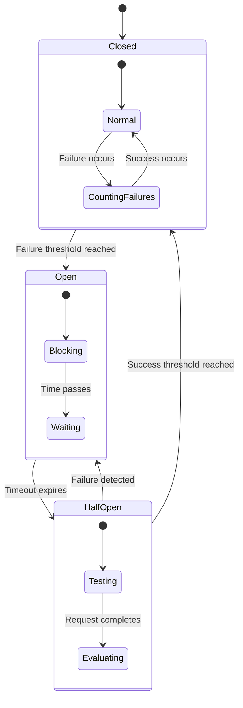

# Circuit Breaker Patterns in AgenticGoKit

**Building fault-tolerant agent systems with automatic failure detection and recovery**

Circuit breakers are essential for building resilient multi-agent systems. They automatically detect failures and prevent cascade failures by temporarily stopping requests to failing services. This guide shows you how to implement and configure circuit breaker patterns in AgenticGoKit.

## 🔌 Understanding Circuit Breakers

A circuit breaker works like an electrical circuit breaker - it "opens" when it detects too many failures, preventing further requests until the service recovers.



## 🛠️ Built-in Circuit Breaker Configuration

AgenticGoKit includes built-in circuit breaker support for LLM providers and MCP tools:

### **LLM Provider Circuit Breakers**

```toml
# agentflow.toml
[providers.openai.circuit_breaker]
enabled = true
failure_threshold = 5        # Open after 5 consecutive failures
success_threshold = 3        # Close after 3 consecutive successes
timeout_ms = 30000          # Stay open for 30 seconds
max_concurrent_calls = 10   # Limit concurrent requests

[providers.azure.circuit_breaker]
enabled = true
failure_threshold = 3
success_threshold = 2
timeout_ms = 60000
```

### **MCP Tool Circuit Breakers**

```toml
# agentflow.toml
[mcp.circuit_breaker]
enabled = true
failure_threshold = 10      # Higher threshold for tools
success_threshold = 5
timeout_ms = 60000

# Per-server circuit breaker settings
[[mcp.servers]]
name = "web-search"
type = "stdio"
command = "npx @modelcontextprotocol/server-web-search"
enabled = true

[mcp.servers.web-search.circuit_breaker]
failure_threshold = 3       # More sensitive for critical tools
timeout_ms = 30000
```

## 🔧 Custom Circuit Breaker Implementation

For custom agents and services, you can implement your own circuit breakers:

### **Basic Circuit Breaker**

```go
package patterns

import (
    "context"
    "errors"
    "sync"
    "time"
)

type CircuitState int

const (
    StateClosed CircuitState = iota
    StateOpen
    StateHalfOpen
)

type CircuitBreaker struct {
    mu                sync.RWMutex
    state            CircuitState
    failureCount     int
    successCount     int
    lastFailureTime  time.Time
    
    // Configuration
    failureThreshold int
    successThreshold int
    timeout          time.Duration
    maxConcurrent    int
    currentCalls     int
}

func NewCircuitBreaker(failureThreshold, successThreshold int, timeout time.Duration) *CircuitBreaker {
    return &CircuitBreaker{
        state:            StateClosed,
        failureThreshold: failureThreshold,
        successThreshold: successThreshold,
        timeout:          timeout,
        maxConcurrent:    10,
    }
}

func (cb *CircuitBreaker) Execute(ctx context.Context, fn func() error) error {
    // Check if we can execute
    if !cb.canExecute() {
        return errors.New("circuit breaker is open")
    }
    
    // Track concurrent calls
    cb.incrementCalls()
    defer cb.decrementCalls()
    
    // Execute the function
    err := fn()
    
    // Record the result
    cb.recordResult(err)
    
    return err
}

func (cb *CircuitBreaker) canExecute() bool {
    cb.mu.RLock()
    defer cb.mu.RUnlock()
    
    switch cb.state {
    case StateClosed:
        return cb.currentCalls < cb.maxConcurrent
    case StateOpen:
        return time.Since(cb.lastFailureTime) >= cb.timeout
    case StateHalfOpen:
        return cb.currentCalls == 0 // Only allow one test call
    default:
        return false
    }
}

func (cb *CircuitBreaker) recordResult(err error) {
    cb.mu.Lock()
    defer cb.mu.Unlock()
    
    if err != nil {
        cb.recordFailure()
    } else {
        cb.recordSuccess()
    }
}

func (cb *CircuitBreaker) recordFailure() {
    cb.failureCount++
    cb.successCount = 0
    cb.lastFailureTime = time.Now()
    
    switch cb.state {
    case StateClosed:
        if cb.failureCount >= cb.failureThreshold {
            cb.state = StateOpen
        }
    case StateHalfOpen:
        cb.state = StateOpen
    }
}

func (cb *CircuitBreaker) recordSuccess() {
    cb.successCount++
    cb.failureCount = 0
    
    switch cb.state {
    case StateHalfOpen:
        if cb.successCount >= cb.successThreshold {
            cb.state = StateClosed
        }
    case StateOpen:
        cb.state = StateHalfOpen
        cb.successCount = 1
    }
}

func (cb *CircuitBreaker) incrementCalls() {
    cb.mu.Lock()
    cb.currentCalls++
    cb.mu.Unlock()
}

func (cb *CircuitBreaker) decrementCalls() {
    cb.mu.Lock()
    cb.currentCalls--
    cb.mu.Unlock()
}

func (cb *CircuitBreaker) GetState() CircuitState {
    cb.mu.RLock()
    defer cb.mu.RUnlock()
    return cb.state
}
```

### **Agent with Circuit Breaker**

```go
package agents

import (
    "context"
    "fmt"
    "time"
    
    "github.com/kunalkushwaha/agenticgokit/core"
    "your-project/patterns"
)

type ResilientAgent struct {
    name           string
    llmProvider    core.ModelProvider
    circuitBreaker *patterns.CircuitBreaker
    fallbackAgent  core.AgentHandler
}

func NewResilientAgent(name string, provider core.ModelProvider) *ResilientAgent {
    return &ResilientAgent{
        name:        name,
        llmProvider: provider,
        circuitBreaker: patterns.NewCircuitBreaker(
            5,                // failure threshold
            3,                // success threshold
            30*time.Second,   // timeout
        ),
    }
}

func (a *ResilientAgent) Execute(ctx context.Context, event core.Event, state *core.State) (*core.AgentResult, error) {
    // Try primary execution with circuit breaker
    var result *core.AgentResult
    var err error
    
    cbErr := a.circuitBreaker.Execute(ctx, func() error {
        result, err = a.executePrimary(ctx, event, state)
        return err
    })
    
    // If circuit breaker is open or primary fails, use fallback
    if cbErr != nil || err != nil {
        if a.fallbackAgent != nil {
            fmt.Printf("Circuit breaker open for %s, using fallback\n", a.name)
            return a.fallbackAgent.Execute(ctx, event, state)
        }
        
        // Return a safe fallback response
        return &core.AgentResult{
            Data: map[string]interface{}{
                "error":   "Service temporarily unavailable",
                "message": "Please try again later",
                "agent":   a.name,
            },
        }, nil
    }
    
    return result, nil
}

func (a *ResilientAgent) executePrimary(ctx context.Context, event core.Event, state *core.State) (*core.AgentResult, error) {
    // Your primary agent logic here
    query := fmt.Sprintf("Process this request: %v", event.Data)
    
    response, err := a.llmProvider.GenerateResponse(ctx, query, nil)
    if err != nil {
        return nil, fmt.Errorf("LLM request failed: %w", err)
    }
    
    return &core.AgentResult{
        Data: map[string]interface{}{
            "response": response,
            "agent":    a.name,
        },
    }, nil
}

func (a *ResilientAgent) SetFallback(fallback core.AgentHandler) {
    a.fallbackAgent = fallback
}

func (a *ResilientAgent) GetCircuitBreakerState() patterns.CircuitState {
    return a.circuitBreaker.GetState()
}
```

## 🔄 Advanced Circuit Breaker Patterns

### **Hierarchical Circuit Breakers**

Implement circuit breakers at multiple levels for fine-grained control:

```go
type HierarchicalCircuitBreaker struct {
    serviceBreaker   *patterns.CircuitBreaker  // Service-level
    operationBreakers map[string]*patterns.CircuitBreaker  // Operation-level
    mu               sync.RWMutex
}

func NewHierarchicalCircuitBreaker() *HierarchicalCircuitBreaker {
    return &HierarchicalCircuitBreaker{
        serviceBreaker: patterns.NewCircuitBreaker(10, 5, 60*time.Second),
        operationBreakers: make(map[string]*patterns.CircuitBreaker),
    }
}

func (hcb *HierarchicalCircuitBreaker) Execute(ctx context.Context, operation string, fn func() error) error {
    // Check service-level circuit breaker first
    if !hcb.serviceBreaker.canExecute() {
        return errors.New("service circuit breaker is open")
    }
    
    // Get or create operation-level circuit breaker
    opBreaker := hcb.getOperationBreaker(operation)
    
    // Execute with both circuit breakers
    return opBreaker.Execute(ctx, func() error {
        return hcb.serviceBreaker.Execute(ctx, fn)
    })
}

func (hcb *HierarchicalCircuitBreaker) getOperationBreaker(operation string) *patterns.CircuitBreaker {
    hcb.mu.RLock()
    breaker, exists := hcb.operationBreakers[operation]
    hcb.mu.RUnlock()
    
    if !exists {
        hcb.mu.Lock()
        // Double-check pattern
        if breaker, exists = hcb.operationBreakers[operation]; !exists {
            breaker = patterns.NewCircuitBreaker(3, 2, 30*time.Second)
            hcb.operationBreakers[operation] = breaker
        }
        hcb.mu.Unlock()
    }
    
    return breaker
}
```

### **Adaptive Circuit Breaker**

Circuit breaker that adapts its thresholds based on historical performance:

```go
type AdaptiveCircuitBreaker struct {
    *patterns.CircuitBreaker
    
    // Adaptive parameters
    baseFailureThreshold int
    performanceHistory   []float64
    adaptationWindow     int
    mu                   sync.RWMutex
}

func NewAdaptiveCircuitBreaker(baseThreshold int) *AdaptiveCircuitBreaker {
    return &AdaptiveCircuitBreaker{
        CircuitBreaker:       patterns.NewCircuitBreaker(baseThreshold, 3, 30*time.Second),
        baseFailureThreshold: baseThreshold,
        performanceHistory:   make([]float64, 0, 100),
        adaptationWindow:     20,
    }
}

func (acb *AdaptiveCircuitBreaker) Execute(ctx context.Context, fn func() error) error {
    start := time.Now()
    err := acb.CircuitBreaker.Execute(ctx, fn)
    duration := time.Since(start)
    
    // Record performance metrics
    acb.recordPerformance(duration, err)
    
    // Adapt thresholds based on recent performance
    acb.adaptThresholds()
    
    return err
}

func (acb *AdaptiveCircuitBreaker) recordPerformance(duration time.Duration, err error) {
    acb.mu.Lock()
    defer acb.mu.Unlock()
    
    // Record success rate and response time
    successRate := 1.0
    if err != nil {
        successRate = 0.0
    }
    
    // Combine success rate and response time into a performance score
    responseTimeScore := math.Max(0, 1.0-duration.Seconds()/10.0) // Normalize to 10s max
    performanceScore := (successRate + responseTimeScore) / 2.0
    
    acb.performanceHistory = append(acb.performanceHistory, performanceScore)
    
    // Keep only recent history
    if len(acb.performanceHistory) > 100 {
        acb.performanceHistory = acb.performanceHistory[1:]
    }
}

func (acb *AdaptiveCircuitBreaker) adaptThresholds() {
    acb.mu.Lock()
    defer acb.mu.Unlock()
    
    if len(acb.performanceHistory) < acb.adaptationWindow {
        return
    }
    
    // Calculate recent average performance
    recent := acb.performanceHistory[len(acb.performanceHistory)-acb.adaptationWindow:]
    avgPerformance := 0.0
    for _, score := range recent {
        avgPerformance += score
    }
    avgPerformance /= float64(len(recent))
    
    // Adapt failure threshold based on performance
    if avgPerformance > 0.8 {
        // Good performance - increase threshold (more tolerant)
        acb.failureThreshold = int(float64(acb.baseFailureThreshold) * 1.5)
    } else if avgPerformance < 0.5 {
        // Poor performance - decrease threshold (more sensitive)
        acb.failureThreshold = int(float64(acb.baseFailureThreshold) * 0.7)
    } else {
        // Normal performance - use base threshold
        acb.failureThreshold = acb.baseFailureThreshold
    }
}
```

## 📊 Circuit Breaker Monitoring

### **Metrics Collection**

```go
type CircuitBreakerMetrics struct {
    totalRequests    int64
    successfulRequests int64
    failedRequests   int64
    circuitOpenTime  time.Duration
    stateChanges     int64
    mu               sync.RWMutex
}

func (cbm *CircuitBreakerMetrics) RecordRequest(success bool) {
    cbm.mu.Lock()
    defer cbm.mu.Unlock()
    
    cbm.totalRequests++
    if success {
        cbm.successfulRequests++
    } else {
        cbm.failedRequests++
    }
}

func (cbm *CircuitBreakerMetrics) RecordStateChange(newState patterns.CircuitState) {
    cbm.mu.Lock()
    defer cbm.mu.Unlock()
    
    cbm.stateChanges++
    
    // Track time spent in open state
    if newState == patterns.StateOpen {
        cbm.circuitOpenTime = time.Now().Sub(time.Time{})
    }
}

func (cbm *CircuitBreakerMetrics) GetSuccessRate() float64 {
    cbm.mu.RLock()
    defer cbm.mu.RUnlock()
    
    if cbm.totalRequests == 0 {
        return 0.0
    }
    
    return float64(cbm.successfulRequests) / float64(cbm.totalRequests)
}
```

### **Health Check Integration**

```go
func (a *ResilientAgent) HealthCheck() map[string]interface{} {
    state := a.circuitBreaker.GetState()
    
    health := map[string]interface{}{
        "agent":           a.name,
        "circuit_breaker": map[string]interface{}{
            "state":   stateToString(state),
            "healthy": state == patterns.StateClosed,
        },
    }
    
    // Add metrics if available
    if metrics := a.getMetrics(); metrics != nil {
        health["metrics"] = map[string]interface{}{
            "success_rate":   metrics.GetSuccessRate(),
            "total_requests": metrics.totalRequests,
            "state_changes":  metrics.stateChanges,
        }
    }
    
    return health
}

func stateToString(state patterns.CircuitState) string {
    switch state {
    case patterns.StateClosed:
        return "closed"
    case patterns.StateOpen:
        return "open"
    case patterns.StateHalfOpen:
        return "half-open"
    default:
        return "unknown"
    }
}
```

## 🚨 Error Handling Strategies

### **Graceful Degradation**

```go
type GracefulAgent struct {
    primary   core.AgentHandler
    secondary core.AgentHandler
    cache     map[string]*core.AgentResult
    mu        sync.RWMutex
}

func (ga *GracefulAgent) Execute(ctx context.Context, event core.Event, state *core.State) (*core.AgentResult, error) {
    // Try primary agent
    result, err := ga.primary.Execute(ctx, event, state)
    if err == nil {
        // Cache successful result
        ga.cacheResult(event, result)
        return result, nil
    }
    
    // Try secondary agent
    if ga.secondary != nil {
        result, err = ga.secondary.Execute(ctx, event, state)
        if err == nil {
            return result, nil
        }
    }
    
    // Try cached result
    if cached := ga.getCachedResult(event); cached != nil {
        return cached, nil
    }
    
    // Return safe fallback
    return &core.AgentResult{
        Data: map[string]interface{}{
            "error":   "All services unavailable",
            "message": "Using fallback response",
        },
    }, nil
}

func (ga *GracefulAgent) cacheResult(event core.Event, result *core.AgentResult) {
    ga.mu.Lock()
    defer ga.mu.Unlock()
    
    key := fmt.Sprintf("%s:%v", event.Type, event.Data)
    ga.cache[key] = result
    
    // Implement cache eviction policy
    if len(ga.cache) > 100 {
        // Remove oldest entries (simple LRU)
        for k := range ga.cache {
            delete(ga.cache, k)
            break
        }
    }
}
```

## 🔧 Best Practices

### **1. Circuit Breaker Configuration**

```toml
# Conservative settings for critical services
[critical_service.circuit_breaker]
failure_threshold = 3
success_threshold = 2
timeout_ms = 60000
max_concurrent_calls = 5

# More tolerant settings for non-critical services
[non_critical_service.circuit_breaker]
failure_threshold = 10
success_threshold = 5
timeout_ms = 30000
max_concurrent_calls = 20
```

### **2. Monitoring and Alerting**

```go
// Set up alerts for circuit breaker state changes
func (cb *CircuitBreaker) onStateChange(oldState, newState CircuitState) {
    if newState == StateOpen {
        // Alert: Circuit breaker opened
        sendAlert("Circuit breaker opened", map[string]interface{}{
            "service":   cb.serviceName,
            "timestamp": time.Now(),
            "failures":  cb.failureCount,
        })
    }
    
    if oldState == StateOpen && newState == StateClosed {
        // Alert: Circuit breaker recovered
        sendAlert("Circuit breaker recovered", map[string]interface{}{
            "service":   cb.serviceName,
            "timestamp": time.Now(),
            "downtime":  time.Since(cb.lastFailureTime),
        })
    }
}
```

### **3. Testing Circuit Breakers**

```go
func TestCircuitBreakerBehavior(t *testing.T) {
    cb := patterns.NewCircuitBreaker(3, 2, 100*time.Millisecond)
    
    // Test closed state
    assert.Equal(t, patterns.StateClosed, cb.GetState())
    
    // Trigger failures to open circuit
    for i := 0; i < 3; i++ {
        err := cb.Execute(context.Background(), func() error {
            return errors.New("simulated failure")
        })
        assert.Error(t, err)
    }
    
    // Circuit should be open now
    assert.Equal(t, patterns.StateOpen, cb.GetState())
    
    // Requests should be rejected
    err := cb.Execute(context.Background(), func() error {
        return nil
    })
    assert.Error(t, err)
    assert.Contains(t, err.Error(), "circuit breaker is open")
    
    // Wait for timeout
    time.Sleep(150 * time.Millisecond)
    
    // Should allow test request (half-open)
    err = cb.Execute(context.Background(), func() error {
        return nil
    })
    assert.NoError(t, err)
}
```

## 🎯 Common Patterns

### **1. Bulkhead Pattern with Circuit Breakers**

```go
type BulkheadAgent struct {
    pools map[string]*ResourcePool
    mu    sync.RWMutex
}

type ResourcePool struct {
    semaphore      chan struct{}
    circuitBreaker *patterns.CircuitBreaker
}

func (ba *BulkheadAgent) Execute(ctx context.Context, event core.Event, state *core.State) (*core.AgentResult, error) {
    poolName := ba.getPoolName(event)
    pool := ba.getPool(poolName)
    
    // Acquire resource from pool
    select {
    case pool.semaphore <- struct{}{}:
        defer func() { <-pool.semaphore }()
    case <-ctx.Done():
        return nil, ctx.Err()
    }
    
    // Execute with circuit breaker
    var result *core.AgentResult
    var err error
    
    cbErr := pool.circuitBreaker.Execute(ctx, func() error {
        result, err = ba.executeInPool(ctx, event, state, poolName)
        return err
    })
    
    if cbErr != nil {
        return nil, cbErr
    }
    
    return result, err
}
```

### **2. Retry with Circuit Breaker**

```go
func (a *ResilientAgent) ExecuteWithRetry(ctx context.Context, event core.Event, state *core.State) (*core.AgentResult, error) {
    var lastErr error
    
    for attempt := 0; attempt < 3; attempt++ {
        // Check circuit breaker before each attempt
        if !a.circuitBreaker.canExecute() {
            return nil, errors.New("circuit breaker is open")
        }
        
        result, err := a.Execute(ctx, event, state)
        if err == nil {
            return result, nil
        }
        
        lastErr = err
        
        // Exponential backoff
        backoff := time.Duration(attempt*attempt) * 100 * time.Millisecond
        select {
        case <-time.After(backoff):
            continue
        case <-ctx.Done():
            return nil, ctx.Err()
        }
    }
    
    return nil, fmt.Errorf("all retry attempts failed: %w", lastErr)
}
```

Circuit breakers are essential for building production-ready agent systems. They provide automatic failure detection, prevent cascade failures, and enable graceful degradation when services are unavailable.

## 🚀 Next Steps

- **[Retry Policies](retry-policies.md)** - Learn about intelligent retry strategies
- **[Load Balancing](load-balancing-scaling.md)** - Distribute load across multiple agents
- **[Testing Strategies](testing-strategies.md)** - Test your resilient agent systems
- **[Production Monitoring](../debugging/performance-monitoring.md)** - Monitor circuit breaker health