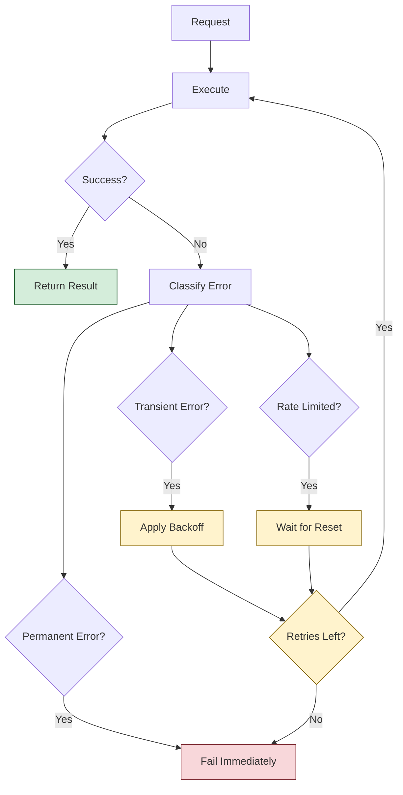

# Retry Policies and Error Handling

**Building resilient agent systems with intelligent retry strategies and comprehensive error handling**

Retry policies are crucial for handling transient failures in distributed agent systems. This guide shows you how to implement intelligent retry strategies, handle different types of errors appropriately, and build robust error recovery mechanisms in AgenticGoKit.

## 🔄 Understanding Retry Patterns

Different types of failures require different retry strategies:



## 🛠️ Built-in Retry Configuration

AgenticGoKit provides built-in retry policies for LLM providers and MCP tools:

### **LLM Provider Retry Policies**

```toml
# agentflow.toml
[providers.openai.retry]
enabled = true
max_retries = 3
base_delay_ms = 1000        # Start with 1 second
max_delay_ms = 30000        # Cap at 30 seconds
backoff_factor = 2.0        # Exponential backoff
enable_jitter = true        # Add randomization

# Retry conditions
retry_on_timeout = true
retry_on_rate_limit = true
retry_on_server_error = true
retry_on_network_error = true

[providers.azure.retry]
enabled = true
max_retries = 5             # Higher for enterprise
base_delay_ms = 500
max_delay_ms = 60000
backoff_factor = 1.5        # More conservative
enable_jitter = true
```

### **MCP Tool Retry Policies**

```toml
# agentflow.toml
[mcp.retry]
enabled = true
max_retries = 3
base_delay_ms = 1000
max_delay_ms = 15000
backoff_factor = 2.0
enable_jitter = true

# Per-server retry settings
[[mcp.servers]]
name = "web-search"
type = "stdio"
command = "npx @modelcontextprotocol/server-web-search"
enabled = true

[mcp.servers.web-search.retry]
max_retries = 5             # Web searches can be flaky
base_delay_ms = 2000
retry_on_timeout = true
```

## 🔧 Custom Retry Implementation

### **Basic Retry Policy**

```go
package patterns

import (
    "context"
    "errors"
    "math"
    "math/rand"
    "time"
)

type RetryPolicy struct {
    MaxRetries    int
    BaseDelay     time.Duration
    MaxDelay      time.Duration
    BackoffFactor float64
    EnableJitter  bool
    RetryCondition func(error) bool
}

func NewExponentialRetryPolicy(maxRetries int, baseDelay time.Duration) *RetryPolicy {
    return &RetryPolicy{
        MaxRetries:    maxRetries,
        BaseDelay:     baseDelay,
        MaxDelay:      30 * time.Second,
        BackoffFactor: 2.0,
        EnableJitter:  true,
        RetryCondition: func(err error) bool {
            return IsRetryableError(err)
        },
    }
}

func (rp *RetryPolicy) Execute(ctx context.Context, fn func() error) error {
    var lastErr error
    
    for attempt := 0; attempt <= rp.MaxRetries; attempt++ {
        // Execute the function
        err := fn()
        if err == nil {
            return nil // Success
        }
        
        lastErr = err
        
        // Check if we should retry
        if !rp.RetryCondition(err) {
            return err // Don't retry permanent errors
        }
        
        // Don't wait after the last attempt
        if attempt == rp.MaxRetries {
            break
        }
        
        // Calculate delay
        delay := rp.calculateDelay(attempt)
        
        // Wait with context cancellation support
        select {
        case <-time.After(delay):
            continue
        case <-ctx.Done():
            return ctx.Err()
        }
    }
    
    return lastErr
}

func (rp *RetryPolicy) calculateDelay(attempt int) time.Duration {
    // Exponential backoff
    delay := float64(rp.BaseDelay) * math.Pow(rp.BackoffFactor, float64(attempt))
    
    // Apply maximum delay cap
    if delay > float64(rp.MaxDelay) {
        delay = float64(rp.MaxDelay)
    }
    
    // Add jitter to prevent thundering herd
    if rp.EnableJitter {
        jitter := delay * 0.1 * rand.Float64() // ±10% jitter
        delay += jitter - (delay * 0.05)
    }
    
    return time.Duration(delay)
}

// Error classification
func IsRetryableError(err error) bool {
    if err == nil {
        return false
    }
    
    // Check for specific error types
    switch {
    case IsTimeoutError(err):
        return true
    case IsRateLimitError(err):
        return true
    case IsServerError(err):
        return true
    case IsNetworkError(err):
        return true
    case IsTemporaryError(err):
        return true
    default:
        return false
    }
}

func IsTimeoutError(err error) bool {
    return errors.Is(err, context.DeadlineExceeded) ||
           strings.Contains(err.Error(), "timeout")
}

func IsRateLimitError(err error) bool {
    return strings.Contains(err.Error(), "rate limit") ||
           strings.Contains(err.Error(), "429")
}

func IsServerError(err error) bool {
    return strings.Contains(err.Error(), "500") ||
           strings.Contains(err.Error(), "502") ||
           strings.Contains(err.Error(), "503") ||
           strings.Contains(err.Error(), "504")
}

func IsNetworkError(err error) bool {
    return strings.Contains(err.Error(), "connection refused") ||
           strings.Contains(err.Error(), "no such host") ||
           strings.Contains(err.Error(), "network unreachable")
}

func IsTemporaryError(err error) bool {
    type temporary interface {
        Temporary() bool
    }
    
    if te, ok := err.(temporary); ok {
        return te.Temporary()
    }
    
    return false
}
```

### **Agent with Retry Policy**

```go
package agents

import (
    "context"
    "fmt"
    "time"
    
    "github.com/kunalkushwaha/agenticgokit/core"
    "your-project/patterns"
)

type RetryableAgent struct {
    name         string
    llmProvider  core.ModelProvider
    retryPolicy  *patterns.RetryPolicy
    metrics      *RetryMetrics
}

func NewRetryableAgent(name string, provider core.ModelProvider) *RetryableAgent {
    return &RetryableAgent{
        name:        name,
        llmProvider: provider,
        retryPolicy: patterns.NewExponentialRetryPolicy(3, 1*time.Second),
        metrics:     NewRetryMetrics(),
    }
}

func (a *RetryableAgent) Execute(ctx context.Context, event core.Event, state *core.State) (*core.AgentResult, error) {
    var result *core.AgentResult
    var err error
    
    // Execute with retry policy
    retryErr := a.retryPolicy.Execute(ctx, func() error {
        result, err = a.executeOnce(ctx, event, state)
        return err
    })
    
    // Record metrics
    a.metrics.RecordExecution(retryErr == nil, a.retryPolicy.MaxRetries)
    
    if retryErr != nil {
        return nil, retryErr
    }
    
    return result, err
}

func (a *RetryableAgent) executeOnce(ctx context.Context, event core.Event, state *core.State) (*core.AgentResult, error) {
    query := fmt.Sprintf("Process this request: %v", event.Data)
    
    response, err := a.llmProvider.GenerateResponse(ctx, query, nil)
    if err != nil {
        return nil, fmt.Errorf("LLM request failed: %w", err)
    }
    
    return &core.AgentResult{
        Data: map[string]interface{}{
            "response": response,
            "agent":    a.name,
        },
    }, nil
}

func (a *RetryableAgent) SetRetryPolicy(policy *patterns.RetryPolicy) {
    a.retryPolicy = policy
}
```

## 📊 Advanced Retry Strategies

### **Adaptive Retry Policy**

```go
type AdaptiveRetryPolicy struct {
    *RetryPolicy
    
    // Adaptive parameters
    successRate     float64
    avgResponseTime time.Duration
    recentResults   []RetryResult
    mu              sync.RWMutex
}

type RetryResult struct {
    Success      bool
    Attempts     int
    Duration     time.Duration
    ErrorType    string
    Timestamp    time.Time
}

func NewAdaptiveRetryPolicy(basePolicy *RetryPolicy) *AdaptiveRetryPolicy {
    return &AdaptiveRetryPolicy{
        RetryPolicy:   basePolicy,
        recentResults: make([]RetryResult, 0, 100),
    }
}

func (arp *AdaptiveRetryPolicy) Execute(ctx context.Context, fn func() error) error {
    start := time.Now()
    attempts := 0
    
    // Adapt policy based on recent performance
    arp.adaptPolicy()
    
    var lastErr error
    for attempt := 0; attempt <= arp.MaxRetries; attempt++ {
        attempts++
        err := fn()
        if err == nil {
            // Record successful execution
            arp.recordResult(RetryResult{
                Success:   true,
                Attempts:  attempts,
                Duration:  time.Since(start),
                Timestamp: time.Now(),
            })
            return nil
        }
        
        lastErr = err
        
        if !arp.RetryCondition(err) || attempt == arp.MaxRetries {
            break
        }
        
        delay := arp.calculateDelay(attempt)
        select {
        case <-time.After(delay):
            continue
        case <-ctx.Done():
            return ctx.Err()
        }
    }
    
    // Record failed execution
    arp.recordResult(RetryResult{
        Success:   false,
        Attempts:  attempts,
        Duration:  time.Since(start),
        ErrorType: classifyError(lastErr),
        Timestamp: time.Now(),
    })
    
    return lastErr
}

func (arp *AdaptiveRetryPolicy) adaptPolicy() {
    arp.mu.Lock()
    defer arp.mu.Unlock()
    
    if len(arp.recentResults) < 10 {
        return // Not enough data
    }
    
    // Calculate recent success rate
    recent := arp.recentResults[len(arp.recentResults)-20:]
    successes := 0
    totalDuration := time.Duration(0)
    
    for _, result := range recent {
        if result.Success {
            successes++
        }
        totalDuration += result.Duration
    }
    
    arp.successRate = float64(successes) / float64(len(recent))
    arp.avgResponseTime = totalDuration / time.Duration(len(recent))
    
    // Adapt retry parameters based on performance
    if arp.successRate > 0.9 {
        // High success rate - reduce retries and delays
        arp.MaxRetries = max(1, arp.MaxRetries-1)
        arp.BaseDelay = time.Duration(float64(arp.BaseDelay) * 0.8)
    } else if arp.successRate < 0.5 {
        // Low success rate - increase retries and delays
        arp.MaxRetries = min(10, arp.MaxRetries+1)
        arp.BaseDelay = time.Duration(float64(arp.BaseDelay) * 1.2)
    }
    
    // Adapt based on response time
    if arp.avgResponseTime > 10*time.Second {
        // Slow responses - increase delays
        arp.BaseDelay = time.Duration(float64(arp.BaseDelay) * 1.1)
    }
}

func (arp *AdaptiveRetryPolicy) recordResult(result RetryResult) {
    arp.mu.Lock()
    defer arp.mu.Unlock()
    
    arp.recentResults = append(arp.recentResults, result)
    
    // Keep only recent results
    if len(arp.recentResults) > 100 {
        arp.recentResults = arp.recentResults[1:]
    }
}
```

### **Context-Aware Retry Policy**

```go
type ContextAwareRetryPolicy struct {
    policies map[string]*RetryPolicy
    defaultPolicy *RetryPolicy
    mu       sync.RWMutex
}

func NewContextAwareRetryPolicy() *ContextAwareRetryPolicy {
    return &ContextAwareRetryPolicy{
        policies: map[string]*RetryPolicy{
            "timeout":     NewTimeoutRetryPolicy(),
            "rate_limit":  NewRateLimitRetryPolicy(),
            "server_error": NewServerErrorRetryPolicy(),
            "network":     NewNetworkRetryPolicy(),
        },
        defaultPolicy: patterns.NewExponentialRetryPolicy(3, 1*time.Second),
    }
}

func (carp *ContextAwareRetryPolicy) Execute(ctx context.Context, fn func() error) error {
    var lastErr error
    
    for attempt := 0; attempt <= 5; attempt++ { // Max attempts across all policies
        err := fn()
        if err == nil {
            return nil
        }
        
        lastErr = err
        
        // Select appropriate retry policy based on error type
        policy := carp.selectPolicy(err)
        if policy == nil {
            return err // No retry policy for this error
        }
        
        // Check if we should retry with this policy
        if !policy.RetryCondition(err) {
            return err
        }
        
        // Calculate delay based on error-specific policy
        delay := policy.calculateDelay(attempt)
        
        select {
        case <-time.After(delay):
            continue
        case <-ctx.Done():
            return ctx.Err()
        }
    }
    
    return lastErr
}

func (carp *ContextAwareRetryPolicy) selectPolicy(err error) *RetryPolicy {
    carp.mu.RLock()
    defer carp.mu.RUnlock()
    
    switch {
    case IsTimeoutError(err):
        return carp.policies["timeout"]
    case IsRateLimitError(err):
        return carp.policies["rate_limit"]
    case IsServerError(err):
        return carp.policies["server_error"]
    case IsNetworkError(err):
        return carp.policies["network"]
    default:
        return carp.defaultPolicy
    }
}

func NewTimeoutRetryPolicy() *RetryPolicy {
    return &RetryPolicy{
        MaxRetries:    2,                // Fewer retries for timeouts
        BaseDelay:     500 * time.Millisecond,
        MaxDelay:      5 * time.Second,
        BackoffFactor: 1.5,             // Conservative backoff
        EnableJitter:  true,
        RetryCondition: IsTimeoutError,
    }
}

func NewRateLimitRetryPolicy() *RetryPolicy {
    return &RetryPolicy{
        MaxRetries:    5,                // More retries for rate limits
        BaseDelay:     2 * time.Second,  // Longer initial delay
        MaxDelay:      60 * time.Second,
        BackoffFactor: 2.0,
        EnableJitter:  true,
        RetryCondition: IsRateLimitError,
    }
}

func NewServerErrorRetryPolicy() *RetryPolicy {
    return &RetryPolicy{
        MaxRetries:    3,
        BaseDelay:     1 * time.Second,
        MaxDelay:      30 * time.Second,
        BackoffFactor: 2.0,
        EnableJitter:  true,
        RetryCondition: IsServerError,
    }
}

func NewNetworkRetryPolicy() *RetryPolicy {
    return &RetryPolicy{
        MaxRetries:    4,                // Network issues might resolve quickly
        BaseDelay:     200 * time.Millisecond,
        MaxDelay:      10 * time.Second,
        BackoffFactor: 2.5,
        EnableJitter:  true,
        RetryCondition: IsNetworkError,
    }
}
```

## 🔄 Retry with Circuit Breaker Integration

```go
type ResilientExecutor struct {
    retryPolicy    *patterns.RetryPolicy
    circuitBreaker *patterns.CircuitBreaker
    metrics        *ExecutionMetrics
}

func NewResilientExecutor() *ResilientExecutor {
    return &ResilientExecutor{
        retryPolicy:    patterns.NewExponentialRetryPolicy(3, 1*time.Second),
        circuitBreaker: patterns.NewCircuitBreaker(5, 3, 30*time.Second),
        metrics:        NewExecutionMetrics(),
    }
}

func (re *ResilientExecutor) Execute(ctx context.Context, fn func() error) error {
    start := time.Now()
    
    // Check circuit breaker first
    if !re.circuitBreaker.canExecute() {
        re.metrics.RecordCircuitBreakerOpen()
        return errors.New("circuit breaker is open")
    }
    
    var lastErr error
    var totalAttempts int
    
    // Execute with retry policy
    retryErr := re.retryPolicy.Execute(ctx, func() error {
        totalAttempts++
        
        // Execute within circuit breaker
        err := re.circuitBreaker.Execute(ctx, fn)
        lastErr = err
        return err
    })
    
    // Record metrics
    re.metrics.RecordExecution(ExecutionResult{
        Success:      retryErr == nil,
        Attempts:     totalAttempts,
        Duration:     time.Since(start),
        ErrorType:    classifyError(lastErr),
        CircuitState: re.circuitBreaker.GetState(),
    })
    
    return retryErr
}
```

## 📊 Error Classification and Handling

### **Comprehensive Error Classification**

```go
type ErrorClassifier struct {
    patterns map[ErrorType][]ErrorPattern
}

type ErrorType int

const (
    ErrorTypeTransient ErrorType = iota
    ErrorTypePermanent
    ErrorTypeRateLimit
    ErrorTypeTimeout
    ErrorTypeNetwork
    ErrorTypeAuthentication
    ErrorTypeAuthorization
    ErrorTypeQuota
    ErrorTypeValidation
)

type ErrorPattern struct {
    Pattern     string
    Regex       *regexp.Regexp
    StatusCodes []int
    Checker     func(error) bool
}

func NewErrorClassifier() *ErrorClassifier {
    ec := &ErrorClassifier{
        patterns: make(map[ErrorType][]ErrorPattern),
    }
    
    // Define error patterns
    ec.patterns[ErrorTypeTransient] = []ErrorPattern{
        {Pattern: "connection reset", Checker: func(err error) bool {
            return strings.Contains(err.Error(), "connection reset")
        }},
        {StatusCodes: []int{500, 502, 503, 504}},
        {Pattern: "temporary failure", Checker: IsTemporaryError},
    }
    
    ec.patterns[ErrorTypeRateLimit] = []ErrorPattern{
        {StatusCodes: []int{429}},
        {Pattern: "rate limit", Checker: func(err error) bool {
            return strings.Contains(strings.ToLower(err.Error()), "rate limit")
        }},
        {Pattern: "quota exceeded", Checker: func(err error) bool {
            return strings.Contains(strings.ToLower(err.Error()), "quota")
        }},
    }
    
    ec.patterns[ErrorTypeTimeout] = []ErrorPattern{
        {Checker: func(err error) bool {
            return errors.Is(err, context.DeadlineExceeded)
        }},
        {Pattern: "timeout", Checker: func(err error) bool {
            return strings.Contains(strings.ToLower(err.Error()), "timeout")
        }},
    }
    
    ec.patterns[ErrorTypeNetwork] = []ErrorPattern{
        {Pattern: "connection refused", Checker: func(err error) bool {
            return strings.Contains(err.Error(), "connection refused")
        }},
        {Pattern: "no such host", Checker: func(err error) bool {
            return strings.Contains(err.Error(), "no such host")
        }},
    }
    
    ec.patterns[ErrorTypeAuthentication] = []ErrorPattern{
        {StatusCodes: []int{401}},
        {Pattern: "unauthorized", Checker: func(err error) bool {
            return strings.Contains(strings.ToLower(err.Error()), "unauthorized")
        }},
    }
    
    ec.patterns[ErrorTypeAuthorization] = []ErrorPattern{
        {StatusCodes: []int{403}},
        {Pattern: "forbidden", Checker: func(err error) bool {
            return strings.Contains(strings.ToLower(err.Error()), "forbidden")
        }},
    }
    
    ec.patterns[ErrorTypeValidation] = []ErrorPattern{
        {StatusCodes: []int{400}},
        {Pattern: "invalid request", Checker: func(err error) bool {
            return strings.Contains(strings.ToLower(err.Error()), "invalid")
        }},
    }
    
    return ec
}

func (ec *ErrorClassifier) Classify(err error) ErrorType {
    if err == nil {
        return ErrorTypePermanent // Shouldn't happen
    }
    
    // Check each error type
    for errorType, patterns := range ec.patterns {
        for _, pattern := range patterns {
            if ec.matchesPattern(err, pattern) {
                return errorType
            }
        }
    }
    
    return ErrorTypePermanent // Default to permanent if unknown
}

func (ec *ErrorClassifier) matchesPattern(err error, pattern ErrorPattern) bool {
    // Check custom checker first
    if pattern.Checker != nil {
        return pattern.Checker(err)
    }
    
    // Check status codes (if error contains HTTP status)
    if len(pattern.StatusCodes) > 0 {
        for _, code := range pattern.StatusCodes {
            if strings.Contains(err.Error(), fmt.Sprintf("%d", code)) {
                return true
            }
        }
    }
    
    // Check regex pattern
    if pattern.Regex != nil {
        return pattern.Regex.MatchString(err.Error())
    }
    
    // Check simple string pattern
    if pattern.Pattern != "" {
        return strings.Contains(strings.ToLower(err.Error()), strings.ToLower(pattern.Pattern))
    }
    
    return false
}

func (ec *ErrorClassifier) ShouldRetry(err error) bool {
    errorType := ec.Classify(err)
    
    switch errorType {
    case ErrorTypeTransient, ErrorTypeTimeout, ErrorTypeNetwork, ErrorTypeRateLimit:
        return true
    case ErrorTypePermanent, ErrorTypeAuthentication, ErrorTypeAuthorization, ErrorTypeValidation:
        return false
    default:
        return false
    }
}
```

## 📈 Retry Metrics and Monitoring

### **Comprehensive Retry Metrics**

```go
type RetryMetrics struct {
    totalExecutions    int64
    successfulExecutions int64
    failedExecutions   int64
    totalRetries       int64
    retriesByErrorType map[string]int64
    avgRetryCount      float64
    maxRetryCount      int
    mu                 sync.RWMutex
}

func NewRetryMetrics() *RetryMetrics {
    return &RetryMetrics{
        retriesByErrorType: make(map[string]int64),
    }
}

func (rm *RetryMetrics) RecordExecution(success bool, attempts int) {
    rm.mu.Lock()
    defer rm.mu.Unlock()
    
    rm.totalExecutions++
    if success {
        rm.successfulExecutions++
    } else {
        rm.failedExecutions++
    }
    
    if attempts > 1 {
        retries := attempts - 1
        rm.totalRetries += int64(retries)
        
        // Update average
        rm.avgRetryCount = float64(rm.totalRetries) / float64(rm.totalExecutions)
        
        // Update max
        if retries > rm.maxRetryCount {
            rm.maxRetryCount = retries
        }
    }
}

func (rm *RetryMetrics) RecordRetryByErrorType(errorType string) {
    rm.mu.Lock()
    defer rm.mu.Unlock()
    
    rm.retriesByErrorType[errorType]++
}

func (rm *RetryMetrics) GetStats() map[string]interface{} {
    rm.mu.RLock()
    defer rm.mu.RUnlock()
    
    successRate := 0.0
    if rm.totalExecutions > 0 {
        successRate = float64(rm.successfulExecutions) / float64(rm.totalExecutions)
    }
    
    return map[string]interface{}{
        "total_executions":     rm.totalExecutions,
        "successful_executions": rm.successfulExecutions,
        "failed_executions":    rm.failedExecutions,
        "success_rate":         successRate,
        "total_retries":        rm.totalRetries,
        "avg_retry_count":      rm.avgRetryCount,
        "max_retry_count":      rm.maxRetryCount,
        "retries_by_error_type": rm.retriesByErrorType,
    }
}
```

## 🎯 Best Practices

### **1. Error-Specific Retry Strategies**

```go
// Configure different strategies for different error types
func ConfigureRetryPolicies() map[string]*RetryPolicy {
    return map[string]*RetryPolicy{
        "llm_timeout": {
            MaxRetries:    2,
            BaseDelay:     1 * time.Second,
            BackoffFactor: 1.5,
        },
        "llm_rate_limit": {
            MaxRetries:    5,
            BaseDelay:     5 * time.Second,
            BackoffFactor: 2.0,
        },
        "tool_network": {
            MaxRetries:    3,
            BaseDelay:     500 * time.Millisecond,
            BackoffFactor: 2.0,
        },
        "tool_server_error": {
            MaxRetries:    4,
            BaseDelay:     2 * time.Second,
            BackoffFactor: 1.8,
        },
    }
}
```

### **2. Context-Aware Timeouts**

```go
func (a *RetryableAgent) ExecuteWithContext(ctx context.Context, event core.Event, state *core.State) (*core.AgentResult, error) {
    // Set different timeouts based on operation type
    var timeout time.Duration
    
    switch event.Type {
    case "quick_query":
        timeout = 5 * time.Second
    case "complex_analysis":
        timeout = 30 * time.Second
    case "document_processing":
        timeout = 60 * time.Second
    default:
        timeout = 15 * time.Second
    }
    
    // Create context with timeout
    ctx, cancel := context.WithTimeout(ctx, timeout)
    defer cancel()
    
    return a.Execute(ctx, event, state)
}
```

### **3. Graceful Degradation**

```go
func (a *RetryableAgent) ExecuteWithFallback(ctx context.Context, event core.Event, state *core.State) (*core.AgentResult, error) {
    // Try primary execution with retries
    result, err := a.Execute(ctx, event, state)
    if err == nil {
        return result, nil
    }
    
    // If all retries failed, try fallback strategies
    if fallbackResult := a.tryCache(event); fallbackResult != nil {
        return fallbackResult, nil
    }
    
    if fallbackResult := a.trySimplifiedResponse(event); fallbackResult != nil {
        return fallbackResult, nil
    }
    
    // Return error response as last resort
    return &core.AgentResult{
        Data: map[string]interface{}{
            "error":   "Service temporarily unavailable",
            "message": "Please try again later",
            "code":    "RETRY_EXHAUSTED",
        },
    }, nil
}
```

### **4. Testing Retry Logic**

```go
func TestRetryPolicy(t *testing.T) {
    policy := patterns.NewExponentialRetryPolicy(3, 100*time.Millisecond)
    
    // Test successful execution
    attempts := 0
    err := policy.Execute(context.Background(), func() error {
        attempts++
        if attempts < 3 {
            return errors.New("temporary failure")
        }
        return nil
    })
    
    assert.NoError(t, err)
    assert.Equal(t, 3, attempts)
    
    // Test permanent failure
    attempts = 0
    err = policy.Execute(context.Background(), func() error {
        attempts++
        return errors.New("permanent failure")
    })
    
    assert.Error(t, err)
    assert.Equal(t, 1, attempts) // Should not retry permanent errors
}
```

Retry policies are essential for building resilient agent systems that can handle transient failures gracefully while avoiding unnecessary retries for permanent errors.

## 🚀 Next Steps

- **[Circuit Breaker Patterns](circuit-breaker-patterns.md)** - Combine with circuit breakers for comprehensive fault tolerance
- **[Load Balancing](load-balancing-scaling.md)** - Distribute load to reduce individual service pressure
- **[Testing Strategies](testing-strategies.md)** - Test your retry and error handling logic
- **[Production Monitoring](../debugging/performance-monitoring.md)** - Monitor retry patterns and success rates