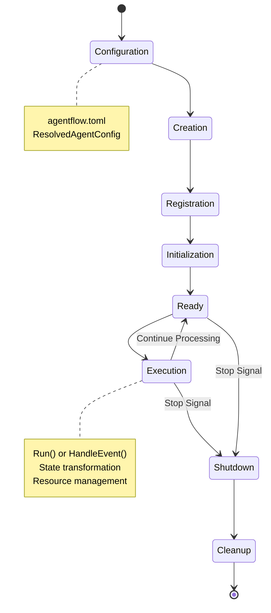

# Agent Lifecycle in AgenticGoKit

Understanding the agent lifecycle is fundamental to building effective multi-agent systems. This tutorial explores how agents are created, configured, executed, and managed using AgenticGoKit's unified Agent interface and modern patterns.

The agent lifecycle encompasses configuration-driven creation, capability composition, execution patterns, and resource management.

## Prerequisites

- Basic understanding of Go programming and interfaces
- Familiarity with [Message Passing and Event Flow](./message-passing.md)
- Knowledge of [State Management](./state-management.md)
- Understanding of [Core Concepts Overview](./README.md)

## Learning Objectives

By the end of this tutorial, you'll understand:
- The unified Agent interface and its capabilities
- Configuration-driven agent creation patterns
- Agent lifecycle management and best practices
- Capability composition and advanced agent patterns
- Resource management and cleanup strategies

## The Unified Agent Interface

AgenticGoKit uses a comprehensive, unified Agent interface that supports both state processing and event handling patterns:

```go
type Agent interface {
    // Core identification
    Name() string
    GetRole() string
    GetDescription() string
    
    // Dual execution patterns
    Run(ctx context.Context, inputState State) (State, error)
    HandleEvent(ctx context.Context, event Event, state State) (AgentResult, error)
    
    // Configuration and capabilities
    GetCapabilities() []string
    GetSystemPrompt() string
    GetTimeout() time.Duration
    IsEnabled() bool
    GetLLMConfig() *ResolvedLLMConfig
    
    // Lifecycle management
    Initialize(ctx context.Context) error
    Shutdown(ctx context.Context) error
}
```

::: info Dual Execution Patterns
- **`Run()`**: Direct state transformation for simple processing
- **`HandleEvent()`**: Full event-driven processing with metadata and routing
:::

## Agent Lifecycle Phases

Agents follow a well-defined lifecycle with clear phases:



## Agent Creation Patterns

### 1. Configuration-Driven Creation (Recommended)

The primary way to create agents is through configuration files and factories:

::: code-group

```toml [agentflow.toml]
[agents.research_agent]
role = "research_specialist"
description = "Specialized agent for research tasks"
system_prompt = "You are a research specialist with access to web search and document analysis."
enabled = true
capabilities = ["research", "analysis", "web_search"]
timeout_seconds = 60

[agents.research_agent.llm]
provider = "ollama"
model = "gemma3:1b"
temperature = 0.3
max_tokens = 1000
```

```go [agent_creation.go]
// Create agent factory from configuration
config, err := core.LoadConfigFromWorkingDir()
if err != nil {
    log.Fatal(err)
}

factory := core.NewConfigurableAgentFactory(config)

// Create agent from configuration
agent, err := factory.CreateAgentFromConfig("research_agent", config)
if err != nil {
    log.Fatal(err)
}

fmt.Printf("Created agent: %s with role: %s\n", agent.Name(), agent.GetRole())
```

:::

### 2. Composable Agent Pattern

For advanced scenarios requiring custom capabilities:

```go
// Define capabilities for the agent
capabilities := map[core.CapabilityType]core.AgentCapability{
    core.CapabilityTypeLLM:     llmCapability,
    core.CapabilityTypeMemory:  memoryCapability,
    core.CapabilityTypeMetrics: metricsCapability,
}

// Create custom handler
handler := core.AgentHandlerFunc(func(ctx context.Context, event core.Event, state core.State) (core.AgentResult, error) {
    // Custom processing logic
    outputState := state.Clone()
    outputState.Set("processed_by", "custom_agent")
    outputState.Set("timestamp", time.Now().Unix())
    
    return core.AgentResult{
        OutputState: outputState,
        StartTime:   time.Now(),
        EndTime:     time.Now(),
    }, nil
})

// Create composable agent
agent := core.NewComposableAgent("custom-agent", capabilities, handler)
```

### 3. Configuration with Capabilities

Combine configuration with capability composition:

```go
// Load resolved configuration
config, err := core.LoadConfigFromWorkingDir()
if err != nil {
    log.Fatal(err)
}

resolver := core.NewConfigResolver(config)
resolvedConfig, err := resolver.ResolveAgentConfigWithEnv("advanced_agent")
if err != nil {
    log.Fatal(err)
}

// Create agent with full configuration and capabilities
agent := core.NewComposableAgentWithConfig(
    "advanced_agent",
    resolvedConfig,
    capabilities,
    handler,
)

// Agent is now fully configured with:
// - Configuration from agentflow.toml
// - Environment variable overrides
// - Custom capabilities
// - Custom handler logic
```

### 4. Agent Manager Integration

Use the agent manager for centralized lifecycle management:

```go
// Create agent manager from configuration
manager := core.NewAgentManager(config)

// Initialize all agents from configuration
err := manager.InitializeAgents()
if err != nil {
    log.Fatal(err)
}

// Get active agents
activeAgents := manager.GetActiveAgents()
for _, agent := range activeAgents {
    fmt.Printf("Agent: %s, Role: %s, Enabled: %v\n", 
        agent.Name(), agent.GetRole(), agent.IsEnabled())
}

// Create specific agent
agent, err := manager.CreateAgent("new_agent", resolvedConfig)
if err != nil {
    log.Fatal(err)
}
```

## Agent Initialization

### 1. Standard Initialization

All agents implement the `Initialize()` method from the unified Agent interface:

```go
// Example agent implementation
type CustomAgent struct {
    name         string
    role         string
    config       *core.ResolvedAgentConfig
    initialized  bool
    resources    []Resource
    capabilities map[core.CapabilityType]core.AgentCapability
}

func (a *CustomAgent) Initialize(ctx context.Context) error {
    if a.initialized {
        return nil // Already initialized
    }
    
    core.Logger().Info().
        Str("agent", a.name).
        Str("role", a.role).
        Msg("Initializing agent")
    
    // Initialize capabilities in priority order
    for capType, capability := range a.capabilities {
        if initializer, ok := capability.(interface {
            Initialize(context.Context) error
        }); ok {
            if err := initializer.Initialize(ctx); err != nil {
                return fmt.Errorf("failed to initialize capability %s: %w", capType, err)
            }
        }
    }
    
    // Initialize resources
    for _, resource := range a.resources {
        if err := resource.Initialize(ctx); err != nil {
            return fmt.Errorf("failed to initialize resource: %w", err)
        }
    }
    
    a.initialized = true
    
    core.Logger().Info().
        Str("agent", a.name).
        Msg("Agent initialization completed")
    
    return nil
}
```

### 2. Capability-Based Initialization

Capabilities handle their own initialization:

```go
// Example LLM capability initialization
type LLMCapability struct {
    provider core.ModelProvider
    config   *core.ResolvedLLMConfig
}

func (c *LLMCapability) Initialize(ctx context.Context) error {
    // Validate configuration
    if c.config.Provider == "" {
        return fmt.Errorf("LLM provider not configured")
    }
    
    // Test connection
    testPrompt := core.Prompt{
        System: "Test initialization",
        User:   "Hello",
    }
    
    _, err := c.provider.Call(ctx, testPrompt)
    if err != nil {
        return fmt.Errorf("LLM provider test failed: %w", err)
    }
    
    core.Logger().Debug().
        Str("provider", c.config.Provider).
        Str("model", c.config.Model).
        Msg("LLM capability initialized")
    
    return nil
}
```

### 3. Lazy Initialization Pattern

For expensive resources that may not always be needed:

```go
type LazyInitAgent struct {
    name         string
    config       *core.ResolvedAgentConfig
    initOnce     sync.Once
    initError    error
    expensiveResource *ExpensiveResource
}

func (a *LazyInitAgent) ensureInitialized(ctx context.Context) error {
    a.initOnce.Do(func() {
        a.initError = a.initializeExpensiveResource(ctx)
    })
    return a.initError
}

func (a *LazyInitAgent) Run(ctx context.Context, inputState core.State) (core.State, error) {
    // Only initialize when actually needed
    if err := a.ensureInitialized(ctx); err != nil {
        return inputState, fmt.Errorf("lazy initialization failed: %w", err)
    }
    
    // Use the expensive resource
    return a.processWithResource(ctx, inputState)
}

func (a *LazyInitAgent) HandleEvent(ctx context.Context, event core.Event, state core.State) (core.AgentResult, error) {
    outputState, err := a.Run(ctx, state)
    return core.AgentResult{
        OutputState: outputState,
        StartTime:   time.Now(),
        EndTime:     time.Now(),
    }, err
}
```

### 4. Initialization with Validation

Comprehensive initialization with validation:

```go
func (a *CustomAgent) Initialize(ctx context.Context) error {
    if a.initialized {
        return nil
    }
    
    // Validate configuration
    if err := a.validateConfiguration(); err != nil {
        return fmt.Errorf("configuration validation failed: %w", err)
    }
    
    // Initialize with timeout
    initCtx, cancel := context.WithTimeout(ctx, 30*time.Second)
    defer cancel()
    
    // Initialize components in dependency order
    if err := a.initializeComponents(initCtx); err != nil {
        return fmt.Errorf("component initialization failed: %w", err)
    }
    
    // Perform health check
    if err := a.performHealthCheck(initCtx); err != nil {
        return fmt.Errorf("post-initialization health check failed: %w", err)
    }
    
    a.initialized = true
    return nil
}

func (a *CustomAgent) validateConfiguration() error {
    if a.config == nil {
        return fmt.Errorf("agent configuration is nil")
    }
    
    if a.config.Name == "" {
        return fmt.Errorf("agent name is required")
    }
    
    if !a.config.Enabled {
        return fmt.Errorf("agent is disabled in configuration")
    }
    
    return nil
}
```

## Agent Execution Patterns

### 1. Dual Execution Methods

Agents support both direct state processing and event-driven execution:

```go
// Direct state processing - simple and efficient
func (a *CustomAgent) Run(ctx context.Context, inputState core.State) (core.State, error) {
    // Validate input
    if inputState == nil {
        return core.NewState(), fmt.Errorf("input state cannot be nil")
    }
    
    // Apply timeout from configuration
    if a.config != nil && a.config.Timeout > 0 {
        var cancel context.CancelFunc
        ctx, cancel = context.WithTimeout(ctx, a.config.Timeout)
        defer cancel()
    }
    
    // Process state
    outputState := inputState.Clone()
    
    // Add processing metadata
    outputState.Set("processed_by", a.name)
    outputState.Set("processed_at", time.Now().Unix())
    outputState.SetMeta("agent_role", a.role)
    
    // Apply capabilities (if any)
    for capType, capability := range a.capabilities {
        if processor, ok := capability.(interface {
            Process(context.Context, core.State) (core.State, error)
        }); ok {
            var err error
            outputState, err = processor.Process(ctx, outputState)
            if err != nil {
                return inputState, fmt.Errorf("capability %s processing failed: %w", capType, err)
            }
        }
    }
    
    return outputState, nil
}

// Event-driven processing - full featured with metadata
func (a *CustomAgent) HandleEvent(ctx context.Context, event core.Event, state core.State) (core.AgentResult, error) {
    startTime := time.Now()
    
    core.Logger().Debug().
        Str("agent", a.name).
        Str("event_id", event.GetID()).
        Str("session_id", event.GetSessionID()).
        Msg("Processing event")
    
    // Process using Run method
    outputState, err := a.Run(ctx, state)
    endTime := time.Now()
    
    // Create comprehensive result
    result := core.AgentResult{
        OutputState: outputState,
        StartTime:   startTime,
        EndTime:     endTime,
        Duration:    endTime.Sub(startTime),
    }
    
    if err != nil {
        result.Error = err.Error()
        core.Logger().Error().
            Str("agent", a.name).
            Str("event_id", event.GetID()).
            Err(err).
            Msg("Agent execution failed")
    } else {
        core.Logger().Debug().
            Str("agent", a.name).
            Str("event_id", event.GetID()).
            Dur("duration", result.Duration).
            Msg("Agent execution completed")
    }
    
    return result, err
}
```

### 2. Execution Context and Tracing

Comprehensive execution context management:

```go
type ExecutionContext struct {
    ExecutionID string
    AgentName   string
    StartTime   time.Time
    EventID     string
    SessionID   string
    Metadata    map[string]interface{}
    Cleanup     []func()
}

func (a *CustomAgent) createExecutionContext(ctx context.Context, event core.Event) context.Context {
    execCtx := &ExecutionContext{
        ExecutionID: generateExecutionID(),
        AgentName:   a.name,
        StartTime:   time.Now(),
        EventID:     event.GetID(),
        SessionID:   event.GetSessionID(),
        Metadata:    make(map[string]interface{}),
        Cleanup:     make([]func(), 0),
    }
    
    return context.WithValue(ctx, "execution_context", execCtx)
}

func (a *CustomAgent) HandleEvent(ctx context.Context, event core.Event, state core.State) (core.AgentResult, error) {
    // Create execution context
    execCtx := a.createExecutionContext(ctx, event)
    
    // Ensure cleanup
    defer a.performCleanup(execCtx)
    
    // Execute with context
    return a.executeWithContext(execCtx, event, state)
}

func (a *CustomAgent) performCleanup(ctx context.Context) {
    if execCtx := ctx.Value("execution_context"); execCtx != nil {
        if ec, ok := execCtx.(*ExecutionContext); ok {
            for _, cleanup := range ec.Cleanup {
                cleanup()
            }
        }
    }
}
```

### 3. Resource Management During Execution

Safe resource acquisition and release:

```go
type ResourceManager struct {
    resources map[string]Resource
    mu        sync.RWMutex
    timeout   time.Duration
}

func (rm *ResourceManager) WithResource(ctx context.Context, name string, fn func(Resource) error) error {
    // Acquire resource with timeout
    resource, err := rm.acquireResource(ctx, name)
    if err != nil {
        return err
    }
    
    // Ensure release
    defer func() {
        if releaseErr := rm.releaseResource(name); releaseErr != nil {
            core.Logger().Error().
                Str("resource", name).
                Err(releaseErr).
                Msg("Failed to release resource")
        }
    }()
    
    // Use resource
    return fn(resource)
}

func (a *CustomAgent) Run(ctx context.Context, inputState core.State) (core.State, error) {
    var outputState core.State
    
    // Use resource manager for safe resource handling
    err := a.resourceManager.WithResource(ctx, "llm", func(resource Resource) error {
        llmProvider := resource.(core.ModelProvider)
        
        // Process with LLM
        var err error
        outputState, err = a.processWithLLM(ctx, inputState, llmProvider)
        return err
    })
    
    if err != nil {
        return inputState, err
    }
    
    return outputState, nil
}
```

### 4. Timeout and Cancellation Handling

Proper timeout and cancellation support:

```go
func (a *CustomAgent) Run(ctx context.Context, inputState core.State) (core.State, error) {
    // Apply agent-specific timeout
    timeout := a.GetTimeout()
    if timeout > 0 {
        var cancel context.CancelFunc
        ctx, cancel = context.WithTimeout(ctx, timeout)
        defer cancel()
    }
    
    // Create result channel for async processing
    resultChan := make(chan struct {
        state core.State
        err   error
    }, 1)
    
    // Process asynchronously
    go func() {
        state, err := a.processAsync(ctx, inputState)
        resultChan <- struct {
            state core.State
            err   error
        }{state, err}
    }()
    
    // Wait for completion or cancellation
    select {
    case result := <-resultChan:
        return result.state, result.err
    case <-ctx.Done():
        return inputState, fmt.Errorf("agent execution cancelled: %w", ctx.Err())
    }
}
```

## Agent Configuration and State

### 1. Configuration Resolution

Agents use resolved configuration with environment overrides:

```go
// Configuration resolution example
func createConfiguredAgent(agentName string) (core.Agent, error) {
    // Load base configuration
    config, err := core.LoadConfigFromWorkingDir()
    if err != nil {
        return nil, err
    }
    
    // Resolve with environment variables
    resolver := core.NewConfigResolver(config)
    resolvedConfig, err := resolver.ResolveAgentConfigWithEnv(agentName)
    if err != nil {
        return nil, err
    }
    
    // Create agent with resolved configuration
    factory := core.NewConfigurableAgentFactory(config)
    agent, err := factory.CreateAgent(agentName, resolvedConfig, nil)
    if err != nil {
        return nil, err
    }
    
    return agent, nil
}
```

### 2. Agent Metadata and Capabilities

Access agent configuration and capabilities:

```go
func inspectAgent(agent core.Agent) {
    fmt.Printf("Agent Name: %s\n", agent.Name())
    fmt.Printf("Role: %s\n", agent.GetRole())
    fmt.Printf("Description: %s\n", agent.GetDescription())
    fmt.Printf("Enabled: %v\n", agent.IsEnabled())
    fmt.Printf("Timeout: %v\n", agent.GetTimeout())
    fmt.Printf("Capabilities: %v\n", agent.GetCapabilities())
    fmt.Printf("System Prompt: %s\n", agent.GetSystemPrompt())
    
    // Check LLM configuration
    if llmConfig := agent.GetLLMConfig(); llmConfig != nil {
        fmt.Printf("LLM Provider: %s\n", llmConfig.Provider)
        fmt.Printf("LLM Model: %s\n", llmConfig.Model)
        fmt.Printf("Temperature: %f\n", llmConfig.Temperature)
    }
}
```

### 3. Stateful Agent Pattern

For agents that need to maintain state across executions:

```go
type StatefulAgent struct {
    core.Agent // Embed the base agent
    
    internalState map[string]interface{}
    stateMutex    sync.RWMutex
    persistence   StatePersistence
}

func NewStatefulAgent(baseAgent core.Agent, persistence StatePersistence) *StatefulAgent {
    return &StatefulAgent{
        Agent:         baseAgent,
        internalState: make(map[string]interface{}),
        persistence:   persistence,
    }
}

func (a *StatefulAgent) Run(ctx context.Context, inputState core.State) (core.State, error) {
    // Load persisted state on first access
    a.loadPersistedState()
    
    // Add internal state to processing context
    enrichedState := inputState.Clone()
    a.addInternalStateToContext(enrichedState)
    
    // Process with base agent
    outputState, err := a.Agent.Run(ctx, enrichedState)
    if err != nil {
        return inputState, err
    }
    
    // Update internal state from output
    a.updateInternalState(outputState)
    
    // Persist state
    a.persistState()
    
    return outputState, nil
}

func (a *StatefulAgent) loadPersistedState() {
    a.stateMutex.Lock()
    defer a.stateMutex.Unlock()
    
    if len(a.internalState) == 0 && a.persistence != nil {
        if state, err := a.persistence.LoadState(a.Name()); err == nil {
            a.internalState = state
        }
    }
}

func (a *StatefulAgent) persistState() {
    a.stateMutex.RLock()
    state := make(map[string]interface{})
    for k, v := range a.internalState {
        state[k] = v
    }
    a.stateMutex.RUnlock()
    
    if a.persistence != nil {
        a.persistence.SaveState(a.Name(), state)
    }
}
```

### 4. State Persistence Interface

Flexible state persistence for different backends:

```go
type StatePersistence interface {
    SaveState(agentName string, state map[string]interface{}) error
    LoadState(agentName string) (map[string]interface{}, error)
    DeleteState(agentName string) error
}

// File-based persistence
type FileStatePersistence struct {
    baseDir string
}

func NewFileStatePersistence(baseDir string) *FileStatePersistence {
    os.MkdirAll(baseDir, 0755)
    return &FileStatePersistence{baseDir: baseDir}
}

func (fsp *FileStatePersistence) SaveState(agentName string, state map[string]interface{}) error {
    filename := filepath.Join(fsp.baseDir, agentName+".json")
    
    data, err := json.MarshalIndent(state, "", "  ")
    if err != nil {
        return fmt.Errorf("failed to marshal state: %w", err)
    }
    
    return os.WriteFile(filename, data, 0644)
}

func (fsp *FileStatePersistence) LoadState(agentName string) (map[string]interface{}, error) {
    filename := filepath.Join(fsp.baseDir, agentName+".json")
    
    data, err := os.ReadFile(filename)
    if err != nil {
        if os.IsNotExist(err) {
            return make(map[string]interface{}), nil // Return empty state if file doesn't exist
        }
        return nil, fmt.Errorf("failed to read state file: %w", err)
    }
    
    var state map[string]interface{}
    if err := json.Unmarshal(data, &state); err != nil {
        return nil, fmt.Errorf("failed to unmarshal state: %w", err)
    }
    
    return state, nil
}

func (fsp *FileStatePersistence) DeleteState(agentName string) error {
    filename := filepath.Join(fsp.baseDir, agentName+".json")
    return os.Remove(filename)
}
```

## Agent Monitoring and Health

### 1. Built-in Monitoring

AgenticGoKit provides built-in monitoring through the tracing system:

```go
// Enable tracing for agent monitoring
func setupAgentMonitoring(runner core.Runner) error {
    // Create trace logger
    traceLogger := core.NewInMemoryTraceLogger()
    runner.SetTraceLogger(traceLogger)
    
    // Register trace hooks
    err := core.RegisterTraceHooks(runner.GetCallbackRegistry(), traceLogger)
    if err != nil {
        return fmt.Errorf("failed to register trace hooks: %w", err)
    }
    
    // Add performance monitoring callback
    err = runner.RegisterCallback(core.HookAfterAgentRun, "performance-monitor",
        func(ctx context.Context, args core.CallbackArgs) (core.State, error) {
            // Record execution metrics
            core.Logger().Info().
                Str("agent", args.AgentID).
                Dur("duration", args.AgentResult.Duration).
                Bool("success", args.Error == nil).
                Msg("Agent execution completed")
            
            return args.State, nil
        })
    
    return err
}
```

### 2. Agent Health Monitoring

Implement health checks for agents:

```go
type HealthStatus int

const (
    HealthStatusHealthy HealthStatus = iota
    HealthStatusDegraded
    HealthStatusUnhealthy
)

type HealthMonitor struct {
    agentName      string
    lastExecution  time.Time
    errorCount     int64
    successCount   int64
    mu             sync.RWMutex
}

func NewHealthMonitor(agentName string) *HealthMonitor {
    return &HealthMonitor{
        agentName: agentName,
    }
}

func (hm *HealthMonitor) RecordExecution(success bool) {
    hm.mu.Lock()
    defer hm.mu.Unlock()
    
    hm.lastExecution = time.Now()
    if success {
        hm.successCount++
    } else {
        hm.errorCount++
    }
}

func (hm *HealthMonitor) GetHealthStatus() HealthStatus {
    hm.mu.RLock()
    defer hm.mu.RUnlock()
    
    // Check if agent has been executing recently
    if time.Since(hm.lastExecution) > 5*time.Minute {
        return HealthStatusDegraded
    }
    
    // Check error rate
    totalExecutions := hm.errorCount + hm.successCount
    if totalExecutions > 0 {
        errorRate := float64(hm.errorCount) / float64(totalExecutions)
        if errorRate > 0.5 {
            return HealthStatusUnhealthy
        } else if errorRate > 0.2 {
            return HealthStatusDegraded
        }
    }
    
    return HealthStatusHealthy
}

func (hm *HealthMonitor) GetHealthDetails() map[string]interface{} {
    hm.mu.RLock()
    defer hm.mu.RUnlock()
    
    totalExecutions := hm.errorCount + hm.successCount
    var errorRate float64
    if totalExecutions > 0 {
        errorRate = float64(hm.errorCount) / float64(totalExecutions)
    }
    
    return map[string]interface{}{
        "agent_name":      hm.agentName,
        "last_execution":  hm.lastExecution,
        "error_count":     hm.errorCount,
        "success_count":   hm.successCount,
        "total_executions": totalExecutions,
        "error_rate":      errorRate,
        "health_status":   hm.GetHealthStatus(),
    }
}
```

### 3. Performance Metrics

Track agent performance over time:

```go
type PerformanceMetrics struct {
    agentName       string
    executionTimes  []time.Duration
    maxHistorySize  int
    mu              sync.RWMutex
}

func NewPerformanceMetrics(agentName string, maxHistory int) *PerformanceMetrics {
    return &PerformanceMetrics{
        agentName:      agentName,
        maxHistorySize: maxHistory,
        executionTimes: make([]time.Duration, 0, maxHistory),
    }
}

func (pm *PerformanceMetrics) RecordExecution(duration time.Duration) {
    pm.mu.Lock()
    defer pm.mu.Unlock()
    
    pm.executionTimes = append(pm.executionTimes, duration)
    
    // Keep only recent history
    if len(pm.executionTimes) > pm.maxHistorySize {
        pm.executionTimes = pm.executionTimes[1:]
    }
}

func (pm *PerformanceMetrics) GetAverageExecutionTime() time.Duration {
    pm.mu.RLock()
    defer pm.mu.RUnlock()
    
    if len(pm.executionTimes) == 0 {
        return 0
    }
    
    var total time.Duration
    for _, duration := range pm.executionTimes {
        total += duration
    }
    
    return total / time.Duration(len(pm.executionTimes))
}

func (pm *PerformanceMetrics) GetPercentile(percentile float64) time.Duration {
    pm.mu.RLock()
    defer pm.mu.RUnlock()
    
    if len(pm.executionTimes) == 0 {
        return 0
    }
    
    // Sort durations
    sorted := make([]time.Duration, len(pm.executionTimes))
    copy(sorted, pm.executionTimes)
    
    // Simple sort for demonstration
    for i := 0; i < len(sorted); i++ {
        for j := i + 1; j < len(sorted); j++ {
            if sorted[i] > sorted[j] {
                sorted[i], sorted[j] = sorted[j], sorted[i]
            }
        }
    }
    
    index := int(float64(len(sorted)) * percentile / 100.0)
    if index >= len(sorted) {
        index = len(sorted) - 1
    }
    
    return sorted[index]
}
```

### 4. Monitoring Integration

Integrate monitoring into agent implementations:

```go
type MonitoredAgent struct {
    core.Agent
    healthMonitor     *HealthMonitor
    performanceMetrics *PerformanceMetrics
}

func NewMonitoredAgent(baseAgent core.Agent) *MonitoredAgent {
    return &MonitoredAgent{
        Agent:              baseAgent,
        healthMonitor:      NewHealthMonitor(baseAgent.Name()),
        performanceMetrics: NewPerformanceMetrics(baseAgent.Name(), 100),
    }
}

func (ma *MonitoredAgent) HandleEvent(ctx context.Context, event core.Event, state core.State) (core.AgentResult, error) {
    startTime := time.Now()
    
    // Execute base agent
    result, err := ma.Agent.HandleEvent(ctx, event, state)
    
    // Record metrics
    duration := time.Since(startTime)
    ma.performanceMetrics.RecordExecution(duration)
    ma.healthMonitor.RecordExecution(err == nil)
    
    // Log performance
    core.Logger().Debug().
        Str("agent", ma.Name()).
        Dur("duration", duration).
        Bool("success", err == nil).
        Msg("Agent execution monitored")
    
    return result, err
}

func (ma *MonitoredAgent) GetHealthStatus() HealthStatus {
    return ma.healthMonitor.GetHealthStatus()
}

func (ma *MonitoredAgent) GetPerformanceMetrics() map[string]interface{} {
    return map[string]interface{}{
        "average_execution_time": ma.performanceMetrics.GetAverageExecutionTime(),
        "p50_execution_time":     ma.performanceMetrics.GetPercentile(50),
        "p95_execution_time":     ma.performanceMetrics.GetPercentile(95),
        "p99_execution_time":     ma.performanceMetrics.GetPercentile(99),
    }
}
```

## Agent Shutdown and Cleanup

### 1. Graceful Shutdown

All agents implement the `Shutdown()` method for graceful termination:

```go
// Example agent with proper shutdown handling
type GracefulAgent struct {
    name         string
    config       *core.ResolvedAgentConfig
    capabilities map[core.CapabilityType]core.AgentCapability
    resources    []Resource
    shutdown     chan struct{}
    wg           sync.WaitGroup
    shutdownOnce sync.Once
}

func (a *GracefulAgent) Shutdown(ctx context.Context) error {
    var shutdownErr error
    
    a.shutdownOnce.Do(func() {
        core.Logger().Info().
            Str("agent", a.name).
            Msg("Starting graceful shutdown")
        
        // Signal shutdown to all operations
        close(a.shutdown)
        
        // Wait for ongoing operations with timeout
        done := make(chan struct{})
        go func() {
            a.wg.Wait()
            close(done)
        }()
        
        select {
        case <-done:
            core.Logger().Debug().
                Str("agent", a.name).
                Msg("All operations completed")
        case <-ctx.Done():
            shutdownErr = fmt.Errorf("shutdown timeout: %w", ctx.Err())
            return
        }
        
        // Shutdown capabilities in reverse order
        shutdownErr = a.shutdownCapabilities(ctx)
        if shutdownErr != nil {
            return
        }
        
        // Cleanup resources
        shutdownErr = a.cleanupResources()
        
        core.Logger().Info().
            Str("agent", a.name).
            Msg("Graceful shutdown completed")
    })
    
    return shutdownErr
}

func (a *GracefulAgent) shutdownCapabilities(ctx context.Context) error {
    var errors []error
    
    for capType, capability := range a.capabilities {
        if shutdowner, ok := capability.(interface {
            Shutdown(context.Context) error
        }); ok {
            if err := shutdowner.Shutdown(ctx); err != nil {
                errors = append(errors, fmt.Errorf("capability %s shutdown failed: %w", capType, err))
            }
        }
    }
    
    if len(errors) > 0 {
        return fmt.Errorf("capability shutdown errors: %v", errors)
    }
    
    return nil
}

func (a *GracefulAgent) cleanupResources() error {
    var errors []error
    
    // Cleanup in reverse order
    for i := len(a.resources) - 1; i >= 0; i-- {
        if err := a.resources[i].Close(); err != nil {
            errors = append(errors, fmt.Errorf("resource %d cleanup failed: %w", i, err))
        }
    }
    
    if len(errors) > 0 {
        return fmt.Errorf("resource cleanup errors: %v", errors)
    }
    
    return nil
}
```

### 2. Shutdown-Aware Execution

Agents should check for shutdown signals during execution:

```go
func (a *GracefulAgent) Run(ctx context.Context, inputState core.State) (core.State, error) {
    // Check if shutting down
    select {
    case <-a.shutdown:
        return inputState, fmt.Errorf("agent %s is shutting down", a.name)
    default:
    }
    
    // Track ongoing operation
    a.wg.Add(1)
    defer a.wg.Done()
    
    // Create cancellable context for this execution
    execCtx, cancel := context.WithCancel(ctx)
    defer cancel()
    
    // Monitor for shutdown during execution
    go func() {
        select {
        case <-a.shutdown:
            cancel() // Cancel execution if shutdown is requested
        case <-execCtx.Done():
            // Execution completed normally
        }
    }()
    
    // Execute with shutdown monitoring
    return a.executeWithShutdownMonitoring(execCtx, inputState)
}

func (a *GracefulAgent) executeWithShutdownMonitoring(ctx context.Context, inputState core.State) (core.State, error) {
    // Process in chunks, checking for cancellation
    outputState := inputState.Clone()
    
    // Simulate processing with cancellation checks
    for i := 0; i < 10; i++ {
        select {
        case <-ctx.Done():
            return inputState, fmt.Errorf("execution cancelled: %w", ctx.Err())
        default:
        }
        
        // Simulate work
        time.Sleep(100 * time.Millisecond)
        outputState.Set(fmt.Sprintf("step_%d", i), fmt.Sprintf("completed at %v", time.Now()))
    }
    
    return outputState, nil
}
```

### 3. Resource Management with Cleanup

Proper resource lifecycle management:

```go
type ResourceManager struct {
    resources map[string]Resource
    cleanup   []CleanupFunc
    mu        sync.RWMutex
}

type CleanupFunc func() error

type Resource interface {
    Initialize(ctx context.Context) error
    Close() error
    IsHealthy() bool
}

func NewResourceManager() *ResourceManager {
    return &ResourceManager{
        resources: make(map[string]Resource),
        cleanup:   make([]CleanupFunc, 0),
    }
}

func (rm *ResourceManager) AddResource(name string, resource Resource) error {
    rm.mu.Lock()
    defer rm.mu.Unlock()
    
    if _, exists := rm.resources[name]; exists {
        return fmt.Errorf("resource %s already exists", name)
    }
    
    rm.resources[name] = resource
    
    // Add cleanup function
    rm.cleanup = append(rm.cleanup, func() error {
        return resource.Close()
    })
    
    return nil
}

func (rm *ResourceManager) GetResource(name string) (Resource, error) {
    rm.mu.RLock()
    defer rm.mu.RUnlock()
    
    resource, exists := rm.resources[name]
    if !exists {
        return nil, fmt.Errorf("resource %s not found", name)
    }
    
    if !resource.IsHealthy() {
        return nil, fmt.Errorf("resource %s is not healthy", name)
    }
    
    return resource, nil
}

func (rm *ResourceManager) Cleanup() error {
    rm.mu.Lock()
    defer rm.mu.Unlock()
    
    var errors []error
    
    // Cleanup in reverse order (LIFO)
    for i := len(rm.cleanup) - 1; i >= 0; i-- {
        if err := rm.cleanup[i](); err != nil {
            errors = append(errors, err)
        }
    }
    
    if len(errors) > 0 {
        return fmt.Errorf("cleanup errors: %v", errors)
    }
    
    return nil
}
```

### 4. Agent Manager Shutdown

Coordinate shutdown across multiple agents:

```go
func shutdownAgentSystem(manager core.AgentManager) error {
    ctx, cancel := context.WithTimeout(context.Background(), 30*time.Second)
    defer cancel()
    
    // Get all active agents
    agents := manager.GetCurrentAgents()
    
    core.Logger().Info().
        Int("agent_count", len(agents)).
        Msg("Starting system shutdown")
    
    // Shutdown agents concurrently
    var wg sync.WaitGroup
    errorChan := make(chan error, len(agents))
    
    for name, agent := range agents {
        wg.Add(1)
        go func(agentName string, a core.Agent) {
            defer wg.Done()
            
            if err := a.Shutdown(ctx); err != nil {
                errorChan <- fmt.Errorf("agent %s shutdown failed: %w", agentName, err)
            } else {
                core.Logger().Debug().
                    Str("agent", agentName).
                    Msg("Agent shutdown completed")
            }
        }(name, agent)
    }
    
    // Wait for all shutdowns to complete
    wg.Wait()
    close(errorChan)
    
    // Collect any errors
    var errors []error
    for err := range errorChan {
        errors = append(errors, err)
    }
    
    if len(errors) > 0 {
        return fmt.Errorf("shutdown errors: %v", errors)
    }
    
    core.Logger().Info().Msg("System shutdown completed successfully")
    return nil
}
```

## Complete Lifecycle Management

### 1. Using the Agent Manager

The built-in AgentManager provides comprehensive lifecycle management:

```go
func demonstrateAgentManager() {
    // Load configuration
    config, err := core.LoadConfigFromWorkingDir()
    if err != nil {
        log.Fatal(err)
    }
    
    // Create agent manager
    manager := core.NewAgentManager(config)
    
    // Initialize all agents from configuration
    err = manager.InitializeAgents()
    if err != nil {
        log.Fatal(err)
    }
    
    // Get all active agents
    activeAgents := manager.GetActiveAgents()
    fmt.Printf("Active agents: %d\n", len(activeAgents))
    
    for _, agent := range activeAgents {
        fmt.Printf("- %s (%s): %v\n", agent.Name(), agent.GetRole(), agent.IsEnabled())
    }
    
    // Create additional agent at runtime
    resolver := core.NewConfigResolver(config)
    resolvedConfig, err := resolver.ResolveAgentConfigWithEnv("dynamic_agent")
    if err == nil {
        dynamicAgent, err := manager.CreateAgent("dynamic_agent", resolvedConfig)
        if err == nil {
            fmt.Printf("Created dynamic agent: %s\n", dynamicAgent.Name())
        }
    }
    
    // Disable an agent
    err = manager.DisableAgent("some_agent")
    if err != nil {
        fmt.Printf("Failed to disable agent: %v\n", err)
    }
}
```

### 2. Integration with Runner

Agents work seamlessly with the Runner system:

```go
func setupCompleteSystem() error {
    // Create runner from configuration
    runner, err := core.NewRunnerFromConfig("agentflow.toml")
    if err != nil {
        return err
    }
    
    // Create agent manager
    config, err := core.LoadConfigFromWorkingDir()
    if err != nil {
        return err
    }
    
    manager := core.NewAgentManager(config)
    err = manager.InitializeAgents()
    if err != nil {
        return err
    }
    
    // Register all active agents with runner
    activeAgents := manager.GetActiveAgents()
    for _, agent := range activeAgents {
        // Create handler from agent
        handler := core.AgentHandlerFunc(func(ctx context.Context, event core.Event, state core.State) (core.AgentResult, error) {
            return agent.HandleEvent(ctx, event, state)
        })
        
        err = runner.RegisterAgent(agent.Name(), handler)
        if err != nil {
            return fmt.Errorf("failed to register agent %s: %w", agent.Name(), err)
        }
    }
    
    // Setup monitoring
    setupAgentMonitoring(runner)
    
    // Start system
    ctx := context.Background()
    err = runner.Start(ctx)
    if err != nil {
        return err
    }
    
    // Graceful shutdown on signal
    go func() {
        // Wait for shutdown signal (simplified)
        time.Sleep(30 * time.Second)
        
        core.Logger().Info().Msg("Shutting down system")
        
        // Stop runner
        runner.Stop()
        
        // Shutdown all agents
        shutdownAgentSystem(manager)
    }()
    
    return nil
}
```

### 3. Lifecycle Event Monitoring

Monitor agent lifecycle events:

```go
func setupLifecycleMonitoring(runner core.Runner) {
    // Monitor agent lifecycle through callbacks
    runner.RegisterCallback(core.HookBeforeAgentRun, "lifecycle-monitor",
        func(ctx context.Context, args core.CallbackArgs) (core.State, error) {
            core.Logger().Info().
                Str("agent", args.AgentID).
                Str("event_id", args.Event.GetID()).
                Msg("Agent execution starting")
            
            return args.State, nil
        })
    
    runner.RegisterCallback(core.HookAfterAgentRun, "lifecycle-monitor",
        func(ctx context.Context, args core.CallbackArgs) (core.State, error) {
            core.Logger().Info().
                Str("agent", args.AgentID).
                Str("event_id", args.Event.GetID()).
                Dur("duration", args.AgentResult.Duration).
                Msg("Agent execution completed")
            
            return args.State, nil
        })
    
    runner.RegisterCallback(core.HookAgentError, "lifecycle-monitor",
        func(ctx context.Context, args core.CallbackArgs) (core.State, error) {
            core.Logger().Error().
                Str("agent", args.AgentID).
                Str("event_id", args.Event.GetID()).
                Err(args.Error).
                Msg("Agent execution failed")
            
            return args.State, nil
        })
}
```

### 4. Advanced Lifecycle Patterns

Implement sophisticated lifecycle management:

```go
type AdvancedLifecycleManager struct {
    agents          map[string]core.Agent
    healthMonitors  map[string]*HealthMonitor
    performanceMetrics map[string]*PerformanceMetrics
    mu              sync.RWMutex
}

func NewAdvancedLifecycleManager() *AdvancedLifecycleManager {
    return &AdvancedLifecycleManager{
        agents:             make(map[string]core.Agent),
        healthMonitors:     make(map[string]*HealthMonitor),
        performanceMetrics: make(map[string]*PerformanceMetrics),
    }
}

func (alm *AdvancedLifecycleManager) RegisterAgent(agent core.Agent) error {
    alm.mu.Lock()
    defer alm.mu.Unlock()
    
    name := agent.Name()
    
    // Initialize agent
    ctx, cancel := context.WithTimeout(context.Background(), 30*time.Second)
    defer cancel()
    
    err := agent.Initialize(ctx)
    if err != nil {
        return fmt.Errorf("failed to initialize agent %s: %w", name, err)
    }
    
    // Store agent and create monitors
    alm.agents[name] = agent
    alm.healthMonitors[name] = NewHealthMonitor(name)
    alm.performanceMetrics[name] = NewPerformanceMetrics(name, 1000)
    
    core.Logger().Info().
        Str("agent", name).
        Str("role", agent.GetRole()).
        Msg("Agent registered and initialized")
    
    return nil
}

func (alm *AdvancedLifecycleManager) ExecuteAgent(ctx context.Context, agentName string, event core.Event, state core.State) (core.AgentResult, error) {
    alm.mu.RLock()
    agent, exists := alm.agents[agentName]
    healthMonitor := alm.healthMonitors[agentName]
    perfMetrics := alm.performanceMetrics[agentName]
    alm.mu.RUnlock()
    
    if !exists {
        return core.AgentResult{}, fmt.Errorf("agent %s not found", agentName)
    }
    
    // Check health before execution
    if healthMonitor.GetHealthStatus() == HealthStatusUnhealthy {
        return core.AgentResult{}, fmt.Errorf("agent %s is unhealthy", agentName)
    }
    
    // Execute with monitoring
    startTime := time.Now()
    result, err := agent.HandleEvent(ctx, event, state)
    duration := time.Since(startTime)
    
    // Record metrics
    perfMetrics.RecordExecution(duration)
    healthMonitor.RecordExecution(err == nil)
    
    return result, err
}

func (alm *AdvancedLifecycleManager) GetSystemHealth() map[string]interface{} {
    alm.mu.RLock()
    defer alm.mu.RUnlock()
    
    health := make(map[string]interface{})
    
    for name, monitor := range alm.healthMonitors {
        health[name] = monitor.GetHealthDetails()
    }
    
    return health
}

func (alm *AdvancedLifecycleManager) ShutdownAll(ctx context.Context) error {
    alm.mu.Lock()
    defer alm.mu.Unlock()
    
    var errors []error
    
    for name, agent := range alm.agents {
        if err := agent.Shutdown(ctx); err != nil {
            errors = append(errors, fmt.Errorf("agent %s shutdown failed: %w", name, err))
        }
    }
    
    if len(errors) > 0 {
        return fmt.Errorf("shutdown errors: %v", errors)
    }
    
    return nil
}
```

## Best Practices

### 1. Configuration-First Development

Always start with configuration, then implement:

::: tip Configuration Best Practice
Define agents in `agentflow.toml` first, then create implementations. This ensures consistency and makes testing easier.
:::

```go
// Good: Configuration-driven approach
config, err := core.LoadConfigFromWorkingDir()
factory := core.NewConfigurableAgentFactory(config)
agent, err := factory.CreateAgentFromConfig("my_agent", config)

// Avoid: Hard-coded agent creation
// agent := &MyAgent{name: "hardcoded", ...}
```

### 2. Resource Management

Always use proper resource lifecycle management:

```go
// Good: Use defer for cleanup
func (a *MyAgent) Run(ctx context.Context, inputState core.State) (core.State, error) {
    resource, err := a.acquireResource(ctx)
    if err != nil {
        return inputState, err
    }
    defer resource.Release() // Always cleanup
    
    return a.processWithResource(ctx, inputState, resource)
}

// Good: Use resource managers
err := a.resourceManager.WithResource(ctx, "database", func(db Resource) error {
    return a.processWithDatabase(ctx, inputState, db)
})
```

### 3. Error Handling and Resilience

Implement comprehensive error handling:

```go
// Good: Graceful error handling with context
func (a *MyAgent) Initialize(ctx context.Context) error {
    var errors []error
    
    // Initialize components with individual error handling
    for name, component := range a.components {
        if err := component.Initialize(ctx); err != nil {
            errors = append(errors, fmt.Errorf("component %s: %w", name, err))
        }
    }
    
    if len(errors) > 0 {
        // Cleanup successful initializations
        a.cleanup()
        return fmt.Errorf("initialization failed: %v", errors)
    }
    
    return nil
}
```

### 4. Monitoring and Observability

Integrate monitoring throughout the lifecycle:

```go
// Good: Comprehensive monitoring
func (a *MyAgent) HandleEvent(ctx context.Context, event core.Event, state core.State) (core.AgentResult, error) {
    start := time.Now()
    
    // Log execution start
    core.Logger().Debug().
        Str("agent", a.Name()).
        Str("event_id", event.GetID()).
        Msg("Starting execution")
    
    defer func() {
        duration := time.Since(start)
        core.Logger().Debug().
            Str("agent", a.Name()).
            Dur("duration", duration).
            Msg("Execution completed")
    }()
    
    return a.execute(ctx, event, state)
}
```

### 5. Testing Agent Lifecycle

Test all lifecycle phases:

```go
func TestAgentLifecycle(t *testing.T) {
    // Test configuration loading
    config, err := core.LoadConfig("testdata/agentflow.toml")
    assert.NoError(t, err)
    
    // Test agent creation
    factory := core.NewConfigurableAgentFactory(config)
    agent, err := factory.CreateAgentFromConfig("test_agent", config)
    assert.NoError(t, err)
    assert.Equal(t, "test_agent", agent.Name())
    
    // Test initialization
    ctx := context.Background()
    err = agent.Initialize(ctx)
    assert.NoError(t, err)
    
    // Test execution
    inputState := core.NewState()
    inputState.Set("test_input", "hello")
    
    outputState, err := agent.Run(ctx, inputState)
    assert.NoError(t, err)
    assert.NotNil(t, outputState)
    
    // Test shutdown
    err = agent.Shutdown(ctx)
    assert.NoError(t, err)
}
```

## Common Pitfalls and Solutions

### 1. Resource Leaks

::: warning Common Pitfall
Forgetting to release resources or clean up after agent execution.
:::

**Solution**: Always use defer statements and resource managers.

### 2. Initialization Order Dependencies

::: warning Common Pitfall
Components depending on each other during initialization without proper ordering.
:::

**Solution**: Use capability priorities and dependency injection.

### 3. Blocking Shutdown

::: warning Common Pitfall
Agents that don't respond to shutdown signals, causing system hangs.
:::

**Solution**: Always check context cancellation and use timeouts.

### 4. Configuration Drift

::: warning Common Pitfall
Agent behavior diverging from configuration over time.
:::

**Solution**: Use configuration validation and regular audits.

## Conclusion

The agent lifecycle in AgenticGoKit is designed for robustness, flexibility, and observability. By following the unified Agent interface and best practices, you can build reliable multi-agent systems that are easy to manage and monitor.

::: info Key Takeaways
- **Configuration-Driven**: Use `agentflow.toml` for all agent definitions
- **Unified Interface**: All agents implement the same comprehensive interface
- **Proper Lifecycle**: Initialize → Execute → Shutdown with proper resource management
- **Monitoring**: Built-in tracing and metrics for observability
- **Graceful Shutdown**: Always implement proper cleanup and shutdown handling
- **Capability Composition**: Build complex agents from reusable capabilities
:::

### Architecture Benefits

- **Consistency**: All agents follow the same patterns
- **Testability**: Clear lifecycle phases make testing straightforward
- **Observability**: Built-in monitoring and tracing
- **Flexibility**: Configuration-driven behavior changes
- **Reliability**: Proper resource management and error handling
- **Scalability**: Efficient resource usage and cleanup

## Next Steps

Continue your learning journey with these related topics:

- **[Message Passing](./message-passing.md)** - Learn event-driven communication
- **[Orchestration Patterns](./orchestration-patterns.md)** - Coordinate multiple agents
- **[Error Handling](./error-handling.md)** - Build resilient systems
- **[State Management](./state-management.md)** - Master data flow patterns

## Further Reading

- [Agent Configuration Guide](../../guides/agent-configuration-system.md)
- [Production Deployment](../../guides/deployment/)
- [API Reference](../../reference/)
- [Examples Repository](../../examples/)
