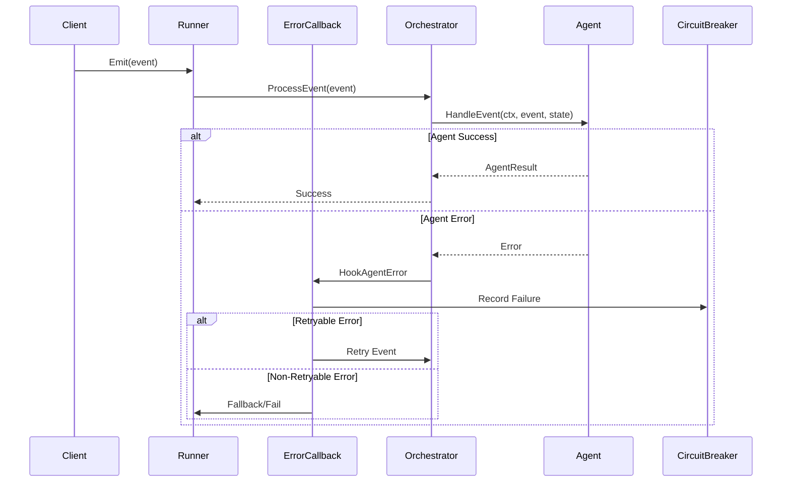

# Error Handling and Recovery

Robust error handling is critical for building reliable multi-agent systems. This tutorial explores AgenticGoKit's comprehensive error handling mechanisms, recovery strategies, and best practices for building fault-tolerant agent workflows.

Understanding error handling is essential because agent systems involve multiple components, network calls, and complex interactions where failures can occur at any point in the processing pipeline.

## Prerequisites

- Understanding of [Message Passing and Event Flow](./message-passing.md)
- Knowledge of [State Management](./state-management.md)
- Familiarity with [Orchestration Patterns](./orchestration-patterns.md)
- Basic understanding of Go error handling patterns

## Learning Objectives

By the end of this tutorial, you'll understand:
- AgenticGoKit's error classification and handling system
- Current error callback registration and hook patterns
- Retry mechanisms and circuit breaker implementations
- Graceful degradation and recovery strategies
- Error monitoring and observability patterns

## Error Handling Architecture

### Error Types in AgenticGoKit

AgenticGoKit handles several categories of errors with specific patterns:

1. **Agent Execution Errors**: Failures during agent processing and LLM interactions
2. **Orchestration Errors**: Issues with multi-agent coordination and routing
3. **Communication Errors**: Problems with event routing and message passing
4. **Resource Errors**: Database, API, or external service failures
5. **Validation Errors**: Invalid input, configuration, or state validation failures
6. **Timeout Errors**: Processing timeouts and deadline exceeded errors

### Current Error Flow Architecture



### Error Classification System

AgenticGoKit uses a sophisticated error classification system:

```go
// Error types from core/error_handling.go
type ErrorType string

const (
    ErrorTypeTransient   ErrorType = "transient"   // Temporary, retryable
    ErrorTypePermanent   ErrorType = "permanent"   // Permanent, don't retry
    ErrorTypeResource    ErrorType = "resource"    // Resource exhaustion
    ErrorTypeValidation  ErrorType = "validation"  // Input validation
    ErrorTypeSecurity    ErrorType = "security"    // Authentication/authorization
    ErrorTypeTimeout     ErrorType = "timeout"     // Timeout/deadline
    ErrorTypeCircuit     ErrorType = "circuit"     // Circuit breaker open
)

// Error classification function
func ClassifyError(err error) ErrorType {
    if err == nil {
        return ""
    }
    
    errStr := strings.ToLower(err.Error())
    
    switch {
    case strings.Contains(errStr, "timeout"), strings.Contains(errStr, "deadline"):
        return ErrorTypeTimeout
    case strings.Contains(errStr, "connection"), strings.Contains(errStr, "network"):
        return ErrorTypeTransient
    case strings.Contains(errStr, "rate limit"), strings.Contains(errStr, "quota"):
        return ErrorTypeResource
    case strings.Contains(errStr, "validation"), strings.Contains(errStr, "invalid"):
        return ErrorTypeValidation
    case strings.Contains(errStr, "unauthorized"), strings.Contains(errStr, "forbidden"):
        return ErrorTypeSecurity
    case strings.Contains(errStr, "circuit"), strings.Contains(errStr, "breaker"):
        return ErrorTypeCircuit
    default:
        return ErrorTypePermanent
    }
}
```

## Error Handling Mechanisms

### 1. Agent-Level Error Handling

Agents return errors through the current `AgentResult` interface:

```go
// Current AgentHandler interface
type AgentHandler interface {
    HandleEvent(ctx context.Context, event Event, state State) (AgentResult, error)
}

// Example agent with comprehensive error handling
func createRobustAgent() core.AgentHandler {
    return core.AgentHandlerFunc(
        func(ctx context.Context, event core.Event, state core.State) (core.AgentResult, error) {
            startTime := time.Now()
            
            // Input validation with detailed errors
            if err := validateInput(event, state); err != nil {
                return core.AgentResult{
                    StartTime: startTime,
                    EndTime:   time.Now(),
                    Duration:  time.Since(startTime),
                }, fmt.Errorf("input validation failed: %w", err)
            }
            
            // Process with timeout and error handling
            result, err := processWithTimeout(ctx, event.GetData())
            if err != nil {
                // Classify error for proper handling
                errorType := ClassifyError(err)
                
                core.Logger().Error().
                    Str("agent", "robust_agent").
                    Str("event_id", event.GetID()).
                    Str("error_type", string(errorType)).
                    Err(err).
                    Msg("Agent processing failed")
                
                return core.AgentResult{
                    StartTime: startTime,
                    EndTime:   time.Now(),
                    Duration:  time.Since(startTime),
                }, fmt.Errorf("processing failed (%s): %w", errorType, err)
            }
            
            // Success case with result state
            outputState := state.Clone()
            outputState.Set("result", result)
            outputState.Set("processed_at", time.Now().Unix())
            outputState.SetMeta("processing_duration", time.Since(startTime).String())
            
            return core.AgentResult{
                OutputState: outputState,
                StartTime:   startTime,
                EndTime:     time.Now(),
                Duration:    time.Since(startTime),
            }, nil
        })
}

func validateInput(event core.Event, state core.State) error {
    data := event.GetData()
    
    // Check required fields
    requiredFields := []string{"task", "input"}
    for _, field := range requiredFields {
        if _, exists := data[field]; !exists {
            return fmt.Errorf("missing required field: %s", field)
        }
    }
    
    // Validate data types
    if task, ok := data["task"].(string); !ok || task == "" {
        return fmt.Errorf("task must be a non-empty string")
    }
    
    return nil
}

func processWithTimeout(ctx context.Context, data core.EventData) (interface{}, error) {
    // Create timeout context
    ctx, cancel := context.WithTimeout(ctx, 30*time.Second)
    defer cancel()
    
    // Simulate processing
    select {
    case <-time.After(1 * time.Second):
        return fmt.Sprintf("Processed: %v", data["input"]), nil
    case <-ctx.Done():
        return nil, fmt.Errorf("processing timeout: %w", ctx.Err())
    }
}
```

### 2. Error Hooks and Callbacks

AgenticGoKit provides comprehensive hooks for intercepting and handling errors:

::: code-group

```go [Error Callback Registration]
func setupErrorHandling(runner core.Runner) {
    // Register comprehensive error handler
    runner.RegisterCallback(core.HookAgentError, "comprehensive-error-handler",
        func(ctx context.Context, args core.CallbackArgs) (core.State, error) {
            // Classify the error
            errorType := ClassifyError(args.Error)
            
            // Log error with context
            core.Logger().Error().
                Str("agent", args.AgentID).
                Str("event_id", args.Event.GetID()).
                Str("session_id", args.Event.GetSessionID()).
                Str("error_type", string(errorType)).
                Err(args.Error).
                Msg("Agent execution failed")
            
            // Handle based on error type
            switch errorType {
            case ErrorTypeTransient:
                return handleTransientError(ctx, args)
            case ErrorTypeResource:
                return handleResourceError(ctx, args)
            case ErrorTypeTimeout:
                return handleTimeoutError(ctx, args)
            case ErrorTypeValidation:
                return handleValidationError(ctx, args)
            default:
                return handlePermanentError(ctx, args)
            }
        })
    
    // Register retry mechanism
    runner.RegisterCallback(core.HookAgentError, "retry-handler",
        func(ctx context.Context, args core.CallbackArgs) (core.State, error) {
            return handleRetryLogic(ctx, args, runner)
        })
    
    // Register circuit breaker
    runner.RegisterCallback(core.HookAgentError, "circuit-breaker",
        func(ctx context.Context, args core.CallbackArgs) (core.State, error) {
            return handleCircuitBreaker(ctx, args)
        })
}
```

```go [Error Handler Implementations]
func handleTransientError(ctx context.Context, args core.CallbackArgs) (core.State, error) {
    // Add retry metadata to state
    errorState := args.State.Clone()
    errorState.SetMeta("error_type", "transient")
    errorState.SetMeta("retry_eligible", "true")
    errorState.SetMeta("error_message", args.Error.Error())
    
    core.Logger().Warn().
        Str("agent", args.AgentID).
        Str("event_id", args.Event.GetID()).
        Msg("Transient error detected, marking for retry")
    
    return errorState, nil
}

func handleResourceError(ctx context.Context, args core.CallbackArgs) (core.State, error) {
    // Implement backoff for resource errors
    errorState := args.State.Clone()
    errorState.SetMeta("error_type", "resource")
    errorState.SetMeta("backoff_required", "true")
    errorState.SetMeta("backoff_duration", "5s")
    
    core.Logger().Warn().
        Str("agent", args.AgentID).
        Msg("Resource error detected, implementing backoff")
    
    return errorState, nil
}

func handleTimeoutError(ctx context.Context, args core.CallbackArgs) (core.State, error) {
    // Handle timeout with potential retry
    errorState := args.State.Clone()
    errorState.SetMeta("error_type", "timeout")
    errorState.SetMeta("timeout_retry", "true")
    
    // Increase timeout for retry
    currentTimeout := 30 * time.Second
    if timeoutStr, exists := args.Event.GetMetadata()["timeout"]; exists {
        if duration, err := time.ParseDuration(timeoutStr); err == nil {
            currentTimeout = duration
        }
    }
    
    newTimeout := currentTimeout * 2 // Double the timeout
    errorState.SetMeta("retry_timeout", newTimeout.String())
    
    core.Logger().Warn().
        Str("agent", args.AgentID).
        Dur("original_timeout", currentTimeout).
        Dur("retry_timeout", newTimeout).
        Msg("Timeout error, increasing timeout for retry")
    
    return errorState, nil
}

func handleValidationError(ctx context.Context, args core.CallbackArgs) (core.State, error) {
    // Validation errors are typically not retryable
    errorState := args.State.Clone()
    errorState.SetMeta("error_type", "validation")
    errorState.SetMeta("retry_eligible", "false")
    errorState.Set("validation_failed", true)
    
    core.Logger().Error().
        Str("agent", args.AgentID).
        Str("event_id", args.Event.GetID()).
        Msg("Validation error - not retryable")
    
    return errorState, fmt.Errorf("validation error: %w", args.Error)
}

func handlePermanentError(ctx context.Context, args core.CallbackArgs) (core.State, error) {
    // Permanent errors should not be retried
    errorState := args.State.Clone()
    errorState.SetMeta("error_type", "permanent")
    errorState.SetMeta("retry_eligible", "false")
    errorState.Set("permanent_failure", true)
    
    core.Logger().Error().
        Str("agent", args.AgentID).
        Str("event_id", args.Event.GetID()).
        Msg("Permanent error - terminating processing")
    
    return errorState, fmt.Errorf("permanent error: %w", args.Error)
}
```

:::

### 3. Advanced Error Routing and Recovery

Implement sophisticated error routing with the current API:

```go
func handleRetryLogic(ctx context.Context, args core.CallbackArgs, runner core.Runner) (core.State, error) {
    // Get retry count from event metadata
    retryCount := 0
    if countStr, exists := args.Event.GetMetadata()["retry_count"]; exists {
        if count, err := strconv.Atoi(countStr); err == nil {
            retryCount = count
        }
    }
    
    // Check if error is retryable and within limits
    errorType := ClassifyError(args.Error)
    maxRetries := getMaxRetries(errorType)
    
    if retryCount < maxRetries && isRetryableError(errorType) {
        // Create retry event
        retryEvent := createRetryEvent(args.Event, retryCount+1, errorType)
        
        // Calculate backoff delay
        backoffDelay := calculateBackoff(retryCount, errorType)
        
        core.Logger().Info().
            Str("agent", args.AgentID).
            Str("event_id", args.Event.GetID()).
            Int("retry_count", retryCount+1).
            Int("max_retries", maxRetries).
            Dur("backoff_delay", backoffDelay).
            Msg("Scheduling retry")
        
        // Schedule retry with backoff
        go func() {
            time.Sleep(backoffDelay)
            if err := runner.Emit(retryEvent); err != nil {
                core.Logger().Error().
                    Str("original_event_id", args.Event.GetID()).
                    Err(err).
                    Msg("Failed to emit retry event")
            }
        }()
        
        // Return state with retry information
        retryState := args.State.Clone()
        retryState.SetMeta("retry_scheduled", "true")
        retryState.SetMeta("retry_count", strconv.Itoa(retryCount+1))
        retryState.SetMeta("backoff_delay", backoffDelay.String())
        
        return retryState, nil
    }
    
    // Max retries exceeded or non-retryable error
    core.Logger().Error().
        Str("agent", args.AgentID).
        Str("event_id", args.Event.GetID()).
        Int("retry_count", retryCount).
        Int("max_retries", maxRetries).
        Bool("retryable", isRetryableError(errorType)).
        Msg("Retry limit exceeded or non-retryable error")
    
    return args.State, fmt.Errorf("retry limit exceeded: %w", args.Error)
}

func getMaxRetries(errorType ErrorType) int {
    switch errorType {
    case ErrorTypeTransient:
        return 3
    case ErrorTypeTimeout:
        return 2
    case ErrorTypeResource:
        return 5
    default:
        return 0 // No retries for other types
    }
}

func isRetryableError(errorType ErrorType) bool {
    switch errorType {
    case ErrorTypeTransient, ErrorTypeTimeout, ErrorTypeResource:
        return true
    default:
        return false
    }
}

func calculateBackoff(retryCount int, errorType ErrorType) time.Duration {
    baseDelay := time.Second
    
    switch errorType {
    case ErrorTypeResource:
        baseDelay = 5 * time.Second // Longer delay for resource errors
    case ErrorTypeTimeout:
        baseDelay = 2 * time.Second
    }
    
    // Exponential backoff with jitter
    backoff := baseDelay * time.Duration(1<<uint(retryCount))
    jitter := time.Duration(rand.Intn(1000)) * time.Millisecond
    
    return backoff + jitter
}

func createRetryEvent(originalEvent core.Event, retryCount int, errorType ErrorType) core.Event {
    // Copy original metadata and add retry information
    metadata := make(map[string]string)
    for k, v := range originalEvent.GetMetadata() {
        metadata[k] = v
    }
    
    metadata["retry_count"] = strconv.Itoa(retryCount)
    metadata["is_retry"] = "true"
    metadata["original_event_id"] = originalEvent.GetID()
    metadata["error_type"] = string(errorType)
    metadata["retry_timestamp"] = time.Now().Format(time.RFC3339)
    
    // Adjust timeout for retry if needed
    if errorType == ErrorTypeTimeout {
        if timeoutStr, exists := metadata["timeout"]; exists {
            if duration, err := time.ParseDuration(timeoutStr); err == nil {
                newTimeout := duration * 2
                metadata["timeout"] = newTimeout.String()
            }
        }
    }
    
    return core.NewEvent(
        originalEvent.GetTargetAgentID(),
        originalEvent.GetData(),
        metadata,
    )
}
```

## Error Recovery Strategies

### 1. Retry Mechanisms

Implement automatic retry for transient failures:

```go
type RetryableAgent struct {
    baseAgent Agent
    maxRetries int
    retryDelay time.Duration
}

func (r *RetryableAgent) Run(ctx context.Context, event Event, state State) (AgentResult, error) {
    var lastErr error
    
    for attempt := 0; attempt <= r.maxRetries; attempt++ {
        if attempt > 0 {
            // Wait before retry
            select {
            case <-time.After(r.retryDelay):
            case <-ctx.Done():
                return AgentResult{}, ctx.Err()
            }
        }
        
        result, err := r.baseAgent.Run(ctx, event, state)
        if err == nil {
            return result, nil
        }
        
        lastErr = err
        
        // Check if error is retryable
        if !isRetryableError(err) {
            break
        }
        
        fmt.Printf("Attempt %d failed, retrying: %v\n", attempt+1, err)
    }
    
    return AgentResult{
        Error: fmt.Sprintf("failed after %d attempts: %v", r.maxRetries+1, lastErr),
    }, lastErr
}

func isRetryableError(err error) bool {
    // Define which errors are worth retrying
    return strings.Contains(err.Error(), "timeout") ||
           strings.Contains(err.Error(), "connection") ||
           strings.Contains(err.Error(), "rate limit")
}
```

### 2. Circuit Breaker Pattern

Prevent cascading failures with circuit breakers:

```go
type CircuitBreakerAgent struct {
    baseAgent Agent
    breaker   *CircuitBreaker
}

type CircuitBreaker struct {
    maxFailures int
    resetTimeout time.Duration
    state       CircuitState
    failures    int
    lastFailure time.Time
    mu          sync.RWMutex
}

type CircuitState int

const (
    CircuitClosed CircuitState = iota
    CircuitOpen
    CircuitHalfOpen
)

func (cb *CircuitBreaker) Call(fn func() error) error {
    cb.mu.Lock()
    defer cb.mu.Unlock()
    
    // Check if circuit should reset
    if cb.state == CircuitOpen && time.Since(cb.lastFailure) > cb.resetTimeout {
        cb.state = CircuitHalfOpen
        cb.failures = 0
    }
    
    // Reject if circuit is open
    if cb.state == CircuitOpen {
        return errors.New("circuit breaker is open")
    }
    
    // Execute function
    err := fn()
    
    if err != nil {
        cb.failures++
        cb.lastFailure = time.Now()
        
        if cb.failures >= cb.maxFailures {
            cb.state = CircuitOpen
        }
        return err
    }
    
    // Success - reset circuit
    cb.failures = 0
    cb.state = CircuitClosed
    return nil
}

func (cba *CircuitBreakerAgent) Run(ctx context.Context, event Event, state State) (AgentResult, error) {
    var result AgentResult
    var err error
    
    breakerErr := cba.breaker.Call(func() error {
        result, err = cba.baseAgent.Run(ctx, event, state)
        return err
    })
    
    if breakerErr != nil {
        return AgentResult{
            Error: fmt.Sprintf("circuit breaker: %v", breakerErr),
        }, breakerErr
    }
    
    return result, err
}
```

### 3. Fallback Agents

Implement fallback mechanisms for critical failures:

```go
type FallbackAgent struct {
    primaryAgent   Agent
    fallbackAgent  Agent
    fallbackTrigger func(error) bool
}

func (f *FallbackAgent) Run(ctx context.Context, event Event, state State) (AgentResult, error) {
    // Try primary agent first
    result, err := f.primaryAgent.Run(ctx, event, state)
    
    // If primary succeeds, return result
    if err == nil {
        return result, nil
    }
    
    // Check if we should use fallback
    if !f.fallbackTrigger(err) {
        return result, err
    }
    
    fmt.Printf("Primary agent failed, using fallback: %v\n", err)
    
    // Try fallback agent
    fallbackResult, fallbackErr := f.fallbackAgent.Run(ctx, event, state)
    
    if fallbackErr != nil {
        // Both failed - return combined error
        return AgentResult{
            Error: fmt.Sprintf("primary failed: %v, fallback failed: %v", err, fallbackErr),
        }, fmt.Errorf("both primary and fallback failed: %v, %v", err, fallbackErr)
    }
    
    // Mark result as from fallback
    if fallbackResult.OutputState != nil {
        fallbackResult.OutputState.SetMeta("fallback_used", "true")
        fallbackResult.OutputState.SetMeta("primary_error", err.Error())
    }
    
    return fallbackResult, nil
}
```

## Error Handling in Different Orchestration Patterns

### 1. Route Orchestration Error Handling

```go
// Route orchestrator with error handling
func (o *RouteOrchestrator) Dispatch(ctx context.Context, event Event) (AgentResult, error) {
    targetName, ok := event.GetMetadataValue(RouteMetadataKey)
    if !ok {
        return o.handleRoutingError(event, errors.New("missing route metadata"))
    }
    
    handler, exists := o.handlers[targetName]
    if !exists {
        return o.handleRoutingError(event, fmt.Errorf("agent not found: %s", targetName))
    }
    
    // Execute with timeout
    ctx, cancel := context.WithTimeout(ctx, 30*time.Second)
    defer cancel()
    
    result, err := handler.Run(ctx, event, core.NewState())
    if err != nil {
        return o.handleAgentError(event, targetName, err)
    }
    
    return result, nil
}

func (o *RouteOrchestrator) handleRoutingError(event Event, err error) (AgentResult, error) {
    // Create error event
    errorEvent := core.NewEvent(
        "error-handler",
        core.EventData{
            "error_type": "routing_error",
            "error_message": err.Error(),
            "original_event": event,
        },
        map[string]string{
            "route": "error-handler",
            "session_id": event.GetSessionID(),
        },
    )
    
    // Emit error event if emitter is available
    if o.emitter != nil {
        o.emitter.Emit(errorEvent)
    }
    
    return AgentResult{
        Error: err.Error(),
    }, err
}
```

### 2. Collaborative Orchestration Error Handling

```go
// Collaborative orchestrator with partial failure handling
func (o *CollaborativeOrchestrator) Dispatch(ctx context.Context, event Event) (AgentResult, error) {
    var wg sync.WaitGroup
    results := make([]AgentResult, 0)
    errors := make([]error, 0)
    mu := &sync.Mutex{}
    
    // Execute all agents
    for name, handler := range o.handlers {
        wg.Add(1)
        go func(agentName string, agentHandler AgentHandler) {
            defer wg.Done()
            
            result, err := agentHandler.Run(ctx, event, core.NewState())
            
            mu.Lock()
            if err != nil {
                errors = append(errors, fmt.Errorf("agent %s: %w", agentName, err))
            } else {
                results = append(results, result)
            }
            mu.Unlock()
        }(name, handler)
    }
    
    wg.Wait()
    
    // Handle partial failures
    totalAgents := len(o.handlers)
    successCount := len(results)
    failureCount := len(errors)
    
    // Check if we have enough successes
    successThreshold := 0.5 // At least 50% must succeed
    if float64(successCount)/float64(totalAgents) < successThreshold {
        return AgentResult{
            Error: fmt.Sprintf("insufficient successes: %d/%d agents failed", failureCount, totalAgents),
        }, fmt.Errorf("collaborative orchestration failed: %v", errors)
    }
    
    // Combine successful results
    combinedResult := o.combineResults(results)
    
    // Add failure information to metadata
    if len(errors) > 0 {
        if combinedResult.OutputState != nil {
            combinedResult.OutputState.SetMeta("partial_failures", fmt.Sprintf("%d", failureCount))
            combinedResult.OutputState.SetMeta("success_rate", fmt.Sprintf("%.2f", float64(successCount)/float64(totalAgents)))
        }
    }
    
    return combinedResult, nil
}
```

### 3. Sequential Orchestration Error Handling

```go
// Sequential orchestrator with rollback capability
func (o *SequentialOrchestrator) Dispatch(ctx context.Context, event Event) (AgentResult, error) {
    currentState := core.NewState()
    completedStages := make([]string, 0)
    
    // Merge event data
    for key, value := range event.GetData() {
        currentState.Set(key, value)
    }
    
    // Process through sequence
    for i, agentName := range o.sequence {
        handler, exists := o.handlers[agentName]
        if !exists {
            return o.rollback(completedStages, fmt.Errorf("agent %s not found", agentName))
        }
        
        // Create stage event
        stageEvent := core.NewEvent(agentName, currentState.GetAll(), event.GetMetadata())
        
        // Execute with timeout
        stageCtx, cancel := context.WithTimeout(ctx, 60*time.Second)
        result, err := handler.Run(stageCtx, stageEvent, currentState)
        cancel()
        
        if err != nil {
            return o.rollback(completedStages, fmt.Errorf("stage %d (%s) failed: %w", i+1, agentName, err))
        }
        
        // Update state and track completion
        if result.OutputState != nil {
            currentState = result.OutputState
        }
        completedStages = append(completedStages, agentName)
        
        fmt.Printf("Stage %d (%s) completed successfully\n", i+1, agentName)
    }
    
    return AgentResult{OutputState: currentState}, nil
}

func (o *SequentialOrchestrator) rollback(completedStages []string, err error) (AgentResult, error) {
    fmt.Printf("Rolling back %d completed stages due to error: %v\n", len(completedStages), err)
    
    // Execute rollback in reverse order
    for i := len(completedStages) - 1; i >= 0; i-- {
        stageName := completedStages[i]
        if rollbackHandler, exists := o.rollbackHandlers[stageName]; exists {
            rollbackCtx, cancel := context.WithTimeout(context.Background(), 30*time.Second)
            rollbackHandler.Rollback(rollbackCtx, stageName)
            cancel()
        }
    }
    
    return AgentResult{
        Error: fmt.Sprintf("sequential processing failed: %v", err),
    }, err
}
```

## Error Monitoring and Observability

### 1. Error Metrics Collection

```go
type ErrorMetrics struct {
    errorCounts    map[string]int64
    errorRates     map[string]float64
    lastErrors     map[string]time.Time
    mu             sync.RWMutex
}

func (em *ErrorMetrics) RecordError(agentID string, errorType string) {
    em.mu.Lock()
    defer em.mu.Unlock()
    
    key := fmt.Sprintf("%s:%s", agentID, errorType)
    em.errorCounts[key]++
    em.lastErrors[key] = time.Now()
    
    // Calculate error rate (errors per minute)
    em.calculateErrorRate(key)
}

func (em *ErrorMetrics) calculateErrorRate(key string) {
    // Implementation for calculating error rates
    // This would typically involve time windows and moving averages
}

// Register error metrics callback
runner.RegisterCallback(core.HookAgentError, "metrics-collector",
    func(ctx context.Context, args core.CallbackArgs) (core.State, error) {
        errorType := classifyError(args.Error)
        errorMetrics.RecordError(args.AgentID, errorType)
        return args.State, nil
    },
)
```

### 2. Error Alerting

```go
type ErrorAlerter struct {
    thresholds map[string]AlertThreshold
    notifier   Notifier
}

type AlertThreshold struct {
    ErrorRate    float64       // Errors per minute
    TimeWindow   time.Duration // Time window for rate calculation
    Cooldown     time.Duration // Minimum time between alerts
}

func (ea *ErrorAlerter) CheckThresholds(agentID string, errorRate float64) {
    threshold, exists := ea.thresholds[agentID]
    if !exists {
        return
    }
    
    if errorRate > threshold.ErrorRate {
        alert := Alert{
            AgentID:   agentID,
            ErrorRate: errorRate,
            Threshold: threshold.ErrorRate,
            Timestamp: time.Now(),
        }
        
        ea.notifier.SendAlert(alert)
    }
}
```

### 3. Error Logging and Tracing

```go
type ErrorLogger struct {
    logger *log.Logger
    tracer trace.Tracer
}

func (el *ErrorLogger) LogError(ctx context.Context, agentID string, err error, event Event) {
    // Create span for error
    ctx, span := el.tracer.Start(ctx, "agent_error")
    defer span.End()
    
    // Add error attributes
    span.SetAttributes(
        attribute.String("agent.id", agentID),
        attribute.String("error.message", err.Error()),
        attribute.String("event.id", event.GetID()),
    )
    
    // Log structured error
    el.logger.Printf("AGENT_ERROR agent=%s event=%s error=%v", 
        agentID, event.GetID(), err)
    
    // Record error in span
    span.RecordError(err)
}
```

## Testing Error Scenarios

### 1. Error Injection for Testing

```go
type ErrorInjectingAgent struct {
    baseAgent     Agent
    errorRate     float64 // 0.0 to 1.0
    errorTypes    []error
    random        *rand.Rand
}

func (eia *ErrorInjectingAgent) Run(ctx context.Context, event Event, state State) (AgentResult, error) {
    // Inject errors based on configured rate
    if eia.random.Float64() < eia.errorRate {
        errorIndex := eia.random.Intn(len(eia.errorTypes))
        injectedError := eia.errorTypes[errorIndex]
        
        return AgentResult{
            Error: fmt.Sprintf("injected error: %v", injectedError),
        }, injectedError
    }
    
    // Normal execution
    return eia.baseAgent.Run(ctx, event, state)
}
```

### 2. Error Scenario Testing

```go
func TestErrorRecovery(t *testing.T) {
    // Create agent that fails first time, succeeds second time
    failingAgent := &FailingAgent{failCount: 1}
    retryAgent := &RetryableAgent{
        baseAgent:  failingAgent,
        maxRetries: 2,
        retryDelay: time.Millisecond * 100,
    }
    
    // Test retry mechanism
    event := core.NewEvent("test", core.EventData{"test": "data"}, nil)
    result, err := retryAgent.Run(context.Background(), event, core.NewState())
    
    assert.NoError(t, err)
    assert.NotEmpty(t, result.OutputState)
}

func TestCircuitBreaker(t *testing.T) {
    // Create agent that always fails
    alwaysFailingAgent := &AlwaysFailingAgent{}
    circuitAgent := &CircuitBreakerAgent{
        baseAgent: alwaysFailingAgent,
        breaker: &CircuitBreaker{
            maxFailures:  3,
            resetTimeout: time.Second,
        },
    }
    
    // Test that circuit opens after max failures
    for i := 0; i < 5; i++ {
        _, err := circuitAgent.Run(context.Background(), event, core.NewState())
        if i < 3 {
            assert.Contains(t, err.Error(), "always fails")
        } else {
            assert.Contains(t, err.Error(), "circuit breaker is open")
        }
    }
}
```

## Best Practices for Error Handling

### 1. Error Classification

```go
type ErrorClass int

const (
    ErrorClassTransient ErrorClass = iota // Temporary, retry-able
    ErrorClassPermanent                   // Permanent, don't retry
    ErrorClassResource                    // Resource exhaustion
    ErrorClassValidation                  // Input validation
    ErrorClassSecurity                    // Security/auth issues
)

func ClassifyError(err error) ErrorClass {
    errStr := strings.ToLower(err.Error())
    
    switch {
    case strings.Contains(errStr, "timeout"):
        return ErrorClassTransient
    case strings.Contains(errStr, "connection"):
        return ErrorClassTransient
    case strings.Contains(errStr, "rate limit"):
        return ErrorClassResource
    case strings.Contains(errStr, "validation"):
        return ErrorClassValidation
    case strings.Contains(errStr, "unauthorized"):
        return ErrorClassSecurity
    default:
        return ErrorClassPermanent
    }
}
```

### 2. Graceful Degradation

```go
type GracefulAgent struct {
    primaryAgent   Agent
    degradedMode   Agent
    healthChecker  HealthChecker
}

func (ga *GracefulAgent) Run(ctx context.Context, event Event, state State) (AgentResult, error) {
    // Check if we should use degraded mode
    if !ga.healthChecker.IsHealthy() {
        fmt.Println("Using degraded mode due to health issues")
        result, err := ga.degradedMode.Run(ctx, event, state)
        if err == nil && result.OutputState != nil {
            result.OutputState.SetMeta("degraded_mode", "true")
        }
        return result, err
    }
    
    // Try primary agent
    result, err := ga.primaryAgent.Run(ctx, event, state)
    if err != nil {
        // Mark as unhealthy and try degraded mode
        ga.healthChecker.MarkUnhealthy()
        return ga.degradedMode.Run(ctx, event, state)
    }
    
    return result, nil
}
```

### 3. Error Context Preservation

```go
type ContextualError struct {
    Err       error
    AgentID   string
    EventID   string
    SessionID string
    Timestamp time.Time
    Context   map[string]interface{}
}

func (ce *ContextualError) Error() string {
    return fmt.Sprintf("agent=%s event=%s session=%s: %v", 
        ce.AgentID, ce.EventID, ce.SessionID, ce.Err)
}

func WrapError(err error, agentID string, event Event) error {
    return &ContextualError{
        Err:       err,
        AgentID:   agentID,
        EventID:   event.GetID(),
        SessionID: event.GetSessionID(),
        Timestamp: time.Now(),
        Context:   make(map[string]interface{}),
    }
}
```

## Common Error Patterns and Solutions

### 1. Timeout Handling

```go
func WithTimeout(agent Agent, timeout time.Duration) Agent {
    return AgentFunc(func(ctx context.Context, event Event, state State) (AgentResult, error) {
        ctx, cancel := context.WithTimeout(ctx, timeout)
        defer cancel()
        
        done := make(chan struct{})
        var result AgentResult
        var err error
        
        go func() {
            result, err = agent.Run(ctx, event, state)
            close(done)
        }()
        
        select {
        case <-done:
            return result, err
        case <-ctx.Done():
            return AgentResult{
                Error: fmt.Sprintf("agent timeout after %v", timeout),
            }, ctx.Err()
        }
    })
}
```

### 2. Resource Exhaustion Handling

```go
type ResourceLimitedAgent struct {
    baseAgent Agent
    semaphore chan struct{}
}

func NewResourceLimitedAgent(agent Agent, maxConcurrency int) *ResourceLimitedAgent {
    return &ResourceLimitedAgent{
        baseAgent: agent,
        semaphore: make(chan struct{}, maxConcurrency),
    }
}

func (rla *ResourceLimitedAgent) Run(ctx context.Context, event Event, state State) (AgentResult, error) {
    // Acquire resource
    select {
    case rla.semaphore <- struct{}{}:
        defer func() { <-rla.semaphore }()
    case <-ctx.Done():
        return AgentResult{
            Error: "resource acquisition timeout",
        }, ctx.Err()
    }
    
    return rla.baseAgent.Run(ctx, event, state)
}
```

## Conclusion

Effective error handling is crucial for building robust multi-agent systems. AgenticGoKit provides comprehensive error handling mechanisms including hooks, routing, recovery strategies, and monitoring capabilities.

Key takeaways:
- **Classify errors** appropriately for proper handling
- **Implement retry mechanisms** for transient failures
- **Use circuit breakers** to prevent cascading failures
- **Provide fallback options** for critical functionality
- **Monitor and alert** on error patterns
- **Test error scenarios** thoroughly
- **Preserve error context** for debugging

## Next Steps

- [Memory Systems](../memory-systems/README.md) - Learn about persistent storage and RAG
- [Debugging Guide](../debugging/README.md) - Advanced debugging techniques
- [Performance Optimization](../advanced/README.md) - Optimize agent performance
- [Production Deployment](../../guides/deployment/README.md) - Deploy with proper error handling

## Further Reading

- [API Reference: Error Handling](../../reference/api/agent.md#error-handling)
- [Examples: Error Recovery Patterns](../../examples/)
- [Configuration Guide: Error Settings](../../reference/api/configuration.md)
## Recovery Strategies

### 1. Circuit Breaker Pattern

Implement circuit breakers to prevent cascading failures:

```go
// Circuit breaker implementation using core/error_handling.go patterns
type CircuitBreakerState int

const (
    CircuitClosed CircuitBreakerState = iota
    CircuitOpen
    CircuitHalfOpen
)

type CircuitBreaker struct {
    maxFailures   int
    resetTimeout  time.Duration
    state         CircuitBreakerState
    failures      int
    lastFailure   time.Time
    successCount  int
    mu            sync.RWMutex
}

func NewCircuitBreaker(maxFailures int, resetTimeout time.Duration) *CircuitBreaker {
    return &CircuitBreaker{
        maxFailures:  maxFailures,
        resetTimeout: resetTimeout,
        state:        CircuitClosed,
    }
}

func (cb *CircuitBreaker) Call(fn func() error) error {
    cb.mu.Lock()
    defer cb.mu.Unlock()
    
    // Check if circuit should reset to half-open
    if cb.state == CircuitOpen && time.Since(cb.lastFailure) > cb.resetTimeout {
        cb.state = CircuitHalfOpen
        cb.successCount = 0
        core.Logger().Info().Msg("Circuit breaker transitioning to half-open")
    }
    
    // Reject calls if circuit is open
    if cb.state == CircuitOpen {
        return fmt.Errorf("circuit breaker is open")
    }
    
    // Execute function
    err := fn()
    
    if err != nil {
        cb.recordFailure()
        return err
    }
    
    cb.recordSuccess()
    return nil
}

func (cb *CircuitBreaker) recordFailure() {
    cb.failures++
    cb.lastFailure = time.Now()
    
    if cb.failures >= cb.maxFailures {
        cb.state = CircuitOpen
        core.Logger().Warn().
            Int("failures", cb.failures).
            Int("max_failures", cb.maxFailures).
            Msg("Circuit breaker opened")
    }
}

func (cb *CircuitBreaker) recordSuccess() {
    if cb.state == CircuitHalfOpen {
        cb.successCount++
        if cb.successCount >= 3 { // Require 3 successes to close
            cb.state = CircuitClosed
            cb.failures = 0
            core.Logger().Info().Msg("Circuit breaker closed after successful recovery")
        }
    } else if cb.state == CircuitClosed {
        cb.failures = 0 // Reset failure count on success
    }
}

// Circuit breaker callback for AgenticGoKit
func handleCircuitBreaker(ctx context.Context, args core.CallbackArgs) (core.State, error) {
    // Get or create circuit breaker for this agent
    breaker := getCircuitBreaker(args.AgentID)
    
    // Record failure
    breaker.recordFailure()
    
    // Add circuit breaker state to result state
    errorState := args.State.Clone()
    errorState.SetMeta("circuit_breaker_state", string(breaker.state))
    errorState.SetMeta("circuit_failures", strconv.Itoa(breaker.failures))
    errorState.SetMeta("circuit_max_failures", strconv.Itoa(breaker.maxFailures))
    
    if breaker.state == CircuitOpen {
        errorState.SetMeta("circuit_open", "true")
        core.Logger().Warn().
            Str("agent", args.AgentID).
            Msg("Circuit breaker is open, rejecting requests")
    }
    
    return errorState, nil
}

// Global circuit breaker registry
var circuitBreakers = make(map[string]*CircuitBreaker)
var circuitBreakerMu sync.RWMutex

func getCircuitBreaker(agentID string) *CircuitBreaker {
    circuitBreakerMu.RLock()
    breaker, exists := circuitBreakers[agentID]
    circuitBreakerMu.RUnlock()
    
    if !exists {
        circuitBreakerMu.Lock()
        breaker = NewCircuitBreaker(5, 30*time.Second) // 5 failures, 30s reset
        circuitBreakers[agentID] = breaker
        circuitBreakerMu.Unlock()
    }
    
    return breaker
}
```

### 2. Fallback Mechanisms

Implement fallback agents for critical functionality:

```go
func setupFallbackHandling(runner core.Runner) {
    // Register fallback callback
    runner.RegisterCallback(core.HookAgentError, "fallback-handler",
        func(ctx context.Context, args core.CallbackArgs) (core.State, error) {
            // Check if fallback is available and appropriate
            if shouldUseFallback(args.AgentID, args.Error) {
                return triggerFallback(ctx, args, runner)
            }
            
            return args.State, nil
        })
}

func shouldUseFallback(agentID string, err error) bool {
    // Define fallback criteria
    fallbackAgents := map[string]bool{
        "critical-processor": true,
        "payment-handler":    true,
        "auth-validator":     true,
    }
    
    if !fallbackAgents[agentID] {
        return false
    }
    
    // Check error type
    errorType := ClassifyError(err)
    switch errorType {
    case ErrorTypePermanent, ErrorTypeTimeout, ErrorTypeCircuit:
        return true
    default:
        return false
    }
}

func triggerFallback(ctx context.Context, args core.CallbackArgs, runner core.Runner) (core.State, error) {
    // Define fallback mappings
    fallbackMap := map[string]string{
        "critical-processor": "simple-processor",
        "payment-handler":    "backup-payment-handler",
        "auth-validator":     "basic-auth-validator",
    }
    
    fallbackAgent, exists := fallbackMap[args.AgentID]
    if !exists {
        return args.State, fmt.Errorf("no fallback agent defined for %s", args.AgentID)
    }
    
    core.Logger().Warn().
        Str("original_agent", args.AgentID).
        Str("fallback_agent", fallbackAgent).
        Str("event_id", args.Event.GetID()).
        Msg("Triggering fallback agent")
    
    // Create fallback event
    fallbackEvent := core.NewEvent(
        fallbackAgent,
        args.Event.GetData(),
        map[string]string{
            "session_id":       args.Event.GetSessionID(),
            "original_agent":   args.AgentID,
            "fallback_trigger": "error",
            "original_error":   args.Error.Error(),
        },
    )
    
    // Emit fallback event
    go func() {
        if err := runner.Emit(fallbackEvent); err != nil {
            core.Logger().Error().
                Str("fallback_agent", fallbackAgent).
                Str("original_event_id", args.Event.GetID()).
                Err(err).
                Msg("Failed to emit fallback event")
        }
    }()
    
    // Update state with fallback information
    fallbackState := args.State.Clone()
    fallbackState.SetMeta("fallback_triggered", "true")
    fallbackState.SetMeta("fallback_agent", fallbackAgent)
    fallbackState.SetMeta("original_agent", args.AgentID)
    
    return fallbackState, nil
}
```

### 3. Graceful Degradation

Implement graceful degradation for non-critical features:

```go
func createGracefulAgent(primaryLogic, degradedLogic core.AgentHandler) core.AgentHandler {
    return core.AgentHandlerFunc(
        func(ctx context.Context, event core.Event, state core.State) (core.AgentResult, error) {
            startTime := time.Now()
            
            // Check system health and load
            if shouldUseDegradedMode(ctx, event) {
                core.Logger().Info().
                    Str("event_id", event.GetID()).
                    Msg("Using degraded mode due to system conditions")
                
                result, err := degradedLogic.HandleEvent(ctx, event, state)
                if err == nil && result.OutputState != nil {
                    result.OutputState.SetMeta("degraded_mode", "true")
                    result.OutputState.SetMeta("degradation_reason", "system_load")
                }
                return result, err
            }
            
            // Try primary logic with timeout
            primaryCtx, cancel := context.WithTimeout(ctx, 10*time.Second)
            defer cancel()
            
            result, err := primaryLogic.HandleEvent(primaryCtx, event, state)
            if err != nil {
                // Check if we should fall back to degraded mode
                if shouldFallbackToDegraded(err) {
                    core.Logger().Warn().
                        Str("event_id", event.GetID()).
                        Err(err).
                        Msg("Primary logic failed, falling back to degraded mode")
                    
                    degradedResult, degradedErr := degradedLogic.HandleEvent(ctx, event, state)
                    if degradedErr == nil && degradedResult.OutputState != nil {
                        degradedResult.OutputState.SetMeta("degraded_mode", "true")
                        degradedResult.OutputState.SetMeta("degradation_reason", "primary_failure")
                        degradedResult.OutputState.SetMeta("primary_error", err.Error())
                    }
                    return degradedResult, degradedErr
                }
                
                return result, err
            }
            
            return result, nil
        })
}

func shouldUseDegradedMode(ctx context.Context, event core.Event) bool {
    // Check system metrics
    cpuUsage := getCurrentCPUUsage()
    memoryUsage := getCurrentMemoryUsage()
    
    // Use degraded mode if system is under stress
    if cpuUsage > 80.0 || memoryUsage > 85.0 {
        return true
    }
    
    // Check if event has degradation hint
    if mode, exists := event.GetMetadata()["processing_mode"]; exists {
        return mode == "degraded" || mode == "fast"
    }
    
    return false
}

func shouldFallbackToDegraded(err error) bool {
    errorType := ClassifyError(err)
    switch errorType {
    case ErrorTypeTimeout, ErrorTypeResource:
        return true
    default:
        return false
    }
}

func getCurrentCPUUsage() float64 {
    // Implement CPU usage monitoring
    // This is a placeholder - use actual system monitoring
    return 50.0
}

func getCurrentMemoryUsage() float64 {
    // Implement memory usage monitoring
    // This is a placeholder - use actual system monitoring
    return 60.0
}
```

### 4. Dead Letter Queue Pattern

Implement dead letter queues for failed events:

```go
type DeadLetterQueue struct {
    events []DeadLetterEvent
    mu     sync.RWMutex
    maxSize int
}

type DeadLetterEvent struct {
    OriginalEvent core.Event
    FailureReason string
    FailureTime   time.Time
    RetryCount    int
    AgentID       string
    ErrorType     ErrorType
}

func NewDeadLetterQueue(maxSize int) *DeadLetterQueue {
    return &DeadLetterQueue{
        events:  make([]DeadLetterEvent, 0),
        maxSize: maxSize,
    }
}

func (dlq *DeadLetterQueue) AddEvent(event core.Event, agentID string, err error, retryCount int) {
    dlq.mu.Lock()
    defer dlq.mu.Unlock()
    
    deadEvent := DeadLetterEvent{
        OriginalEvent: event,
        FailureReason: err.Error(),
        FailureTime:   time.Now(),
        RetryCount:    retryCount,
        AgentID:       agentID,
        ErrorType:     ClassifyError(err),
    }
    
    // Add to queue
    dlq.events = append(dlq.events, deadEvent)
    
    // Maintain size limit
    if len(dlq.events) > dlq.maxSize {
        dlq.events = dlq.events[1:] // Remove oldest
    }
    
    core.Logger().Error().
        Str("agent", agentID).
        Str("event_id", event.GetID()).
        Str("error_type", string(deadEvent.ErrorType)).
        Int("retry_count", retryCount).
        Msg("Event added to dead letter queue")
}

func (dlq *DeadLetterQueue) GetEvents() []DeadLetterEvent {
    dlq.mu.RLock()
    defer dlq.mu.RUnlock()
    
    // Return copy to avoid race conditions
    events := make([]DeadLetterEvent, len(dlq.events))
    copy(events, dlq.events)
    return events
}

func (dlq *DeadLetterQueue) ProcessDeadLetters(runner core.Runner) {
    dlq.mu.Lock()
    defer dlq.mu.Unlock()
    
    processableEvents := make([]DeadLetterEvent, 0)
    remainingEvents := make([]DeadLetterEvent, 0)
    
    for _, deadEvent := range dlq.events {
        // Check if event can be reprocessed
        if canReprocess(deadEvent) {
            processableEvents = append(processableEvents, deadEvent)
        } else {
            remainingEvents = append(remainingEvents, deadEvent)
        }
    }
    
    dlq.events = remainingEvents
    
    // Reprocess eligible events
    for _, deadEvent := range processableEvents {
        go func(de DeadLetterEvent) {
            core.Logger().Info().
                Str("event_id", de.OriginalEvent.GetID()).
                Str("agent", de.AgentID).
                Msg("Reprocessing dead letter event")
            
            if err := runner.Emit(de.OriginalEvent); err != nil {
                core.Logger().Error().
                    Str("event_id", de.OriginalEvent.GetID()).
                    Err(err).
                    Msg("Failed to reprocess dead letter event")
            }
        }(deadEvent)
    }
}

func canReprocess(deadEvent DeadLetterEvent) bool {
    // Only reprocess transient errors after sufficient time
    if deadEvent.ErrorType != ErrorTypeTransient {
        return false
    }
    
    // Wait at least 5 minutes before reprocessing
    return time.Since(deadEvent.FailureTime) > 5*time.Minute
}

// Global dead letter queue
var globalDLQ = NewDeadLetterQueue(1000)

func setupDeadLetterQueue(runner core.Runner) {
    // Register DLQ callback
    runner.RegisterCallback(core.HookAgentError, "dead-letter-queue",
        func(ctx context.Context, args core.CallbackArgs) (core.State, error) {
            // Check if event should go to DLQ
            retryCount := getRetryCount(args.Event)
            maxRetries := getMaxRetries(ClassifyError(args.Error))
            
            if retryCount >= maxRetries {
                globalDLQ.AddEvent(args.Event, args.AgentID, args.Error, retryCount)
                
                dlqState := args.State.Clone()
                dlqState.SetMeta("dead_letter_queued", "true")
                dlqState.SetMeta("dlq_timestamp", time.Now().Format(time.RFC3339))
                
                return dlqState, nil
            }
            
            return args.State, nil
        })
    
    // Start DLQ processor
    go func() {
        ticker := time.NewTicker(5 * time.Minute)
        defer ticker.Stop()
        
        for range ticker.C {
            globalDLQ.ProcessDeadLetters(runner)
        }
    }()
}

func getRetryCount(event core.Event) int {
    if countStr, exists := event.GetMetadata()["retry_count"]; exists {
        if count, err := strconv.Atoi(countStr); err == nil {
            return count
        }
    }
    return 0
}
```

## Error Handling in Orchestration Patterns

### 1. Route Pattern Error Handling

```go
func setupRouteErrorHandling(runner core.Runner) {
    runner.RegisterCallback(core.HookAgentError, "route-error-handler",
        func(ctx context.Context, args core.CallbackArgs) (core.State, error) {
            // In route pattern, errors are isolated to individual agents
            core.Logger().Error().
                Str("agent", args.AgentID).
                Str("event_id", args.Event.GetID()).
                Err(args.Error).
                Msg("Route pattern agent error")
            
            // Check if there's an error handler agent
            if errorHandler := getErrorHandlerForAgent(args.AgentID); errorHandler != "" {
                errorEvent := core.NewEvent(errorHandler,
                    core.EventData{
                        "original_event": args.Event.GetData(),
                        "error_message": args.Error.Error(),
                        "failed_agent": args.AgentID,
                    },
                    map[string]string{
                        "session_id": args.Event.GetSessionID(),
                        "error_handling": "true",
                        "original_agent": args.AgentID,
                    })
                
                go func() {
                    if err := runner.Emit(errorEvent); err != nil {
                        core.Logger().Error().
                            Str("error_handler", errorHandler).
                            Err(err).
                            Msg("Failed to emit error handling event")
                    }
                }()
            }
            
            return args.State, nil
        })
}

func getErrorHandlerForAgent(agentID string) string {
    errorHandlers := map[string]string{
        "payment-processor": "payment-error-handler",
        "user-validator":    "validation-error-handler",
        "data-processor":    "data-error-handler",
    }
    
    return errorHandlers[agentID]
}
```

### 2. Collaborative Pattern Error Handling

```go
func setupCollaborativeErrorHandling(runner core.Runner) {
    runner.RegisterCallback(core.HookAgentError, "collaborative-error-handler",
        func(ctx context.Context, args core.CallbackArgs) (core.State, error) {
            // In collaborative pattern, track which agents failed
            errorState := args.State.Clone()
            errorState.SetMeta(fmt.Sprintf("%s_failed", args.AgentID), "true")
            errorState.SetMeta(fmt.Sprintf("%s_error", args.AgentID), args.Error.Error())
            
            // Check if we have enough successful agents
            collaborativeAgents := getCollaborativeAgents()
            failedAgents := countFailedAgents(errorState, collaborativeAgents)
            successThreshold := len(collaborativeAgents) / 2 // At least 50% must succeed
            
            if failedAgents > len(collaborativeAgents)-successThreshold {
                core.Logger().Error().
                    Int("failed_agents", failedAgents).
                    Int("total_agents", len(collaborativeAgents)).
                    Int("success_threshold", successThreshold).
                    Msg("Collaborative orchestration failure threshold exceeded")
                
                errorState.Set("collaborative_failure", true)
                return errorState, fmt.Errorf("collaborative orchestration failed: too many agent failures")
            }
            
            core.Logger().Warn().
                Str("failed_agent", args.AgentID).
                Int("failed_count", failedAgents).
                Int("total_agents", len(collaborativeAgents)).
                Msg("Collaborative agent failed, continuing with others")
            
            return errorState, nil
        })
}

func getCollaborativeAgents() []string {
    // This would typically come from configuration
    return []string{"analyzer", "validator", "processor", "enricher"}
}

func countFailedAgents(state core.State, agents []string) int {
    count := 0
    for _, agent := range agents {
        if failed, _ := state.GetMeta(fmt.Sprintf("%s_failed", agent)); failed == "true" {
            count++
        }
    }
    return count
}
```

### 3. Sequential Pattern Error Handling

```go
func setupSequentialErrorHandling(runner core.Runner) {
    runner.RegisterCallback(core.HookAgentError, "sequential-error-handler",
        func(ctx context.Context, args core.CallbackArgs) (core.State, error) {
            // In sequential pattern, failure stops the pipeline
            core.Logger().Error().
                Str("failed_stage", args.AgentID).
                Str("event_id", args.Event.GetID()).
                Err(args.Error).
                Msg("Sequential pipeline stage failed")
            
            // Mark pipeline as failed
            errorState := args.State.Clone()
            errorState.Set("pipeline_failed", true)
            errorState.Set("failed_stage", args.AgentID)
            errorState.SetMeta("pipeline_error", args.Error.Error())
            errorState.SetMeta("failure_timestamp", time.Now().Format(time.RFC3339))
            
            // Trigger rollback if configured
            if shouldRollback(args.AgentID) {
                triggerRollback(ctx, args, runner)
            }
            
            return errorState, fmt.Errorf("sequential pipeline failed at stage %s: %w", args.AgentID, args.Error)
        })
}

func shouldRollback(agentID string) bool {
    // Define which agents require rollback
    rollbackRequired := map[string]bool{
        "data-transformer": true,
        "state-updater":    true,
        "publisher":        true,
    }
    
    return rollbackRequired[agentID]
}

func triggerRollback(ctx context.Context, args core.CallbackArgs, runner core.Runner) {
    core.Logger().Info().
        Str("failed_stage", args.AgentID).
        Str("event_id", args.Event.GetID()).
        Msg("Triggering pipeline rollback")
    
    rollbackEvent := core.NewEvent("rollback-coordinator",
        core.EventData{
            "failed_stage":    args.AgentID,
            "original_event":  args.Event.GetData(),
            "rollback_reason": args.Error.Error(),
        },
        map[string]string{
            "session_id":      args.Event.GetSessionID(),
            "rollback":        "true",
            "failed_stage":    args.AgentID,
            "original_event_id": args.Event.GetID(),
        })
    
    go func() {
        if err := runner.Emit(rollbackEvent); err != nil {
            core.Logger().Error().
                Str("event_id", args.Event.GetID()).
                Err(err).
                Msg("Failed to emit rollback event")
        }
    }()
}
```## Er
ror Monitoring and Observability

### 1. Comprehensive Error Metrics

```go
type ErrorMetrics struct {
    errorCounts     map[string]*atomic.Int64
    errorRates      map[string]*RateCalculator
    lastErrors      map[string]time.Time
    errorsByType    map[ErrorType]*atomic.Int64
    mu              sync.RWMutex
}

type RateCalculator struct {
    events    []time.Time
    window    time.Duration
    mu        sync.Mutex
}

func NewErrorMetrics() *ErrorMetrics {
    return &ErrorMetrics{
        errorCounts:  make(map[string]*atomic.Int64),
        errorRates:   make(map[string]*RateCalculator),
        lastErrors:   make(map[string]time.Time),
        errorsByType: make(map[ErrorType]*atomic.Int64),
    }
}

func (em *ErrorMetrics) RecordError(agentID string, errorType ErrorType, err error) {
    em.mu.Lock()
    defer em.mu.Unlock()
    
    // Initialize counters if needed
    key := fmt.Sprintf("%s:%s", agentID, errorType)
    if em.errorCounts[key] == nil {
        em.errorCounts[key] = &atomic.Int64{}
    }
    if em.errorRates[key] == nil {
        em.errorRates[key] = &RateCalculator{
            window: 5 * time.Minute,
            events: make([]time.Time, 0),
        }
    }
    if em.errorsByType[errorType] == nil {
        em.errorsByType[errorType] = &atomic.Int64{}
    }
    
    // Record error
    em.errorCounts[key].Add(1)
    em.errorsByType[errorType].Add(1)
    em.lastErrors[key] = time.Now()
    em.errorRates[key].AddEvent(time.Now())
    
    // Log structured error
    core.Logger().Error().
        Str("agent", agentID).
        Str("error_type", string(errorType)).
        Err(err).
        Int64("total_count", em.errorCounts[key].Load()).
        Float64("rate_per_minute", em.errorRates[key].GetRate()).
        Msg("Error recorded")
}

func (rc *RateCalculator) AddEvent(timestamp time.Time) {
    rc.mu.Lock()
    defer rc.mu.Unlock()
    
    // Add new event
    rc.events = append(rc.events, timestamp)
    
    // Remove events outside window
    cutoff := timestamp.Add(-rc.window)
    validEvents := make([]time.Time, 0)
    for _, event := range rc.events {
        if event.After(cutoff) {
            validEvents = append(validEvents, event)
        }
    }
    rc.events = validEvents
}

func (rc *RateCalculator) GetRate() float64 {
    rc.mu.Lock()
    defer rc.mu.Unlock()
    
    if len(rc.events) == 0 {
        return 0.0
    }
    
    // Calculate events per minute
    windowMinutes := rc.window.Minutes()
    return float64(len(rc.events)) / windowMinutes
}

// Global error metrics instance
var globalErrorMetrics = NewErrorMetrics()

func setupErrorMetrics(runner core.Runner) {
    runner.RegisterCallback(core.HookAgentError, "error-metrics",
        func(ctx context.Context, args core.CallbackArgs) (core.State, error) {
            errorType := ClassifyError(args.Error)
            globalErrorMetrics.RecordError(args.AgentID, errorType, args.Error)
            
            // Add metrics to state
            metricsState := args.State.Clone()
            metricsState.SetMeta("error_recorded", "true")
            metricsState.SetMeta("error_type", string(errorType))
            metricsState.SetMeta("metrics_timestamp", time.Now().Format(time.RFC3339))
            
            return metricsState, nil
        })
}
```

### 2. Error Alerting System

```go
type AlertManager struct {
    thresholds map[string]AlertThreshold
    cooldowns  map[string]time.Time
    notifiers  []Notifier
    mu         sync.RWMutex
}

type AlertThreshold struct {
    ErrorRate     float64       // Errors per minute
    ErrorCount    int64         // Total error count
    TimeWindow    time.Duration // Time window for evaluation
    Cooldown      time.Duration // Minimum time between alerts
}

type Alert struct {
    AgentID     string
    ErrorType   ErrorType
    ErrorRate   float64
    ErrorCount  int64
    Threshold   AlertThreshold
    Timestamp   time.Time
    Message     string
}

type Notifier interface {
    SendAlert(alert Alert) error
}

func NewAlertManager() *AlertManager {
    return &AlertManager{
        thresholds: make(map[string]AlertThreshold),
        cooldowns:  make(map[string]time.Time),
        notifiers:  make([]Notifier, 0),
    }
}

func (am *AlertManager) SetThreshold(agentID string, threshold AlertThreshold) {
    am.mu.Lock()
    defer am.mu.Unlock()
    am.thresholds[agentID] = threshold
}

func (am *AlertManager) AddNotifier(notifier Notifier) {
    am.mu.Lock()
    defer am.mu.Unlock()
    am.notifiers = append(am.notifiers, notifier)
}

func (am *AlertManager) CheckThresholds(agentID string, errorType ErrorType, errorRate float64, errorCount int64) {
    am.mu.RLock()
    threshold, exists := am.thresholds[agentID]
    am.mu.RUnlock()
    
    if !exists {
        return
    }
    
    // Check if alert should be triggered
    shouldAlert := false
    var alertMessage string
    
    if errorRate > threshold.ErrorRate {
        shouldAlert = true
        alertMessage = fmt.Sprintf("Error rate %.2f/min exceeds threshold %.2f/min", errorRate, threshold.ErrorRate)
    } else if errorCount > threshold.ErrorCount {
        shouldAlert = true
        alertMessage = fmt.Sprintf("Error count %d exceeds threshold %d", errorCount, threshold.ErrorCount)
    }
    
    if !shouldAlert {
        return
    }
    
    // Check cooldown
    cooldownKey := fmt.Sprintf("%s:%s", agentID, errorType)
    am.mu.RLock()
    lastAlert, exists := am.cooldowns[cooldownKey]
    am.mu.RUnlock()
    
    if exists && time.Since(lastAlert) < threshold.Cooldown {
        return // Still in cooldown period
    }
    
    // Update cooldown
    am.mu.Lock()
    am.cooldowns[cooldownKey] = time.Now()
    am.mu.Unlock()
    
    // Create and send alert
    alert := Alert{
        AgentID:    agentID,
        ErrorType:  errorType,
        ErrorRate:  errorRate,
        ErrorCount: errorCount,
        Threshold:  threshold,
        Timestamp:  time.Now(),
        Message:    alertMessage,
    }
    
    for _, notifier := range am.notifiers {
        go func(n Notifier) {
            if err := n.SendAlert(alert); err != nil {
                core.Logger().Error().
                    Str("agent", agentID).
                    Err(err).
                    Msg("Failed to send alert")
            }
        }(notifier)
    }
}

// Example notifier implementations
type LogNotifier struct{}

func (ln *LogNotifier) SendAlert(alert Alert) error {
    core.Logger().Warn().
        Str("agent", alert.AgentID).
        Str("error_type", string(alert.ErrorType)).
        Float64("error_rate", alert.ErrorRate).
        Int64("error_count", alert.ErrorCount).
        Str("message", alert.Message).
        Msg("ERROR ALERT")
    return nil
}

type WebhookNotifier struct {
    URL string
}

func (wn *WebhookNotifier) SendAlert(alert Alert) error {
    payload := map[string]interface{}{
        "agent_id":    alert.AgentID,
        "error_type":  alert.ErrorType,
        "error_rate":  alert.ErrorRate,
        "error_count": alert.ErrorCount,
        "message":     alert.Message,
        "timestamp":   alert.Timestamp.Format(time.RFC3339),
    }
    
    // Send webhook (implementation depends on HTTP client)
    core.Logger().Info().
        Str("webhook_url", wn.URL).
        Interface("payload", payload).
        Msg("Sending webhook alert")
    
    return nil
}

// Global alert manager
var globalAlertManager = NewAlertManager()

func setupAlerting(runner core.Runner) {
    // Configure thresholds
    globalAlertManager.SetThreshold("critical-processor", AlertThreshold{
        ErrorRate:  5.0,  // 5 errors per minute
        ErrorCount: 10,   // 10 total errors
        TimeWindow: 5 * time.Minute,
        Cooldown:   10 * time.Minute,
    })
    
    // Add notifiers
    globalAlertManager.AddNotifier(&LogNotifier{})
    globalAlertManager.AddNotifier(&WebhookNotifier{URL: "https://alerts.example.com/webhook"})
    
    // Register alerting callback
    runner.RegisterCallback(core.HookAgentError, "alerting",
        func(ctx context.Context, args core.CallbackArgs) (core.State, error) {
            errorType := ClassifyError(args.Error)
            
            // Get current metrics
            key := fmt.Sprintf("%s:%s", args.AgentID, errorType)
            errorRate := globalErrorMetrics.errorRates[key].GetRate()
            errorCount := globalErrorMetrics.errorCounts[key].Load()
            
            // Check thresholds
            globalAlertManager.CheckThresholds(args.AgentID, errorType, errorRate, errorCount)
            
            return args.State, nil
        })
}
```

### 3. Error Tracing and Context

```go
type ErrorTracer struct {
    tracer trace.Tracer
}

func NewErrorTracer() *ErrorTracer {
    return &ErrorTracer{
        tracer: otel.Tracer("agenticgokit-errors"),
    }
}

func (et *ErrorTracer) TraceError(ctx context.Context, agentID string, event core.Event, err error) {
    ctx, span := et.tracer.Start(ctx, "agent_error",
        trace.WithAttributes(
            attribute.String("agent.id", agentID),
            attribute.String("event.id", event.GetID()),
            attribute.String("event.session_id", event.GetSessionID()),
            attribute.String("error.type", string(ClassifyError(err))),
            attribute.String("error.message", err.Error()),
        ))
    defer span.End()
    
    // Record error in span
    span.RecordError(err)
    span.SetStatus(codes.Error, err.Error())
    
    // Add event data as attributes
    for key, value := range event.GetData() {
        if str, ok := value.(string); ok {
            span.SetAttributes(attribute.String(fmt.Sprintf("event.data.%s", key), str))
        }
    }
    
    // Add metadata as attributes
    for key, value := range event.GetMetadata() {
        span.SetAttributes(attribute.String(fmt.Sprintf("event.metadata.%s", key), value))
    }
}

// Global error tracer
var globalErrorTracer = NewErrorTracer()

func setupErrorTracing(runner core.Runner) {
    runner.RegisterCallback(core.HookAgentError, "error-tracing",
        func(ctx context.Context, args core.CallbackArgs) (core.State, error) {
            globalErrorTracer.TraceError(ctx, args.AgentID, args.Event, args.Error)
            
            tracingState := args.State.Clone()
            tracingState.SetMeta("error_traced", "true")
            tracingState.SetMeta("trace_timestamp", time.Now().Format(time.RFC3339))
            
            return tracingState, nil
        })
}
```

## Testing Error Scenarios

### 1. Error Injection for Testing

```go
type ErrorInjector struct {
    errorRates   map[string]float64 // Agent ID -> error rate (0.0 to 1.0)
    errorTypes   map[string][]error // Agent ID -> possible errors
    random       *rand.Rand
    enabled      bool
    mu           sync.RWMutex
}

func NewErrorInjector() *ErrorInjector {
    return &ErrorInjector{
        errorRates: make(map[string]float64),
        errorTypes: make(map[string][]error),
        random:     rand.New(rand.NewSource(time.Now().UnixNano())),
        enabled:    false,
    }
}

func (ei *ErrorInjector) SetErrorRate(agentID string, rate float64, errors []error) {
    ei.mu.Lock()
    defer ei.mu.Unlock()
    
    ei.errorRates[agentID] = rate
    ei.errorTypes[agentID] = errors
}

func (ei *ErrorInjector) Enable() {
    ei.mu.Lock()
    defer ei.mu.Unlock()
    ei.enabled = true
}

func (ei *ErrorInjector) Disable() {
    ei.mu.Lock()
    defer ei.mu.Unlock()
    ei.enabled = false
}

func (ei *ErrorInjector) ShouldInjectError(agentID string) (bool, error) {
    ei.mu.RLock()
    defer ei.mu.RUnlock()
    
    if !ei.enabled {
        return false, nil
    }
    
    rate, exists := ei.errorRates[agentID]
    if !exists || rate <= 0 {
        return false, nil
    }
    
    if ei.random.Float64() < rate {
        errors := ei.errorTypes[agentID]
        if len(errors) > 0 {
            errorIndex := ei.random.Intn(len(errors))
            return true, errors[errorIndex]
        }
    }
    
    return false, nil
}

func createErrorInjectingAgent(baseAgent core.AgentHandler, injector *ErrorInjector, agentID string) core.AgentHandler {
    return core.AgentHandlerFunc(
        func(ctx context.Context, event core.Event, state core.State) (core.AgentResult, error) {
            // Check if we should inject an error
            if shouldInject, injectedError := injector.ShouldInjectError(agentID); shouldInject {
                core.Logger().Debug().
                    Str("agent", agentID).
                    Str("event_id", event.GetID()).
                    Err(injectedError).
                    Msg("Injecting error for testing")
                
                return core.AgentResult{
                    StartTime: time.Now(),
                    EndTime:   time.Now(),
                    Duration:  0,
                }, injectedError
            }
            
            // Normal execution
            return baseAgent.HandleEvent(ctx, event, state)
        })
}
```

### 2. Comprehensive Error Testing

```go
func TestErrorRecoveryPatterns(t *testing.T) {
    // Test retry mechanism
    t.Run("RetryMechanism", func(t *testing.T) {
        injector := NewErrorInjector()
        injector.SetErrorRate("test-agent", 0.7, []error{
            fmt.Errorf("temporary network error"),
            fmt.Errorf("timeout occurred"),
        })
        injector.Enable()
        
        baseAgent := core.AgentHandlerFunc(
            func(ctx context.Context, event core.Event, state core.State) (core.AgentResult, error) {
                return core.AgentResult{OutputState: state}, nil
            })
        
        testAgent := createErrorInjectingAgent(baseAgent, injector, "test-agent")
        
        runner, err := core.NewRunnerFromConfig("test-config.toml")
        require.NoError(t, err)
        
        setupErrorHandling(runner)
        runner.RegisterAgent("test-agent", testAgent)
        
        ctx := context.Background()
        err = runner.Start(ctx)
        require.NoError(t, err)
        defer runner.Stop()
        
        // Emit test event
        event := core.NewEvent("test-agent",
            core.EventData{"test": "data"},
            map[string]string{"session_id": "test-session"})
        
        err = runner.Emit(event)
        assert.NoError(t, err)
        
        // Wait for processing and retries
        time.Sleep(2 * time.Second)
        
        // Verify retry attempts were made
        // This would require additional monitoring/verification logic
    })
    
    // Test circuit breaker
    t.Run("CircuitBreaker", func(t *testing.T) {
        breaker := NewCircuitBreaker(3, 5*time.Second)
        
        // Simulate failures to open circuit
        for i := 0; i < 5; i++ {
            err := breaker.Call(func() error {
                return fmt.Errorf("simulated failure")
            })
            
            if i < 3 {
                assert.Contains(t, err.Error(), "simulated failure")
            } else {
                assert.Contains(t, err.Error(), "circuit breaker is open")
            }
        }
        
        // Wait for reset timeout
        time.Sleep(6 * time.Second)
        
        // Circuit should be half-open now
        err := breaker.Call(func() error {
            return nil // Success
        })
        assert.NoError(t, err)
    })
    
    // Test dead letter queue
    t.Run("DeadLetterQueue", func(t *testing.T) {
        dlq := NewDeadLetterQueue(10)
        
        event := core.NewEvent("test-agent",
            core.EventData{"test": "data"},
            map[string]string{"session_id": "test-session"})
        
        testError := fmt.Errorf("permanent failure")
        
        dlq.AddEvent(event, "test-agent", testError, 3)
        
        events := dlq.GetEvents()
        assert.Len(t, events, 1)
        assert.Equal(t, "test-agent", events[0].AgentID)
        assert.Equal(t, testError.Error(), events[0].FailureReason)
    })
}

func TestErrorClassification(t *testing.T) {
    testCases := []struct {
        error    error
        expected ErrorType
    }{
        {fmt.Errorf("connection timeout"), ErrorTypeTimeout},
        {fmt.Errorf("network connection failed"), ErrorTypeTransient},
        {fmt.Errorf("rate limit exceeded"), ErrorTypeResource},
        {fmt.Errorf("invalid input format"), ErrorTypeValidation},
        {fmt.Errorf("unauthorized access"), ErrorTypeSecurity},
        {fmt.Errorf("circuit breaker is open"), ErrorTypeCircuit},
        {fmt.Errorf("unknown error"), ErrorTypePermanent},
    }
    
    for _, tc := range testCases {
        t.Run(tc.error.Error(), func(t *testing.T) {
            result := ClassifyError(tc.error)
            assert.Equal(t, tc.expected, result)
        })
    }
}
```

## Best Practices

### 1. Error Classification and Handling Strategy

```go
// Define clear error handling policies
type ErrorHandlingPolicy struct {
    MaxRetries      int
    RetryDelay      time.Duration
    CircuitBreaker  bool
    FallbackAgent   string
    DeadLetterQueue bool
    AlertThreshold  AlertThreshold
}

var errorPolicies = map[ErrorType]ErrorHandlingPolicy{
    ErrorTypeTransient: {
        MaxRetries:      3,
        RetryDelay:      time.Second,
        CircuitBreaker:  true,
        DeadLetterQueue: true,
        AlertThreshold:  AlertThreshold{ErrorRate: 10.0, Cooldown: 5 * time.Minute},
    },
    ErrorTypeTimeout: {
        MaxRetries:      2,
        RetryDelay:      2 * time.Second,
        CircuitBreaker:  true,
        DeadLetterQueue: true,
        AlertThreshold:  AlertThreshold{ErrorRate: 5.0, Cooldown: 10 * time.Minute},
    },
    ErrorTypeResource: {
        MaxRetries:      5,
        RetryDelay:      5 * time.Second,
        CircuitBreaker:  true,
        DeadLetterQueue: true,
        AlertThreshold:  AlertThreshold{ErrorRate: 3.0, Cooldown: 15 * time.Minute},
    },
    ErrorTypeValidation: {
        MaxRetries:      0, // Don't retry validation errors
        DeadLetterQueue: false,
        AlertThreshold:  AlertThreshold{ErrorRate: 1.0, Cooldown: 5 * time.Minute},
    },
    ErrorTypePermanent: {
        MaxRetries:      0,
        DeadLetterQueue: false,
        AlertThreshold:  AlertThreshold{ErrorRate: 1.0, Cooldown: 1 * time.Minute},
    },
}
```

### 2. Error Context Preservation

```go
type ContextualError struct {
    Err         error
    AgentID     string
    EventID     string
    SessionID   string
    Timestamp   time.Time
    ErrorType   ErrorType
    RetryCount  int
    Context     map[string]interface{}
    StackTrace  string
}

func (ce *ContextualError) Error() string {
    return fmt.Sprintf("[%s] agent=%s event=%s session=%s retry=%d: %v",
        ce.ErrorType, ce.AgentID, ce.EventID, ce.SessionID, ce.RetryCount, ce.Err)
}

func (ce *ContextualError) Unwrap() error {
    return ce.Err
}

func WrapError(err error, agentID string, event core.Event) *ContextualError {
    retryCount := getRetryCount(event)
    
    return &ContextualError{
        Err:        err,
        AgentID:    agentID,
        EventID:    event.GetID(),
        SessionID:  event.GetSessionID(),
        Timestamp:  time.Now(),
        ErrorType:  ClassifyError(err),
        RetryCount: retryCount,
        Context:    make(map[string]interface{}),
        StackTrace: getStackTrace(),
    }
}

func getStackTrace() string {
    buf := make([]byte, 1024)
    for {
        n := runtime.Stack(buf, false)
        if n < len(buf) {
            return string(buf[:n])
        }
        buf = make([]byte, 2*len(buf))
    }
}
```

### 3. Graceful Shutdown with Error Handling

```go
func setupGracefulShutdown(runner core.Runner) {
    c := make(chan os.Signal, 1)
    signal.Notify(c, os.Interrupt, syscall.SIGTERM)
    
    go func() {
        <-c
        core.Logger().Info().Msg("Received shutdown signal, starting graceful shutdown")
        
        // Stop accepting new events
        runner.Stop()
        
        // Process remaining events in dead letter queue
        globalDLQ.ProcessDeadLetters(runner)
        
        // Wait for in-flight operations to complete
        time.Sleep(5 * time.Second)
        
        // Final error metrics report
        reportFinalMetrics()
        
        os.Exit(0)
    }()
}

func reportFinalMetrics() {
    core.Logger().Info().Msg("Final error metrics report:")
    
    // Report error counts by type
    for errorType, counter := range globalErrorMetrics.errorsByType {
        count := counter.Load()
        if count > 0 {
            core.Logger().Info().
                Str("error_type", string(errorType)).
                Int64("total_count", count).
                Msg("Error type summary")
        }
    }
    
    // Report dead letter queue status
    deadLetters := globalDLQ.GetEvents()
    if len(deadLetters) > 0 {
        core.Logger().Warn().
            Int("dead_letter_count", len(deadLetters)).
            Msg("Events remaining in dead letter queue")
    }
}
```

## Summary

Effective error handling in AgenticGoKit requires:

**Error Classification**: Properly classify errors to apply appropriate handling strategies

**Recovery Mechanisms**: Implement retry logic, circuit breakers, and fallback patterns

**Monitoring and Alerting**: Track error metrics and alert on threshold breaches

**Testing**: Thoroughly test error scenarios with injection and chaos engineering

**Context Preservation**: Maintain error context for debugging and analysis

**Graceful Degradation**: Provide fallback functionality when primary systems fail

## Next Steps

Now that you understand error handling, explore:

- [Agent Lifecycle](./agent-lifecycle.md) - Learn how errors affect agent lifecycle
- [State Management](./state-management.md) - Understand state handling during errors
- [Orchestration Patterns](./orchestration-patterns.md) - See how errors affect different orchestration modes
- [Performance Optimization](../advanced/performance.md) - Optimize error handling performance

## Key Takeaways

- **Classify errors appropriately** for proper handling strategies
- **Implement comprehensive retry mechanisms** with exponential backoff
- **Use circuit breakers** to prevent cascading failures
- **Provide fallback options** for critical functionality
- **Monitor error patterns** and alert on anomalies
- **Test error scenarios** thoroughly in development
- **Preserve error context** for effective debugging
- **Plan for graceful degradation** in failure scenarios