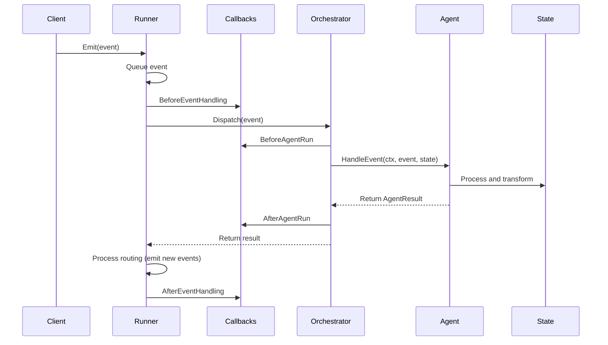

# Message Passing and Event Flow

At the heart of AgenticGoKit is an event-driven architecture that enables flexible, asynchronous communication between agents. This tutorial explains how messages flow through the system, how the Runner orchestrates this flow, and how you can build sophisticated multi-agent communication patterns.

Understanding message passing is crucial because it's the foundation of how agents communicate, share data, and coordinate their work in AgenticGoKit's distributed architecture.

## Prerequisites

- Basic understanding of Go programming and concurrency
- Familiarity with [Core Concepts Overview](./README.md)
- Knowledge of [Agent Lifecycle](./agent-lifecycle.md)

## Learning Objectives

By the end of this tutorial, you'll understand:
- The Event interface and EventData structure
- How the Runner manages event flow and routing
- Callback system and hook points for customization
- Advanced message passing patterns and best practices
- Error handling and debugging in event-driven systems

## The Event Interface

### Events: Structured Communication

In AgenticGoKit, all communication happens through **Events** - structured packets of information with routing metadata and payload data.

```go
// The complete Event interface
type Event interface {
    // Identification and timing
    GetID() string
    GetTimestamp() time.Time
    
    // Routing information
    GetTargetAgentID() string
    GetSourceAgentID() string
    GetSessionID() string
    
    // Data and metadata
    GetData() EventData
    GetMetadata() map[string]string
    GetMetadataValue(key string) (string, bool)
    
    // Mutation methods
    SetID(id string)
    SetTargetAgentID(id string)
    SetSourceAgentID(id string)
    SetData(key string, value any)
    SetMetadata(key string, value string)
}
```

::: info Event Characteristics
- **Immutable by design**: Events should be treated as immutable after creation
- **Thread-safe**: All operations are safe for concurrent access
- **Unique IDs**: Each event gets a UUID for tracking
- **Rich metadata**: Support for routing, session management, and custom attributes
:::

### EventData Structure

EventData is a flexible map that carries the actual message payload:

```go
// EventData is a type-safe map for event payloads
type EventData map[string]any

// Creating rich event data
eventData := core.EventData{
    "message":    "Analyze this dataset",
    "dataset_id": "ds-12345",
    "user_id":    "user-789",
    "priority":   "high",
    "metadata": map[string]interface{}{
        "source":    "web_interface",
        "timestamp": time.Now().Unix(),
    },
}
```

### Creating Events

Events are created using the `NewEvent()` factory function:

```go
// Create a comprehensive event
event := core.NewEvent(
    "data-analyzer",              // Target agent ID
    core.EventData{              // Payload data
        "query": "SELECT * FROM users WHERE active = true",
        "format": "json",
        "limit": 1000,
    },
    map[string]string{           // Routing metadata
        "session_id": "session-12345",
        "route":      "data-analyzer",
        "priority":   "normal",
        "timeout":    "30s",
    },
)

// Events are automatically assigned:
fmt.Printf("Event ID: %s\n", event.GetID())           // UUID
fmt.Printf("Timestamp: %v\n", event.GetTimestamp())   // Creation time
fmt.Printf("Target: %s\n", event.GetTargetAgentID())  // data-analyzer
fmt.Printf("Session: %s\n", event.GetSessionID())     // session-12345
```

## The Runner: Event Processing Engine

### Runner Interface and Lifecycle

The Runner is the central component that manages event flow, routing, and agent coordination:

```go
type Runner interface {
    // Event processing
    Emit(event Event) error
    
    // Agent management
    RegisterAgent(name string, handler AgentHandler) error
    
    // Callback system
    RegisterCallback(hook HookPoint, name string, cb CallbackFunc) error
    UnregisterCallback(hook HookPoint, name string)
    GetCallbackRegistry() *CallbackRegistry
    
    // Lifecycle management
    Start(ctx context.Context) error
    Stop()
    
    // Observability
    GetTraceLogger() TraceLogger
    DumpTrace(sessionID string) ([]TraceEntry, error)
}
```

### Configuration-Based Runner Creation

The recommended way to create runners is through configuration:

::: code-group

```toml [agentflow.toml]
[agent_flow]
name = "message-passing-demo"

[llm]
provider = "ollama"
model = "gemma3:1b"

[orchestration]
mode = "route"
timeout_seconds = 30

[agents.processor]
role = "data_processor"
system_prompt = "You process data efficiently."
enabled = true

[agents.analyzer]
role = "data_analyzer"
system_prompt = "You analyze processed data."
enabled = true
```

```go [main.go]
package main

import (
    "context"
    "log"
    "time"
    
    "github.com/kunalkushwaha/agenticgokit/core"
)

func main() {
    // Create runner with configuration
    config := core.DefaultRunnerConfig()
    runner := core.NewRunnerWithConfig(config)
    
    // Register agent handlers
    err := runner.RegisterAgent("processor", core.AgentHandlerFunc(
        func(ctx context.Context, event core.Event, state core.State) (core.AgentResult, error) {
            // Process the event
            outputState := state.Clone()
            outputState.Set("processed", true)
            outputState.Set("processed_at", time.Now().Unix())
            
            return core.AgentResult{
                OutputState: outputState,
                StartTime:   time.Now(),
                EndTime:     time.Now(),
            }, nil
        }))
    if err != nil {
        log.Fatal(err)
    }
    
    err = runner.RegisterAgent("analyzer", core.AgentHandlerFunc(
        func(ctx context.Context, event core.Event, state core.State) (core.AgentResult, error) {
            // Analyze the processed data
            outputState := state.Clone()
            outputState.Set("analyzed", true)
            outputState.Set("analysis_score", 0.95)
            
            return core.AgentResult{
                OutputState: outputState,
                StartTime:   time.Now(),
                EndTime:     time.Now(),
            }, nil
        }))
    if err != nil {
        log.Fatal(err)
    }
    
    // Start the runner
    ctx := context.Background()
    err = runner.Start(ctx)
    if err != nil {
        log.Fatal(err)
    }
    defer runner.Stop()
    
    // Emit events for processing
    processorEvent := core.NewEvent("processor",
        core.EventData{
            "data": "sample dataset",
            "format": "csv",
        },
        map[string]string{
            "session_id": "demo-session",
            "route": "processor",
        })
    
    err = runner.Emit(processorEvent)
    if err != nil {
        log.Fatal(err)
    }
    
    core.Logger().Info().Msg("Event emitted successfully")
    
    // Keep running for a bit to see results
    time.Sleep(2 * time.Second)
}
```

:::

### Event Processing Flow

The Runner follows a sophisticated event processing pipeline:



::: info Processing Characteristics
- **Asynchronous**: Events are queued and processed in background goroutines
- **Non-blocking**: `Emit()` returns immediately after queuing
- **Callback-driven**: Extensive hook system for customization
- **Error-resilient**: Comprehensive error handling and recovery
:::

### Event Emission and Routing

Events are emitted using the `Emit()` method:

```go
// Simple event emission
event := core.NewEvent("target-agent",
    core.EventData{"message": "Hello, World!"},
    map[string]string{
        "session_id": "session-123",
        "route": "target-agent",
    })

err := runner.Emit(event)
if err != nil {
    core.Logger().Error().Err(err).Msg("Failed to emit event")
    return
}

core.Logger().Info().
    Str("event_id", event.GetID()).
    Str("target", event.GetTargetAgentID()).
    Msg("Event emitted successfully")
```

## Callback System and Hooks

### Hook Points for Customization

AgenticGoKit provides comprehensive hooks for intercepting and customizing event processing:

```go
// Available hook points
const (
    HookBeforeEventHandling HookPoint = "BeforeEventHandling"
    HookAfterEventHandling  HookPoint = "AfterEventHandling"
    HookBeforeAgentRun      HookPoint = "BeforeAgentRun"
    HookAfterAgentRun       HookPoint = "AfterAgentRun"
    HookAgentError          HookPoint = "AgentError"
    HookAll                 HookPoint = "AllHooks"
)
```

### Callback Function Signature

All callbacks use a consistent signature:

```go
type CallbackFunc func(ctx context.Context, args CallbackArgs) (State, error)

type CallbackArgs struct {
    Ctx         context.Context
    Hook        HookPoint
    Event       Event
    State       State
    AgentID     string
    AgentResult AgentResult
    Error       error
}
```

### Comprehensive Callback Examples

```go
func setupCallbacks(runner core.Runner) {
    // Event lifecycle monitoring
    runner.RegisterCallback(core.HookBeforeEventHandling, "event-logger",
        func(ctx context.Context, args core.CallbackArgs) (core.State, error) {
            core.Logger().Info().
                Str("event_id", args.Event.GetID()).
                Str("target", args.Event.GetTargetAgentID()).
                Str("session", args.Event.GetSessionID()).
                Msg("Event processing started")
            
            return args.State, nil
        })
    
    // Agent execution monitoring
    runner.RegisterCallback(core.HookBeforeAgentRun, "agent-monitor",
        func(ctx context.Context, args core.CallbackArgs) (core.State, error) {
            core.Logger().Debug().
                Str("agent", args.AgentID).
                Str("event_id", args.Event.GetID()).
                Msg("Agent execution starting")
            
            // Add execution metadata to state
            if args.State != nil {
                args.State.SetMeta("execution_start", time.Now().Format(time.RFC3339))
                args.State.SetMeta("executing_agent", args.AgentID)
            }
            
            return args.State, nil
        })
    
    // Performance and metrics collection
    runner.RegisterCallback(core.HookAfterAgentRun, "performance-tracker",
        func(ctx context.Context, args core.CallbackArgs) (core.State, error) {
            duration := args.AgentResult.Duration
            
            core.Logger().Info().
                Str("agent", args.AgentID).
                Str("event_id", args.Event.GetID()).
                Dur("duration", duration).
                Bool("success", args.Error == nil).
                Msg("Agent execution completed")
            
            // Record metrics (pseudo-code)
            // metrics.RecordAgentExecution(args.AgentID, duration, args.Error == nil)
            
            return args.State, nil
        })
    
    // Error handling and recovery
    runner.RegisterCallback(core.HookAgentError, "error-recovery",
        func(ctx context.Context, args core.CallbackArgs) (core.State, error) {
            core.Logger().Error().
                Str("agent", args.AgentID).
                Str("event_id", args.Event.GetID()).
                Err(args.Error).
                Msg("Agent execution failed")
            
            // Implement recovery logic
            if isRetryableError(args.Error) {
                retryEvent := core.NewEvent(args.AgentID,
                    args.Event.GetData(),
                    map[string]string{
                        "retry": "true",
                        "original_event_id": args.Event.GetID(),
                        "session_id": args.Event.GetSessionID(),
                        "route": args.AgentID,
                    })
                
                // Emit retry event
                runner.Emit(retryEvent)
                
                core.Logger().Info().
                    Str("agent", args.AgentID).
                    Str("retry_event_id", retryEvent.GetID()).
                    Msg("Retry event emitted")
            }
            
            return args.State, nil
        })
    
    // Event completion and cleanup
    runner.RegisterCallback(core.HookAfterEventHandling, "cleanup",
        func(ctx context.Context, args core.CallbackArgs) (core.State, error) {
            core.Logger().Debug().
                Str("event_id", args.Event.GetID()).
                Msg("Event processing completed")
            
            return args.State, nil
        })
}

func isRetryableError(err error) bool {
    if err == nil {
        return false
    }
    
    errStr := strings.ToLower(err.Error())
    return strings.Contains(errStr, "timeout") ||
           strings.Contains(errStr, "connection") ||
           strings.Contains(errStr, "temporary")
}
```

## Complete Message Passing Example

Here's a comprehensive example showing all the concepts together:

::: code-group

```toml [agentflow.toml]
[agent_flow]
name = "message-passing-system"

[llm]
provider = "ollama"
model = "gemma3:1b"
temperature = 0.7

[orchestration]
mode = "route"
timeout_seconds = 30

[agents.data_processor]
role = "processor"
system_prompt = "You process incoming data efficiently."
enabled = true

[agents.data_analyzer]
role = "analyzer"
system_prompt = "You analyze processed data for insights."
enabled = true

[agents.report_generator]
role = "reporter"
system_prompt = "You generate comprehensive reports."
enabled = true
```

```go [complete_example.go]
package main

import (
    "context"
    "fmt"
    "log"
    "strings"
    "time"
    
    "github.com/kunalkushwaha/agenticgokit/core"
)

func main() {
    // Create runner with configuration
    config := core.DefaultRunnerConfig()
    runner := core.NewRunnerWithConfig(config)
    
    // Setup comprehensive callbacks
    setupCallbacks(runner)
    
    // Register agent handlers
    registerAgents(runner)
    
    // Start the system
    ctx := context.Background()
    err = runner.Start(ctx)
    if err != nil {
        log.Fatal(err)
    }
    defer runner.Stop()
    
    // Demonstrate different message passing patterns
    demonstrateMessagePassing(runner)
    
    // Keep running to see all processing
    time.Sleep(5 * time.Second)
}

// Agent Registration Patterns
// AgenticGoKit supports two main approaches for agent registration:
//
// 1. Agent Interface: Full-featured agents with lifecycle management
//    - Use for complex agents that need configuration and capabilities
//    - Implement the complete Agent interface
//
// 2. AgentHandler: Lightweight function-based handlers
//    - Use for simple, stateless processing functions
//    - Created using AgentHandlerFunc wrapper
//
// Both patterns can be registered with Runner.RegisterAgent()

// Example Agent implementation using the Agent interface
type DataProcessorAgent struct {
    name string
    role string
}

func (a *DataProcessorAgent) Name() string { return a.name }
func (a *DataProcessorAgent) GetRole() string { return a.role }
func (a *DataProcessorAgent) GetDescription() string { return "Processes incoming data" }
func (a *DataProcessorAgent) GetCapabilities() []string { return []string{"data_processing"} }
func (a *DataProcessorAgent) GetSystemPrompt() string { return "You process data efficiently" }
func (a *DataProcessorAgent) GetTimeout() time.Duration { return 30 * time.Second }
func (a *DataProcessorAgent) IsEnabled() bool { return true }
func (a *DataProcessorAgent) GetLLMConfig() *core.ResolvedLLMConfig { return nil }
func (a *DataProcessorAgent) Initialize(ctx context.Context) error { return nil }
func (a *DataProcessorAgent) Shutdown(ctx context.Context) error { return nil }

// Run method - primary execution pattern
func (a *DataProcessorAgent) Run(ctx context.Context, inputState core.State) (core.State, error) {
    outputState := inputState.Clone()
    outputState.Set("processed", true)
    outputState.Set("processor_id", "agent-proc-001")
    outputState.Set("processed_at", time.Now().Unix())
    outputState.SetMeta("route", "data_analyzer")
    return outputState, nil
}

// HandleEvent method - event-driven pattern (delegates to Run)
func (a *DataProcessorAgent) HandleEvent(ctx context.Context, event core.Event, state core.State) (core.AgentResult, error) {
    startTime := time.Now()
    outputState, err := a.Run(ctx, state)
    endTime := time.Now()
    
    return core.AgentResult{
        OutputState: outputState,
        StartTime:   startTime,
        EndTime:     endTime,
        Duration:    endTime.Sub(startTime),
    }, err
}

func registerAgents(runner core.Runner) {
    // Pattern 1: Using Agent interface (recommended for complex agents)
    dataProcessor := &DataProcessorAgent{
        name: "data_processor",
        role: "data_processor",
    }
    runner.RegisterAgent("data_processor", dataProcessor)
    
    // Pattern 2: Using AgentHandlerFunc (good for simple processing)
    runner.RegisterAgent("simple_processor", core.AgentHandlerFunc(
        func(ctx context.Context, event core.Event, state core.State) (core.AgentResult, error) {
            startTime := time.Now()
            
            // Simulate processing
            time.Sleep(100 * time.Millisecond)
            
            outputState := state.Clone()
            outputState.Set("processed", true)
            outputState.Set("processor_id", "proc-001")
            outputState.Set("processed_at", time.Now().Unix())
            
            // Route to analyzer
            outputState.SetMeta("route", "data_analyzer")
            
            return core.AgentResult{
                OutputState: outputState,
                StartTime:   startTime,
                EndTime:     time.Now(),
                Duration:    time.Since(startTime),
            }, nil
        }))
    
    // Data analyzer agent
    runner.RegisterAgent("data_analyzer", core.AgentHandlerFunc(
        func(ctx context.Context, event core.Event, state core.State) (core.AgentResult, error) {
            startTime := time.Now()
            
            // Simulate analysis
            time.Sleep(150 * time.Millisecond)
            
            outputState := state.Clone()
            outputState.Set("analyzed", true)
            outputState.Set("analysis_score", 0.95)
            outputState.Set("insights", []string{"trend_up", "quality_good"})
            
            // Route to report generator
            outputState.SetMeta("route", "report_generator")
            
            return core.AgentResult{
                OutputState: outputState,
                StartTime:   startTime,
                EndTime:     time.Now(),
                Duration:    time.Since(startTime),
            }, nil
        }))
    
    // Report generator agent
    runner.RegisterAgent("report_generator", core.AgentHandlerFunc(
        func(ctx context.Context, event core.Event, state core.State) (core.AgentResult, error) {
            startTime := time.Now()
            
            // Simulate report generation
            time.Sleep(200 * time.Millisecond)
            
            outputState := state.Clone()
            outputState.Set("report_generated", true)
            outputState.Set("report_id", "rpt-"+fmt.Sprintf("%d", time.Now().Unix()))
            outputState.Set("final_result", "Processing pipeline completed successfully")
            
            return core.AgentResult{
                OutputState: outputState,
                StartTime:   startTime,
                EndTime:     time.Now(),
                Duration:    time.Since(startTime),
            }, nil
        }))
}

func demonstrateMessagePassing(runner core.Runner) {
    // 1. Simple message passing
    simpleEvent := core.NewEvent("data_processor",
        core.EventData{
            "message": "Process this dataset",
            "dataset_id": "ds-12345",
            "format": "json",
        },
        map[string]string{
            "session_id": "demo-session-1",
            "route": "data_processor",
            "priority": "normal",
        })
    
    err := runner.Emit(simpleEvent)
    if err != nil {
        log.Printf("Failed to emit simple event: %v", err)
    }
    
    // 2. High-priority message
    urgentEvent := core.NewEvent("data_processor",
        core.EventData{
            "message": "URGENT: Process critical data",
            "dataset_id": "ds-urgent-001",
            "format": "csv",
        },
        map[string]string{
            "session_id": "demo-session-2",
            "route": "data_processor",
            "priority": "high",
            "deadline": time.Now().Add(1*time.Minute).Format(time.RFC3339),
        })
    
    err = runner.Emit(urgentEvent)
    if err != nil {
        log.Printf("Failed to emit urgent event: %v", err)
    }
    
    // 3. Batch processing message
    batchEvent := core.NewEvent("data_processor",
        core.EventData{
            "message": "Process batch of datasets",
            "dataset_ids": []string{"ds-001", "ds-002", "ds-003"},
            "batch_size": 3,
        },
        map[string]string{
            "session_id": "demo-session-3",
            "route": "data_processor",
            "processing_mode": "batch",
        })
    
    err = runner.Emit(batchEvent)
    if err != nil {
        log.Printf("Failed to emit batch event: %v", err)
    }
}
```

:::

This example demonstrates:
- Configuration-based runner setup
- Comprehensive callback registration
- Agent chaining through routing metadata
- Different event types and priorities
- Complete error handling and monitoring

## Advanced Message Passing Patterns

### 1. Session-Based Communication

Maintain conversation context across multiple events:

```go
// Session manager for tracking conversation state
type SessionManager struct {
    sessions map[string]*SessionContext
    mu       sync.RWMutex
}

type SessionContext struct {
    SessionID    string
    UserID       string
    StartTime    time.Time
    LastActivity time.Time
    Context      map[string]interface{}
}

func (sm *SessionManager) GetOrCreateSession(sessionID, userID string) *SessionContext {
    sm.mu.Lock()
    defer sm.mu.Unlock()
    
    if session, exists := sm.sessions[sessionID]; exists {
        session.LastActivity = time.Now()
        return session
    }
    
    session := &SessionContext{
        SessionID:    sessionID,
        UserID:       userID,
        StartTime:    time.Now(),
        LastActivity: time.Now(),
        Context:      make(map[string]interface{}),
    }
    
    sm.sessions[sessionID] = session
    return session
}

// Use session context in events
func createSessionAwareEvent(sessionManager *SessionManager, agentID string, data core.EventData, userID string) core.Event {
    sessionID := fmt.Sprintf("session-%s-%d", userID, time.Now().Unix())
    session := sessionManager.GetOrCreateSession(sessionID, userID)
    
    // Add session context to event data
    enrichedData := make(core.EventData)
    for k, v := range data {
        enrichedData[k] = v
    }
    enrichedData["session_context"] = session.Context
    
    return core.NewEvent(agentID, enrichedData, map[string]string{
        "session_id": sessionID,
        "user_id":    userID,
        "route":      agentID,
    })
}
```

### 2. Event Chaining and Workflows

Create sophisticated workflows where agents pass work to each other:

```go
// Workflow coordinator using callbacks
func setupWorkflowChaining(runner core.Runner) {
    runner.RegisterCallback(core.HookAfterAgentRun, "workflow-coordinator",
        func(ctx context.Context, args core.CallbackArgs) (core.State, error) {
            // Only process successful executions
            if args.Error != nil {
                return args.State, nil
            }
            
            // Check for routing instructions in output state
            if args.AgentResult.OutputState != nil {
                if nextAgent, ok := args.AgentResult.OutputState.GetMeta("route"); ok && nextAgent != "" {
                    // Create next event in the workflow
                    nextEvent := createWorkflowEvent(args.Event, args.AgentResult.OutputState, nextAgent)
                    
                    core.Logger().Info().
                        Str("current_agent", args.AgentID).
                        Str("next_agent", nextAgent).
                        Str("workflow_id", args.Event.GetSessionID()).
                        Msg("Chaining to next agent in workflow")
                    
                    err := runner.Emit(nextEvent)
                    if err != nil {
                        core.Logger().Error().
                            Err(err).
                            Str("next_agent", nextAgent).
                            Msg("Failed to emit workflow event")
                    }
                }
            }
            
            return args.State, nil
        })
}

func createWorkflowEvent(originalEvent core.Event, outputState core.State, nextAgent string) core.Event {
    // Create event data from output state
    eventData := make(core.EventData)
    for _, key := range outputState.Keys() {
        if value, ok := outputState.Get(key); ok {
            eventData[key] = value
        }
    }
    
    // Preserve workflow metadata
    metadata := map[string]string{
        "session_id":     originalEvent.GetSessionID(),
        "route":          nextAgent,
        "workflow_step":  fmt.Sprintf("%d", getWorkflowStep(originalEvent)+1),
        "parent_event":   originalEvent.GetID(),
    }
    
    // Copy relevant metadata from output state
    for _, key := range outputState.MetaKeys() {
        if value, ok := outputState.GetMeta(key); ok && key != "route" {
            metadata[key] = value
        }
    }
    
    event := core.NewEvent(nextAgent, eventData, metadata)
    event.SetSourceAgentID(originalEvent.GetTargetAgentID())
    
    return event
}

func getWorkflowStep(event core.Event) int {
    if stepStr, ok := event.GetMetadataValue("workflow_step"); ok {
        if step, err := strconv.Atoi(stepStr); err == nil {
            return step
        }
    }
    return 0
}
```

### 3. Broadcast and Fan-Out Patterns

Send events to multiple agents using collaborative orchestration:

```go
// Setup collaborative orchestration for broadcasting
func setupBroadcastPattern(runner core.Runner) {
    // Register broadcast handler
    runner.RegisterCallback(core.HookBeforeEventHandling, "broadcast-handler",
        func(ctx context.Context, args core.CallbackArgs) (core.State, error) {
            // Check if this is a broadcast event
            if broadcast, ok := args.Event.GetMetadataValue("broadcast"); ok && broadcast == "true" {
                // Get target agents from metadata
                if targets, ok := args.Event.GetMetadataValue("broadcast_targets"); ok {
                    agentList := strings.Split(targets, ",")
                    
                    core.Logger().Info().
                        Str("event_id", args.Event.GetID()).
                        Strs("targets", agentList).
                        Msg("Broadcasting event to multiple agents")
                    
                    // Create individual events for each target
                    for _, agentName := range agentList {
                        agentName = strings.TrimSpace(agentName)
                        if agentName != "" {
                            broadcastEvent := core.NewEvent(agentName,
                                args.Event.GetData(),
                                map[string]string{
                                    "session_id":     args.Event.GetSessionID(),
                                    "route":          agentName,
                                    "broadcast_id":   args.Event.GetID(),
                                    "broadcast_mode": "individual",
                                })
                            
                            runner.Emit(broadcastEvent)
                        }
                    }
                }
            }
            
            return args.State, nil
        })
}

// Create a broadcast event
func createBroadcastEvent(data core.EventData, targets []string, sessionID string) core.Event {
    return core.NewEvent("", data, map[string]string{
        "session_id":       sessionID,
        "broadcast":        "true",
        "broadcast_targets": strings.Join(targets, ","),
    })
}

// Usage example
func demonstrateBroadcast(runner core.Runner) {
    broadcastEvent := createBroadcastEvent(
        core.EventData{
            "announcement": "New data available for processing",
            "data_source":  "external_api",
            "timestamp":    time.Now().Unix(),
        },
        []string{"data_processor", "data_analyzer", "report_generator"},
        "broadcast-session-001",
    )
    
    runner.Emit(broadcastEvent)
}
```

### 4. Priority and Deadline Management

Implement sophisticated priority handling:

```go
// Priority levels
const (
    PriorityLow    = "low"
    PriorityNormal = "normal"
    PriorityHigh   = "high"
    PriorityCritical = "critical"
)

// Priority-aware event creation
func createPriorityEvent(agentID string, data core.EventData, priority string, deadline *time.Time) core.Event {
    metadata := map[string]string{
        "session_id": fmt.Sprintf("priority-session-%d", time.Now().Unix()),
        "route":      agentID,
        "priority":   priority,
    }
    
    if deadline != nil {
        metadata["deadline"] = deadline.Format(time.RFC3339)
        metadata["timeout"] = fmt.Sprintf("%ds", int(time.Until(*deadline).Seconds()))
    }
    
    return core.NewEvent(agentID, data, metadata)
}

// Priority monitoring callback
func setupPriorityMonitoring(runner core.Runner) {
    runner.RegisterCallback(core.HookBeforeAgentRun, "priority-monitor",
        func(ctx context.Context, args core.CallbackArgs) (core.State, error) {
            priority, _ := args.Event.GetMetadataValue("priority")
            
            // Check for deadline violations
            if deadlineStr, ok := args.Event.GetMetadataValue("deadline"); ok {
                if deadline, err := time.Parse(time.RFC3339, deadlineStr); err == nil {
                    if time.Now().After(deadline) {
                        core.Logger().Warn().
                            Str("event_id", args.Event.GetID()).
                            Str("agent", args.AgentID).
                            Time("deadline", deadline).
                            Msg("Event processing past deadline")
                        
                        // Optionally cancel or escalate
                        if priority == PriorityCritical {
                            return args.State, fmt.Errorf("critical event past deadline")
                        }
                    }
                }
            }
            
            // Log priority processing
            core.Logger().Debug().
                Str("event_id", args.Event.GetID()).
                Str("agent", args.AgentID).
                Str("priority", priority).
                Msg("Processing priority event")
            
            return args.State, nil
        })
}

// Usage examples
func demonstratePriorityHandling(runner core.Runner) {
    // Normal priority event
    normalEvent := createPriorityEvent("data_processor",
        core.EventData{"task": "routine_analysis"},
        PriorityNormal, nil)
    
    // High priority with deadline
    deadline := time.Now().Add(5 * time.Minute)
    urgentEvent := createPriorityEvent("data_processor",
        core.EventData{"task": "urgent_analysis", "escalation_level": 2},
        PriorityHigh, &deadline)
    
    // Critical priority with tight deadline
    criticalDeadline := time.Now().Add(30 * time.Second)
    criticalEvent := createPriorityEvent("data_processor",
        core.EventData{"task": "system_failure_analysis", "alert_id": "ALT-001"},
        PriorityCritical, &criticalDeadline)
    
    runner.Emit(normalEvent)
    runner.Emit(urgentEvent)
    runner.Emit(criticalEvent)
}
```

## Observability and Tracing

### Built-in Tracing System

AgenticGoKit provides comprehensive tracing for message flow:

```go
// Setup tracing for complete observability
func setupTracing(runner core.Runner) error {
    // Create trace logger
    traceLogger := core.NewInMemoryTraceLogger()
    runner.SetTraceLogger(traceLogger)
    
    // Register trace hooks for automatic tracing
    err := core.RegisterTraceHooks(runner.GetCallbackRegistry(), traceLogger)
    if err != nil {
        return fmt.Errorf("failed to register trace hooks: %w", err)
    }
    
    // Add custom tracing callback
    runner.RegisterCallback(core.HookAfterEventHandling, "custom-tracer",
        func(ctx context.Context, args core.CallbackArgs) (core.State, error) {
            // Dump trace for completed events
            traces, err := runner.DumpTrace(args.Event.GetSessionID())
            if err == nil && len(traces) > 0 {
                core.Logger().Debug().
                    Str("session_id", args.Event.GetSessionID()).
                    Int("trace_count", len(traces)).
                    Msg("Event trace available")
            }
            
            return args.State, nil
        })
    
    return nil
}

// Analyze message flow patterns
func analyzeMessageFlow(runner core.Runner, sessionID string) {
    traces, err := runner.DumpTrace(sessionID)
    if err != nil {
        core.Logger().Error().Err(err).Msg("Failed to get traces")
        return
    }
    
    core.Logger().Info().
        Str("session_id", sessionID).
        Int("total_traces", len(traces)).
        Msg("Message flow analysis")
    
    for _, trace := range traces {
        core.Logger().Debug().
            Str("type", trace.Type).
            Str("event_id", trace.EventID).
            Str("agent_id", trace.AgentID).
            Time("timestamp", trace.Timestamp).
            Msg("Trace entry")
    }
}
```

### Performance Monitoring

Monitor message passing performance:

```go
// Performance metrics collector
type MessageMetrics struct {
    eventCounts    map[string]int64
    processingTimes map[string][]time.Duration
    errorCounts    map[string]int64
    mu             sync.RWMutex
}

func NewMessageMetrics() *MessageMetrics {
    return &MessageMetrics{
        eventCounts:     make(map[string]int64),
        processingTimes: make(map[string][]time.Duration),
        errorCounts:     make(map[string]int64),
    }
}

func (mm *MessageMetrics) RecordEvent(agentID string, duration time.Duration, success bool) {
    mm.mu.Lock()
    defer mm.mu.Unlock()
    
    mm.eventCounts[agentID]++
    mm.processingTimes[agentID] = append(mm.processingTimes[agentID], duration)
    
    if !success {
        mm.errorCounts[agentID]++
    }
    
    // Keep only recent measurements
    const maxHistory = 1000
    if len(mm.processingTimes[agentID]) > maxHistory {
        mm.processingTimes[agentID] = mm.processingTimes[agentID][len(mm.processingTimes[agentID])-maxHistory:]
    }
}

func (mm *MessageMetrics) GetStats(agentID string) map[string]interface{} {
    mm.mu.RLock()
    defer mm.mu.RUnlock()
    
    times := mm.processingTimes[agentID]
    if len(times) == 0 {
        return map[string]interface{}{
            "event_count": mm.eventCounts[agentID],
            "error_count": mm.errorCounts[agentID],
        }
    }
    
    // Calculate statistics
    var total time.Duration
    for _, t := range times {
        total += t
    }
    
    avg := total / time.Duration(len(times))
    errorRate := float64(mm.errorCounts[agentID]) / float64(mm.eventCounts[agentID])
    
    return map[string]interface{}{
        "event_count":        mm.eventCounts[agentID],
        "error_count":        mm.errorCounts[agentID],
        "error_rate":         errorRate,
        "avg_processing_time": avg,
        "total_processing_time": total,
    }
}

// Setup performance monitoring
func setupPerformanceMonitoring(runner core.Runner, metrics *MessageMetrics) {
    runner.RegisterCallback(core.HookAfterAgentRun, "performance-monitor",
        func(ctx context.Context, args core.CallbackArgs) (core.State, error) {
            metrics.RecordEvent(args.AgentID, args.AgentResult.Duration, args.Error == nil)
            
            // Log performance periodically
            if metrics.eventCounts[args.AgentID]%100 == 0 {
                stats := metrics.GetStats(args.AgentID)
                core.Logger().Info().
                    Str("agent", args.AgentID).
                    Interface("stats", stats).
                    Msg("Agent performance stats")
            }
            
            return args.State, nil
        })
}
```

## Error Handling and Recovery

### Comprehensive Error Management

```go
// Error classification and handling
type ErrorClassifier struct {
    retryableErrors []string
    fatalErrors     []string
}

func NewErrorClassifier() *ErrorClassifier {
    return &ErrorClassifier{
        retryableErrors: []string{"timeout", "connection", "rate_limit", "temporary"},
        fatalErrors:     []string{"authentication", "authorization", "validation", "not_found"},
    }
}

func (ec *ErrorClassifier) IsRetryable(err error) bool {
    if err == nil {
        return false
    }
    
    errStr := strings.ToLower(err.Error())
    
    // Check for fatal errors first
    for _, fatal := range ec.fatalErrors {
        if strings.Contains(errStr, fatal) {
            return false
        }
    }
    
    // Check for retryable errors
    for _, retryable := range ec.retryableErrors {
        if strings.Contains(errStr, retryable) {
            return true
        }
    }
    
    return false
}

func (ec *ErrorClassifier) GetErrorCategory(err error) string {
    if err == nil {
        return "none"
    }
    
    errStr := strings.ToLower(err.Error())
    
    for _, fatal := range ec.fatalErrors {
        if strings.Contains(errStr, fatal) {
            return "fatal"
        }
    }
    
    for _, retryable := range ec.retryableErrors {
        if strings.Contains(errStr, retryable) {
            return "retryable"
        }
    }
    
    return "unknown"
}

// Advanced error handling with recovery strategies
func setupAdvancedErrorHandling(runner core.Runner, classifier *ErrorClassifier) {
    runner.RegisterCallback(core.HookAgentError, "advanced-error-handler",
        func(ctx context.Context, args core.CallbackArgs) (core.State, error) {
            category := classifier.GetErrorCategory(args.Error)
            
            core.Logger().Error().
                Str("agent", args.AgentID).
                Str("event_id", args.Event.GetID()).
                Str("error_category", category).
                Err(args.Error).
                Msg("Agent execution failed")
            
            switch category {
            case "retryable":
                return handleRetryableError(runner, args, classifier)
            case "fatal":
                return handleFatalError(runner, args)
            default:
                return handleUnknownError(runner, args)
            }
        })
}

func handleRetryableError(runner core.Runner, args core.CallbackArgs, classifier *ErrorClassifier) (core.State, error) {
    // Check retry count
    retryCountStr, _ := args.Event.GetMetadataValue("retry_count")
    retryCount := 0
    if retryCountStr != "" {
        retryCount, _ = strconv.Atoi(retryCountStr)
    }
    
    const maxRetries = 3
    if retryCount < maxRetries {
        // Calculate backoff delay
        delay := time.Duration(1<<uint(retryCount)) * time.Second
        
        core.Logger().Info().
            Str("agent", args.AgentID).
            Str("event_id", args.Event.GetID()).
            Int("retry_count", retryCount+1).
            Dur("delay", delay).
            Msg("Scheduling retry")
        
        // Create retry event with backoff
        go func() {
            time.Sleep(delay)
            
            retryEvent := core.NewEvent(args.AgentID,
                args.Event.GetData(),
                map[string]string{
                    "session_id":  args.Event.GetSessionID(),
                    "route":       args.AgentID,
                    "retry_count": fmt.Sprintf("%d", retryCount+1),
                    "original_event_id": args.Event.GetID(),
                })
            
            runner.Emit(retryEvent)
        }()
    } else {
        core.Logger().Error().
            Str("agent", args.AgentID).
            Str("event_id", args.Event.GetID()).
            Msg("Max retries exceeded, escalating to error handler")
        
        // Escalate to error handler
        errorEvent := core.NewEvent("error_handler",
            core.EventData{
                "original_event": args.Event.GetData(),
                "failed_agent":   args.AgentID,
                "error_message":  args.Error.Error(),
                "retry_count":    retryCount,
            },
            map[string]string{
                "session_id": args.Event.GetSessionID(),
                "route":      "error_handler",
                "error_type": "max_retries_exceeded",
            })
        
        runner.Emit(errorEvent)
    }
    
    return args.State, nil
}

func handleFatalError(runner core.Runner, args core.CallbackArgs) (core.State, error) {
    core.Logger().Error().
        Str("agent", args.AgentID).
        Str("event_id", args.Event.GetID()).
        Msg("Fatal error, no retry possible")
    
    // Send to dead letter queue or error handler
    deadLetterEvent := core.NewEvent("dead_letter_handler",
        core.EventData{
            "original_event": args.Event.GetData(),
            "failed_agent":   args.AgentID,
            "error_message":  args.Error.Error(),
            "error_type":     "fatal",
        },
        map[string]string{
            "session_id": args.Event.GetSessionID(),
            "route":      "dead_letter_handler",
        })
    
    runner.Emit(deadLetterEvent)
    return args.State, nil
}

func handleUnknownError(runner core.Runner, args core.CallbackArgs) (core.State, error) {
    core.Logger().Warn().
        Str("agent", args.AgentID).
        Str("event_id", args.Event.GetID()).
        Msg("Unknown error type, treating as retryable")
    
    // Treat unknown errors as potentially retryable but with caution
    classifier := &ErrorClassifier{}
    return handleRetryableError(runner, args, classifier)
}
```

## Common Pitfalls and Solutions

### 1. Event Loop Prevention

**Problem**: Creating circular event chains that never terminate.

**Solution**: Implement hop counting and loop detection:

```go
// Loop detection middleware
func setupLoopDetection(runner core.Runner) {
    const maxHops = 10
    
    runner.RegisterCallback(core.HookBeforeEventHandling, "loop-detector",
        func(ctx context.Context, args core.CallbackArgs) (core.State, error) {
            hopCountStr, _ := args.Event.GetMetadataValue("hop_count")
            hopCount := 0
            if hopCountStr != "" {
                hopCount, _ = strconv.Atoi(hopCountStr)
            }
            
            if hopCount >= maxHops {
                core.Logger().Error().
                    Str("event_id", args.Event.GetID()).
                    Int("hop_count", hopCount).
                    Msg("Event loop detected - terminating")
                
                return args.State, fmt.Errorf("event loop detected: hop count %d exceeds maximum %d", hopCount, maxHops)
            }
            
            // Increment hop count for chained events
            args.Event.SetMetadata("hop_count", fmt.Sprintf("%d", hopCount+1))
            
            return args.State, nil
        })
}

// Safe event chaining with loop prevention
func createChainedEvent(originalEvent core.Event, nextAgent string, data core.EventData) core.Event {
    hopCountStr, _ := originalEvent.GetMetadataValue("hop_count")
    hopCount := 0
    if hopCountStr != "" {
        hopCount, _ = strconv.Atoi(hopCountStr)
    }
    
    metadata := map[string]string{
        "session_id":     originalEvent.GetSessionID(),
        "route":          nextAgent,
        "hop_count":      fmt.Sprintf("%d", hopCount+1),
        "parent_event":   originalEvent.GetID(),
        "chain_id":       getOrCreateChainID(originalEvent),
    }
    
    return core.NewEvent(nextAgent, data, metadata)
}

func getOrCreateChainID(event core.Event) string {
    if chainID, ok := event.GetMetadataValue("chain_id"); ok {
        return chainID
    }
    return fmt.Sprintf("chain-%s", event.GetID())
}
```

### 2. Memory Management

**Problem**: Events accumulating in queues and memory leaks.

**Solution**: Implement proper monitoring and cleanup:

```go
// Memory monitoring and cleanup
type MemoryMonitor struct {
    eventCounts    map[string]int64
    lastCleanup    time.Time
    cleanupInterval time.Duration
    mu             sync.RWMutex
}

func NewMemoryMonitor() *MemoryMonitor {
    return &MemoryMonitor{
        eventCounts:     make(map[string]int64),
        cleanupInterval: 5 * time.Minute,
        lastCleanup:     time.Now(),
    }
}

func (mm *MemoryMonitor) RecordEvent(sessionID string) {
    mm.mu.Lock()
    defer mm.mu.Unlock()
    
    mm.eventCounts[sessionID]++
    
    // Periodic cleanup
    if time.Since(mm.lastCleanup) > mm.cleanupInterval {
        mm.cleanup()
        mm.lastCleanup = time.Now()
    }
}

func (mm *MemoryMonitor) cleanup() {
    // Remove old session data
    cutoff := time.Now().Add(-1 * time.Hour)
    for sessionID := range mm.eventCounts {
        // Simple cleanup - in production, you'd want more sophisticated logic
        if len(sessionID) > 20 { // Rough timestamp check
            delete(mm.eventCounts, sessionID)
        }
    }
    
    core.Logger().Debug().
        Int("remaining_sessions", len(mm.eventCounts)).
        Msg("Memory cleanup completed")
}

func setupMemoryMonitoring(runner core.Runner, monitor *MemoryMonitor) {
    runner.RegisterCallback(core.HookBeforeEventHandling, "memory-monitor",
        func(ctx context.Context, args core.CallbackArgs) (core.State, error) {
            monitor.RecordEvent(args.Event.GetSessionID())
            return args.State, nil
        })
    
    // Shutdown cleanup
    runner.RegisterCallback(core.HookAfterEventHandling, "cleanup-check",
        func(ctx context.Context, args core.CallbackArgs) (core.State, error) {
            // Force cleanup on shutdown signals
            if ctx.Err() != nil {
                monitor.cleanup()
            }
            return args.State, nil
        })
}
```

### 3. Deadlock Prevention

**Problem**: Blocking operations in event processing.

**Solution**: Use asynchronous patterns and timeouts:

```go
// Async processing pattern
func createAsyncAgent(name string, processor func(context.Context, core.Event, core.State) (core.State, error)) core.AgentHandler {
    return core.AgentHandlerFunc(func(ctx context.Context, event core.Event, state core.State) (core.AgentResult, error) {
        startTime := time.Now()
        
        // Create timeout context
        timeout := 30 * time.Second
        if timeoutStr, ok := event.GetMetadataValue("timeout"); ok {
            if parsedTimeout, err := time.ParseDuration(timeoutStr); err == nil {
                timeout = parsedTimeout
            }
        }
        
        ctx, cancel := context.WithTimeout(ctx, timeout)
        defer cancel()
        
        // Process asynchronously
        resultChan := make(chan struct {
            state core.State
            err   error
        }, 1)
        
        go func() {
            defer func() {
                if r := recover(); r != nil {
                    resultChan <- struct {
                        state core.State
                        err   error
                    }{state, fmt.Errorf("panic in agent %s: %v", name, r)}
                }
            }()
            
            result, err := processor(ctx, event, state)
            resultChan <- struct {
                state core.State
                err   error
            }{result, err}
        }()
        
        // Wait for result or timeout
        select {
        case result := <-resultChan:
            return core.AgentResult{
                OutputState: result.state,
                StartTime:   startTime,
                EndTime:     time.Now(),
                Duration:    time.Since(startTime),
            }, result.err
            
        case <-ctx.Done():
            return core.AgentResult{
                OutputState: state,
                StartTime:   startTime,
                EndTime:     time.Now(),
                Duration:    time.Since(startTime),
            }, fmt.Errorf("agent %s timed out: %w", name, ctx.Err())
        }
    })
}
```

### 4. Lost Event Prevention

**Problem**: Events not reaching their target agents.

**Solution**: Implement comprehensive error handling and dead letter queues:

```go
// Dead letter queue handler
func setupDeadLetterQueue(runner core.Runner) {
    runner.RegisterAgent("dead_letter_handler", core.AgentHandlerFunc(
        func(ctx context.Context, event core.Event, state core.State) (core.AgentResult, error) {
            core.Logger().Error().
                Str("event_id", event.GetID()).
                Interface("event_data", event.GetData()).
                Msg("Event sent to dead letter queue")
            
            // Store in persistent storage, send alerts, etc.
            // This is where you'd implement your dead letter queue logic
            
            outputState := state.Clone()
            outputState.Set("dead_letter_processed", true)
            outputState.Set("processed_at", time.Now().Unix())
            
            return core.AgentResult{
                OutputState: outputState,
                StartTime:   time.Now(),
                EndTime:     time.Now(),
            }, nil
        }))
    
    // Catch unroutable events
    runner.RegisterCallback(core.HookAgentError, "dead-letter-router",
        func(ctx context.Context, args core.CallbackArgs) (core.State, error) {
            if strings.Contains(args.Error.Error(), "agent not found") ||
               strings.Contains(args.Error.Error(), "no handler registered") {
                
                deadLetterEvent := core.NewEvent("dead_letter_handler",
                    core.EventData{
                        "original_event": args.Event.GetData(),
                        "target_agent":   args.Event.GetTargetAgentID(),
                        "error_reason":   "agent_not_found",
                    },
                    map[string]string{
                        "session_id": args.Event.GetSessionID(),
                        "route":      "dead_letter_handler",
                    })
                
                runner.Emit(deadLetterEvent)
            }
            
            return args.State, nil
        })
}
```

## Performance Optimization

### 1. Event Batching Strategies

For high-throughput scenarios, implement event batching:

```go
// Batch processor for high-volume events
type EventBatcher struct {
    batchSize    int
    flushInterval time.Duration
    events       []core.Event
    mu           sync.Mutex
    flushTimer   *time.Timer
    runner       core.Runner
}

func NewEventBatcher(runner core.Runner, batchSize int, flushInterval time.Duration) *EventBatcher {
    return &EventBatcher{
        batchSize:     batchSize,
        flushInterval: flushInterval,
        events:        make([]core.Event, 0, batchSize),
        runner:        runner,
    }
}

func (eb *EventBatcher) AddEvent(event core.Event) {
    eb.mu.Lock()
    defer eb.mu.Unlock()
    
    eb.events = append(eb.events, event)
    
    // Flush if batch is full
    if len(eb.events) >= eb.batchSize {
        eb.flush()
        return
    }
    
    // Set flush timer if this is the first event in batch
    if len(eb.events) == 1 {
        eb.flushTimer = time.AfterFunc(eb.flushInterval, func() {
            eb.mu.Lock()
            defer eb.mu.Unlock()
            eb.flush()
        })
    }
}

func (eb *EventBatcher) flush() {
    if len(eb.events) == 0 {
        return
    }
    
    // Cancel timer if active
    if eb.flushTimer != nil {
        eb.flushTimer.Stop()
        eb.flushTimer = nil
    }
    
    // Create batch event
    batchData := make([]map[string]interface{}, len(eb.events))
    for i, event := range eb.events {
        batchData[i] = map[string]interface{}{
            "id":        event.GetID(),
            "target":    event.GetTargetAgentID(),
            "data":      event.GetData(),
            "metadata":  event.GetMetadata(),
        }
    }
    
    batchEvent := core.NewEvent("batch_processor",
        core.EventData{
            "batch_size": len(eb.events),
            "events":     batchData,
        },
        map[string]string{
            "session_id": fmt.Sprintf("batch-%d", time.Now().Unix()),
            "route":      "batch_processor",
            "batch_type": "auto",
        })
    
    eb.runner.Emit(batchEvent)
    
    core.Logger().Debug().
        Int("batch_size", len(eb.events)).
        Msg("Flushed event batch")
    
    // Clear events
    eb.events = eb.events[:0]
}
```

### 2. Connection Pooling and Resource Management

Optimize resource usage for high-performance scenarios:

```go
// Resource pool for expensive operations
type ResourcePool struct {
    resources chan Resource
    factory   func() (Resource, error)
    maxSize   int
}

func NewResourcePool(factory func() (Resource, error), maxSize int) *ResourcePool {
    return &ResourcePool{
        resources: make(chan Resource, maxSize),
        factory:   factory,
        maxSize:   maxSize,
    }
}

func (rp *ResourcePool) Get(ctx context.Context) (Resource, error) {
    select {
    case resource := <-rp.resources:
        return resource, nil
    default:
        // Create new resource if pool is empty
        return rp.factory()
    case <-ctx.Done():
        return nil, ctx.Err()
    }
}

func (rp *ResourcePool) Put(resource Resource) {
    select {
    case rp.resources <- resource:
        // Resource returned to pool
    default:
        // Pool is full, close resource
        resource.Close()
    }
}

// High-performance agent with resource pooling
func createPooledAgent(name string, pool *ResourcePool) core.AgentHandler {
    return core.AgentHandlerFunc(func(ctx context.Context, event core.Event, state core.State) (core.AgentResult, error) {
        startTime := time.Now()
        
        // Get resource from pool
        resource, err := pool.Get(ctx)
        if err != nil {
            return core.AgentResult{}, fmt.Errorf("failed to get resource: %w", err)
        }
        defer pool.Put(resource)
        
        // Process with pooled resource
        outputState, err := processWithResource(ctx, event, state, resource)
        
        return core.AgentResult{
            OutputState: outputState,
            StartTime:   startTime,
            EndTime:     time.Now(),
            Duration:    time.Since(startTime),
        }, err
    })
}
```

### 3. Async Processing Patterns

Implement non-blocking processing for better throughput:

```go
// Async result handler
type AsyncResultHandler struct {
    results chan AsyncResult
    runner  core.Runner
}

type AsyncResult struct {
    EventID   string
    AgentID   string
    Result    core.AgentResult
    Error     error
    Timestamp time.Time
}

func NewAsyncResultHandler(runner core.Runner, bufferSize int) *AsyncResultHandler {
    handler := &AsyncResultHandler{
        results: make(chan AsyncResult, bufferSize),
        runner:  runner,
    }
    
    // Start result processor
    go handler.processResults()
    
    return handler
}

func (arh *AsyncResultHandler) processResults() {
    for result := range arh.results {
        // Process async results
        if result.Error != nil {
            core.Logger().Error().
                Str("event_id", result.EventID).
                Str("agent_id", result.AgentID).
                Err(result.Error).
                Msg("Async processing failed")
        } else {
            core.Logger().Debug().
                Str("event_id", result.EventID).
                Str("agent_id", result.AgentID).
                Dur("duration", result.Result.Duration).
                Msg("Async processing completed")
        }
        
        // Emit follow-up events if needed
        if result.Result.OutputState != nil {
            if nextAgent, ok := result.Result.OutputState.GetMeta("route"); ok && nextAgent != "" {
                // Create follow-up event
                followUpEvent := core.NewEvent(nextAgent,
                    core.EventData{"async_result": result.Result.OutputState},
                    map[string]string{
                        "session_id":     fmt.Sprintf("async-%s", result.EventID),
                        "route":          nextAgent,
                        "parent_event":   result.EventID,
                    })
                
                arh.runner.Emit(followUpEvent)
            }
        }
    }
}

func (arh *AsyncResultHandler) HandleAsync(eventID, agentID string, result core.AgentResult, err error) {
    select {
    case arh.results <- AsyncResult{
        EventID:   eventID,
        AgentID:   agentID,
        Result:    result,
        Error:     err,
        Timestamp: time.Now(),
    }:
        // Result queued for processing
    default:
        core.Logger().Warn().
            Str("event_id", eventID).
            Str("agent_id", agentID).
            Msg("Async result buffer full, dropping result")
    }
}
```

## Debugging and Troubleshooting

### 1. Comprehensive Event Tracing

```go
// Advanced event tracer with filtering
type EventTracer struct {
    filters    []TraceFilter
    maxEntries int
    entries    []TraceEntry
    mu         sync.RWMutex
}

type TraceFilter func(core.Event) bool
type TraceEntry struct {
    Timestamp time.Time
    EventID   string
    AgentID   string
    Action    string
    Data      map[string]interface{}
}

func NewEventTracer(maxEntries int) *EventTracer {
    return &EventTracer{
        maxEntries: maxEntries,
        entries:    make([]TraceEntry, 0, maxEntries),
    }
}

func (et *EventTracer) AddFilter(filter TraceFilter) {
    et.filters = append(et.filters, filter)
}

func (et *EventTracer) shouldTrace(event core.Event) bool {
    if len(et.filters) == 0 {
        return true
    }
    
    for _, filter := range et.filters {
        if filter(event) {
            return true
        }
    }
    
    return false
}

func (et *EventTracer) TraceEvent(event core.Event, agentID, action string, data map[string]interface{}) {
    if !et.shouldTrace(event) {
        return
    }
    
    et.mu.Lock()
    defer et.mu.Unlock()
    
    entry := TraceEntry{
        Timestamp: time.Now(),
        EventID:   event.GetID(),
        AgentID:   agentID,
        Action:    action,
        Data:      data,
    }
    
    et.entries = append(et.entries, entry)
    
    // Keep only recent entries
    if len(et.entries) > et.maxEntries {
        et.entries = et.entries[1:]
    }
}

func (et *EventTracer) GetTrace(eventID string) []TraceEntry {
    et.mu.RLock()
    defer et.mu.RUnlock()
    
    var trace []TraceEntry
    for _, entry := range et.entries {
        if entry.EventID == eventID {
            trace = append(trace, entry)
        }
    }
    
    return trace
}

// Setup comprehensive tracing
func setupAdvancedTracing(runner core.Runner, tracer *EventTracer) {
    // Add filters for specific events
    tracer.AddFilter(func(event core.Event) bool {
        // Trace high-priority events
        priority, _ := event.GetMetadataValue("priority")
        return priority == "high" || priority == "critical"
    })
    
    // Register tracing callbacks
    runner.RegisterCallback(core.HookBeforeEventHandling, "advanced-tracer",
        func(ctx context.Context, args core.CallbackArgs) (core.State, error) {
            tracer.TraceEvent(args.Event, "", "event_received", map[string]interface{}{
                "target": args.Event.GetTargetAgentID(),
                "data_keys": getDataKeys(args.Event.GetData()),
            })
            return args.State, nil
        })
    
    runner.RegisterCallback(core.HookBeforeAgentRun, "advanced-tracer",
        func(ctx context.Context, args core.CallbackArgs) (core.State, error) {
            tracer.TraceEvent(args.Event, args.AgentID, "agent_start", map[string]interface{}{
                "state_keys": args.State.Keys(),
            })
            return args.State, nil
        })
    
    runner.RegisterCallback(core.HookAfterAgentRun, "advanced-tracer",
        func(ctx context.Context, args core.CallbackArgs) (core.State, error) {
            tracer.TraceEvent(args.Event, args.AgentID, "agent_complete", map[string]interface{}{
                "duration": args.AgentResult.Duration,
                "success":  args.Error == nil,
            })
            return args.State, nil
        })
}

func getDataKeys(data core.EventData) []string {
    keys := make([]string, 0, len(data))
    for k := range data {
        keys = append(keys, k)
    }
    return keys
}
```

### 2. Health Monitoring and Diagnostics

```go
// System health monitor
type SystemHealthMonitor struct {
    runner       core.Runner
    metrics      *MessageMetrics
    tracer       *EventTracer
    lastCheck    time.Time
    checkInterval time.Duration
}

func NewSystemHealthMonitor(runner core.Runner, metrics *MessageMetrics, tracer *EventTracer) *SystemHealthMonitor {
    return &SystemHealthMonitor{
        runner:        runner,
        metrics:       metrics,
        tracer:        tracer,
        checkInterval: 30 * time.Second,
        lastCheck:     time.Now(),
    }
}

func (shm *SystemHealthMonitor) StartMonitoring(ctx context.Context) {
    ticker := time.NewTicker(shm.checkInterval)
    defer ticker.Stop()
    
    for {
        select {
        case <-ctx.Done():
            return
        case <-ticker.C:
            shm.performHealthCheck()
        }
    }
}

func (shm *SystemHealthMonitor) performHealthCheck() {
    core.Logger().Info().Msg("Performing system health check")
    
    // Check message processing rates
    // Check error rates
    // Check memory usage
    // Check trace buffer status
    
    shm.lastCheck = time.Now()
}

func (shm *SystemHealthMonitor) GetHealthReport() map[string]interface{} {
    return map[string]interface{}{
        "last_check":     shm.lastCheck,
        "check_interval": shm.checkInterval,
        "runner_status":  "active", // You'd implement actual status checking
        "metrics":        shm.metrics.GetStats("system"),
        "trace_entries":  len(shm.tracer.entries),
    }
}
```

## Best Practices

::: tip Message Passing Best Practices
1. **Configuration-First**: Always use `agentflow.toml` for runner setup
2. **Session Management**: Include session IDs for tracking related events
3. **Error Resilience**: Implement comprehensive error handling and recovery
4. **Performance Monitoring**: Use callbacks for metrics and observability
5. **Resource Management**: Pool expensive resources and implement proper cleanup
6. **Loop Prevention**: Add hop counting to prevent infinite event chains
7. **Async Patterns**: Use non-blocking operations for better throughput
8. **Comprehensive Logging**: Log all important events and state changes
:::

### Production Checklist

- [ ] Configure appropriate queue sizes and timeouts
- [ ] Implement dead letter queue handling
- [ ] Set up comprehensive monitoring and alerting
- [ ] Add circuit breakers for external dependencies
- [ ] Implement proper shutdown procedures
- [ ] Configure log levels appropriately
- [ ] Set up distributed tracing if using multiple services
- [ ] Monitor memory usage and implement cleanup procedures

## Conclusion

AgenticGoKit's event-driven architecture provides a robust foundation for building scalable, resilient multi-agent systems. By mastering message passing patterns, you can create sophisticated communication flows that handle complex business logic while maintaining high performance and reliability.

::: info Key Takeaways
- **Events are immutable**: Treat events as immutable data structures
- **Runners orchestrate flow**: Use configuration-based runners for flexibility
- **Callbacks enable customization**: Leverage hooks for monitoring and control
- **Async patterns scale**: Use non-blocking operations for high throughput
- **Error handling is crucial**: Implement comprehensive error recovery
- **Observability matters**: Add tracing and monitoring from the start
:::

## Next Steps

Continue your learning journey with these related topics:

- **[State Management](./state-management.md)** - Learn how data flows between agents
- **[Orchestration Patterns](./orchestration-patterns.md)** - Coordinate multiple agents effectively
- **[Error Handling](./error-handling.md)** - Build resilient error management systems
- **[Agent Lifecycle](./agent-lifecycle.md)** - Master agent creation and management

## Further Reading

- [Runner API Reference](../../reference/api/runner.md)
- [Event Interface Documentation](../../reference/api/event.md)
- [Callback System Guide](../../reference/api/callbacks.md)
- [Performance Optimization Guide](../../guides/performance/)
- [Production Deployment](../../guides/deployment/)

## See Also

### Related Core Concepts
- **[Agent Lifecycle](./agent-lifecycle.md)** - How agents process events and manage state
- **[State Management](./state-management.md)** - Thread-safe data handling in event processing
- **[Orchestration Patterns](./orchestration-patterns.md)** - Coordinating multiple agents with events
- **[Error Handling](./error-handling.md)** - Resilient event processing and recovery

### Advanced Topics
- **[Performance Optimization](../advanced/performance.md)** - Tuning event processing performance
- **[Distributed Systems](../advanced/distributed.md)** - Multi-node event processing
- **[Security Patterns](../advanced/security.md)** - Secure event handling

### API References
- **[Runner API](../../reference/api/runner.md)** - Complete Runner interface documentation
- **[Event API](../../reference/api/event.md)** - Event interface and EventData details
- **[Callback API](../../reference/api/callbacks.md)** - Callback system reference

### Configuration Guides
- **[Runner Configuration](../../guides/configuration/runner.md)** - Advanced runner setup
- **[Orchestration Configuration](../../guides/configuration/orchestration.md)** - Event routing setup
- **[Monitoring Configuration](../../guides/configuration/monitoring.md)** - Event tracing and metrics