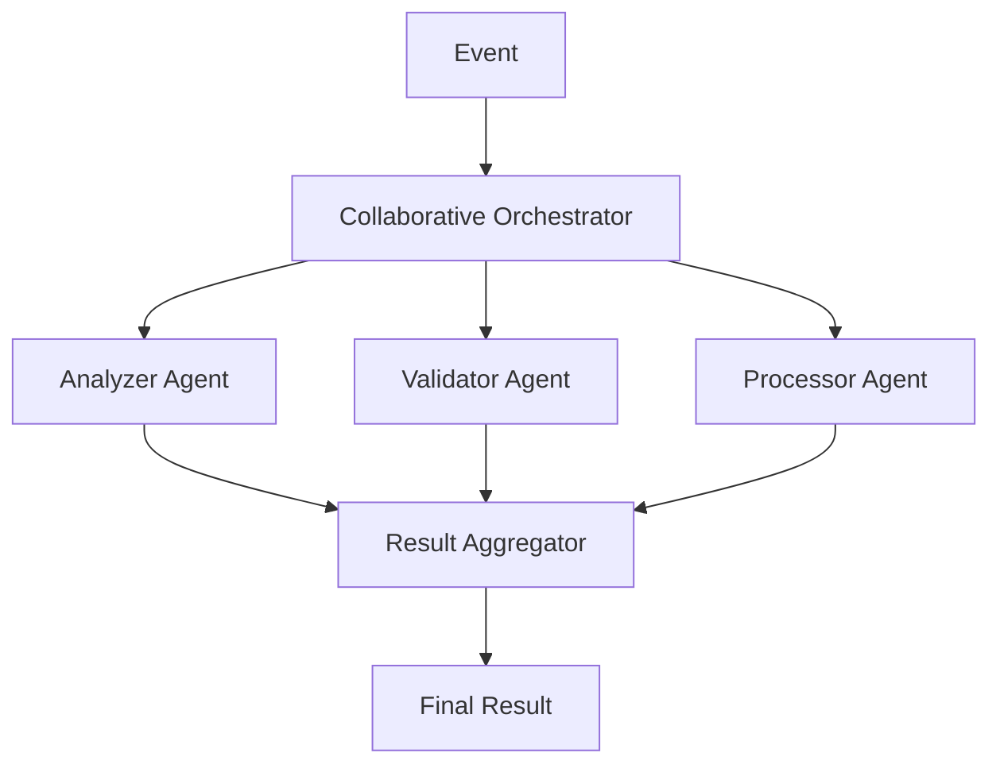
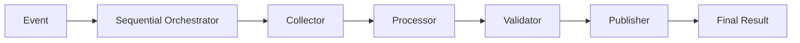
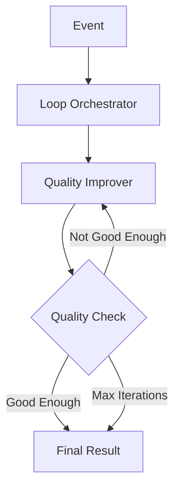
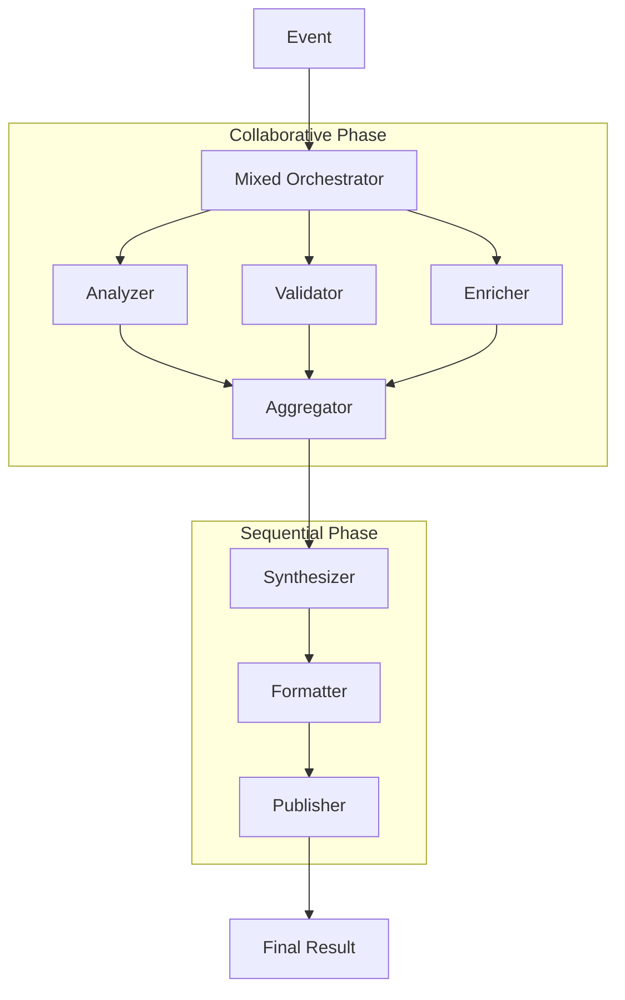

# Orchestration Patterns

Orchestration patterns define how multiple agents coordinate to process events and achieve complex goals. AgenticGoKit provides five distinct orchestration modes, each optimized for different use cases and configured through `agentflow.toml` files.

Understanding orchestration is crucial because it determines how agents collaborate, share workload, and build upon each other's results in multi-agent systems.

## Prerequisites

- Understanding of [Message Passing and Event Flow](./message-passing.md)
- Familiarity with [State Management](./state-management.md)
- Knowledge of [Agent Lifecycle](./agent-lifecycle.md)
- Basic understanding of Go concurrency patterns

## Learning Objectives

By the end of this tutorial, you'll understand:
- All five orchestration modes and their characteristics
- Configuration-based orchestration through `agentflow.toml`
- Performance trade-offs and use case selection
- Advanced orchestration patterns and customization
- Monitoring and debugging orchestrated workflows

## Configuration-Driven Orchestration

### The agentflow.toml Configuration System

AgenticGoKit uses configuration files to define orchestration behavior, making it easy to change patterns without code modifications:

::: code-group

```toml [Basic Configuration]
[agent_flow]
name = "multi-agent-system"
version = "1.0.0"

[llm]
provider = "ollama"
model = "gemma3:1b"
temperature = 0.7

[orchestration]
mode = "collaborative"              # route, collaborative, sequential, loop, mixed
timeout_seconds = 30               # Global timeout for orchestration
max_iterations = 5                 # For loop mode
retry_attempts = 3                 # Retry failed operations

# Mode-specific configurations
collaborative_agents = ["analyzer", "validator", "processor"]
sequential_agents = ["collector", "transformer", "publisher"]
loop_agent = "quality_checker"

[agents.analyzer]
role = "data_analyzer"
system_prompt = "You analyze data for patterns and insights."
enabled = true
capabilities = ["analysis", "pattern_recognition"]

[agents.validator]
role = "data_validator"
system_prompt = "You validate data quality and consistency."
enabled = true
capabilities = ["validation", "quality_check"]

[agents.processor]
role = "data_processor"
system_prompt = "You process and transform data."
enabled = true
capabilities = ["processing", "transformation"]
```

```go [Runner Setup]
package main

import (
    "context"
    "fmt"
    "log"
    "time"
    
    "github.com/kunalkushwaha/agenticgokit/core"
)

func main() {
    // Create runner with configuration - orchestration mode determined by config
    config := core.DefaultRunnerConfig()
    runner := core.NewRunnerWithConfig(config)
    
    // Note: Orchestration patterns are typically configured through
    // the orchestrator setup, not the runner configuration
    
    // Register agent handlers
    err = registerAgents(runner)
    if err != nil {
        log.Fatal("Failed to register agents:", err)
    }
    
    // Start the orchestrated system
    ctx := context.Background()
    err = runner.Start(ctx)
    if err != nil {
        log.Fatal("Failed to start runner:", err)
    }
    defer runner.Stop()
    
    // Emit events - orchestration handles the coordination
    demonstrateOrchestration(runner)
    
    // Keep running to see orchestration in action
    time.Sleep(10 * time.Second)
}

func registerAgents(runner core.Runner) error {
    // Register all agents that might be used in orchestration
    agents := map[string]core.AgentHandler{
        "analyzer":        createAnalyzerAgent(),
        "validator":       createValidatorAgent(),
        "processor":       createProcessorAgent(),
        "collector":       createCollectorAgent(),
        "transformer":     createTransformerAgent(),
        "publisher":       createPublisherAgent(),
        "quality_checker": createQualityCheckerAgent(),
    }
    
    for name, handler := range agents {
        if err := runner.RegisterAgent(name, handler); err != nil {
            return fmt.Errorf("failed to register agent %s: %w", name, err)
        }
    }
    
    return nil
}

func demonstrateOrchestration(runner core.Runner) {
    // Create event - orchestration pattern determined by configuration
    event := core.NewEvent("analyzer", 
        core.EventData{
            "task": "analyze_market_data",
            "dataset": "Q4_sales_data.json",
            "priority": "high",
        }, 
        map[string]string{
            "session_id": "orchestration-demo-001",
            "workflow_id": "market-analysis",
        })
    
    err := runner.Emit(event)
    if err != nil {
        core.Logger().Error().Err(err).Msg("Failed to emit orchestration event")
    }
}
```

:::

### Benefits of Configuration-Based Approach

- **No Code Changes**: Switch orchestration modes by editing TOML files
- **Environment-Specific**: Different configs for dev/staging/production
- **Runtime Flexibility**: Change orchestration without rebuilding
- **Validation**: Built-in validation of orchestration parameters
- **Consistency**: Same configuration format across all projects

## The Five Orchestration Patterns

### 1. Route Pattern (Default)

The simplest orchestration mode where events are routed directly to specific agents based on the target agent ID.

::: code-group

```toml [agentflow.toml]
[orchestration]
mode = "route"
timeout_seconds = 30
```

```go [Usage]
// Route pattern - events go directly to target agents
runner, err := core.NewRunnerFromConfig("agentflow.toml")
if err != nil {
    log.Fatal(err)
}

// Register agents
runner.RegisterAgent("processor", processorAgent)
runner.RegisterAgent("analyzer", analyzerAgent)

// Events are routed based on target agent ID
event := core.NewEvent("processor", 
    core.EventData{"task": "process_data"},
    map[string]string{
        "session_id": "session-123",
        "route": "processor",
    })

runner.Start(ctx)
runner.Emit(event) // Goes directly to "processor" agent
```

:::

**Characteristics:**
- **Direct routing**: Events go straight to the specified agent
- **Low latency**: No orchestration overhead
- **Simple debugging**: Clear event-to-agent mapping
- **High performance**: Minimal coordination required

**Use Cases:**
- Simple request-response scenarios
- Microservice-style architectures
- When agents have distinct, non-overlapping responsibilities

### 2. Collaborative Pattern

All specified agents process the same event in parallel, providing multiple perspectives on the same input.

::: code-group

```toml [agentflow.toml]
[orchestration]
mode = "collaborative"
timeout_seconds = 45
collaborative_agents = ["analyzer", "validator", "processor"]

[agents.analyzer]
role = "data_analyzer"
system_prompt = "You analyze data for patterns and insights."
enabled = true

[agents.validator]
role = "data_validator"
system_prompt = "You validate data quality and accuracy."
enabled = true

[agents.processor]
role = "data_processor"
system_prompt = "You process and transform data."
enabled = true
```

```go [Implementation]
func demonstrateCollaborative(runner core.Runner) {
    // All collaborative agents will process this event
    event := core.NewEvent("analyzer", // Target can be any collaborative agent
        core.EventData{
            "dataset": "customer_data.csv",
            "task": "comprehensive_analysis",
            "priority": "high",
        },
        map[string]string{
            "session_id": "collab-session-001",
            "analysis_type": "comprehensive",
        })
    
    err := runner.Emit(event)
    if err != nil {
        core.Logger().Error().Err(err).Msg("Failed to emit collaborative event")
    }
    
    // All three agents (analyzer, validator, processor) will process this event
    // Results are automatically aggregated by the orchestrator
}
```

:::

**Flow Diagram:**


**Characteristics:**
- **Parallel processing**: All agents work simultaneously
- **Multiple perspectives**: Each agent contributes unique insights
- **Fault tolerance**: System continues if some agents fail
- **Result aggregation**: Outputs are automatically combined

**Use Cases:**
- Multi-expert analysis systems
- Ensemble machine learning approaches
- Quality assurance with multiple validators
- Research systems requiring diverse perspectives
## The Five Orchestration Patterns

### 1. Route Pattern (Default)

The simplest orchestration mode where events are routed directly to specific agents based on the target agent ID.

::: code-group

```toml [agentflow.toml]
[orchestration]
mode = "route"
timeout_seconds = 30
```

```go [Usage]
// Route pattern - events go directly to target agents
runner, err := core.NewRunnerFromConfig("agentflow.toml")
if err != nil {
    log.Fatal(err)
}

// Register agents
runner.RegisterAgent("processor", processorAgent)
runner.RegisterAgent("analyzer", analyzerAgent)

// Events are routed based on target agent ID
event := core.NewEvent("processor", 
    core.EventData{"task": "process_data"},
    map[string]string{
        "session_id": "session-123",
        "route": "processor",
    })

runner.Start(ctx)
runner.Emit(event) // Goes directly to "processor" agent
```

:::

**Characteristics:**
- **Direct routing**: Events go straight to the specified agent
- **Low latency**: No orchestration overhead
- **Simple debugging**: Clear event-to-agent mapping
- **High performance**: Minimal coordination required

**Use Cases:**
- Simple request-response scenarios
- Microservice-style architectures
- When agents have distinct, non-overlapping responsibilities

### 2. Collaborative Pattern

All specified agents process the same event in parallel, providing multiple perspectives on the same input.

::: code-group

```toml [agentflow.toml]
[orchestration]
mode = "collaborative"
timeout_seconds = 45
collaborative_agents = ["analyzer", "validator", "processor"]

[agents.analyzer]
role = "data_analyzer"
system_prompt = "You analyze data for patterns and insights."
enabled = true

[agents.validator]
role = "data_validator"
system_prompt = "You validate data quality and accuracy."
enabled = true

[agents.processor]
role = "data_processor"
system_prompt = "You process and transform data."
enabled = true
```

```go [Implementation]
func demonstrateCollaborative(runner core.Runner) {
    // All collaborative agents will process this event
    event := core.NewEvent("analyzer", // Target can be any collaborative agent
        core.EventData{
            "dataset": "customer_data.csv",
            "task": "comprehensive_analysis",
            "priority": "high",
        },
        map[string]string{
            "session_id": "collab-session-001",
            "analysis_type": "comprehensive",
        })
    
    err := runner.Emit(event)
    if err != nil {
        core.Logger().Error().Err(err).Msg("Failed to emit collaborative event")
    }
    
    // All three agents (analyzer, validator, processor) will process this event
    // Results are automatically aggregated by the orchestrator
}
```

:::

**Flow Diagram:**


**Characteristics:**
- **Parallel processing**: All agents work simultaneously
- **Multiple perspectives**: Each agent contributes unique insights
- **Fault tolerance**: System continues if some agents fail
- **Result aggregation**: Outputs are automatically combined

**Use Cases:**
- Multi-expert analysis systems
- Ensemble machine learning approaches
- Quality assurance with multiple validators
- Research systems requiring diverse perspectives

### 3. Sequential Pattern

Agents process events in a specific order, with each agent building upon the previous agent's output.

::: code-group

```toml [agentflow.toml]
[orchestration]
mode = "sequential"
timeout_seconds = 60
sequential_agents = ["collector", "processor", "validator", "publisher"]

[agents.collector]
role = "data_collector"
system_prompt = "You collect and prepare raw data."
enabled = true

[agents.processor]
role = "data_processor"
system_prompt = "You process and transform collected data."
enabled = true

[agents.validator]
role = "data_validator"
system_prompt = "You validate processed data quality."
enabled = true

[agents.publisher]
role = "data_publisher"
system_prompt = "You format and publish validated data."
enabled = true
```

```go [Pipeline Implementation]
func createDataPipelineAgents() map[string]core.AgentHandler {
    return map[string]core.AgentHandler{
        "collector": core.AgentHandlerFunc(
            func(ctx context.Context, event core.Event, state core.State) (core.AgentResult, error) {
                startTime := time.Now()
                
                // Collect raw data
                rawData, err := collectDataFromSource(ctx, event.GetData())
                if err != nil {
                    return core.AgentResult{}, fmt.Errorf("data collection failed: %w", err)
                }
                
                // Create output state with collected data
                outputState := state.Clone()
                outputState.Set("raw_data", rawData)
                outputState.Set("collection_timestamp", time.Now().Unix())
                outputState.SetMeta("stage", "collection")
                outputState.SetMeta("next_stage", "processing")
                
                return core.AgentResult{
                    OutputState: outputState,
                    StartTime:   startTime,
                    EndTime:     time.Now(),
                    Duration:    time.Since(startTime),
                }, nil
            }),
        
        "processor": core.AgentHandlerFunc(
            func(ctx context.Context, event core.Event, state core.State) (core.AgentResult, error) {
                startTime := time.Now()
                
                // Get raw data from previous stage
                rawData, ok := state.Get("raw_data")
                if !ok {
                    return core.AgentResult{}, fmt.Errorf("no raw data from collection stage")
                }
                
                // Process the data
                processedData, err := processRawData(ctx, rawData)
                if err != nil {
                    return core.AgentResult{}, fmt.Errorf("data processing failed: %w", err)
                }
                
                // Add processed data to state
                outputState := state.Clone()
                outputState.Set("processed_data", processedData)
                outputState.Set("processing_timestamp", time.Now().Unix())
                outputState.SetMeta("stage", "processing")
                outputState.SetMeta("next_stage", "validation")
                
                return core.AgentResult{
                    OutputState: outputState,
                    StartTime:   startTime,
                    EndTime:     time.Now(),
                    Duration:    time.Since(startTime),
                }, nil
            }),
        
        "validator": core.AgentHandlerFunc(
            func(ctx context.Context, event core.Event, state core.State) (core.AgentResult, error) {
                startTime := time.Now()
                
                // Get processed data
                processedData, ok := state.Get("processed_data")
                if !ok {
                    return core.AgentResult{}, fmt.Errorf("no processed data from processing stage")
                }
                
                // Validate the data
                validationResult, err := validateData(ctx, processedData)
                if err != nil {
                    return core.AgentResult{}, fmt.Errorf("data validation failed: %w", err)
                }
                
                // Add validation results
                outputState := state.Clone()
                outputState.Set("validation_result", validationResult)
                outputState.Set("validation_timestamp", time.Now().Unix())
                outputState.SetMeta("stage", "validation")
                outputState.SetMeta("next_stage", "publishing")
                
                return core.AgentResult{
                    OutputState: outputState,
                    StartTime:   startTime,
                    EndTime:     time.Now(),
                    Duration:    time.Since(startTime),
                }, nil
            }),
        
        "publisher": core.AgentHandlerFunc(
            func(ctx context.Context, event core.Event, state core.State) (core.AgentResult, error) {
                startTime := time.Now()
                
                // Get all previous results
                processedData, _ := state.Get("processed_data")
                validationResult, _ := state.Get("validation_result")
                
                // Publish the final result
                publishResult, err := publishData(ctx, processedData, validationResult)
                if err != nil {
                    return core.AgentResult{}, fmt.Errorf("data publishing failed: %w", err)
                }
                
                // Final state
                outputState := state.Clone()
                outputState.Set("publish_result", publishResult)
                outputState.Set("pipeline_complete", true)
                outputState.SetMeta("stage", "complete")
                
                return core.AgentResult{
                    OutputState: outputState,
                    StartTime:   startTime,
                    EndTime:     time.Now(),
                    Duration:    time.Since(startTime),
                }, nil
            }),
    }
}

func demonstrateSequential(runner core.Runner) {
    // Register pipeline agents
    agents := createDataPipelineAgents()
    for name, handler := range agents {
        runner.RegisterAgent(name, handler)
    }
    
    // Start pipeline with initial event
    event := core.NewEvent("collector", // First agent in sequence
        core.EventData{
            "source": "database",
            "query": "SELECT * FROM customers",
            "format": "json",
        },
        map[string]string{
            "session_id": "pipeline-session-001",
            "pipeline_id": "data-processing-v1",
        })
    
    runner.Emit(event)
    // Orchestrator will automatically route through: collector → processor → validator → publisher
}
```

:::

**Flow Diagram:**


**Characteristics:**
- **Ordered execution**: Agents run in specified sequence
- **State propagation**: Each agent builds on previous results
- **Pipeline processing**: Perfect for data transformation workflows
- **Clear data flow**: Easy to understand and debug

**Use Cases:**
- Data processing pipelines
- Document processing workflows
- Multi-stage validation systems
- ETL (Extract, Transform, Load) operations

### 4. Loop Pattern

A single agent processes the same event repeatedly until a completion condition is met or maximum iterations are reached.

::: code-group

```toml [agentflow.toml]
[orchestration]
mode = "loop"
timeout_seconds = 120
max_iterations = 10
loop_agent = "quality_improver"

[agents.quality_improver]
role = "quality_improver"
system_prompt = "You iteratively improve content quality until it meets standards."
enabled = true
```

```go [Loop Implementation]
func createQualityImproverAgent() core.AgentHandler {
    return core.AgentHandlerFunc(
        func(ctx context.Context, event core.Event, state core.State) (core.AgentResult, error) {
            startTime := time.Now()
            
            // Get current content and iteration count
            content, ok := state.Get("content")
            if !ok {
                return core.AgentResult{}, fmt.Errorf("no content to improve")
            }
            
            iteration := 0
            if iter, ok := state.Get("iteration"); ok {
                if iterInt, ok := iter.(int); ok {
                    iteration = iterInt
                }
            }
            
            // Improve the content
            improvedContent, qualityScore, err := improveContent(ctx, content.(string))
            if err != nil {
                return core.AgentResult{}, fmt.Errorf("content improvement failed: %w", err)
            }
            
            // Update state
            outputState := state.Clone()
            outputState.Set("content", improvedContent)
            outputState.Set("iteration", iteration+1)
            outputState.Set("quality_score", qualityScore)
            outputState.Set("improvement_timestamp", time.Now().Unix())
            
            // Check completion condition
            if qualityScore >= 0.95 {
                outputState.Set("loop_complete", true)
                outputState.SetMeta("completion_reason", "quality_threshold_met")
            } else if iteration >= 9 { // Max iterations - 1 (0-based)
                outputState.Set("loop_complete", true)
                outputState.SetMeta("completion_reason", "max_iterations_reached")
            }
            
            outputState.SetMeta("loop_iteration", fmt.Sprintf("%d", iteration+1))
            outputState.SetMeta("quality_score", fmt.Sprintf("%.2f", qualityScore))
            
            core.Logger().Info().
                Int("iteration", iteration+1).
                Float64("quality_score", qualityScore).
                Bool("complete", outputState.Get("loop_complete") != nil).
                Msg("Quality improvement iteration completed")
            
            return core.AgentResult{
                OutputState: outputState,
                StartTime:   startTime,
                EndTime:     time.Now(),
                Duration:    time.Since(startTime),
            }, nil
        })
}

func demonstrateLoop(runner core.Runner) {
    // Register loop agent
    runner.RegisterAgent("quality_improver", createQualityImproverAgent())
    
    // Start loop with initial content
    event := core.NewEvent("quality_improver",
        core.EventData{
            "content": "This is a draft document that needs improvement.",
            "target_quality": 0.95,
            "improvement_type": "comprehensive",
        },
        map[string]string{
            "session_id": "loop-session-001",
            "loop_id": "quality-improvement-v1",
        })
    
    runner.Emit(event)
    // Agent will loop until quality threshold is met or max iterations reached
}

func improveContent(ctx context.Context, content string) (string, float64, error) {
    // Simulate content improvement logic
    improved := fmt.Sprintf("Improved: %s", content)
    qualityScore := 0.7 + (0.1 * rand.Float64()) // Simulate gradual improvement
    return improved, qualityScore, nil
}
```

:::

**Flow Diagram:**


**Characteristics:**
- **Iterative processing**: Same agent runs multiple times
- **Condition-based termination**: Stops when criteria are met
- **Quality improvement**: Perfect for refinement workflows
- **Built-in safeguards**: Maximum iteration limits prevent infinite loops

**Use Cases:**
- Content quality improvement
- Iterative optimization algorithms
- Code review and refinement
- Gradual learning systems

### 5. Mixed Pattern

Combines collaborative and sequential patterns, running collaborative agents first, then sequential agents.

::: code-group

```toml [agentflow.toml]
[orchestration]
mode = "mixed"
timeout_seconds = 90
collaborative_agents = ["analyzer", "validator", "enricher"]
sequential_agents = ["synthesizer", "formatter", "publisher"]

# Collaborative phase agents
[agents.analyzer]
role = "data_analyzer"
system_prompt = "You analyze data for insights and patterns."
enabled = true

[agents.validator]
role = "data_validator"
system_prompt = "You validate data accuracy and completeness."
enabled = true

[agents.enricher]
role = "data_enricher"
system_prompt = "You enrich data with additional context."
enabled = true

# Sequential phase agents
[agents.synthesizer]
role = "data_synthesizer"
system_prompt = "You synthesize analysis results into coherent insights."
enabled = true

[agents.formatter]
role = "report_formatter"
system_prompt = "You format synthesized data into professional reports."
enabled = true

[agents.publisher]
role = "report_publisher"
system_prompt = "You publish formatted reports to appropriate channels."
enabled = true
```

```go [Mixed Implementation]
func demonstrateMixed(runner core.Runner) {
    // Register all agents for mixed orchestration
    collaborativeAgents := map[string]core.AgentHandler{
        "analyzer": createAnalyzerAgent(),
        "validator": createValidatorAgent(),
        "enricher": createEnricherAgent(),
    }
    
    sequentialAgents := map[string]core.AgentHandler{
        "synthesizer": createSynthesizerAgent(),
        "formatter": createFormatterAgent(),
        "publisher": createPublisherAgent(),
    }
    
    // Register all agents
    for name, handler := range collaborativeAgents {
        runner.RegisterAgent(name, handler)
    }
    for name, handler := range sequentialAgents {
        runner.RegisterAgent(name, handler)
    }
    
    // Start mixed orchestration
    event := core.NewEvent("analyzer", // Can target any collaborative agent
        core.EventData{
            "dataset": "market_research_data.json",
            "analysis_type": "comprehensive",
            "output_format": "executive_summary",
        },
        map[string]string{
            "session_id": "mixed-session-001",
            "workflow_id": "market-analysis-v1",
        })
    
    runner.Emit(event)
    
    // Orchestration flow:
    // 1. Collaborative phase: analyzer, validator, enricher run in parallel
    // 2. Results are aggregated
    // 3. Sequential phase: synthesizer → formatter → publisher
}

func createAnalyzerAgent() core.AgentHandler {
    return core.AgentHandlerFunc(
        func(ctx context.Context, event core.Event, state core.State) (core.AgentResult, error) {
            startTime := time.Now()
            
            // Perform analysis
            dataset, _ := event.GetData()["dataset"]
            analysisResult := map[string]interface{}{
                "trends": []string{"upward_trend", "seasonal_pattern"},
                "insights": []string{"market_growth", "customer_preference_shift"},
                "confidence": 0.92,
            }
            
            outputState := state.Clone()
            outputState.Set("analysis_result", analysisResult)
            outputState.SetMeta("analyzer_complete", "true")
            outputState.SetMeta("analysis_confidence", "0.92")
            
            return core.AgentResult{
                OutputState: outputState,
                StartTime:   startTime,
                EndTime:     time.Now(),
                Duration:    time.Since(startTime),
            }, nil
        })
}

func createSynthesizerAgent() core.AgentHandler {
    return core.AgentHandlerFunc(
        func(ctx context.Context, event core.Event, state core.State) (core.AgentResult, error) {
            startTime := time.Now()
            
            // Synthesize results from collaborative phase
            analysisResult, _ := state.Get("analysis_result")
            validationResult, _ := state.Get("validation_result")
            enrichmentResult, _ := state.Get("enrichment_result")
            
            synthesizedReport := map[string]interface{}{
                "executive_summary": "Market shows strong growth potential...",
                "key_findings": []string{"Finding 1", "Finding 2", "Finding 3"},
                "recommendations": []string{"Rec 1", "Rec 2", "Rec 3"},
                "data_sources": []string{"analysis", "validation", "enrichment"},
            }
            
            outputState := state.Clone()
            outputState.Set("synthesized_report", synthesizedReport)
            outputState.SetMeta("synthesis_complete", "true")
            
            return core.AgentResult{
                OutputState: outputState,
                StartTime:   startTime,
                EndTime:     time.Now(),
                Duration:    time.Since(startTime),
            }, nil
        })
}
```

:::

**Flow Diagram:**


**Characteristics:**
- **Two-phase processing**: Collaborative first, then sequential
- **Best of both worlds**: Parallel analysis + ordered processing
- **Complex workflows**: Handles sophisticated business processes
- **Automatic coordination**: Orchestrator manages phase transitions

**Use Cases:**
- Research and reporting workflows
- Multi-expert analysis with structured output
- Complex data processing with validation
- Business intelligence systems

## Pattern Selection Guide

### Decision Matrix

| Requirement | Route | Collaborative | Sequential | Loop | Mixed |
|-------------|-------|---------------|------------|------|-------|
| **Simple routing** | ✅ | ❌ | ❌ | ❌ | ❌ |
| **Multiple perspectives** | ❌ | ✅ | ❌ | ❌ | ✅ |
| **Data pipeline** | ❌ | ❌ | ✅ | ❌ | ✅ |
| **Iterative improvement** | ❌ | ❌ | ❌ | ✅ | ❌ |
| **Complex workflows** | ❌ | ❌ | ❌ | ❌ | ✅ |
| **Low latency** | ✅ | ❌ | ❌ | ❌ | ❌ |
| **High throughput** | ✅ | ✅ | ❌ | ❌ | ⚠️ |
| **Fault tolerance** | ❌ | ✅ | ❌ | ❌ | ✅ |

### Performance Characteristics

| Pattern | Latency | Throughput | Resource Usage | Complexity |
|---------|---------|------------|----------------|------------|
| **Route** | Low | High | Low | Low |
| **Collaborative** | Medium | High | High | Medium |
| **Sequential** | High | Low | Medium | Low |
| **Loop** | Very High | Very Low | Medium | Medium |
| **Mixed** | High | Medium | High | High |
```go
// Sequential processing with error handling
runner, _ := core.NewRunnerFromConfig("agentflow.toml")
_ = runner.RegisterAgent("validator", dataValidatorAgent)
_ = runner.RegisterAgent("transformer", dataTransformerAgent)
_ = runner.RegisterAgent("enricher", dataEnricherAgent)
_ = runner.RegisterAgent("publisher", dataPublisherAgent)
```

### Quality Assurance Loop
```go
// Loop until quality threshold is met
runner, _ := core.NewRunnerFromConfig("agentflow.toml")
_ = runner.RegisterAgent("quality-checker", qualityAgent)
```

## Workflow Visualization

Use the CLI to generate and preview Mermaid diagrams of your orchestration flows.

## API Reference

### CLI Configuration Options

All CLI flags for multi-agent orchestration:

```bash
# Orchestration mode flags
--orchestration-mode string          # collaborative, sequential, loop, mixed
--collaborative-agents string        # Comma-separated list of agents
--sequential-agents string           # Comma-separated list of agents
--loop-agent string                  # Single agent name for loop mode
--max-iterations int                 # Maximum loop iterations (default: 10)

# Configuration flags
--orchestration-timeout int          # Timeout in seconds (default: 60)
--failure-threshold float           # Failure threshold 0.0-1.0 (default: 0.5)
--max-concurrency int              # Maximum concurrent agents (default: 5)

# Visualization flags
--visualize                         # Generate Mermaid diagrams
--visualize-output string           # Custom output directory for diagrams
```

### Orchestration Modes

```go
type OrchestrationMode string

const (
    OrchestrationRoute       OrchestrationMode = "route"       // Route to single agent
    OrchestrationCollaborate OrchestrationMode = "collaborate" // Send to all agents
    OrchestrationSequential  OrchestrationMode = "sequential"  // Process in sequence
    OrchestrationLoop        OrchestrationMode = "loop"        // Loop single agent
    OrchestrationMixed       OrchestrationMode = "mixed"       // Combine patterns
)
```

### Orchestrator Interface

```go
type Orchestrator interface {
    Dispatch(ctx context.Context, event Event) (AgentResult, error)
    RegisterAgent(name string, handler AgentHandler) error
    GetCallbackRegistry() *CallbackRegistry
    Stop()
}
```

## Advanced Configuration Options

### OrchestrationConfig

```go
type OrchestrationConfig struct {
    Timeout          time.Duration  // Overall orchestration timeout
    MaxConcurrency   int           // Maximum concurrent agents
    FailureThreshold float64       // Failure threshold (0.0-1.0)
    RetryPolicy      *RetryPolicy  // Retry configuration
}
```

### RetryPolicy

```go
type RetryPolicy struct {
    MaxRetries      int           // Maximum retry attempts
    InitialDelay    time.Duration // Initial delay before first retry
    MaxDelay        time.Duration // Maximum delay between retries  
    BackoffFactor   float64       // Exponential backoff multiplier
    Jitter          bool          // Add random jitter to delays
    RetryableErrors []string      // List of retryable error codes
}
```

## Convenience Functions

The recommended approach is to construct runners using `core.NewRunnerWithConfig()` with appropriate configuration. Orchestration behavior is controlled through the orchestrator setup and agent registration patterns.

## Migration from Internal APIs

If you were previously using internal orchestrator packages:

1. Replace `internal/orchestrator` imports with `core`
2. Use `core.NewCollaborativeOrchestrator()` instead of internal constructors
3. Update agent handlers to use public `core.AgentHandler` interface
4. Use public `core.Event` and `core.State` types

## Performance Considerations

- Collaborative orchestration runs agents concurrently for better performance
- Configure `MaxConcurrency` to limit resource usage
- Use timeouts to prevent resource leaks
- Monitor agent execution times and optimize slow agents
- Consider using `FailureThreshold` to fail fast when many agents are failing

## Next Steps

- **[Error Handling](error-handling.md)** - Learn advanced error handling patterns
- **[State Management](state-management.md)** - Understand state flow in orchestration
- **[Visualization Guide](../../guides/development/visualization.md)** - Learn workflow visualization
- **[Performance Optimization](../../guides/development/best-practices.md)** - Scale your orchestration

## Troubleshooting

**Common Issues:**

1. **Deadlocks in Mixed Mode**: Ensure proper state management between phases
2. **Memory Leaks in Loop Mode**: Implement proper termination conditions
3. **Timeout Issues**: Adjust timeout values based on your agent complexity
4. **State Corruption**: Use proper state isolation in collaborative mode
5. **Agents Not Registered**: Ensure all agents are registered before dispatching events
6. **Configuration Errors**: Validate your `agentflow.toml` configuration

For more help, see the [Troubleshooting Guide](../../guides/troubleshooting.md).
## A
dvanced Configuration Patterns

### Environment-Specific Configurations

Use different orchestration patterns for different environments:

::: code-group

```toml [development.toml]
[orchestration]
mode = "route"
timeout_seconds = 10
# Simple routing for fast development cycles
```

```toml [staging.toml]
[orchestration]
mode = "collaborative"
timeout_seconds = 30
collaborative_agents = ["analyzer", "validator"]
# Collaborative for testing multi-agent interactions
```

```toml [production.toml]
[orchestration]
mode = "mixed"
timeout_seconds = 60
collaborative_agents = ["analyzer", "validator", "enricher"]
sequential_agents = ["synthesizer", "formatter", "publisher"]
# Full mixed orchestration for production workflows
```

:::

### Dynamic Configuration Loading

Load configurations dynamically based on runtime conditions:

```go
func createRunnerForEnvironment(env string) (core.Runner, error) {
    configFile := fmt.Sprintf("configs/%s.toml", env)
    
    runner, err := core.NewRunnerFromConfig(configFile)
    if err != nil {
        return nil, fmt.Errorf("failed to create runner for %s: %w", env, err)
    }
    
    core.Logger().Info().
        Str("environment", env).
        Str("config_file", configFile).
        Msg("Runner created for environment")
    
    return runner, nil
}

func main() {
    env := os.Getenv("ENVIRONMENT")
    if env == "" {
        env = "development"
    }
    
    runner, err := createRunnerForEnvironment(env)
    if err != nil {
        log.Fatal(err)
    }
    
    // Register agents and start processing
    setupAgents(runner)
    
    ctx := context.Background()
    runner.Start(ctx)
    defer runner.Stop()
}
```

### Conditional Orchestration

Use different patterns based on event characteristics:

```go
func setupConditionalOrchestration() {
    // Create multiple runners for different scenarios
    simpleRunner, _ := core.NewRunnerFromConfig("simple.toml")    // route mode
    complexRunner, _ := core.NewRunnerFromConfig("complex.toml")  // mixed mode
    
    // Route events based on complexity
    eventRouter := func(event core.Event) core.Runner {
        if complexity, ok := event.GetMetadataValue("complexity"); ok {
            switch complexity {
            case "simple":
                return simpleRunner
            case "complex":
                return complexRunner
            }
        }
        return simpleRunner // default
    }
    
    // Use appropriate runner based on event
    event := core.NewEvent("processor",
        core.EventData{"task": "analyze_data"},
        map[string]string{
            "complexity": "complex",
            "session_id": "session-123",
        })
    
    selectedRunner := eventRouter(event)
    selectedRunner.Emit(event)
}
```

## Error Handling in Orchestration

### Pattern-Specific Error Handling

Different orchestration patterns require different error handling strategies:

```go
func setupErrorHandling(runner core.Runner) {
    // Error handling for collaborative patterns
    runner.RegisterCallback(core.HookAgentError, "collaborative-error-handler",
        func(ctx context.Context, args core.CallbackArgs) (core.State, error) {
            // In collaborative mode, continue if some agents fail
            core.Logger().Warn().
                Str("agent", args.AgentID).
                Str("event_id", args.Event.GetID()).
                Err(args.Error).
                Msg("Agent failed in collaborative orchestration")
            
            // Mark agent as failed but continue orchestration
            if args.State != nil {
                args.State.SetMeta(fmt.Sprintf("%s_failed", args.AgentID), "true")
                args.State.SetMeta(fmt.Sprintf("%s_error", args.AgentID), args.Error.Error())
            }
            
            return args.State, nil // Don't propagate error
        })
    
    // Error handling for sequential patterns
    runner.RegisterCallback(core.HookAgentError, "sequential-error-handler",
        func(ctx context.Context, args core.CallbackArgs) (core.State, error) {
            // In sequential mode, failure stops the pipeline
            core.Logger().Error().
                Str("agent", args.AgentID).
                Str("event_id", args.Event.GetID()).
                Err(args.Error).
                Msg("Agent failed in sequential orchestration - stopping pipeline")
            
            // Implement retry logic for sequential failures
            if shouldRetrySequentialFailure(args.Error) {
                retryEvent := createRetryEvent(args.Event, args.AgentID)
                runner.Emit(retryEvent)
            }
            
            return args.State, args.Error // Propagate error to stop pipeline
        })
}

func shouldRetrySequentialFailure(err error) bool {
    // Retry on temporary failures
    errStr := strings.ToLower(err.Error())
    return strings.Contains(errStr, "timeout") ||
           strings.Contains(errStr, "connection") ||
           strings.Contains(errStr, "temporary")
}

func createRetryEvent(originalEvent core.Event, failedAgent string) core.Event {
    metadata := make(map[string]string)
    for k, v := range originalEvent.GetMetadata() {
        metadata[k] = v
    }
    
    // Add retry information
    retryCount := 0
    if retryStr, ok := metadata["retry_count"]; ok {
        if count, err := strconv.Atoi(retryStr); err == nil {
            retryCount = count
        }
    }
    
    metadata["retry_count"] = strconv.Itoa(retryCount + 1)
    metadata["failed_agent"] = failedAgent
    metadata["retry_reason"] = "agent_failure"
    
    return core.NewEvent(failedAgent, originalEvent.GetData(), metadata)
}
```

### Circuit Breaker Pattern

Implement circuit breakers for resilient orchestration:

```go
type CircuitBreaker struct {
    failureCount    int
    successCount    int
    lastFailureTime time.Time
    state          string // "closed", "open", "half-open"
    threshold      int
    timeout        time.Duration
    mu             sync.RWMutex
}

func NewCircuitBreaker(threshold int, timeout time.Duration) *CircuitBreaker {
    return &CircuitBreaker{
        threshold: threshold,
        timeout:   timeout,
        state:     "closed",
    }
}

func (cb *CircuitBreaker) Call(fn func() error) error {
    cb.mu.Lock()
    defer cb.mu.Unlock()
    
    switch cb.state {
    case "open":
        if time.Since(cb.lastFailureTime) > cb.timeout {
            cb.state = "half-open"
            cb.successCount = 0
        } else {
            return fmt.Errorf("circuit breaker is open")
        }
    }
    
    err := fn()
    
    if err != nil {
        cb.failureCount++
        cb.lastFailureTime = time.Now()
        
        if cb.failureCount >= cb.threshold {
            cb.state = "open"
        }
        
        return err
    }
    
    // Success
    cb.successCount++
    if cb.state == "half-open" && cb.successCount >= 3 {
        cb.state = "closed"
        cb.failureCount = 0
    }
    
    return nil
}

// Use circuit breaker in orchestration
func setupCircuitBreaker(runner core.Runner) {
    breakers := make(map[string]*CircuitBreaker)
    
    runner.RegisterCallback(core.HookBeforeAgentRun, "circuit-breaker",
        func(ctx context.Context, args core.CallbackArgs) (core.State, error) {
            agentID := args.AgentID
            
            // Get or create circuit breaker for agent
            if _, exists := breakers[agentID]; !exists {
                breakers[agentID] = NewCircuitBreaker(5, 30*time.Second)
            }
            
            breaker := breakers[agentID]
            
            // Check circuit breaker before agent execution
            err := breaker.Call(func() error {
                // This will be called if circuit is closed/half-open
                return nil
            })
            
            if err != nil {
                return args.State, fmt.Errorf("circuit breaker prevented agent execution: %w", err)
            }
            
            return args.State, nil
        })
}
```

## Monitoring and Observability

### Orchestration Metrics

Track orchestration performance and health:

```go
type OrchestrationMetrics struct {
    EventsProcessed    int64
    AverageLatency     time.Duration
    PatternUsage       map[string]int64
    AgentPerformance   map[string]AgentMetrics
    ErrorRates         map[string]float64
    mu                 sync.RWMutex
}

type AgentMetrics struct {
    ExecutionCount int64
    AverageLatency time.Duration
    ErrorCount     int64
    SuccessRate    float64
}

func NewOrchestrationMetrics() *OrchestrationMetrics {
    return &OrchestrationMetrics{
        PatternUsage:     make(map[string]int64),
        AgentPerformance: make(map[string]AgentMetrics),
        ErrorRates:       make(map[string]float64),
    }
}

func (om *OrchestrationMetrics) RecordEvent(pattern string, duration time.Duration, success bool) {
    om.mu.Lock()
    defer om.mu.Unlock()
    
    om.EventsProcessed++
    om.PatternUsage[pattern]++
    
    // Update average latency
    om.AverageLatency = (om.AverageLatency + duration) / 2
}

func (om *OrchestrationMetrics) RecordAgentExecution(agentID string, duration time.Duration, success bool) {
    om.mu.Lock()
    defer om.mu.Unlock()
    
    metrics := om.AgentPerformance[agentID]
    metrics.ExecutionCount++
    
    if success {
        metrics.AverageLatency = (metrics.AverageLatency + duration) / 2
    } else {
        metrics.ErrorCount++
    }
    
    metrics.SuccessRate = float64(metrics.ExecutionCount-metrics.ErrorCount) / float64(metrics.ExecutionCount)
    om.AgentPerformance[agentID] = metrics
}

func setupMetricsCollection(runner core.Runner, metrics *OrchestrationMetrics) {
    runner.RegisterCallback(core.HookAfterEventHandling, "metrics-collector",
        func(ctx context.Context, args core.CallbackArgs) (core.State, error) {
            // Determine orchestration pattern from metadata
            pattern := "route" // default
            if mode, ok := args.Event.GetMetadataValue("orchestration_mode"); ok {
                pattern = mode
            }
            
            // Calculate event processing duration
            startTime := args.Event.GetTimestamp()
            duration := time.Since(startTime)
            
            // Record metrics
            success := args.Error == nil
            metrics.RecordEvent(pattern, duration, success)
            
            return args.State, nil
        })
    
    runner.RegisterCallback(core.HookAfterAgentRun, "agent-metrics-collector",
        func(ctx context.Context, args core.CallbackArgs) (core.State, error) {
            success := args.Error == nil
            duration := args.AgentResult.Duration
            
            metrics.RecordAgentExecution(args.AgentID, duration, success)
            
            return args.State, nil
        })
}
```

### Distributed Tracing

Implement distributed tracing for complex orchestrations:

```go
func setupDistributedTracing(runner core.Runner) {
    runner.RegisterCallback(core.HookBeforeEventHandling, "trace-start",
        func(ctx context.Context, args core.CallbackArgs) (core.State, error) {
            traceID := generateTraceID()
            
            core.Logger().Info().
                Str("trace_id", traceID).
                Str("event_id", args.Event.GetID()).
                Str("orchestration_start", time.Now().Format(time.RFC3339)).
                Msg("Orchestration trace started")
            
            if args.State != nil {
                args.State.SetMeta("trace_id", traceID)
            }
            
            return args.State, nil
        })
    
    runner.RegisterCallback(core.HookBeforeAgentRun, "agent-trace",
        func(ctx context.Context, args core.CallbackArgs) (core.State, error) {
            traceID, _ := args.State.GetMeta("trace_id")
            spanID := generateSpanID()
            
            core.Logger().Debug().
                Str("trace_id", traceID).
                Str("span_id", spanID).
                Str("agent_id", args.AgentID).
                Str("event_id", args.Event.GetID()).
                Msg("Agent execution span started")
            
            args.State.SetMeta("current_span_id", spanID)
            
            return args.State, nil
        })
    
    runner.RegisterCallback(core.HookAfterAgentRun, "agent-trace-end",
        func(ctx context.Context, args core.CallbackArgs) (core.State, error) {
            traceID, _ := args.State.GetMeta("trace_id")
            spanID, _ := args.State.GetMeta("current_span_id")
            
            core.Logger().Debug().
                Str("trace_id", traceID).
                Str("span_id", spanID).
                Str("agent_id", args.AgentID).
                Dur("duration", args.AgentResult.Duration).
                Bool("success", args.Error == nil).
                Msg("Agent execution span completed")
            
            return args.State, nil
        })
}

func generateTraceID() string {
    return fmt.Sprintf("trace-%d", time.Now().UnixNano())
}

func generateSpanID() string {
    return fmt.Sprintf("span-%d", time.Now().UnixNano())
}
```

## Best Practices and Guidelines

### 1. Pattern Selection Guidelines

**Choose Route Pattern When:**
- You have simple, independent agent responsibilities
- Low latency is critical
- Agents don't need to collaborate
- You want minimal orchestration overhead

**Choose Collaborative Pattern When:**
- You need multiple perspectives on the same data
- Fault tolerance is important
- You want to maximize throughput
- Agents provide complementary analysis

**Choose Sequential Pattern When:**
- You have clear data transformation steps
- Each step depends on the previous one
- You need predictable data flow
- You're building ETL or processing pipelines

**Choose Loop Pattern When:**
- You need iterative improvement
- Quality thresholds must be met
- You have optimization algorithms
- Gradual refinement is required

**Choose Mixed Pattern When:**
- You need both analysis and processing
- Workflows are complex and multi-stage
- You want the benefits of both collaborative and sequential patterns

### 2. Performance Optimization

```go
// Optimize collaborative orchestration
func optimizeCollaborative(runner core.Runner) {
    // Use timeouts to prevent slow agents from blocking
    runner.RegisterCallback(core.HookBeforeAgentRun, "timeout-guard",
        func(ctx context.Context, args core.CallbackArgs) (core.State, error) {
            timeout := 30 * time.Second
            if timeoutStr, ok := args.Event.GetMetadataValue("agent_timeout"); ok {
                if parsedTimeout, err := time.ParseDuration(timeoutStr); err == nil {
                    timeout = parsedTimeout
                }
            }
            
            ctx, cancel := context.WithTimeout(ctx, timeout)
            defer cancel()
            
            return args.State, nil
        })
}

// Optimize sequential orchestration
func optimizeSequential(runner core.Runner) {
    // Implement state compression to reduce memory usage
    runner.RegisterCallback(core.HookAfterAgentRun, "state-compressor",
        func(ctx context.Context, args core.CallbackArgs) (core.State, error) {
            // Remove unnecessary data from state to reduce memory
            if args.AgentResult.OutputState != nil {
                compressedState := compressState(args.AgentResult.OutputState)
                args.AgentResult.OutputState = compressedState
            }
            
            return args.State, nil
        })
}

func compressState(state core.State) core.State {
    // Keep only essential data for next stage
    essentialKeys := []string{"processed_data", "metadata", "session_info"}
    
    compressedState := core.NewState()
    for _, key := range essentialKeys {
        if value, ok := state.Get(key); ok {
            compressedState.Set(key, value)
        }
    }
    
    // Copy all metadata
    for _, key := range state.MetaKeys() {
        if value, ok := state.GetMeta(key); ok {
            compressedState.SetMeta(key, value)
        }
    }
    
    return compressedState
}
```

### 3. Testing Orchestration Patterns

```go
func TestOrchestrationPatterns(t *testing.T) {
    testCases := []struct {
        name           string
        configFile     string
        expectedAgents []string
        expectedMode   string
    }{
        {
            name:           "Collaborative Pattern",
            configFile:     "test-collaborative.toml",
            expectedAgents: []string{"analyzer", "validator", "processor"},
            expectedMode:   "collaborative",
        },
        {
            name:           "Sequential Pattern",
            configFile:     "test-sequential.toml",
            expectedAgents: []string{"collector", "processor", "publisher"},
            expectedMode:   "sequential",
        },
    }
    
    for _, tc := range testCases {
        t.Run(tc.name, func(t *testing.T) {
            runner, err := core.NewRunnerFromConfig(tc.configFile)
            assert.NoError(t, err)
            
            // Register test agents
            for _, agentName := range tc.expectedAgents {
                err := runner.RegisterAgent(agentName, createTestAgent(agentName))
                assert.NoError(t, err)
            }
            
            // Test orchestration
            ctx := context.Background()
            err = runner.Start(ctx)
            assert.NoError(t, err)
            defer runner.Stop()
            
            // Emit test event
            event := core.NewEvent(tc.expectedAgents[0],
                core.EventData{"test": "data"},
                map[string]string{"session_id": "test-session"})
            
            err = runner.Emit(event)
            assert.NoError(t, err)
            
            // Verify orchestration behavior
            // (Add specific assertions based on expected behavior)
        })
    }
}

func createTestAgent(name string) core.AgentHandler {
    return core.AgentHandlerFunc(
        func(ctx context.Context, event core.Event, state core.State) (core.AgentResult, error) {
            startTime := time.Now()
            
            outputState := state.Clone()
            outputState.Set(fmt.Sprintf("%s_processed", name), true)
            outputState.SetMeta(fmt.Sprintf("%s_timestamp", name), time.Now().Format(time.RFC3339))
            
            return core.AgentResult{
                OutputState: outputState,
                StartTime:   startTime,
                EndTime:     time.Now(),
                Duration:    time.Since(startTime),
            }, nil
        })
}
```

## Troubleshooting Common Issues

### 1. Orchestration Not Working

```go
// Debug orchestration configuration
func debugOrchestration(configFile string) {
    runner, err := core.NewRunnerFromConfig(configFile)
    if err != nil {
        core.Logger().Error().Err(err).Msg("Failed to create runner")
        return
    }
    
    // Check registered agents
    // Note: This would require exposing agent registry in the Runner interface
    core.Logger().Info().Msg("Debugging orchestration setup")
    
    // Verify configuration
    core.Logger().Info().Str("config_file", configFile).Msg("Configuration loaded")
}
```

### 2. Performance Issues

```go
// Monitor orchestration performance
func monitorPerformance(runner core.Runner) {
    runner.RegisterCallback(core.HookAfterEventHandling, "performance-monitor",
        func(ctx context.Context, args core.CallbackArgs) (core.State, error) {
            duration := time.Since(args.Event.GetTimestamp())
            
            if duration > 5*time.Second {
                core.Logger().Warn().
                    Str("event_id", args.Event.GetID()).
                    Dur("duration", duration).
                    Msg("Slow orchestration detected")
            }
            
            return args.State, nil
        })
}
```

### 3. Agent Coordination Issues

```go
// Debug agent coordination
func debugAgentCoordination(runner core.Runner) {
    runner.RegisterCallback(core.HookBeforeAgentRun, "coordination-debug",
        func(ctx context.Context, args core.CallbackArgs) (core.State, error) {
            core.Logger().Debug().
                Str("agent", args.AgentID).
                Str("event_id", args.Event.GetID()).
                Interface("state_keys", args.State.Keys()).
                Msg("Agent coordination debug")
            
            return args.State, nil
        })
}
```

## Next Steps

Now that you understand orchestration patterns in AgenticGoKit:

1. **Explore [Error Handling](./error-handling.md)** - Learn resilience patterns for orchestrated systems
2. **Study [Message Passing](./message-passing.md)** - Understand how events flow through orchestration
3. **Review [State Management](./state-management.md)** - See how state flows through different patterns
4. **Check out [Agent Lifecycle](./agent-lifecycle.md)** - Learn how agents participate in orchestration

## Summary

Orchestration patterns in AgenticGoKit provide:

- **Five distinct patterns** for different use cases and requirements
- **Configuration-driven approach** for easy pattern switching
- **Comprehensive error handling** and resilience features
- **Built-in monitoring** and observability capabilities
- **Performance optimization** strategies for each pattern
- **Testing and debugging** tools for complex workflows

Choose the right orchestration pattern based on your specific requirements, and leverage the configuration system to adapt your workflows as they evolve.### 3. 
Sequential Pattern

Agents process events in a specific order, with each agent building upon the previous agent's output.

::: code-group

```toml [agentflow.toml]
[orchestration]
mode = "sequential"
timeout_seconds = 60
sequential_agents = ["collector", "processor", "validator", "publisher"]

[agents.collector]
role = "data_collector"
system_prompt = "You collect and prepare raw data."
enabled = true

[agents.processor]
role = "data_processor"
system_prompt = "You process and transform collected data."
enabled = true

[agents.validator]
role = "data_validator"
system_prompt = "You validate processed data quality."
enabled = true

[agents.publisher]
role = "data_publisher"
system_prompt = "You format and publish validated data."
enabled = true
```

```go [Pipeline Implementation]
func createDataPipelineAgents() map[string]core.AgentHandler {
    return map[string]core.AgentHandler{
        "collector": core.AgentHandlerFunc(
            func(ctx context.Context, event core.Event, state core.State) (core.AgentResult, error) {
                startTime := time.Now()
                
                // Collect raw data
                rawData, err := collectDataFromSource(ctx, event.GetData())
                if err != nil {
                    return core.AgentResult{}, fmt.Errorf("data collection failed: %w", err)
                }
                
                // Create output state with collected data
                outputState := state.Clone()
                outputState.Set("raw_data", rawData)
                outputState.Set("collection_timestamp", time.Now().Unix())
                outputState.SetMeta("stage", "collection")
                outputState.SetMeta("next_stage", "processing")
                
                return core.AgentResult{
                    OutputState: outputState,
                    StartTime:   startTime,
                    EndTime:     time.Now(),
                    Duration:    time.Since(startTime),
                }, nil
            }),
        
        "processor": core.AgentHandlerFunc(
            func(ctx context.Context, event core.Event, state core.State) (core.AgentResult, error) {
                startTime := time.Now()
                
                // Get raw data from previous stage
                rawData, ok := state.Get("raw_data")
                if !ok {
                    return core.AgentResult{}, fmt.Errorf("no raw data from collection stage")
                }
                
                // Process the data
                processedData, err := processRawData(ctx, rawData)
                if err != nil {
                    return core.AgentResult{}, fmt.Errorf("data processing failed: %w", err)
                }
                
                // Add processed data to state
                outputState := state.Clone()
                outputState.Set("processed_data", processedData)
                outputState.Set("processing_timestamp", time.Now().Unix())
                outputState.SetMeta("stage", "processing")
                outputState.SetMeta("next_stage", "validation")
                
                return core.AgentResult{
                    OutputState: outputState,
                    StartTime:   startTime,
                    EndTime:     time.Now(),
                    Duration:    time.Since(startTime),
                }, nil
            }),
        
        "validator": core.AgentHandlerFunc(
            func(ctx context.Context, event core.Event, state core.State) (core.AgentResult, error) {
                startTime := time.Now()
                
                // Get processed data
                processedData, ok := state.Get("processed_data")
                if !ok {
                    return core.AgentResult{}, fmt.Errorf("no processed data from processing stage")
                }
                
                // Validate the data
                validationResult, err := validateData(ctx, processedData)
                if err != nil {
                    return core.AgentResult{}, fmt.Errorf("data validation failed: %w", err)
                }
                
                // Add validation results
                outputState := state.Clone()
                outputState.Set("validation_result", validationResult)
                outputState.Set("validation_timestamp", time.Now().Unix())
                outputState.SetMeta("stage", "validation")
                outputState.SetMeta("next_stage", "publishing")
                
                return core.AgentResult{
                    OutputState: outputState,
                    StartTime:   startTime,
                    EndTime:     time.Now(),
                    Duration:    time.Since(startTime),
                }, nil
            }),
        
        "publisher": core.AgentHandlerFunc(
            func(ctx context.Context, event core.Event, state core.State) (core.AgentResult, error) {
                startTime := time.Now()
                
                // Get all previous results
                processedData, _ := state.Get("processed_data")
                validationResult, _ := state.Get("validation_result")
                
                // Publish the final result
                publishResult, err := publishData(ctx, processedData, validationResult)
                if err != nil {
                    return core.AgentResult{}, fmt.Errorf("data publishing failed: %w", err)
                }
                
                // Final state
                outputState := state.Clone()
                outputState.Set("publish_result", publishResult)
                outputState.Set("pipeline_complete", true)
                outputState.SetMeta("stage", "complete")
                
                return core.AgentResult{
                    OutputState: outputState,
                    StartTime:   startTime,
                    EndTime:     time.Now(),
                    Duration:    time.Since(startTime),
                }, nil
            }),
    }
}

func demonstrateSequential(runner core.Runner) {
    // Register pipeline agents
    agents := createDataPipelineAgents()
    for name, handler := range agents {
        runner.RegisterAgent(name, handler)
    }
    
    // Start pipeline with initial event
    event := core.NewEvent("collector", // First agent in sequence
        core.EventData{
            "source": "database",
            "query": "SELECT * FROM customers",
            "format": "json",
        },
        map[string]string{
            "session_id": "pipeline-session-001",
            "pipeline_id": "data-processing-v1",
        })
    
    runner.Emit(event)
    // Orchestrator will automatically route through: collector → processor → validator → publisher
}
```

:::

**Flow Diagram:**


**Characteristics:**
- **Ordered execution**: Agents run in specified sequence
- **State propagation**: Each agent builds on previous results
- **Pipeline processing**: Perfect for data transformation workflows
- **Clear data flow**: Easy to understand and debug

**Use Cases:**
- Data processing pipelines
- Document processing workflows
- Multi-stage validation systems
- ETL (Extract, Transform, Load) operations

### 4. Loop Pattern

A single agent processes the same event repeatedly until a completion condition is met or maximum iterations are reached.

::: code-group

```toml [agentflow.toml]
[orchestration]
mode = "loop"
timeout_seconds = 120
max_iterations = 10
loop_agent = "quality_improver"

[agents.quality_improver]
role = "quality_improver"
system_prompt = "You iteratively improve content quality until it meets standards."
enabled = true
```

```go [Loop Implementation]
func createQualityImproverAgent() core.AgentHandler {
    return core.AgentHandlerFunc(
        func(ctx context.Context, event core.Event, state core.State) (core.AgentResult, error) {
            startTime := time.Now()
            
            // Get current content and iteration count
            content, ok := state.Get("content")
            if !ok {
                return core.AgentResult{}, fmt.Errorf("no content to improve")
            }
            
            iteration := 0
            if iter, ok := state.Get("iteration"); ok {
                if iterInt, ok := iter.(int); ok {
                    iteration = iterInt
                }
            }
            
            // Improve the content
            improvedContent, qualityScore, err := improveContent(ctx, content.(string))
            if err != nil {
                return core.AgentResult{}, fmt.Errorf("content improvement failed: %w", err)
            }
            
            // Update state
            outputState := state.Clone()
            outputState.Set("content", improvedContent)
            outputState.Set("iteration", iteration+1)
            outputState.Set("quality_score", qualityScore)
            outputState.Set("improvement_timestamp", time.Now().Unix())
            
            // Check completion condition
            if qualityScore >= 0.95 {
                outputState.Set("loop_complete", true)
                outputState.SetMeta("completion_reason", "quality_threshold_met")
            } else if iteration >= 9 { // Max iterations - 1 (0-based)
                outputState.Set("loop_complete", true)
                outputState.SetMeta("completion_reason", "max_iterations_reached")
            }
            
            outputState.SetMeta("loop_iteration", fmt.Sprintf("%d", iteration+1))
            outputState.SetMeta("quality_score", fmt.Sprintf("%.2f", qualityScore))
            
            core.Logger().Info().
                Int("iteration", iteration+1).
                Float64("quality_score", qualityScore).
                Bool("complete", outputState.Get("loop_complete") != nil).
                Msg("Quality improvement iteration completed")
            
            return core.AgentResult{
                OutputState: outputState,
                StartTime:   startTime,
                EndTime:     time.Now(),
                Duration:    time.Since(startTime),
            }, nil
        })
}

func demonstrateLoop(runner core.Runner) {
    // Register loop agent
    runner.RegisterAgent("quality_improver", createQualityImproverAgent())
    
    // Start loop with initial content
    event := core.NewEvent("quality_improver",
        core.EventData{
            "content": "This is a draft document that needs improvement.",
            "target_quality": 0.95,
            "improvement_type": "comprehensive",
        },
        map[string]string{
            "session_id": "loop-session-001",
            "loop_id": "quality-improvement-v1",
        })
    
    runner.Emit(event)
    // Agent will loop until quality threshold is met or max iterations reached
}

func improveContent(ctx context.Context, content string) (string, float64, error) {
    // Simulate content improvement logic
    improved := fmt.Sprintf("Improved: %s", content)
    qualityScore := 0.7 + (0.1 * rand.Float64()) // Simulate gradual improvement
    return improved, qualityScore, nil
}
```

:::

**Flow Diagram:**


**Characteristics:**
- **Iterative processing**: Same agent runs multiple times
- **Condition-based termination**: Stops when criteria are met
- **Quality improvement**: Perfect for refinement workflows
- **Built-in safeguards**: Maximum iteration limits prevent infinite loops

**Use Cases:**
- Content quality improvement
- Iterative optimization algorithms
- Code review and refinement
- Gradual learning systems

### 5. Mixed Pattern

Combines collaborative and sequential patterns, running collaborative agents first, then sequential agents.

::: code-group

```toml [agentflow.toml]
[orchestration]
mode = "mixed"
timeout_seconds = 90
collaborative_agents = ["analyzer", "validator", "enricher"]
sequential_agents = ["synthesizer", "formatter", "publisher"]

# Collaborative phase agents
[agents.analyzer]
role = "data_analyzer"
system_prompt = "You analyze data for insights and patterns."
enabled = true

[agents.validator]
role = "data_validator"
system_prompt = "You validate data accuracy and completeness."
enabled = true

[agents.enricher]
role = "data_enricher"
system_prompt = "You enrich data with additional context."
enabled = true

# Sequential phase agents
[agents.synthesizer]
role = "data_synthesizer"
system_prompt = "You synthesize analysis results into coherent insights."
enabled = true

[agents.formatter]
role = "report_formatter"
system_prompt = "You format synthesized data into professional reports."
enabled = true

[agents.publisher]
role = "report_publisher"
system_prompt = "You publish formatted reports to appropriate channels."
enabled = true
```

```go [Mixed Implementation]
func demonstrateMixed(runner core.Runner) {
    // Register all agents for mixed orchestration
    collaborativeAgents := map[string]core.AgentHandler{
        "analyzer": createAnalyzerAgent(),
        "validator": createValidatorAgent(),
        "enricher": createEnricherAgent(),
    }
    
    sequentialAgents := map[string]core.AgentHandler{
        "synthesizer": createSynthesizerAgent(),
        "formatter": createFormatterAgent(),
        "publisher": createPublisherAgent(),
    }
    
    // Register all agents
    for name, handler := range collaborativeAgents {
        runner.RegisterAgent(name, handler)
    }
    for name, handler := range sequentialAgents {
        runner.RegisterAgent(name, handler)
    }
    
    // Start mixed orchestration
    event := core.NewEvent("analyzer", // Can target any collaborative agent
        core.EventData{
            "dataset": "market_research_data.json",
            "analysis_type": "comprehensive",
            "output_format": "executive_summary",
        },
        map[string]string{
            "session_id": "mixed-session-001",
            "workflow_id": "market-analysis-v1",
        })
    
    runner.Emit(event)
    
    // Orchestration flow:
    // 1. Collaborative phase: analyzer, validator, enricher run in parallel
    // 2. Results are aggregated
    // 3. Sequential phase: synthesizer → formatter → publisher
}

func createAnalyzerAgent() core.AgentHandler {
    return core.AgentHandlerFunc(
        func(ctx context.Context, event core.Event, state core.State) (core.AgentResult, error) {
            startTime := time.Now()
            
            // Perform analysis
            dataset, _ := event.GetData()["dataset"]
            analysisResult := map[string]interface{}{
                "trends": []string{"upward_trend", "seasonal_pattern"},
                "insights": []string{"market_growth", "customer_preference_shift"},
                "confidence": 0.92,
            }
            
            outputState := state.Clone()
            outputState.Set("analysis_result", analysisResult)
            outputState.SetMeta("analyzer_complete", "true")
            outputState.SetMeta("analysis_confidence", "0.92")
            
            return core.AgentResult{
                OutputState: outputState,
                StartTime:   startTime,
                EndTime:     time.Now(),
                Duration:    time.Since(startTime),
            }, nil
        })
}

func createSynthesizerAgent() core.AgentHandler {
    return core.AgentHandlerFunc(
        func(ctx context.Context, event core.Event, state core.State) (core.AgentResult, error) {
            startTime := time.Now()
            
            // Synthesize results from collaborative phase
            analysisResult, _ := state.Get("analysis_result")
            validationResult, _ := state.Get("validation_result")
            enrichmentResult, _ := state.Get("enrichment_result")
            
            synthesizedReport := map[string]interface{}{
                "executive_summary": "Market shows strong growth potential...",
                "key_findings": []string{"Finding 1", "Finding 2", "Finding 3"},
                "recommendations": []string{"Rec 1", "Rec 2", "Rec 3"},
                "data_sources": []string{"analysis", "validation", "enrichment"},
            }
            
            outputState := state.Clone()
            outputState.Set("synthesized_report", synthesizedReport)
            outputState.SetMeta("synthesis_complete", "true")
            
            return core.AgentResult{
                OutputState: outputState,
                StartTime:   startTime,
                EndTime:     time.Now(),
                Duration:    time.Since(startTime),
            }, nil
        })
}
```

:::

**Flow Diagram:**


**Characteristics:**
- **Two-phase processing**: Collaborative first, then sequential
- **Best of both worlds**: Parallel analysis + ordered processing
- **Complex workflows**: Handles sophisticated business processes
- **Automatic coordination**: Orchestrator manages phase transitions

**Use Cases:**
- Research and reporting workflows
- Multi-expert analysis with structured output
- Complex data processing with validation
- Business intelligence systems## 
Pattern Selection Guide

### Decision Matrix

| Requirement | Route | Collaborative | Sequential | Loop | Mixed |
|-------------|-------|---------------|------------|------|-------|
| **Simple routing** | ✅ | ❌ | ❌ | ❌ | ❌ |
| **Multiple perspectives** | ❌ | ✅ | ❌ | ❌ | ✅ |
| **Data pipeline** | ❌ | ❌ | ✅ | ❌ | ✅ |
| **Iterative improvement** | ❌ | ❌ | ❌ | ✅ | ❌ |
| **Complex workflows** | ❌ | ❌ | ❌ | ❌ | ✅ |
| **Low latency** | ✅ | ❌ | ❌ | ❌ | ❌ |
| **High throughput** | ✅ | ✅ | ❌ | ❌ | ⚠️ |
| **Fault tolerance** | ❌ | ✅ | ❌ | ❌ | ✅ |

### Performance Characteristics

| Pattern | Latency | Throughput | Resource Usage | Complexity |
|---------|---------|------------|----------------|------------|
| **Route** | Low | High | Low | Low |
| **Collaborative** | Medium | High | High | Medium |
| **Sequential** | High | Low | Medium | Low |
| **Loop** | Very High | Very Low | Medium | Medium |
| **Mixed** | High | Medium | High | High |

### Selection Guidelines

Choose your orchestration pattern based on these criteria:

**Route Pattern** when:
- You have simple, independent tasks
- Each agent has a specific, non-overlapping responsibility
- You need maximum performance and minimal latency
- Debugging and monitoring simplicity is important

**Collaborative Pattern** when:
- You need multiple expert opinions on the same data
- Fault tolerance is critical (some agents can fail)
- You want to leverage ensemble approaches
- Different agents provide complementary insights

**Sequential Pattern** when:
- You have a clear data transformation pipeline
- Each step depends on the previous step's output
- You need ordered, predictable processing
- Data flows through distinct processing stages

**Loop Pattern** when:
- You need iterative refinement or improvement
- Quality thresholds must be met
- Gradual optimization is required
- You have convergence criteria

**Mixed Pattern** when:
- You need both parallel analysis and ordered processing
- Complex business workflows require multiple phases
- You want comprehensive analysis followed by structured output
- Maximum flexibility and capability is required

## Advanced Orchestration Patterns

### Dynamic Pattern Switching

Switch orchestration patterns at runtime based on conditions:

```go
func createDynamicRunner(configPath string) (core.Runner, error) {
    // Load base configuration
    runner, err := core.NewRunnerFromConfig(configPath)
    if err != nil {
        return nil, err
    }
    
    // Add callback to switch patterns based on event metadata
    runner.RegisterCallback(core.HookBeforeEventHandling, "pattern-switcher",
        func(ctx context.Context, args core.CallbackArgs) (core.State, error) {
            // Check if event requests specific orchestration
            if pattern, exists := args.Event.GetMetadata()["orchestration_override"]; exists {
                // Dynamically switch orchestration pattern
                // Note: This would require custom orchestrator implementation
                core.Logger().Info().
                    Str("requested_pattern", pattern).
                    Str("event_id", args.Event.GetID()).
                    Msg("Switching orchestration pattern")
            }
            
            return args.State, nil
        })
    
    return runner, nil
}
```

### Conditional Orchestration

Use callbacks to implement conditional orchestration logic:

```go
func setupConditionalOrchestration(runner core.Runner) {
    // Route based on data characteristics
    runner.RegisterCallback(core.HookBeforeEventHandling, "conditional-router",
        func(ctx context.Context, args core.CallbackArgs) (core.State, error) {
            data := args.Event.GetData()
            
            // Route based on data size
            if dataSize, ok := data["size"]; ok {
                if size, ok := dataSize.(int); ok {
                    var targetPattern string
                    switch {
                    case size < 1000:
                        targetPattern = "route"
                    case size < 10000:
                        targetPattern = "collaborative"
                    default:
                        targetPattern = "sequential"
                    }
                    
                    // Add routing hint to state
                    enrichedState := args.State.Clone()
                    enrichedState.SetMeta("suggested_pattern", targetPattern)
                    enrichedState.SetMeta("routing_reason", fmt.Sprintf("data_size: %d", size))
                    
                    return enrichedState, nil
                }
            }
            
            return args.State, nil
        })
}
```

### Nested Orchestration

Implement orchestration within orchestration for complex workflows:

```go
func createNestedOrchestrationExample() {
    // Main orchestrator uses sequential pattern
    mainRunner, _ := core.NewRunnerFromConfig("main-sequential.toml")
    
    // Sub-orchestrator for collaborative analysis
    analysisRunner, _ := core.NewRunnerFromConfig("analysis-collaborative.toml")
    
    // Create nested agent that uses sub-orchestrator
    nestedAgent := core.AgentHandlerFunc(
        func(ctx context.Context, event core.Event, state core.State) (core.AgentResult, error) {
            startTime := time.Now()
            
            // Use sub-orchestrator for complex analysis
            analysisEvent := core.NewEvent("analyzer",
                event.GetData(),
                map[string]string{
                    "session_id": event.GetSessionID(),
                    "parent_event_id": event.GetID(),
                })
            
            // Emit to sub-orchestrator
            err := analysisRunner.Emit(analysisEvent)
            if err != nil {
                return core.AgentResult{}, fmt.Errorf("nested orchestration failed: %w", err)
            }
            
            // Wait for sub-orchestrator results (simplified)
            // In practice, you'd use proper synchronization
            time.Sleep(2 * time.Second)
            
            // Create result state
            outputState := state.Clone()
            outputState.Set("nested_analysis_complete", true)
            outputState.SetMeta("nested_orchestration", "collaborative")
            
            return core.AgentResult{
                OutputState: outputState,
                StartTime:   startTime,
                EndTime:     time.Now(),
                Duration:    time.Since(startTime),
            }, nil
        })
    
    mainRunner.RegisterAgent("nested_analyzer", nestedAgent)
}
```

## Error Handling in Orchestration

### Orchestration-Specific Error Patterns

Different patterns have different error characteristics:

```go
func setupOrchestrationErrorHandling(runner core.Runner) {
    runner.RegisterCallback(core.HookAgentError, "orchestration-error-handler",
        func(ctx context.Context, args core.CallbackArgs) (core.State, error) {
            // Get orchestration mode from configuration
            orchestrationMode := getOrchestrationMode(runner)
            
            switch orchestrationMode {
            case "collaborative":
                // In collaborative mode, continue if some agents succeed
                return handleCollaborativeError(args)
            case "sequential":
                // In sequential mode, stop the pipeline on error
                return handleSequentialError(args)
            case "loop":
                // In loop mode, retry with backoff
                return handleLoopError(args)
            default:
                return args.State, nil
            }
        })
}

func handleCollaborativeError(args core.CallbackArgs) (core.State, error) {
    // Mark this agent as failed but continue with others
    errorState := args.State.Clone()
    errorState.SetMeta(fmt.Sprintf("%s_failed", args.AgentID), "true")
    errorState.SetMeta(fmt.Sprintf("%s_error", args.AgentID), args.Error.Error())
    
    core.Logger().Warn().
        Str("agent", args.AgentID).
        Err(args.Error).
        Msg("Collaborative agent failed, continuing with others")
    
    return errorState, nil
}

func handleSequentialError(args core.CallbackArgs) (core.State, error) {
    // Stop the entire pipeline
    errorState := args.State.Clone()
    errorState.Set("pipeline_failed", true)
    errorState.Set("failed_stage", args.AgentID)
    errorState.SetMeta("pipeline_error", args.Error.Error())
    
    core.Logger().Error().
        Str("agent", args.AgentID).
        Err(args.Error).
        Msg("Sequential pipeline failed")
    
    return errorState, fmt.Errorf("pipeline failed at stage %s: %w", args.AgentID, args.Error)
}

func handleLoopError(args core.CallbackArgs) (core.State, error) {
    // Implement retry logic for loop pattern
    retryCount := 0
    if count, ok := args.State.Get("retry_count"); ok {
        if countInt, ok := count.(int); ok {
            retryCount = countInt
        }
    }
    
    if retryCount < 3 {
        // Retry the loop iteration
        retryState := args.State.Clone()
        retryState.Set("retry_count", retryCount+1)
        retryState.SetMeta("last_error", args.Error.Error())
        
        core.Logger().Warn().
            Int("retry_count", retryCount+1).
            Err(args.Error).
            Msg("Loop iteration failed, retrying")
        
        return retryState, nil
    }
    
    // Max retries exceeded
    return args.State, fmt.Errorf("loop failed after %d retries: %w", retryCount, args.Error)
}
```

## Monitoring and Observability

### Orchestration Metrics

Track orchestration-specific metrics:

```go
func setupOrchestrationMonitoring(runner core.Runner) {
    // Track orchestration performance
    runner.RegisterCallback(core.HookAfterEventHandling, "orchestration-metrics",
        func(ctx context.Context, args core.CallbackArgs) (core.State, error) {
            orchestrationMode := getOrchestrationMode(runner)
            
            // Log orchestration completion
            core.Logger().Info().
                Str("orchestration_mode", orchestrationMode).
                Str("event_id", args.Event.GetID()).
                Str("session_id", args.Event.GetSessionID()).
                Dur("total_duration", time.Since(args.Event.GetTimestamp())).
                Msg("Orchestration completed")
            
            // Add metrics to state
            metricsState := args.State.Clone()
            metricsState.SetMeta("orchestration_mode", orchestrationMode)
            metricsState.SetMeta("completion_time", time.Now().Format(time.RFC3339))
            
            return metricsState, nil
        })
    
    // Track agent participation in orchestration
    runner.RegisterCallback(core.HookAfterAgentRun, "agent-participation",
        func(ctx context.Context, args core.CallbackArgs) (core.State, error) {
            participationState := args.State.Clone()
            participationState.SetMeta(fmt.Sprintf("%s_participated", args.AgentID), "true")
            participationState.SetMeta(fmt.Sprintf("%s_duration", args.AgentID), args.AgentResult.Duration.String())
            
            return participationState, nil
        })
}
```

## Best Practices

### Configuration Management

- **Environment-specific configs**: Use different TOML files for dev/staging/production
- **Version control**: Track configuration changes alongside code
- **Validation**: Always validate configurations before deployment
- **Documentation**: Document the purpose and trade-offs of each orchestration choice

### Performance Optimization

- **Resource allocation**: Consider CPU and memory usage for each pattern
- **Timeout tuning**: Set appropriate timeouts for each orchestration mode
- **Batch processing**: Use collaborative patterns for batch operations
- **Caching**: Implement state caching for expensive operations

### Testing Strategies

- **Unit testing**: Test individual agents in isolation
- **Integration testing**: Test complete orchestration flows
- **Load testing**: Verify performance under expected load
- **Chaos testing**: Test failure scenarios and recovery

### Debugging and Troubleshooting

- **Structured logging**: Use consistent log formats across all agents
- **Correlation IDs**: Track events through complex orchestrations
- **State inspection**: Log state changes at key points
- **Performance profiling**: Monitor resource usage and bottlenecks

## Next Steps

Now that you understand orchestration patterns, explore:

- [Error Handling](./error-handling.md) - Learn about comprehensive error management
- [State Management](./state-management.md) - Deep dive into state handling across patterns
- [Message Passing](./message-passing.md) - Understand event flow in orchestrated systems
- [Agent Lifecycle](./agent-lifecycle.md) - Learn how agents work within orchestration

## Summary

Orchestration patterns in AgenticGoKit provide powerful ways to coordinate multiple agents:

- **Route**: Simple, fast, direct agent targeting
- **Collaborative**: Parallel processing with multiple perspectives
- **Sequential**: Ordered pipeline processing
- **Loop**: Iterative improvement and refinement
- **Mixed**: Complex workflows combining collaborative and sequential phases

Choose the right pattern based on your use case, performance requirements, and complexity tolerance. Use configuration-driven orchestration to maintain flexibility and enable easy pattern switching without code changes.