# Multi-Agent Orchestration Patterns

## Overview

AgenticGoKit provides powerful multi-agent orchestration patterns that enable you to build complex workflows with multiple agents working together. The system supports various orchestration modes and includes built-in workflow visualization using Mermaid diagrams.

## Prerequisites

- Understanding of [Agent Lifecycle](agent-lifecycle.md)
- Familiarity with [State Management](state-management.md)
- Basic knowledge of Go concurrency

## Learning Objectives

By the end of this tutorial, you'll understand:
- Different orchestration patterns and their use cases
- How to configure each orchestration mode using CLI and configuration files
- Performance characteristics of each pattern
- When to use which pattern
- How to visualize your orchestration workflows

## CLI Quick Start

The fastest way to create multi-agent workflows is using the AgentFlow CLI:

```bash
# Collaborative workflow - all agents process events in parallel
agentcli create research-system \
  --orchestration-mode collaborative \
  --agents 3 \
  --orchestration-timeout 60 \
  --visualize \
  --mcp-enabled

# Sequential pipeline - agents process one after another
agentcli create data-pipeline \
  --orchestration-mode sequential \
  --sequential-agents "collector,processor,formatter" \
  --orchestration-timeout 45 \
  --visualize-output "docs/diagrams"

# Loop-based workflow - single agent repeats with conditions
agentcli create quality-loop \
  --orchestration-mode loop \
  --loop-agent "quality-checker" \
  --max-iterations 5 \
  --orchestration-timeout 120 \
  --visualize

# Mixed orchestration - combine collaborative and sequential
agentcli create complex-workflow \
  --orchestration-mode mixed \
  --collaborative-agents "analyzer,validator" \
  --sequential-agents "processor,reporter" \
  --orchestration-timeout 90 \
  --visualize
```

All generated projects use **configuration-based orchestration** via `agentflow.toml`, making it easy to modify orchestration patterns without changing code.

## Configuration-Based Orchestration

AgentFlow supports configuration-driven orchestration through `agentflow.toml` files. This approach allows you to change orchestration patterns without modifying code.

### agentflow.toml Configuration

```toml
[orchestration]
mode = "sequential"                    # sequential, collaborative, loop, mixed, route
timeout_seconds = 30                   # Timeout for orchestration operations
max_iterations = 5                     # Maximum iterations for loop mode

# Sequential mode: agents process in order
sequential_agents = ["agent1", "agent2", "agent3"]

# Collaborative mode: agents process in parallel  
collaborative_agents = ["analyzer", "validator", "processor"]

# Loop mode: single agent repeats
loop_agent = "processor"

# Mixed mode: combine collaborative and sequential
# collaborative_agents = ["analyzer", "validator"]
# sequential_agents = ["processor", "reporter"]
```

### Using Configuration-Based Runners

Generated projects automatically use configuration-based orchestration:

```go
// Load configuration from agentflow.toml
config, err := core.LoadConfigFromWorkingDir()
if err != nil {
    log.Fatal(err)
}

// Create provider from configuration
provider, err := config.InitializeProvider()
if err != nil {
    log.Fatal(err)
}

// Create agents
agents := map[string]core.AgentHandler{
    "agent1": core.NewLLMAgent("agent1", provider),
    "agent2": core.NewLLMAgent("agent2", provider),
    "agent3": core.NewLLMAgent("agent3", provider),
}

// Create runner with orchestration from config
var runner core.Runner
switch config.Orchestration.Mode {
case "collaborative":
    runner = core.CreateCollaborativeRunner(agents, 
        time.Duration(config.Orchestration.TimeoutSeconds)*time.Second)
case "sequential":
    runner = core.NewOrchestrationBuilder(core.OrchestrationSequential).
        WithAgents(agents).
        WithTimeout(time.Duration(config.Orchestration.TimeoutSeconds)*time.Second).
        Build()
default:
    runner = core.CreateRouteRunner(agents)
}

// Start the runner
ctx := context.Background()
if err := runner.Start(ctx); err != nil {
    log.Fatal(err)
}
defer runner.Stop()
```

### Benefits of Configuration-Based Approach

- **No Code Changes**: Switch orchestration modes by editing TOML files
- **Environment-Specific**: Different configs for dev/staging/production
- **Runtime Flexibility**: Change orchestration without rebuilding
- **Validation**: Built-in validation of orchestration parameters
- **Consistency**: Same configuration format across all projects

## Orchestration Patterns

### 1. Route Pattern (Default)

**Use Case**: Simple request-response scenarios where each event goes to a specific agent.

```go
// Route orchestration (default)
runner := core.NewRunner()
runner.RegisterAgent("research", researchAgent)
runner.RegisterAgent("analysis", analysisAgent)

// Events are routed to specific agents based on routing metadata
event := core.NewEvent("research", data)
event.SetMeta(core.RouteMetadataKey, "research") // Routes to research agent
```

**Characteristics**:
- Single agent processes each event
- Fast and efficient for simple scenarios
- No coordination overhead
- Easy to debug and understand

### 2. Collaborative Pattern

**Use Case**: When you need multiple perspectives or parallel processing of the same input.

Think of collaborative orchestration like a research team where multiple experts examine the same problem from different angles and contribute their unique insights to create a comprehensive solution.

```go
// Collaborative orchestration - all agents process the same event
agents := map[string]core.AgentHandler{
    "researcher": NewResearchAgent(),
    "analyzer":   NewAnalysisAgent(),
    "validator":  NewValidationAgent(),
}

runner := core.CreateCollaborativeRunner(agents, 30*time.Second)

// All agents process the event in parallel
event := core.NewEvent("analyze", data)
result, err := runner.ProcessEvent(ctx, event)
```

**Flow Diagram**:
```
                ┌─────────────┐
                │ Researcher  │
                └─────────────┘
                      ▲
                      │
┌─────────┐     ┌──────────────┐
│ Client  │────▶│ Collaborative│
└─────────┘     │ Orchestrator │
                └──────────────┘
                      │
                      ▼
                ┌─────────────┐
                │  Analyzer   │
                └─────────────┘
                      │
                      ▼
                ┌─────────────┐
                │  Validator  │
                └─────────────┘
```

**Characteristics**:
- All agents process the same event simultaneously
- Results are automatically aggregated
- Higher throughput for complex analysis
- Built-in fault tolerance
- Perfect for ensemble approaches and multiple perspectives

### 3. Sequential Pattern

**Use Case**: Data processing pipelines where each step builds on the previous.

Think of sequential orchestration like an assembly line where each worker (agent) performs a specific task and passes the work to the next worker in line, with each step adding value to the final product.

```go
// Sequential orchestration - agents process in order
runner := core.NewOrchestrationBuilder(core.OrchestrationSequential).
    WithAgents(map[string]core.AgentHandler{
        "collector":  NewCollectorAgent(),
        "processor":  NewProcessorAgent(),
        "formatter":  NewFormatterAgent(),
    }).
    WithSequentialOrder([]string{"collector", "processor", "formatter"}).
    Build()
```

**Flow Diagram**:
```
┌─────────┐     ┌──────────┐     ┌─────────┐     ┌─────────┐     ┌─────────┐
│ Client  │────▶│ Sequence │────▶│Collector│────▶│Processor│────▶│Formatter│
└─────────┘     │Orchestr. │     └─────────┘     └─────────┘     └─────────┘
                └──────────┘                                           │
                     ▲                                                │
                     └────────────────────────────────────────────────┘
```

**State Flow**: The state object carries data through the entire pipeline, with each agent adding or transforming data for the next agent.

**Characteristics**:
- Agents process events in a specific order
- Output of one agent becomes input to the next
- Perfect for data transformation pipelines
- Easy to reason about data flow
- State propagates through the entire sequence

### 4. Loop Pattern

**Use Case**: Iterative refinement or quality improvement workflows.

```go
// Loop orchestration - single agent repeats until conditions are met
runner := core.NewOrchestrationBuilder(core.OrchestrationLoop).
    WithAgent("quality-checker", NewQualityCheckerAgent()).
    WithMaxIterations(10).
    Build()
```

**Characteristics**:
- Single agent processes the same event multiple times
- Continues until completion condition is met or max iterations reached
- Useful for iterative improvement
- Built-in loop detection and termination

### 5. Mixed Pattern

**Use Case**: Complex workflows that need both parallel and sequential processing.

```go
// Mixed orchestration - combines collaborative and sequential patterns
runner := core.NewOrchestrationBuilder(core.OrchestrationMixed).
    WithCollaborativeAgents(map[string]core.AgentHandler{
        "analyzer":  NewAnalyzerAgent(),
        "validator": NewValidatorAgent(),
    }).
    WithSequentialAgents([]string{"processor", "reporter"}).
    Build()
```

**Characteristics**:
- Collaborative agents run first in parallel
- Sequential agents run after collaborative phase completes
- Combines benefits of both patterns
- More complex but very powerful

## Configuration-Based Orchestration

You can configure orchestration patterns using `agentflow.toml`:

```toml
[orchestration]
mode = "collaborative"  # route, collaborative, sequential, loop, mixed
timeout_seconds = 30
max_iterations = 5      # For loop mode

# For sequential mode
sequential_agents = ["collector", "processor", "formatter"]

# For mixed mode
collaborative_agents = ["analyzer", "validator"]
sequential_agents = ["processor", "reporter"]

# For loop mode
loop_agent = "quality-checker"
```

Then load the configuration:

```go
runner, err := core.NewRunnerFromConfig("agentflow.toml")
if err != nil {
    log.Fatal(err)
}

// Register your agents
runner.RegisterAgent("collector", collectorAgent)
runner.RegisterAgent("processor", processorAgent)
// ... register other agents

// The orchestration mode is handled automatically
result, err := runner.ProcessEvent(ctx, event)
```

## Pattern Selection Guide

| Pattern | Best For | Latency | Throughput | Complexity |
|---------|----------|---------|------------|------------|
| **Route** | Simple requests | Low | Medium | Low |
| **Collaborative** | Analysis, multiple perspectives | Medium | High | Medium |
| **Sequential** | Data pipelines | High | Low | Low |
| **Loop** | Iterative refinement | High | Low | Medium |
| **Mixed** | Complex workflows | High | Medium | High |

## Performance Considerations

### Collaborative Pattern
- **Pros**: High throughput, fault tolerance, multiple perspectives
- **Cons**: Higher resource usage, result aggregation complexity
- **Best for**: Analysis tasks, validation workflows

### Sequential Pattern
- **Pros**: Clear data flow, easy debugging, resource efficient
- **Cons**: Higher latency, single point of failure
- **Best for**: Data transformation, step-by-step processing

### Loop Pattern
- **Pros**: Iterative improvement, quality assurance
- **Cons**: Potentially long execution time, complexity in termination
- **Best for**: Quality checking, iterative refinement

## Error Handling in Orchestration

Different patterns handle errors differently:

```go
// Collaborative: Continues if some agents succeed
runner := core.CreateCollaborativeRunner(agents, timeout).
    WithFailureThreshold(0.5) // Continue if 50% succeed

// Sequential: Stops on first failure
runner := core.NewOrchestrationBuilder(core.OrchestrationSequential).
    WithRetryPolicy(&core.RetryPolicy{
        MaxRetries: 3,
        BackoffFactor: 2.0,
    }).
    Build()

// Loop: Can retry iterations
runner := core.NewOrchestrationBuilder(core.OrchestrationLoop).
    WithMaxIterations(10).
    WithRetryPolicy(retryPolicy).
    Build()
```

## Monitoring and Observability

All orchestration patterns support built-in monitoring:

```go
// Enable tracing for orchestration
runner.RegisterCallback(core.HookBeforeOrchestration, func(ctx context.Context, event core.Event) {
    core.Logger().Info().Str("event_id", event.GetID()).Msg("Starting orchestration")
})

runner.RegisterCallback(core.HookAfterOrchestration, func(ctx context.Context, result core.AgentResult) {
    core.Logger().Info().
        Dur("duration", result.Duration).
        Bool("success", result.Error == "").
        Msg("Orchestration completed")
})
```

## Best Practices

1. **Start Simple**: Begin with Route pattern and add complexity as needed
2. **Consider Latency**: Sequential patterns have higher latency than parallel ones
3. **Resource Management**: Collaborative patterns use more resources
4. **Error Handling**: Design appropriate error handling for your pattern
5. **Monitoring**: Always add monitoring for production orchestration
6. **Testing**: Test each pattern thoroughly with your specific use case

## Common Patterns

### Research and Analysis Workflow
```go
// Collaborative for research, sequential for reporting
runner := core.NewOrchestrationBuilder(core.OrchestrationMixed).
    WithCollaborativeAgents(map[string]core.AgentHandler{
        "web-researcher": webResearchAgent,
        "doc-analyzer":   docAnalysisAgent,
        "fact-checker":   factCheckAgent,
    }).
    WithSequentialAgents([]string{"synthesizer", "formatter"}).
    Build()
```

### Data Processing Pipeline
```go
// Sequential processing with error handling
runner := core.NewOrchestrationBuilder(core.OrchestrationSequential).
    WithAgents(map[string]core.AgentHandler{
        "validator":  dataValidatorAgent,
        "transformer": dataTransformerAgent,
        "enricher":   dataEnricherAgent,
        "publisher":  dataPublisherAgent,
    }).
    WithSequentialOrder([]string{"validator", "transformer", "enricher", "publisher"}).
    WithRetryPolicy(&core.RetryPolicy{MaxRetries: 3}).
    Build()
```

### Quality Assurance Loop
```go
// Loop until quality threshold is met
runner := core.NewOrchestrationBuilder(core.OrchestrationLoop).
    WithAgent("quality-checker", qualityAgent).
    WithMaxIterations(5).
    WithTerminationCondition(func(result core.AgentResult) bool {
        quality, _ := result.State.Get("quality_score")
        return quality.(float64) >= 0.95
    }).
    Build()
```

## Workflow Visualization

AgentFlow automatically generates Mermaid diagrams for all orchestration patterns:

```bash
# Generate diagrams in default location (./workflow.mmd)
agentcli create my-workflow --visualize

# Specify custom output directory
agentcli create my-workflow --visualize-output "docs/diagrams"
```

**Generated Mermaid Diagram Example:**

```mermaid
---
title: Collaborative Multi-Agent Workflow
---
flowchart TD
    INPUT["🎯 Event Input"]
    AGENT1["🤖 Researcher"]
    AGENT2["🤖 Analyzer"] 
    AGENT3["🤖 Validator"]
    OUTPUT["✅ Aggregated Result"]
    
    INPUT --> AGENT1
    INPUT --> AGENT2
    INPUT --> AGENT3
    AGENT1 --> OUTPUT
    AGENT2 --> OUTPUT
    AGENT3 --> OUTPUT
```


## API Reference

### CLI Configuration Options

All CLI flags for multi-agent orchestration:

```bash
# Orchestration mode flags
--orchestration-mode string          # collaborative, sequential, loop, mixed
--collaborative-agents string        # Comma-separated list of agents
--sequential-agents string           # Comma-separated list of agents
--loop-agent string                  # Single agent name for loop mode
--max-iterations int                 # Maximum loop iterations (default: 10)

# Configuration flags
--orchestration-timeout int          # Timeout in seconds (default: 60)
--failure-threshold float           # Failure threshold 0.0-1.0 (default: 0.5)
--max-concurrency int              # Maximum concurrent agents (default: 5)

# Visualization flags
--visualize                         # Generate Mermaid diagrams
--visualize-output string           # Custom output directory for diagrams
```

### Orchestration Modes

```go
type OrchestrationMode string

const (
    OrchestrationRoute       OrchestrationMode = "route"       // Route to single agent
    OrchestrationCollaborate OrchestrationMode = "collaborate" // Send to all agents
    OrchestrationSequential  OrchestrationMode = "sequential"  // Process in sequence
    OrchestrationLoop        OrchestrationMode = "loop"        // Loop single agent
    OrchestrationMixed       OrchestrationMode = "mixed"       // Combine patterns
)
```

### Orchestrator Interface

```go
type Orchestrator interface {
    Dispatch(ctx context.Context, event Event) (AgentResult, error)
    RegisterAgent(name string, handler AgentHandler) error
    GetCallbackRegistry() *CallbackRegistry
    Stop()
}
```

## Advanced Configuration Options

### OrchestrationConfig

```go
type OrchestrationConfig struct {
    Timeout          time.Duration  // Overall orchestration timeout
    MaxConcurrency   int           // Maximum concurrent agents
    FailureThreshold float64       // Failure threshold (0.0-1.0)
    RetryPolicy      *RetryPolicy  // Retry configuration
}
```

### RetryPolicy

```go
type RetryPolicy struct {
    MaxRetries      int           // Maximum retry attempts
    InitialDelay    time.Duration // Initial delay before first retry
    MaxDelay        time.Duration // Maximum delay between retries  
    BackoffFactor   float64       // Exponential backoff multiplier
    Jitter          bool          // Add random jitter to delays
    RetryableErrors []string      // List of retryable error codes
}
```

## Convenience Functions

### CreateCollaborativeRunner
Creates a runner where all agents process events in parallel.

```go
func CreateCollaborativeRunner(agents map[string]AgentHandler, timeout time.Duration) Runner
```

### CreateFaultTolerantRunner
Creates a collaborative runner with aggressive retry policies for environments with transient failures.

```go
func CreateFaultTolerantRunner(agents map[string]AgentHandler) Runner
```

### CreateLoadBalancedRunner
Creates a runner that distributes load across multiple agent instances.

```go
func CreateLoadBalancedRunner(agents map[string]AgentHandler, maxConcurrency int) Runner
```

## Migration from Internal APIs

If you were previously using internal orchestrator packages:

1. Replace `internal/orchestrator` imports with `core`
2. Use `core.NewCollaborativeOrchestrator()` instead of internal constructors
3. Update agent handlers to use public `core.AgentHandler` interface
4. Use public `core.Event` and `core.State` types

## Performance Considerations

- Collaborative orchestration runs agents concurrently for better performance
- Configure `MaxConcurrency` to limit resource usage
- Use timeouts to prevent resource leaks
- Monitor agent execution times and optimize slow agents
- Consider using `FailureThreshold` to fail fast when many agents are failing

## Next Steps

- **[Error Handling](error-handling.md)** - Learn advanced error handling patterns
- **[State Management](state-management.md)** - Understand state flow in orchestration
- **[Visualization Guide](../../guides/development/visualization.md)** - Learn workflow visualization
- **[Performance Optimization](../../guides/development/best-practices.md)** - Scale your orchestration

## Troubleshooting

**Common Issues:**

1. **Deadlocks in Mixed Mode**: Ensure proper state management between phases
2. **Memory Leaks in Loop Mode**: Implement proper termination conditions
3. **Timeout Issues**: Adjust timeout values based on your agent complexity
4. **State Corruption**: Use proper state isolation in collaborative mode
5. **Agents Not Registered**: Ensure all agents are registered before dispatching events
6. **Configuration Errors**: Validate your `agentflow.toml` configuration

For more help, see the [Troubleshooting Guide](../../guides/troubleshooting.md).