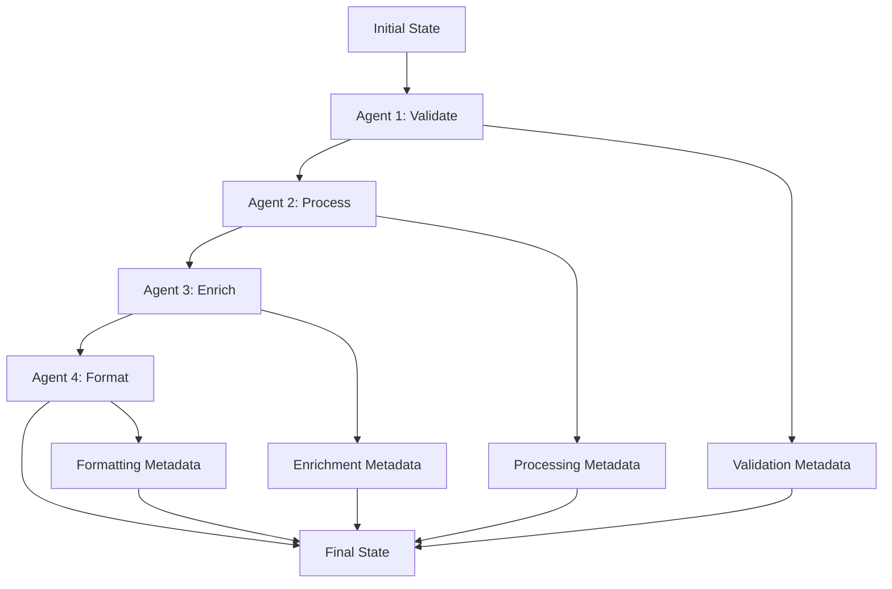

# State Management and Data Flow

State management is the backbone of data flow in AgenticGoKit, determining how information is stored, transformed, and passed between agents. This tutorial explores the thread-safe State interface, data flow patterns, and best practices for building robust multi-agent systems.

Understanding state management is crucial because it's how agents share information, maintain context, and build upon each other's work in a concurrent, distributed environment.

## Prerequisites

- Understanding of [Message Passing and Event Flow](./message-passing.md)
- Knowledge of [Agent Lifecycle](./agent-lifecycle.md)
- Basic knowledge of Go interfaces and concurrency
- Familiarity with [Core Concepts Overview](./README.md)

## Learning Objectives

By the end of this tutorial, you'll understand:
- The State interface and its thread-safe operations
- Data vs metadata distinction and usage patterns
- State transformation and flow patterns
- Advanced state management techniques
- Performance optimization and debugging strategies

## The State Interface

### Thread-Safe State Container

State represents the current context and data an agent is working with. It's a thread-safe container that separates data from metadata:

```go
// Complete State interface - thread-safe by design
type State interface {
    // Data operations - actual business data
    Get(key string) (any, bool)
    Set(key string, value any)
    Keys() []string
    
    // Metadata operations - processing information
    GetMeta(key string) (string, bool)
    SetMeta(key string, value string)
    MetaKeys() []string
    
    // State operations - manipulation and lifecycle
    Clone() State
    Merge(source State)
}
```

::: info Thread Safety
All State operations are thread-safe and can be called concurrently from multiple goroutines without additional synchronization.
:::

### Data vs Metadata Distinction

The State interface maintains a clear separation between business data and processing metadata:

**Data** - The actual information agents process:
- User inputs and queries
- Processing results and outputs
- Business objects and calculations
- Intermediate computation results

**Metadata** - Information about the processing:
- Agent routing instructions
- Processing timestamps and IDs
- Quality scores and confidence levels
- System state and flags

```go
// Creating and populating state
state := core.NewState()

// Business data - what agents actually work with
state.Set("user_query", "What's the weather in Paris?")
state.Set("location", "Paris, France")
state.Set("temperature", 22.5)
state.Set("weather_conditions", []string{"sunny", "clear"})
state.Set("forecast", map[string]interface{}{
    "today":    "sunny, 22°C",
    "tomorrow": "cloudy, 18°C",
})

// Processing metadata - information about the processing
state.SetMeta("confidence_score", "0.95")
state.SetMeta("data_source", "weather-api")
state.SetMeta("processed_at", time.Now().Format(time.RFC3339))
state.SetMeta("processing_agent", "weather-agent")
state.SetMeta("route", "response-formatter")
state.SetMeta("session_id", "session-12345")

// Accessing data and metadata
if query, ok := state.Get("user_query"); ok {
    fmt.Printf("Processing query: %s\n", query)
}

if confidence, ok := state.GetMeta("confidence_score"); ok {
    fmt.Printf("Confidence: %s\n", confidence)
}
```

### State Creation Patterns

AgenticGoKit provides multiple ways to create and initialize state:

```go
// 1. Empty state
state := core.NewState()

// 2. State with initial data (returns State interface)
initialData := map[string]any{
    "user_id":    "user-123",
    "session_id": "session-456",
    "query":      "Tell me about AI",
    "context": map[string]string{
        "language": "en",
        "timezone": "UTC",
    },
}
state := core.NewStateWithData(initialData)

// 3. Concrete SimpleState (when you need the concrete type)
concreteState := core.NewSimpleState(initialData)

// 4. State from JSON (for persistence/serialization)
jsonData := `{
    "data": {
        "message": "Hello, World!",
        "priority": "high"
    },
    "meta": {
        "timestamp": "2024-01-01T12:00:00Z",
        "agent": "processor"
    }
}`

var simpleState core.SimpleState
err := json.Unmarshal([]byte(jsonData), &simpleState)
if err == nil {
    state = &simpleState
}
```

## State Lifecycle and Transformation

### 1. State in Agent Processing

Agents receive state as input and produce transformed state as output using both execution patterns:

```go
// Pattern 1: Direct state processing (Run method)
func (a *DataProcessor) Run(ctx context.Context, inputState core.State) (core.State, error) {
    // Validate input state
    if inputState == nil {
        return core.NewState(), fmt.Errorf("input state cannot be nil")
    }
    
    // Extract data safely
    query, ok := inputState.Get("query")
    if !ok {
        return inputState, fmt.Errorf("no query found in state")
    }
    
    queryStr, ok := query.(string)
    if !ok {
        return inputState, fmt.Errorf("query must be a string, got %T", query)
    }
    
    // Process the query
    result, err := a.processQuery(ctx, queryStr)
    if err != nil {
        return inputState, fmt.Errorf("query processing failed: %w", err)
    }
    
    // Create output state (always clone to avoid mutations)
    outputState := inputState.Clone()
    outputState.Set("processed_query", queryStr)
    outputState.Set("processing_result", result)
    outputState.Set("processed_at", time.Now().Unix())
    
    // Add processing metadata
    outputState.SetMeta("processed_by", a.Name())
    outputState.SetMeta("processing_duration", fmt.Sprintf("%v", time.Since(time.Now())))
    outputState.SetMeta("result_confidence", "0.95")
    
    return outputState, nil
}

// Pattern 2: Event-driven processing (HandleEvent method)
// Note: HandleEvent is used by Runner for event orchestration
// It typically delegates to the Run method for actual processing
func (a *DataProcessor) HandleEvent(ctx context.Context, event core.Event, state core.State) (core.AgentResult, error) {
    startTime := time.Now()
    
    // Use the Run method for actual processing
    outputState, err := a.Run(ctx, state)
    endTime := time.Now()
    
    // Create comprehensive result
    result := core.AgentResult{
        OutputState: outputState,
        StartTime:   startTime,
        EndTime:     endTime,
        Duration:    endTime.Sub(startTime),
    }
    
    if err != nil {
        result.Error = err.Error()
        
        core.Logger().Error().
            Str("agent", a.Name()).
            Str("event_id", event.GetID()).
            Err(err).
            Msg("Agent processing failed")
    } else {
        core.Logger().Debug().
            Str("agent", a.Name()).
            Str("event_id", event.GetID()).
            Dur("duration", result.Duration).
            Msg("Agent processing completed")
    }
    
    return result, err
}
```

### 2. State Cloning and Immutability

Always clone state before modification to prevent unintended side effects:

```go
// Safe state transformation patterns
func transformState(inputState core.State) core.State {
    // ALWAYS clone before modifying
    outputState := inputState.Clone()
    
    // Safe to modify the clone
    outputState.Set("transformed", true)
    outputState.Set("transformation_time", time.Now().Unix())
    outputState.SetMeta("transformer", "data-transformer")
    
    return outputState
}

// Unsafe pattern - DON'T DO THIS
func unsafeTransform(inputState core.State) core.State {
    // BAD: Modifying input state directly
    inputState.Set("modified", true) // This affects the original!
    return inputState
}

// Safe pattern with validation
func safeTransformWithValidation(inputState core.State) (core.State, error) {
    // Validate input first
    if inputState == nil {
        return core.NewState(), fmt.Errorf("input state is nil")
    }
    
    // Check required fields
    requiredFields := []string{"user_id", "query"}
    for _, field := range requiredFields {
        if _, ok := inputState.Get(field); !ok {
            return inputState, fmt.Errorf("required field missing: %s", field)
        }
    }
    
    // Clone and transform
    outputState := inputState.Clone()
    outputState.Set("validated", true)
    outputState.SetMeta("validation_passed", time.Now().Format(time.RFC3339))
    
    return outputState, nil
}
```

### 3. State Merging Strategies

Combine state from multiple sources using different merge strategies:

```go
// Simple merge - overwrites existing keys
func simpleMerge(baseState, newState core.State) core.State {
    result := baseState.Clone()
    result.Merge(newState) // Built-in merge overwrites existing keys
    return result
}

// Selective merge - only merge specific keys
func selectiveMerge(baseState, newState core.State, allowedKeys []string) core.State {
    result := baseState.Clone()
    
    for _, key := range allowedKeys {
        if value, ok := newState.Get(key); ok {
            result.Set(key, value)
        }
    }
    
    // Merge all metadata
    for _, metaKey := range newState.MetaKeys() {
        if value, ok := newState.GetMeta(metaKey); ok {
            result.SetMeta(metaKey, value)
        }
    }
    
    return result
}

// Additive merge - combines arrays and maps instead of overwriting
func additiveMerge(baseState, newState core.State) core.State {
    result := baseState.Clone()
    
    for _, key := range newState.Keys() {
        newValue, _ := newState.Get(key)
        
        if existingValue, exists := result.Get(key); exists {
            // Combine arrays
            if existingArray, ok := existingValue.([]interface{}); ok {
                if newArray, ok := newValue.([]interface{}); ok {
                    combined := append(existingArray, newArray...)
                    result.Set(key, combined)
                    continue
                }
            }
            
            // Combine maps
            if existingMap, ok := existingValue.(map[string]interface{}); ok {
                if newMap, ok := newValue.(map[string]interface{}); ok {
                    combined := make(map[string]interface{})
                    for k, v := range existingMap {
                        combined[k] = v
                    }
                    for k, v := range newMap {
                        combined[k] = v
                    }
                    result.Set(key, combined)
                    continue
                }
            }
        }
        
        // Default: overwrite
        result.Set(key, newValue)
    }
    
    // Always merge metadata
    result.Merge(newState)
    
    return result
}
```

### 4. State Flow Patterns

State flows through the system in predictable patterns:



::: info State Flow Principles
- **Immutability**: Always clone before modifying
- **Additive**: Each agent adds value without destroying previous work
- **Traceable**: Metadata tracks the processing history
- **Recoverable**: Original state can be reconstructed from history
:::

## Data Flow Patterns

### 1. Sequential Pipeline Pattern

Data flows through agents in sequence, with each agent adding value:

```go
// Sequential processing pipeline
type PipelineAgent struct {
    name  string
    stage string
}

// Agent 1: Data Collection
func (a *CollectorAgent) Run(ctx context.Context, inputState core.State) (core.State, error) {
    // Collect raw data from external source
    rawData, err := a.collectDataFromAPI(ctx)
    if err != nil {
        return inputState, fmt.Errorf("data collection failed: %w", err)
    }
    
    // Clone and enhance state
    outputState := inputState.Clone()
    outputState.Set("raw_data", rawData)
    outputState.Set("collection_timestamp", time.Now().Unix())
    outputState.Set("data_source", "external_api")
    
    // Add processing metadata
    outputState.SetMeta("stage", "collection")
    outputState.SetMeta("collector_version", "v1.2.0")
    outputState.SetMeta("data_quality", "raw")
    outputState.SetMeta("route", "processor") // Route to next agent
    
    core.Logger().Debug().
        Str("agent", a.Name()).
        Int("data_size", len(rawData)).
        Msg("Data collection completed")
    
    return outputState, nil
}

// Agent 2: Data Processing
func (a *ProcessorAgent) Run(ctx context.Context, inputState core.State) (core.State, error) {
    // Extract raw data from previous stage
    rawData, ok := inputState.Get("raw_data")
    if !ok {
        return inputState, fmt.Errorf("no raw data found in state")
    }
    
    // Type assertion with error handling
    rawDataSlice, ok := rawData.([]map[string]interface{})
    if !ok {
        return inputState, fmt.Errorf("raw_data has unexpected type: %T", rawData)
    }
    
    // Process the data
    processedData, err := a.processData(ctx, rawDataSlice)
    if err != nil {
        return inputState, fmt.Errorf("data processing failed: %w", err)
    }
    
    // Clone and enhance state
    outputState := inputState.Clone()
    outputState.Set("processed_data", processedData)
    outputState.Set("processing_timestamp", time.Now().Unix())
    outputState.Set("processing_algorithm", "ml_v2.1")
    
    // Update metadata
    outputState.SetMeta("stage", "processing")
    outputState.SetMeta("data_quality", "processed")
    outputState.SetMeta("confidence_score", "0.92")
    outputState.SetMeta("route", "formatter") // Route to next agent
    
    core.Logger().Debug().
        Str("agent", a.Name()).
        Int("processed_items", len(processedData)).
        Msg("Data processing completed")
    
    return outputState, nil
}

// Agent 3: Data Formatting
func (a *FormatterAgent) Run(ctx context.Context, inputState core.State) (core.State, error) {
    // Extract processed data
    processedData, ok := inputState.Get("processed_data")
    if !ok {
        return inputState, fmt.Errorf("no processed data found in state")
    }
    
    // Format the data for output
    formattedData, err := a.formatData(ctx, processedData)
    if err != nil {
        return inputState, fmt.Errorf("data formatting failed: %w", err)
    }
    
    // Clone and finalize state
    outputState := inputState.Clone()
    outputState.Set("final_result", formattedData)
    outputState.Set("formatting_timestamp", time.Now().Unix())
    outputState.Set("output_format", "json_v1")
    
    // Final metadata
    outputState.SetMeta("stage", "formatting")
    outputState.SetMeta("data_quality", "final")
    outputState.SetMeta("pipeline_complete", "true")
    // No route - this is the final stage
    
    core.Logger().Info().
        Str("agent", a.Name()).
        Msg("Pipeline processing completed")
    
    return outputState, nil
}
```

### 2. Fan-Out/Fan-In Pattern

Data branches to multiple agents for parallel processing, then merges:

```go
// Fan-out coordinator
func (a *CoordinatorAgent) Run(ctx context.Context, inputState core.State) (core.State, error) {
    query, ok := inputState.Get("user_query")
    if !ok {
        return inputState, fmt.Errorf("no user query found")
    }
    
    queryStr := query.(string)
    
    // Create specialized processing branches
    outputState := inputState.Clone()
    
    // Prepare data for different analysis types
    outputState.Set("text_analysis_input", queryStr)
    outputState.Set("sentiment_analysis_input", queryStr)
    outputState.Set("entity_extraction_input", queryStr)
    outputState.Set("intent_classification_input", queryStr)
    
    // Set up parallel processing metadata
    outputState.SetMeta("processing_mode", "parallel")
    outputState.SetMeta("branch_count", "4")
    outputState.SetMeta("coordination_id", generateCoordinationID())
    
    // This would trigger parallel processing in collaborative orchestration
    return outputState, nil
}

// Specialized analysis agents
func (a *TextAnalyzer) Run(ctx context.Context, inputState core.State) (core.State, error) {
    input, _ := inputState.Get("text_analysis_input")
    
    analysis, err := a.analyzeText(ctx, input.(string))
    if err != nil {
        return inputState, err
    }
    
    outputState := inputState.Clone()
    outputState.Set("text_analysis_result", analysis)
    outputState.SetMeta("text_analyzer_complete", "true")
    
    return outputState, nil
}

func (a *SentimentAnalyzer) Run(ctx context.Context, inputState core.State) (core.State, error) {
    input, _ := inputState.Get("sentiment_analysis_input")
    
    sentiment, err := a.analyzeSentiment(ctx, input.(string))
    if err != nil {
        return inputState, err
    }
    
    outputState := inputState.Clone()
    outputState.Set("sentiment_analysis_result", sentiment)
    outputState.SetMeta("sentiment_analyzer_complete", "true")
    
    return outputState, nil
}

// Results aggregator (fan-in)
func (a *AggregatorAgent) Run(ctx context.Context, inputState core.State) (core.State, error) {
    // Check if all parallel processing is complete
    requiredResults := []string{
        "text_analysis_result",
        "sentiment_analysis_result", 
        "entity_extraction_result",
        "intent_classification_result",
    }
    
    results := make(map[string]interface{})
    for _, resultKey := range requiredResults {
        if result, ok := inputState.Get(resultKey); ok {
            results[resultKey] = result
        } else {
            return inputState, fmt.Errorf("missing required result: %s", resultKey)
        }
    }
    
    // Aggregate all results
    aggregatedResult := a.aggregateResults(results)
    
    outputState := inputState.Clone()
    outputState.Set("aggregated_analysis", aggregatedResult)
    outputState.Set("aggregation_timestamp", time.Now().Unix())
    
    outputState.SetMeta("aggregation_complete", "true")
    outputState.SetMeta("result_count", fmt.Sprintf("%d", len(results)))
    
    return outputState, nil
}
```

### 3. Accumulator Pattern

Multiple agents contribute to a growing dataset:

```go
// Research accumulator pattern
type ResearchAccumulator struct {
    name string
    sources []string
}

func (a *ResearchAccumulator) Run(ctx context.Context, inputState core.State) (core.State, error) {
    query, ok := inputState.Get("research_query")
    if !ok {
        return inputState, fmt.Errorf("no research query found")
    }
    
    // Perform research from this agent's sources
    findings, err := a.research(ctx, query.(string))
    if err != nil {
        return inputState, fmt.Errorf("research failed: %w", err)
    }
    
    outputState := inputState.Clone()
    
    // Get existing research findings
    existingFindings := []ResearchFinding{}
    if existing, ok := outputState.Get("research_findings"); ok {
        if existingSlice, ok := existing.([]ResearchFinding); ok {
            existingFindings = existingSlice
        }
    }
    
    // Add new findings to the accumulator
    allFindings := append(existingFindings, findings...)
    outputState.Set("research_findings", allFindings)
    
    // Track contributors
    contributors := []string{}
    if existing, ok := outputState.Get("contributors"); ok {
        if existingSlice, ok := existing.([]string); ok {
            contributors = existingSlice
        }
    }
    contributors = append(contributors, a.name)
    outputState.Set("contributors", contributors)
    
    // Update metadata
    outputState.SetMeta("contributor_"+a.name, "completed")
    outputState.SetMeta("total_findings", fmt.Sprintf("%d", len(allFindings)))
    outputState.SetMeta("last_contributor", a.name)
    
    core.Logger().Debug().
        Str("agent", a.name).
        Int("new_findings", len(findings)).
        Int("total_findings", len(allFindings)).
        Msg("Research contribution added")
    
    return outputState, nil
}

type ResearchFinding struct {
    Source      string    `json:"source"`
    Content     string    `json:"content"`
    Relevance   float64   `json:"relevance"`
    Timestamp   time.Time `json:"timestamp"`
    Contributor string    `json:"contributor"`
}

func (a *ResearchAccumulator) research(ctx context.Context, query string) ([]ResearchFinding, error) {
    findings := make([]ResearchFinding, 0)
    
    for _, source := range a.sources {
        // Simulate research from different sources
        finding := ResearchFinding{
            Source:      source,
            Content:     fmt.Sprintf("Research result from %s for query: %s", source, query),
            Relevance:   0.8 + (0.2 * rand.Float64()), // Random relevance 0.8-1.0
            Timestamp:   time.Now(),
            Contributor: a.name,
        }
        findings = append(findings, finding)
    }
    
    return findings, nil
}
```

### 4. State Transformation Pipeline

Create reusable transformation functions:

```go
// State transformation pipeline
type StateTransformation func(core.State) (core.State, error)

// Composable transformations
func CreateTransformationPipeline(transformations ...StateTransformation) StateTransformation {
    return func(inputState core.State) (core.State, error) {
        currentState := inputState
        
        for i, transform := range transformations {
            var err error
            currentState, err = transform(currentState)
            if err != nil {
                return inputState, fmt.Errorf("transformation %d failed: %w", i, err)
            }
        }
        
        return currentState, nil
    }
}

// Individual transformation functions
func AddTimestamp(state core.State) (core.State, error) {
    outputState := state.Clone()
    outputState.Set("timestamp", time.Now().Unix())
    outputState.SetMeta("timestamp_added", time.Now().Format(time.RFC3339))
    return outputState, nil
}

func ValidateUserInput(state core.State) (core.State, error) {
    userInput, ok := state.Get("user_input")
    if !ok {
        return state, fmt.Errorf("user_input is required")
    }
    
    inputStr, ok := userInput.(string)
    if !ok {
        return state, fmt.Errorf("user_input must be a string")
    }
    
    if len(inputStr) == 0 {
        return state, fmt.Errorf("user_input cannot be empty")
    }
    
    outputState := state.Clone()
    outputState.SetMeta("input_validated", "true")
    outputState.SetMeta("input_length", fmt.Sprintf("%d", len(inputStr)))
    
    return outputState, nil
}

func NormalizeText(state core.State) (core.State, error) {
    userInput, ok := state.Get("user_input")
    if !ok {
        return state, fmt.Errorf("user_input not found")
    }
    
    inputStr := userInput.(string)
    normalized := strings.ToLower(strings.TrimSpace(inputStr))
    
    outputState := state.Clone()
    outputState.Set("normalized_input", normalized)
    outputState.SetMeta("text_normalized", "true")
    
    return outputState, nil
}

// Usage in agent
func (a *TextProcessorAgent) Run(ctx context.Context, inputState core.State) (core.State, error) {
    // Create transformation pipeline
    pipeline := CreateTransformationPipeline(
        ValidateUserInput,
        NormalizeText,
        AddTimestamp,
    )
    
    // Apply transformations
    transformedState, err := pipeline(inputState)
    if err != nil {
        return inputState, fmt.Errorf("transformation pipeline failed: %w", err)
    }
    
    // Add agent-specific processing
    outputState := transformedState.Clone()
    outputState.Set("processed_by", a.Name())
    outputState.SetMeta("processing_complete", "true")
    
    return outputState, nil
}
```

## Advanced State Management Patterns

### 1. Namespaced State Organization

Use hierarchical keys to organize complex state data and prevent conflicts:

```go
// Hierarchical state organization
func organizeStateWithNamespaces(state core.State) {
    // User-related data
    state.Set("user.profile.id", "user-12345")
    state.Set("user.profile.name", "Alice Johnson")
    state.Set("user.profile.email", "alice@example.com")
    state.Set("user.preferences.language", "en")
    state.Set("user.preferences.timezone", "UTC")
    state.Set("user.session.id", "session-67890")
    state.Set("user.session.start_time", time.Now().Unix())
    state.Set("user.session.last_activity", time.Now().Unix())
    
    // System-related data
    state.Set("system.version", "2.1.0")
    state.Set("system.environment", "production")
    state.Set("system.region", "us-west-2")
    state.Set("system.instance_id", "i-0123456789abcdef0")
    
    // Processing-related data
    state.Set("processing.pipeline.stage", "analysis")
    state.Set("processing.pipeline.step", 3)
    state.Set("processing.quality.confidence", 0.95)
    state.Set("processing.quality.accuracy", 0.92)
    state.Set("processing.performance.duration_ms", 150)
    state.Set("processing.performance.memory_mb", 64)
    
    // Business logic data
    state.Set("business.order.id", "order-98765")
    state.Set("business.order.total", 299.99)
    state.Set("business.customer.tier", "premium")
    state.Set("business.inventory.available", true)
}

// Helper functions for namespaced access
func getUserProfile(state core.State) (map[string]interface{}, error) {
    profile := make(map[string]interface{})
    
    userKeys := []string{"user.profile.id", "user.profile.name", "user.profile.email"}
    for _, key := range userKeys {
        if value, ok := state.Get(key); ok {
            // Remove namespace prefix for cleaner access
            cleanKey := strings.TrimPrefix(key, "user.profile.")
            profile[cleanKey] = value
        }
    }
    
    if len(profile) == 0 {
        return nil, fmt.Errorf("no user profile data found")
    }
    
    return profile, nil
}

func getProcessingMetrics(state core.State) map[string]interface{} {
    metrics := make(map[string]interface{})
    
    // Collect all processing-related keys
    for _, key := range state.Keys() {
        if strings.HasPrefix(key, "processing.") {
            if value, ok := state.Get(key); ok {
                metrics[key] = value
            }
        }
    }
    
    return metrics
}
```

### 2. Structured State Data with Type Safety

Define and use structured data types for complex state objects:

```go
// Define comprehensive data structures
type UserProfile struct {
    ID          string            `json:"id"`
    Name        string            `json:"name"`
    Email       string            `json:"email"`
    Preferences UserPreferences   `json:"preferences"`
    Session     SessionInfo       `json:"session"`
    CreatedAt   time.Time         `json:"created_at"`
    UpdatedAt   time.Time         `json:"updated_at"`
}

type UserPreferences struct {
    Language     string   `json:"language"`
    Timezone     string   `json:"timezone"`
    Notifications bool    `json:"notifications"`
    Categories   []string `json:"categories"`
    Theme        string   `json:"theme"`
}

type SessionInfo struct {
    ID           string    `json:"id"`
    StartTime    time.Time `json:"start_time"`
    LastActivity time.Time `json:"last_activity"`
    IPAddress    string    `json:"ip_address"`
    UserAgent    string    `json:"user_agent"`
}

type ProcessingContext struct {
    PipelineID   string                 `json:"pipeline_id"`
    Stage        string                 `json:"stage"`
    StepNumber   int                    `json:"step_number"`
    Confidence   float64                `json:"confidence"`
    Quality      QualityMetrics         `json:"quality"`
    Performance  PerformanceMetrics     `json:"performance"`
    Metadata     map[string]string      `json:"metadata"`
    Errors       []ProcessingError      `json:"errors,omitempty"`
}

type QualityMetrics struct {
    Accuracy    float64 `json:"accuracy"`
    Precision   float64 `json:"precision"`
    Recall      float64 `json:"recall"`
    F1Score     float64 `json:"f1_score"`
}

type PerformanceMetrics struct {
    DurationMs   int64   `json:"duration_ms"`
    MemoryMB     float64 `json:"memory_mb"`
    CPUPercent   float64 `json:"cpu_percent"`
    Throughput   float64 `json:"throughput"`
}

type ProcessingError struct {
    Code      string    `json:"code"`
    Message   string    `json:"message"`
    Timestamp time.Time `json:"timestamp"`
    Severity  string    `json:"severity"`
}

// Type-safe state management functions
func SetUserProfile(state core.State, profile UserProfile) {
    profile.UpdatedAt = time.Now()
    state.Set("user_profile", profile)
    state.SetMeta("user_profile_updated", profile.UpdatedAt.Format(time.RFC3339))
}

func GetUserProfile(state core.State) (*UserProfile, error) {
    value, ok := state.Get("user_profile")
    if !ok {
        return nil, fmt.Errorf("user profile not found in state")
    }
    
    profile, ok := value.(UserProfile)
    if !ok {
        return nil, fmt.Errorf("user profile has invalid type: %T", value)
    }
    
    return &profile, nil
}

func UpdateProcessingContext(state core.State, stage string, confidence float64) error {
    // Get existing context or create new one
    var context ProcessingContext
    if existing, err := GetProcessingContext(state); err == nil {
        context = *existing
    } else {
        context = ProcessingContext{
            PipelineID: generatePipelineID(),
            Metadata:   make(map[string]string),
            Errors:     make([]ProcessingError, 0),
        }
    }
    
    // Update context
    context.Stage = stage
    context.Confidence = confidence
    context.StepNumber++
    
    // Set in state
    state.Set("processing_context", context)
    state.SetMeta("processing_stage", stage)
    state.SetMeta("processing_step", fmt.Sprintf("%d", context.StepNumber))
    
    return nil
}

func GetProcessingContext(state core.State) (*ProcessingContext, error) {
    value, ok := state.Get("processing_context")
    if !ok {
        return nil, fmt.Errorf("processing context not found in state")
    }
    
    context, ok := value.(ProcessingContext)
    if !ok {
        return nil, fmt.Errorf("processing context has invalid type: %T", value)
    }
    
    return &context, nil
}

func AddProcessingError(state core.State, code, message, severity string) error {
    context, err := GetProcessingContext(state)
    if err != nil {
        return fmt.Errorf("cannot add error: %w", err)
    }
    
    processingError := ProcessingError{
        Code:      code,
        Message:   message,
        Timestamp: time.Now(),
        Severity:  severity,
    }
    
    context.Errors = append(context.Errors, processingError)
    
    state.Set("processing_context", *context)
    state.SetMeta("last_error", code)
    state.SetMeta("error_count", fmt.Sprintf("%d", len(context.Errors)))
    
    return nil
}

// Usage in agents
func (a *AnalysisAgent) Run(ctx context.Context, inputState core.State) (core.State, error) {
    // Get user profile safely
    profile, err := GetUserProfile(inputState)
    if err != nil {
        return inputState, fmt.Errorf("failed to get user profile: %w", err)
    }
    
    // Update processing context
    outputState := inputState.Clone()
    err = UpdateProcessingContext(outputState, "analysis", 0.0)
    if err != nil {
        return inputState, fmt.Errorf("failed to update processing context: %w", err)
    }
    
    // Perform analysis based on user preferences
    analysisResult, confidence, err := a.performAnalysis(ctx, profile.Preferences)
    if err != nil {
        // Add error to processing context
        AddProcessingError(outputState, "ANALYSIS_FAILED", err.Error(), "ERROR")
        return outputState, fmt.Errorf("analysis failed: %w", err)
    }
    
    // Update results
    outputState.Set("analysis_result", analysisResult)
    err = UpdateProcessingContext(outputState, "analysis_complete", confidence)
    if err != nil {
        return inputState, fmt.Errorf("failed to update processing context: %w", err)
    }
    
    return outputState, nil
}

func generatePipelineID() string {
    return fmt.Sprintf("pipeline-%d", time.Now().Unix())
}
```

### 3. State Validation

Implement validation to ensure state integrity:

```go
// State validator interface
type StateValidator interface {
    Validate(state State) error
}

// Example validator
type UserQueryValidator struct{}

func (v *UserQueryValidator) Validate(state State) error {
    // Check required fields
    if _, ok := state.Get("user_query"); !ok {
        return errors.New("user_query is required")
    }
    
    if _, ok := state.Get("user_id"); !ok {
        return errors.New("user_id is required")
    }
    
    // Validate data types
    if query, ok := state.Get("user_query"); ok {
        if _, isString := query.(string); !isString {
            return errors.New("user_query must be a string")
        }
    }
    
    return nil
}

// Use validator in agent
func (a *MyAgent) Run(ctx context.Context, event Event, state State) (AgentResult, error) {
    validator := &UserQueryValidator{}
    if err := validator.Validate(state); err != nil {
        return AgentResult{}, fmt.Errorf("state validation failed: %w", err)
    }
    
    // Continue with processing...
}
```

### 4. State Transformation Helpers

Create helper functions for common state transformations:

```go
// State transformation helpers
func AddUserContext(state State, userID, sessionID string) State {
    newState := state.Clone()
    newState.Set("user_id", userID)
    newState.Set("session_id", sessionID)
    newState.SetMeta("context_added", time.Now().Format(time.RFC3339))
    return newState
}

func AddProcessingMetadata(state State, agentName string, confidence float64) State {
    newState := state.Clone()
    newState.SetMeta("processed_by", agentName)
    newState.SetMeta("confidence", fmt.Sprintf("%.2f", confidence))
    newState.SetMeta("processed_at", time.Now().Format(time.RFC3339))
    return newState
}

func ExtractUserQuery(state State) (string, error) {
    query, ok := state.Get("user_query")
    if !ok {
        return "", errors.New("no user query in state")
    }
    
    queryStr, ok := query.(string)
    if !ok {
        return "", errors.New("user query is not a string")
    }
    
    return queryStr, nil
}

// Usage in agents
func (a *MyAgent) Run(ctx context.Context, event Event, state State) (AgentResult, error) {
    // Add context
    state = AddUserContext(state, "user-123", "session-456")
    
    // Extract query
    query, err := ExtractUserQuery(state)
    if err != nil {
        return AgentResult{}, err
    }
    
    // Process query
    response := a.processQuery(query)
    
    // Add processing metadata
    outputState := AddProcessingMetadata(state, a.name, 0.95)
    outputState.Set("response", response)
    
    return AgentResult{OutputState: outputState}, nil
}
```

## State Persistence and Serialization

### 1. JSON Serialization

State objects can be serialized to JSON for storage or transmission:

```go
// Serialize state to JSON
func SerializeState(state State) ([]byte, error) {
    return json.Marshal(state)
}

// Deserialize state from JSON
func DeserializeState(data []byte) (State, error) {
    var state core.SimpleState
    err := json.Unmarshal(data, &state)
    if err != nil {
        return nil, err
    }
    return &state, nil
}

// Example usage
func saveStateToFile(state State, filename string) error {
    data, err := SerializeState(state)
    if err != nil {
        return err
    }
    
    return os.WriteFile(filename, data, 0644)
}

func loadStateFromFile(filename string) (State, error) {
    data, err := os.ReadFile(filename)
    if err != nil {
        return nil, err
    }
    
    return DeserializeState(data)
}
```

### 2. State Snapshots

Capture state at specific points for debugging or rollback:

```go
// State snapshot manager
type StateSnapshot struct {
    Timestamp time.Time `json:"timestamp"`
    AgentID   string    `json:"agent_id"`
    State     State     `json:"state"`
}

type StateSnapshotManager struct {
    snapshots []StateSnapshot
    mu        sync.RWMutex
}

func (sm *StateSnapshotManager) TakeSnapshot(agentID string, state State) {
    sm.mu.Lock()
    defer sm.mu.Unlock()
    
    snapshot := StateSnapshot{
        Timestamp: time.Now(),
        AgentID:   agentID,
        State:     state.Clone(),
    }
    
    sm.snapshots = append(sm.snapshots, snapshot)
}

func (sm *StateSnapshotManager) GetSnapshots() []StateSnapshot {
    sm.mu.RLock()
    defer sm.mu.RUnlock()
    
    // Return a copy to avoid race conditions
    snapshots := make([]StateSnapshot, len(sm.snapshots))
    copy(snapshots, sm.snapshots)
    return snapshots
}

// Usage in agent processing
var snapshotManager = &StateSnapshotManager{}

func (a *MyAgent) Run(ctx context.Context, event Event, state State) (AgentResult, error) {
    // Take snapshot before processing
    snapshotManager.TakeSnapshot(a.name+"-input", state)
    
    // Process...
    outputState := state.Clone()
    outputState.Set("response", "processed")
    
    // Take snapshot after processing
    snapshotManager.TakeSnapshot(a.name+"-output", outputState)
    
    return AgentResult{OutputState: outputState}, nil
}
```

## State in Different Orchestration Patterns

### 1. Route Orchestration State Flow

```go
// Simple state passing between specific agents
event := core.NewEvent(
    "agent-a",
    core.EventData{"input": "data"},
    map[string]string{"route": "agent-a"},
)

// Agent A processes and routes to Agent B
func (a *AgentA) Run(ctx context.Context, event Event, state State) (AgentResult, error) {
    // Process input
    input, _ := state.Get("input")
    result := a.process(input)
    
    outputState := state.Clone()
    outputState.Set("intermediate_result", result)
    outputState.SetMeta("route", "agent-b") // Route to next agent
    
    return AgentResult{OutputState: outputState}, nil
}
```

### 2. Collaborative Orchestration State Merging

```go
// Multiple agents contribute to shared state
type CollaborativeStateManager struct {
    contributions map[string]State
    mu           sync.RWMutex
}

func (csm *CollaborativeStateManager) AddContribution(agentID string, state State) {
    csm.mu.Lock()
    defer csm.mu.Unlock()
    
    if csm.contributions == nil {
        csm.contributions = make(map[string]State)
    }
    
    csm.contributions[agentID] = state.Clone()
}

func (csm *CollaborativeStateManager) MergeContributions() State {
    csm.mu.RLock()
    defer csm.mu.RUnlock()
    
    mergedState := core.NewState()
    
    for agentID, contribution := range csm.contributions {
        // Merge each contribution
        mergedState.Merge(contribution)
        
        // Add contributor metadata
        mergedState.SetMeta("contributor_"+agentID, "true")
    }
    
    return mergedState
}
```

### 3. Sequential Orchestration State Pipeline

```go
// State flows through pipeline stages
type PipelineStage struct {
    Name      string
    Transform func(State) (State, error)
}

func ProcessPipeline(initialState State, stages []PipelineStage) (State, error) {
    currentState := initialState.Clone()
    
    for i, stage := range stages {
        // Add stage metadata
        currentState.SetMeta("current_stage", stage.Name)
        currentState.SetMeta("stage_number", fmt.Sprintf("%d", i+1))
        
        // Transform state
        newState, err := stage.Transform(currentState)
        if err != nil {
            return currentState, fmt.Errorf("stage %s failed: %w", stage.Name, err)
        }
        
        currentState = newState
        
        // Add completion metadata
        currentState.SetMeta("completed_stage_"+stage.Name, time.Now().Format(time.RFC3339))
    }
    
    return currentState, nil
}
```

## Performance Considerations

### 1. State Cloning Optimization

```go
// Efficient state cloning for large states
type OptimizedState struct {
    *core.SimpleState
    copyOnWrite bool
}

func (os *OptimizedState) Clone() State {
    if !os.copyOnWrite {
        // Shallow copy for read-only scenarios
        return &OptimizedState{
            SimpleState: os.SimpleState,
            copyOnWrite: true,
        }
    }
    
    // Deep copy when modifications are needed
    return &OptimizedState{
        SimpleState: os.SimpleState.Clone().(*core.SimpleState),
        copyOnWrite: false,
    }
}
```

### 2. State Size Management

```go
// Monitor and limit state size
func CheckStateSize(state State) error {
    data, err := json.Marshal(state)
    if err != nil {
        return err
    }
    
    const maxStateSize = 1024 * 1024 // 1MB
    if len(data) > maxStateSize {
        return fmt.Errorf("state size %d exceeds maximum %d bytes", len(data), maxStateSize)
    }
    
    return nil
}

// Compress large state data
func CompressStateData(state State, key string) error {
    value, ok := state.Get(key)
    if !ok {
        return nil
    }
    
    // Serialize and compress large data
    data, err := json.Marshal(value)
    if err != nil {
        return err
    }
    
    if len(data) > 10240 { // 10KB threshold
        compressed := compress(data) // Your compression function
        state.Set(key+"_compressed", compressed)
        state.SetMeta(key+"_compressed", "true")
        
        // Remove original large data
        state.Set(key, nil)
    }
    
    return nil
}
```

### 3. State Caching

```go
// State cache for expensive computations
type StateCache struct {
    cache map[string]State
    mu    sync.RWMutex
    ttl   time.Duration
}

func NewStateCache(ttl time.Duration) *StateCache {
    return &StateCache{
        cache: make(map[string]State),
        ttl:   ttl,
    }
}

func (sc *StateCache) Get(key string) (State, bool) {
    sc.mu.RLock()
    defer sc.mu.RUnlock()
    
    state, exists := sc.cache[key]
    if !exists {
        return nil, false
    }
    
    // Check TTL
    if timestamp, ok := state.GetMeta("cached_at"); ok {
        if cachedAt, err := time.Parse(time.RFC3339, timestamp); err == nil {
            if time.Since(cachedAt) > sc.ttl {
                delete(sc.cache, key)
                return nil, false
            }
        }
    }
    
    return state.Clone(), true
}

func (sc *StateCache) Set(key string, state State) {
    sc.mu.Lock()
    defer sc.mu.Unlock()
    
    cachedState := state.Clone()
    cachedState.SetMeta("cached_at", time.Now().Format(time.RFC3339))
    sc.cache[key] = cachedState
}
```

## Debugging State Flow

### 1. State Tracing

```go
// State tracer for debugging
type StateTracer struct {
    traces []StateTrace
    mu     sync.RWMutex
}

type StateTrace struct {
    Timestamp time.Time `json:"timestamp"`
    AgentID   string    `json:"agent_id"`
    Operation string    `json:"operation"`
    Key       string    `json:"key,omitempty"`
    Value     any       `json:"value,omitempty"`
    StateSize int       `json:"state_size"`
}

func (st *StateTracer) TraceGet(agentID, key string, value any, stateSize int) {
    st.mu.Lock()
    defer st.mu.Unlock()
    
    st.traces = append(st.traces, StateTrace{
        Timestamp: time.Now(),
        AgentID:   agentID,
        Operation: "GET",
        Key:       key,
        Value:     value,
        StateSize: stateSize,
    })
}

func (st *StateTracer) TraceSet(agentID, key string, value any, stateSize int) {
    st.mu.Lock()
    defer st.mu.Unlock()
    
    st.traces = append(st.traces, StateTrace{
        Timestamp: time.Now(),
        AgentID:   agentID,
        Operation: "SET",
        Key:       key,
        Value:     value,
        StateSize: stateSize,
    })
}

// Traced state wrapper
type TracedState struct {
    State
    tracer  *StateTracer
    agentID string
}

func (ts *TracedState) Get(key string) (any, bool) {
    value, ok := ts.State.Get(key)
    if ts.tracer != nil {
        ts.tracer.TraceGet(ts.agentID, key, value, len(ts.State.Keys()))
    }
    return value, ok
}

func (ts *TracedState) Set(key string, value any) {
    ts.State.Set(key, value)
    if ts.tracer != nil {
        ts.tracer.TraceSet(ts.agentID, key, value, len(ts.State.Keys()))
    }
}
```

### 2. State Visualization

```go
// Generate state visualization
func VisualizeState(state State) string {
    var builder strings.Builder
    
    builder.WriteString("State Visualization\n")
    builder.WriteString("==================\n\n")
    
    // Data section
    builder.WriteString("Data:\n")
    for _, key := range state.Keys() {
        if value, ok := state.Get(key); ok {
            builder.WriteString(fmt.Sprintf("  %s: %v\n", key, value))
        }
    }
    
    // Metadata section
    builder.WriteString("\nMetadata:\n")
    for _, key := range state.MetaKeys() {
        if value, ok := state.GetMeta(key); ok {
            builder.WriteString(fmt.Sprintf("  %s: %s\n", key, value))
        }
    }
    
    return builder.String()
}

// Generate state diff
func DiffStates(before, after State) string {
    var builder strings.Builder
    
    builder.WriteString("State Diff\n")
    builder.WriteString("==========\n\n")
    
    // Check for added/modified data
    for _, key := range after.Keys() {
        afterValue, _ := after.Get(key)
        beforeValue, existed := before.Get(key)
        
        if !existed {
            builder.WriteString(fmt.Sprintf("+ %s: %v\n", key, afterValue))
        } else if !reflect.DeepEqual(beforeValue, afterValue) {
            builder.WriteString(fmt.Sprintf("~ %s: %v -> %v\n", key, beforeValue, afterValue))
        }
    }
    
    // Check for removed data
    for _, key := range before.Keys() {
        if _, exists := after.Get(key); !exists {
            beforeValue, _ := before.Get(key)
            builder.WriteString(fmt.Sprintf("- %s: %v\n", key, beforeValue))
        }
    }
    
    return builder.String()
}
```

## Best Practices and Patterns

### 1. State Design Principles

Follow consistent naming and organization patterns:

```go
// ✅ Good: Clear, descriptive, hierarchical keys
state.Set("user.query.original", "What's the weather in Paris?")
state.Set("user.query.normalized", "weather paris")
state.Set("weather.current.temperature", 22.5)
state.Set("weather.current.conditions", []string{"sunny", "clear"})
state.Set("analysis.confidence.overall", 0.95)
state.Set("analysis.confidence.weather_api", 0.98)

// ❌ Bad: Unclear, abbreviated, inconsistent keys
state.Set("q", "What's the weather?")
state.Set("wd", weatherInfo)
state.Set("conf", 0.95)

// ✅ Good: Consistent naming conventions
state.Set("user_profile", profile)
state.Set("user_preferences", preferences)
state.Set("user_session", session)

// ❌ Bad: Inconsistent naming
state.Set("userProfile", profile)
state.Set("user_prefs", preferences)
state.Set("UserSession", session)

// ✅ Good: Meaningful metadata
state.SetMeta("processing_agent", "weather-analyzer-v2.1")
state.SetMeta("processing_timestamp", time.Now().Format(time.RFC3339))
state.SetMeta("data_source", "openweather_api")
state.SetMeta("cache_ttl", "300") // 5 minutes

// ❌ Bad: Unclear metadata
state.SetMeta("agent", "wa")
state.SetMeta("ts", "123456")
state.SetMeta("src", "api")
```

### 2. Type-Safe State Access

Implement robust type checking and error handling:

```go
// Generic type-safe getter
func GetTypedValue[T any](state core.State, key string) (T, error) {
    var zero T
    
    value, ok := state.Get(key)
    if !ok {
        return zero, fmt.Errorf("key %s not found in state", key)
    }
    
    typedValue, ok := value.(T)
    if !ok {
        return zero, fmt.Errorf("key %s has type %T, expected %T", key, value, zero)
    }
    
    return typedValue, nil
}

// Specific type-safe getters
func GetString(state core.State, key string) (string, error) {
    return GetTypedValue[string](state, key)
}

func GetInt(state core.State, key string) (int, error) {
    return GetTypedValue[int](state, key)
}

func GetFloat64(state core.State, key string) (float64, error) {
    return GetTypedValue[float64](state, key)
}

func GetStringSlice(state core.State, key string) ([]string, error) {
    return GetTypedValue[[]string](state, key)
}

// Safe getters with defaults
func GetStringWithDefault(state core.State, key, defaultValue string) string {
    if value, err := GetString(state, key); err == nil {
        return value
    }
    return defaultValue
}

func GetIntWithDefault(state core.State, key string, defaultValue int) int {
    if value, err := GetInt(state, key); err == nil {
        return value
    }
    return defaultValue
}

// Validation helpers
func RequireKeys(state core.State, keys ...string) error {
    var missing []string
    
    for _, key := range keys {
        if _, ok := state.Get(key); !ok {
            missing = append(missing, key)
        }
    }
    
    if len(missing) > 0 {
        return fmt.Errorf("missing required keys: %v", missing)
    }
    
    return nil
}

func ValidateStateSchema(state core.State, schema map[string]string) error {
    for key, expectedType := range schema {
        value, ok := state.Get(key)
        if !ok {
            return fmt.Errorf("required key missing: %s", key)
        }
        
        actualType := fmt.Sprintf("%T", value)
        if actualType != expectedType {
            return fmt.Errorf("key %s has type %s, expected %s", key, actualType, expectedType)
        }
    }
    
    return nil
}

// Usage in agents
func (a *WeatherAgent) Run(ctx context.Context, inputState core.State) (core.State, error) {
    // Validate required inputs
    err := RequireKeys(inputState, "user.query.original", "user.location")
    if err != nil {
        return inputState, fmt.Errorf("input validation failed: %w", err)
    }
    
    // Get values safely
    query, err := GetString(inputState, "user.query.original")
    if err != nil {
        return inputState, fmt.Errorf("failed to get query: %w", err)
    }
    
    location, err := GetString(inputState, "user.location")
    if err != nil {
        return inputState, fmt.Errorf("failed to get location: %w", err)
    }
    
    // Get optional values with defaults
    units := GetStringWithDefault(inputState, "user.preferences.units", "celsius")
    language := GetStringWithDefault(inputState, "user.preferences.language", "en")
    
    // Process weather request
    weatherData, err := a.getWeatherData(ctx, location, units, language)
    if err != nil {
        return inputState, fmt.Errorf("weather API failed: %w", err)
    }
    
    // Create output state
    outputState := inputState.Clone()
    outputState.Set("weather.current", weatherData)
    outputState.Set("weather.query_processed", query)
    outputState.SetMeta("weather_api_called", time.Now().Format(time.RFC3339))
    
    return outputState, nil
}
```

### 3. State Validation and Schema

Implement comprehensive state validation:

```go
// State schema definition
type StateSchema struct {
    RequiredKeys map[string]string // key -> expected type
    OptionalKeys map[string]string // key -> expected type
    Metadata     map[string]bool   // key -> required
}

func (s StateSchema) Validate(state core.State) error {
    // Check required keys
    for key, expectedType := range s.RequiredKeys {
        value, ok := state.Get(key)
        if !ok {
            return fmt.Errorf("required key missing: %s", key)
        }
        
        if actualType := fmt.Sprintf("%T", value); actualType != expectedType {
            return fmt.Errorf("key %s: expected type %s, got %s", key, expectedType, actualType)
        }
    }
    
    // Check optional keys (if present)
    for key, expectedType := range s.OptionalKeys {
        if value, ok := state.Get(key); ok {
            if actualType := fmt.Sprintf("%T", value); actualType != expectedType {
                return fmt.Errorf("optional key %s: expected type %s, got %s", key, expectedType, actualType)
            }
        }
    }
    
    // Check required metadata
    for key, required := range s.Metadata {
        if required {
            if _, ok := state.GetMeta(key); !ok {
                return fmt.Errorf("required metadata missing: %s", key)
            }
        }
    }
    
    return nil
}

// Predefined schemas for common use cases
var (
    UserInputSchema = StateSchema{
        RequiredKeys: map[string]string{
            "user.id":    "string",
            "user.query": "string",
        },
        OptionalKeys: map[string]string{
            "user.session_id": "string",
            "user.context":    "map[string]interface {}",
        },
        Metadata: map[string]bool{
            "session_id": true,
            "timestamp":  false,
        },
    }
    
    ProcessingResultSchema = StateSchema{
        RequiredKeys: map[string]string{
            "result.data":       "map[string]interface {}",
            "result.confidence": "float64",
        },
        OptionalKeys: map[string]string{
            "result.errors":   "[]string",
            "result.warnings": "[]string",
        },
        Metadata: map[string]bool{
            "processed_by": true,
            "processed_at": true,
            "route":        false,
        },
    }
)

// Schema-aware agent base
type SchemaValidatedAgent struct {
    name         string
    inputSchema  StateSchema
    outputSchema StateSchema
}

func (a *SchemaValidatedAgent) ValidateInput(state core.State) error {
    return a.inputSchema.Validate(state)
}

func (a *SchemaValidatedAgent) ValidateOutput(state core.State) error {
    return a.outputSchema.Validate(state)
}

func (a *SchemaValidatedAgent) Run(ctx context.Context, inputState core.State) (core.State, error) {
    // Validate input
    if err := a.ValidateInput(inputState); err != nil {
        return inputState, fmt.Errorf("input validation failed: %w", err)
    }
    
    // Process (implemented by concrete agent)
    outputState, err := a.process(ctx, inputState)
    if err != nil {
        return inputState, err
    }
    
    // Validate output
    if err := a.ValidateOutput(outputState); err != nil {
        core.Logger().Error().
            Str("agent", a.name).
            Err(err).
            Msg("Output validation failed")
        // Don't fail the agent, but log the issue
    }
    
    return outputState, nil
}
```

### 3. State Documentation

```go
// Document expected state structure
type ExpectedState struct {
    // Required fields
    UserQuery string `json:"user_query" required:"true" description:"The user's input query"`
    UserID    string `json:"user_id" required:"true" description:"Unique user identifier"`
    
    // Optional fields
    Context    string  `json:"context,omitempty" description:"Additional context for the query"`
    Confidence float64 `json:"confidence,omitempty" description:"Confidence score (0.0-1.0)"`
    
    // Metadata
    ProcessedBy string `json:"processed_by,omitempty" metadata:"true" description:"Agent that processed this state"`
    Timestamp   string `json:"timestamp,omitempty" metadata:"true" description:"Processing timestamp"`
}

// Validate state against expected structure
func ValidateExpectedState(state State) error {
    // Check required fields
    if _, ok := state.Get("user_query"); !ok {
        return errors.New("user_query is required")
    }
    
    if _, ok := state.Get("user_id"); !ok {
        return errors.New("user_id is required")
    }
    
    return nil
}
```

## Common Pitfalls and Solutions

### 1. State Mutation Issues

**Problem**: Modifying shared state without proper cloning.

```go
// Bad: Modifying shared state
func (a *BadAgent) Run(ctx context.Context, event Event, state State) (AgentResult, error) {
    state.Set("modified", true) // Modifies input state!
    return AgentResult{OutputState: state}, nil
}

// Good: Clone before modifying
func (a *GoodAgent) Run(ctx context.Context, event Event, state State) (AgentResult, error) {
    outputState := state.Clone()
    outputState.Set("modified", true)
    return AgentResult{OutputState: outputState}, nil
}
```

### 2. Memory Leaks

**Problem**: Accumulating large amounts of data in state without cleanup.

```go
// Bad: Accumulating data indefinitely
func (a *BadAgent) Run(ctx context.Context, event Event, state State) (AgentResult, error) {
    history, _ := state.Get("processing_history")
    if history == nil {
        history = make([]string, 0)
    }
    
    // This grows indefinitely!
    newHistory := append(history.([]string), "processed by "+a.name)
    
    outputState := state.Clone()
    outputState.Set("processing_history", newHistory)
    return AgentResult{OutputState: outputState}, nil
}

// Good: Limit data accumulation
func (a *GoodAgent) Run(ctx context.Context, event Event, state State) (AgentResult, error) {
    history, _ := state.Get("processing_history")
    if history == nil {
        history = make([]string, 0)
    }
    
    newHistory := append(history.([]string), "processed by "+a.name)
    
    // Keep only last 10 entries
    const maxHistory = 10
    if len(newHistory) > maxHistory {
        newHistory = newHistory[len(newHistory)-maxHistory:]
    }
    
    outputState := state.Clone()
    outputState.Set("processing_history", newHistory)
    return AgentResult{OutputState: outputState}, nil
}
```

### 3. Type Safety Issues

**Problem**: Assuming data types without checking.

```go
// Bad: Assuming types
func (a *BadAgent) Run(ctx context.Context, event Event, state State) (AgentResult, error) {
    query := state.Get("user_query").(string) // Panic if not string!
    // ...
}

// Good: Type checking
func (a *GoodAgent) Run(ctx context.Context, event Event, state State) (AgentResult, error) {
    queryValue, ok := state.Get("user_query")
    if !ok {
        return AgentResult{}, errors.New("user_query not found")
    }
    
    query, ok := queryValue.(string)
    if !ok {
        return AgentResult{}, fmt.Errorf("user_query is not a string, got %T", queryValue)
    }
    
    // Safe to use query
    // ...
}
```

## Performance and Debugging

### State Performance Optimization

Monitor and optimize state operations for better performance:

```go
// State size monitoring
func MonitorStateSize(state core.State) map[string]interface{} {
    // Serialize to measure size
    data, err := json.Marshal(state)
    if err != nil {
        return map[string]interface{}{"error": err.Error()}
    }
    
    return map[string]interface{}{
        "total_size_bytes": len(data),
        "data_keys":        len(state.Keys()),
        "metadata_keys":    len(state.MetaKeys()),
        "size_category":    categorizeSize(len(data)),
    }
}

func categorizeSize(bytes int) string {
    switch {
    case bytes < 1024:
        return "small"
    case bytes < 10240:
        return "medium"
    case bytes < 102400:
        return "large"
    default:
        return "very_large"
    }
}

// State compression for large data
func CompressLargeStateValues(state core.State, threshold int) error {
    for _, key := range state.Keys() {
        value, _ := state.Get(key)
        
        // Serialize to check size
        data, err := json.Marshal(value)
        if err != nil {
            continue
        }
        
        if len(data) > threshold {
            // Compress large values (pseudo-code)
            compressed := compressData(data)
            state.Set(key+"_compressed", compressed)
            state.SetMeta(key+"_compressed", "true")
            
            // Remove original large value
            state.Set(key, nil)
            
            core.Logger().Debug().
                Str("key", key).
                Int("original_size", len(data)).
                Int("compressed_size", len(compressed)).
                Msg("Compressed large state value")
        }
    }
    
    return nil
}

// State debugging utilities
func DumpStateDebugInfo(state core.State) string {
    var builder strings.Builder
    
    builder.WriteString("=== STATE DEBUG INFO ===\n")
    builder.WriteString(fmt.Sprintf("Data Keys: %d\n", len(state.Keys())))
    builder.WriteString(fmt.Sprintf("Metadata Keys: %d\n", len(state.MetaKeys())))
    
    // Size analysis
    sizeInfo := MonitorStateSize(state)
    builder.WriteString(fmt.Sprintf("Total Size: %v bytes (%s)\n", 
        sizeInfo["total_size_bytes"], sizeInfo["size_category"]))
    
    builder.WriteString("\n--- DATA ---\n")
    for _, key := range state.Keys() {
        if value, ok := state.Get(key); ok {
            valueType := fmt.Sprintf("%T", value)
            builder.WriteString(fmt.Sprintf("  %s: %s\n", key, valueType))
        }
    }
    
    builder.WriteString("\n--- METADATA ---\n")
    for _, key := range state.MetaKeys() {
        if value, ok := state.GetMeta(key); ok {
            builder.WriteString(fmt.Sprintf("  %s: %s\n", key, value))
        }
    }
    
    return builder.String()
}

// State diff for debugging
func DiffStates(before, after core.State) string {
    var builder strings.Builder
    
    builder.WriteString("=== STATE DIFF ===\n")
    
    // Check data changes
    afterKeys := make(map[string]bool)
    for _, key := range after.Keys() {
        afterKeys[key] = true
        afterValue, _ := after.Get(key)
        
        if beforeValue, exists := before.Get(key); exists {
            if !reflect.DeepEqual(beforeValue, afterValue) {
                builder.WriteString(fmt.Sprintf("~ %s: %v -> %v\n", key, beforeValue, afterValue))
            }
        } else {
            builder.WriteString(fmt.Sprintf("+ %s: %v\n", key, afterValue))
        }
    }
    
    // Check for removed keys
    for _, key := range before.Keys() {
        if !afterKeys[key] {
            beforeValue, _ := before.Get(key)
            builder.WriteString(fmt.Sprintf("- %s: %v\n", key, beforeValue))
        }
    }
    
    // Check metadata changes
    builder.WriteString("\n--- METADATA CHANGES ---\n")
    afterMetaKeys := make(map[string]bool)
    for _, key := range after.MetaKeys() {
        afterMetaKeys[key] = true
        afterValue, _ := after.GetMeta(key)
        
        if beforeValue, exists := before.GetMeta(key); exists {
            if beforeValue != afterValue {
                builder.WriteString(fmt.Sprintf("~ meta.%s: %s -> %s\n", key, beforeValue, afterValue))
            }
        } else {
            builder.WriteString(fmt.Sprintf("+ meta.%s: %s\n", key, afterValue))
        }
    }
    
    for _, key := range before.MetaKeys() {
        if !afterMetaKeys[key] {
            beforeValue, _ := before.GetMeta(key)
            builder.WriteString(fmt.Sprintf("- meta.%s: %s\n", key, beforeValue))
        }
    }
    
    return builder.String()
}
```

## Common Pitfalls and Solutions

::: warning State Management Pitfalls
Avoid these common mistakes when working with state in AgenticGoKit.
:::

### 1. State Mutation Without Cloning

```go
// ❌ Bad: Modifying input state directly
func (a *BadAgent) Run(ctx context.Context, inputState core.State) (core.State, error) {
    inputState.Set("modified", true) // Mutates shared state!
    return inputState, nil
}

// ✅ Good: Always clone before modifying
func (a *GoodAgent) Run(ctx context.Context, inputState core.State) (core.State, error) {
    outputState := inputState.Clone()
    outputState.Set("modified", true)
    return outputState, nil
}
```

### 2. Memory Leaks from Unbounded Growth

```go
// ❌ Bad: Accumulating data without limits
func (a *BadAgent) Run(ctx context.Context, inputState core.State) (core.State, error) {
    history, _ := inputState.Get("processing_history")
    if history == nil {
        history = make([]string, 0)
    }
    
    // This grows indefinitely!
    newHistory := append(history.([]string), "processed by "+a.Name())
    
    outputState := inputState.Clone()
    outputState.Set("processing_history", newHistory)
    return outputState, nil
}

// ✅ Good: Implement size limits and cleanup
func (a *GoodAgent) Run(ctx context.Context, inputState core.State) (core.State, error) {
    const maxHistorySize = 100
    
    history, _ := inputState.Get("processing_history")
    if history == nil {
        history = make([]string, 0)
    }
    
    historySlice := history.([]string)
    historySlice = append(historySlice, "processed by "+a.Name())
    
    // Keep only recent entries
    if len(historySlice) > maxHistorySize {
        historySlice = historySlice[len(historySlice)-maxHistorySize:]
    }
    
    outputState := inputState.Clone()
    outputState.Set("processing_history", historySlice)
    outputState.SetMeta("history_size", fmt.Sprintf("%d", len(historySlice)))
    
    return outputState, nil
}
```

### 3. Type Assertion Panics

```go
// ❌ Bad: Unsafe type assertions
func (a *BadAgent) Run(ctx context.Context, inputState core.State) (core.State, error) {
    query := inputState.Get("user_query").(string) // Can panic!
    // Process query...
    return inputState, nil
}

// ✅ Good: Safe type checking
func (a *GoodAgent) Run(ctx context.Context, inputState core.State) (core.State, error) {
    queryValue, ok := inputState.Get("user_query")
    if !ok {
        return inputState, fmt.Errorf("user_query not found in state")
    }
    
    query, ok := queryValue.(string)
    if !ok {
        return inputState, fmt.Errorf("user_query must be string, got %T", queryValue)
    }
    
    // Safe to use query...
    return inputState, nil
}
```

## Conclusion

State management is the foundation of data flow in AgenticGoKit. The thread-safe State interface, combined with proper patterns and practices, enables you to build robust multi-agent systems that handle complex data transformations reliably and efficiently.

::: info Key Takeaways
- **Thread Safety**: State operations are inherently thread-safe
- **Immutability**: Always clone state before modification to prevent side effects
- **Type Safety**: Use type-safe getters and validation to prevent runtime errors
- **Organization**: Use namespaced keys and structured data for complex state
- **Performance**: Monitor state size and implement compression for large data
- **Debugging**: Use state diffing and debugging utilities for troubleshooting
- **Validation**: Implement schema validation for critical state transitions
:::

### Architecture Benefits

- **Predictable Data Flow**: Clear separation between data and metadata
- **Concurrent Safety**: Thread-safe operations enable parallel processing
- **Debugging Support**: Rich debugging and tracing capabilities
- **Performance Optimization**: Built-in monitoring and optimization strategies
- **Type Safety**: Comprehensive type checking and validation patterns
- **Scalability**: Efficient state management for complex multi-agent systems

## Next Steps

Continue your learning journey with these related topics:

- **[Message Passing](./message-passing.md)** - Learn event-driven communication patterns
- **[Orchestration Patterns](./orchestration-patterns.md)** - Coordinate state flow between agents
- **[Error Handling](./error-handling.md)** - Handle state-related errors gracefully
- **[Agent Lifecycle](./agent-lifecycle.md)** - Understand agent state management

## Further Reading

- [State Interface API Reference](../../reference/api/state.md)
- [Performance Optimization Guide](../../guides/performance/)
- [Debugging and Tracing Guide](../../guides/debugging/)
- [Production Best Practices](../../guides/production/)
- [State Management Examples](../../examples/state-management/)
rofile)
    if !ok {
        return nil, fmt.Errorf("user profile has unexpected type: %T", value)
    }
    
    return &profile, nil
}

func SetProcessingContext(state core.State, context ProcessingContext) {
    state.Set("processing_context", context)
    state.SetMeta("processing_stage", context.Stage)
    state.SetMeta("processing_step", fmt.Sprintf("%d", context.StepNumber))
    state.SetMeta("processing_confidence", fmt.Sprintf("%.2f", context.Confidence))
}

func GetProcessingContext(state core.State) (*ProcessingContext, error) {
    value, ok := state.Get("processing_context")
    if !ok {
        return nil, fmt.Errorf("processing context not found in state")
    }
    
    context, ok := value.(*ProcessingContext)
    if !ok {
        return nil, fmt.Errorf("processing context has unexpected type: %T", value)
    }
    
    return context, nil
}

// Agent using structured state
func (a *ProfileProcessorAgent) Run(ctx context.Context, inputState core.State) (core.State, error) {
    // Extract structured user profile
    profile, err := GetUserProfile(inputState)
    if err != nil {
        return inputState, fmt.Errorf("failed to get user profile: %w", err)
    }
    
    // Process the profile
    processedProfile := a.processProfile(ctx, *profile)
    
    // Create processing context
    processingContext := ProcessingContext{
        PipelineID:  "profile-processing-v1",
        Stage:       "profile_enhancement",
        StepNumber:  1,
        Confidence:  0.95,
        Quality: QualityMetrics{
            Accuracy:  0.98,
            Precision: 0.96,
            Recall:    0.94,
            F1Score:   0.95,
        },
        Performance: PerformanceMetrics{
            DurationMs: 120,
            MemoryMB:   32.5,
            CPUPercent: 15.2,
            Throughput: 850.0,
        },
        Metadata: map[string]string{
            "processor_version": "v2.1.0",
            "algorithm":         "ml_enhanced",
            "data_source":       "user_input",
        },
    }
    
    // Create output state with structured data
    outputState := inputState.Clone()
    SetUserProfile(outputState, processedProfile)
    SetProcessingContext(outputState, processingContext)
    
    // Add completion metadata
    outputState.SetMeta("profile_processing_complete", "true")
    outputState.SetMeta("next_stage", "personalization")
    
    return outputState, nil
}
```

### 3. State Validation and Schema Enforcement

Implement comprehensive validation for state data integrity:

```go
// State validation framework
type StateValidator struct {
    rules map[string]ValidationRule
}

type ValidationRule struct {
    Required    bool
    Type        reflect.Type
    Validator   func(interface{}) error
    Description string
}

func NewStateValidator() *StateValidator {
    return &StateValidator{
        rules: make(map[string]ValidationRule),
    }
}

func (sv *StateValidator) AddRule(key string, rule ValidationRule) {
    sv.rules[key] = rule
}

func (sv *StateValidator) Validate(state core.State) []ValidationError {
    var errors []ValidationError
    
    // Check required fields
    for key, rule := range sv.rules {
        value, exists := state.Get(key)
        
        if rule.Required && !exists {
            errors = append(errors, ValidationError{
                Field:   key,
                Message: fmt.Sprintf("required field '%s' is missing", key),
                Code:    "REQUIRED_FIELD_MISSING",
            })
            continue
        }
        
        if !exists {
            continue // Optional field not present
        }
        
        // Type validation
        if rule.Type != nil {
            valueType := reflect.TypeOf(value)
            if valueType != rule.Type {
                errors = append(errors, ValidationError{
                    Field:   key,
                    Message: fmt.Sprintf("field '%s' has type %v, expected %v", key, valueType, rule.Type),
                    Code:    "TYPE_MISMATCH",
                })
                continue
            }
        }
        
        // Custom validation
        if rule.Validator != nil {
            if err := rule.Validator(value); err != nil {
                errors = append(errors, ValidationError{
                    Field:   key,
                    Message: fmt.Sprintf("field '%s' validation failed: %v", key, err),
                    Code:    "VALIDATION_FAILED",
                })
            }
        }
    }
    
    return errors
}

type ValidationError struct {
    Field   string `json:"field"`
    Message string `json:"message"`
    Code    string `json:"code"`
}

func (ve ValidationError) Error() string {
    return fmt.Sprintf("%s: %s", ve.Field, ve.Message)
}

// Predefined validators
func EmailValidator(value interface{}) error {
    email, ok := value.(string)
    if !ok {
        return fmt.Errorf("email must be a string")
    }
    
    emailRegex := regexp.MustCompile(`^[a-zA-Z0-9._%+-]+@[a-zA-Z0-9.-]+\.[a-zA-Z]{2,}$`)
    if !emailRegex.MatchString(email) {
        return fmt.Errorf("invalid email format")
    }
    
    return nil
}

func PositiveNumberValidator(value interface{}) error {
    switch v := value.(type) {
    case int:
        if v <= 0 {
            return fmt.Errorf("must be positive")
        }
    case float64:
        if v <= 0 {
            return fmt.Errorf("must be positive")
        }
    default:
        return fmt.Errorf("must be a number")
    }
    return nil
}

func StringLengthValidator(min, max int) func(interface{}) error {
    return func(value interface{}) error {
        str, ok := value.(string)
        if !ok {
            return fmt.Errorf("must be a string")
        }
        
        if len(str) < min {
            return fmt.Errorf("must be at least %d characters", min)
        }
        
        if len(str) > max {
            return fmt.Errorf("must be at most %d characters", max)
        }
        
        return nil
    }
}

// Usage example
func setupUserProfileValidator() *StateValidator {
    validator := NewStateValidator()
    
    // User profile validation rules
    validator.AddRule("user_profile.id", ValidationRule{
        Required:    true,
        Type:        reflect.TypeOf(""),
        Validator:   StringLengthValidator(1, 50),
        Description: "User ID must be 1-50 characters",
    })
    
    validator.AddRule("user_profile.email", ValidationRule{
        Required:    true,
        Type:        reflect.TypeOf(""),
        Validator:   EmailValidator,
        Description: "Valid email address required",
    })
    
    validator.AddRule("user_profile.age", ValidationRule{
        Required:    false,
        Type:        reflect.TypeOf(0),
        Validator:   PositiveNumberValidator,
        Description: "Age must be a positive number",
    })
    
    return validator
}

// Validation in agent processing
func (a *ValidationAgent) Run(ctx context.Context, inputState core.State) (core.State, error) {
    validator := setupUserProfileValidator()
    
    // Validate input state
    errors := validator.Validate(inputState)
    if len(errors) > 0 {
        // Log validation errors
        for _, err := range errors {
            core.Logger().Error().
                Str("field", err.Field).
                Str("code", err.Code).
                Str("message", err.Message).
                Msg("State validation error")
        }
        
        return inputState, fmt.Errorf("state validation failed: %d errors", len(errors))
    }
    
    // State is valid, proceed with processing
    outputState := inputState.Clone()
    outputState.SetMeta("validation_passed", "true")
    outputState.SetMeta("validation_timestamp", time.Now().Format(time.RFC3339))
    outputState.SetMeta("validator_version", "v1.0.0")
    
    return outputState, nil
}
```

### 4. State Persistence and Serialization

Implement state persistence for durability and recovery:

```go
// State persistence interface
type StatePersistence interface {
    Save(sessionID string, state core.State) error
    Load(sessionID string) (core.State, error)
    Delete(sessionID string) error
    List() ([]string, error)
}

// JSON file-based persistence
type FileStatePersistence struct {
    baseDir string
    mu      sync.RWMutex
}

func NewFileStatePersistence(baseDir string) *FileStatePersistence {
    os.MkdirAll(baseDir, 0755)
    return &FileStatePersistence{
        baseDir: baseDir,
    }
}

func (fsp *FileStatePersistence) Save(sessionID string, state core.State) error {
    fsp.mu.Lock()
    defer fsp.mu.Unlock()
    
    // Convert state to serializable format
    stateData := SerializableState{
        Data:      make(map[string]interface{}),
        Meta:      make(map[string]string),
        Timestamp: time.Now(),
        Version:   "1.0",
    }
    
    // Copy data
    for _, key := range state.Keys() {
        if value, ok := state.Get(key); ok {
            stateData.Data[key] = value
        }
    }
    
    // Copy metadata
    for _, key := range state.MetaKeys() {
        if value, ok := state.GetMeta(key); ok {
            stateData.Meta[key] = value
        }
    }
    
    // Serialize to JSON
    jsonData, err := json.MarshalIndent(stateData, "", "  ")
    if err != nil {
        return fmt.Errorf("failed to marshal state: %w", err)
    }
    
    // Write to file
    filename := filepath.Join(fsp.baseDir, sessionID+".json")
    err = os.WriteFile(filename, jsonData, 0644)
    if err != nil {
        return fmt.Errorf("failed to write state file: %w", err)
    }
    
    core.Logger().Debug().
        Str("session_id", sessionID).
        Str("filename", filename).
        Int("data_keys", len(stateData.Data)).
        Int("meta_keys", len(stateData.Meta)).
        Msg("State saved to file")
    
    return nil
}

func (fsp *FileStatePersistence) Load(sessionID string) (core.State, error) {
    fsp.mu.RLock()
    defer fsp.mu.RUnlock()
    
    filename := filepath.Join(fsp.baseDir, sessionID+".json")
    
    // Read file
    jsonData, err := os.ReadFile(filename)
    if err != nil {
        if os.IsNotExist(err) {
            return nil, fmt.Errorf("state not found for session %s", sessionID)
        }
        return nil, fmt.Errorf("failed to read state file: %w", err)
    }
    
    // Deserialize
    var stateData SerializableState
    err = json.Unmarshal(jsonData, &stateData)
    if err != nil {
        return nil, fmt.Errorf("failed to unmarshal state: %w", err)
    }
    
    // Create new state and populate
    state := core.NewState()
    
    for key, value := range stateData.Data {
        state.Set(key, value)
    }
    
    for key, value := range stateData.Meta {
        state.SetMeta(key, value)
    }
    
    core.Logger().Debug().
        Str("session_id", sessionID).
        Str("filename", filename).
        Time("saved_at", stateData.Timestamp).
        Msg("State loaded from file")
    
    return state, nil
}

func (fsp *FileStatePersistence) Delete(sessionID string) error {
    fsp.mu.Lock()
    defer fsp.mu.Unlock()
    
    filename := filepath.Join(fsp.baseDir, sessionID+".json")
    err := os.Remove(filename)
    if err != nil && !os.IsNotExist(err) {
        return fmt.Errorf("failed to delete state file: %w", err)
    }
    
    return nil
}

func (fsp *FileStatePersistence) List() ([]string, error) {
    fsp.mu.RLock()
    defer fsp.mu.RUnlock()
    
    files, err := os.ReadDir(fsp.baseDir)
    if err != nil {
        return nil, fmt.Errorf("failed to list state files: %w", err)
    }
    
    var sessionIDs []string
    for _, file := range files {
        if !file.IsDir() && strings.HasSuffix(file.Name(), ".json") {
            sessionID := strings.TrimSuffix(file.Name(), ".json")
            sessionIDs = append(sessionIDs, sessionID)
        }
    }
    
    return sessionIDs, nil
}

type SerializableState struct {
    Data      map[string]interface{} `json:"data"`
    Meta      map[string]string      `json:"meta"`
    Timestamp time.Time              `json:"timestamp"`
    Version   string                 `json:"version"`
}

// Persistent state agent
type PersistentStateAgent struct {
    name        string
    persistence StatePersistence
}

func NewPersistentStateAgent(name string, persistence StatePersistence) *PersistentStateAgent {
    return &PersistentStateAgent{
        name:        name,
        persistence: persistence,
    }
}

func (a *PersistentStateAgent) Run(ctx context.Context, inputState core.State) (core.State, error) {
    // Get session ID from state
    sessionID, ok := inputState.GetMeta("session_id")
    if !ok {
        return inputState, fmt.Errorf("session_id not found in state metadata")
    }
    
    // Process the state (your business logic here)
    outputState := inputState.Clone()
    outputState.Set("processed_by", a.name)
    outputState.Set("processing_timestamp", time.Now().Unix())
    outputState.SetMeta("persistence_enabled", "true")
    
    // Save state for durability
    err := a.persistence.Save(sessionID, outputState)
    if err != nil {
        core.Logger().Error().
            Str("session_id", sessionID).
            Err(err).
            Msg("Failed to persist state")
        
        // Continue processing even if persistence fails
        outputState.SetMeta("persistence_error", err.Error())
    } else {
        outputState.SetMeta("persisted_at", time.Now().Format(time.RFC3339))
    }
    
    return outputState, nil
}

// State recovery agent
func (a *StateRecoveryAgent) Run(ctx context.Context, inputState core.State) (core.State, error) {
    sessionID, ok := inputState.GetMeta("session_id")
    if !ok {
        return inputState, fmt.Errorf("session_id required for state recovery")
    }
    
    // Try to load previous state
    previousState, err := a.persistence.Load(sessionID)
    if err != nil {
        core.Logger().Warn().
            Str("session_id", sessionID).
            Err(err).
            Msg("No previous state found, starting fresh")
        
        return inputState, nil
    }
    
    // Merge previous state with current input
    outputState := previousState.Clone()
    outputState.Merge(inputState)
    
    outputState.SetMeta("state_recovered", "true")
    outputState.SetMeta("recovery_timestamp", time.Now().Format(time.RFC3339))
    
    core.Logger().Info().
        Str("session_id", sessionID).
        Msg("State recovered from persistence")
    
    return outputState, nil
}
```

## Performance Optimization

### 1. Efficient State Operations

Optimize state operations for high-performance scenarios:

```go
// Batch state operations for efficiency
func BatchStateOperations(state core.State, operations []StateOperation) error {
    // Group operations by type for efficiency
    sets := make(map[string]interface{})
    metaSets := make(map[string]string)
    
    for _, op := range operations {
        switch op.Type {
        case "set":
            sets[op.Key] = op.Value
        case "setMeta":
            if strValue, ok := op.Value.(string); ok {
                metaSets[op.Key] = strValue
            }
        }
    }
    
    // Apply all operations in batch
    for key, value := range sets {
        state.Set(key, value)
    }
    
    for key, value := range metaSets {
        state.SetMeta(key, value)
    }
    
    return nil
}

type StateOperation struct {
    Type  string      // "set", "setMeta", "delete"
    Key   string
    Value interface{}
}

// Lazy state evaluation for expensive computations
type LazyValue struct {
    computed bool
    value    interface{}
    computer func() (interface{}, error)
    mu       sync.Mutex
}

func NewLazyValue(computer func() (interface{}, error)) *LazyValue {
    return &LazyValue{
        computer: computer,
    }
}

func (lv *LazyValue) Get() (interface{}, error) {
    lv.mu.Lock()
    defer lv.mu.Unlock()
    
    if !lv.computed {
        var err error
        lv.value, err = lv.computer()
        if err != nil {
            return nil, err
        }
        lv.computed = true
    }
    
    return lv.value, nil
}

// Use lazy values in state
func (a *ExpensiveComputationAgent) Run(ctx context.Context, inputState core.State) (core.State, error) {
    outputState := inputState.Clone()
    
    // Create lazy computation
    lazyResult := NewLazyValue(func() (interface{}, error) {
        return a.performExpensiveComputation(ctx, inputState)
    })
    
    outputState.Set("expensive_result", lazyResult)
    outputState.SetMeta("computation_type", "lazy")
    
    return outputState, nil
}

// Memory-efficient state copying
func EfficientStateClone(source core.State, includeKeys []string) core.State {
    target := core.NewState()
    
    // Only copy specified keys to reduce memory usage
    if len(includeKeys) > 0 {
        for _, key := range includeKeys {
            if value, ok := source.Get(key); ok {
                target.Set(key, value)
            }
        }
    } else {
        // Copy all keys
        for _, key := range source.Keys() {
            if value, ok := source.Get(key); ok {
                target.Set(key, value)
            }
        }
    }
    
    // Always copy metadata
    for _, key := range source.MetaKeys() {
        if value, ok := source.GetMeta(key); ok {
            target.SetMeta(key, value)
        }
    }
    
    return target
}
```

### 2. State Monitoring and Debugging

Implement comprehensive monitoring for state operations:

```go
// State monitor for debugging and performance analysis
type StateMonitor struct {
    operations []StateOperationLog
    mu         sync.RWMutex
    maxLogs    int
}

type StateOperationLog struct {
    Timestamp   time.Time
    Operation   string
    Key         string
    ValueType   string
    ValueSize   int
    Duration    time.Duration
    AgentID     string
    SessionID   string
}

func NewStateMonitor(maxLogs int) *StateMonitor {
    return &StateMonitor{
        operations: make([]StateOperationLog, 0),
        maxLogs:    maxLogs,
    }
}

func (sm *StateMonitor) LogOperation(op StateOperationLog) {
    sm.mu.Lock()
    defer sm.mu.Unlock()
    
    sm.operations = append(sm.operations, op)
    
    // Maintain max size
    if len(sm.operations) > sm.maxLogs {
        sm.operations = sm.operations[1:]
    }
}

func (sm *StateMonitor) GetOperations() []StateOperationLog {
    sm.mu.RLock()
    defer sm.mu.RUnlock()
    
    ops := make([]StateOperationLog, len(sm.operations))
    copy(ops, sm.operations)
    return ops
}

func (sm *StateMonitor) GetStats() StateStats {
    sm.mu.RLock()
    defer sm.mu.RUnlock()
    
    stats := StateStats{
        TotalOperations: len(sm.operations),
        OperationTypes:  make(map[string]int),
        AverageSize:     0,
        TotalDuration:   0,
    }
    
    var totalSize int64
    for _, op := range sm.operations {
        stats.OperationTypes[op.Operation]++
        totalSize += int64(op.ValueSize)
        stats.TotalDuration += op.Duration
    }
    
    if len(sm.operations) > 0 {
        stats.AverageSize = totalSize / int64(len(sm.operations))
        stats.AverageDuration = stats.TotalDuration / time.Duration(len(sm.operations))
    }
    
    return stats
}

type StateStats struct {
    TotalOperations int
    OperationTypes  map[string]int
    AverageSize     int64
    AverageDuration time.Duration
    TotalDuration   time.Duration
}

// Monitored state wrapper
type MonitoredState struct {
    core.State
    monitor   *StateMonitor
    agentID   string
    sessionID string
}

func NewMonitoredState(state core.State, monitor *StateMonitor, agentID, sessionID string) *MonitoredState {
    return &MonitoredState{
        State:     state,
        monitor:   monitor,
        agentID:   agentID,
        sessionID: sessionID,
    }
}

func (ms *MonitoredState) Set(key string, value interface{}) {
    start := time.Now()
    ms.State.Set(key, value)
    duration := time.Since(start)
    
    // Log the operation
    ms.monitor.LogOperation(StateOperationLog{
        Timestamp: start,
        Operation: "Set",
        Key:       key,
        ValueType: fmt.Sprintf("%T", value),
        ValueSize: calculateValueSize(value),
        Duration:  duration,
        AgentID:   ms.agentID,
        SessionID: ms.sessionID,
    })
}

func (ms *MonitoredState) Get(key string) (interface{}, bool) {
    start := time.Now()
    value, ok := ms.State.Get(key)
    duration := time.Since(start)
    
    // Log the operation
    ms.monitor.LogOperation(StateOperationLog{
        Timestamp: start,
        Operation: "Get",
        Key:       key,
        ValueType: fmt.Sprintf("%T", value),
        ValueSize: calculateValueSize(value),
        Duration:  duration,
        AgentID:   ms.agentID,
        SessionID: ms.sessionID,
    })
    
    return value, ok
}

func calculateValueSize(value interface{}) int {
    if value == nil {
        return 0
    }
    
    switch v := value.(type) {
    case string:
        return len(v)
    case []byte:
        return len(v)
    case map[string]interface{}:
        return len(v) * 50 // Rough estimate
    case []interface{}:
        return len(v) * 20 // Rough estimate
    default:
        return 8 // Default size estimate
    }
}

// Debug state contents
func DebugState(state core.State, logger zerolog.Logger) {
    logger.Debug().Msg("=== State Debug Information ===")
    
    // Log data keys and types
    dataKeys := state.Keys()
    logger.Debug().Int("data_key_count", len(dataKeys)).Msg("Data keys")
    
    for _, key := range dataKeys {
        if value, ok := state.Get(key); ok {
            logger.Debug().
                Str("key", key).
                Str("type", fmt.Sprintf("%T", value)).
                Int("size", calculateValueSize(value)).
                Msg("Data entry")
        }
    }
    
    // Log metadata
    metaKeys := state.MetaKeys()
    logger.Debug().Int("meta_key_count", len(metaKeys)).Msg("Metadata keys")
    
    for _, key := range metaKeys {
        if value, ok := state.GetMeta(key); ok {
            logger.Debug().
                Str("meta_key", key).
                Str("meta_value", value).
                Msg("Metadata entry")
        }
    }
    
    logger.Debug().Msg("=== End State Debug ===")
}
```

## Best Practices and Guidelines

### 1. State Design Principles

- **Immutability**: Always clone state before modification
- **Separation of Concerns**: Use data for business logic, metadata for processing info
- **Type Safety**: Use structured types for complex data
- **Validation**: Validate state at boundaries
- **Documentation**: Document state schema and transformations

### 2. Performance Guidelines

- **Lazy Loading**: Use lazy evaluation for expensive computations
- **Selective Cloning**: Only clone necessary data
- **Batch Operations**: Group multiple state changes
- **Memory Management**: Monitor state size and clean up unused data
- **Efficient Serialization**: Use appropriate formats for persistence

### 3. Error Handling

- **Graceful Degradation**: Handle missing or invalid state gracefully
- **Error Context**: Include state information in error messages
- **Recovery Strategies**: Implement state recovery mechanisms
- **Validation**: Validate state at critical points
- **Logging**: Log state changes for debugging

### 4. Security Considerations

- **Data Sanitization**: Clean sensitive data from state
- **Access Control**: Implement proper access controls
- **Encryption**: Encrypt sensitive state data
- **Audit Trail**: Log state access and modifications
- **Data Retention**: Implement proper data lifecycle management

## Troubleshooting Common Issues

### State Not Persisting Between Agents

```go
// Problem: State changes not visible to subsequent agents
// Solution: Ensure proper state cloning and return

func (a *MyAgent) Run(ctx context.Context, inputState core.State) (core.State, error) {
    // WRONG: Modifying input state directly
    // inputState.Set("result", "value")
    // return inputState, nil
    
    // CORRECT: Clone before modifying
    outputState := inputState.Clone()
    outputState.Set("result", "value")
    return outputState, nil
}
```

### Memory Leaks in State Management

```go
// Problem: Large objects accumulating in state
// Solution: Clean up unnecessary data

func cleanupState(state core.State) core.State {
    cleanState := core.NewState()
    
    // Only copy essential data
    essentialKeys := []string{"user_id", "session_id", "final_result"}
    for _, key := range essentialKeys {
        if value, ok := state.Get(key); ok {
            cleanState.Set(key, value)
        }
    }
    
    // Copy all metadata (usually smaller)
    for _, key := range state.MetaKeys() {
        if value, ok := state.GetMeta(key); ok {
            cleanState.SetMeta(key, value)
        }
    }
    
    return cleanState
}
```

### Type Assertion Failures

```go
// Problem: Runtime panics from type assertions
// Solution: Safe type checking

func safeGetString(state core.State, key string) (string, error) {
    value, ok := state.Get(key)
    if !ok {
        return "", fmt.Errorf("key %s not found", key)
    }
    
    str, ok := value.(string)
    if !ok {
        return "", fmt.Errorf("key %s is not a string, got %T", key, value)
    }
    
    return str, nil
}

func safeGetInt(state core.State, key string) (int, error) {
    value, ok := state.Get(key)
    if !ok {
        return 0, fmt.Errorf("key %s not found", key)
    }
    
    switch v := value.(type) {
    case int:
        return v, nil
    case float64:
        return int(v), nil
    case string:
        return strconv.Atoi(v)
    default:
        return 0, fmt.Errorf("key %s cannot be converted to int, got %T", key, value)
    }
}
```

## Next Steps

Now that you understand state management in AgenticGoKit:

1. **Explore [Orchestration Patterns](./orchestration-patterns.md)** - Learn how state flows through different orchestration modes
2. **Study [Message Passing](./message-passing.md)** - Understand how events carry state between agents
3. **Review [Agent Lifecycle](./agent-lifecycle.md)** - See how agents interact with state
4. **Check out [Error Handling](./error-handling.md)** - Learn resilience patterns for state management

## Summary

State management in AgenticGoKit provides:

- **Thread-safe operations** for concurrent agent processing
- **Clear separation** between business data and processing metadata
- **Flexible transformation patterns** for complex workflows
- **Type safety and validation** for robust applications
- **Performance optimization** through efficient operations
- **Comprehensive monitoring** for debugging and optimization

The State interface is the foundation for data flow in multi-agent systems, enabling agents to collaborate effectively while maintaining data integrity and performance.## Next
 Steps

Now that you understand state management and data flow, continue with these topics:

::: tip Recommended Learning Path
1. **[Orchestration Patterns](./orchestration-patterns.md)** - See how state flows through different orchestration modes
2. **[Error Handling](./error-handling.md)** - Handle state-related errors and recovery
3. **[Message Passing](./message-passing.md)** - Understand how events carry state
4. **[Agent Lifecycle](./agent-lifecycle.md)** - Learn how agents transform state
:::

### Related Documentation

- **[Core Concepts Overview](./README.md)** - Return to the main concepts guide
- **[Memory Systems](../memory-systems/README.md)** - Persistent state and RAG
- **[Performance Optimization](../advanced/performance.md)** - Optimize state operations
- **[Testing Strategies](../testing/README.md)** - Test state transformations

### Quick Reference

| Operation | Method | Thread-Safe | Purpose |
|-----------|--------|-------------|---------|
| **Get Data** | `Get(key)` | ✅ | Retrieve values |
| **Set Data** | `Set(key, value)` | ✅ | Store values |
| **Get Metadata** | `GetMeta(key)` | ✅ | Retrieve metadata |
| **Set Metadata** | `SetMeta(key, value)` | ✅ | Store metadata |
| **Clone State** | `Clone()` | ✅ | Create safe copy |
| **Merge States** | `Merge(source)` | ✅ | Combine states |

### State Management Patterns Summary

- **Immutable Updates**: Always clone before modifying
- **Type Safety**: Use type assertions and validation
- **Metadata Usage**: Store processing information separately
- **State Composition**: Build complex state from simple parts
- **Validation**: Ensure state integrity at boundaries
- **Transformation**: Clean, predictable state changes
- **Persistence**: Save and restore state across sessions

### Common Anti-Patterns to Avoid

- ❌ **Direct Mutation**: Modifying state without cloning
- ❌ **Type Assumptions**: Not validating data types
- ❌ **Memory Leaks**: Accumulating data without cleanup
- ❌ **Race Conditions**: Unsafe concurrent access
- ❌ **Large Payloads**: Storing excessive data in state
- ❌ **Tight Coupling**: Agents depending on specific state structure

### Performance Considerations

- **Clone Strategically**: Only clone when necessary for modification
- **Clean Regularly**: Remove unused data to prevent memory bloat
- **Validate Early**: Check data types and structure at boundaries
- **Use Metadata**: Store processing info separately from business data
- **Monitor Size**: Track state size and complexity over time

State management is the foundation of data flow in multi-agent systems. These patterns ensure reliable, scalable, and maintainable agent coordination.