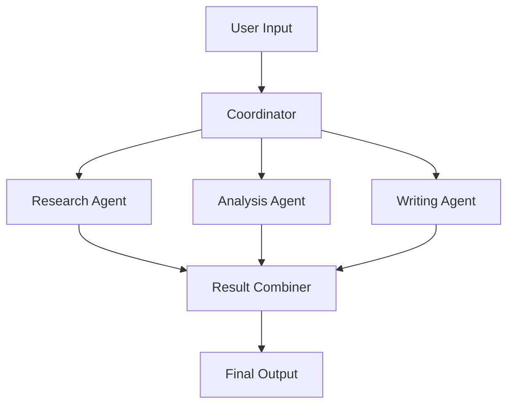
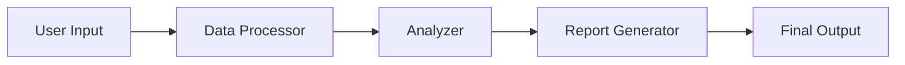
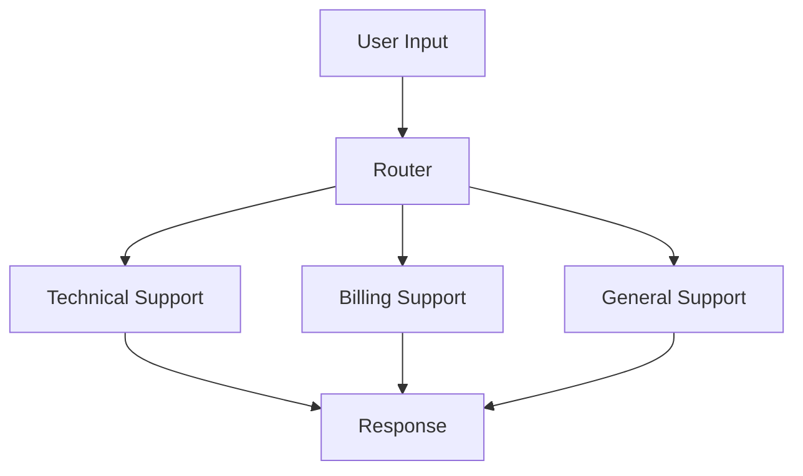

# Multi-Agent Basics

Now that you've mastered single agent configuration, let's explore one of AgenticGoKit's most powerful features: multi-agent orchestration. You'll learn how to create teams of specialized agents that work together to solve complex problems.

## Learning Objectives

By the end of this section, you'll be able to:
- Understand when and why to use multiple agents
- Configure different orchestration patterns (collaborative, sequential, route)
- Create specialized agents that work together effectively
- Choose the right orchestration pattern for different scenarios
- Build and test multi-agent workflows
- Troubleshoot multi-agent system issues

## Prerequisites

Before starting, make sure you've completed:
- ✅ [Agent Configuration](./agent-configuration.md) - Understanding of agent configuration and customization

## Why Use Multiple Agents?

Single agents are powerful, but multiple agents working together can accomplish much more sophisticated tasks. Here's why:

### Division of Labor
Instead of one agent trying to do everything, specialized agents excel at specific tasks:

- **Research Agent**: Excellent at finding and gathering information
- **Analysis Agent**: Specializes in processing and interpreting data
- **Writing Agent**: Focuses on creating clear, engaging content
- **Validation Agent**: Ensures accuracy and quality

### Parallel Processing
Multiple agents can work simultaneously, dramatically reducing processing time for complex tasks.

### Better Quality
Specialized agents often produce higher quality results in their domain than generalist agents.

### Resilience
If one agent encounters issues, others can continue working or compensate.

## Orchestration Patterns

AgenticGoKit supports several orchestration patterns, each suited for different scenarios:

### Collaborative Orchestration
Agents work in parallel, and their results are combined.



**Best for**: Research tasks, content creation, analysis requiring multiple perspectives

### Sequential Orchestration
Agents work one after another, each building on the previous agent's work.



**Best for**: Data processing pipelines, step-by-step workflows, quality assurance processes

### Route Orchestration
Requests are routed to the most appropriate agent based on content or rules.



**Best for**: Customer service, content categorization, specialized help systems

## Building Your First Multi-Agent System

Let's create a research team that can gather information, analyze it, and create a comprehensive report.

### Step 1: Create the Project

```bash
agentcli create research-team --template basic
cd research-team
```

### Step 2: Configure the Multi-Agent System

Edit `agentflow.toml` to create a collaborative research team:

```toml
[agent_flow]
name = "research-team"
version = "1.0.0"
description = "A collaborative team of research specialists"

[llm]
provider = "openai"
model = "gpt-4"
temperature = 0.7
max_tokens = 1500

[orchestration]
mode = "collaborative"
timeout_seconds = 60
collaborative_agents = ["researcher", "analyzer", "writer"]

[agents.researcher]
role = "information_gatherer"
description = "Specializes in finding and collecting relevant information"
system_prompt = """
You are a research specialist who excels at gathering comprehensive information.
Your responsibilities:

1. Identify key topics and subtopics to research
2. Find relevant facts, statistics, and examples
3. Organize information logically
4. Identify reliable sources when possible
5. Note any gaps in available information

When researching:
- Be thorough and systematic
- Focus on accuracy and relevance
- Provide specific details and examples
- Organize findings clearly
- Indicate confidence levels in your findings
"""
enabled = true

[agents.analyzer]
role = "data_analyst"
description = "Analyzes information to identify patterns and insights"
system_prompt = """
You are an analytical specialist who processes information to extract insights.
Your responsibilities:

1. Identify patterns and trends in the data
2. Draw meaningful conclusions from information
3. Highlight important relationships and connections
4. Assess the significance of findings
5. Identify implications and potential outcomes

When analyzing:
- Look for underlying patterns and themes
- Consider multiple perspectives
- Evaluate the strength of evidence
- Identify cause-and-effect relationships
- Suggest areas for deeper investigation
"""
enabled = true

[agents.writer]
role = "content_synthesizer"
description = "Creates clear, comprehensive reports from research and analysis"
system_prompt = """
You are a content specialist who synthesizes information into clear reports.
Your responsibilities:

1. Combine research and analysis into coherent narratives
2. Structure information logically and clearly
3. Write in an engaging, accessible style
4. Ensure all key points are covered
5. Create executive summaries and conclusions

When writing:
- Use clear, professional language
- Structure content with headings and sections
- Include key findings prominently
- Provide actionable insights
- Ensure the report flows logically from introduction to conclusion
"""
enabled = true
```

### Step 3: Test Your Research Team

```bash
go run . -m "Research the current state of renewable energy adoption globally, including key trends, challenges, and opportunities"
```

**What happens:**
1. All three agents receive the request simultaneously
2. The **researcher** gathers information about renewable energy
3. The **analyzer** identifies trends and patterns
4. The **writer** creates a comprehensive report
5. Results are combined into a final response

## Sequential Orchestration Example

Let's create a data processing pipeline that handles information step-by-step:

```toml
[orchestration]
mode = "sequential"
sequential_agents = ["validator", "processor", "formatter"]

[agents.validator]
role = "data_validator"
description = "Validates and cleans input data"
system_prompt = """
You are a data validation specialist. Your job is to:

1. Check data for completeness and accuracy
2. Identify and flag potential issues
3. Clean and standardize data formats
4. Provide validation reports
5. Pass clean data to the next stage

Always be thorough and document any issues found.
"""
enabled = true

[agents.processor]
role = "data_processor"
description = "Processes and transforms validated data"
system_prompt = """
You are a data processing specialist. You receive validated data and:

1. Apply necessary transformations
2. Perform calculations and aggregations
3. Generate derived metrics
4. Organize processed data logically
5. Prepare data for final formatting

Focus on accuracy and efficiency in your processing.
"""
enabled = true

[agents.formatter]
role = "output_formatter"
description = "Formats processed data for final presentation"
system_prompt = """
You are an output formatting specialist. You take processed data and:

1. Format data for clear presentation
2. Create appropriate visualizations descriptions
3. Generate summary statistics
4. Ensure consistent formatting
5. Prepare final reports

Make the output clear, professional, and actionable.
"""
enabled = true
```

## Route Orchestration Example

Create a customer service system that routes requests to appropriate specialists:

```toml
[orchestration]
mode = "route"
routing_rules = [
    { pattern = "technical|bug|error|code", agent = "technical_support" },
    { pattern = "billing|payment|invoice|charge", agent = "billing_support" },
    { pattern = "account|login|password|access", agent = "account_support" }
]
default_agent = "general_support"

[agents.technical_support]
role = "technical_specialist"
description = "Handles technical issues and troubleshooting"
system_prompt = """
You are a technical support specialist with expertise in:

- Troubleshooting software issues
- Debugging problems
- Providing technical solutions
- Explaining technical concepts clearly
- Escalating complex issues when needed

Always be patient, thorough, and solution-focused.
"""
enabled = true

[agents.billing_support]
role = "billing_specialist"
description = "Handles billing and payment related inquiries"
system_prompt = """
You are a billing support specialist who helps with:

- Payment processing issues
- Invoice questions
- Billing disputes
- Account charges
- Payment method updates

Be accurate, empathetic, and focused on resolving financial concerns.
"""
enabled = true

[agents.account_support]
role = "account_specialist"
description = "Handles account access and management issues"
system_prompt = """
You are an account support specialist who assists with:

- Login and access issues
- Password resets
- Account settings
- Profile management
- Security concerns

Prioritize security while being helpful and efficient.
"""
enabled = true

[agents.general_support]
role = "general_support"
description = "Handles general inquiries and routes complex issues"
system_prompt = """
You are a general support specialist who:

- Handles general inquiries
- Provides basic information
- Routes complex issues to specialists
- Offers helpful guidance
- Ensures customer satisfaction

Be friendly, helpful, and know when to escalate issues.
"""
enabled = true
```

## Hands-On Exercises

### Exercise 1: Build a Content Creation Team

Create a collaborative team for content creation:

1. **Research Agent**: Gathers information on the topic
2. **Outline Agent**: Creates a structured outline
3. **Writing Agent**: Writes the content
4. **Editor Agent**: Reviews and refines the content

Test with: "Create a comprehensive guide about getting started with Go programming"

### Exercise 2: Create a Data Analysis Pipeline

Build a sequential system for data analysis:

1. **Data Collector**: Gathers relevant data
2. **Data Cleaner**: Validates and cleans the data
3. **Analyzer**: Performs statistical analysis
4. **Report Generator**: Creates final reports

Test with: "Analyze the trends in remote work adoption over the past 5 years"

### Exercise 3: Build a Help Desk System

Create a routing system for different types of support requests:

1. **Technical Support**: Handles technical issues
2. **Account Support**: Manages account problems
3. **General Support**: Handles other inquiries

Test with various request types to see routing in action.

## Monitoring Multi-Agent Systems

### Understanding Agent Interactions

AgenticGoKit provides logging to help you understand how agents work together:

```bash
# Enable debug logging
export AGENTICGOKIT_LOG_LEVEL=debug
go run . -m "Your test message"
```

Look for log entries showing:
- Agent initialization
- Task distribution
- Agent processing times
- Result combination

### Performance Considerations

**Collaborative Systems:**
- Agents work in parallel (more efficient overall)
- Resource usage is higher (multiple agents active)
- Good for tasks requiring diverse expertise

**Sequential Systems:**
- Agents work one at a time (lower resource usage)
- Total time is sum of all agent times
- Good for step-by-step processes

**Route Systems:**
- Only one agent active per request (most efficient)
- Routing logic adds small overhead
- Good for specialized, focused tasks

## Troubleshooting Multi-Agent Systems

### Common Issues and Solutions

**Agents Not Collaborating Effectively:**
- Review system prompts for clarity
- Ensure agents have complementary roles
- Check that collaborative_agents list is correct

**Sequential Pipeline Breaks:**
- Verify each agent can handle the previous agent's output
- Check that sequential_agents order is logical
- Ensure proper error handling between stages

**Routing Not Working:**
- Review routing patterns and rules
- Test with clear, unambiguous requests
- Check default_agent configuration

**Performance Issues:**
- Monitor resource usage with multiple agents
- Consider timeout settings
- Optimize agent system prompts for efficiency

### Debugging Techniques

```bash
# Test individual agents
agentcli test-agent researcher "Find information about renewable energy"

# Validate configuration
agentcli validate

# Check agent connectivity
agentcli health-check
```

## Best Practices for Multi-Agent Systems

### 1. Design Clear Agent Roles

Each agent should have a distinct, well-defined purpose:

```toml
# Good: Clear, specific roles
[agents.fact_checker]
role = "fact_verification"
description = "Verifies accuracy of claims and statements"

[agents.source_finder]
role = "source_identification"
description = "Finds and evaluates source credibility"

# Avoid: Overlapping or vague roles
[agents.helper1]
role = "general_helper"
description = "Helps with various tasks"
```

### 2. Optimize Agent Communication

Design agents to work well together:

```toml
[agents.researcher]
system_prompt = """
You gather information and always structure your findings as:
1. Key Facts: [bullet points]
2. Sources: [when available]
3. Confidence Level: [high/medium/low]
4. Gaps: [what information is missing]

This format helps other agents process your findings effectively.
"""
```

### 3. Handle Edge Cases

Plan for scenarios where agents might fail or produce unexpected results:

```toml
[orchestration]
mode = "collaborative"
timeout_seconds = 120  # Prevent hanging
retry_attempts = 2     # Retry failed agents
fallback_agent = "general_assistant"  # Backup option
```

### 4. Test Thoroughly

Test your multi-agent system with various scenarios:

- Simple requests each agent can handle
- Complex requests requiring all agents
- Edge cases and error conditions
- Performance under load

## What You've Learned

✅ **Understanding of multi-agent benefits** and when to use them  
✅ **Mastery of orchestration patterns** (collaborative, sequential, route)  
✅ **Ability to design specialized agents** that work together effectively  
✅ **Hands-on experience building** multi-agent systems  
✅ **Knowledge of monitoring and troubleshooting** multi-agent workflows  
✅ **Best practices for designing** effective agent teams  

## Understanding Check

Before moving on, make sure you can:
- [ ] Explain the benefits of multi-agent systems over single agents
- [ ] Choose the appropriate orchestration pattern for different scenarios
- [ ] Configure collaborative, sequential, and route orchestration
- [ ] Design agents with complementary roles and clear responsibilities
- [ ] Troubleshoot common multi-agent system issues
- [ ] Apply best practices for multi-agent system design

## Next Steps

You've now mastered multi-agent orchestration! Next, we'll add another powerful capability to your agents: persistent memory. You'll learn how to give your agents the ability to remember information across conversations and access knowledge bases.

**[→ Continue to Adding Memory](./adding-memory.md)**

---

::: tip Multi-Agent Mastery
You now understand how to create sophisticated agent teams that can tackle complex problems through collaboration, specialization, and intelligent orchestration. This is where AgenticGoKit really shines compared to single-agent systems.
:::