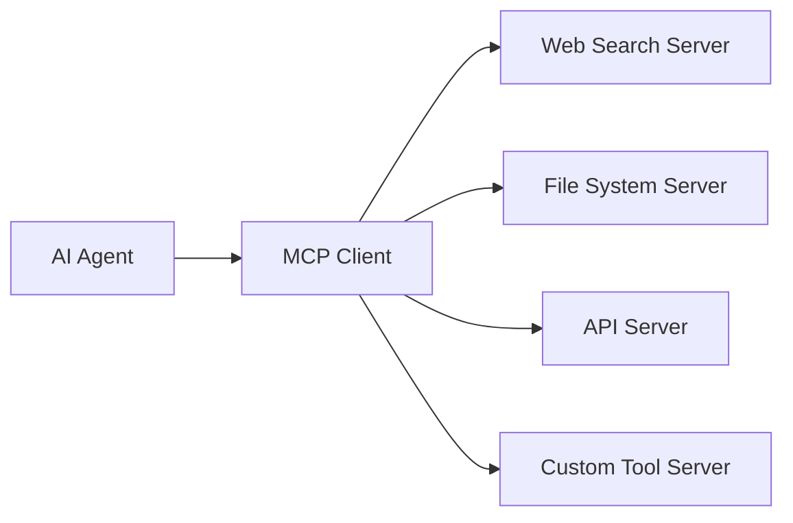

# Tool Integration

Your agents now have memory and can work together effectively. Let's take them to the next level by integrating external tools and services. This will transform your agents from conversational assistants into powerful systems that can take real actions in the world.

## Learning Objectives

By the end of this section, you'll be able to:
- Understand the Model Context Protocol (MCP) and its benefits
- Configure and integrate various MCP tools and servers
- Create agents that can perform web searches, file operations, and API calls
- Build custom tools for specific use cases
- Troubleshoot tool integration issues
- Design secure and efficient tool-enabled workflows

## Prerequisites

Before starting, make sure you've completed:
- ✅ [Adding Memory](./adding-memory.md) - Understanding of memory-enabled agents

## What Are Tools and Why Do Agents Need Them?

Without tools, agents can only generate text responses. With tools, agents can:

- **Search the web** for current information
- **Read and write files** on the local system
- **Make API calls** to external services
- **Perform calculations** and data processing
- **Interact with databases** and other systems
- **Send emails** and notifications
- **Control external devices** and services

Tools transform agents from conversational interfaces into capable digital assistants that can actually accomplish tasks.

## Introduction to MCP (Model Context Protocol)

MCP is a standardized protocol that allows AI agents to securely access external tools and data sources. Think of it as a universal adapter that lets your agents connect to almost any service or tool.

### Benefits of MCP

- **Standardized Interface**: One protocol for all tools
- **Security**: Built-in permission and sandboxing systems
- **Discoverability**: Tools can describe their capabilities automatically
- **Extensibility**: Easy to add new tools and services
- **Community**: Growing ecosystem of available tools

### How MCP Works



1. **MCP Servers** provide tools and capabilities
2. **MCP Client** (built into AgenticGoKit) manages connections
3. **Agents** request tool usage through natural language
4. **Tools** perform actions and return results

## Available MCP Tools

AgenticGoKit supports a wide range of MCP tools:

### Web and Search Tools
- **Web Search**: Search engines (Google, Bing, DuckDuckGo)
- **Web Scraping**: Extract content from web pages
- **RSS Feeds**: Monitor and read RSS/Atom feeds
- **Social Media**: Interact with Twitter, LinkedIn, etc.

### File and System Tools
- **File Operations**: Read, write, create, delete files
- **Directory Management**: Navigate and manage directories
- **System Information**: Get system stats and information
- **Process Management**: Monitor and control processes

### Data and Database Tools
- **SQL Databases**: Query PostgreSQL, MySQL, SQLite
- **NoSQL Databases**: Work with MongoDB, Redis
- **Spreadsheets**: Read and write Excel, CSV files
- **Data Processing**: Transform and analyze data

### Communication Tools
- **Email**: Send and receive emails
- **Slack**: Post messages and interact with Slack
- **Discord**: Bot functionality for Discord servers
- **SMS**: Send text messages

### Development Tools
- **Git**: Repository management and operations
- **Docker**: Container management
- **Kubernetes**: Cluster operations
- **CI/CD**: Integration with build systems

## Setting Up Tool Integration

Let's create an agent system with web search and file operation capabilities.

### Step 1: Create a Tool-Enabled Project

```bash
agentcli create research-assistant --template tools-enabled
cd research-assistant
```

### Step 2: Configure MCP Tools

Edit `agentflow.toml` to add tool capabilities:

```toml
[agent_flow]
name = "research-assistant"
version = "1.0.0"
description = "A research assistant with web search and file capabilities"

[llm]
provider = "openai"
model = "gpt-4"
temperature = 0.7
max_tokens = 2000

# MCP Configuration
[mcp]
enabled = true
timeout_seconds = 30

# Web Search Tool
[[mcp.servers]]
name = "web-search"
command = "uvx"
args = ["mcp-server-web-search"]
env = { "SEARCH_ENGINE" = "duckduckgo" }

# File System Tool
[[mcp.servers]]
name = "filesystem"
command = "uvx"
args = ["mcp-server-filesystem"]
env = { "ALLOWED_DIRECTORIES" = "/tmp,./workspace" }

# HTTP Client Tool
[[mcp.servers]]
name = "http-client"
command = "uvx"
args = ["mcp-server-fetch"]

[orchestration]
mode = "collaborative"
collaborative_agents = ["researcher", "analyst", "writer"]

[agents.researcher]
role = "web_researcher"
description = "Researches topics using web search and external sources"
system_prompt = """
You are a research specialist with access to web search and file operations.

Your capabilities include:
- Searching the web for current information
- Reading and analyzing web content
- Saving research findings to files
- Organizing information systematically

When conducting research:
1. Use web search to find current, relevant information
2. Verify information from multiple sources
3. Save important findings to organized files
4. Provide clear summaries with source citations
5. Identify areas needing further investigation

Always be thorough, accurate, and well-organized in your research.
"""
enabled = true
tools_enabled = true

[agents.analyst]
role = "data_analyst"
description = "Analyzes research data and identifies patterns"
system_prompt = """
You are a data analyst who processes research information to extract insights.

Your capabilities include:
- Reading and analyzing research files
- Identifying patterns and trends
- Creating structured analysis reports
- Generating data visualizations descriptions

When analyzing data:
1. Read research files systematically
2. Look for patterns, trends, and relationships
3. Validate findings against multiple sources
4. Create clear, structured analysis reports
5. Suggest actionable insights and recommendations

Focus on accuracy, objectivity, and clear communication.
"""
enabled = true
tools_enabled = true

[agents.writer]
role = "report_writer"
description = "Creates comprehensive reports from research and analysis"
system_prompt = """
You are a report writer who synthesizes research and analysis into clear reports.

Your capabilities include:
- Reading research and analysis files
- Creating well-structured reports
- Writing in clear, professional language
- Organizing information logically

When writing reports:
1. Read all available research and analysis
2. Structure information with clear headings
3. Include executive summaries
4. Cite sources appropriately
5. Save final reports to files

Ensure reports are comprehensive, accurate, and professionally formatted.
"""
enabled = true
tools_enabled = true
```

### Step 3: Install MCP Dependencies

MCP tools use `uvx` (part of the `uv` Python package manager):

**Install uv:**

```bash
# macOS/Linux
curl -LsSf https://astral.sh/uv/install.sh | sh

# Windows (PowerShell)
powershell -c "irm https://astral.sh/uv/install.ps1 | iex"

# Or using pip
pip install uv
```

### Step 4: Test Tool Integration

```bash
# Test web search capability
go run . -m "Search for the latest developments in renewable energy technology and save the findings to a file"

# Test file operations
go run . -m "Read the research file you just created and provide a summary"

# Test combined capabilities
go run . -m "Research the top 5 programming languages in 2024, analyze the trends, and create a comprehensive report"
```

## Advanced Tool Configuration

### Custom Tool Permissions

```toml
[[mcp.servers]]
name = "filesystem"
command = "uvx"
args = ["mcp-server-filesystem"]
env = { 
    "ALLOWED_DIRECTORIES" = "./workspace,./reports,./data",
    "READONLY_DIRECTORIES" = "./config",
    "MAX_FILE_SIZE" = "10MB"
}
```

### Tool-Specific Agent Configuration

```toml
[agents.web_specialist]
role = "web_specialist"
tools_enabled = true
allowed_tools = ["web-search", "http-client"]  # Restrict to specific tools
tool_timeout = 60                              # Tool-specific timeout
system_prompt = """
You specialize in web-based research and can:
- Search the web for information
- Fetch content from specific URLs
- Analyze web content for relevance

You cannot access file systems or other tools.
"""
```

### Environment-Specific Tool Configuration

```toml
# Development environment
[[mcp.servers]]
name = "dev-filesystem"
command = "uvx"
args = ["mcp-server-filesystem"]
env = { 
    "ALLOWED_DIRECTORIES" = "./dev-workspace",
    "DEBUG_MODE" = "true"
}

# Production environment
[[mcp.servers]]
name = "prod-filesystem"
command = "uvx"
args = ["mcp-server-filesystem"]
env = { 
    "ALLOWED_DIRECTORIES" = "/app/data",
    "READONLY_MODE" = "true",
    "AUDIT_LOG" = "true"
}
```

## Hands-On Exercises

### Exercise 1: Build a News Research Assistant

Create an assistant that can research current news and create summaries:

1. Configure web search tools
2. Add file operations for saving articles
3. Create an agent that searches for news on specific topics
4. Test with current events and trending topics
5. Have the agent save summaries to organized files

### Exercise 2: Create a Development Helper

Build an assistant that helps with development tasks:

1. Configure Git tools for repository operations
2. Add file system tools for code management
3. Configure web search for documentation lookup
4. Create agents specialized in different development tasks
5. Test with real development scenarios

### Exercise 3: Build a Data Processing Pipeline

Create a system that can fetch, process, and analyze data:

1. Configure HTTP client tools for API access
2. Add database tools for data storage
3. Configure file tools for data processing
4. Create agents for each stage of the pipeline
5. Test with real data sources and processing tasks

## Creating Custom Tools

Sometimes you need tools that don't exist in the MCP ecosystem. Here's how to create custom tools:

### Simple Custom Tool Server

Create a custom MCP server for specific business logic:

**`custom-tool-server.py`:**
```python
#!/usr/bin/env python3
import asyncio
import json
from mcp.server import Server
from mcp.types import Tool, TextContent

app = Server("custom-business-tools")

@app.list_tools()
async def list_tools():
    return [
        Tool(
            name="calculate_roi",
            description="Calculate return on investment",
            inputSchema={
                "type": "object",
                "properties": {
                    "initial_investment": {"type": "number"},
                    "final_value": {"type": "number"},
                    "time_period": {"type": "number"}
                },
                "required": ["initial_investment", "final_value", "time_period"]
            }
        ),
        Tool(
            name="format_currency",
            description="Format numbers as currency",
            inputSchema={
                "type": "object",
                "properties": {
                    "amount": {"type": "number"},
                    "currency": {"type": "string", "default": "USD"}
                },
                "required": ["amount"]
            }
        )
    ]

@app.call_tool()
async def call_tool(name: str, arguments: dict):
    if name == "calculate_roi":
        initial = arguments["initial_investment"]
        final = arguments["final_value"]
        time = arguments["time_period"]
        roi = ((final - initial) / initial) * 100
        return [TextContent(
            type="text",
            text=f"ROI: {roi:.2f}% over {time} years"
        )]
    
    elif name == "format_currency":
        amount = arguments["amount"]
        currency = arguments.get("currency", "USD")
        formatted = f"${amount:,.2f} {currency}"
        return [TextContent(
            type="text",
            text=formatted
        )]

if __name__ == "__main__":
    asyncio.run(app.run())
```

### Configure Custom Tool in AgenticGoKit

```toml
[[mcp.servers]]
name = "business-tools"
command = "python3"
args = ["./custom-tool-server.py"]
env = { "PYTHONPATH" = "." }
```

### Test Custom Tool

```bash
go run . -m "Calculate the ROI for an investment of $10,000 that became $15,000 over 3 years, and format the result as currency"
```

## Tool Security and Best Practices

### Security Considerations

**File System Access:**
```toml
[[mcp.servers]]
name = "secure-filesystem"
command = "uvx"
args = ["mcp-server-filesystem"]
env = { 
    "ALLOWED_DIRECTORIES" = "./safe-workspace",
    "DENIED_EXTENSIONS" = ".exe,.bat,.sh",
    "MAX_FILE_SIZE" = "1MB",
    "READONLY_MODE" = "false"
}
```

**Network Access:**
```toml
[[mcp.servers]]
name = "secure-http"
command = "uvx"
args = ["mcp-server-fetch"]
env = { 
    "ALLOWED_DOMAINS" = "api.example.com,docs.example.com",
    "TIMEOUT_SECONDS" = "30",
    "MAX_RESPONSE_SIZE" = "1MB"
}
```

### Best Practices

**1. Principle of Least Privilege**
Only give agents access to tools they actually need:

```toml
[agents.web_researcher]
tools_enabled = true
allowed_tools = ["web-search"]  # Only web search, no file access

[agents.file_manager]
tools_enabled = true
allowed_tools = ["filesystem"]  # Only file operations, no web access
```

**2. Validate Tool Outputs**
```toml
[agents.cautious_agent]
system_prompt = """
When using tools:
1. Validate tool outputs before using them
2. Handle tool errors gracefully
3. Never execute dangerous operations without confirmation
4. Log all tool usage for audit purposes
"""
```

**3. Monitor Tool Usage**
```bash
# Enable tool usage logging
export AGENTICGOKIT_TOOL_LOGGING=true
go run . -m "Your message"

# Review tool usage logs
agentcli tools usage --last 24h
```

## Troubleshooting Tool Integration

### Common Issues and Solutions

**Tools Not Available:**
```bash
# Check MCP server status
agentcli mcp health

# List available tools
agentcli mcp tools

# Test specific server
agentcli mcp test web-search
```

**Permission Errors:**
- Check file/directory permissions
- Verify environment variables
- Review security restrictions

**Tool Timeouts:**
- Increase timeout settings
- Check network connectivity
- Optimize tool operations

**Performance Issues:**
- Limit concurrent tool usage
- Cache tool results when appropriate
- Use appropriate tool timeouts

### Debugging Tool Operations

```bash
# Enable detailed tool debugging
export AGENTICGOKIT_MCP_DEBUG=true
export AGENTICGOKIT_TOOL_DEBUG=true
go run . -m "Test message with tools"

# Check tool server logs
agentcli mcp logs web-search

# Validate tool configurations
agentcli mcp validate
```

## What You've Learned

✅ **Understanding of MCP protocol** and its benefits for agent systems  
✅ **Configuration of various MCP tools** including web search, file operations, and APIs  
✅ **Creation of tool-enabled agents** that can perform real-world actions  
✅ **Development of custom tools** for specific business requirements  
✅ **Implementation of security best practices** for tool integration  
✅ **Troubleshooting and debugging** tool-related issues  
✅ **Design of secure, efficient workflows** using external tools  

## Understanding Check

Before moving on, make sure you can:
- [ ] Configure and integrate various MCP tools and servers
- [ ] Create agents that can perform web searches and file operations
- [ ] Build custom tools for specific use cases
- [ ] Implement appropriate security measures for tool access
- [ ] Troubleshoot common tool integration issues
- [ ] Design workflows that effectively combine multiple tools
- [ ] Monitor and audit tool usage for security and performance

## Next Steps

Your agents now have access to external tools and can perform real actions in the world! In the final tutorial section, we'll bring everything together to build sophisticated, real-world workflows that combine multi-agent orchestration, memory, and tool integration.

**[→ Continue to Building Workflows](./building-workflows.md)**

---

::: tip Tool-Powered Agents
You've just transformed your agents from text generators into capable digital assistants that can search the web, manage files, make API calls, and perform real-world tasks. This is where AI agents become truly powerful and practical.
:::