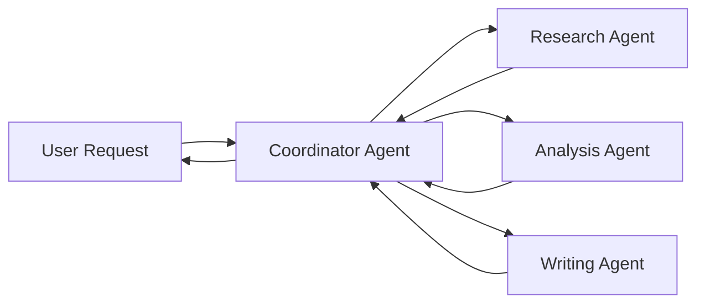

# Understanding Agents

Before we start building, let's understand what AI agents are and why AgenticGoKit's approach makes them so powerful. This foundation will help you make better decisions as you build your own agent systems.

## Learning Objectives

By the end of this section, you'll understand:
- What AI agents are and how they differ from traditional programs
- Why multi-agent systems are powerful
- AgenticGoKit's core philosophy and approach
- Key concepts: agents, orchestration, state, and events
- When to use different types of agent systems

## What Are AI Agents?

Think of an AI agent as a digital assistant that can:
- **Understand** natural language requests
- **Reason** about problems and make decisions
- **Remember** information across conversations
- **Take actions** using tools and external services
- **Collaborate** with other agents to solve complex problems

### Traditional Programs vs. AI Agents

**Traditional Program:**
```
Input → Fixed Logic → Output
```
- Follows predetermined rules
- Same input always produces same output
- Limited to programmed capabilities

**AI Agent:**
```
Input → Reasoning + Memory + Tools → Intelligent Response
```
- Adapts responses based on context
- Learns from previous interactions
- Can use external tools and services
- Handles ambiguous or complex requests

### Real-World Agent Examples

**Personal Assistant Agent:**
- Understands: "Schedule a meeting with the team next Tuesday"
- Reasons: Checks calendars, finds available times, considers time zones
- Acts: Creates calendar invites, sends notifications
- Remembers: Team preferences, meeting patterns, past decisions

**Research Agent:**
- Understands: "What are the latest trends in renewable energy?"
- Reasons: Identifies reliable sources, evaluates information quality
- Acts: Searches web, reads documents, synthesizes findings
- Remembers: Previous research topics, source reliability, user interests

## Why Multi-Agent Systems?

Single agents are powerful, but multiple agents working together can accomplish much more:

### Division of Labor
Instead of one agent trying to do everything, specialized agents excel at specific tasks:



### Parallel Processing
Multiple agents can work simultaneously:
- **Research Agent** gathers information
- **Analysis Agent** processes data
- **Validation Agent** checks accuracy
- **Writing Agent** prepares the final report

All working at the same time, then combining results.

### Resilience and Error Handling
If one agent fails, others can continue working or take over its responsibilities.

## AgenticGoKit's Philosophy

AgenticGoKit is built around several core principles:

### 1. Configuration-First Approach

Instead of writing complex code, you define your agents and their behavior in simple configuration files:

```toml
[agents.researcher]
role = "research_specialist"
description = "Gathers and organizes information from multiple sources"
system_prompt = """
You are a research specialist who excels at finding accurate, 
up-to-date information and organizing it clearly.
"""
```

**Benefits:**
- Easy to modify agent behavior without code changes
- Non-programmers can customize agents
- Version control for agent configurations
- Environment-specific configurations

### 2. Go-Native Performance

Built specifically for Go developers who need:
- **Compiled binaries** - No Python environments or dependency issues
- **Efficient memory usage** - Handle large-scale agent systems
- **Native concurrency** - True parallel agent execution with goroutines
- **Type safety** - Catch errors at compile time, not runtime

### 3. Production-Ready Architecture

Designed for real-world applications with:
- **Error handling and recovery** built-in
- **Monitoring and observability** hooks
- **Scalable orchestration** patterns
- **Resource management** and cleanup

## Core Concepts

### Agents

An **agent** in AgenticGoKit is an intelligent component that:
- Has a specific **role** and **personality** defined by its system prompt
- Can **process requests** and generate responses
- **Maintains state** across interactions
- **Uses tools** to extend its capabilities

```go
// Agent interface (simplified)
type Agent interface {
    Name() string
    GetRole() string
    Run(ctx context.Context, inputState State) (State, error)
    Initialize(ctx context.Context) error
    Shutdown(ctx context.Context) error
}
```

### State

**State** is how agents share information:
- **Data**: The actual information being processed
- **Metadata**: Context about the data (confidence scores, timestamps, etc.)
- **Persistence**: State can be saved and restored across sessions

```go
// State interface (simplified)
type State interface {
    Get(key string) (any, bool)
    Set(key string, value any)
    GetMeta(key string) (string, bool)
    SetMeta(key string, value string)
    Clone() State
    Merge(source State)
}
```

### Events

**Events** are how agents communicate:
- **Messages** between agents
- **Routing information** (which agent should handle this)
- **Metadata** for tracking and debugging

```go
// Event interface (simplified)
type Event interface {
    GetTargetAgentID() string
    GetData() EventData
    GetMetadata() map[string]string
}
```

### Orchestration

**Orchestration** defines how multiple agents work together:

**Collaborative**: Agents work in parallel, results are combined
```toml
[orchestration]
mode = "collaborative"
collaborative_agents = ["researcher", "analyzer", "validator"]
```

**Sequential**: Agents work one after another
```toml
[orchestration]
mode = "sequential"
sequential_agents = ["input_processor", "analyzer", "output_formatter"]
```

**Route**: Requests are routed to the most appropriate agent
```toml
[orchestration]
mode = "route"
# Routing logic determines which agent handles each request
```

## Mental Models for Agent Systems

### The Team Analogy

Think of your agent system like a specialized team:

- **Project Manager** (Orchestrator): Coordinates the team, assigns tasks
- **Researchers** (Research Agents): Gather information and data
- **Analysts** (Analysis Agents): Process and interpret information
- **Writers** (Content Agents): Create reports and summaries
- **Quality Assurance** (Validation Agents): Check work for accuracy

### The Assembly Line Analogy

For sequential processing:

```
Raw Input → Processing Agent → Analysis Agent → Formatting Agent → Final Output
```

Each agent adds value and passes the work to the next agent.

### The Consulting Firm Analogy

For collaborative processing:

```
Client Request → Multiple Specialists Work in Parallel → Combined Expertise → Comprehensive Solution
```

Different experts contribute their specialized knowledge simultaneously.

## When to Use Different Approaches

### Single Agent Systems
**Best for:**
- Simple, focused tasks
- Personal assistants
- Chatbots with narrow scope
- Proof of concepts

**Example**: A customer service bot that answers FAQ questions

### Multi-Agent Collaborative Systems
**Best for:**
- Complex analysis requiring different perspectives
- Research and synthesis tasks
- Creative projects needing diverse input

**Example**: A market research system with specialized agents for data gathering, trend analysis, and report writing

### Multi-Agent Sequential Systems
**Best for:**
- Data processing pipelines
- Content creation workflows
- Quality assurance processes

**Example**: A document processing system that extracts data, validates it, formats it, and generates reports

### Multi-Agent Route Systems
**Best for:**
- Customer service with specialized departments
- Content management with different content types
- Systems with clear decision trees

**Example**: A support system that routes technical questions to tech agents and billing questions to billing agents

## AgenticGoKit's Advantages

### For Developers
- **Familiar Go ecosystem** - Use tools and patterns you already know
- **Type safety** - Catch errors at compile time
- **Performance** - Compiled binaries with efficient resource usage
- **Deployment** - Single binary, no complex environments

### For AI Systems
- **Multi-agent focus** - Built specifically for agent orchestration
- **Memory integration** - Built-in support for persistent memory and RAG
- **Tool ecosystem** - MCP protocol for dynamic tool discovery
- **Production patterns** - Error handling, monitoring, scaling built-in

## Common Patterns You'll Learn

As you progress through this tutorial, you'll learn to build:

1. **Information Processing Systems**: Agents that gather, analyze, and synthesize information
2. **Content Creation Pipelines**: Agents that research, write, and refine content
3. **Decision Support Systems**: Agents that analyze options and provide recommendations
4. **Automated Workflows**: Agents that handle routine tasks with human oversight
5. **Knowledge Management**: Agents that organize, search, and retrieve information

## What You've Learned

✅ **What AI agents are** and how they differ from traditional programs  
✅ **Why multi-agent systems** are more powerful than single agents  
✅ **AgenticGoKit's philosophy** of configuration-first, Go-native development  
✅ **Core concepts** of agents, state, events, and orchestration  
✅ **When to use different** agent system patterns  
✅ **Mental models** for thinking about agent systems  

## Next Steps

Now that you understand the concepts, let's put them into practice by creating your first agent. You'll see how AgenticGoKit makes it easy to go from idea to working agent system.

**[→ Continue to Your First Agent](./first-agent.md)**

---

::: details Quick Navigation

**Previous:** [Installation](./installation.md) - Set up your development environment  
**Next:** [Your First Agent](./first-agent.md) - Build your first working agent  
**Related:** [Core Concepts](../core-concepts/README.md) - Technical deep dive into agent architecture  

:::

::: tip Key Takeaway
AgenticGoKit makes building sophisticated AI agent systems as straightforward as writing configuration files and Go code. The framework handles the complexity so you can focus on solving problems.
:::

::: details Explore Further

**Want to dive deeper into concepts?**
- [Agent Lifecycle](../core-concepts/agent-lifecycle.md) - Technical details of agent execution
- [State Management](../core-concepts/state-management.md) - How agents share and manage data
- [Message Passing](../core-concepts/message-passing.md) - Agent communication patterns

**Ready for hands-on learning?**
- [Your First Agent](./first-agent.md) - Start building immediately
- [Examples Repository](https://github.com/kunalkushwaha/agenticgokit/tree/main/examples) - Study working examples

:::