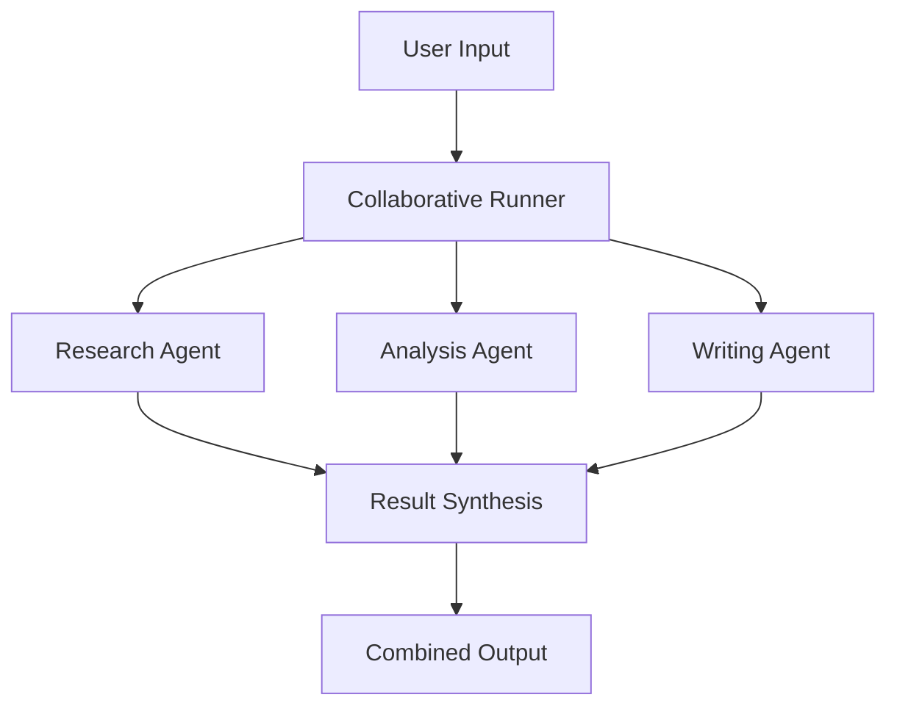

# 🤝 Multi-Agent Collaboration Example

**Three specialized agents working together to solve complex problems through parallel collaboration.**

## What This Demonstrates

- **Collaborative Orchestration**: Multiple agents processing the same input simultaneously
- **Agent Specialization**: Each agent has a specific role and expertise
- **Result Synthesis**: Automatic combination of multiple agent outputs
- **Parallel Processing**: All agents work simultaneously for faster results
- **Error Resilience**: System continues working even if some agents fail

## Architecture



## Quick Start

### 1. Setup
```bash
cd examples/02-multi-agent-collab
cp .env.example .env
# Edit .env with your OpenAI API key
```

### 2. Run
```bash
go run main.go "Explain the impact of artificial intelligence on modern healthcare"
```

### 3. Expected Output
```
🤝 Multi-Agent Collaboration Starting...
📊 Initializing 3 specialized agents...

🤖 [Research Agent] Gathering information about AI in healthcare...
🤖 [Analysis Agent] Analyzing implications and trends...
🤖 [Writing Agent] Structuring comprehensive response...

✅ Collaboration Complete! (4.2s)

📄 Combined Response:
==================================================
ARTIFICIAL INTELLIGENCE IN MODERN HEALTHCARE

[Research Findings]
AI is revolutionizing healthcare through diagnostic imaging, drug discovery, 
personalized treatment plans, and predictive analytics...

[Analysis & Implications]
The integration of AI in healthcare presents both opportunities and challenges.
Key benefits include improved diagnostic accuracy, reduced costs...

[Structured Summary]
In conclusion, AI's impact on healthcare is transformative, offering
unprecedented opportunities for improving patient outcomes...
==================================================

📊 Collaboration Stats:
   • Total agents: 3
   • Successful responses: 3
   • Failed responses: 0
   • Processing time: 4.2s
   • Combined response length: 1,247 words
```

## Code Walkthrough

### main.go - Orchestrating Multiple Agents

```go
package main

import (
    "context"
    "fmt"
    "os"
    "strings"
    "time"
    
    "github.com/kunalkushwaha/agenticgokit/core"
)

func main() {
    // 1. Get the topic from command line
    if len(os.Args) < 2 {
        fmt.Println("Usage: go run main.go \"Your complex topic or question\"")
        fmt.Println("Example: go run main.go \"Impact of AI on healthcare\"")
        os.Exit(1)
    }
    topic := os.Args[1]

    // 2. Set up the LLM provider
    provider := core.OpenAIProvider{
        APIKey:      os.Getenv("OPENAI_API_KEY"),
        Model:       "gpt-4", // Using GPT-4 for better quality
        Temperature: 0.7,
        MaxTokens:   800, // Longer responses for detailed analysis
    }

    // 3. Create specialized agents with distinct roles
    agents := map[string]core.AgentHandler{
        "researcher": createResearchAgent(provider),
        "analyzer":   createAnalysisAgent(provider),
        "writer":     createWritingAgent(provider),
    }

    // 4. Create collaborative runner
    runner := core.CreateCollaborativeRunner(agents, 60*time.Second)

    // 5. Process the topic with all agents
    fmt.Printf("🤝 Multi-Agent Collaboration Starting...\n")
    fmt.Printf("📊 Initializing %d specialized agents...\n\n", len(agents))

    startTime := time.Now()

    result, err := runner.ProcessMessage(context.Background(), topic)

    duration := time.Since(startTime)

    // 6. Handle results
    if err != nil {
        fmt.Printf("❌ Collaboration failed: %v\n", err)
        os.Exit(1)
    }

    // 7. Display the combined results
    fmt.Printf("✅ Collaboration Complete! (%v)\n\n", duration)
    
    fmt.Printf("📄 Combined Response:\n")
    fmt.Printf("=" + strings.Repeat("=", 50) + "\n")
    fmt.Printf("%s\n", result.Content)
    fmt.Printf("=" + strings.Repeat("=", 50) + "\n\n")

    // 8. Show collaboration statistics
    displayStats(result, duration, len(agents))
}

// Create a research-focused agent
func createResearchAgent(provider core.LLMProvider) core.AgentHandler {
    return core.NewLLMAgent("researcher", provider).
        WithSystemPrompt(`You are a research specialist. Your role is to:
        - Gather comprehensive information about the topic
        - Find relevant facts, statistics, and current developments
        - Identify key trends and recent breakthroughs
        - Provide well-sourced, factual information
        - Focus on breadth of information and current relevance
        
        Format your response with clear sections and bullet points.
        Always indicate when information might need verification.`)
}

// Create an analysis-focused agent  
func createAnalysisAgent(provider core.LLMProvider) core.AgentHandler {
    return core.NewLLMAgent("analyzer", provider).
        WithSystemPrompt(`You are an analysis specialist. Your role is to:
        - Analyze implications and deeper meanings
        - Identify patterns, connections, and relationships
        - Evaluate pros and cons, opportunities and challenges
        - Provide critical thinking and strategic insights
        - Focus on depth of understanding and implications
        
        Structure your analysis with clear reasoning and evidence.
        Consider multiple perspectives and potential outcomes.`)
}

// Create a writing-focused agent
func createWritingAgent(provider core.LLMProvider) core.AgentHandler {
    return core.NewLLMAgent("writer", provider).
        WithSystemPrompt(`You are a writing specialist. Your role is to:
        - Structure information in a clear, engaging format
        - Create compelling narratives and explanations
        - Ensure logical flow and readability
        - Synthesize complex information into accessible content
        - Focus on clarity, engagement, and comprehensive coverage
        
        Create well-organized content with proper headings and structure.
        Make complex topics accessible to a general audience.`)
}

// Display detailed collaboration statistics
func displayStats(result core.AgentResult, duration time.Duration, totalAgents int) {
    fmt.Printf("📊 Collaboration Stats:\n")
    fmt.Printf("   • Total agents: %d\n", totalAgents)
    
    // Extract agent-specific results from metadata
    if metadata := result.Metadata; metadata != nil {
        if successful, ok := metadata["successful_agents"].(int); ok {
            fmt.Printf("   • Successful responses: %d\n", successful)
            fmt.Printf("   • Failed responses: %d\n", totalAgents-successful)
        }
    }
    
    fmt.Printf("   • Processing time: %v\n", duration)
    fmt.Printf("   • Combined response length: %d words\n", 
        len(strings.Fields(result.Content)))
    
    // Performance insights
    if duration < 5*time.Second {
        fmt.Printf("   • Performance: ⚡ Excellent (< 5s)\n")
    } else if duration < 10*time.Second {
        fmt.Printf("   • Performance: ✅ Good (< 10s)\n")
    } else {
        fmt.Printf("   • Performance: ⚠️  Slow (> 10s)\n")
    }
}
```

### Key Concepts Explained

#### 1. **Collaborative Orchestration**
```go
runner := core.CreateCollaborativeRunner(agents, 60*time.Second)
```
- **Parallel Execution**: All agents process the input simultaneously
- **Timeout**: Maximum time to wait for all agents to complete
- **Result Synthesis**: Automatically combines outputs from all agents

#### 2. **Agent Specialization**
Each agent has a distinct role and system prompt:
- **Researcher**: Gathers facts and current information
- **Analyzer**: Provides deep analysis and implications
- **Writer**: Structures and presents information clearly

#### 3. **Error Resilience**
```go
// The system continues even if some agents fail
// Successful agent responses are still combined
```

## Advanced Usage

### 1. Custom Agent Combinations

#### Technical Analysis Team
```go
agents := map[string]core.AgentHandler{
    "architect":  createArchitectAgent(provider),
    "security":   createSecurityAgent(provider),
    "performance": createPerformanceAgent(provider),
    "testing":    createTestingAgent(provider),
}
```

#### Creative Team
```go
agents := map[string]core.AgentHandler{
    "ideator":    createIdeationAgent(provider),
    "designer":   createDesignAgent(provider),
    "copywriter": createCopywriterAgent(provider),
    "reviewer":   createReviewAgent(provider),
}
```

### 2. Dynamic Agent Selection

```go
func selectAgentsForTopic(topic string) map[string]core.AgentHandler {
    agents := make(map[string]core.AgentHandler)
    
    // Always include core agents
    agents["researcher"] = createResearchAgent(provider)
    agents["writer"] = createWritingAgent(provider)
    
    // Add specialized agents based on topic
    if strings.Contains(strings.ToLower(topic), "technical") {
        agents["architect"] = createArchitectAgent(provider)
    }
    
    if strings.Contains(strings.ToLower(topic), "business") {
        agents["strategist"] = createStrategyAgent(provider)
    }
    
    return agents
}
```

### 3. Real-time Collaboration Monitoring

```go
// Monitor agent progress in real-time
runner.OnAgentStart(func(agentName string, input core.State) {
    fmt.Printf("🤖 [%s] Starting analysis...\n", agentName)
})

runner.OnAgentComplete(func(agentName string, result core.AgentResult) {
    fmt.Printf("✅ [%s] Completed in %v\n", agentName, result.Duration)
})

runner.OnAgentError(func(agentName string, err error) {
    fmt.Printf("❌ [%s] Failed: %v\n", agentName, err)
})
```

## Configuration Options

### Environment Variables (.env)
```bash
# Required
OPENAI_API_KEY=sk-your-openai-api-key-here

# Optional: Collaboration Settings
COLLABORATION_TIMEOUT=60s
MAX_CONCURRENT_AGENTS=5
FAILURE_THRESHOLD=0.5

# Optional: Model Settings
OPENAI_MODEL=gpt-4
OPENAI_TEMPERATURE=0.7
OPENAI_MAX_TOKENS=800
```

### agentflow.toml Configuration
```toml
[orchestration]
mode = "collaborative"
timeout = "60s"
max_concurrency = 5
failure_threshold = 0.5

[agents.researcher]
system_prompt = "You are a research specialist..."
temperature = 0.3  # More factual

[agents.analyzer]  
system_prompt = "You are an analysis specialist..."
temperature = 0.7  # Balanced

[agents.writer]
system_prompt = "You are a writing specialist..."
temperature = 0.8  # More creative
```

## Performance Optimization

### 1. Parallel Processing Tuning
```go
// Optimize for speed
runner := core.CreateCollaborativeRunner(agents, 30*time.Second).
    WithMaxConcurrency(10).
    WithFailureThreshold(0.3) // Allow 30% failures

// Optimize for quality
runner := core.CreateCollaborativeRunner(agents, 120*time.Second).
    WithMaxConcurrency(3).
    WithFailureThreshold(0.1) // Allow only 10% failures
```

### 2. Model Selection Strategy
```go
// Fast agents for initial processing
fastProvider := core.OpenAIProvider{Model: "gpt-3.5-turbo"}

// Quality agents for final synthesis
qualityProvider := core.OpenAIProvider{Model: "gpt-4"}

agents := map[string]core.AgentHandler{
    "researcher": core.NewLLMAgent("researcher", fastProvider),
    "analyzer":   core.NewLLMAgent("analyzer", fastProvider), 
    "synthesizer": core.NewLLMAgent("synthesizer", qualityProvider),
}
```

### 3. Response Caching
```go
// Cache responses for similar topics
cache := core.NewResponseCache(1*time.Hour)

runner := core.CreateCollaborativeRunner(agents, 60*time.Second).
    WithCache(cache)
```

## Error Handling & Debugging

### Common Issues

#### Partial Agent Failures
```go
// Handle cases where some agents fail
if result.Metadata["failed_agents"].(int) > 0 {
    fmt.Printf("⚠️  %d agents failed, but collaboration continued\n", 
        result.Metadata["failed_agents"].(int))
}
```

#### Timeout Issues
```go
// Increase timeout for complex topics
runner := core.CreateCollaborativeRunner(agents, 120*time.Second)

// Or handle timeouts gracefully
ctx, cancel := context.WithTimeout(context.Background(), 90*time.Second)
defer cancel()

result, err := runner.ProcessMessageWithContext(ctx, topic)
```

#### Rate Limiting
```go
// Add delays between agent calls
runner := core.CreateCollaborativeRunner(agents, 60*time.Second).
    WithRateLimit(2*time.Second) // 2 second delay between agents
```

### Debug Mode
```bash
# Enable detailed logging
export AGENTICGOKIT_LOG_LEVEL=debug
export AGENTICGOKIT_TRACE_AGENTS=true
go run main.go "Your topic"
```

## Comparison with Sequential Processing

| Aspect | Collaborative | Sequential |
|--------|---------------|------------|
| **Speed** | Fast (parallel) | Slower (step-by-step) |
| **Resource Usage** | Higher (simultaneous API calls) | Lower (one at a time) |
| **Result Quality** | Diverse perspectives | Refined through stages |
| **Error Impact** | Partial failures OK | One failure stops all |
| **Use Cases** | Brainstorming, analysis | Data processing, refinement |

## Next Steps

- **[🔄 Sequential Pipeline](../03-sequential-pipeline/)** - Step-by-step processing
- **[🧠 Memory & RAG](../04-rag-knowledge-base/)** - Add persistent knowledge
- **[🏭 Production System](../05-production-system/)** - Full production deployment
- **[🔧 Custom Tools](../06-custom-tools/)** - Integrate external tools

---

**💡 Pro Tip**: Collaborative agents excel at complex analysis and creative tasks where multiple perspectives add value. For data processing pipelines, consider sequential orchestration instead!