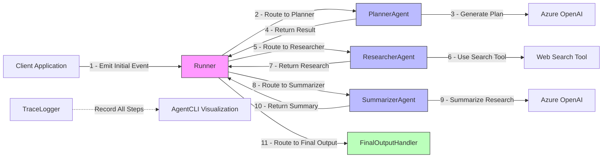

# Multi Agent workflow.

This example demonstrates how to implement a multi-agent workflow using the AgentFlow framework with tracing enabled. It showcases a research workflow that breaks down a complex task into specialized steps handled by different agents.

## Architecture
The example implements a research pipeline with four specialized agents:


## Prerequisites
To run this example, you need:

- Azure OpenAI Service credentials:
    - Endpoint URL
    - API Key
    - Chat Deployment name
    - Embedding Deployment name (optional)
- Go 1.21 or later

## Setup
Set the following environment variables with your Azure OpenAI credentials:
```bash
export AZURE_OPENAI_ENDPOINT="https://your-resource-name.openai.azure.com"
export AZURE_OPENAI_API_KEY="your-api-key"
export AZURE_OPENAI_CHAT_DEPLOYMENT="gpt-35-turbo" # or your deployment name
export AZURE_OPENAI_EMBEDDING_DEPLOYMENT="text-embedding-ada-002" # optional
```

## Running the Example
From the agentflow directory:
```bash
go run ./examples/clean_multi_agent/
```

The application will:

- Initialize the agents with Azure OpenAI
- Set up a research workflow
- Process a sample research request
- Save the execution trace to a traces directory
- Output the final summary

## Agent Components
1. Planner Agent
    - Receives the initial user request
    - Generates a structured research plan using Azure OpenAI
    - Routes to the researcher agent
2. Researcher Agent
    - Takes the research plan as input
    - Simulates gathering information (with stub implementation)
    - Can be extended to use the web search tool for real research
    - Routes to the summarizer agent
3. Summarizer Agent
    - Takes research results as input
    - Creates a concise summary using Azure OpenAI
    - Routes to the final output agent
4. Final Output Agent
    - Collects the final state
    - Signals workflow completion
    - Provides access to the final results

## Tracing & Observability

This example demonstrates AgentFlow's tracing capabilities:

- Complete execution traces are saved as JSON files
- Trace visualization using the agentcli tool
- Comprehensive agent execution tracking

View the trace with:
```bash
agentcli trace --flow-only <session-id>
```

## Extending the Example
You can extend this example by:

- Implementing a real web search capability in the researcher agent
- Adding memory to maintain context across multiple requests
- Implementing circuit breakers (code is included but commented out)
- Creating more specialized agents for different research tasks