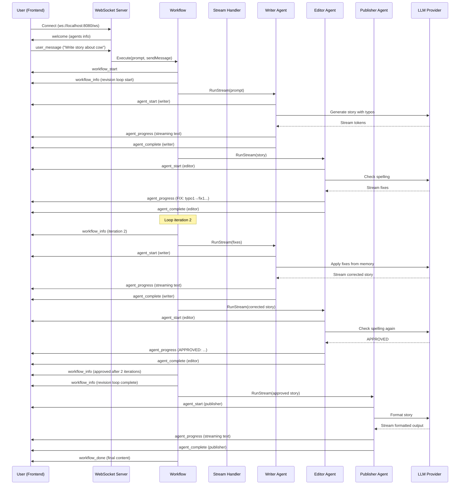

# Story Writer Chat v2 - Architecture Guide

> **Audience**: Product Managers, Software Architects, and Engineers implementing similar agentic workflows with real-time UI

This document explains the architecture, communication protocols, and integration patterns for building a multi-agent workflow application with real-time streaming updates to a web frontend.

---

## Table of Contents

1. [System Overview](#system-overview)
2. [Architecture Layers](#architecture-layers)
3. [Communication Protocol](#communication-protocol)
4. [Component Integration](#component-integration)
5. [Message Flow](#message-flow)
6. [Implementation Guide](#implementation-guide)
7. [Frontend Integration](#frontend-integration)

---

## System Overview

### High-Level Architecture

```
┌─────────────────────────────────────────────────────────────┐
│                        Frontend (React)                      │
│  - Chat UI with message bubbles                             │
│  - Real-time agent status panel                             │
│  - WebSocket client                                          │
└──────────────────────┬──────────────────────────────────────┘
                       │ WebSocket (JSON messages)
                       ↓
┌─────────────────────────────────────────────────────────────┐
│                    Backend (Go Server)                       │
│  ┌───────────────────────────────────────────────────────┐  │
│  │  Infrastructure Layer (infrastructure/)               │  │
│  │  - WebSocket server (websocket.go)                   │  │
│  │  - Message types & serialization (messages.go)       │  │
│  │  - Configuration loader (config/)                    │  │
│  └───────────────────────────────────────────────────────┘  │
│                           ↓                                  │
│  ┌───────────────────────────────────────────────────────┐  │
│  │  Workflow Layer (workflow/)                           │  │
│  │  - Workflow orchestration (story_workflow.go)        │  │
│  │  - Agent definitions (agents.go)                     │  │
│  │  - Stream handlers (handlers.go)                     │  │
│  │  - Transform functions (transforms.go)               │  │
│  │  - Prompts (prompts.go)                              │  │
│  └───────────────────────────────────────────────────────┘  │
│                           ↓                                  │
│  ┌───────────────────────────────────────────────────────┐  │
│  │  AgenticGoKit Core (core/vnext)                       │  │
│  │  - Agent runtime                                      │  │
│  │  - Workflow engine (Sequential, Parallel, Loop)      │  │
│  │  - Streaming infrastructure                          │  │
│  │  - LLM providers integration                         │  │
│  └───────────────────────────────────────────────────────┘  │
└─────────────────────────────────────────────────────────────┘
                           ↓
┌─────────────────────────────────────────────────────────────┐
│                    LLM Provider (HuggingFace)                │
│                    (or OpenAI, Anthropic, etc.)              │
└─────────────────────────────────────────────────────────────┘
```

---

## Architecture Layers

### 1. Configuration Layer (`config/`)

**File**: `config/config.go`

**Purpose**: Centralized configuration management

**Structure**:
```go
type Config struct {
    Provider string // LLM provider: "huggingface", "openai", etc.
    Model    string // Model name: "Qwen/Qwen2.5-72B-Instruct"
    APIKey   string // API authentication key
}
```

**Loading Order**:
1. Check environment variables: `LLM_PROVIDER`, `LLM_MODEL`, `LLM_API_KEY`
2. Fall back to `.env` file
3. Apply defaults if not found

**Implementation Pattern**:
```go
cfg, err := config.Load()
if err != nil {
    log.Fatal("Configuration error:", err)
}
```

---

### 2. Infrastructure Layer (`infrastructure/`)

#### WebSocket Server (`websocket.go`)

**Purpose**: Real-time bidirectional communication between backend and frontend

**Key Components**:

```go
type WebSocketServer struct {
    upgrader   websocket.Upgrader
    clients    map[*websocket.Conn]bool
    broadcast  chan WSMessage
    register   chan *websocket.Conn
    unregister chan *websocket.Conn
}
```

**Connection Lifecycle**:
1. **Upgrade**: HTTP → WebSocket on `/ws` endpoint
2. **Register**: Add client to active connections
3. **Read Loop**: Listen for incoming messages (user prompts)
4. **Write Loop**: Send workflow updates to client
5. **Unregister**: Clean up on disconnect

**CORS Configuration**:
- Allows `http://localhost:5173` (Vite dev server)
- Credentials enabled for session management

#### Message Protocol (`messages.go`)

**Purpose**: Define structured communication format

**Message Types**:

| Type | Direction | Purpose | Example Payload |
|------|-----------|---------|----------------|
| `welcome` | Backend → Frontend | Initial connection | `{service: "Story Writer", agents: [...]}` |
| `user_message` | Frontend → Backend | User input | `{content: "Write a story about..."}` |
| `workflow_start` | Backend → Frontend | Workflow begins | `{content: "Starting pipeline..."}` |
| `agent_start` | Backend → Frontend | Agent begins work | `{agent: "writer", content: "Starting writer..."}` |
| `agent_progress` | Backend → Frontend | Streaming content | `{agent: "writer", content: "Once upon a time..."}` |
| `agent_complete` | Backend → Frontend | Agent finished | `{agent: "writer", success: true, duration: 5.2}` |
| `workflow_info` | Backend → Frontend | Coordination messages | `{content: "🔄 Iteration 2 starting..."}` |
| `workflow_done` | Backend → Frontend | Workflow complete | `{content: "[final output]", total_tokens: 1500}` |
| `error` | Backend → Frontend | Error occurred | `{content: "LLM API error", agent: "writer"}` |

**Message Structure**:
```go
type WSMessage struct {
    Type      MessageType            `json:"type"`
    Content   string                 `json:"content"`
    Agent     string                 `json:"agent,omitempty"`
    Timestamp float64                `json:"timestamp"`
    Metadata  map[string]interface{} `json:"metadata,omitempty"`
}
```

**Agent Info Structure**:
```go
type AgentInfo struct {
    Name        string `json:"name"`        // Internal identifier
    DisplayName string `json:"display_name"` // UI label
    Icon        string `json:"icon"`         // Emoji/icon
    Color       string `json:"color"`        // UI color theme
    Description string `json:"description"`  // Tooltip/description
}
```

---

### 3. Workflow Layer (`workflow/`)

The workflow layer is split into focused modules:

#### Main Orchestration (`story_workflow.go`)

**Purpose**: Coordinate the overall workflow execution

**Key Structure**:
```go
type StoryWriterWorkflow struct {
    writer        vnext.Agent // Individual agents
    editor        vnext.Agent
    publisher     vnext.Agent
    revisionLoop  vnext.Agent // SubWorkflow: Loop[Writer↔Editor]
    storyPipeline vnext.Agent // SubWorkflow: Sequential[Loop→Publisher]
    config        *config.Config
    messageSender infrastructure.MessageSender
}
```

**Workflow Composition**:
```
Sequential Pipeline
├── Step 1: Revision Loop (SubWorkflow)
│   └── Loop (max 3 iterations, exits on "APPROVED")
│       ├── Writer Agent (creates/revises story)
│       └── Editor Agent (reviews/approves)
└── Step 2: Publisher Agent (formats final output)
```

**Interface Methods**:
```go
func (sw *StoryWriterWorkflow) Name() string
func (sw *StoryWriterWorkflow) WelcomeMessage() string
func (sw *StoryWriterWorkflow) GetAgents() []infrastructure.AgentInfo
func (sw *StoryWriterWorkflow) Execute(ctx context.Context, prompt string, sendMessage infrastructure.MessageSender) error
func (sw *StoryWriterWorkflow) Cleanup(ctx context.Context) error
```

#### Agent Definitions (`agents.go`)

**Purpose**: Create and configure individual agents

**Agent Creation Pattern**:
```go
func CreateWriter(cfg *config.Config) (vnext.Agent, error) {
    return vnext.QuickChatAgentWithConfig("Writer", &vnext.Config{
        Name:         "writer",
        SystemPrompt: WriterSystemPrompt,
        Timeout:      90 * time.Second,
        Streaming:    &vnext.StreamingConfig{
            Enabled:       true,
            BufferSize:    50,
            FlushInterval: 50,
        },
        Memory: &vnext.MemoryConfig{
            Provider: "memory",
            RAG: &vnext.RAGConfig{
                MaxTokens:       2000,
                PersonalWeight:  0.8,
                KnowledgeWeight: 0.2,
                HistoryLimit:    5,
            },
        },
        LLM: vnext.LLMConfig{
            Provider:    cfg.Provider,
            Model:       cfg.Model,
            Temperature: 0.3,
            MaxTokens:   500,
            APIKey:      cfg.APIKey,
        },
    })
}
```

**Key Configuration Options**:
- **Streaming**: Enables real-time token-by-token output
- **Memory**: Conversation history for context retention
- **Temperature**: Controls output randomness (0.0-1.0)
- **MaxTokens**: Limits response length

#### Stream Handlers (`handlers.go`)

**Purpose**: Process streaming chunks and convert to WebSocket messages

**Handler Architecture**:
```go
type StreamHandler struct {
    sendMessage             infrastructure.MessageSender
    currentAgent            string
    currentAgentDisplay     string
    agentContent            string
    finalContent            string
    isSubWorkflow           bool
    seenSubworkflowStart    bool
    seenSubworkflowComplete bool
    seenAgents              map[string]bool
}
```

**Chunk Processing**:

| Chunk Type | Handler Method | Output Message Type |
|------------|---------------|---------------------|
| `ChunkTypeAgentStart` | `HandleAgentStart()` | `agent_start` or `workflow_info` |
| `ChunkTypeText/Delta` | `HandleContent()` | `agent_progress` |
| `ChunkTypeAgentComplete` | `HandleAgentComplete()` | `agent_complete` |
| `ChunkTypeMetadata` | `HandleMetadata()` | `workflow_info` |
| `ChunkTypeError` | `HandleError()` | `error` |

**Critical Features**:
- **Nested Agent Detection**: Uses `parent_subworkflow` metadata to identify nested agents
- **Duplicate Prevention**: Tracks seen agents to avoid duplicate start messages in loops
- **Display Name Mapping**: Maps internal step names (`write`) to UI names (`writer`)
- **Content Accumulation**: Buffers streaming content per agent

#### Transform Functions (`transforms.go`)

**Purpose**: Modify agent inputs to add context or instructions

**Pattern**:
```go
func WriterTransform(input string) string {
    if strings.Contains(input, "FIX:") {
        // Revision scenario - retrieve from memory
        return input + "\n\n[RETRIEVE YOUR PREVIOUS STORY FROM MEMORY...]"
    }
    // Initial draft scenario
    return input + "\n\n[WRITE STORY WITH 2-3 SPELLING ERRORS...]"
}
```

**Use Cases**:
- Add runtime instructions
- Format input for specific agent expectations
- Inject debugging information
- Append enforcement rules

#### Prompts (`prompts.go`)

**Purpose**: Centralize all system prompts as constants

**Structure**:
```go
const (
    WriterSystemPrompt = `You are a story writer...`
    EditorSystemPrompt = `You are a spelling checker...`
    PublisherSystemPrompt = `You format text...`
)
```

**Benefits**:
- Version control for prompt engineering
- Easy A/B testing
- Consistent behavior across agent instances
- Separation from code logic

---

## Communication Protocol

### WebSocket Message Flow

#### 1. Connection Establishment

```
Frontend                    Backend
   |                           |
   |--- HTTP Upgrade (ws://)-->|
   |<---- 101 Switching --------|
   |<---- welcome message ------|
   |     (agents, service info) |
```

**Welcome Message Example**:
```json
{
  "type": "welcome",
  "content": "Connected to Story Writer",
  "timestamp": 1699884000.0,
  "metadata": {
    "service": "Story Writer (SubWorkflow Demo)",
    "agents": [
      {"name": "writer", "display_name": "Writer", "icon": "✍️", "color": "blue"},
      {"name": "editor", "display_name": "Editor", "icon": "✏️", "color": "green"},
      {"name": "publisher", "display_name": "Publisher", "icon": "📚", "color": "purple"}
    ]
  }
}
```

#### 2. User Input

```json
{
  "type": "user_message",
  "content": "Write a story in 100 words about a Cow. Make some typos in story",
  "timestamp": 1699884010.0
}
```

#### 3. Workflow Execution Stream

**A. Workflow Start**
```json
{
  "type": "workflow_start",
  "content": "Starting story pipeline with smart loop exit...",
  "timestamp": 1699884010.1
}
```

**B. Subworkflow Coordination** (Optional - for nested workflows)
```json
{
  "type": "workflow_info",
  "content": "🔄 Starting revision loop (Writer ↔ Editor until approved)",
  "timestamp": 1699884010.2,
  "metadata": {
    "subworkflow": "revision_loop",
    "event": "start"
  }
}
```

**C. Agent Lifecycle - Start**
```json
{
  "type": "agent_start",
  "agent": "writer",
  "content": "✍️ Starting writer...",
  "timestamp": 1699884010.3
}
```

**D. Agent Lifecycle - Progress** (Streaming, multiple messages)
```json
{
  "type": "agent_progress",
  "agent": "writer",
  "content": "Once upon a time, in a quiet vilage, there lived a cow named",
  "timestamp": 1699884012.5
}
```

```json
{
  "type": "agent_progress",
  "agent": "writer",
  "content": " Bessie. Bessie was no ordinairy cow...",
  "timestamp": 1699884013.1
}
```

**E. Agent Lifecycle - Complete**
```json
{
  "type": "agent_complete",
  "agent": "writer",
  "content": "[full story with typos]",
  "timestamp": 1699884015.0,
  "metadata": {
    "success": true,
    "duration": 4.7,
    "tokens": 150
  }
}
```

**F. Loop Iteration Info** (For loop workflows)
```json
{
  "type": "workflow_info",
  "content": "🔄 Iteration 2 starting...",
  "timestamp": 1699884020.0,
  "metadata": {
    "subworkflow": "revision_loop",
    "event": "iteration",
    "iteration": 2
  }
}
```

**G. Loop Exit**
```json
{
  "type": "workflow_info",
  "content": "✅ Story approved after 2 iteration(s)",
  "timestamp": 1699884030.0,
  "metadata": {
    "subworkflow": "revision_loop",
    "event": "exit",
    "exit_reason": "condition_met",
    "total_iterations": 2
  }
}
```

**H. Workflow Complete**
```json
{
  "type": "workflow_done",
  "content": "## Bessie the Brave\n\n[final formatted story]",
  "timestamp": 1699884040.0,
  "metadata": {
    "success": true,
    "total_tokens": 1500
  }
}
```

#### 4. Error Handling

```json
{
  "type": "error",
  "content": "LLM API rate limit exceeded",
  "agent": "writer",
  "timestamp": 1699884015.0
}
```

---

## Component Integration

### Backend Server Entry Point (`main.go`)

```go
func main() {
    // 1. Load configuration
    cfg, err := config.Load()
    handleError(err)

    // 2. Validate LLM connection
    validateLLMConnection(cfg)

    // 3. Create workflow
    workflow, err := workflow.NewStoryWriterWorkflow(cfg)
    handleError(err)
    defer workflow.Cleanup(context.Background())

    // 4. Create WebSocket server
    wsServer := infrastructure.NewWebSocketServer(workflow)

    // 5. Setup HTTP routes
    http.HandleFunc("/ws", wsServer.HandleWebSocket)
    http.HandleFunc("/health", healthCheckHandler)

    // 6. Start server
    log.Printf("🚀 Starting WebSocket Server...")
    log.Printf("📡 WebSocket API: ws://localhost:8080/ws")
    log.Fatal(http.ListenAndServe(":8080", nil))
}
```

### WebSocket Message Handler

```go
func (ws *WebSocketServer) HandleWebSocket(w http.ResponseWriter, r *http.Request) {
    conn, err := ws.upgrader.Upgrade(w, r, nil)
    if err != nil {
        return
    }
    
    // Register client
    ws.register <- conn
    defer func() {
        ws.unregister <- conn
        conn.Close()
    }()

    // Send welcome message
    ws.sendWelcome(conn)

    // Read user messages
    for {
        var msg WSMessage
        err := conn.ReadJSON(&msg)
        if err != nil {
            break
        }

        if msg.Type == MsgTypeUserMessage {
            // Execute workflow with streaming
            ctx := context.Background()
            err := ws.workflow.Execute(ctx, msg.Content, func(wsMsg WSMessage) {
                ws.broadcast <- wsMsg
            })
            if err != nil {
                ws.broadcast <- WSMessage{
                    Type:    MsgTypeError,
                    Content: err.Error(),
                }
            }
        }
    }
}
```

### Workflow Execution with Streaming

```go
func (sw *StoryWriterWorkflow) Execute(ctx context.Context, prompt string, sendMessage infrastructure.MessageSender) error {
    // 1. Send workflow start
    sendMessage(infrastructure.WSMessage{
        Type:    infrastructure.MsgTypeWorkflowStart,
        Content: "Starting story pipeline...",
    })

    // 2. Execute workflow with streaming
    stream, err := sw.storyPipeline.RunStream(ctx, prompt)
    if err != nil {
        return err
    }

    // 3. Create stream handler
    handler := NewStreamHandler(sendMessage)

    // 4. Process all chunks
    for chunk := range stream.Chunks() {
        switch chunk.Type {
        case vnext.ChunkTypeAgentStart:
            handler.HandleAgentStart(chunk)
        case vnext.ChunkTypeText, vnext.ChunkTypeDelta:
            handler.HandleContent(chunk)
        case vnext.ChunkTypeAgentComplete:
            handler.HandleAgentComplete(chunk)
        case vnext.ChunkTypeMetadata:
            handler.HandleMetadata(chunk)
        case vnext.ChunkTypeError:
            handler.HandleError(chunk)
        }
    }

    // 5. Wait for completion
    result, err := stream.Wait()
    if err != nil {
        return err
    }

    // 6. Send workflow done
    sendMessage(infrastructure.WSMessage{
        Type:    infrastructure.MsgTypeWorkflowDone,
        Content: result.Content,
        Metadata: map[string]interface{}{
            "success":      true,
            "total_tokens": result.TokensUsed,
        },
    })

    return nil
}
```

---

## Message Flow

### Example: Story Writing Session



---

## Implementation Guide

### For Product Managers

**Key Decision Points**:

1. **Message Granularity**: 
   - Fine-grained (token-by-token): Better UX, higher network usage
   - Coarse-grained (sentence-by-sentence): Lower overhead, less fluid

2. **Agent Visibility**:
   - Show all agents (transparent): Better debugging, more complex UI
   - Show summary only: Simpler UX, less information

3. **Error Recovery**:
   - Retry automatically: Better reliability, harder to debug
   - Fail fast: Clearer errors, requires manual retry

4. **Progress Indicators**:
   - Streaming text: Real-time feedback
   - Status panel: Overview of workflow state
   - Both: Best UX but more complex

### For Software Architects

**Critical Architecture Decisions**:

1. **Communication Protocol**:
   - **WebSocket**: Real-time bidirectional (recommended for streaming)
   - **Server-Sent Events (SSE)**: Server→Client only, simpler
   - **Long Polling**: Fallback for restrictive networks

2. **State Management**:
   - **Backend**: Workflow state managed by AgenticGoKit runtime
   - **Frontend**: UI state (React/Vue) separate from workflow state
   - **Sync**: WebSocket messages bridge the two

3. **Scalability Considerations**:
   - **Single User**: One workflow execution per WebSocket connection
   - **Multi-User**: Session management, connection pooling
   - **Horizontal Scaling**: Redis pub/sub for WebSocket broadcast

4. **Security**:
   - **Authentication**: Add token-based auth to WebSocket handshake
   - **Authorization**: Validate user permissions before workflow execution
   - **Rate Limiting**: Prevent abuse of LLM API

5. **Error Handling**:
   - **Network**: Automatic reconnection with exponential backoff
   - **Workflow**: Graceful degradation, partial results
   - **LLM API**: Retry logic, fallback providers

### For Engineers

**Implementation Checklist**:

#### Backend (Go)

- [ ] **Configuration Management**
  ```go
  // Load from environment variables or .env file
  cfg, err := config.Load()
  ```

- [ ] **WebSocket Server Setup**
  ```go
  // Create server with CORS configuration
  wsServer := infrastructure.NewWebSocketServer(workflow)
  http.HandleFunc("/ws", wsServer.HandleWebSocket)
  ```

- [ ] **Workflow Definition**
  ```go
  // Create workflow with agents and composition
  workflow, err := workflow.NewStoryWriterWorkflow(cfg)
  ```

- [ ] **Stream Handler Integration**
  ```go
  // Process streaming chunks
  handler := NewStreamHandler(sendMessage)
  for chunk := range stream.Chunks() {
      // Handle each chunk type
  }
  ```

- [ ] **Error Handling**
  ```go
  // Send error messages to frontend
  sendMessage(infrastructure.WSMessage{
      Type:    infrastructure.MsgTypeError,
      Content: err.Error(),
      Agent:   currentAgent,
  })
  ```

#### Frontend (React/TypeScript)

- [ ] **WebSocket Connection**
  ```typescript
  const ws = new WebSocket('ws://localhost:8080/ws');
  ws.onopen = () => console.log('Connected');
  ws.onerror = (error) => console.error('WebSocket error:', error);
  ws.onclose = () => console.log('Disconnected');
  ```

- [ ] **Message Handling**
  ```typescript
  ws.onmessage = (event) => {
      const message = JSON.parse(event.data);
      switch (message.type) {
          case 'welcome':
              // Initialize UI with agents info
              break;
          case 'agent_start':
              // Show agent started
              break;
          case 'agent_progress':
              // Append streaming content
              break;
          case 'agent_complete':
              // Mark agent as done
              break;
          case 'workflow_done':
              // Show completion
              break;
          case 'error':
              // Display error
              break;
      }
  };
  ```

- [ ] **User Input Handling**
  ```typescript
  const sendMessage = (content: string) => {
      ws.send(JSON.stringify({
          type: 'user_message',
          content: content,
          timestamp: Date.now() / 1000
      }));
  };
  ```

- [ ] **UI State Management**
  ```typescript
  const [messages, setMessages] = useState<Message[]>([]);
  const [agents, setAgents] = useState<AgentInfo[]>([]);
  const [activeAgent, setActiveAgent] = useState<string | null>(null);
  ```

- [ ] **Agent Status Panel**
  ```typescript
  // Track agent status: idle, active, done
  const [agentStatus, setAgentStatus] = useState<Map<string, AgentStatus>>(new Map());
  
  // Update on agent_start
  setAgentStatus(prev => new Map(prev).set(message.agent, 'active'));
  
  // Update on agent_complete
  setAgentStatus(prev => new Map(prev).set(message.agent, 'done'));
  ```

---

## Frontend Integration

### React Component Structure

```
src/
├── components/
│   ├── Chat/
│   │   ├── ChatWindow.tsx         # Main chat interface
│   │   ├── MessageBubble.tsx      # Individual message display
│   │   ├── InputBox.tsx           # User input field
│   │   └── TypingIndicator.tsx   # Streaming indicator
│   ├── AgentPanel/
│   │   ├── AgentList.tsx          # List of all agents
│   │   ├── AgentCard.tsx          # Individual agent status
│   │   └── ProgressBar.tsx        # Overall progress
│   └── Layout/
│       ├── Header.tsx
│       └── Layout.tsx
├── hooks/
│   ├── useWebSocket.ts            # WebSocket connection logic
│   ├── useMessages.ts             # Message state management
│   └── useAgentStatus.ts          # Agent status tracking
├── types/
│   └── messages.ts                # TypeScript interfaces
└── utils/
    ├── websocket.ts               # WebSocket helpers
    └── formatters.ts              # Content formatting
```

### TypeScript Interfaces

```typescript
// Message Types
export type MessageType = 
    | 'welcome'
    | 'user_message'
    | 'workflow_start'
    | 'agent_start'
    | 'agent_progress'
    | 'agent_complete'
    | 'workflow_info'
    | 'workflow_done'
    | 'error';

// WebSocket Message
export interface WSMessage {
    type: MessageType;
    content: string;
    agent?: string;
    timestamp: number;
    metadata?: Record<string, any>;
}

// Agent Info
export interface AgentInfo {
    name: string;           // Internal ID
    display_name: string;   // UI label
    icon: string;           // Emoji
    color: string;          // Theme color
    description: string;    // Tooltip
}

// Agent Status
export type AgentStatus = 'idle' | 'active' | 'done' | 'error';

// Chat Message for UI
export interface ChatMessage {
    id: string;
    type: 'user' | 'agent' | 'system';
    agent?: string;
    agentIcon?: string;
    content: string;
    timestamp: Date;
    isStreaming?: boolean;
}
```

### useWebSocket Hook Example

```typescript
export const useWebSocket = (url: string) => {
    const [ws, setWs] = useState<WebSocket | null>(null);
    const [connected, setConnected] = useState(false);
    const [messages, setMessages] = useState<WSMessage[]>([]);

    useEffect(() => {
        const websocket = new WebSocket(url);

        websocket.onopen = () => {
            console.log('WebSocket connected');
            setConnected(true);
        };

        websocket.onmessage = (event) => {
            const message: WSMessage = JSON.parse(event.data);
            setMessages((prev) => [...prev, message]);
        };

        websocket.onerror = (error) => {
            console.error('WebSocket error:', error);
        };

        websocket.onclose = () => {
            console.log('WebSocket disconnected');
            setConnected(false);
        };

        setWs(websocket);

        return () => {
            websocket.close();
        };
    }, [url]);

    const sendMessage = useCallback((content: string) => {
        if (ws && ws.readyState === WebSocket.OPEN) {
            ws.send(JSON.stringify({
                type: 'user_message',
                content,
                timestamp: Date.now() / 1000
            }));
        }
    }, [ws]);

    return { connected, messages, sendMessage };
};
```

### Message Processing Example

```typescript
const processChatMessages = (wsMessages: WSMessage[]): ChatMessage[] => {
    const chatMessages: ChatMessage[] = [];
    const streamingMessages = new Map<string, ChatMessage>();

    wsMessages.forEach((msg) => {
        switch (msg.type) {
            case 'agent_start':
                // Create new message for this agent
                streamingMessages.set(msg.agent!, {
                    id: `${msg.agent}-${msg.timestamp}`,
                    type: 'agent',
                    agent: msg.agent,
                    agentIcon: getAgentIcon(msg.agent),
                    content: '',
                    timestamp: new Date(msg.timestamp * 1000),
                    isStreaming: true
                });
                break;

            case 'agent_progress':
                // Append to existing message
                const existing = streamingMessages.get(msg.agent!);
                if (existing) {
                    existing.content += msg.content;
                }
                break;

            case 'agent_complete':
                // Finalize message
                const final = streamingMessages.get(msg.agent!);
                if (final) {
                    final.isStreaming = false;
                    chatMessages.push(final);
                    streamingMessages.delete(msg.agent!);
                }
                break;

            case 'workflow_info':
                // Add system message
                chatMessages.push({
                    id: `system-${msg.timestamp}`,
                    type: 'system',
                    content: msg.content,
                    timestamp: new Date(msg.timestamp * 1000)
                });
                break;
        }
    });

    return chatMessages;
};
```

---

## Best Practices

### Backend

1. **Streaming Configuration**
   - Use appropriate buffer sizes (50-100 tokens)
   - Set flush intervals (50-100ms) for smooth updates
   - Implement backpressure handling for slow clients

2. **Error Handling**
   - Always send error messages to frontend
   - Include agent context in errors
   - Log errors for debugging

3. **Resource Management**
   - Clean up workflows in defer statements
   - Close WebSocket connections properly
   - Implement connection timeouts

4. **Performance**
   - Use goroutines for concurrent processing
   - Implement connection pooling for database/APIs
   - Cache LLM responses when appropriate

### Frontend

1. **User Experience**
   - Show loading indicators during streaming
   - Display agent status clearly
   - Handle connection errors gracefully
   - Implement auto-scroll for chat

2. **State Management**
   - Separate network state from UI state
   - Use message queue for ordered processing
   - Implement optimistic updates

3. **Performance**
   - Debounce user input
   - Virtualize long message lists
   - Optimize re-renders with React.memo

4. **Accessibility**
   - Keyboard navigation
   - Screen reader support
   - Color contrast for agent status

---

## Deployment Considerations

### Development

```bash
# Backend
cd examples/vnext/story-writer-chat-v2
go build -o story-writer-chat-v2.exe .
./story-writer-chat-v2.exe

# Frontend
cd frontend
npm install
npm run dev
# Opens http://localhost:5173
```

### Production

**Backend**:
- Use environment variables for configuration
- Enable HTTPS for WebSocket (wss://)
- Implement rate limiting
- Add monitoring and logging
- Use connection pooling for LLM APIs

**Frontend**:
- Build optimized bundle: `npm run build`
- Serve static files via CDN
- Use environment-specific WebSocket URLs
- Implement error boundaries
- Add analytics

**Infrastructure**:
- Load balancer with WebSocket support (sticky sessions)
- Redis for session management (multi-server)
- Monitoring: Prometheus + Grafana
- Logging: ELK stack or similar

---

## Troubleshooting

### Common Issues

| Issue | Cause | Solution |
|-------|-------|----------|
| WebSocket connection fails | CORS misconfiguration | Check `upgrader.CheckOrigin` in backend |
| Messages not appearing | Message type mismatch | Verify frontend handles all message types |
| Agent status not updating | Missing agent_complete | Ensure handlers send completion messages |
| Duplicate messages | Loop re-sends | Use seenAgents tracking |
| Memory leaks | Unclosed connections | Implement proper cleanup in defer |
| Slow streaming | Small buffer size | Increase StreamingConfig.BufferSize |

---

## Summary

**Key Takeaways**:

1. **Architecture**: Three-layer design (Infrastructure → Workflow → Core)
2. **Protocol**: WebSocket with structured JSON messages
3. **Streaming**: Real-time token-by-token updates via chunk processing
4. **Modularity**: Separate files for agents, prompts, transforms, handlers
5. **Extensibility**: Easy to add new agents or workflow patterns

**Integration Points**:
- Configuration: Environment variables → Config struct
- WebSocket: Frontend ↔ Backend real-time communication
- Workflow: Stream chunks → WebSocket messages
- LLM: Provider API → Agent responses → UI updates

This architecture enables building sophisticated multi-agent workflows with real-time user feedback, modular components, and clear separation of concerns.
