# Collaborative Workflow

## Overview
This diagram shows the collaborative orchestration pattern used in this project.

## Workflow Diagram

```mermaid
---
title: Collaborative Orchestration
---
flowchart TD
    EVENT["📨 Input Event"]
    ORCHESTRATOR["Collaborative Orchestrator"]
    AGGREGATOR["Result Aggregator"]
    RESULT["📤 Final Result"]

    EVENT --> ORCHESTRATOR
    AGENT1["researcher"]
    ORCHESTRATOR --> AGENT1
    AGENT1 --> AGGREGATOR
    AGENT2["analyzer"]
    ORCHESTRATOR --> AGENT2
    AGENT2 --> AGGREGATOR
    AGENT3["synthesizer"]
    ORCHESTRATOR --> AGENT3
    AGENT3 --> AGGREGATOR
    AGGREGATOR --> RESULT
```

## Configuration
- **Orchestration Mode**: collaborative
- **Number of Agents**: 3
- **Timeout**: 0 seconds
- **Max Concurrency**: 0
- **Failure Threshold**: 0.00

## Agent Details
### Collaborative Agents
1. **researcher**: Processes events in parallel with other agents
2. **analyzer**: Processes events in parallel with other agents
3. **synthesizer**: Processes events in parallel with other agents

